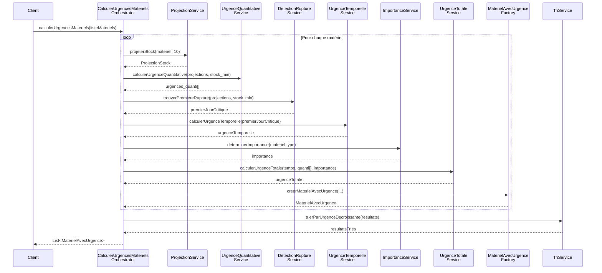

# Décomposition API - Algorithme CalculerUrgencesMateriels

## Vue d'ensemble

L'algorithme `CalculerUrgencesMateriels` est un processeur complexe qui évalue le niveau d'urgence de chaque matériel basé sur plusieurs critères : projection de stock, urgence temporelle, urgence quantitative et importance du type de matériel. Cette analyse détaille la décomposition en services API élémentaires.

## Architecture Microservices

### 1. ProjectionService - Service de Projection de Stock

#### `ProjectionStock`
```java
public interface ProjectionService {
    ProjectionStock projeterStock(Materiel materiel, int nombreJours);
}
```

**Responsabilité** : Calcule la projection de stock jour par jour sur la période donnée
**Entrées** :
- `materiel` : Matériel à analyser
- `nombreJours` : Période de projection (typiquement 10 jours)

**Logique interne** :
```
FONCTION ProjectionStock(materiel, nombreJours)
DEBUT
    projections = TABLEAU taille nombreJours + 1
    projections[0] = materiel.stock_actuel

    POUR jour DE 1 A nombreJours FAIRE
        consommation_jour = CalculerConsommationPrevue(materiel, jour)
        approvisionnements_jour = CalculerApprovisionnementsPrevus(materiel, jour)
        projections[jour] = projections[jour-1] - consommation_jour + approvisionnements_jour
    FIN_POUR

    RETOURNER projections
FIN
```

#### Sous-services associés :
- **`ConsommationPrevisionService`** : Calcule la consommation prévisionnelle
- **`ApprovisionnementService`** : Intègre les réceptions planifiées

### 2. UrgenceQuantitativeService - Service d'Urgence Quantitative

#### `CalculerUrgenceQuantitative`
```java
public interface UrgenceQuantitativeService {
    int[] calculerUrgenceQuantitative(ProjectionStock projections, int stockMinimum);
}
```

**Responsabilité** : Évalue l'urgence basée sur les niveaux de stock par rapport au minimum
**Algorithme** :
```
FONCTION CalculerUrgenceQuantitative(projections, stock_min)
DEBUT
    urgences_quanti = TABLEAU taille projections.length - 1

    POUR jour DE 1 A projections.length - 1 FAIRE
        SI projections[jour] < 0 OU projections[jour] < stock_min ALORS
            urgences_quanti[jour-1] = 100
        SINON
            urgences_quanti[jour-1] = 0
        FIN_SI
    FIN_POUR

    RETOURNER urgences_quanti
FIN
```

**Règles métier** :
- Score 100 si stock projeté < 0 (rupture)
- Score 100 si stock projeté < stock minimum
- Score 0 sinon

### 3. UrgenceTemporelleService - Service d'Urgence Temporelle

#### `CalculerUrgenceTemporelle`
```java
public interface UrgenceTemporelleService {
    int calculerUrgenceTemporelle(int premierJourCritique);
}
```

**Responsabilité** : Évalue l'urgence selon la proximité temporelle de la première rupture

#### Sous-service : `DetectionRuptureService`
```java
public interface DetectionRuptureService {
    int trouverPremiereRupture(ProjectionStock projections, int stockMinimum);
}
```

**Algorithme de détection** :
```
FONCTION TrouverPremiereRupture(projections, stock_min)
DEBUT
    POUR jour DE 1 A projections.length - 1 FAIRE
        SI projections[jour] < stock_min ALORS
            RETOURNER jour
        FIN_SI
    FIN_POUR
    RETOURNER -1  // Pas de rupture
FIN
```

**Algorithme de scoring temporel** :
```
FONCTION CalculerUrgenceTemporelle(premier_jour_critique)
DEBUT
    SI premier_jour_critique = -1 ALORS
        RETOURNER 0  // Pas de rupture
    SINON_SI premier_jour_critique >= 0 ET premier_jour_critique <= 5 ALORS
        RETOURNER 100  // Horizon critique J0-J5
    SINON_SI premier_jour_critique >= 6 ET premier_jour_critique <= 8 ALORS
        RETOURNER 50   // Horizon moyen J6-J8
    SINON
        RETOURNER 0    // Horizon éloigné J9+
    FIN_SI
FIN
```

### 4. ImportanceService - Service de Détermination d'Importance

#### `DeterminerImportance`
```java
public interface ImportanceService {
    int determinerImportance(TypeMateriel typeMateriel);
}
```

**Responsabilité** : Attribue un coefficient d'importance selon le type de matériel

**Mapping d'importance** :
```
FONCTION DeterminerImportance(type)
DEBUT
    SELON type FAIRE
        CAS SCANNABLE:
            RETOURNER 100
        CAS CONSOMMABLE:
            RETOURNER 10
        CAS DECLARABLE:
            RETOURNER 10
        PAR_DEFAUT:
            RETOURNER 0
    FIN_SELON
FIN
```

### 5. UrgenceTotaleService - Service de Calcul d'Urgence Totale

#### `CalculerUrgenceTotale`
```java
public interface UrgenceTotaleService {
    int calculerUrgenceTotale(int urgenceTemporelle, int[] urgencesQuantitatives, int importance);
}
```

**Responsabilité** : Combine tous les critères avec logique de court-circuit

**Algorithme avec court-circuit** :
```
FONCTION CalculerUrgenceTotale(urgence_tempo, urgences_quanti, importance)
DEBUT
    max_urgence_quanti = MAX(urgences_quanti)

    // Logique de court-circuit
    SI urgence_tempo = 0 OU max_urgence_quanti = 0 ALORS
        RETOURNER 0
    SINON
        RETOURNER urgence_tempo + max_urgence_quanti + importance
    FIN_SI
FIN
```

### 6. MaterielAvecUrgenceFactory - Factory de Construction

#### `CreerMaterielAvecUrgence`
```java
public interface MaterielAvecUrgenceFactory {
    MaterielAvecUrgence creerMaterielAvecUrgence(
        Materiel materiel,
        int urgenceTotale,
        int[] urgencesQuantitatives,
        int urgenceTemporelle,
        int importance
    );
}
```

**Responsabilité** : Construit l'objet résultat avec toutes les métriques

### 7. TriService - Service de Tri et Classification

#### `TrierParUrgence`
```java
public interface TriService {
    List<MaterielAvecUrgence> trierParUrgenceDecroissante(List<MaterielAvecUrgence> materiels);
}
```

**Responsabilité** : Ordonne les matériels par niveau d'urgence décroissant

## Orchestrateur Principal

### `CalculerUrgencesMaterielsOrchestrator`
```java
@Service
public class CalculerUrgencesMaterielsOrchestrator {

    @Autowired private ProjectionService projectionService;
    @Autowired private UrgenceQuantitativeService urgenceQuantitativeService;
    @Autowired private UrgenceTemporelleService urgenceTemporelleService;
    @Autowired private DetectionRuptureService detectionRuptureService;
    @Autowired private ImportanceService importanceService;
    @Autowired private UrgenceTotaleService urgenceTotaleService;
    @Autowired private MaterielAvecUrgenceFactory factory;
    @Autowired private TriService triService;

    public List<MaterielAvecUrgence> calculerUrgencesMateriels(List<Materiel> listeMateriels) {
        List<MaterielAvecUrgence> resultats = new ArrayList<>();

        for (Materiel materiel : listeMateriels) {
            // 1. Projection du stock
            ProjectionStock projections = projectionService.projeterStock(materiel, 10);

            // 2. Calcul urgence quantitative
            int[] urgencesQuantitatives = urgenceQuantitativeService
                .calculerUrgenceQuantitative(projections, materiel.getStockMinimum());

            // 3. Calcul urgence temporelle
            int premierJourCritique = detectionRuptureService
                .trouverPremiereRupture(projections, materiel.getStockMinimum());
            int urgenceTemporelle = urgenceTemporelleService
                .calculerUrgenceTemporelle(premierJourCritique);

            // 4. Détermination importance
            int importance = importanceService.determinerImportance(materiel.getType());

            // 5. Calcul urgence totale avec court-circuit
            int urgenceTotale = urgenceTotaleService
                .calculerUrgenceTotale(urgenceTemporelle, urgencesQuantitatives, importance);

            // 6. Construction résultat
            MaterielAvecUrgence resultat = factory.creerMaterielAvecUrgence(
                materiel, urgenceTotale, urgencesQuantitatives, urgenceTemporelle, importance);
            resultats.add(resultat);
        }

        // 7. Tri par urgence décroissante
        return triService.trierParUrgenceDecroissante(resultats);
    }
}
```

## Diagramme de Séquence Détaillé



## Modèles de Données

### `MaterielAvecUrgence`
```java
public class MaterielAvecUrgence {
    private Materiel materiel;
    private int urgenceTotale;
    private int[] urgencesQuantitatives;  // Array de 10 éléments
    private int urgenceTemporelle;
    private int importance;
    private int premierJourCritique;
    private ProjectionStock projections;

    // Getters, setters, constructeurs
}
```

### `ProjectionStock`
```java
public class ProjectionStock {
    private int[] projections;  // Index 0 = J0, Index 1 = J1, etc.
    private LocalDate dateDebut;
    private Materiel materiel;

    // Méthodes utilitaires
    public int getStockJour(int jour);
    public boolean estEnRupture(int jour, int stockMinimum);
}
```

## Tests Unitaires Recommandés

### Tests par Service

1. **ProjectionService**
   - Projection avec consommation constante
   - Projection avec approvisionnements
   - Projection avec consommation variable

2. **UrgenceQuantitativeService**
   - Cas rupture immédiate
   - Cas rupture différée
   - Cas sans rupture

3. **UrgenceTemporelleService**
   - Horizons temporels différents (J0-J5, J6-J8, J9+)
   - Cas sans rupture

4. **UrgenceTotaleService**
   - Test de court-circuit (tempo=0 ou quanti=0)
   - Test de calcul normal
   - Test avec différents niveaux d'importance

### Tests d'Intégration

1. **Orchestrateur complet** avec les cas de test définis dans le ticket JIRA
2. **Performance** sur volumes importants (1000+ matériels)
3. **Cohérence** des résultats entre exécutions

## Bonnes Pratiques d'Implémentation

### 1. Injection de Dépendance
Utiliser Spring Boot avec `@Autowired` pour faciliter les tests et la modularité

### 2. Validation des Entrées
```java
@Valid @NotNull List<Materiel> listeMateriels
```

### 3. Gestion des Erreurs
```java
try {
    // Calculs d'urgence
} catch (StockDataException e) {
    log.error("Erreur données stock pour matériel {}", materiel.getId(), e);
    // Retourner urgence par défaut ou escalader
}
```

### 4. Cache et Performance
```java
@Cacheable("projections-stock")
public ProjectionStock projeterStock(Materiel materiel, int jours)
```

### 5. Monitoring
```java
@Timed(name = "calculer_urgences_materiels", description = "Temps de calcul des urgences")
public List<MaterielAvecUrgence> calculerUrgencesMateriels(...)
```

Cette décomposition en microservices permet une maintenance aisée, des tests unitaires précis et une évolutivité maximale de l'algorithme d'évaluation d'urgence.