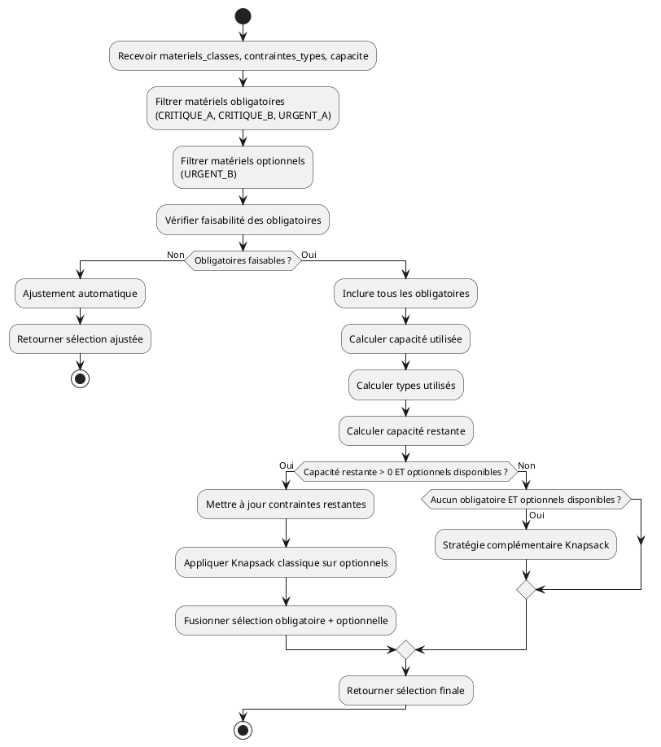
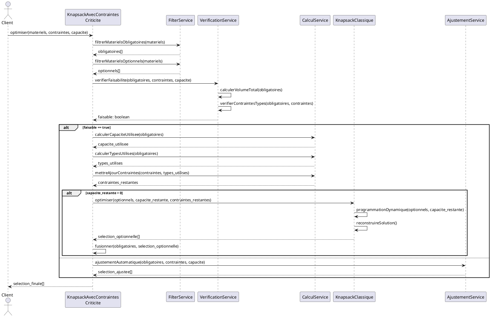
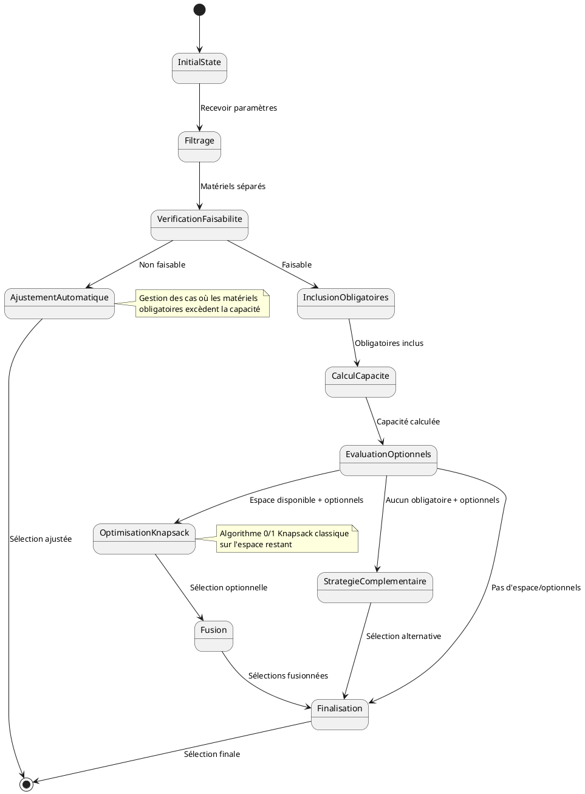

# Analyse de l'Algorithme Knapsack avec Contraintes de Criticité

## Vue d'ensemble

L'algorithme `KnapsackAvecContraintesCriticite` est une adaptation sophistiquée du problème classique du sac à dos (knapsack) qui intègre la notion de criticité des matériels pour optimiser la composition des colis de réapprovisionnement. Contrairement au knapsack classique qui maximise simplement la valeur sous contrainte de capacité, cet algorithme priorise les matériels selon leur niveau d'urgence opérationnelle.

## Architecture et Décomposition en API/Sous-méthodes

### 1. Service Principal

#### `KnapsackAvecContraintesCriticite`
```
FONCTION KnapsackAvecContraintesCriticite(materiels_classes, contraintes_types, capacite)
```
**Rôle** : Orchestrateur principal qui coordonne l'ensemble du processus d'optimisation
**Entrées** :
- `materiels_classes` : Liste des matériels avec leur classification d'urgence
- `contraintes_types` : Limites par type de matériel
- `capacite` : Capacité totale du colis (volume/poids)

### 2. FilterService - Service de Filtrage

#### `FiltrerMaterielsObligatoires`
```
FONCTION FiltrerMaterielsObligatoires(materiels_classes) -> obligatoires[]
```
**Rôle** : Sépare les matériels critiques et urgents de grade A qui doivent être inclus obligatoirement
**Logique** : `FILTRER(grade IN [CRITIQUE_A, CRITIQUE_B, URGENT_A])`

#### `FiltrerMaterielsOptionnels`
```
FONCTION FiltrerMaterielsOptionnels(materiels_classes) -> optionnels[]
```
**Rôle** : Identifie les matériels de grade URGENT_B qui peuvent être optimisés
**Logique** : `FILTRER(grade = URGENT_B)`

### 3. VerificationService - Service de Vérification

#### `VerifierFaisabilite`
```
FONCTION VerifierFaisabilite(obligatoires, contraintes_types, capacite) -> boolean
```
**Rôle** : Vérifie si les matériels obligatoires peuvent physiquement tenir dans le colis
**Vérifications** :
- Volume/poids total ≤ capacité disponible
- Respect des contraintes par type de matériel
- Compatibilité des formats/dimensions

### 4. AjustementService - Service d'Ajustement

#### `AjustementAutomatique`
```
FONCTION AjustementAutomatique(obligatoires, contraintes_types, capacite) -> selection_ajustee[]
```
**Rôle** : Gère les situations où les matériels obligatoires excèdent la capacité
**Stratégies** :
- Retrait des matériels CRITIQUE_B les moins prioritaires
- Fractionnement des quantités si possible
- Proposition d'alternatives équivalentes
- Génération d'alertes pour validation manuelle

### 5. CalculService - Service de Calcul

#### `CalculerCapaciteUtilisee`
```
FONCTION CalculerCapaciteUtilisee(materiels) -> capacite_utilisee
```
**Rôle** : Calcule l'espace total occupé par une sélection de matériels

#### `CalculerTypesUtilises`
```
FONCTION CalculerTypesUtilises(materiels) -> types_utilises
```
**Rôle** : Comptabilise l'utilisation par catégorie de matériel

#### `MiseAJourContraintes`
```
FONCTION MiseAJourContraintes(contraintes_types, types_utilises) -> contraintes_restantes
```
**Rôle** : Recalcule les limites disponibles après inclusion des matériels obligatoires

### 6. KnapsackClassique - Optimisation Traditionnelle

#### `KnapsackClassique`
```
FONCTION KnapsackClassique(optionnels, capacite_restante, contraintes_restantes) -> selection_optionnelle[]
```
**Rôle** : Applique l'algorithme 0/1 knapsack optimisé sur les matériels optionnels
**Algorithme** : Programmation dynamique avec contraintes multiples
**Objectif** : Maximiser la valeur ajoutée dans l'espace restant

### 7. StrategieComplementaire - Stratégie de Fallback

#### `StrategieComplementaireKnapsack`
```
FONCTION StrategieComplementaireKnapsack(optionnels, contraintes_types, capacite) -> selection_complementaire[]
```
**Rôle** : Gère le cas particulier où seuls des matériels URGENT_B sont disponibles
**Stratégie** : Sélection équilibrée maximisant la couverture opérationnelle

## Logique Algorithmique Détaillée

### Phase 1 : Séparation par Criticité
L'algorithme commence par trier les matériels selon leur classification d'urgence :
- **Obligatoires** : CRITIQUE_A, CRITIQUE_B, URGENT_A (inclusion forcée)
- **Optionnels** : URGENT_B (optimisation possible)

Cette séparation reflète la réalité opérationnelle où certains matériels ne peuvent pas être différés.

### Phase 2 : Vérification de Faisabilité
Avant tout traitement, l'algorithme vérifie si les matériels obligatoires peuvent physiquement être inclus. Cette étape préventive évite les calculs inutiles et déclenche les procédures d'ajustement si nécessaire.

### Phase 3 : Inclusion Forcée
Les matériels obligatoires sont automatiquement inclus dans la sélection finale. Cette approche garantit que les besoins critiques sont satisfaits en priorité, respectant ainsi les contraintes opérationnelles.

### Phase 4 : Optimisation Complémentaire
L'espace restant est optimisé via l'algorithme knapsack classique appliqué aux matériels optionnels. Cette phase maximise la valeur ajoutée sans compromettre les besoins essentiels.

### Phase 5 : Stratégie de Fallback
Si aucun matériel obligatoire n'est identifié, l'algorithme active une stratégie alternative qui sélectionne optimalement parmi les matériels URGENT_B disponibles.

## Avantages de l'Architecture

### 1. Séparation des Responsabilités
Chaque service a un rôle clairement défini, facilitant la maintenance et les tests unitaires.

### 2. Flexibilité Opérationnelle
L'approche modulaire permet d'adapter facilement les stratégies selon les contextes métier.

### 3. Gestion des Cas Dégradés
Les services d'ajustement et de stratégie complémentaire assurent une réponse systématique même en cas de contraintes impossibles.

### 4. Optimisation Performance
La vérification préalable évite les calculs coûteux sur des configurations non viables.

## Complexité Algorithmique

- **Complexité temporelle** : O(n×W) où n = nombre matériels optionnels, W = capacité restante
- **Complexité spatiale** : O(n×W) pour la table de programmation dynamique
- **Pré-traitement** : O(n) pour la classification et vérification

## Cas d'Usage et Exemples

### Cas Standard
- Matériels obligatoires : 60% capacité
- Matériels optionnels : optimisation sur 40% restant
- Résultat : Sélection équilibrée respectant les priorités

### Cas de Surcharge
- Matériels obligatoires : 120% capacité
- Déclenchement ajustement automatique
- Résultat : Configuration viable avec alertes

### Cas Minimaliste
- Aucun matériel obligatoire
- Activation stratégie complémentaire
- Résultat : Sélection optimale parmi URGENT_B

## Schémas UML

### Diagramme de Classes

```plantuml
@startuml
class KnapsackAvecContraintesCriticite {
    +optimiser(materiels_classes, contraintes_types, capacite): Selection[]
}

class FilterService {
    +filtrerMaterielsObligatoires(materiels): Materiel[]
    +filtrerMaterielsOptionnels(materiels): Materiel[]
}

class VerificationService {
    +verifierFaisabilite(obligatoires, contraintes, capacite): boolean
    -calculerVolumeTotal(materiels): double
    -verifierContraintesTypes(materiels, contraintes): boolean
}

class AjustementService {
    +ajustementAutomatique(obligatoires, contraintes, capacite): Materiel[]
    -retirerMoinsUrgents(materiels, capacite_cible): Materiel[]
    -proposerAlternatives(materiels): Materiel[]
}

class CalculService {
    +calculerCapaciteUtilisee(materiels): double
    +calculerTypesUtilises(materiels): Map<Type, Integer>
    +mettreAJourContraintes(contraintes, types_utilises): Contraintes
}

class KnapsackClassique {
    +optimiser(materiels, capacite, contraintes): Materiel[]
    -programmationDynamique(items, capacite): boolean[][]
    -reconstruireSolution(dp, items): Materiel[]
}

class StrategieComplementaire {
    +strategieKnapsack(optionnels, contraintes, capacite): Materiel[]
    -equilibrerTypes(materiels, contraintes): Materiel[]
}

class Materiel {
    +id: String
    +nom: String
    +type: TypeMateriel
    +volume: double
    +poids: double
    +gradeUrgence: GradeUrgence
    +valeur: double
}

enum GradeUrgence {
    CRITIQUE_A
    CRITIQUE_B
    URGENT_A
    URGENT_B
    SAFE
}

enum TypeMateriel {
    SCANNABLE
    CONSOMMABLE
    DECLARABLE
}

KnapsackAvecContraintesCriticite --> FilterService
KnapsackAvecContraintesCriticite --> VerificationService
KnapsackAvecContraintesCriticite --> AjustementService
KnapsackAvecContraintesCriticite --> CalculService
KnapsackAvecContraintesCriticite --> KnapsackClassique
KnapsackAvecContraintesCriticite --> StrategieComplementaire

FilterService ..> Materiel
VerificationService ..> Materiel
AjustementService ..> Materiel
CalculService ..> Materiel
KnapsackClassique ..> Materiel
StrategieComplementaire ..> Materiel
@enduml
```



### Diagramme d'Activité



### Diagramme de Séquence Détaillé avec Interactions



### Diagramme d'États de l'Optimisation



## Patterns de Conception Utilisés

### 1. Strategy Pattern
Les différentes stratégies d'optimisation (KnapsackClassique, StrategieComplementaire) implémentent une interface commune permettant de changer d'algorithme selon le contexte.

### 2. Template Method Pattern
L'orchestrateur principal suit un template fixe (filtrage → vérification → inclusion → optimisation) avec des variations selon les cas.

### 3. Chain of Responsibility Pattern
Les services de vérification et d'ajustement forment une chaîne de traitement des cas d'exception.

### 4. Factory Pattern
La création des structures `MaterielAvecUrgence` est centralisée via des méthodes factory.

## Métriques de Performance

### Complexité Spatiale Détaillée
- **Stockage matériels** : O(n) où n = nombre de matériels
- **Table programmation dynamique** : O(m×W) où m = matériels optionnels, W = capacité restante
- **Structures intermédiaires** : O(n) pour les listes de filtrage

### Complexité Temporelle par Phase
1. **Filtrage** : O(n) - parcours linéaire
2. **Vérification** : O(n) - calcul volume total
3. **Inclusion** : O(1) - assignation directe
4. **Optimisation** : O(m×W) - programmation dynamique
5. **Fusion** : O(n) - concaténation listes

### Optimisations Possibles
- **Cache des calculs** : Mémorisation des résultats de vérification
- **Parallélisation** : Traitement concurrent des matériels optionnels
- **Approximation** : Algorithmes gloutons pour réduire la complexité

## Intégration Système

L'algorithme s'intègre dans le flux global de réapprovisionnement :
1. **Entrée** : Matériels classifiés par le module d'évaluation d'urgence
2. **Traitement** : Optimisation knapsack avec contraintes de criticité
3. **Sortie** : Composition de colis optimisée pour validation

Cette approche garantit une cohérence end-to-end du processus de réapprovisionnement automatique.
