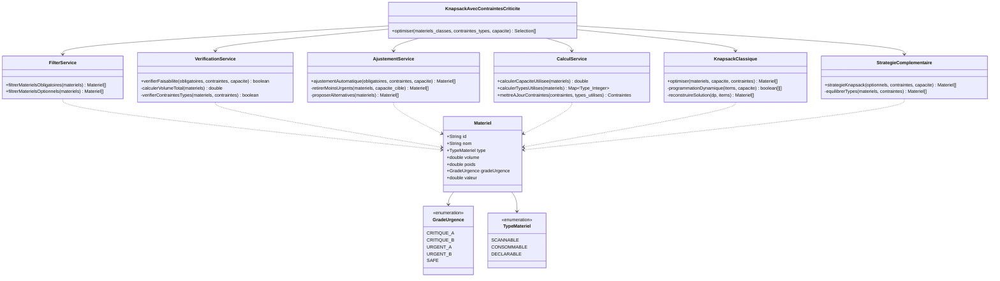
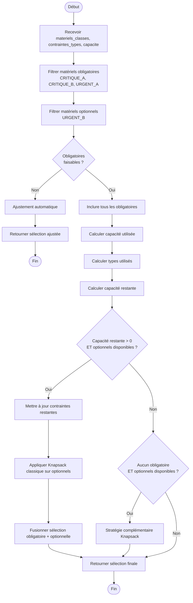
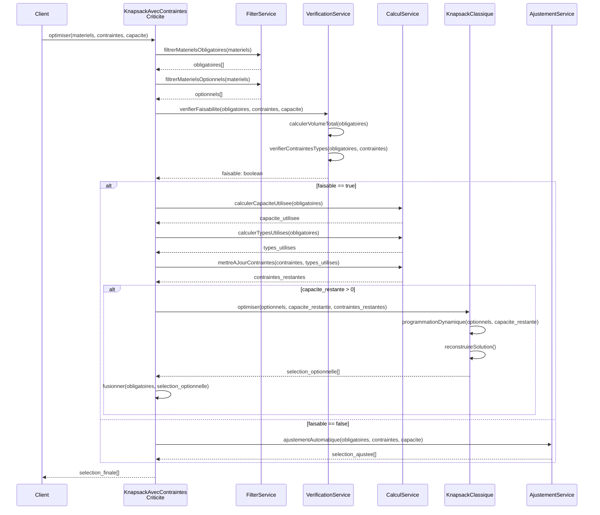
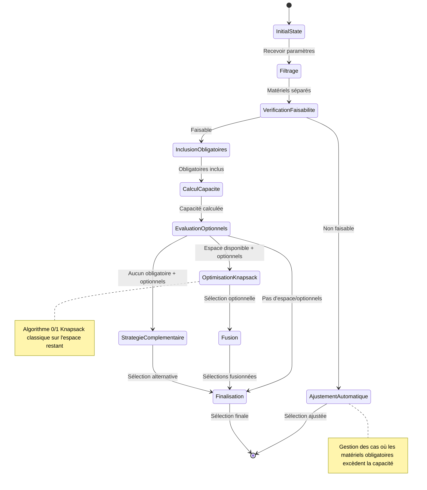

# Analyse de l'Algorithme Knapsack avec Contraintes de Criticité


### **Algorithme Knapsack Contraint**

```pseudocode
FONCTION KnapsackAvecContraintesCriticite(materiels_classes, contraintes_types, capacite)
DEBUT
    // 1. Séparation par priorité basée sur classification d'urgence
    obligatoires = FILTRER(materiels_classes, grade IN [CRITIQUE_A, CRITIQUE_B, URGENT_A])
    optionnels = FILTRER(materiels_classes, grade = URGENT_B)
    
    // 2. Vérification faisabilité obligatoires
    SI NON VerifierFaisabilite(obligatoires, contraintes_types, capacite) ALORS
        RETOURNER AjustementAutomatique(obligatoires, contraintes_types, capacite)
    FIN_SI
    
    // 3. Inclusion forcée des matériels critiques et urgents A
    selection = obligatoires
    capacite_utilisee = CalculerCapaciteUtilisee(obligatoires)
    types_utilises = CalculerTypesUtilises(obligatoires)
    
    // 4. Optimisation avec matériels optionnels (Urgent B)
    capacite_restante = capacite - capacite_utilisee
    contraintes_restantes = MiseAJourContraintes(contraintes_types, types_utilises)
    
    SI capacite_restante > 0 ET TAILLE(optionnels) > 0 ALORS
        selection_optionnelle = KnapsackClassique(optionnels, capacite_restante, contraintes_restantes)
        selection = FUSIONNER(selection, selection_optionnelle)
    FIN_SI
    
    // 5. Stratégie complémentaire si seulement Urgent B
    SI TAILLE(obligatoires) = 0 ET TAILLE(optionnels) > 0 ALORS
        selection = StrategieComplementaireKnapsack(optionnels, contraintes_types, capacite)
    FIN_SI
    
    RETOURNER selection
FIN
``

## Vue d'ensemble

L'algorithme `KnapsackAvecContraintesCriticite` est une adaptation sophistiquée du problème classique du sac à dos (knapsack) qui intègre la notion de criticité des matériels pour optimiser la composition des colis de réapprovisionnement. Contrairement au knapsack classique qui maximise simplement la valeur sous contrainte de capacité, cet algorithme priorise les matériels selon leur niveau d'urgence opérationnelle.

## Architecture et Décomposition en API/Sous-méthodes

### 1. Service Principal

#### `KnapsackAvecContraintesCriticite`
```
FONCTION KnapsackAvecContraintesCriticite(materiels_classes, contraintes_types, capacite)
```
**Rôle** : Orchestrateur principal qui coordonne l'ensemble du processus d'optimisation
**Entrées** :
- `materiels_classes` : Liste des matériels avec leur classification d'urgence
- `contraintes_types` : Limites par type de matériel
- `capacite` : Capacité totale du colis (volume/poids)

### 2. FilterService - Service de Filtrage

#### `FiltrerMaterielsObligatoires`
```
FONCTION FiltrerMaterielsObligatoires(materiels_classes) -> obligatoires[]
```
**Rôle** : Sépare les matériels critiques et urgents de grade A qui doivent être inclus obligatoirement
**Logique** : `FILTRER(grade IN [CRITIQUE_A, CRITIQUE_B, URGENT_A])`

#### `FiltrerMaterielsOptionnels`
```
FONCTION FiltrerMaterielsOptionnels(materiels_classes) -> optionnels[]
```
**Rôle** : Identifie les matériels de grade URGENT_B qui peuvent être optimisés
**Logique** : `FILTRER(grade = URGENT_B)`

### 3. VerificationService - Service de Vérification

#### `VerifierFaisabilite`
```
FONCTION VerifierFaisabilite(obligatoires, contraintes_types, capacite) -> boolean
```
**Rôle** : Vérifie si les matériels obligatoires peuvent physiquement tenir dans le colis
**Vérifications** :
- Volume/poids total ≤ capacité disponible
- Respect des contraintes par type de matériel
- Compatibilité des formats/dimensions

### 4. AjustementService - Service d'Ajustement

#### `AjustementAutomatique`
```
FONCTION AjustementAutomatique(obligatoires, contraintes_types, capacite) -> selection_ajustee[]
```
**Rôle** : Gère les situations où les matériels obligatoires excèdent la capacité
**Stratégies** :
- Retrait des matériels CRITIQUE_B les moins prioritaires
- Fractionnement des quantités si possible
- Proposition d'alternatives équivalentes
- Génération d'alertes pour validation manuelle

### 5. CalculService - Service de Calcul

#### `CalculerCapaciteUtilisee`
```
FONCTION CalculerCapaciteUtilisee(materiels) -> capacite_utilisee
```
**Rôle** : Calcule l'espace total occupé par une sélection de matériels

#### `CalculerTypesUtilises`
```
FONCTION CalculerTypesUtilises(materiels) -> types_utilises
```
**Rôle** : Comptabilise l'utilisation par catégorie de matériel

#### `MiseAJourContraintes`
```
FONCTION MiseAJourContraintes(contraintes_types, types_utilises) -> contraintes_restantes
```
**Rôle** : Recalcule les limites disponibles après inclusion des matériels obligatoires

### 6. KnapsackClassique - Optimisation Traditionnelle

#### `KnapsackClassique`
```
FONCTION KnapsackClassique(optionnels, capacite_restante, contraintes_restantes) -> selection_optionnelle[]
```
**Rôle** : Applique l'algorithme 0/1 knapsack optimisé sur les matériels optionnels
**Algorithme** : Programmation dynamique avec contraintes multiples
**Objectif** : Maximiser la valeur ajoutée dans l'espace restant

### 7. StrategieComplementaire - Stratégie de Fallback

#### `StrategieComplementaireKnapsack`
```
FONCTION StrategieComplementaireKnapsack(optionnels, contraintes_types, capacite) -> selection_complementaire[]
```
**Rôle** : Gère le cas particulier où seuls des matériels URGENT_B sont disponibles
**Stratégie** : Sélection équilibrée maximisant la couverture opérationnelle

## Logique Algorithmique Détaillée

### Phase 1 : Séparation par Criticité
L'algorithme commence par trier les matériels selon leur classification d'urgence :
- **Obligatoires** : CRITIQUE_A, CRITIQUE_B, URGENT_A (inclusion forcée)
- **Optionnels** : URGENT_B (optimisation possible)

Cette séparation reflète la réalité opérationnelle où certains matériels ne peuvent pas être différés.

### Phase 2 : Vérification de Faisabilité
Avant tout traitement, l'algorithme vérifie si les matériels obligatoires peuvent physiquement être inclus. Cette étape préventive évite les calculs inutiles et déclenche les procédures d'ajustement si nécessaire.

### Phase 3 : Inclusion Forcée
Les matériels obligatoires sont automatiquement inclus dans la sélection finale. Cette approche garantit que les besoins critiques sont satisfaits en priorité, respectant ainsi les contraintes opérationnelles.

### Phase 4 : Optimisation Complémentaire
L'espace restant est optimisé via l'algorithme knapsack classique appliqué aux matériels optionnels. Cette phase maximise la valeur ajoutée sans compromettre les besoins essentiels.

### Phase 5 : Stratégie de Fallback
Si aucun matériel obligatoire n'est identifié, l'algorithme active une stratégie alternative qui sélectionne optimalement parmi les matériels URGENT_B disponibles.

## Avantages de l'Architecture

### 1. Séparation des Responsabilités
Chaque service a un rôle clairement défini, facilitant la maintenance et les tests unitaires.

### 2. Flexibilité Opérationnelle
L'approche modulaire permet d'adapter facilement les stratégies selon les contextes métier.

### 3. Gestion des Cas Dégradés
Les services d'ajustement et de stratégie complémentaire assurent une réponse systématique même en cas de contraintes impossibles.

### 4. Optimisation Performance
La vérification préalable évite les calculs coûteux sur des configurations non viables.

## Complexité Algorithmique

- **Complexité temporelle** : O(n×W) où n = nombre matériels optionnels, W = capacité restante
- **Complexité spatiale** : O(n×W) pour la table de programmation dynamique
- **Pré-traitement** : O(n) pour la classification et vérification

## Cas d'Usage et Exemples

### Cas Standard
- Matériels obligatoires : 60% capacité
- Matériels optionnels : optimisation sur 40% restant
- Résultat : Sélection équilibrée respectant les priorités

### Cas de Surcharge
- Matériels obligatoires : 120% capacité
- Déclenchement ajustement automatique
- Résultat : Configuration viable avec alertes

### Cas Minimaliste
- Aucun matériel obligatoire
- Activation stratégie complémentaire
- Résultat : Sélection optimale parmi URGENT_B

## Schémas UML

### Diagramme de Classes



### Diagramme d'Activité



### Diagramme de Séquence Détaillé avec Interactions



### Diagramme d'États de l'Optimisation



#### Explication Détaillée du Diagramme d'États

Le diagramme d'états modélise le cycle de vie complet de l'algorithme d'optimisation Knapsack avec contraintes de criticité. Chaque état représente une phase distincte du traitement, avec des transitions conditionnelles basées sur les résultats des calculs précédents.

##### **État Initial** → **InitialState**
- **Déclencheur** : Invocation de l'algorithme par un client externe
- **Conditions d'entrée** : Réception des paramètres d'entrée (materiels_classes, contraintes_types, capacite)
- **Actions internes** : Validation des paramètres d'entrée, initialisation des structures de données
- **Invariants** :
  - `materiels_classes != null && !materiels_classes.isEmpty()`
  - `capacite > 0`
  - `contraintes_types != null`
- **Transition automatique** : Vers l'état Filtrage dès validation réussie

##### **État Filtrage**
- **Responsabilité** : Séparation des matériels par niveau de criticité
- **Actions exécutées** :
  - Parcours de `materiels_classes` et application des filtres
  - Construction de `obligatoires[]` = {CRITIQUE_A, CRITIQUE_B, URGENT_A}
  - Construction de `optionnels[]` = {URGENT_B}
  - Exclusion implicite des matériels SAFE (non traités)
- **Données produites** :
  - Liste des matériels obligatoires avec leurs métadonnées (volume, poids, contraintes)
  - Liste des matériels optionnels avec leurs ratios valeur/poids
- **Conditions de sortie** : Filtrage terminé avec au moins une liste non vide
- **Transition** : Vers VerificationFaisabilite avec les listes constituées

##### **État VerificationFaisabilite**
- **Objectif critique** : Éviter les calculs coûteux sur des configurations impossibles
- **Algorithme de vérification** :
  1. **Calcul du volume total obligatoire** : `∑(volume_i) pour i ∈ obligatoires`
  2. **Calcul du poids total obligatoire** : `∑(poids_i) pour i ∈ obligatoires`
  3. **Vérification capacité** : `volume_total <= capacite.volume && poids_total <= capacite.poids`
  4. **Vérification contraintes types** : Pour chaque type T, `count(obligatoires, T) <= contraintes_types[T].limite`
- **Métriques calculées** :
  - Taux de remplissage des obligatoires : `volume_obligatoires / capacite_totale`
  - Violations de contraintes par type
- **Points de décision** :
  - **Si faisable** : Les matériels obligatoires peuvent être inclus → InclusionObligatoires
  - **Si non faisable** : Surcharge détectée → AjustementAutomatique

##### **État AjustementAutomatique** (Chemin d'Exception)
- **Contexte critique** : Les matériels obligatoires excèdent la capacité disponible
- **Stratégies d'ajustement hiérarchisées** :
  1. **Retrait prioritaire** : Élimination des CRITIQUE_B les moins urgents
  2. **Fractionnement intelligent** : Division des quantités si matériel divisible
  3. **Substitution équivalente** : Remplacement par des alternatives plus compactes
  4. **Escalade manuelle** : Génération d'alertes pour validation humaine
- **Algorithme de retrait** :
  ```
  TANT QUE (volume_obligatoires > capacite_disponible) ET (CRITIQUE_B_disponibles)
      materiel_moins_urgent = MIN(CRITIQUE_B, urgence_totale)
      RETIRER(materiel_moins_urgent, obligatoires)
      RECALCULER(volume_obligatoires)
  FIN_TANT_QUE
  ```
- **Données de sortie** : Configuration ajustée avec alertes et justifications
- **Transition terminale** : Vers [*] avec sélection_ajustée + métadonnées d'ajustement

##### **État InclusionObligatoires** (Chemin Principal)
- **Garantie algorithmique** : Inclusion forcée et non négociable des matériels critiques
- **Actions atomiques** :
  - Ajout de tous les matériels obligatoires à la sélection finale
  - Marquage des matériels comme "inclus" pour audit
  - Validation post-inclusion des contraintes
- **Structures mises à jour** :
  - `selection_courante = obligatoires.copy()`
  - `materiels_inclus_audit = obligatoires.metadata()`
- **Transition automatique** : Vers CalculCapacite

##### **État CalculCapacite**
- **Calculs de consommation des ressources** :
  - **Capacité utilisée** : `capacite_utilisee = ∑(volume_i + poids_i) pour i ∈ obligatoires`
  - **Types consommés** : `types_utilises[T] = count(obligatoires, type=T) pour T ∈ TypeMateriel`
  - **Capacité restante** : `capacite_restante = capacite_totale - capacite_utilisee`
- **Mise à jour des contraintes** :
  ```
  POUR CHAQUE type T DANS TypeMateriel
      contraintes_restantes[T] = contraintes_types[T] - types_utilises[T]
  FIN_POUR
  ```
- **Métriques de performance** :
  - Taux d'utilisation : `capacite_utilisee / capacite_totale`
  - Marge disponible par type de matériel
- **Transition** : Vers EvaluationOptionnels avec les capacités mises à jour

##### **État EvaluationOptionnels** (Point de Divergence Majeur)
- **Rôle stratégique** : Détermination de la stratégie d'optimisation selon le contexte
- **Analyse des conditions** :
  1. **Condition A** : `capacite_restante > 0 && !optionnels.isEmpty()`
  2. **Condition B** : `obligatoires.isEmpty() && !optionnels.isEmpty()`
  3. **Condition C** : `capacite_restante <= 0 || optionnels.isEmpty()`

- **Matrice de décision** :
  | Obligatoires | Optionnels | Capacité restante | Transition |
  |--------------|------------|------------------|------------|
  | ✓ | ✓ | > 0 | OptimisationKnapsack |
  | ✗ | ✓ | > 0 | StrategieComplementaire |
  | ✓/✗ | ✗ | * | Finalisation |
  | ✓ | ✓ | ≤ 0 | Finalisation |

- **Transitions multiples possibles** selon évaluation contextuelle

##### **État OptimisationKnapsack** (Cœur Algorithmique)
- **Algorithme sous-jacent** : 0/1 Knapsack avec programmation dynamique
- **Complexité** : O(n×W) où n = |optionnels|, W = capacite_restante
- **Fonction d'optimisation** : Maximiser `∑(valeur_i × x_i)` sous contraintes
- **Contraintes multiples** :
  - Volume : `∑(volume_i × x_i) ≤ capacite_restante.volume`
  - Poids : `∑(poids_i × x_i) ≤ capacite_restante.poids`
  - Types : `∑(x_i | type_i = T) ≤ contraintes_restantes[T]` ∀T
- **Variables de décision** : `x_i ∈ {0,1}` pour chaque matériel optionnel i
- **Table de programmation dynamique** : `dp[i][w]` = valeur optimale avec les i premiers objets et capacité w
- **Reconstruction de solution** : Backtracking depuis `dp[n][W]`
- **Transition** : Vers Fusion avec selection_optionnelle optimisée

##### **État StrategieComplementaire** (Stratégie Alternative)
- **Contexte d'activation** : Aucun matériel obligatoire, optimisation pure sur URGENT_B
- **Objectifs stratégiques** :
  - Maximiser la couverture opérationnelle
  - Équilibrer les types de matériels
  - Optimiser le rapport valeur/volume global
- **Algorithme spécialisé** :
  1. **Phase 1** : Sélection goulue par ratio valeur/poids décroissant
  2. **Phase 2** : Équilibrage par type pour éviter la monopolisation
  3. **Phase 3** : Optimisation fine par échange local (Local Search)
- **Métriques d'équilibrage** :
  - Distribution par type : `ratio[T] = count(selection, T) / count(optionnels, T)`
  - Écart-type des ratios pour mesurer l'équilibre
- **Transition** : Vers Finalisation avec selection_complementaire

##### **État Fusion**
- **Opération atomique** : Combinaison des sélections obligatoire et optionnelle
- **Validations post-fusion** :
  - Vérification de non-dépassement des capacités totales
  - Contrôle de cohérence des contraintes de types
  - Audit de traçabilité (obligatoires vs. optionnels)
- **Structure de données finale** :
  ```
  selection_finale = {
      obligatoires: [...],
      optionnels: [...],
      metadata: {
          capacite_utilisee_totale,
          types_distribues,
          valeur_totale,
          efficacite_remplissage
      }
  }
  ```
- **Transition** : Vers Finalisation avec sélection fusionnée

##### **État Finalisation** (Convergence Finale)
- **Consolidation des résultats** : Préparation du livrable final pour le client
- **Calculs de métriques finales** :
  - **Taux de remplissage** : `capacite_utilisee / capacite_totale`
  - **Distribution par criticité** : Nombre de matériels par grade d'urgence
  - **Valeur totale optimisée** : Somme des valeurs des matériels sélectionnés
  - **Efficacité d'optimisation** : Ratio valeur obtenue / valeur théorique maximale
- **Rapports et logs** :
  - Journal des décisions prises
  - Alertes et recommandations
  - Métriques de performance algorithmique
- **Transition terminale** : Vers [*] avec selection_finale complète

#### Invariants du Système d'États

##### Invariants Globaux (Maintenues dans tous les états)
- **I1** : `materiels_total = |obligatoires| + |optionnels| + |exclus|`
- **I2** : `capacite_utilisee ≤ capacite_totale` (jamais de dépassement après ajustement)
- **I3** : `selection_courante ⊆ materiels_input` (pas de création de matériels)

##### Invariants de Transition
- **IT1** : Les matériels obligatoires ne sont jamais retirés après InclusionObligatoires
- **IT2** : La capacité restante est monotone décroissante
- **IT3** : Chaque transition produit un progrès mesurable vers la solution finale

#### Conditions d'Exception et Gestion d'Erreurs

##### États d'Exception
- **OutOfMemoryState** : Si la table de programmation dynamique dépasse la mémoire disponible
- **TimeoutState** : Si l'optimisation dépasse le timeout configuré
- **CorruptDataState** : Si les données d'entrée sont incohérentes

##### Stratégies de Récupération
- **Dégradation gracieuse** : Passage à des algorithmes approchés en cas de contraintes strictes
- **Checkpointing** : Sauvegarde des états intermédiaires pour reprise possible
- **Logging détaillé** : Traçabilité complète pour debugging post-mortem

Cette modélisation par états permet une compréhension fine de l'algorithme et facilite sa maintenance, son testing et son extension future.

## Patterns de Conception Utilisés

### 1. Strategy Pattern
Les différentes stratégies d'optimisation (KnapsackClassique, StrategieComplementaire) implémentent une interface commune permettant de changer d'algorithme selon le contexte.

### 2. Template Method Pattern
L'orchestrateur principal suit un template fixe (filtrage → vérification → inclusion → optimisation) avec des variations selon les cas.

### 3. Chain of Responsibility Pattern
Les services de vérification et d'ajustement forment une chaîne de traitement des cas d'exception.

### 4. Factory Pattern
La création des structures `MaterielAvecUrgence` est centralisée via des méthodes factory.

## Métriques de Performance

### Complexité Spatiale Détaillée
- **Stockage matériels** : O(n) où n = nombre de matériels
- **Table programmation dynamique** : O(m×W) où m = matériels optionnels, W = capacité restante
- **Structures intermédiaires** : O(n) pour les listes de filtrage

### Complexité Temporelle par Phase
1. **Filtrage** : O(n) - parcours linéaire
2. **Vérification** : O(n) - calcul volume total
3. **Inclusion** : O(1) - assignation directe
4. **Optimisation** : O(m×W) - programmation dynamique
5. **Fusion** : O(n) - concaténation listes

### Optimisations Possibles
- **Cache des calculs** : Mémorisation des résultats de vérification
- **Parallélisation** : Traitement concurrent des matériels optionnels
- **Approximation** : Algorithmes gloutons pour réduire la complexité

## Intégration Système

L'algorithme s'intègre dans le flux global de réapprovisionnement :
1. **Entrée** : Matériels classifiés par le module d'évaluation d'urgence
2. **Traitement** : Optimisation knapsack avec contraintes de criticité
3. **Sortie** : Composition de colis optimisée pour validation

Cette approche garantit une cohérence end-to-end du processus de réapprovisionnement automatique.
