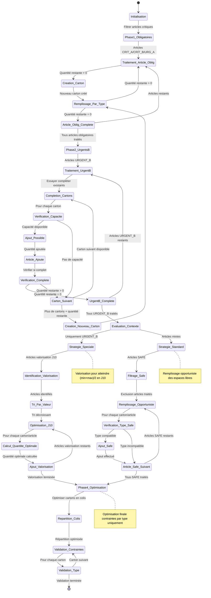

# Analyse de l'Algorithme KnapsackModifieParCriticite

## Vue d'ensemble

L'algorithme `KnapsackModifieParCriticite` est une adaptation spécialisée du problème du knapsack qui optimise la répartition d'articles dans des cartons et colis selon leur niveau de criticité. Contrairement au knapsack classique, cet algorithme suit une approche séquentielle en 4 phases distinctes, privilégiant la satisfaction des besoins critiques avant l'optimisation de l'espace restant.

## Architecture et Phases Algorithmiques

### Phase 1 : Articles Obligatoires (CRIT_A + CRIT_B + URG_A)
- **Garantie d'inclusion** : Tous les articles critiques doivent être traités
- **Création de cartons dédiés** : Un carton par type d'article si nécessaire
- **Pas de contrainte de capacité** : La criticité prime sur l'optimisation d'espace

### Phase 2 : Urgents B - Optimisation Opportuniste
- **Complétion prioritaire** : Utilisation de l'espace libre des cartons existants
- **Création conditionnelle** : Nouveaux cartons uniquement si nécessaire
- **Double stratégie** : Optimisation puis création

### Phase 3 : Stratégie Contextuelle
- **Branchement conditionnel** : Comportement différent selon la composition des articles
- **Stratégie spéciale** : Valorisation J10 si uniquement URGENT_B
- **Stratégie standard** : Remplissage opportuniste avec articles SAFE

### Phase 4 : Optimisation Finale
- **Répartition en colis** : Optimisation de la distribution des cartons
- **Validation des contraintes** : Contrôle final par type d'article

## Diagramme d'États de l'Algorithme



## Explication Détaillée du Diagramme d'États

### **État Initialisation**
- **Déclencheur** : Invocation de l'algorithme avec liste_articles
- **Actions internes** :
  - Initialisation des structures : `cartons ← []`, `colis ← []`, `articles_traités ← []`
  - Validation des paramètres d'entrée
  - Préparation des filtres de criticité
- **Invariants** :
  - `liste_articles != null && !liste_articles.isEmpty()`
  - Toutes les listes internes sont vides
- **Transition** : Vers Phase1_Obligatoires avec structures initialisées

### **État Phase1_Obligatoires** (Traitement Prioritaire)
- **Objectif critique** : Garantir l'inclusion de tous les articles critiques sans exception
- **Filtrage** : `FiltrerParCriticite(liste_articles, ["CRIT_A", "CRIT_B", "URG_A"])`
- **Principe fondamental** : La criticité prime sur l'efficacité d'espace
- **Invariant de phase** : Aucun article critique ne peut être ignoré
- **Transition** : Vers Traitement_Article_Oblig avec liste filtrée

### **État Traitement_Article_Oblig**
- **Logique itérative** : Traitement séquentiel de chaque article obligatoire
- **Variable d'état** : `quantite_restante ← article.quantite_besoin`
- **Condition de boucle** : `TANT QUE quantite_restante > 0`
- **Garantie de complétude** : Chaque article obligatoire sera entièrement traité
- **Transitions multiples** :
  - Si `quantite_restante > 0` → Creation_Carton
  - Si `quantite_restante = 0` → Article_Oblig_Complete

### **État Creation_Carton**
- **Action atomique** : `carton ← NouveauCarton()`
- **Initialisation carton** :
  - Capacité maximale selon type de carton
  - Contraintes de compatibilité par type d'article
  - Métriques de remplissage initialisées à zéro
- **Transition automatique** : Vers Remplissage_Par_Type

### **État Remplissage_Par_Type**
- **Algorithme de remplissage** : `RemplirCartonParType(carton, article, quantite_restante)`
- **Logique de maximisation** :
  ```
  quantite_max_possible = MIN(
      quantite_restante,
      carton.capacite_libre / article.volume_unitaire,
      contraintes_type[article.type].limite_restante
  )
  ```
- **Mise à jour** :
  - `quantite_ajoutee ← quantite_max_possible`
  - `cartons.ajouter(carton)`
  - `quantite_restante ← quantite_restante - quantite_ajoutee`
- **Transitions conditionnelles** :
  - Si `quantite_restante > 0` → Traitement_Article_Oblig (nouvelle itération)
  - Si `quantite_restante = 0` → Article_Oblig_Complete

### **État Article_Oblig_Complete**
- **Finalisation article** : Ajout à `articles_traités.ajouter(article)`
- **Vérification de complétude de phase** :
  - Si articles obligatoires restants → Traitement_Article_Oblig
  - Si tous traités → Phase2_UrgentsB
- **Métriques intermédiaires** : Calcul de l'utilisation des cartons après phase 1

### **État Phase2_UrgentsB** (Optimisation Opportuniste)
- **Stratégie double** : Complétion puis création
- **Filtrage** : Articles avec grade URGENT_B
- **Objectif** : Maximiser l'utilisation de l'espace libre des cartons existants
- **Transition** : Vers Traitement_UrgentB avec liste URGENT_B

### **État Traitement_UrgentB**
- **Logique similaire** : Traitement séquentiel avec `quantite_restante`
- **Différence clé** : Tentative de complétion avant création
- **Transition** : Vers Completion_Cartons

### **État Completion_Cartons**
- **Parcours séquentiel** : `POUR CHAQUE carton DANS cartons`
- **Objectif** : Utiliser l'espace libre disponible
- **Transition** : Vers Verification_Capacite pour chaque carton

### **État Verification_Capacite**
- **Tests de compatibilité** :
  1. `carton.PeutAjouterType(article.type)` - Contrainte de type
  2. `carton.CalculerQuantiteMaxPossible(article)` - Contrainte de capacité
- **Calculs** :
  ```
  quantite_possible = MIN(
      (carton.capacite_totale - carton.capacite_utilisee) / article.volume,
      contraintes_type[article.type].limite_carton_restante
  )
  ```
- **Transitions** :
  - Si `quantite_possible > 0` → Ajout_Possible
  - Si `quantite_possible = 0` → Carton_Suivant

### **État Ajout_Possible**
- **Calcul optimal** : `quantite_ajoutee ← MIN(quantite_restante, quantite_possible)`
- **Action atomique** : `carton.AjouterArticle(article, quantite_ajoutee)`
- **Mise à jour** : `quantite_restante ← quantite_restante - quantite_ajoutee`
- **Transition** : Vers Article_Ajoute

### **État Verification_Complete**
- **Test de complétude** : `quantite_restante = 0 ?`
- **Transitions conditionnelles** :
  - Si `quantite_restante = 0` → UrgentB_Complete
  - Si `quantite_restante > 0` → Carton_Suivant

### **État Carton_Suivant**
- **Logique de continuation** : Passage au carton suivant pour tentative de complétion
- **Conditions de sortie** :
  - Si cartons restants → Completion_Cartons
  - Si plus de cartons ET `quantite_restante > 0` → Creation_Nouveau_Carton

### **État Creation_Nouveau_Carton**
- **Action identique** : Création d'un nouveau carton pour quantité non placée
- **Transition** : Vers Remplissage_Par_Type (réutilisation logique Phase 1)

### **État Evaluation_Contexte** (Point de Divergence Majeur)
- **Test stratégique** : `SeulementUrgentsB(liste_articles)`
- **Analyse de composition** : Détermination de la stratégie de Phase 3
- **Matrice de décision** :
  | Composition articles | Stratégie | Objectif |
  |---------------------|-----------|----------|
  | Uniquement URGENT_B | Spéciale | Valorisation J10 |
  | Articles mixtes | Standard | Remplissage opportuniste |
- **Transitions** :
  - Si uniquement URGENT_B → Strategie_Speciale
  - Si composition mixte → Strategie_Standard

### **État Strategie_Speciale** (Valorisation J10)
- **Contexte spécifique** : Optimisation avancée pour scenario URGENT_B pur
- **Objectif stratégique** : Atteindre `(stock_min + stock_max) / 2` en J10
- **Transition** : Vers Identification_Valorisation

### **État Identification_Valorisation**
- **Algorithme de sélection** : `IdentifierArticlesValorisationJ10()`
- **Critères d'identification** :
  - Articles avec potentiel de valorisation en J10
  - Ratio valeur/volume favorable
  - Compatibilité avec cartons existants
- **Transition** : Vers Tri_Par_Valeur si articles identifiés

### **État Tri_Par_Valeur**
- **Algorithme de tri** : `TRIER articles_valorisation PAR valeur DESCENDANT`
- **Objectif** : Prioriser les articles à plus forte valeur ajoutée
- **Transition** : Vers Optimisation_J10

### **État Optimisation_J10**
- **Double boucle imbriquée** :
  ```
  POUR CHAQUE carton DANS cartons
      POUR CHAQUE article DANS articles_valorisation
  ```
- **Transition** : Vers Calcul_Quantite_Optimale pour chaque combinaison

### **État Calcul_Quantite_Optimale**
- **Algorithme spécialisé** : `CalculerQuantiteOptimaleJ10(article)`
- **Formule d'optimisation** : Équilibrage entre objectif J10 et capacité disponible
- **Variables** :
  - `quantite_optimale` : Quantité idéale pour atteindre objectif J10
  - `quantite_possible` : Quantité maximale compatible avec carton
  - `quantite_ajoutee` : `MIN(quantite_optimale, quantite_possible)`
- **Transition** : Vers Ajout_Valorisation

### **État Ajout_Valorisation**
- **Actions atomiques** :
  - `carton.AjouterArticle(article, quantite_ajoutee)`
  - `article.quantite_valorisation ← article.quantite_valorisation - quantite_ajoutee`
- **Logique de continuation** : Retour vers Optimisation_J10 si articles restants
- **Condition de sortie** : Vers Phase4_Optimisation si valorisation terminée

### **État Strategie_Standard** (Remplissage Opportuniste)
- **Contexte** : Articles de composition mixte avec présence d'articles SAFE
- **Transition** : Vers Filtrage_Safe

### **État Filtrage_Safe**
- **Filtrage** : `articles_safe ← FiltrerParCriticite(liste_articles, ["SAFE"])`
- **Exclusion** : `SOUSTRACTION(articles_safe, articles_traités)`
- **Objectif** : Identifier articles SAFE non encore traités
- **Transition** : Vers Remplissage_Opportuniste

### **État Remplissage_Opportuniste**
- **Stratégie conservative** : Utiliser uniquement l'espace libre disponible
- **Double boucle** :
  ```
  POUR CHAQUE carton DANS cartons
      POUR CHAQUE article DANS articles_safe
  ```
- **Principe** : Pas de création de nouveaux cartons pour articles SAFE
- **Transition** : Vers Verification_Type_Safe

### **État Verification_Type_Safe**
- **Test de compatibilité** : `carton.PeutAjouterType(article.type)`
- **Calcul de capacité** : `quantite_possible ← carton.CalculerQuantiteMaxPossible(article)`
- **Transitions** :
  - Si compatible ET `quantite_possible > 0` → Ajout_Safe
  - Sinon → Article_Safe_Suivant

### **État Ajout_Safe**
- **Action simple** : `carton.AjouterArticle(article, quantite_possible)`
- **Principe** : Ajout de toute la quantité possible (pas de gestion de quantité restante)
- **Transition** : Vers Article_Safe_Suivant

### **État Article_Safe_Suivant**
- **Logique de continuation** : Passage à l'article SAFE suivant
- **Conditions** :
  - Si articles SAFE restants → Remplissage_Opportuniste
  - Si tous traités → Phase4_Optimisation

### **État Phase4_Optimisation** (Convergence Finale)
- **Objectif** : Optimisation de la répartition des cartons en colis
- **Transition** : Vers Repartition_Colis

### **État Repartition_Colis**
- **Algorithme d'optimisation** : `OptimiserRepartitionCartonsEnColis(cartons)`
- **Objectifs multiples** :
  - Minimiser le nombre de colis
  - Respecter les contraintes de poids/volume des colis
  - Optimiser les coûts de transport
- **Algorithmes possibles** :
  - First Fit Decreasing (FFD)
  - Best Fit Decreasing (BFD)
  - Next Fit (NF)
- **Transition** : Vers Validation_Contraintes

### **État Validation_Contraintes**
- **Validation finale** : Contrôle de toutes les contraintes par type
- **Transition** : Vers Validation_Type pour chaque carton

### **État Validation_Type**
- **Fonction de validation** : `ValiderContraintesParType(carton)`
- **Contrôles effectués** :
  - Respect des limites par type d'article
  - Compatibilité des articles dans le même carton
  - Contraintes de volume/poids globales
- **Actions en cas d'échec** : Génération d'alertes et corrections automatiques
- **Transitions** :
  - Si cartons restants → Validation_Contraintes
  - Si tous validés → [*] (fin avec succès)

## Invariants du Système d'États

### Invariants Globaux
- **IG1** : `∑(quantites_traitees) ≤ ∑(quantites_demandees)` (pas de sur-allocation)
- **IG2** : Tous les articles CRIT_A, CRIT_B, URG_A sont entièrement traités
- **IG3** : `cartons.size() >= 0` (nombre de cartons toujours valide)
- **IG4** : Chaque carton respecte ses contraintes de type internes

### Invariants de Phase
- **IP1** : En Phase 1, aucun article non-critique n'est traité
- **IP2** : En Phase 2, les cartons existants sont prioritaires sur la création
- **IP3** : En Phase 3, aucun nouveau carton n'est créé (sauf stratégie spéciale)
- **IP4** : En Phase 4, la structure des cartons est figée

### Invariants de Transition
- **IT1** : `quantite_restante` est monotone décroissante dans chaque boucle de traitement
- **IT2** : Le nombre d'articles traités est monotone croissant
- **IT3** : La capacité libre des cartons est monotone décroissante

## Conditions d'Exception et Gestion d'Erreurs

### États d'Exception
- **CartonOverflowState** : Tentative de dépassement de capacité carton
- **TypeIncompatibilityState** : Tentative d'ajout d'article incompatible
- **OptimizationFailureState** : Échec de l'optimisation en Phase 4

### Stratégies de Récupération
- **Correction automatique** : Réajustement des quantités en cas de dépassement
- **Fallback algorithms** : Algorithmes de secours si optimisation échoue
- **Alerting system** : Notifications pour interventions manuelles requises

### Métriques de Performance
- **Taux de remplissage moyen** : `∑(capacite_utilisee) / ∑(capacite_totale)`
- **Efficacité de complétion** : Ratio articles traités / articles demandés
- **Nombre de cartons optimaux** : Comparaison avec borne théorique inférieure

Cette modélisation d'états fournit une compréhension complète de l'algorithme KnapsackModifieParCriticite, facilitant son implémentation, son debugging et ses évolutions futures.