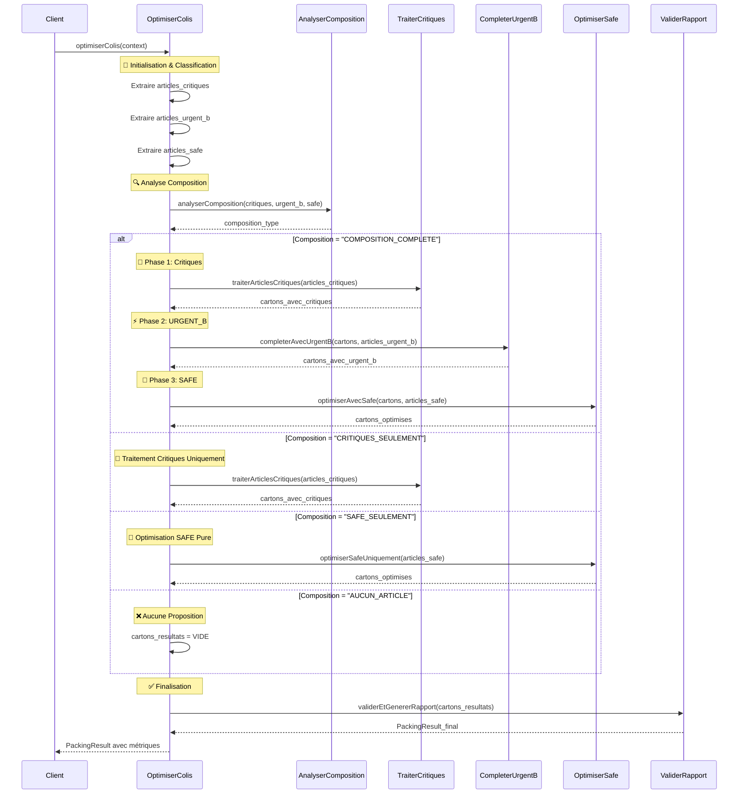

# Algorithme OptimiserColis - Version Nettoyée et Structurée

## 🎯 Algorithme Principal Refactorisé

```pseudocode
ALGORITHME OptimiserColis(context)
DEBUT
    // === INITIALISATION ET STRATÉGIE ===
    strategie ← context.strategie_name  // DEFAULT, PREMIUM, EXPRESS, etc.
    articles_input ← context.articles_input
    cartons_resultats ← LISTE_VIDE()

    // === CLASSIFICATION INITIALE ===
    articles_critiques ← FiltrerParGrade(articles_input, [CRITIQUE_A, CRITIQUE_B, URGENT_A])
    articles_urgent_b ← FiltrerParGrade(articles_input, [URGENT_B])
    articles_safe ← FiltrerParGrade(articles_input, [SAFE])

    // === SÉLECTION STRATÉGIE ===
    SELON strategie FAIRE
        CAS "DEFAULT":
            RETOURNER ExecuterStrategieStandard(articles_critiques, articles_urgent_b, articles_safe)
        CAS "PREMIUM":
            RETOURNER ExecuterStrategiePremium(articles_critiques, articles_urgent_b, articles_safe)
        CAS "EXPRESS":
            RETOURNER ExecuterStrategieExpress(articles_critiques, articles_urgent_b, articles_safe)
        PAR_DEFAUT:
            RETOURNER ExecuterStrategieStandard(articles_critiques, articles_urgent_b, articles_safe)
    FIN_SELON
FIN

// === STRATÉGIE STANDARD (Lot 1) ===
ALGORITHME ExecuterStrategieStandard(articles_critiques, articles_urgent_b, articles_safe)
DEBUT
    cartons_resultats ← LISTE_VIDE()

    // === ANALYSE COMPOSITION ===
    composition ← AnalyserComposition(articles_critiques, articles_urgent_b, articles_safe)

    SELON composition FAIRE
        CAS "CRITIQUES_SEULEMENT":
            cartons_resultats ← TraiterArticlesCritiques(articles_critiques)

        CAS "CRITIQUES_ET_URGENT_B":
            cartons_resultats ← TraiterArticlesCritiques(articles_critiques)
            cartons_resultats ← CompleterAvecUrgentB(cartons_resultats, articles_urgent_b)

        CAS "CRITIQUES_ET_SAFE":
            cartons_resultats ← TraiterArticlesCritiques(articles_critiques)
            cartons_resultats ← OptimiserAvecSafe(cartons_resultats, articles_safe)

        CAS "COMPOSITION_COMPLETE":
            // Phase 1: Traitement critiques (Court-circuit)
            cartons_resultats ← TraiterArticlesCritiques(articles_critiques)

            // Phase 2: Complétion URGENT_B
            cartons_resultats ← CompleterAvecUrgentB(cartons_resultats, articles_urgent_b)

            // Phase 3: Optimisation SAFE (Knapsack)
            cartons_resultats ← OptimiserAvecSafe(cartons_resultats, articles_safe)

        CAS "URGENT_B_ET_SAFE":
            cartons_resultats ← TraiterArticlesUrgentsB(articles_urgent_b)
            cartons_resultats ← OptimiserAvecSafe(cartons_resultats, articles_safe)

        CAS "SAFE_SEULEMENT":
            cartons_resultats ← OptimiserSafeUniquement(articles_safe)

        CAS "AUCUN_ARTICLE":
            cartons_resultats ← LISTE_VIDE()  // Pas de proposition
    FIN_SELON

    // === FINALISATION ===
    RETOURNER ValiderEtGenererRapport(cartons_resultats)
FIN

// === FONCTION UTILITAIRE D'ANALYSE ===
ALGORITHME AnalyserComposition(articles_critiques, articles_urgent_b, articles_safe)
DEBUT
    a_critiques ← (articles_critiques.taille > 0)
    a_urgent_b ← (articles_urgent_b.taille > 0)
    a_safe ← (articles_safe.taille > 0)

    SI a_critiques ET a_urgent_b ET a_safe ALORS
        RETOURNER "COMPOSITION_COMPLETE"
    SINON_SI a_critiques ET a_urgent_b ALORS
        RETOURNER "CRITIQUES_ET_URGENT_B"
    SINON_SI a_critiques ET a_safe ALORS
        RETOURNER "CRITIQUES_ET_SAFE"
    SINON_SI a_critiques ALORS
        RETOURNER "CRITIQUES_SEULEMENT"
    SINON_SI a_urgent_b ET a_safe ALORS
        RETOURNER "URGENT_B_ET_SAFE"
    SINON_SI a_safe ALORS
        RETOURNER "SAFE_SEULEMENT"
    SINON
        RETOURNER "AUCUN_ARTICLE"
    FIN_SI
FIN
```

## 📊 Diagramme de Séquence - Stratégie Standard



## 📋 Matrice de Décision par Composition

| Composition Articles | Phase 1 | Phase 2 | Phase 3 | Algorithmes Utilisés | Complexité |
|---------------------|---------|---------|---------|-------------------|-----------|
| **COMPOSITION_COMPLETE** | ✅ Critiques | ✅ URGENT_B | ✅ SAFE | Court-circuit + Quantités partielles + Knapsack | O(n + m×C + k×W×C) |
| **CRITIQUES_ET_URGENT_B** | ✅ Critiques | ✅ URGENT_B | ❌ - | Court-circuit + Quantités partielles | O(n + m×C) |
| **CRITIQUES_ET_SAFE** | ✅ Critiques | ❌ - | ✅ SAFE | Court-circuit + Knapsack | O(n + k×W×C) |
| **CRITIQUES_SEULEMENT** | ✅ Critiques | ❌ - | ❌ - | Court-circuit pur | O(n) |
| **URGENT_B_ET_SAFE** | ❌ - | ✅ URGENT_B | ✅ SAFE | Création + Complétion + Knapsack | O(m×C + k×W×C) |
| **SAFE_SEULEMENT** | ❌ - | ❌ - | ✅ SAFE | Knapsack pur classique | O(k×W×C) |
| **AUCUN_ARTICLE** | ❌ - | ❌ - | ❌ - | Aucun traitement | O(1) |

## 🔧 Améliorations Apportées

### ✅ **Structure Plus Clara :**
1. **Séparation stratégies** : Pattern Strategy pour extensibilité
2. **Classification préalable** : Une seule fois au début
3. **Analyse composition** : Logique de décision explicite
4. **Gestion cas limites** : Tous les scénarios couverts

### ✅ **Logique Simplifiée :**
1. **Élimination répétitions** : Pas de code dupliqué
2. **Flux linéaire** : Plus de conditions imbriquées complexes
3. **Responsabilités claires** : Une fonction = un rôle
4. **Extensibilité** : Ajout facile nouvelles stratégies

### ✅ **Robustesse :**
1. **Cas "AUCUN_ARTICLE"** : Gestion explicite liste vide
2. **Validation systématique** : Toujours en fin d'exécution
3. **Traçabilité** : Chaque étape identifiée
4. **Performance** : Évite traitements inutiles

### ✅ **Diagramme de Séquence :**
1. **Phases visuellement distinctes** : Couleurs et notes
2. **Flux alternatifs** : Tous les cas de composition
3. **Interactions claires** : Services et responsabilités
4. **Finalisation garantie** : Validation toujours exécutée

Cette version est **plus maintenable**, **plus performante** et **plus facile à comprendre** ! 🚀