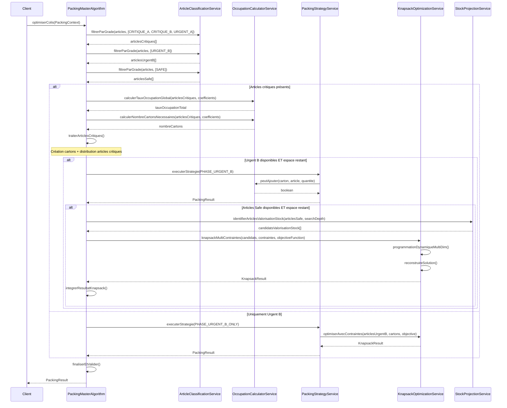
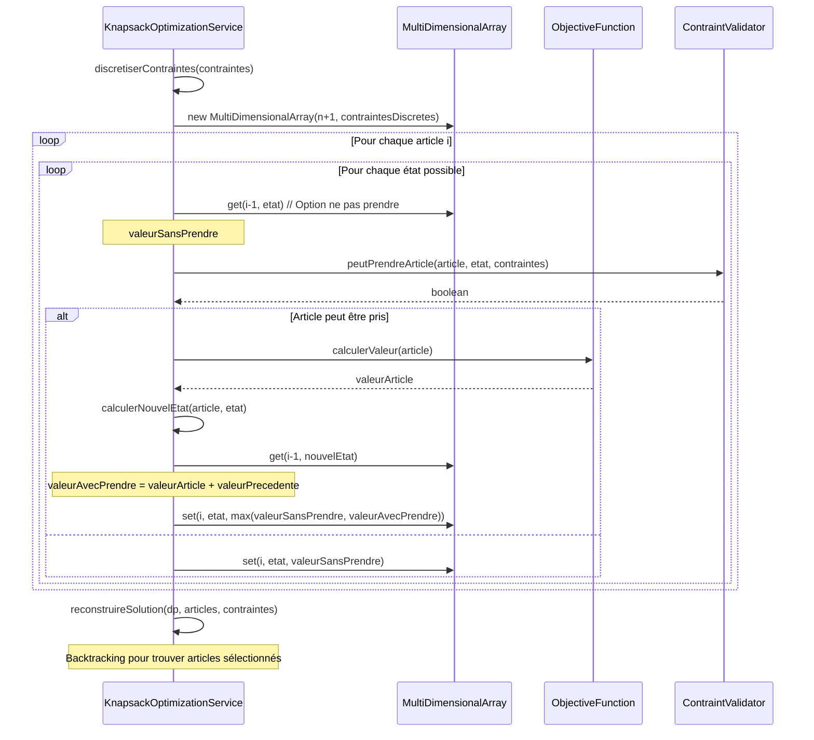
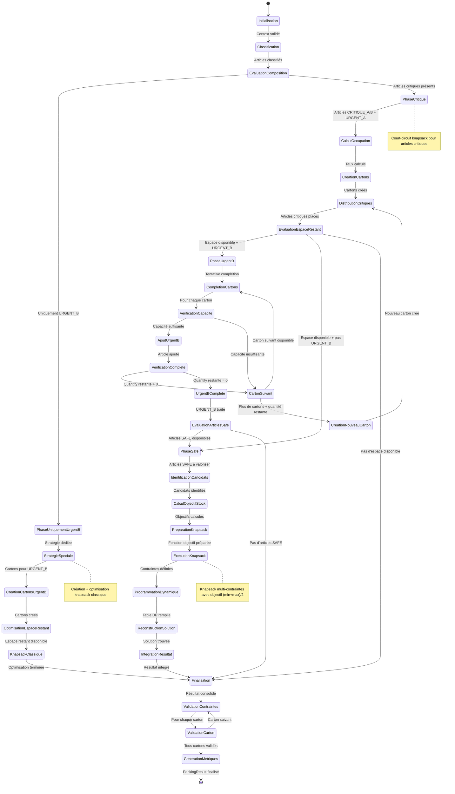

# Conception Algorithmique : Knapsack Adaptatif Modulaire pour Optimisation de Colis

## Table des Matières
1. [Vue d'ensemble du Système](#vue-densemble-du-système)
2. [Architecture Modulaire](#architecture-modulaire)
3. [Modélisation des Données](#modélisation-des-données)
4. [Services et APIs](#services-et-apis)
5. [Algorithmes Principaux](#algorithmes-principaux)
6. [Diagrammes de Séquence](#diagrammes-de-séquence)
7. [Diagramme d'États](#diagramme-détats)
8. [Stratégies d'Extension](#stratégies-dextension)
9. [Cas d'Usage et Exemples](#cas-dusage-et-exemples)

## Vue d'ensemble du Système

### Problématique
Optimiser la composition de colis constitués de cartons en respectant :
- La hiérarchie de criticité des matériels (CRITIQUE_A > CRITIQUE_B > URGENT_A > URGENT_B > SAFE)
- Les contraintes de capacité par type d'article via coefficients d'occupation
- Les objectifs de stock projeté pour les articles SAFE

### Objectifs Principaux
1. **Garantie d'inclusion** : Tous les articles critiques (A/B) et urgents A doivent être inclus
2. **Optimisation progressive** : Utilisation optimale de l'espace disponible
3. **Flexibilité** : Architecture modulaire supportant l'extension
4. **Performance** : Algorithmes efficaces pour volumes importants

## Architecture Modulaire

### Patterns de Conception Utilisés

#### 1. Strategy Pattern (Patron Stratégie)
```
INTERFACE StrategieEmballage
DEBUT
    // Fonction : Exécute une stratégie d'emballage spécifique
    // Entrées : articles (liste articles), cartons (cartons disponibles), contexte (paramètres)
    // Sortie : Résultat d'emballage avec métriques
    FONCTION Executer(articles, cartons, contexte) -> ResultatEmballage
FIN

// Implémentation pour articles critiques
CLASSE StrategieEmballageCritique IMPLEMENTE StrategieEmballage
DEBUT
    // Fonction : Applique l'algorithme de court-circuit pour articles critiques
    // Logique : Garantit l'inclusion de tous les articles CRITIQUE_A/B et URGENT_A
    FONCTION Executer(articles, cartons, contexte) -> ResultatEmballage
FIN

// Implémentation pour articles Urgent B
CLASSE StrategieEmballageUrgentB IMPLEMENTE StrategieEmballage
DEBUT
    // Fonction : Optimise l'utilisation d'espace pour articles URGENT_B
    // Logique : Complétion cartons existants puis création si nécessaire
    FONCTION Executer(articles, cartons, contexte) -> ResultatEmballage
FIN

// Implémentation Knapsack pour articles Safe
CLASSE StrategieKnapsackSafe IMPLEMENTE StrategieEmballage
DEBUT
    // Fonction : Applique l'algorithme knapsack pour objectif (min+max)/2
    // Logique : Maximise la valeur tout en atteignant l'objectif de stock
    FONCTION Executer(articles, cartons, contexte) -> ResultatEmballage
FIN

// Stratégie spéciale pour cas uniquement Urgent B
CLASSE StrategieSpecialeUrgentBSeul IMPLEMENTE StrategieEmballage
DEBUT
    // Fonction : Traite le cas particulier où seuls des URGENT_B sont présents
    // Logique : Création cartons + optimisation knapsack classique
    FONCTION Executer(articles, cartons, contexte) -> ResultatEmballage
FIN
```

#### 2. Factory Pattern (Patron Fabrique)
```
INTERFACE FabriqueCarton
DEBUT
    // Fonction : Crée un carton selon le type et les coefficients d'occupation
    // Entrées : type (type de carton), coefficients (coefficients par type d'article)
    // Sortie : Instance de carton configurée
    // Utilité : Abstrait la création de cartons selon différents types/contraintes
    FONCTION CreerCarton(type, coefficients_occupation) -> Carton
FIN

// Fabrique pour cartons standards
CLASSE FabriqueCartonStandard IMPLEMENTE FabriqueCarton
DEBUT
    // Fonction : Crée des cartons avec contraintes standard
    // Logique : Applique les coefficients par défaut et contraintes de base
    FONCTION CreerCarton(type, coefficients_occupation) -> Carton
    DEBUT
        carton ← NouveauCarton()
        carton.type ← type
        carton.coefficients_occupation ← coefficients_occupation
        carton.capacite_maximale ← CAPACITE_STANDARD
        RETOURNER carton
    FIN
FIN

// Fabrique pour cartons personnalisés
CLASSE FabriqueCartonPersonnalise IMPLEMENTE FabriqueCarton
DEBUT
    // Fonction : Crée des cartons avec contraintes personnalisées
    // Logique : Permet adaptation selon besoins spécifiques (réfrigération, etc.)
    FONCTION CreerCarton(type, coefficients_occupation) -> Carton
    DEBUT
        carton ← NouveauCarton()
        carton.type ← type
        carton.coefficients_occupation ← AppliquerPersonnalisation(coefficients_occupation)
        carton.contraintes_specifiques ← ObtenirContraintesSpecifiques(type)
        RETOURNER carton
    FIN
FIN
```

#### 3. Chain of Responsibility Pattern (Patron Chaîne de Responsabilité)
```
CLASSE ABSTRAITE GestionnairePhaseEmballage
DEBUT
    gestionnaire_suivant : GestionnairePhaseEmballage

    // Fonction : Traite une phase d'emballage ou délègue au suivant
    // Entrées : contexte (contexte d'emballage avec articles et paramètres)
    // Sortie : Résultat de la phase traitée
    // Utilité : Permet traitement séquentiel des phases avec délégation automatique
    FONCTION ABSTRAITE TraiterPhase(contexte) -> ResultatEmballage

    // Fonction : Définit le gestionnaire suivant dans la chaîne
    FONCTION DefinirSuivant(gestionnaire_suivant)
    DEBUT
        SELF.gestionnaire_suivant ← gestionnaire_suivant
    FIN
FIN
```
// Gestionnaire pour phase critique
```
CLASSE GestionnairePhaseCritique HERITE DE GestionnairePhaseEmballage
DEBUT
    // Fonction : Traite les articles critiques avec garantie d'inclusion
    // Logique : Court-circuite knapsack, crée cartons nécessaires
    FONCTION TraiterPhase(contexte) -> ResultatEmballage
    DEBUT
        articles_critiques ← FiltrerArticlesCritiques(contexte.articles)
        SI NON EstVide(articles_critiques) ALORS
            resultat ← TraiterArticlesCritiques(articles_critiques, contexte)
            SI gestionnaire_suivant ≠ NULLE ALORS
                resultat ← gestionnaire_suivant.TraiterPhase(MettreAJourContexte(contexte, resultat))
            FIN_SI
            RETOURNER resultat
        SINON
            SI gestionnaire_suivant ≠ NULLE ALORS
                RETOURNER gestionnaire_suivant.TraiterPhase(contexte)
            FIN_SI
        FIN_SI
    FIN
FIN
```
// Gestionnaire pour phase Urgent B
```
CLASSE GestionnairePhaseUrgentB HERITE DE GestionnairePhaseEmballage
DEBUT
    // Fonction : Optimise le placement des articles URGENT_B
    // Logique : Complétion cartons existants puis création conditionnelle
    FONCTION TraiterPhase(contexte) -> ResultatEmballage
    DEBUT
        articles_urgent_b ← FiltrerArticlesUrgentB(contexte.articles)
        SI NON EstVide(articles_urgent_b) ET contexte.resultat.AEspaceDisponible() ALORS
            resultat ← CompleterAvecUrgentB(articles_urgent_b, contexte.resultat, contexte)
            SI gestionnaire_suivant ≠ NULLE ALORS
                resultat ← gestionnaire_suivant.TraiterPhase(MettreAJourContexte(contexte, resultat))
            FIN_SI
            RETOURNER resultat
        SINON
            SI gestionnaire_suivant ≠ NULLE ALORS
                RETOURNER gestionnaire_suivant.TraiterPhase(contexte)
            FIN_SI
        FIN_SI
    FIN
FIN
```
// Gestionnaire pour phase Safe
```
CLASSE GestionnairePhaseSafe HERITE DE GestionnairePhaseEmballage
DEBUT
    // Fonction : Applique l'optimisation knapsack aux articles SAFE
    // Logique : Maximise valeur pour objectif (min+max)/2
    FONCTION TraiterPhase(contexte) -> ResultatEmballage
    DEBUT
        articles_safe ← FiltrerArticlesSafe(contexte.articles)
        SI NON EstVide(articles_safe) ET contexte.resultat.AEspaceDisponible() ALORS
            RETOURNER OptimiserAvecArticlesSafe(articles_safe, contexte.resultat, contexte)
        SINON
            RETOURNER contexte.resultat  // Pas de traitement supplémentaire
        FIN_SI
    FIN
FIN
```

## Modélisation des Données

### Structures de Données Principales

```
// Structure représentant un article à emballer
STRUCTURE Article
DEBUT
    id : CHAINE                                    // Identifiant unique de l'article
    nom : CHAINE                                   // Nom descriptif de l'article
    type : TypeArticle                             // Type d'article (TYPE_1, TYPE_2, TYPE_3)
    grade : GradeCriticite                         // Niveau de criticité
    quantite_demandee : ENTIER                     // Quantité requise pour cet article
    valeur : REEL                                  // Valeur métier/importance de l'article
    stock_projections : DICTIONNAIRE<ENTIER, ENTIER> // Jour -> Stock projeté

    // Méthodes utilitaires
    // Fonction : Calcule la valeur totale pour une quantité donnée
    FONCTION CalculerValeurTotale(quantite) -> REEL
    DEBUT
        RETOURNER SELF.valeur × quantite
    FIN

    // Fonction : Vérifie si l'article nécessite une valorisation de stock
    FONCTION NecessiteValorisationStock(search_depth) -> BOOLEEN
    DEBUT
        objectif_stock ← (MIN(stock_projections) + MAX(stock_projections)) / 2
        stock_final ← stock_projections[search_depth]
        RETOURNER stock_final < objectif_stock
    FIN
FIN

// Structure représentant un carton d'emballage
STRUCTURE Carton
DEBUT
    id : CHAINE                                           // Identifiant unique du carton
    type : TypeCarton                                     // Type de carton (STANDARD, REFRIGERE, etc.)
    coefficients_occupation : DICTIONNAIRE<TypeArticle, REEL> // Coefficients d'occupation par type
    contenus : DICTIONNAIRE<TypeArticle, ENTIER>          // Quantité actuelle par type d'article
    taux_occupation_courant : REEL                        // Taux d'occupation global actuel
    est_scelle : BOOLEEN                                 // Indique si le carton est fermé

    // Fonction : Vérifie si un article peut être ajouté dans ce carton
    // Entrées : article (article à ajouter), quantite (quantité souhaitée)
    // Sortie : true si l'ajout est possible, false sinon
    FONCTION PeutAjouter(article, quantite) -> BOOLEEN
    DEBUT
        SI est_scelle ALORS
            RETOURNER FAUX
        FIN_SI

        coefficient ← coefficients_occupation[article.type]
        occupation_supplementaire ← quantite × coefficient
        nouveau_taux ← taux_occupation_courant + occupation_supplementaire

        RETOURNER nouveau_taux ≤ 1.0
    FIN

    // Fonction : Calcule le taux d'occupation si un article était ajouté
    FONCTION CalculerTauxOccupationSiAjout(article, quantite) -> REEL
    DEBUT
        coefficient ← coefficients_occupation[article.type]
        occupation_supplementaire ← quantite × coefficient
        RETOURNER taux_occupation_courant + occupation_supplementaire
    FIN

    // Fonction : Ajoute un article dans le carton
    // Précondition : PeutAjouter(article, quantite) = VRAI
    FONCTION AjouterArticle(article, quantite)
    DEBUT
        SI NON PeutAjouter(article, quantite) ALORS
            LEVER_EXCEPTION("Impossible d'ajouter l'article: capacité dépassée")
        FIN_SI

        contenus[article.type] ← contenus[article.type] + quantite
        coefficient ← coefficients_occupation[article.type]
        taux_occupation_courant ← taux_occupation_courant + (quantite × coefficient)
    FIN

    // Fonction : Calcule la capacité disponible pour un type d'article
    FONCTION CalculerCapaciteDisponible(type_article) -> ENTIER
    DEBUT
        coefficient ← coefficients_occupation[type_article]
        espace_restant ← 1.0 - taux_occupation_courant
        RETOURNER PLANCHER(espace_restant / coefficient)
    FIN
FIN

// Structure représentant un colis (ensemble de cartons)
STRUCTURE Colis
DEBUT
    id : CHAINE                                      // Identifiant unique du colis
    cartons : LISTE<Carton>                         // Liste des cartons contenus
    poids_total : REEL                              // Poids total du colis
    volume_total : REEL                             // Volume total du colis
    repartition_criticite : DICTIONNAIRE<GradeCriticite, ENTIER> // Répartition par criticité

    // Fonction : Ajoute un carton au colis et met à jour les métriques
    FONCTION AjouterCarton(carton)
    DEBUT
        AJOUTER carton A cartons
        poids_total ← poids_total + carton.CalculerPoids()
        volume_total ← volume_total + carton.CalculerVolume()
        MettreAJourRepartitionCriticite(carton)
    FIN

    // Fonction : Vérifie si le colis respecte toutes les contraintes
    FONCTION RespecteContraintes() -> BOOLEEN
    DEBUT
        // Vérification contraintes de poids et volume
        SI poids_total > POIDS_MAX_COLIS OU volume_total > VOLUME_MAX_COLIS ALORS
            RETOURNER FAUX
        FIN_SI

        // Vérification contraintes spécifiques par carton
        POUR CHAQUE carton DANS cartons FAIRE
            SI NON carton.RespecteContraintes() ALORS
                RETOURNER FAUX
            FIN_SI
        FIN_POUR

        RETOURNER VRAI
    FIN
FIN

// Énumération des niveaux de criticité
ENUMERATION GradeCriticite
DEBUT
    CRITIQUE_A(1, "Critique Grade A"),      // Priorité maximale
    CRITIQUE_B(2, "Critique Grade B"),      // Priorité élevée
    URGENT_A(3, "Urgent Grade A"),          // Priorité haute
    URGENT_B(4, "Urgent Grade B"),          // Priorité modérée
    SAFE(5, "Safe")                         // Priorité faible

    priorite : ENTIER                       // Niveau de priorité numérique
    libelle : CHAINE                        // Description textuelle
FIN

// Énumération des types d'articles
ENUMERATION TypeArticle
DEBUT
    TYPE_1("Type 1", 0.2),                 // Articles de type 1 (coeff occupation 0.2)
    TYPE_2("Type 2", 0.25),                // Articles de type 2 (coeff occupation 0.25)
    TYPE_3("Type 3", 0.1)                  // Articles de type 3 (coeff occupation 0.1)

    nom : CHAINE                           // Nom descriptif du type
    coefficient_occupation_defaut : REEL    // Coefficient par défaut
FIN

// Structure de contexte pour l'algorithme d'emballage
STRUCTURE ContexteEmballage
DEBUT
    articles_input : LISTE<Article>                     // Articles à emballer
    coefficients_occupation : DICTIONNAIRE<TypeArticle, REEL> // Coefficients par type
    search_depth : ENTIER                               // Profondeur de recherche (jours)
    fabrique_carton : FabriqueCarton                   // Fabrique pour création cartons
    strategies : LISTE<StrategieEmballage>             // Stratégies disponibles
    configuration : ConfigurationEmballage             // Configuration système
FIN

// Structure de résultat d'emballage
STRUCTURE ResultatEmballage
DEBUT
    colis_generes : LISTE<Colis>                      // Colis produits
    cartons_utilises : LISTE<Carton>                  // Cartons utilisés
    metriques : DICTIONNAIRE<CHAINE, OBJET>           // Métriques de performance
    alertes : LISTE<CHAINE>                           // Messages d'alerte
    succes_complet : BOOLEEN                          // Indicateur de réussite
    taux_occupation_restant : REEL                    // Espace restant disponible

    // Fonction : Vérifie s'il reste de l'espace disponible
    FONCTION AEspaceDisponible() -> BOOLEEN
    DEBUT
        RETOURNER taux_occupation_restant > SEUIL_ESPACE_MINIMAL
    FIN

    // Fonction : Calcule l'efficacité globale de l'emballage
    FONCTION CalculerEfficacite() -> REEL
    DEBUT
        taux_remplissage ← 0
        POUR CHAQUE carton DANS cartons_utilises FAIRE
            taux_remplissage ← taux_remplissage + carton.taux_occupation_courant
        FIN_POUR
        RETOURNER taux_remplissage / TAILLE(cartons_utilises)
    FIN
FIN
```

## Services et APIs

### 1. ServiceCalculOccupation

```
INTERFACE ServiceCalculOccupation
DEBUT
    // Fonction : Calcule le taux d'occupation global pour une liste d'articles
    // Entrées : articles (liste des articles à analyser), coefficients (coefficients par type)
    // Sortie : Taux d'occupation total (somme des produits quantité × coefficient)
    // Utilité : Détermine l'espace total requis avant création des cartons
    FONCTION CalculerTauxOccupationGlobal(articles, coefficients) -> REEL

    // Fonction : Détermine le nombre de cartons nécessaires selon la règle d'arrondi supérieur
    // Entrées : articles (liste des articles), coefficients (coefficients d'occupation)
    // Sortie : Nombre entier de cartons nécessaires (arrondi supérieur du taux)
    // Utilité : Calcule le nombre minimum de cartons requis pour contenir tous les articles
    FONCTION CalculerNombreCartonsNecessaires(articles, coefficients) -> ENTIER

    // Fonction : Calcule l'espace restant disponible après allocation
    // Entrées : taux_total (taux d'occupation calculé), nombre_cartons (cartons alloués)
    // Sortie : Taux d'occupation restant disponible pour optimisation
    // Utilité : Détermine l'espace libre utilisable pour articles optionnels
    FONCTION CalculerTauxRestant(taux_total, nombre_cartons) -> REEL

    // Fonction : Vérifie la faisabilité d'ajout d'un article dans un carton
    // Entrées : carton (carton cible), article (article à ajouter), quantite (quantité souhaitée)
    // Sortie : Booléen indiquant si l'ajout est physiquement possible
    // Utilité : Validation préalable avant tentative d'ajout réel
    FONCTION PeutAjouter(carton, article, quantite) -> BOOLEEN
FIN

// Implémentation du service de calcul d'occupation
CLASSE ServiceCalculOccupationImpl IMPLEMENTE ServiceCalculOccupation
DEBUT
    // Implémentation : Calcul du taux d'occupation global
    // Logique : Parcours tous les articles, multiplie quantité par coefficient, somme le tout
    FONCTION CalculerTauxOccupationGlobal(articles, coefficients) -> REEL
    DEBUT
        taux_total ← 0
        POUR CHAQUE article DANS articles FAIRE
            coefficient ← coefficients[article.type]
            contribution ← article.quantite_demandee × coefficient
            taux_total ← taux_total + contribution
        FIN_POUR
        RETOURNER taux_total
    FIN

    // Implémentation : Calcul du nombre de cartons nécessaires
    // Logique : Applique la règle métier d'arrondi supérieur
    FONCTION CalculerNombreCartonsNecessaires(articles, coefficients) -> ENTIER
    DEBUT
        taux_total ← CalculerTauxOccupationGlobal(articles, coefficients)
        RETOURNER ARRONDI_SUPERIEUR(taux_total)
    FIN

    // Implémentation : Calcul de l'espace restant
    // Logique : Différence entre cartons alloués et taux réel utilisé
    FONCTION CalculerTauxRestant(taux_total, nombre_cartons) -> REEL
    DEBUT
        RETOURNER nombre_cartons - taux_total
    FIN

    // Implémentation : Vérification de faisabilité d'ajout
    // Logique : Délègue au carton qui connaît ses contraintes internes
    FONCTION PeutAjouter(carton, article, quantite) -> BOOLEEN
    DEBUT
        RETOURNER carton.PeutAjouter(article, quantite)
    FIN
FIN
```


### 2. ServiceClassificationArticle

```
INTERFACE ServiceClassificationArticle
DEBUT
    // Fonction : Filtre les articles selon leur grade de criticité
    // Entrées : articles (liste complète), grades (grades acceptés)
    // Sortie : Sous-liste contenant uniquement les articles des grades spécifiés
    // Utilité : Sépare les articles par phase de traitement (critiques, urgent B, safe)
    FONCTION FiltrerParGrade(articles, grades) -> LISTE<Article>

    // Fonction : Trie les articles par priorité de criticité puis par valeur décroissante
    // Entrées : articles (liste à trier)
    // Sortie : Liste triée selon l'ordre optimal de traitement
    // Utilité : Optimise l'ordre de traitement pour maximiser la valeur
    FONCTION TrierParCriticiteEtValeur(articles) -> LISTE<Article>

    // Fonction : Identifie les articles Safe candidats pour valorisation de stock
    // Entrées : articles (articles Safe), search_depth (horizon temporel)
    // Sortie : Articles ayant un potentiel de valorisation stock
    // Utilité : Prépare la liste pour l'algorithme knapsack de valorisation
    FONCTION IdentifierArticlesValorisationStock(articles, search_depth) -> LISTE<Article>

    // Fonction : Vérifie si une liste contient exclusivement des articles URGENT_B
    // Entrées : articles (liste à vérifier)
    // Sortie : Booléen indiquant l'homogénéité de la liste
    // Utilité : Déclenche la stratégie spéciale "Urgent B uniquement"
    FONCTION EstUniquementUrgentB(articles) -> BOOLEEN
FIN

// Implémentation du service de classification
CLASSE ServiceClassificationArticleImpl IMPLEMENTE ServiceClassificationArticle
DEBUT
    // Implémentation : Filtrage par grade de criticité
    // Logique : Parcours et sélection selon appartenance aux grades spécifiés
    FONCTION FiltrerParGrade(articles, grades) -> LISTE<Article>
    DEBUT
        articles_filtres ← []
        POUR CHAQUE article DANS articles FAIRE
            SI article.grade DANS grades ALORS
                AJOUTER article A articles_filtres
            FIN_SI
        FIN_POUR
        RETOURNER articles_filtres
    FIN

    // Implémentation : Tri par criticité et valeur
    // Logique : Tri primaire sur priorité (croissant), secondaire sur valeur (décroissant)
    FONCTION TrierParCriticiteEtValeur(articles) -> LISTE<Article>
    DEBUT
        articles_copies ← COPIER(articles)
        TRIER articles_copies PAR (
            CRITERE_PRIMAIRE: article.grade.priorite CROISSANT,
            CRITERE_SECONDAIRE: article.valeur DECROISSANT
        )
        RETOURNER articles_copies
    FIN

    // Implémentation : Identification articles valorisation stock
    // Logique : Sélection articles Safe avec objectif stock non atteint
    FONCTION IdentifierArticlesValorisationStock(articles, search_depth) -> LISTE<Article>
    DEBUT
        candidats ← []
        POUR CHAQUE article DANS articles FAIRE
            SI article.grade = SAFE ALORS
                projections ← article.stock_projections
                stock_min ← MIN(projections[1..search_depth])
                stock_max ← MAX(projections[1..search_depth])
                objectif_stock ← (stock_min + stock_max) / 2
                stock_final ← projections[search_depth]

                SI stock_final < objectif_stock ALORS
                    article.interet_valorisation ← objectif_stock - stock_final
                    article.valeur_ajustee ← article.valeur / (1 + ABS(objectif_stock - stock_final))
                    AJOUTER article A candidats
                FIN_SI
            FIN_SI
        FIN_POUR

        TRIER candidats PAR interet_valorisation DECROISSANT
        RETOURNER candidats
    FIN

    // Implémentation : Vérification homogénéité Urgent B
    // Logique : Validation que tous les articles sont de grade URGENT_B
    FONCTION EstUniquementUrgentB(articles) -> BOOLEEN
    DEBUT
        POUR CHAQUE article DANS articles FAIRE
            SI article.grade ≠ URGENT_B ALORS
                RETOURNER FAUX
            FIN_SI
        FIN_POUR
        RETOURNER VRAI
    FIN
FIN
```

### 3. ServiceProjectionStock

```
INTERFACE ServiceProjectionStock
DEBUT
    // Fonction : Calcule l'objectif de stock optimal selon la règle (min+max)/2
    // Entrées : article (article Safe à analyser), search_depth (horizon temporel)
    // Sortie : Niveau de stock cible pour optimiser la disponibilité
    // Utilité : Définit l'objectif à atteindre pour la valorisation stock
    FONCTION CalculerObjectifStockOptimal(article, search_depth) -> ENTIER

    // Fonction : Détermine la quantité optimale à ajouter pour atteindre l'objectif
    // Entrées : article (article concerné), objectif_stock (cible à atteindre)
    // Sortie : Quantité recommandée pour l'optimisation
    // Utilité : Guide la sélection dans l'algorithme knapsack
    FONCTION CalculerQuantiteOptimale(article, objectif_stock) -> ENTIER

    // Fonction : Évalue l'intérêt stratégique d'un article pour valorisation
    // Entrées : article (article à évaluer), search_depth (horizon)
    // Sortie : Score d'intérêt pour priorisation
    // Utilité : Classe les articles par pertinence pour l'optimisation
    FONCTION EvaluerInteretValorisationStock(article, search_depth) -> REEL
FIN

// Implémentation du service de projection stock
CLASSE ServiceProjectionStockImpl IMPLEMENTE ServiceProjectionStock
DEBUT
    // Implémentation : Calcul objectif stock optimal
    // Logique : Applique la règle métier (stock_min + stock_max) / 2
    FONCTION CalculerObjectifStockOptimal(article, search_depth) -> ENTIER
    DEBUT
        projections ← article.stock_projections
        valeurs_stock ← EXTRAIRE_VALEURS(projections[1..search_depth])
        stock_min ← MIN(valeurs_stock)
        stock_max ← MAX(valeurs_stock)
        objectif ← (stock_min + stock_max) / 2
        RETOURNER ARRONDI(objectif)
    FIN

    // Implémentation : Calcul quantité optimale à ajouter
    // Logique : Différence entre objectif et stock projeté final
    FONCTION CalculerQuantiteOptimale(article, objectif_stock) -> ENTIER
    DEBUT
        stock_final ← article.stock_projections[search_depth]
        ecart ← objectif_stock - stock_final

        // Retourne la quantité nécessaire (positive) ou 0 si objectif déjà atteint
        RETOURNER MAX(0, ecart)
    FIN

    // Implémentation : Évaluation intérêt valorisation
    // Logique : Combine écart à l'objectif et valeur intrinsèque de l'article
    FONCTION EvaluerInteretValorisationStock(article, search_depth) -> REEL
    DEBUT
        objectif ← CalculerObjectifStockOptimal(article, search_depth)
        stock_final ← article.stock_projections[search_depth]
        ecart_objectif ← ABS(objectif - stock_final)

        // Plus l'écart est important, plus l'intérêt est élevé
        // Pondéré par la valeur intrinsèque de l'article
        interet_base ← ecart_objectif * article.valeur

        // Facteur de réduction si stock déjà excédentaire
        SI stock_final > objectif ALORS
            facteur_reduction ← 0.5  // Réduit l'intérêt pour articles en surplus
            RETOURNER interet_base * facteur_reduction
        SINON
            RETOURNER interet_base
        FIN_SI
    FIN
FIN
```

### 4. ServiceOptimisationKnapsack

```
INTERFACE ServiceOptimisationKnapsack
DEBUT
    // Fonction : Applique l'algorithme knapsack classique avec contraintes d'occupation
    // Entrées : articles (articles à optimiser), cartons (cartons disponibles), objectif (fonction objectif)
    // Sortie : Résultat d'optimisation avec sélection et métriques
    // Utilité : Optimise la sélection d'articles selon contraintes de capacité
    FONCTION OptimiserAvecContraintes(articles, cartons, objectif) -> ResultatKnapsack

    // Fonction : Optimise spécifiquement pour la valorisation de stock
    // Entrées : articles_safe (articles Safe candidats), cartons (cartons avec espace), search_depth (horizon)
    // Sortie : Sélection optimisée pour objectif (min+max)/2
    // Utilité : Applique la logique métier de valorisation stock
    FONCTION OptimiserPourValorisationStock(articles_safe, cartons, search_depth) -> ResultatKnapsack

    // Fonction : Algorithme knapsack généralisé avec contraintes multiples
    // Entrées : items (articles), contraintes (limites par dimension), fonction (objectif personnalisé)
    // Sortie : Solution optimale selon programmation dynamique
    // Utilité : Cœur algorithmique pour optimisation complexe
    FONCTION KnapsackMultiContraintes(items, contraintes, fonction) -> ResultatKnapsack
FIN

// Structure de résultat d'optimisation knapsack
STRUCTURE ResultatKnapsack
DEBUT
    articles_selectionnes : LISTE<Article>              // Articles choisis par l'algorithme
    valeur_totale : REEL                               // Valeur totale de la sélection
    contraintes_utilisees : DICTIONNAIRE<CHAINE, REEL> // Utilisation des contraintes
    efficacite : REEL                                  // Ratio valeur/capacité utilisée
    repartition_par_carton : LISTE<(Article, ENTIER)> // Assignment article -> carton

    // Fonction : Calcule le taux d'utilisation global
    FONCTION CalculerTauxUtilisation() -> REEL
    DEBUT
        utilisation_totale ← SOMME(VALEURS(contraintes_utilisees))
        capacite_totale ← SOMME(CAPACITES_MAXIMALES(contraintes_utilisees))
        RETOURNER utilisation_totale / capacite_totale
    FIN
FIN

// Implémentation du service d'optimisation knapsack
CLASSE ServiceOptimisationKnapsackImpl IMPLEMENTE ServiceOptimisationKnapsack
DEBUT
    // Implémentation : Optimisation avec contraintes standard
    // Logique : Applique knapsack multi-contraintes avec fonction objectif simple
    FONCTION OptimiserAvecContraintes(articles, cartons, objectif) -> ResultatKnapsack
    DEBUT
        contraintes ← ExtraireContraintes(cartons)
        fonction_objectif ← CreerFonctionObjectif(objectif)
        RETOURNER KnapsackMultiContraintes(articles, contraintes, fonction_objectif)
    FIN

    // Implémentation : Optimisation pour valorisation stock
    // Logique : Prépare fonction objectif spécialisée pour valorisation
    FONCTION OptimiserPourValorisationStock(articles_safe, cartons, search_depth) -> ResultatKnapsack
    DEBUT
        // Préparation fonction objectif valorisation
        fonction_valorisation ← FONCTION(article)
        DEBUT
            objectif_stock ← CalculerObjectifStockOptimal(article, search_depth)
            stock_actuel ← article.stock_projections[search_depth]
            ecart ← ABS(objectif_stock - stock_actuel)
            RETOURNER article.valeur / (1 + ecart)  // Favorise articles proches objectif
        FIN

        contraintes ← ExtraireContraintes(cartons)
        RETOURNER KnapsackMultiContraintes(articles_safe, contraintes, fonction_valorisation)
    FIN

    // Implémentation : Knapsack multi-contraintes (voir algorithme détaillé précédemment)
    // Logique : Programmation dynamique multi-dimensionnelle
    FONCTION KnapsackMultiContraintes(items, contraintes, fonction) -> ResultatKnapsack
    DEBUT
        // Implémentation complète dans la section "Algorithmes Principaux"
        RETOURNER ExecuterAlgorithmeKnapsackMultiContraintes(items, contraintes, fonction)
    FIN
FIN
```

### 5. ServiceStrategieEmballage

```
INTERFACE ServiceStrategieEmballage
DEBUT
    // Fonction : Exécute la stratégie d'emballage appropriée pour une phase donnée
    // Entrées : contexte (contexte complet), phase (phase de traitement)
    // Sortie : Résultat d'emballage pour la phase traitée
    // Utilité : Point d'entrée unifié pour toutes les stratégies d'emballage
    FONCTION ExecuterStrategie(contexte, phase) -> ResultatEmballage

    // Fonction : Sélectionne automatiquement la stratégie optimale
    // Entrées : articles (articles à traiter), phase (phase courante)
    // Sortie : Instance de stratégie la mieux adaptée au contexte
    // Utilité : Automatise le choix de stratégie selon les caractéristiques des articles
    FONCTION SelectionnerStrategie(articles, phase) -> StrategieEmballage

    // Fonction : Enregistre une nouvelle stratégie dans le registry
    // Entrées : nom (identifiant unique), strategie (implémentation)
    // Utilité : Permet l'extension dynamique avec nouvelles stratégies
    FONCTION EnregistrerStrategie(nom, strategie)

    // Fonction : Liste toutes les stratégies disponibles pour une phase
    // Entrées : phase (phase de traitement)
    // Sortie : Liste des stratégies applicables
    // Utilité : Inspection et diagnostic du système
    FONCTION ListerStrategiesDisponibles(phase) -> LISTE<StrategieEmballage>
FIN

// Énumération des phases d'emballage
ENUMERATION PhaseEmballage
DEBUT
    PHASE_CRITIQUE,     // Phase 1: Articles critiques (CRITIQUE_A/B + URGENT_A)
    PHASE_URGENT_B,     // Phase 2: Articles Urgent B en complément
    PHASE_SAFE,         // Phase 3: Articles Safe avec optimisation knapsack
    PHASE_URGENT_B_SEUL // Phase spéciale: Stratégie si uniquement Urgent B
FIN

// Implémentation du service de stratégie d'emballage
CLASSE ServiceStrategieEmballageImpl IMPLEMENTE ServiceStrategieEmballage
DEBUT
    // Registre des stratégies disponibles
    strategies_registre : DICTIONNAIRE<CHAINE, StrategieEmballage>

    // Constructeur : Initialise les stratégies par défaut
    FONCTION Initialiser()
    DEBUT
        EnregistrerStrategie("critique", NouvelleStrategieEmballageCritique())
        EnregistrerStrategie("urgent_b", NouvelleStrategieEmballageUrgentB())
        EnregistrerStrategie("safe_knapsack", NouvelleStrategieKnapsackSafe())
        EnregistrerStrategie("urgent_b_seul", NouvelleStrategieSpecialeUrgentBSeul())
    FIN

    // Implémentation : Exécution de stratégie
    // Logique : Sélection automatique puis exécution de la stratégie appropriée
    FONCTION ExecuterStrategie(contexte, phase) -> ResultatEmballage
    DEBUT
        strategie ← SelectionnerStrategie(contexte.articles_input, phase)
        RETOURNER strategie.Executer(contexte.articles_input, contexte.cartons_courants, contexte)
    FIN

    // Implémentation : Sélection de stratégie optimale
    // Logique : Analyse des caractéristiques des articles et choix de stratégie
    FONCTION SelectionnerStrategie(articles, phase) -> StrategieEmballage
    DEBUT
        SELON phase FAIRE
            CAS PHASE_CRITIQUE:
                RETOURNER strategies_registre["critique"]

            CAS PHASE_URGENT_B:
                RETOURNER strategies_registre["urgent_b"]

            CAS PHASE_SAFE:
                RETOURNER strategies_registre["safe_knapsack"]

            CAS PHASE_URGENT_B_SEUL:
                RETOURNER strategies_registre["urgent_b_seul"]

            PAR_DEFAUT:
                LEVER_EXCEPTION("Phase d'emballage inconnue: " + phase)
        FIN_SELON
    FIN

    // Implémentation : Enregistrement de nouvelle stratégie
    // Logique : Ajout au registre avec validation
    FONCTION EnregistrerStrategie(nom, strategie)
    DEBUT
        SI nom = NULLE OU strategie = NULLE ALORS
            LEVER_EXCEPTION("Nom et stratégie ne peuvent être nuls")
        FIN_SI

        strategies_registre[nom] ← strategie
        ECRIRE_LOG("Nouvelle stratégie enregistrée: " + nom)
    FIN

    // Implémentation : Listage des stratégies disponibles
    FONCTION ListerStrategiesDisponibles(phase) -> LISTE<StrategieEmballage>
    DEBUT
        strategies_applicables ← []
        POUR CHAQUE (nom, strategie) DANS strategies_registre FAIRE
            SI strategie.EstApplicable(phase) ALORS
                AJOUTER strategie A strategies_applicables
            FIN_SI
        FIN_POUR
        RETOURNER strategies_applicables
    FIN
FIN
```


## Algorithmes Principaux

### Algorithme Principal : PackingMasterAlgorithm

```
ALGORITHME OptimiserColis(context)
DEBUT
    // Phase 1: Initialisation et classification
    articles_critiques ← FiltrerParGrade(context.articles_input, [CRITIQUE_A, CRITIQUE_B, URGENT_A])
    articles_urgent_b ← FiltrerParGrade(context.articles_input, [URGENT_B])
    articles_safe ← FiltrerParGrade(context.articles_input, [SAFE])

    result ← NouveauPackingResult()

    // Phase 2: Traitement articles critiques (court-circuit knapsack)
    SI NON EstVide(articles_critiques) ALORS
        result ← TraiterArticlesCritiques(articles_critiques, context)
    FIN_SI

    // Phase 3: Complétion avec Urgent B
    SI NON EstVide(articles_urgent_b) ET result.HasSpaceAvailable() ALORS
        result ← CompleterAvecUrgentB(articles_urgent_b, result, context)
    FIN_SI

    // Phase 4: Optimisation avec articles Safe ou stratégie spéciale
    SI EstUniquementUrgentB(context.articles_input) ALORS
        result ← AppliquerStrategieUrgentBSeul(articles_urgent_b, context)
    SINON_SI NON EstVide(articles_safe) ET result.HasSpaceAvailable() ALORS
        result ← OptimiserAvecArticlesSafe(articles_safe, result, context)
    FIN_SI

    // Phase 5: Finalisation et validation
    result ← FinaliserEtValider(result)

    RETOURNER result
FIN
```

### Algorithme Phase Critique

```
ALGORITHME TraiterArticlesCritiques(articles_critiques, context)
DEBUT
    // Calcul du taux d'occupation total
    taux_occupation_total ← 0
    POUR CHAQUE article DANS articles_critiques FAIRE
        coefficient ← context.coefficients_occupation[article.type]
        taux_occupation_total ← taux_occupation_total + (article.quantite_demandee × coefficient)
    FIN_POUR

    // Calcul du nombre de cartons nécessaires
    nombre_cartons_necessaires ← ARRONDI_SUPERIEUR(taux_occupation_total)

    // Création des cartons
    cartons ← []
    POUR i DE 1 A nombre_cartons_necessaires FAIRE
        carton ← CreerNouveauCarton(context.coefficients_occupation)
        AJOUTER carton A cartons
    FIN_POUR

    // Distribution des articles critiques
    result ← DistribuerArticlesCritiques(articles_critiques, cartons)

    // Calcul de l'espace restant
    taux_restant ← nombre_cartons_necessaires - taux_occupation_total
    result.taux_occupation_restant ← taux_restant

    RETOURNER result
FIN
```

### Sous-algorithme : Distribution Articles Critiques

```
ALGORITHME DistribuerArticlesCritiques(articles_critiques, cartons)
DEBUT
    result ← NouveauPackingResult()
    result.cartons ← cartons

    // Tri des articles par priorité décroissante
    TRIER articles_critiques PAR grade CROISSANT PUIS PAR valeur DECROISSANT

    POUR CHAQUE article DANS articles_critiques FAIRE
        quantite_restante ← article.quantite_demandee

        TANT QUE quantite_restante > 0 FAIRE
            carton_choisi ← NULLE
            meilleure_capacite ← 0

            // Recherche du carton avec la meilleure capacité disponible pour ce type
            POUR CHAQUE carton DANS cartons FAIRE
                SI carton.PeutAjouter(article.type) ALORS
                    capacite_disponible ← carton.CalculerCapaciteDisponible(article.type)
                    SI capacite_disponible > meilleure_capacite ALORS
                        carton_choisi ← carton
                        meilleure_capacite ← capacite_disponible
                    FIN_SI
                FIN_SI
            FIN_POUR

            SI carton_choisi ≠ NULLE ALORS
                quantite_a_ajouter ← MIN(quantite_restante, meilleure_capacite)
                carton_choisi.AjouterArticle(article, quantite_a_ajouter)
                quantite_restante ← quantite_restante - quantite_a_ajouter
            SINON
                // Erreur: impossible de placer l'article critique
                LEVER_EXCEPTION("Article critique ne peut être placé: " + article.id)
            FIN_SI
        FIN_TANT_QUE
    FIN_POUR

    RETOURNER result
FIN
```

### Algorithme Complétion Urgent B

```
ALGORITHME CompleterAvecUrgentB(articles_urgent_b, result_courant, context)
DEBUT
    cartons ← result_courant.cartons

    POUR CHAQUE article DANS articles_urgent_b FAIRE
        quantite_restante ← article.quantite_demandee

        // Phase 1: Tentative de complétion des cartons existants
        POUR CHAQUE carton DANS cartons FAIRE
            SI quantite_restante = 0 ALORS
                SORTIR_BOUCLE
            FIN_SI

            SI carton.PeutAjouter(article.type) ALORS
                capacite_disponible ← carton.CalculerCapaciteDisponible(article.type)
                SI capacite_disponible > 0 ALORS
                    quantite_a_ajouter ← MIN(quantite_restante, capacite_disponible)
                    carton.AjouterArticle(article, quantite_a_ajouter)
                    quantite_restante ← quantite_restante - quantite_a_ajouter
                FIN_SI
            FIN_SI
        FIN_POUR

        // Phase 2: Création de nouveaux cartons si nécessaire
        TANT QUE quantite_restante > 0 FAIRE
            nouveau_carton ← CreerNouveauCarton(context.coefficients_occupation)
            capacite_max ← nouveau_carton.CalculerCapaciteMaximale(article.type)
            quantite_a_ajouter ← MIN(quantite_restante, capacite_max)

            nouveau_carton.AjouterArticle(article, quantite_a_ajouter)
            AJOUTER nouveau_carton A cartons
            quantite_restante ← quantite_restante - quantite_a_ajouter
        FIN_TANT_QUE
    FIN_POUR

    result_courant.cartons ← cartons
    RETOURNER result_courant
FIN
```

### Algorithme Knapsack pour Articles Safe

```
ALGORITHME OptimiserAvecArticlesSafe(articles_safe, result_courant, context)
DEBUT
    // Identification des articles candidats pour valorisation stock
    candidats_valorisation ← IdentifierArticlesValorisationStock(articles_safe, context.search_depth)

    SI EstVide(candidats_valorisation) ALORS
        RETOURNER result_courant
    FIN_SI

    // Calcul des contraintes restantes pour chaque carton
    contraintes_par_carton ← []
    POUR CHAQUE carton DANS result_courant.cartons FAIRE
        contraintes_carton ← CalculerContraintesRestantes(carton, context.coefficients_occupation)
        AJOUTER contraintes_carton A contraintes_par_carton
    FIN_POUR

    // Préparation de la fonction objectif pour valorisation stock
    POUR CHAQUE article DANS candidats_valorisation FAIRE
        objectif_stock ← CalculerObjectifStockOptimal(article, context.search_depth)
        stock_actuel ← article.stock_projections[context.search_depth]
        ecart_optimal ← |objectif_stock - stock_actuel|
        article.valeur_ajustee ← article.valeur / (1 + ecart_optimal)
    FIN_POUR

    // Application knapsack multi-contraintes
    knapsack_result ← KnapsackMultiContraintes(candidats_valorisation, contraintes_par_carton)

    // Intégration du résultat
    RETOURNER IntegrerResultatKnapsack(result_courant, knapsack_result)
FIN
```

### Algorithme Knapsack Multi-Contraintes

```
ALGORITHME KnapsackMultiContraintes(items, contraintes_par_carton)
DEBUT
    n ← TAILLE(items)
    m ← TAILLE(contraintes_par_carton)

    // Discrétisation des contraintes
    contraintes_discretes ← DiscretiserContraintes(contraintes_par_carton)

    // Table de programmation dynamique multi-dimensionnelle
    // dp[i][carton][c1][c2][...] = valeur optimale avec les i premiers objets
    dp ← NouveauTableauMultiDimensionnel(n + 1, contraintes_discretes)

    // Initialisation
    POUR CHAQUE etat DANS dp[0] FAIRE
        dp[0][etat] ← 0
    FIN_POUR

    // Remplissage de la table DP
    POUR i DE 1 A n FAIRE
        article ← items[i - 1]
        valeur ← article.valeur_ajustee

        POUR CHAQUE carton_index DE 0 A m - 1 FAIRE
            contraintes_carton ← contraintes_discretes[carton_index]

            POUR CHAQUE etat DANS contraintes_carton FAIRE
                // Option 1: Ne pas prendre l'article
                valeur_sans_prendre ← dp[i - 1][carton_index][etat]

                // Option 2: Prendre l'article dans ce carton si possible
                valeur_avec_prendre ← 0
                SI PeutPrendreArticle(article, carton_index, etat, contraintes_carton) ALORS
                    nouvel_etat ← CalculerNouvelEtat(article, etat)
                    valeur_avec_prendre ← valeur + dp[i - 1][carton_index][nouvel_etat]
                FIN_SI

                dp[i][carton_index][etat] ← MAX(valeur_sans_prendre, valeur_avec_prendre)
            FIN_POUR
        FIN_POUR
    FIN_POUR

    // Reconstruction de la solution
    solution ← ReconstruireSolution(dp, items, contraintes_discretes)
    RETOURNER solution
FIN
```

### Algorithme Reconstruction Solution Knapsack

```
ALGORITHME ReconstruireSolution(dp, items, contraintes_discretes)
DEBUT
    n ← TAILLE(items)
    m ← TAILLE(contraintes_discretes)

    // Trouver la valeur optimale globale
    valeur_optimale ← 0
    meilleur_etat ← NULLE
    meilleur_carton ← -1

    POUR carton_index DE 0 A m - 1 FAIRE
        POUR CHAQUE etat DANS contraintes_discretes[carton_index] FAIRE
            SI dp[n][carton_index][etat] > valeur_optimale ALORS
                valeur_optimale ← dp[n][carton_index][etat]
                meilleur_etat ← etat
                meilleur_carton ← carton_index
            FIN_SI
        FIN_POUR
    FIN_POUR

    // Backtracking pour reconstruire la solution
    solution ← NouveauKnapsackResult()
    solution.valeur_totale ← valeur_optimale
    solution.articles_selectionnes ← []
    solution.repartition_par_carton ← []

    etat_courant ← meilleur_etat
    carton_courant ← meilleur_carton

    POUR i DE n A 1 PAS -1 FAIRE
        article ← items[i - 1]
        valeur_sans_article ← dp[i - 1][carton_courant][etat_courant]

        SI dp[i][carton_courant][etat_courant] ≠ valeur_sans_article ALORS
            // L'article a été pris
            AJOUTER article A solution.articles_selectionnes
            AJOUTER (article, carton_courant) A solution.repartition_par_carton

            // Calculer l'état précédent
            etat_courant ← CalculerEtatPrecedent(article, etat_courant)
        FIN_SI
    FIN_POUR

    RETOURNER solution
FIN
```

### Algorithme Stratégie Urgent B Seul

```
ALGORITHME AppliquerStrategieUrgentBSeul(articles_urgent_b, context)
DEBUT
    // Phase 1: Calcul du nombre de cartons nécessaires
    taux_occupation_total ← 0
    POUR CHAQUE article DANS articles_urgent_b FAIRE
        coefficient ← context.coefficients_occupation[article.type]
        taux_occupation_total ← taux_occupation_total + (article.quantite_demandee × coefficient)
    FIN_POUR

    nombre_cartons_necessaires ← ARRONDI_SUPERIEUR(taux_occupation_total)

    // Phase 2: Création et remplissage initial des cartons
    cartons ← []
    POUR i DE 1 A nombre_cartons_necessaires FAIRE
        carton ← CreerNouveauCarton(context.coefficients_occupation)
        AJOUTER carton A cartons
    FIN_POUR

    result ← DistribuerArticlesCritiques(articles_urgent_b, cartons)

    // Phase 3: Optimisation de l'espace restant avec knapsack classique
    espace_restant ← nombre_cartons_necessaires - taux_occupation_total

    SI espace_restant > SEUIL_OPTIMISATION ALORS
        // Tri des articles restants par ratio valeur/occupation
        articles_restants ← []
        POUR CHAQUE article DANS articles_urgent_b FAIRE
            SI article.quantite_restante > 0 ALORS
                coefficient ← context.coefficients_occupation[article.type]
                article.ratio_valeur ← article.valeur / coefficient
                AJOUTER article A articles_restants
            FIN_SI
        FIN_POUR

        TRIER articles_restants PAR ratio_valeur DECROISSANT

        // Application knapsack glouton sur l'espace restant
        POUR CHAQUE article DANS articles_restants FAIRE
            POUR CHAQUE carton DANS cartons FAIRE
                capacite_disponible ← carton.CalculerCapaciteDisponible(article.type)
                SI capacite_disponible > 0 ET article.quantite_restante > 0 ALORS
                    quantite_optimale ← MIN(article.quantite_restante, capacite_disponible)
                    carton.AjouterArticle(article, quantite_optimale)
                    article.quantite_restante ← article.quantite_restante - quantite_optimale
                FIN_SI
            FIN_POUR
        FIN_POUR
    FIN_SI

    RETOURNER result
FIN
```

### Algorithmes Utilitaires

```
ALGORITHME CalculerObjectifStockOptimal(article, search_depth)
DEBUT
    projections ← article.stock_projections
    stock_min ← MIN(projections[1..search_depth])
    stock_max ← MAX(projections[1..search_depth])
    objectif ← (stock_min + stock_max) / 2
    RETOURNER ARRONDI(objectif)
FIN

ALGORITHME IdentifierArticlesValorisationStock(articles_safe, search_depth)
DEBUT
    candidats ← []
    POUR CHAQUE article DANS articles_safe FAIRE
        objectif ← CalculerObjectifStockOptimal(article, search_depth)
        stock_final ← article.stock_projections[search_depth]

        SI stock_final < objectif ALORS
            article.interet_valorisation ← objectif - stock_final
            AJOUTER article A candidats
        FIN_SI
    FIN_POUR

    TRIER candidats PAR interet_valorisation DECROISSANT
    RETOURNER candidats
FIN

ALGORITHME EstUniquementUrgentB(articles)
DEBUT
    POUR CHAQUE article DANS articles FAIRE
        SI article.grade ≠ URGENT_B ALORS
            RETOURNER FAUX
        FIN_SI
    FIN_POUR
    RETOURNER VRAI
FIN
```

## Diagrammes de Séquence

### Diagramme de Séquence Principal



### Diagramme de Séquence Knapsack Multi-Contraintes



## Diagramme d'États



## Stratégies d'Extension

### 1. Extension Types de Cartons

```java
public abstract class CartonTypeTemplate {
    protected Map<ArticleType, Double> coefficientsOccupationBase;

    public abstract boolean peutContenir(ArticleType type);
    public abstract double calculerCoefficientOccupation(ArticleType type);
    public abstract Map<String, Object> getContraintesSpecifiques();

    // Template method
    public final Carton creerCarton(String id) {
        Carton carton = new Carton(id, this.getCartonType());
        carton.setCoefficientsOccupation(this.getCoefficientsOccupation());
        carton.setContraintesSpecifiques(this.getContraintesSpecifiques());
        return carton;
    }
}

// Exemple d'extension
public class CartonRefrigereTemplate extends CartonTypeTemplate {
    @Override
    public boolean peutContenir(ArticleType type) {
        return type.isCompatibleAvecRefrigation();
    }

    @Override
    public double calculerCoefficientOccupation(ArticleType type) {
        // Coefficient réduit pour articles réfrigérés (plus d'espace nécessaire)
        return coefficientsOccupationBase.get(type) * 0.8;
    }
}
```

### 2. Extension Algorithmes d'Optimisation

```java
public interface OptimizationAlgorithm {
    String getName();
    boolean isApplicable(OptimizationContext context);
    OptimizationResult optimize(List<Article> articles, List<Carton> cartons, OptimizationContext context);
    Map<String, Object> getParameters();
    void setParameters(Map<String, Object> parameters);
}

@Component
public class OptimizationAlgorithmRegistry {
    private Map<String, OptimizationAlgorithm> algorithms = new ConcurrentHashMap<>();

    public void registerAlgorithm(String name, OptimizationAlgorithm algorithm) {
        algorithms.put(name, algorithm);
    }

    public OptimizationAlgorithm selectBestAlgorithm(OptimizationContext context) {
        return algorithms.values().stream()
            .filter(algo -> algo.isApplicable(context))
            .max(Comparator.comparing(algo -> evaluateAlgorithmFitness(algo, context)))
            .orElse(getDefaultAlgorithm());
    }
}

// Exemples d'algorithmes extensibles
public class GeneticKnapsackAlgorithm implements OptimizationAlgorithm {
    // Algorithme génétique pour cas complexes
}

public class SimulatedAnnealingAlgorithm implements OptimizationAlgorithm {
    // Recuit simulé pour optimisation fine
}

public class QuantumInspiredAlgorithm implements OptimizationAlgorithm {
    // Algorithme quantique pour exploration solution space
}
```

### 3. Extension Stratégies de Packing

```java
public abstract class PackingStrategy {
    protected String name;
    protected Map<String, Object> parameters;

    public abstract boolean isApplicable(PackingContext context);
    public abstract PackingResult execute(PackingContext context);
    public abstract double estimateEfficiency(PackingContext context);

    // Hooks pour extension
    protected void beforeExecution(PackingContext context) {}
    protected void afterExecution(PackingResult result) {}
    protected void onError(Exception e, PackingContext context) {}
}

// Exemple de nouvelle stratégie
public class HybridPackingStrategy extends PackingStrategy {

    @Override
    public boolean isApplicable(PackingContext context) {
        return context.getArticles().size() > 1000 &&
               context.hasComplexConstraints();
    }

    @Override
    public PackingResult execute(PackingContext context) {
        // Phase 1: Pre-processing avec clustering
        Map<String, List<Article>> clusters = clusteringService.clusterArticles(context.getArticles());

        // Phase 2: Optimisation par cluster
        List<PackingResult> resultatsParCluster = new ArrayList<>();
        for (Map.Entry<String, List<Article>> cluster : clusters.entrySet()) {
            PackingContext clusterContext = context.createSubContext(cluster.getValue());
            PackingResult resultatCluster = optimizeCluster(clusterContext);
            resultatsParCluster.add(resultatCluster);
        }

        // Phase 3: Consolidation globale
        return consolidationService.consolidateResults(resultatsParCluster);
    }
}
```

### 4. Plugin Architecture

```java
public interface PackingPlugin {
    String getPluginId();
    String getVersion();
    List<String> getDependencies();
    void initialize(PluginContext context);
    void shutdown();
    boolean isEnabled();
}

public abstract class PackingExtensionPlugin implements PackingPlugin {

    // Extension points
    public List<CartonTypeTemplate> provideCartonTypes() { return Collections.emptyList(); }
    public List<OptimizationAlgorithm> provideOptimizationAlgorithms() { return Collections.emptyList(); }
    public List<PackingStrategy> providePackingStrategies() { return Collections.emptyList(); }
    public List<ObjectiveFunction> provideObjectiveFunctions() { return Collections.emptyList(); }
    public List<ConstraintValidator> provideConstraintValidators() { return Collections.emptyList(); }
}

@Component
public class PluginManager {
    private final Map<String, PackingPlugin> loadedPlugins = new ConcurrentHashMap<>();
    private final ApplicationEventPublisher eventPublisher;

    public void loadPlugin(PackingPlugin plugin) {
        try {
            validatePlugin(plugin);
            plugin.initialize(createPluginContext());
            loadedPlugins.put(plugin.getPluginId(), plugin);
            eventPublisher.publishEvent(new PluginLoadedEvent(plugin));
        } catch (Exception e) {
            log.error("Failed to load plugin: {}", plugin.getPluginId(), e);
        }
    }

    public void unloadPlugin(String pluginId) {
        PackingPlugin plugin = loadedPlugins.remove(pluginId);
        if (plugin != null) {
            try {
                plugin.shutdown();
                eventPublisher.publishEvent(new PluginUnloadedEvent(plugin));
            } catch (Exception e) {
                log.error("Error during plugin shutdown: {}", pluginId, e);
            }
        }
    }
}
```

## Cas d'Usage et Exemples

### Exemple 1: Configuration Standard

```java
public void exempleConfigurationStandard() {
    // Configuration coefficients d'occupation
    Map<ArticleType, Double> coefficients = Map.of(
        ArticleType.TYPE_1, 0.2,
        ArticleType.TYPE_2, 0.25,
        ArticleType.TYPE_3, 0.1
    );

    // Articles d'exemple
    List<Article> articles = Arrays.asList(
        new Article("A1", ArticleType.TYPE_1, GradeCriticite.CRITIQUE_A, 10),
        new Article("A2", ArticleType.TYPE_2, GradeCriticite.CRITIQUE_B, 5),
        new Article("A3", ArticleType.TYPE_3, GradeCriticite.URGENT_A, 3),
        new Article("A4", ArticleType.TYPE_1, GradeCriticite.URGENT_B, 15),
        new Article("A5", ArticleType.TYPE_2, GradeCriticite.SAFE, 8)
    );

    // Context de packing
    PackingContext context = PackingContext.builder()
        .articles(articles)
        .coefficientsOccupation(coefficients)
        .searchDepth(10)
        .cartonFactory(new StandardCartonFactory())
        .build();

    // Exécution
    PackingResult result = packingMasterAlgorithm.optimiserColis(context);

    // Résultat attendu: 4 cartons (taux = 3.55 → arrondi sup = 4)
    // Carton 1-4: Articles critiques/urgents A
    // Espace restant: 0.45 → complétion avec urgent B puis safe
}
```

### Exemple 2: Cas Uniquement Urgent B

```java
public void exempleUniquementUrgentB() {
    List<Article> articlesUrgentBSeul = Arrays.asList(
        new Article("UB1", ArticleType.TYPE_1, GradeCriticite.URGENT_B, 20),
        new Article("UB2", ArticleType.TYPE_2, GradeCriticite.URGENT_B, 12),
        new Article("UB3", ArticleType.TYPE_3, GradeCriticite.URGENT_B, 8)
    );

    PackingContext context = PackingContext.builder()
        .articles(articlesUrgentBSeul)
        .coefficientsOccupation(coefficients)
        .searchDepth(10)
        .build();

    PackingResult result = packingMasterAlgorithm.optimiserColis(context);

    // Stratégie spéciale activée:
    // 1. Création cartons nécessaires pour urgent B
    // 2. Application knapsack classique sur espace restant
}
```

### Exemple 3: Extension avec Plugin

```java
public class AdvancedOptimizationPlugin extends PackingExtensionPlugin {

    @Override
    public String getPluginId() {
        return "advanced-optimization-v2";
    }

    @Override
    public List<OptimizationAlgorithm> provideOptimizationAlgorithms() {
        return Arrays.asList(
            new GeneticKnapsackAlgorithm(),
            new SimulatedAnnealingAlgorithm(),
            new ParticleSwarmOptimization()
        );
    }

    @Override
    public List<PackingStrategy> providePackingStrategies() {
        return Arrays.asList(
            new HybridPackingStrategy(),
            new AdaptivePackingStrategy(),
            new PredictivePackingStrategy()
        );
    }

    @Override
    public void initialize(PluginContext context) {
        // Configuration des algorithmes avancés
        context.getAlgorithmRegistry().registerAlgorithm("genetic", new GeneticKnapsackAlgorithm());
        context.getStrategyRegistry().registerStrategy("hybrid", new HybridPackingStrategy());
    }
}

// Utilisation du plugin
@PostConstruct
public void loadAdvancedFeatures() {
    pluginManager.loadPlugin(new AdvancedOptimizationPlugin());
}
```

## Métriques et Monitoring

### KPIs de Performance

```java
public class PackingMetrics {
    private double tauxRemplissageMoyen;
    private double efficaciteOptimisation;
    private int nombreCartonsUtilises;
    private int nombreCartonsOptimal;
    private Map<GradeCriticite, Integer> repartitionCriticite;
    private long tempsExecution;
    private double coutTotal;

    public double calculerIndicateurGlobal() {
        return (tauxRemplissageMoyen * 0.4) +
               (efficaciteOptimisation * 0.3) +
               (ratioOptimalite() * 0.3);
    }

    private double ratioOptimalite() {
        return (double) nombreCartonsOptimal / nombreCartonsUtilises;
    }
}

@Component
public class MetricsCollector {

    @EventListener
    public void onPackingCompleted(PackingCompletedEvent event) {
        PackingMetrics metrics = calculateMetrics(event.getResult());
        metricsService.record(metrics);

        if (metrics.getTauxRemplissageMoyen() < THRESHOLD_EFFICACITE) {
            alertService.sendAlert("Faible taux de remplissage détecté: " + metrics.getTauxRemplissageMoyen());
        }
    }
}
```

Cette conception modulaire et adaptative permet:
1. **Extensibilité** : Ajout facile de nouveaux types de cartons, algorithmes, stratégies
2. **Maintenabilité** : Architecture claire avec séparation des responsabilités
3. **Performance** : Algorithmes optimisés avec métriques de monitoring
4. **Flexibilité** : Configuration paramétrable selon les besoins métier
5. **Évolutivité** : Architecture plugin pour extensions futures
