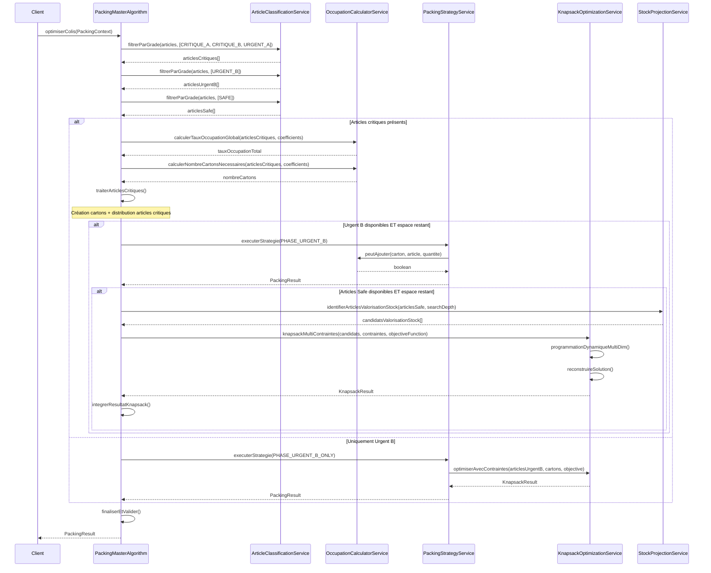
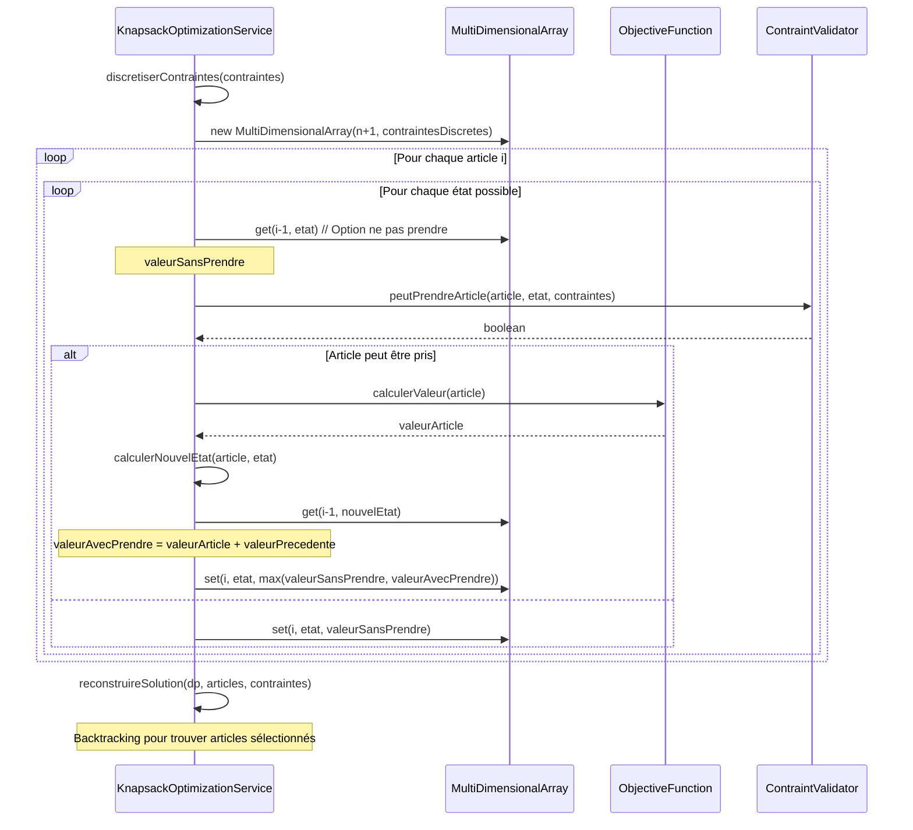
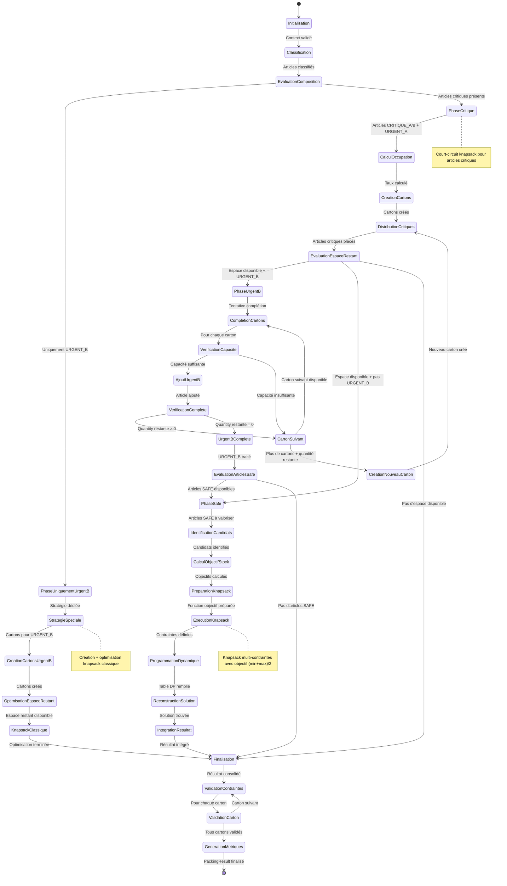

# Conception Algorithmique : Knapsack Adaptatif Modulaire pour Optimisation de Colis

## Table des Matières
1. [Vue d'ensemble du Système](#vue-densemble-du-système)
2. [Architecture Modulaire](#architecture-modulaire)
3. [Modélisation des Données](#modélisation-des-données)
4. [Services et APIs](#services-et-apis)
5. [Algorithmes Principaux](#algorithmes-principaux)
6. [Diagrammes de Séquence](#diagrammes-de-séquence)
7. [Diagramme d'États](#diagramme-détats)
8. [Stratégies d'Extension](#stratégies-dextension)
9. [Cas d'Usage et Exemples](#cas-dusage-et-exemples)

## Vue d'ensemble du Système

### Problématique
Optimiser la composition de colis constitués de cartons en respectant :
- La hiérarchie de criticité des matériels (CRITIQUE_A > CRITIQUE_B > URGENT_A > URGENT_B > SAFE)
- Les contraintes de capacité par type d'article via coefficients d'occupation
- Les objectifs de stock projeté pour les articles SAFE

### Objectifs Principaux
1. **Garantie d'inclusion** : Tous les articles critiques (A/B) et urgents A doivent être inclus
2. **Optimisation progressive** : Utilisation optimale de l'espace disponible
3. **Flexibilité** : Architecture modulaire supportant l'extension
4. **Performance** : Algorithmes efficaces pour volumes importants

## Architecture Modulaire

### Patterns de Conception Utilisés

#### 1. Strategy Pattern
```java
public interface PackingStrategy {
    PackingResult execute(List<Article> articles, List<Carton> cartons, PackingContext context);
}

public class CriticalPackingStrategy implements PackingStrategy { ... }
public class UrgentBPackingStrategy implements PackingStrategy { ... }
public class SafeKnapsackStrategy implements PackingStrategy { ... }
public class SpecialUrgentBOnlyStrategy implements PackingStrategy { ... }
```

#### 2. Factory Pattern
```java
public interface CartonFactory {
    Carton createCarton(CartonType type, Map<ArticleType, Double> coefficientsOccupation);
}

public class StandardCartonFactory implements CartonFactory { ... }
public class CustomCartonFactory implements CartonFactory { ... }
```

#### 3. Chain of Responsibility Pattern
```java
public abstract class PackingPhaseHandler {
    protected PackingPhaseHandler nextHandler;
    public abstract PackingResult handlePhase(PackingContext context);
}

public class CriticalPhaseHandler extends PackingPhaseHandler { ... }
public class UrgentBPhaseHandler extends PackingPhaseHandler { ... }
public class SafePhaseHandler extends PackingPhaseHandler { ... }
```

## Modélisation des Données

### Classes Principales

```java
public class Article {
    private String id;
    private String nom;
    private ArticleType type;
    private GradeCriticite grade;
    private int quantiteDemandee;
    private double valeur;
    private Map<Integer, Integer> stockProjections; // Jour -> Stock projeté

    // Getters, setters, méthodes utilitaires
}

public class Carton {
    private String id;
    private CartonType type;
    private Map<ArticleType, Double> coefficientsOccupation;
    private Map<ArticleType, Integer> contenus;
    private double tauxOccupationCourant;
    private boolean isSealed;

    public boolean peutAjouter(Article article, int quantite);
    public double calculerTauxOccupationSiAjout(Article article, int quantite);
    public void ajouterArticle(Article article, int quantite);
}

public class Colis {
    private String id;
    private List<Carton> cartons;
    private double poidsTotal;
    private double volumeTotal;
    private Map<GradeCriticite, Integer> repartitionCriticite;

    public void ajouterCarton(Carton carton);
    public boolean respecteContraintes();
}

public enum GradeCriticite {
    CRITIQUE_A(1, "Critique Grade A"),
    CRITIQUE_B(2, "Critique Grade B"),
    URGENT_A(3, "Urgent Grade A"),
    URGENT_B(4, "Urgent Grade B"),
    SAFE(5, "Safe");

    private final int priorite;
    private final String libelle;
}

public enum ArticleType {
    TYPE_1("Type 1", 0.2),
    TYPE_2("Type 2", 0.25),
    TYPE_3("Type 3", 0.1);

    private final String nom;
    private final double coefficientOccupationDefaut;
}

public class PackingContext {
    private List<Article> articlesInput;
    private Map<ArticleType, Double> coefficientsOccupation;
    private int searchDepth;
    private CartonFactory cartonFactory;
    private List<PackingStrategy> strategies;
    private PackingConfiguration configuration;
}

public class PackingResult {
    private List<Colis> colisGeneres;
    private List<Carton> cartonsUtilises;
    private Map<String, Object> metriques;
    private List<String> alertes;
    private boolean succesComplet;
}
```

## Services et APIs

### 1. OccupationCalculatorService

```java
@Service
public interface OccupationCalculatorService {

    /**
     * Calcule le taux d'occupation global pour une liste d'articles
     */
    double calculerTauxOccupationGlobal(
        List<Article> articles,
        Map<ArticleType, Double> coefficients
    );

    /**
     * Détermine le nombre de cartons nécessaires
     */
    int calculerNombreCartonsNecessaires(
        List<Article> articles,
        Map<ArticleType, Double> coefficients
    );

    /**
     * Calcule le taux d'occupation restant après inclusion d'articles
     */
    double calculerTauxRestant(
        double tauxTotal,
        int nombreCartons
    );

    /**
     * Vérifie si un ajout est possible dans un carton
     */
    boolean peutAjouter(
        Carton carton,
        Article article,
        int quantite
    );
}

@Service
public class OccupationCalculatorServiceImpl implements OccupationCalculatorService {

    @Override
    public double calculerTauxOccupationGlobal(List<Article> articles, Map<ArticleType, Double> coefficients) {
        return articles.stream()
            .mapToDouble(article -> {
                double coeff = coefficients.get(article.getType());
                return article.getQuantiteDemandee() * coeff;
            })
            .sum();
    }

    @Override
    public int calculerNombreCartonsNecessaires(List<Article> articles, Map<ArticleType, Double> coefficients) {
        double tauxTotal = calculerTauxOccupationGlobal(articles, coefficients);
        return (int) Math.ceil(tauxTotal);
    }
}
```

### 2. ArticleClassificationService

```java
@Service
public interface ArticleClassificationService {

    /**
     * Filtre les articles par grade de criticité
     */
    List<Article> filtrerParGrade(
        List<Article> articles,
        List<GradeCriticite> grades
    );

    /**
     * Trie les articles par criticité puis par valeur
     */
    List<Article> trierParCriticiteEtValeur(List<Article> articles);

    /**
     * Identifie les articles pour valorisation stock
     */
    List<Article> identifierArticlesValorisationStock(
        List<Article> articles,
        int searchDepth
    );

    /**
     * Vérifie si la liste contient uniquement des URGENT_B
     */
    boolean estUniquementUrgentB(List<Article> articles);
}
```

### 3. StockProjectionService

```java
@Service
public interface StockProjectionService {

    /**
     * Calcule l'objectif de stock optimal pour un article SAFE
     */
    int calculerObjectifStockOptimal(
        Article article,
        int searchDepth
    );

    /**
     * Détermine la quantité à ajouter pour atteindre l'objectif
     */
    int calculerQuantiteOptimale(
        Article article,
        int objectifStock
    );

    /**
     * Évalue l'intérêt d'un article pour valorisation stock
     */
    double evaluerInteretValorisationStock(
        Article article,
        int searchDepth
    );
}

@Service
public class StockProjectionServiceImpl implements StockProjectionService {

    @Override
    public int calculerObjectifStockOptimal(Article article, int searchDepth) {
        Map<Integer, Integer> projections = article.getStockProjections();
        Integer stockMin = Collections.min(projections.values());
        Integer stockMax = Collections.max(projections.values());
        return (stockMin + stockMax) / 2;
    }
}
```

### 4. KnapsackOptimizationService

```java
@Service
public interface KnapsackOptimizationService {

    /**
     * Applique l'algorithme knapsack classique avec contraintes d'occupation
     */
    KnapsackResult optimiserAvecContraintes(
        List<Article> articles,
        List<Carton> cartons,
        OptimizationObjective objective
    );

    /**
     * Optimise pour objectif de valorisation stock
     */
    KnapsackResult optimiserPourValorisationStock(
        List<Article> articlesSafe,
        List<Carton> cartons,
        int searchDepth
    );

    /**
     * Algorithme knapsack multi-contraintes
     */
    KnapsackResult knapsackMultiContraintes(
        List<Article> items,
        Map<String, Double> contraintes,
        ObjectiveFunction fonction
    );
}

public class KnapsackResult {
    private List<Article> articlesSelectionnes;
    private double valeurTotale;
    private Map<String, Double> contraintesUtilisees;
    private double efficacite;
}
```

### 5. PackingStrategyService

```java
@Service
public interface PackingStrategyService {

    /**
     * Exécute la stratégie d'emballage appropriée
     */
    PackingResult executerStrategie(
        PackingContext context,
        PackingPhase phase
    );

    /**
     * Sélectionne la stratégie optimale selon le contexte
     */
    PackingStrategy selectionnerStrategie(
        List<Article> articles,
        PackingPhase phase
    );

    /**
     * Enregistre une nouvelle stratégie
     */
    void enregistrerStrategie(
        String nom,
        PackingStrategy strategie
    );
}

public enum PackingPhase {
    PHASE_CRITIQUE,     // Critiques A/B + Urgent A
    PHASE_URGENT_B,     // Urgent B en complément
    PHASE_SAFE,         // Articles Safe avec knapsack
    PHASE_URGENT_B_ONLY // Stratégie spéciale si uniquement Urgent B
}
```

## Algorithmes Principaux

### Algorithme Principal : PackingMasterAlgorithm

```
ALGORITHME OptimiserColis(context)
DEBUT
    // Phase 1: Initialisation et classification
    articles_critiques ← FiltrerParGrade(context.articles_input, [CRITIQUE_A, CRITIQUE_B, URGENT_A])
    articles_urgent_b ← FiltrerParGrade(context.articles_input, [URGENT_B])
    articles_safe ← FiltrerParGrade(context.articles_input, [SAFE])

    result ← NouveauPackingResult()

    // Phase 2: Traitement articles critiques (court-circuit knapsack)
    SI NON EstVide(articles_critiques) ALORS
        result ← TraiterArticlesCritiques(articles_critiques, context)
    FIN_SI

    // Phase 3: Complétion avec Urgent B
    SI NON EstVide(articles_urgent_b) ET result.HasSpaceAvailable() ALORS
        result ← CompleterAvecUrgentB(articles_urgent_b, result, context)
    FIN_SI

    // Phase 4: Optimisation avec articles Safe ou stratégie spéciale
    SI EstUniquementUrgentB(context.articles_input) ALORS
        result ← AppliquerStrategieUrgentBSeul(articles_urgent_b, context)
    SINON_SI NON EstVide(articles_safe) ET result.HasSpaceAvailable() ALORS
        result ← OptimiserAvecArticlesSafe(articles_safe, result, context)
    FIN_SI

    // Phase 5: Finalisation et validation
    result ← FinaliserEtValider(result)

    RETOURNER result
FIN
```

### Algorithme Phase Critique

```
ALGORITHME TraiterArticlesCritiques(articles_critiques, context)
DEBUT
    // Calcul du taux d'occupation total
    taux_occupation_total ← 0
    POUR CHAQUE article DANS articles_critiques FAIRE
        coefficient ← context.coefficients_occupation[article.type]
        taux_occupation_total ← taux_occupation_total + (article.quantite_demandee × coefficient)
    FIN_POUR

    // Calcul du nombre de cartons nécessaires
    nombre_cartons_necessaires ← ARRONDI_SUPERIEUR(taux_occupation_total)

    // Création des cartons
    cartons ← []
    POUR i DE 1 A nombre_cartons_necessaires FAIRE
        carton ← CreerNouveauCarton(context.coefficients_occupation)
        AJOUTER carton A cartons
    FIN_POUR

    // Distribution des articles critiques
    result ← DistribuerArticlesCritiques(articles_critiques, cartons)

    // Calcul de l'espace restant
    taux_restant ← nombre_cartons_necessaires - taux_occupation_total
    result.taux_occupation_restant ← taux_restant

    RETOURNER result
FIN
```

### Sous-algorithme : Distribution Articles Critiques

```
ALGORITHME DistribuerArticlesCritiques(articles_critiques, cartons)
DEBUT
    result ← NouveauPackingResult()
    result.cartons ← cartons

    // Tri des articles par priorité décroissante
    TRIER articles_critiques PAR grade CROISSANT PUIS PAR valeur DECROISSANT

    POUR CHAQUE article DANS articles_critiques FAIRE
        quantite_restante ← article.quantite_demandee

        TANT QUE quantite_restante > 0 FAIRE
            carton_choisi ← NULLE
            meilleure_capacite ← 0

            // Recherche du carton avec la meilleure capacité disponible pour ce type
            POUR CHAQUE carton DANS cartons FAIRE
                SI carton.PeutAjouter(article.type) ALORS
                    capacite_disponible ← carton.CalculerCapaciteDisponible(article.type)
                    SI capacite_disponible > meilleure_capacite ALORS
                        carton_choisi ← carton
                        meilleure_capacite ← capacite_disponible
                    FIN_SI
                FIN_SI
            FIN_POUR

            SI carton_choisi ≠ NULLE ALORS
                quantite_a_ajouter ← MIN(quantite_restante, meilleure_capacite)
                carton_choisi.AjouterArticle(article, quantite_a_ajouter)
                quantite_restante ← quantite_restante - quantite_a_ajouter
            SINON
                // Erreur: impossible de placer l'article critique
                LEVER_EXCEPTION("Article critique ne peut être placé: " + article.id)
            FIN_SI
        FIN_TANT_QUE
    FIN_POUR

    RETOURNER result
FIN
```

### Algorithme Complétion Urgent B

```
ALGORITHME CompleterAvecUrgentB(articles_urgent_b, result_courant, context)
DEBUT
    cartons ← result_courant.cartons

    POUR CHAQUE article DANS articles_urgent_b FAIRE
        quantite_restante ← article.quantite_demandee

        // Phase 1: Tentative de complétion des cartons existants
        POUR CHAQUE carton DANS cartons FAIRE
            SI quantite_restante = 0 ALORS
                SORTIR_BOUCLE
            FIN_SI

            SI carton.PeutAjouter(article.type) ALORS
                capacite_disponible ← carton.CalculerCapaciteDisponible(article.type)
                SI capacite_disponible > 0 ALORS
                    quantite_a_ajouter ← MIN(quantite_restante, capacite_disponible)
                    carton.AjouterArticle(article, quantite_a_ajouter)
                    quantite_restante ← quantite_restante - quantite_a_ajouter
                FIN_SI
            FIN_SI
        FIN_POUR

        // Phase 2: Création de nouveaux cartons si nécessaire
        TANT QUE quantite_restante > 0 FAIRE
            nouveau_carton ← CreerNouveauCarton(context.coefficients_occupation)
            capacite_max ← nouveau_carton.CalculerCapaciteMaximale(article.type)
            quantite_a_ajouter ← MIN(quantite_restante, capacite_max)

            nouveau_carton.AjouterArticle(article, quantite_a_ajouter)
            AJOUTER nouveau_carton A cartons
            quantite_restante ← quantite_restante - quantite_a_ajouter
        FIN_TANT_QUE
    FIN_POUR

    result_courant.cartons ← cartons
    RETOURNER result_courant
FIN
```

### Algorithme Knapsack pour Articles Safe

```
ALGORITHME OptimiserAvecArticlesSafe(articles_safe, result_courant, context)
DEBUT
    // Identification des articles candidats pour valorisation stock
    candidats_valorisation ← IdentifierArticlesValorisationStock(articles_safe, context.search_depth)

    SI EstVide(candidats_valorisation) ALORS
        RETOURNER result_courant
    FIN_SI

    // Calcul des contraintes restantes pour chaque carton
    contraintes_par_carton ← []
    POUR CHAQUE carton DANS result_courant.cartons FAIRE
        contraintes_carton ← CalculerContraintesRestantes(carton, context.coefficients_occupation)
        AJOUTER contraintes_carton A contraintes_par_carton
    FIN_POUR

    // Préparation de la fonction objectif pour valorisation stock
    POUR CHAQUE article DANS candidats_valorisation FAIRE
        objectif_stock ← CalculerObjectifStockOptimal(article, context.search_depth)
        stock_actuel ← article.stock_projections[context.search_depth]
        ecart_optimal ← |objectif_stock - stock_actuel|
        article.valeur_ajustee ← article.valeur / (1 + ecart_optimal)
    FIN_POUR

    // Application knapsack multi-contraintes
    knapsack_result ← KnapsackMultiContraintes(candidats_valorisation, contraintes_par_carton)

    // Intégration du résultat
    RETOURNER IntegrerResultatKnapsack(result_courant, knapsack_result)
FIN
```

### Algorithme Knapsack Multi-Contraintes

```
ALGORITHME KnapsackMultiContraintes(items, contraintes_par_carton)
DEBUT
    n ← TAILLE(items)
    m ← TAILLE(contraintes_par_carton)

    // Discrétisation des contraintes
    contraintes_discretes ← DiscretiserContraintes(contraintes_par_carton)

    // Table de programmation dynamique multi-dimensionnelle
    // dp[i][carton][c1][c2][...] = valeur optimale avec les i premiers objets
    dp ← NouveauTableauMultiDimensionnel(n + 1, contraintes_discretes)

    // Initialisation
    POUR CHAQUE etat DANS dp[0] FAIRE
        dp[0][etat] ← 0
    FIN_POUR

    // Remplissage de la table DP
    POUR i DE 1 A n FAIRE
        article ← items[i - 1]
        valeur ← article.valeur_ajustee

        POUR CHAQUE carton_index DE 0 A m - 1 FAIRE
            contraintes_carton ← contraintes_discretes[carton_index]

            POUR CHAQUE etat DANS contraintes_carton FAIRE
                // Option 1: Ne pas prendre l'article
                valeur_sans_prendre ← dp[i - 1][carton_index][etat]

                // Option 2: Prendre l'article dans ce carton si possible
                valeur_avec_prendre ← 0
                SI PeutPrendreArticle(article, carton_index, etat, contraintes_carton) ALORS
                    nouvel_etat ← CalculerNouvelEtat(article, etat)
                    valeur_avec_prendre ← valeur + dp[i - 1][carton_index][nouvel_etat]
                FIN_SI

                dp[i][carton_index][etat] ← MAX(valeur_sans_prendre, valeur_avec_prendre)
            FIN_POUR
        FIN_POUR
    FIN_POUR

    // Reconstruction de la solution
    solution ← ReconstruireSolution(dp, items, contraintes_discretes)
    RETOURNER solution
FIN
```

### Algorithme Reconstruction Solution Knapsack

```
ALGORITHME ReconstruireSolution(dp, items, contraintes_discretes)
DEBUT
    n ← TAILLE(items)
    m ← TAILLE(contraintes_discretes)

    // Trouver la valeur optimale globale
    valeur_optimale ← 0
    meilleur_etat ← NULLE
    meilleur_carton ← -1

    POUR carton_index DE 0 A m - 1 FAIRE
        POUR CHAQUE etat DANS contraintes_discretes[carton_index] FAIRE
            SI dp[n][carton_index][etat] > valeur_optimale ALORS
                valeur_optimale ← dp[n][carton_index][etat]
                meilleur_etat ← etat
                meilleur_carton ← carton_index
            FIN_SI
        FIN_POUR
    FIN_POUR

    // Backtracking pour reconstruire la solution
    solution ← NouveauKnapsackResult()
    solution.valeur_totale ← valeur_optimale
    solution.articles_selectionnes ← []
    solution.repartition_par_carton ← []

    etat_courant ← meilleur_etat
    carton_courant ← meilleur_carton

    POUR i DE n A 1 PAS -1 FAIRE
        article ← items[i - 1]
        valeur_sans_article ← dp[i - 1][carton_courant][etat_courant]

        SI dp[i][carton_courant][etat_courant] ≠ valeur_sans_article ALORS
            // L'article a été pris
            AJOUTER article A solution.articles_selectionnes
            AJOUTER (article, carton_courant) A solution.repartition_par_carton

            // Calculer l'état précédent
            etat_courant ← CalculerEtatPrecedent(article, etat_courant)
        FIN_SI
    FIN_POUR

    RETOURNER solution
FIN
```

### Algorithme Stratégie Urgent B Seul

```
ALGORITHME AppliquerStrategieUrgentBSeul(articles_urgent_b, context)
DEBUT
    // Phase 1: Calcul du nombre de cartons nécessaires
    taux_occupation_total ← 0
    POUR CHAQUE article DANS articles_urgent_b FAIRE
        coefficient ← context.coefficients_occupation[article.type]
        taux_occupation_total ← taux_occupation_total + (article.quantite_demandee × coefficient)
    FIN_POUR

    nombre_cartons_necessaires ← ARRONDI_SUPERIEUR(taux_occupation_total)

    // Phase 2: Création et remplissage initial des cartons
    cartons ← []
    POUR i DE 1 A nombre_cartons_necessaires FAIRE
        carton ← CreerNouveauCarton(context.coefficients_occupation)
        AJOUTER carton A cartons
    FIN_POUR

    result ← DistribuerArticlesCritiques(articles_urgent_b, cartons)

    // Phase 3: Optimisation de l'espace restant avec knapsack classique
    espace_restant ← nombre_cartons_necessaires - taux_occupation_total

    SI espace_restant > SEUIL_OPTIMISATION ALORS
        // Tri des articles restants par ratio valeur/occupation
        articles_restants ← []
        POUR CHAQUE article DANS articles_urgent_b FAIRE
            SI article.quantite_restante > 0 ALORS
                coefficient ← context.coefficients_occupation[article.type]
                article.ratio_valeur ← article.valeur / coefficient
                AJOUTER article A articles_restants
            FIN_SI
        FIN_POUR

        TRIER articles_restants PAR ratio_valeur DECROISSANT

        // Application knapsack glouton sur l'espace restant
        POUR CHAQUE article DANS articles_restants FAIRE
            POUR CHAQUE carton DANS cartons FAIRE
                capacite_disponible ← carton.CalculerCapaciteDisponible(article.type)
                SI capacite_disponible > 0 ET article.quantite_restante > 0 ALORS
                    quantite_optimale ← MIN(article.quantite_restante, capacite_disponible)
                    carton.AjouterArticle(article, quantite_optimale)
                    article.quantite_restante ← article.quantite_restante - quantite_optimale
                FIN_SI
            FIN_POUR
        FIN_POUR
    FIN_SI

    RETOURNER result
FIN
```

### Algorithmes Utilitaires

```
ALGORITHME CalculerObjectifStockOptimal(article, search_depth)
DEBUT
    projections ← article.stock_projections
    stock_min ← MIN(projections[1..search_depth])
    stock_max ← MAX(projections[1..search_depth])
    objectif ← (stock_min + stock_max) / 2
    RETOURNER ARRONDI(objectif)
FIN

ALGORITHME IdentifierArticlesValorisationStock(articles_safe, search_depth)
DEBUT
    candidats ← []
    POUR CHAQUE article DANS articles_safe FAIRE
        objectif ← CalculerObjectifStockOptimal(article, search_depth)
        stock_final ← article.stock_projections[search_depth]

        SI stock_final < objectif ALORS
            article.interet_valorisation ← objectif - stock_final
            AJOUTER article A candidats
        FIN_SI
    FIN_POUR

    TRIER candidats PAR interet_valorisation DECROISSANT
    RETOURNER candidats
FIN

ALGORITHME EstUniquementUrgentB(articles)
DEBUT
    POUR CHAQUE article DANS articles FAIRE
        SI article.grade ≠ URGENT_B ALORS
            RETOURNER FAUX
        FIN_SI
    FIN_POUR
    RETOURNER VRAI
FIN
```

## Diagrammes de Séquence

### Diagramme de Séquence Principal



### Diagramme de Séquence Knapsack Multi-Contraintes



## Diagramme d'États



## Stratégies d'Extension

### 1. Extension Types de Cartons

```java
public abstract class CartonTypeTemplate {
    protected Map<ArticleType, Double> coefficientsOccupationBase;

    public abstract boolean peutContenir(ArticleType type);
    public abstract double calculerCoefficientOccupation(ArticleType type);
    public abstract Map<String, Object> getContraintesSpecifiques();

    // Template method
    public final Carton creerCarton(String id) {
        Carton carton = new Carton(id, this.getCartonType());
        carton.setCoefficientsOccupation(this.getCoefficientsOccupation());
        carton.setContraintesSpecifiques(this.getContraintesSpecifiques());
        return carton;
    }
}

// Exemple d'extension
public class CartonRefrigereTemplate extends CartonTypeTemplate {
    @Override
    public boolean peutContenir(ArticleType type) {
        return type.isCompatibleAvecRefrigation();
    }

    @Override
    public double calculerCoefficientOccupation(ArticleType type) {
        // Coefficient réduit pour articles réfrigérés (plus d'espace nécessaire)
        return coefficientsOccupationBase.get(type) * 0.8;
    }
}
```

### 2. Extension Algorithmes d'Optimisation

```java
public interface OptimizationAlgorithm {
    String getName();
    boolean isApplicable(OptimizationContext context);
    OptimizationResult optimize(List<Article> articles, List<Carton> cartons, OptimizationContext context);
    Map<String, Object> getParameters();
    void setParameters(Map<String, Object> parameters);
}

@Component
public class OptimizationAlgorithmRegistry {
    private Map<String, OptimizationAlgorithm> algorithms = new ConcurrentHashMap<>();

    public void registerAlgorithm(String name, OptimizationAlgorithm algorithm) {
        algorithms.put(name, algorithm);
    }

    public OptimizationAlgorithm selectBestAlgorithm(OptimizationContext context) {
        return algorithms.values().stream()
            .filter(algo -> algo.isApplicable(context))
            .max(Comparator.comparing(algo -> evaluateAlgorithmFitness(algo, context)))
            .orElse(getDefaultAlgorithm());
    }
}

// Exemples d'algorithmes extensibles
public class GeneticKnapsackAlgorithm implements OptimizationAlgorithm {
    // Algorithme génétique pour cas complexes
}

public class SimulatedAnnealingAlgorithm implements OptimizationAlgorithm {
    // Recuit simulé pour optimisation fine
}

public class QuantumInspiredAlgorithm implements OptimizationAlgorithm {
    // Algorithme quantique pour exploration solution space
}
```

### 3. Extension Stratégies de Packing

```java
public abstract class PackingStrategy {
    protected String name;
    protected Map<String, Object> parameters;

    public abstract boolean isApplicable(PackingContext context);
    public abstract PackingResult execute(PackingContext context);
    public abstract double estimateEfficiency(PackingContext context);

    // Hooks pour extension
    protected void beforeExecution(PackingContext context) {}
    protected void afterExecution(PackingResult result) {}
    protected void onError(Exception e, PackingContext context) {}
}

// Exemple de nouvelle stratégie
public class HybridPackingStrategy extends PackingStrategy {

    @Override
    public boolean isApplicable(PackingContext context) {
        return context.getArticles().size() > 1000 &&
               context.hasComplexConstraints();
    }

    @Override
    public PackingResult execute(PackingContext context) {
        // Phase 1: Pre-processing avec clustering
        Map<String, List<Article>> clusters = clusteringService.clusterArticles(context.getArticles());

        // Phase 2: Optimisation par cluster
        List<PackingResult> resultatsParCluster = new ArrayList<>();
        for (Map.Entry<String, List<Article>> cluster : clusters.entrySet()) {
            PackingContext clusterContext = context.createSubContext(cluster.getValue());
            PackingResult resultatCluster = optimizeCluster(clusterContext);
            resultatsParCluster.add(resultatCluster);
        }

        // Phase 3: Consolidation globale
        return consolidationService.consolidateResults(resultatsParCluster);
    }
}
```

### 4. Plugin Architecture

```java
public interface PackingPlugin {
    String getPluginId();
    String getVersion();
    List<String> getDependencies();
    void initialize(PluginContext context);
    void shutdown();
    boolean isEnabled();
}

public abstract class PackingExtensionPlugin implements PackingPlugin {

    // Extension points
    public List<CartonTypeTemplate> provideCartonTypes() { return Collections.emptyList(); }
    public List<OptimizationAlgorithm> provideOptimizationAlgorithms() { return Collections.emptyList(); }
    public List<PackingStrategy> providePackingStrategies() { return Collections.emptyList(); }
    public List<ObjectiveFunction> provideObjectiveFunctions() { return Collections.emptyList(); }
    public List<ConstraintValidator> provideConstraintValidators() { return Collections.emptyList(); }
}

@Component
public class PluginManager {
    private final Map<String, PackingPlugin> loadedPlugins = new ConcurrentHashMap<>();
    private final ApplicationEventPublisher eventPublisher;

    public void loadPlugin(PackingPlugin plugin) {
        try {
            validatePlugin(plugin);
            plugin.initialize(createPluginContext());
            loadedPlugins.put(plugin.getPluginId(), plugin);
            eventPublisher.publishEvent(new PluginLoadedEvent(plugin));
        } catch (Exception e) {
            log.error("Failed to load plugin: {}", plugin.getPluginId(), e);
        }
    }

    public void unloadPlugin(String pluginId) {
        PackingPlugin plugin = loadedPlugins.remove(pluginId);
        if (plugin != null) {
            try {
                plugin.shutdown();
                eventPublisher.publishEvent(new PluginUnloadedEvent(plugin));
            } catch (Exception e) {
                log.error("Error during plugin shutdown: {}", pluginId, e);
            }
        }
    }
}
```

## Cas d'Usage et Exemples

### Exemple 1: Configuration Standard

```java
public void exempleConfigurationStandard() {
    // Configuration coefficients d'occupation
    Map<ArticleType, Double> coefficients = Map.of(
        ArticleType.TYPE_1, 0.2,
        ArticleType.TYPE_2, 0.25,
        ArticleType.TYPE_3, 0.1
    );

    // Articles d'exemple
    List<Article> articles = Arrays.asList(
        new Article("A1", ArticleType.TYPE_1, GradeCriticite.CRITIQUE_A, 10),
        new Article("A2", ArticleType.TYPE_2, GradeCriticite.CRITIQUE_B, 5),
        new Article("A3", ArticleType.TYPE_3, GradeCriticite.URGENT_A, 3),
        new Article("A4", ArticleType.TYPE_1, GradeCriticite.URGENT_B, 15),
        new Article("A5", ArticleType.TYPE_2, GradeCriticite.SAFE, 8)
    );

    // Context de packing
    PackingContext context = PackingContext.builder()
        .articles(articles)
        .coefficientsOccupation(coefficients)
        .searchDepth(10)
        .cartonFactory(new StandardCartonFactory())
        .build();

    // Exécution
    PackingResult result = packingMasterAlgorithm.optimiserColis(context);

    // Résultat attendu: 4 cartons (taux = 3.55 → arrondi sup = 4)
    // Carton 1-4: Articles critiques/urgents A
    // Espace restant: 0.45 → complétion avec urgent B puis safe
}
```

### Exemple 2: Cas Uniquement Urgent B

```java
public void exempleUniquementUrgentB() {
    List<Article> articlesUrgentBSeul = Arrays.asList(
        new Article("UB1", ArticleType.TYPE_1, GradeCriticite.URGENT_B, 20),
        new Article("UB2", ArticleType.TYPE_2, GradeCriticite.URGENT_B, 12),
        new Article("UB3", ArticleType.TYPE_3, GradeCriticite.URGENT_B, 8)
    );

    PackingContext context = PackingContext.builder()
        .articles(articlesUrgentBSeul)
        .coefficientsOccupation(coefficients)
        .searchDepth(10)
        .build();

    PackingResult result = packingMasterAlgorithm.optimiserColis(context);

    // Stratégie spéciale activée:
    // 1. Création cartons nécessaires pour urgent B
    // 2. Application knapsack classique sur espace restant
}
```

### Exemple 3: Extension avec Plugin

```java
public class AdvancedOptimizationPlugin extends PackingExtensionPlugin {

    @Override
    public String getPluginId() {
        return "advanced-optimization-v2";
    }

    @Override
    public List<OptimizationAlgorithm> provideOptimizationAlgorithms() {
        return Arrays.asList(
            new GeneticKnapsackAlgorithm(),
            new SimulatedAnnealingAlgorithm(),
            new ParticleSwarmOptimization()
        );
    }

    @Override
    public List<PackingStrategy> providePackingStrategies() {
        return Arrays.asList(
            new HybridPackingStrategy(),
            new AdaptivePackingStrategy(),
            new PredictivePackingStrategy()
        );
    }

    @Override
    public void initialize(PluginContext context) {
        // Configuration des algorithmes avancés
        context.getAlgorithmRegistry().registerAlgorithm("genetic", new GeneticKnapsackAlgorithm());
        context.getStrategyRegistry().registerStrategy("hybrid", new HybridPackingStrategy());
    }
}

// Utilisation du plugin
@PostConstruct
public void loadAdvancedFeatures() {
    pluginManager.loadPlugin(new AdvancedOptimizationPlugin());
}
```

## Métriques et Monitoring

### KPIs de Performance

```java
public class PackingMetrics {
    private double tauxRemplissageMoyen;
    private double efficaciteOptimisation;
    private int nombreCartonsUtilises;
    private int nombreCartonsOptimal;
    private Map<GradeCriticite, Integer> repartitionCriticite;
    private long tempsExecution;
    private double coutTotal;

    public double calculerIndicateurGlobal() {
        return (tauxRemplissageMoyen * 0.4) +
               (efficaciteOptimisation * 0.3) +
               (ratioOptimalite() * 0.3);
    }

    private double ratioOptimalite() {
        return (double) nombreCartonsOptimal / nombreCartonsUtilises;
    }
}

@Component
public class MetricsCollector {

    @EventListener
    public void onPackingCompleted(PackingCompletedEvent event) {
        PackingMetrics metrics = calculateMetrics(event.getResult());
        metricsService.record(metrics);

        if (metrics.getTauxRemplissageMoyen() < THRESHOLD_EFFICACITE) {
            alertService.sendAlert("Faible taux de remplissage détecté: " + metrics.getTauxRemplissageMoyen());
        }
    }
}
```

Cette conception modulaire et adaptative permet:
1. **Extensibilité** : Ajout facile de nouveaux types de cartons, algorithmes, stratégies
2. **Maintenabilité** : Architecture claire avec séparation des responsabilités
3. **Performance** : Algorithmes optimisés avec métriques de monitoring
4. **Flexibilité** : Configuration paramétrable selon les besoins métier
5. **Évolutivité** : Architecture plugin pour extensions futures
