# Documentation Technico-Fonctionnelle — OP Replenishment

**Version :** 0.0.1-SNAPSHOT  
**Framework :** Spring Boot 3.5.7 / Java 21  
**Date :** 2026-04-07

---

## Table des matières

1. [Vue d'ensemble fonctionnelle](#1-vue-densemble-fonctionnelle)
2. [Architecture globale (C4 — Conteneurs)](#2-architecture-globale-c4--conteneurs)
3. [Architecture hexagonale — Modules](#3-architecture-hexagonale--modules)
4. [Modèle de données](#4-modèle-de-données)
5. [Flux principaux — Diagrammes de séquence](#5-flux-principaux--diagrammes-de-séquence)
   - 5.1 [Orchestration complète](#51-orchestration-complète)
   - 5.2 [Calcul des besoins (Stock Projection)](#52-calcul-des-besoins-stock-projection)
   - 5.3 [Évaluation des urgences (Emergency Assessment)](#53-évaluation-des-urgences-emergency-assessment)
   - 5.4 [Génération des demandes APP (Supply Core)](#54-génération-des-demandes-app-supply-core)
   - 5.5 [Scheduler — Création automatique des APP](#55-scheduler--création-automatique-des-app)
6. [Intégration Camel — Routes HTTP](#6-intégration-camel--routes-http)
7. [Sécurité](#7-sécurité)
8. [Déploiement](#8-déploiement)
9. [Paramètres métier](#9-paramètres-métier)

---

## 1. Vue d'ensemble fonctionnelle

Le microservice **OP Replenishment** gère l'optimisation du réapprovisionnement en pièces pour les techniciens de terrain. Il :

- Calcule les projections de stock quotidien par technicien sur un horizon configurable
- Évalue les niveaux d'urgence et de criticité pour chaque article manquant
- Génère automatiquement des demandes d'approvisionnement (APP) vers les distributeurs
- Orchestre l'ensemble du processus en agrégant les données de plusieurs microservices tiers
- Exécute un batch quotidien de création automatique des APP via un scheduler

```
┌──────────────────────────────────────────────────────────────────┐
│                     OP Replenishment                             │
│                                                                  │
│  1. Collecter données  →  2. Calculer besoins  →  3. Évaluer    │
│     (techniciens,            (projections stock       urgences   │
│      offres, stocks,          par technicien)        (scores     │
│      interventions)                                  criticité)  │
│                                           ↓                      │
│                              4. Générer demandes APP             │
│                                 (par technicien/distributeur)    │
└──────────────────────────────────────────────────────────────────┘
```

---

## 2. Architecture globale (C4 — Conteneurs)

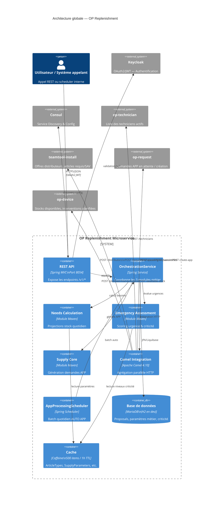

---

## 3. Architecture hexagonale — Modules

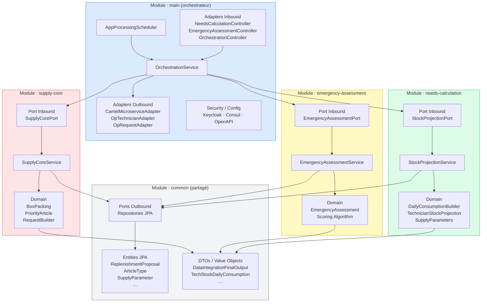

---

## 4. Modèle de données

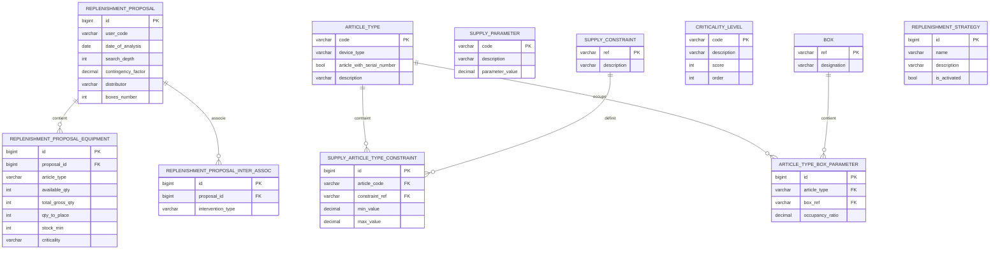

---

## 5. Flux principaux — Diagrammes de séquence

### 5.1 Orchestration complète

**Endpoint :** `POST /v1/orchestration/start?startDate=…&endDate=…`

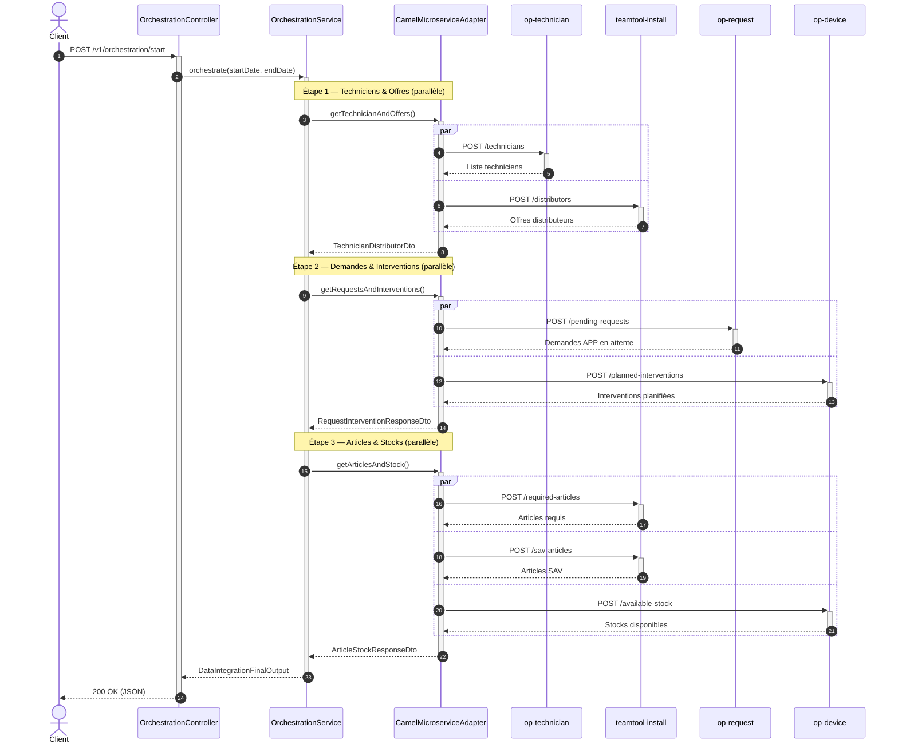

---

### 5.2 Calcul des besoins (Stock Projection)

**Endpoint :** `POST /v1/need-calculation`

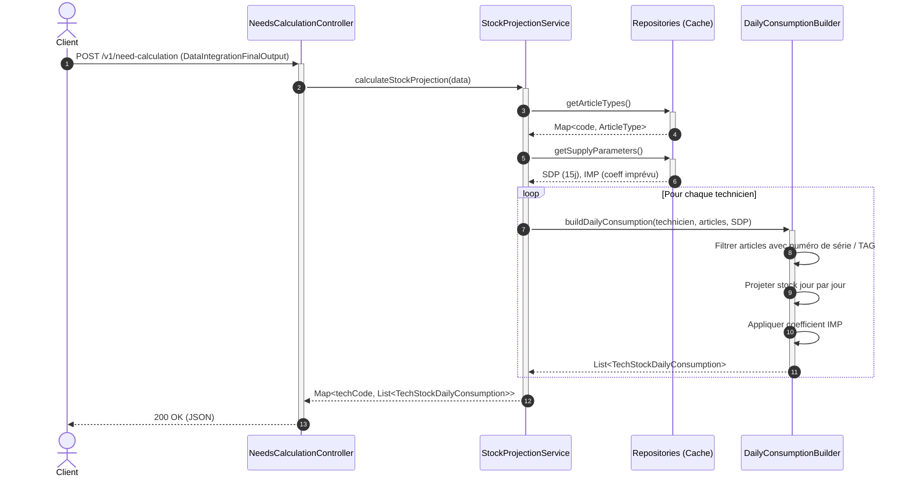

**Paramètres clés :**

| Param | Code | Valeur défaut | Rôle |
|-------|------|---------------|------|
| Profondeur analyse | SDP | 15 jours | Horizon de projection |
| Facteur imprévu | IMP | 0 | Multiplicateur de sécurité |

---

### 5.3 Évaluation des urgences (Emergency Assessment)

**Endpoint :** `POST /v1/emergency-assessment/calculate`

```mermaid
sequenceDiagram
    autonumber
    participant API as EmergencyAssessmentController
    participant SVC as EmergencyAssessmentService
    participant DOM as EmergencyAssessment (domain)
    participant REPO as Repositories (Cache)

    API->>+SVC: buildEmergencyMap(projections)

    SVC->>+REPO: getCriticalityLevels()
    REPO-->>-SVC: CRITICAL_A/B · URGENT_A/B · SAFE

    SVC->>+REPO: getSupplyParameters()
    REPO-->>-SVC: CDS, CDE, UDS, UDE

    loop Pour chaque technicien / article
        SVC->>+DOM: assess(dailyConsumption, parameters)

        note over DOM: Étape 1 — Urgence quantitative
        DOM->>DOM: Stock restant < 0 dans SDP jours ?
        DOM->>DOM: Calculer score jours avant rupture

        note over DOM: Étape 2 — Urgence temporelle
        DOM->>DOM: Jours dans fenêtre criticité [CDS–CDE] ?
        DOM->>DOM: Jours dans fenêtre urgence [UDS–UDE] ?

        note over DOM: Étape 3 — Score combiné
        DOM->>DOM: Score = f(quantitatif, temporel, pondération)

        note over DOM: Étape 4 — Classification
        DOM->>DOM: Score ≥ 300 → CRITICAL_A
        DOM->>DOM: Score ≥ 250 → CRITICAL_B
        DOM->>DOM: Score ≥ 210 → URGENT_A
        DOM->>DOM: Score ≥ 160 → URGENT_B
        DOM->>DOM: Score < 160 → SAFE

        DOM-->>-SVC: TechArticleDetail (criticality, score)
    end

    SVC-->>-API: Map<techCode, List<TechArticleDetail>>
```

**Niveaux de criticité :**

| Code | Score | Priorité |
|------|-------|----------|
| CRITICAL_A | 300 | 1 — Critique Grade A |
| CRITICAL_B | 250 | 2 — Critique Grade B |
| URGENT_A   | 210 | 3 — Urgent Grade A |
| URGENT_B   | 160 | 4 — Urgent Grade B |
| SAFE       | 0   | 5 — Sécurisé |

---

### 5.4 Génération des demandes APP (Supply Core)

**Appelé par :** `OrchestrationService.calculate()`

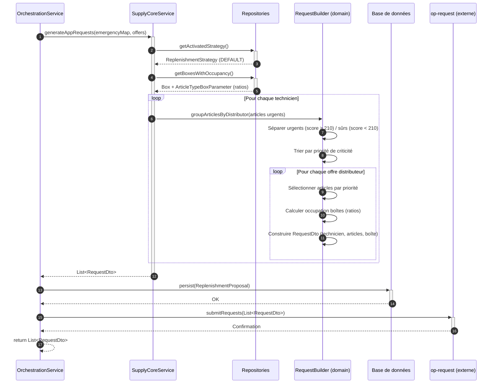

---

### 5.5 Scheduler — Création automatique des APP

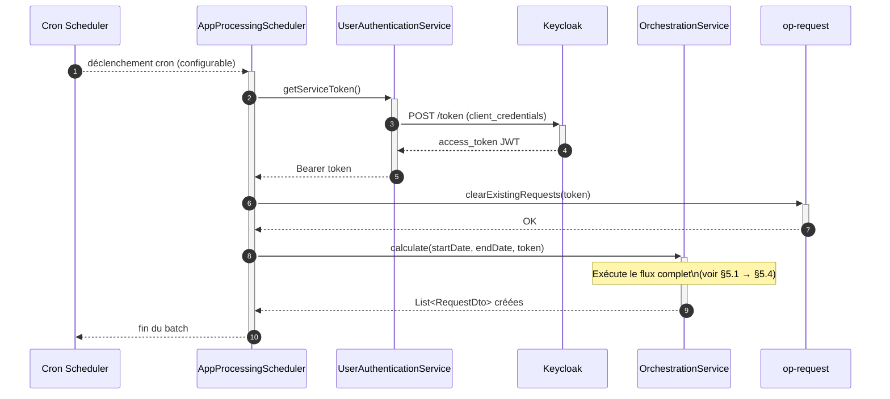

---

## 6. Intégration Camel — Routes HTTP

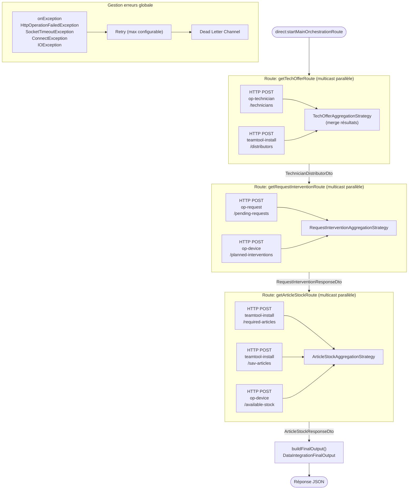

**Pool de connexions Camel :**

| Paramètre | Valeur |
|-----------|--------|
| Pool size total | 200 |
| Pool par route | 50 |
| Keep-alive | 60s |
| Socket timeout | 60s |
| Virtual Threads | Activés |

---

## 7. Sécurité

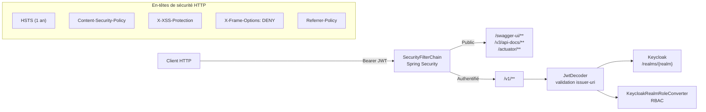

---

## 8. Déploiement

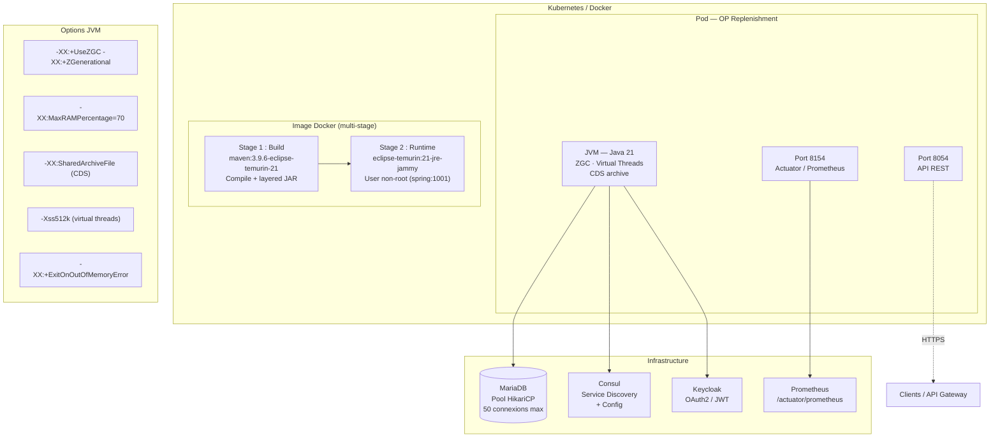

**Health Check :**
```
GET http://localhost:8154/actuator/health
Interval: 30s | Timeout: 3s | StartPeriod: 60s | Retries: 3
```

---

## 9. Paramètres métier

### Paramètres de calcul (table `supply_parameter`)

| Code | Description | Valeur défaut | Usage |
|------|-------------|---------------|-------|
| **SDP** | Profondeur d'analyse (jours) | 15 | Horizon de projection stock |
| **IMP** | Facteur d'imprévu (coefficient) | 0 | Sécurité sur quantités calculées |
| **CDS** | Date début criticité (j) | 1 | Début fenêtre critique |
| **CDE** | Date fin criticité (j) | 5 | Fin fenêtre critique |
| **UDS** | Date début urgence (j) | 6 | Début fenêtre urgente |
| **UDE** | Date fin urgence (j) | 8 | Fin fenêtre urgente |

### Règle de scoring d'urgence

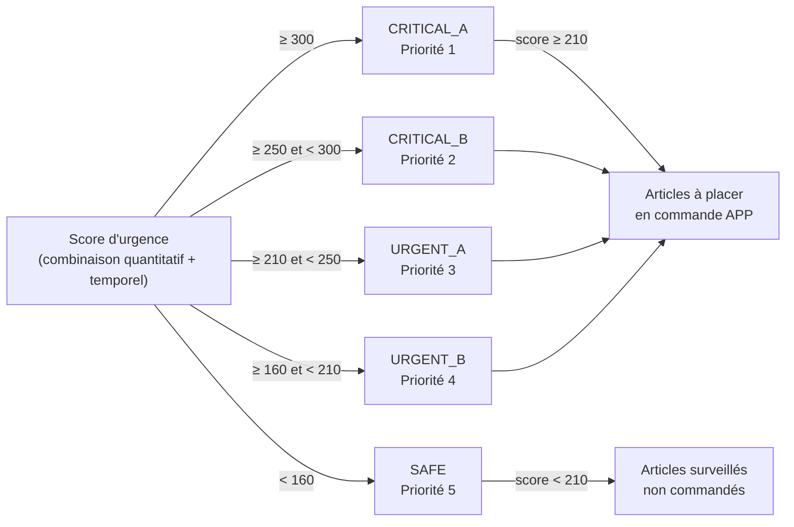

### Stack technologique

| Couche | Technologie | Version |
|--------|-------------|---------|
| Runtime | Java / Eclipse Temurin | 21 LTS |
| Framework | Spring Boot | 3.5.7 |
| Build | Maven | 3.9.6 |
| Intégration | Apache Camel | 4.10.2 |
| Base de données | MariaDB / H2 | — |
| Migration | Liquibase | 4.20.0 |
| Cache | Caffeine | — |
| Auth | Keycloak / OAuth2 JWT | — |
| Discovery | Consul | — |
| API Docs | Springdoc OpenAPI | 2.8.14 |
| Observabilité | Micrometer / Prometheus | — |
| Conteneurisation | Docker | — |

---

## Incohérences et anomalies détectées

> Anomalies identifiées lors de l'analyse du code source, des routes Camel et de la configuration.

---

### IC-TEC-01 — Deux enums `RequestStatusEnum` avec des valeurs différentes

**Localisation :**
- `common/src/main/.../dto/enumerations/RequestStatusEnum.java` → valeur `AV`
- `main/src/main/.../domain/enums/RequestStatutsEnum.java` → valeur `F` (note: typo "Statuts" au lieu de "Status")

Ces deux enums représentent le même concept (statut d'une demande de réapprovisionnement) mais dans deux modules différents (`common` vs `main`). Ils ont des valeurs distinctes : `AV` (utilisé dans supply-core pour filtrer les demandes "à valider") vs `F` (utilisé dans les routes Camel pour filtrer les demandes "à faire"). Un filtre qui utilise l'un ne retrouvera pas les demandes filtrées par l'autre.

**Impact :** Les routes Camel filtrent sur `F` alors que le domaine métier émet des demandes en statut `AV`. Résultat : les demandes créées par supply-core ne sont jamais traitées par les routes d'orchestration.

---

### IC-TEC-02 — Message d'erreur erroné dans `OrchestrationService.calculate()`

**Localisation :** `OrchestrationService.java:253`

```java
// Recherche du paramètre SDP mais le message dit IMP
supplyParams.stream().filter(p -> p.getCode().equals(SupplyParamCodeEnum.SDP.name()))
    .findFirst()
    .orElseThrow(() -> new TechnicalException("Supply parameter IMP not found"));
```

Quand le paramètre `SDP` (Horizon de planification) est absent, l'exception indique que c'est `IMP` (Indice de Mise en Place) qui manque. Le diagnostic sera systématiquement trompeur.

**Impact :** Débogage impossible en production — la chaîne d'appel semble chercher IMP alors que c'est SDP qui manque.

---

### IC-TEC-03 — Détection d'erreur trop large dans `isErrorResponse()`

**Localisation :** `OrchestrationService.java` — méthode `isErrorResponse()`

```java
private boolean isErrorResponse(String jsonResponse) {
    return jsonResponse.contains("error");
}
```

Toute réponse JSON contenant le mot `"error"` dans n'importe quel champ (ex: `"error_handling": false`, `"error_code": 0`, `"description": "no error"`) sera interprétée comme une erreur. Les faux positifs provoquent des exceptions inutiles et masquent les vrais succès.

**Impact :** Réponses valides rejetées comme erreurs. Comportement instable selon le format de réponse des services externes.

---

### IC-TEC-04 — Token null génère un header `Authorization: Bearer null`

**Localisation :** `OrchestrationService.java` — méthode `getTokenFromAuthentication()`

La méthode retourne `null` si l'authentification est absente ou si le principal n'est pas un `Jwt`. En aval, `buildHeaders(token)` construit `"Bearer " + null` = `"Bearer null"`. Aucune vérification du token avant l'envoi aux routes Camel.

**Impact :** Toutes les routes Camel reçoivent un header d'authentification invalide. Les services cibles rejettent silencieusement les appels. Pas d'exception levée côté op-replenishment — les appels échouent silencieusement.

---

### IC-TEC-05 — `persistAllProposal()` non transactionnel sur un batch potentiellement large

**Localisation :** `ReplenishmentProposalService.java:17-18`

La méthode `persistAllProposal()` appelle `saveAll()` sur une liste potentiellement volumineuse de `ReplenishmentProposal` sans annotation `@Transactional`. En cas d'erreur à mi-parcours (contrainte base, timeout), une partie des propositions est persistée et l'autre non. Il n'existe aucun mécanisme de rollback ou de reprise.

**Impact :** Base de données en état incohérent — propositions partiellement créées. Le prochain batch ne sait pas lesquelles ont été créées, risque de doublons après correction.

---

### IC-TEC-06 — Timeout Camel multicast non configuré en production

**Localisation :** Routes Camel — `.timeout(camelExceptionProperties.getTimeout())`

La propriété `camelExceptionProperties.timeout` n'est pas définie dans `application.yml` de production. Elle tombe sur `null` ou `0`, ce qui désactive effectivement le timeout sur les routes multicast. En cas de service externe non répondant, la route Camel reste bloquée indéfiniment.

**Comparaison :** Le fichier `application-test.yml` définit correctement un timeout à 15 000 ms.

**Impact :** Une défaillance d'un service externe peut bloquer tous les threads Camel en production. Pas d'alarme, pas de circuit-breaker.

---

### IC-TEC-07 — Race condition dans les routes Camel multicast

**Localisation :** `OrchestrationRouteUtils.java:286-291`

La méthode `buildTechRequestsFilterDto()` lit le header `TECH_USER_CODES` positionné avant le multicast. Lors de l'agrégation multicast, les headers d'échange peuvent être écrasés ou absents selon la stratégie d'agrégation. Si le header est absent, un `NullPointerException` est levé lors de l'appel à `.stream()` sur `technicianList`.

**Impact :** Instabilité des routes sous charge — les échanges multicast peuvent échouer de manière non déterministe.

---

### IC-TEC-08 — Stratégie de réapprovisionnement sans gestion des cas futurs

**Localisation :** `SupplyCoreService.java:75-82`

Le `switch` sur `ReplenishmentStrategyEnum` ne contient qu'un `default` qui loge un warning et retourne une liste vide. Si une nouvelle stratégie est ajoutée à l'enum sans implémentation correspondante dans ce switch, elle sera silencieusement ignorée — aucune erreur de compilation ni d'exécution.

**Impact :** Nouvelle stratégie non implémentée = comportement fantôme. Le système semble fonctionner mais ne produit aucune proposition.

---

### IC-TEC-09 — Appel bloquant `.block()` dans un contexte `CompletableFuture`

**Localisation :** `OrchestrationService.java:319-321` + `OpRequestAdapter.java:35-45`

`createReplenishmentRequests()` est appelé dans une chaîne `CompletableFuture.thenApply()` (non-bloquant), mais l'implémentation interne utilise `WebClient` avec `.block()` (bloquant). Cela crée un thread-blocking à l'intérieur d'une opération censée être asynchrone, annulant le bénéfice de l'async et risquant un deadlock sur les pools de threads réactifs.

**Impact :** Dégradation des performances sous charge. Risque de deadlock si le pool de threads réactif est saturé.

---

### IC-TEC-10 — Chargement dupliqué des contraintes articles

**Localisation :**
- `SupplyCoreService.java:143-154` — charge les contraintes depuis le repository
- `OrchestrationService.java:333-344` — recharge les mêmes contraintes pour construire les propositions finales

Le même jeu de données (contraintes par type d'article) est chargé deux fois depuis la base de données dans le même cycle de calcul, avec des structures de Map différentes. Le cache `@Cacheable("supplyArticleTypeConstraints")` défini sur le repository n'est pas utilisé par `SupplyCoreService.loadConstraints()` qui reconstruit une structure différente.

**Impact :** Deux requêtes SQL redondantes à chaque calcul. Performance dégradée inutilement sur les grands référentiels.
