# Documentation Fonctionnelle — OP Replenishment

**Version :** 0.0.1-SNAPSHOT  
**Date :** 2026-04-07  
**Domaine :** Gestion du réapprovisionnement en pièces pour techniciens terrain

---

## Table des matières

1. [Présentation du domaine](#1-présentation-du-domaine)
2. [Acteurs et systèmes](#2-acteurs-et-systèmes)
3. [Glossaire métier](#3-glossaire-métier)
4. [Cas d'utilisation](#4-cas-dutilisation)
5. [Règles de gestion](#5-règles-de-gestion)
   - 5.1 [Projection de stock quotidien](#51-projection-de-stock-quotidien)
   - 5.2 [Scoring d'urgence et criticité](#52-scoring-durgence-et-criticité)
   - 5.3 [Génération de la demande APP](#53-génération-de-la-demande-app)
6. [Paramètres configurables](#6-paramètres-configurables)
7. [Référentiels articles et contraintes](#7-référentiels-articles-et-contraintes)
8. [Flux fonctionnels end-to-end](#8-flux-fonctionnels-end-to-end)
9. [Processus automatique (batch)](#9-processus-automatique-batch)
10. [Impacts et limites fonctionnelles](#10-impacts-et-limites-fonctionnelles)

---

## 1. Présentation du domaine

### Problématique

Les techniciens terrain interviennent quotidiennement chez des clients pour des opérations d'installation, de maintenance et de dépannage. Ils disposent chacun d'un stock embarqué de pièces détachées. Ce stock doit être suffisant pour couvrir les interventions planifiées sur un horizon glissant.

Sans système de réapprovisionnement proactif, les techniciens risquent :
- Des ruptures de stock pendant une intervention
- Des délais supplémentaires pour le client
- Des coûts de réexpédition urgente

### Objectif du microservice

**OP Replenishment** automatise la détection des besoins en réapprovisionnement et la création de demandes d'approvisionnement (APP) pour chaque technicien, en anticipant les consommations sur les 15 prochains jours (horizon configurable).

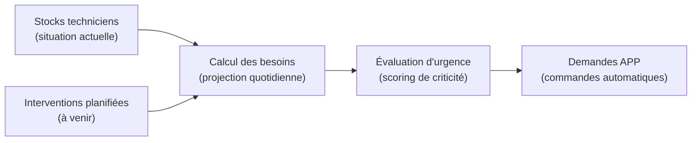

---

## 2. Acteurs et systèmes

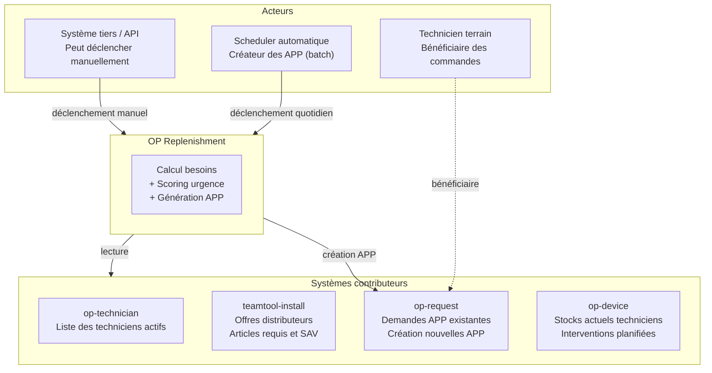

### Rôles

| Acteur | Rôle fonctionnel |
|--------|-----------------|
| **Technicien terrain** | Reçoit les pièces commandées ; son stock est projeté pour anticiper les besoins |
| **Scheduler automatique** | Déclenche chaque jour la création des APP en batch, après nettoyage des demandes précédentes |
| **Système tiers / API** | Peut déclencher le calcul ou les sous-étapes manuellement (via REST authentifié) |
| **op-technician** | Fournit la liste des techniciens actifs avec leur coefficient d'imprévu individuel |
| **teamtool-install** | Fournit les offres des distributeurs, la composition des bundles, les articles requis et SAV |
| **op-request** | Archive les demandes APP passées (évite les doublons) et reçoit les nouvelles commandes |
| **op-device** | Fournit les stocks réels par technicien et la liste des interventions planifiées |

---

## 3. Glossaire métier

| Terme | Définition |
|-------|------------|
| **APP** | *Approvisionnement* — Demande de réapprovisionnement automatique créée pour un technicien auprès d'un distributeur. |
| **Technicien** | Agent terrain identifié par un code unique (`userCode`), rattaché à un ou plusieurs distributeurs. |
| **Intervention** | Visite planifiée chez un client. Trois types : **SAV** (dépannage), **SS** (maintenance), **EX** (ajout d'option). |
| **Bundle** | Ensemble prédéfini d'articles nécessaires à une intervention donnée (identifié par une référence). Un bundle principal + bundles optionnels. |
| **Distributeur** | Fournisseur de pièces (ex. ORANGE, GROUPAMA). Identifié par un code propriétaire d'offre. |
| **Offre** | Contrat d'approvisionnement d'un distributeur (ex. GBH2, MPO2). Définit les articles disponibles et les contraintes associées. |
| **Stock min / max** | Seuils de stock définis par article et par offre. En dessous du min = déclenchement de la commande. La quantité commandée vise le milieu de la fourchette. |
| **SDP** | *Search Depth Parameter* — Horizon d'analyse en jours (défaut : 15 jours). |
| **IMP** | *Facteur d'imprévu* — Coefficient multiplicateur de sécurité appliqué aux consommations prévisionnelles (défaut : 0 = pas de marge). |
| **Criticité** | Niveau de priorité d'un besoin : CRITICAL_A, CRITICAL_B, URGENT_A, URGENT_B, SAFE. |
| **Score d'urgence** | Valeur numérique synthétisant l'urgence quantitative + temporelle + l'importance de l'article. |
| **Article requis** | Pièce nécessaire à une intervention de type SS ou EX, définie dans le bundle. |
| **Article SAV** | Pièce de remplacement pour une intervention de type SAV (dépannage), suivie individuellement (numéro de série). |
| **UrQ** | *Urgence Quantitative* — Score 0 ou 100 selon que le stock passe ou non sous le seuil minimum dans la fenêtre d'analyse. |
| **UrT** | *Urgence Temporelle* — Score 50, 100 ou 150 selon la date prévisionnelle de rupture par rapport aux fenêtres configurées. |
| **ImP** | *Importance* — Poids de l'article dans le calcul du score (100 pour les articles standard, 10 pour les badges TAG). |
| **Boîte (Box)** | Contenant physique d'expédition. Le nombre de boîtes est calculé en fonction du volume occupé par les articles à envoyer. |
| **Proposition de réapprovisionnement** | Enregistrement persisté en base de données résumant l'analyse pour un technicien (articles, quantités, criticité). |

---

## 4. Cas d'utilisation

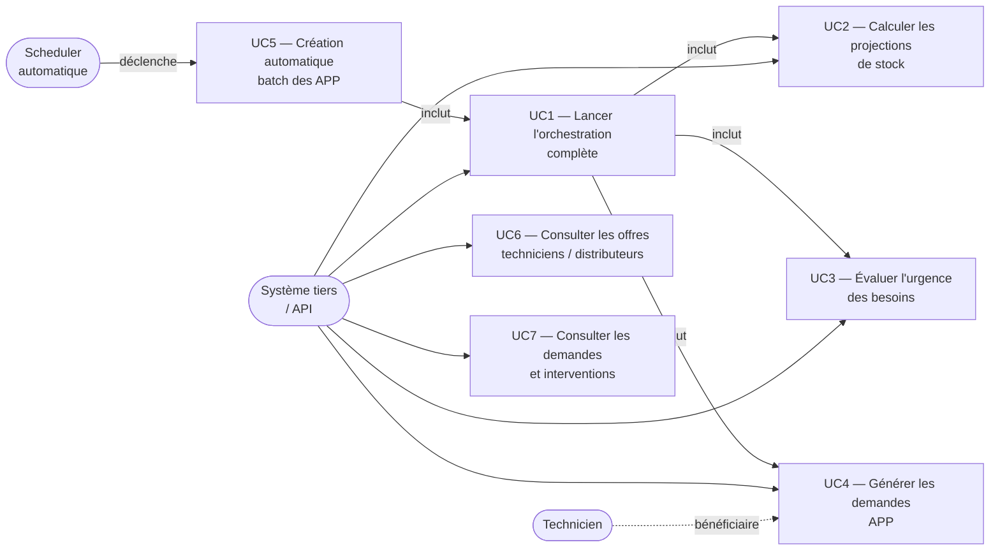

### Description des cas d'utilisation

#### UC1 — Lancer l'orchestration complète
- **Acteur principal :** Système tiers (API) ou scheduler
- **Pré-conditions :** Token OAuth2 valide
- **Description :** Agrège les données de tous les microservices externes, calcule les besoins, évalue l'urgence, génère et soumet les demandes APP
- **Post-conditions :** Propositions persistées en base, APP créées dans op-request

#### UC2 — Calculer les projections de stock
- **Acteur principal :** Système tiers ou orchestration interne
- **Description :** Pour chaque technicien, projette le niveau de stock article par article sur SDP jours en tenant compte des consommations prévisionnelles
- **Post-conditions :** Map de consommation quotidienne par technicien

#### UC3 — Évaluer l'urgence des besoins
- **Acteur principal :** Système tiers ou orchestration interne
- **Pré-conditions :** Projections de stock calculées (UC2)
- **Description :** Attribue un score d'urgence et un niveau de criticité à chaque article de chaque technicien
- **Post-conditions :** Map d'urgences par technicien avec criticité et quantité à commander

#### UC4 — Générer les demandes APP
- **Acteur principal :** Système tiers ou orchestration interne
- **Pré-conditions :** Map d'urgences calculée (UC3)
- **Description :** Groupe les articles par technicien/distributeur, calcule le conditionnement en boîtes, construit et soumet les RequestDto
- **Post-conditions :** APP soumises à op-request

#### UC5 — Création automatique batch des APP
- **Acteur principal :** Scheduler (cron configurable)
- **Description :** Supprime les APP existantes, s'authentifie sur Keycloak, lance l'orchestration complète (UC1)
- **Post-conditions :** APP du jour créées pour tous les techniciens actifs

#### UC6 — Consulter les offres techniciens / distributeurs
- **Acteur principal :** Système tiers
- **Description :** Retourne la liste combinée des techniciens actifs et des offres distributeurs disponibles
- **Endpoint :** `GET /v1/orchestration/technician-offer`

#### UC7 — Consulter les demandes et interventions
- **Acteur principal :** Système tiers
- **Description :** Retourne les demandes APP en attente et les interventions planifiées
- **Endpoint :** `POST /v1/orchestration/request-intervention`

---

## 5. Règles de gestion

### 5.1 Projection de stock quotidien

**Objectif :** Simuler le niveau de stock d'un technicien jour par jour sur les SDP prochains jours en tenant compte des consommations prévisionnelles issues de ses interventions planifiées.

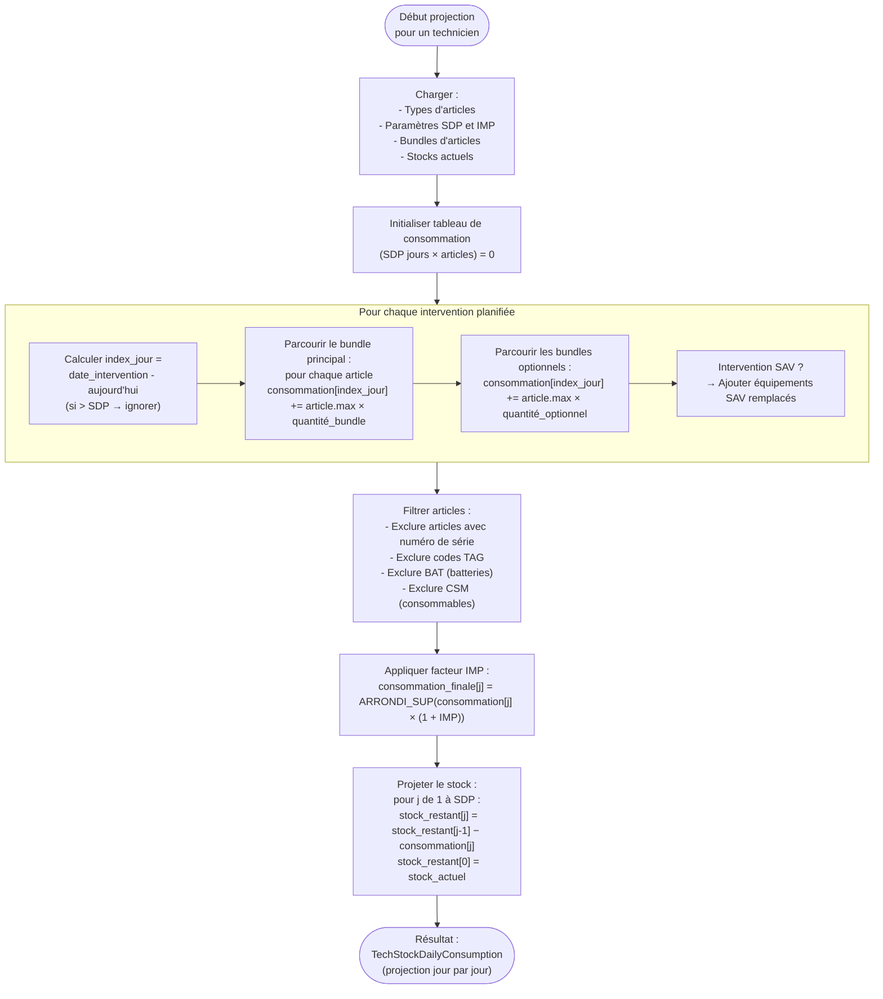

**Règles spécifiques :**

| Règle | Description |
|-------|-------------|
| **RG-PROJ-01** | Les articles avec numéro de série individuel sont exclus de la projection (traités séparément) |
| **RG-PROJ-02** | Les badges TAG sont inclus mais avec un poids d'importance réduit (ImP = 10 vs 100) |
| **RG-PROJ-03** | Batteries (BAT) et consommables (CSM) sont exclus de la projection de stock |
| **RG-PROJ-04** | Le facteur IMP est appliqué article par article avec arrondi au supérieur |
| **RG-PROJ-05** | Si une intervention dépasse l'horizon SDP, elle est ignorée |
| **RG-PROJ-06** | La consommation SAV est calculée à partir des équipements réellement remplacés (1 unité par équipement) |

---

### 5.2 Scoring d'urgence et criticité

**Objectif :** Attribuer à chaque article d'un technicien un niveau de criticité permettant de prioriser les commandes. Le score est la somme de trois composantes.

#### Composantes du score

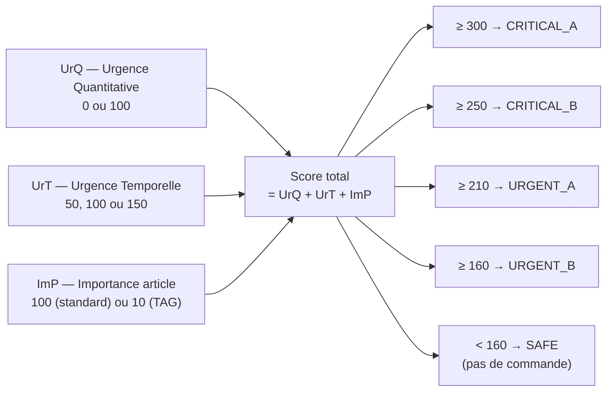

#### Calcul de l'urgence quantitative (UrQ)

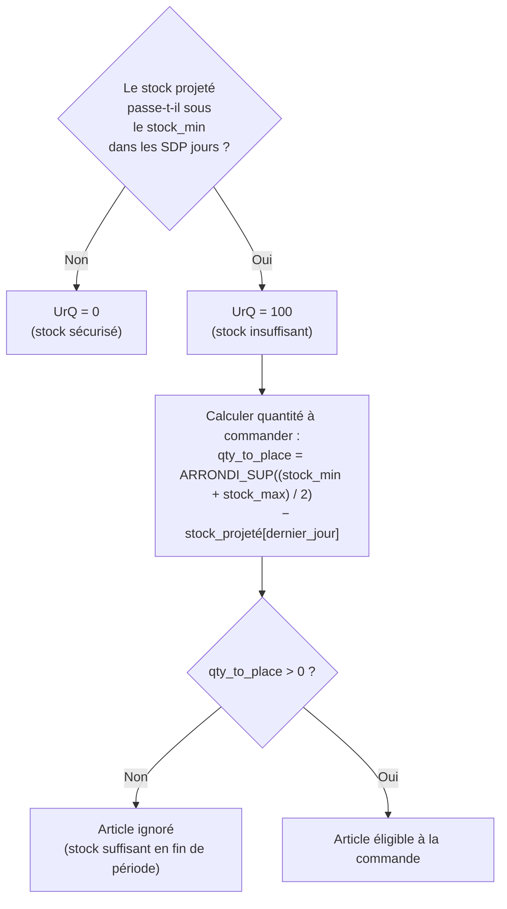

#### Calcul de l'urgence temporelle (UrT)

*S'applique uniquement si UrQ = 100.*

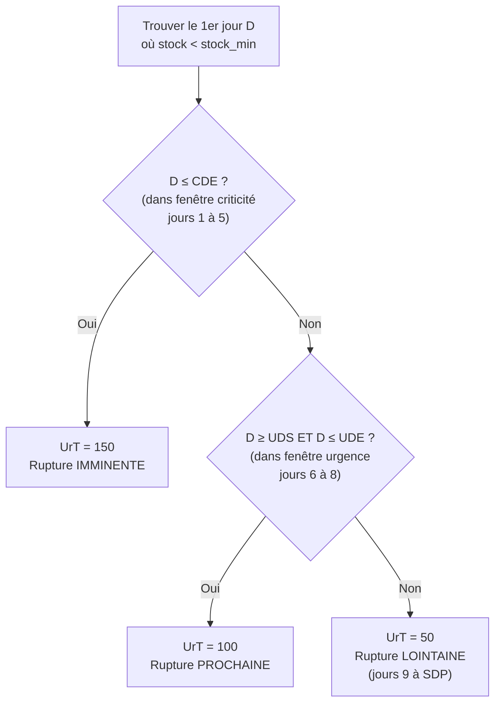

#### Fenêtres temporelles (valeurs par défaut)

```
Aujourd'hui  J+1   J+2   J+3   J+4   J+5   J+6   J+7   J+8   J+9 … J+15
             ├─────────────────────────┤  ╔══════════════╗  ╔───────────────╗
             │  Fenêtre CRITIQUE (UrT=150) ║ Urgence (UrT=100) ║  Faible (UrT=50)
             │  CDS=1 ────────── CDE=5 │  ╚UDS=6 ─── UDE=8╝  ╚───────────────╝
```

#### Règle de synchronisation SIM / GAT

| Règle | Description |
|-------|-------------|
| **RG-EMERG-01** | Si un technicien a à la fois un besoin en SIM et en GAT, la quantité à commander pour SIM est alignée sur celle de GAT (les deux articles sont toujours commandés en même nombre) |

#### Tableau de criticité

| Niveau | Score minimum | Priorité | Commande créée ? |
|--------|--------------|----------|-----------------|
| **CRITICAL_A** | 300 | 1 — Critique Grade A | Oui |
| **CRITICAL_B** | 250 | 2 — Critique Grade B | Oui |
| **URGENT_A** | 210 | 3 — Urgent Grade A | Oui |
| **URGENT_B** | 160 | 4 — Urgent Grade B | Oui |
| **SAFE** | < 160 | 5 — Sécurisé | Non |

> **Règle de seuil de commande (RG-EMERG-02)** : Seuls les articles avec un score ≥ 160 (URGENT_B ou supérieur) font l'objet d'une demande APP.

#### Exemples de scores

| UrQ | UrT | ImP | Score | Criticité | Interprétation |
|-----|-----|-----|-------|-----------|----------------|
| 100 | 150 | 100 | **350** → 300 cap | CRITICAL_A | Rupture dans 1-5j, article standard |
| 100 | 100 | 100 | **300** | CRITICAL_A | Rupture dans 6-8j, article standard |
| 100 | 50 | 100 | **250** | CRITICAL_B | Rupture dans 9-15j, article standard |
| 100 | 150 | 10 | **260** | CRITICAL_B | Rupture imminente, badge TAG |
| 100 | 100 | 10 | **210** | URGENT_A | Rupture prochaine, badge TAG |
| 100 | 50 | 10 | **160** | URGENT_B | Rupture lointaine, badge TAG |
| 0 | — | — | **0** | SAFE | Aucune rupture prévue |

---

### 5.3 Génération de la demande APP

**Objectif :** Construire, pour chaque technicien et chaque distributeur, une demande d'approvisionnement structurée avec la liste des articles et le nombre de boîtes nécessaires.

#### Structure d'une demande APP

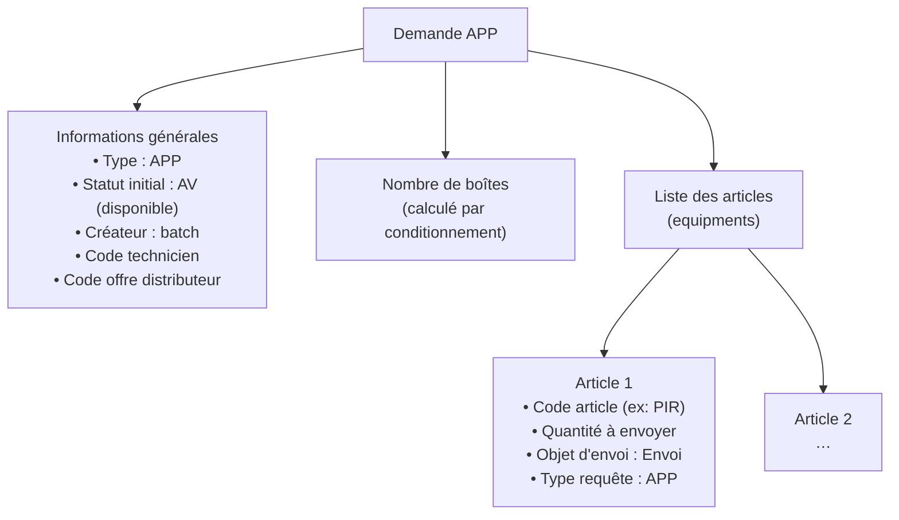

#### Algorithme de conditionnement en boîtes

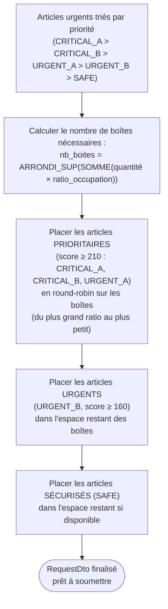

**Ratios d'occupation par article (exemples) :**

| Article | Ratio occupation boîte | Interprétation |
|---------|----------------------|----------------|
| SIM | 0,001 | Très faible encombrement |
| GAT | 0,125 | 12,5 % du volume d'une boîte |
| PIR | 0,010 | 1 % du volume d'une boîte |
| OSD | Configurable | Capteur de porte |
| TAG | Configurable | Badge RFID |
| CAE | Configurable | Terminal/clavier |

**Règles de conditionnement :**

| Règle | Description |
|-------|-------------|
| **RG-BOX-01** | Le nombre de boîtes est calculé par arrondi supérieur du volume total occupé |
| **RG-BOX-02** | Les articles prioritaires (score ≥ 210) sont toujours placés en premier |
| **RG-BOX-03** | La distribution en boîtes se fait en round-robin pour équilibrer le chargement |
| **RG-BOX-04** | Les articles SAFE peuvent ne pas être inclus si les boîtes sont pleines |

---

## 6. Paramètres configurables

Ces paramètres sont stockés en base de données (table `supply_parameter`) et modifiables sans redéploiement.

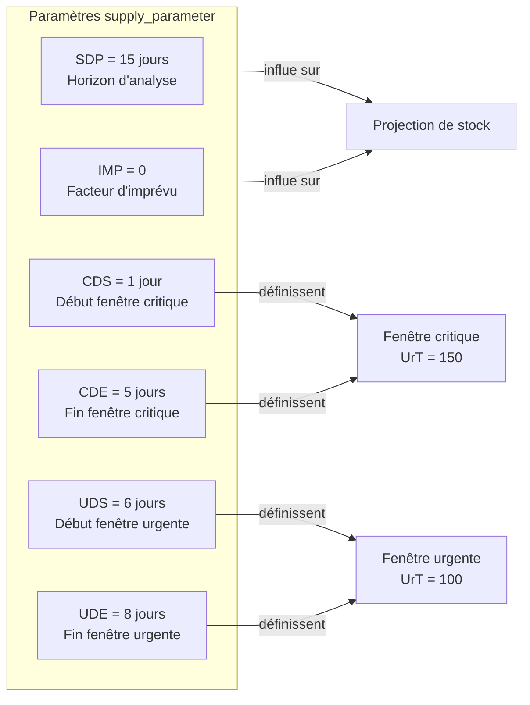

| Code | Description | Valeur défaut | Impact d'une modification |
|------|-------------|---------------|--------------------------|
| **SDP** | Horizon d'analyse (jours) | 15 | Plus grand → plus d'interventions prises en compte → plus de besoins détectés |
| **IMP** | Facteur d'imprévu (0 à 1) | 0 (0 %) | 0,15 → +15 % sur les quantités prévisionnelles, commandes plus importantes |
| **CDS** | Début fenêtre critique (jours) | 1 | Avancer → élargit la zone à UrT=150 |
| **CDE** | Fin fenêtre critique (jours) | 5 | Reculer → élargit la zone à UrT=150 |
| **UDS** | Début fenêtre urgente (jours) | 6 | Doit être CDE+1 pour cohérence |
| **UDE** | Fin fenêtre urgente (jours) | 8 | Au-delà → UrT=50 (faible urgence) |

---

## 7. Référentiels articles et contraintes

### Types d'articles traités

| Code | Description | Imprévu (ImP) | Suivi sériel |
|------|-------------|---------------|-------------|
| **SIM** | Carte SIM | 100 | Non |
| **GAT** | Passerelle GSM | 100 | Non |
| **PIR** | Détecteur de mouvement | 100 | Non |
| **TAG** | Badge RFID | **10** | Non |
| **CAE** | Terminal / clavier | 100 | Non |
| **OSD** | Détecteur porte/optique | 100 | Non |
| **REM** | Télécommande | 100 | Non |

> Les articles à suivi sériel sont exclus de la projection de stock automatique.

### Contraintes par article et par offre

Les seuils min/max de stock sont définis par couple (article, offre distributeur) :

| Article | ORANGE (GBH2) — min/max | GROUPAMA (MPO2) — min/max |
|---------|------------------------|--------------------------|
| SIM | 12 / 20 | 12 / 24 |
| GAT | 12 / 20 | 12 / 24 |
| PIR | 17 / 28 | 24 / 48 |
| TAG | 14 / 24 | 24 / 48 |
| CAE | 2 / 4 | 3 / 6 |
| OSD | 32 / 54 | 35 / 70 |
| REM | 4 / 6 | 1 / 3 |

> **RG-CONTRAINTE-01** : La quantité à commander vise le milieu de la fourchette min/max, calculée à partir du stock projeté en fin de période.

---

## 8. Flux fonctionnels end-to-end

### Vue d'ensemble du flux complet

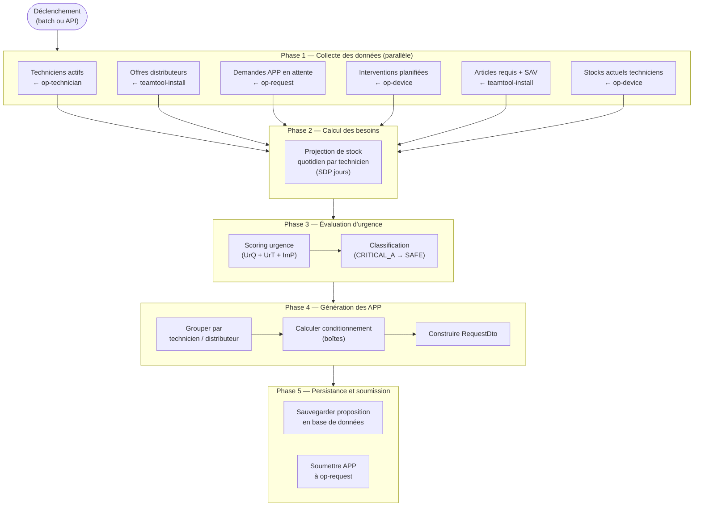

### Flux de décision par article

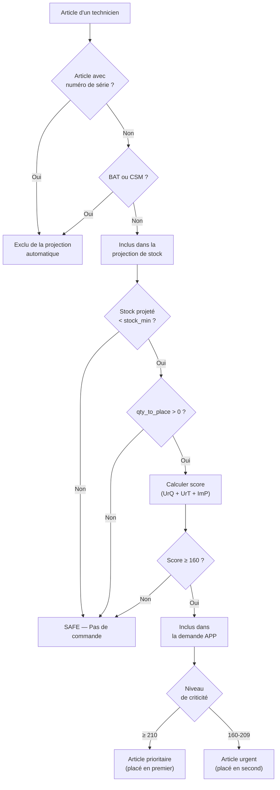

---

## 9. Processus automatique (batch)

Le scheduler exécute quotidiennement le cycle complet de réapprovisionnement selon le cron configuré dans `opreplenishment.scheduler.clear-create-auto-app.cron`.

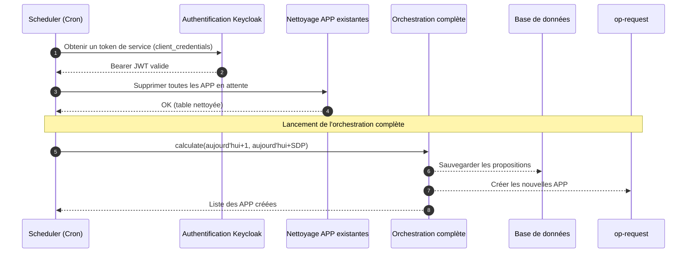

**Règles du batch :**

| Règle | Description |
|-------|-------------|
| **RG-BATCH-01** | Le batch efface TOUTES les APP précédentes avant d'en créer de nouvelles |
| **RG-BATCH-02** | La période analysée commence le lendemain (J+1) jusqu'à J+SDP |
| **RG-BATCH-03** | Le batch s'authentifie de manière autonome via Keycloak (client_credentials) |
| **RG-BATCH-04** | En cas d'échec d'un appel externe, Camel tente une nouvelle fois avant de basculer en dead-letter |

---

## 10. Impacts et limites fonctionnelles

### Règles de cohérence

| Règle | Description |
|-------|-------------|
| **RG-COH-01** | SIM et GAT sont toujours commandés en même quantité pour un même technicien |
| **RG-COH-02** | Une APP n'est créée que si au moins un article a un score ≥ 160 |
| **RG-COH-03** | Les contraintes (stock_min, stock_max, ImP) dépendent de l'offre distributeur : un même article peut avoir des seuils différents selon le distributeur |
| **RG-COH-04** | Le facteur IMP global (paramètre SDP) peut être surchargé par un facteur individuel par technicien |
| **RG-COH-05** | Les interventions dont la date est au-delà de l'horizon SDP sont ignorées dans le calcul |

### Limites connues

| Limite | Description |
|--------|-------------|
| Pas de commande partielle | Si le score d'un article est < 160, l'article n'est pas commandé même si son stock est proche du minimum |
| Articles sériels exclus | Les articles suivis individuellement (numéro de série) ne sont pas couverts par le réapprovisionnement automatique |
| Horizon fixe | La projection est limitée à SDP jours ; les interventions au-delà ne sont pas anticipées |
| Dépendance aux données externes | La qualité du calcul dépend entièrement de l'exactitude des stocks fournis par op-device et des interventions planifiées |
| Batch destructif | Le batch supprime TOUTES les APP en attente avant de les recréer ; toute APP modifiée manuellement entre deux exécutions sera perdue |
