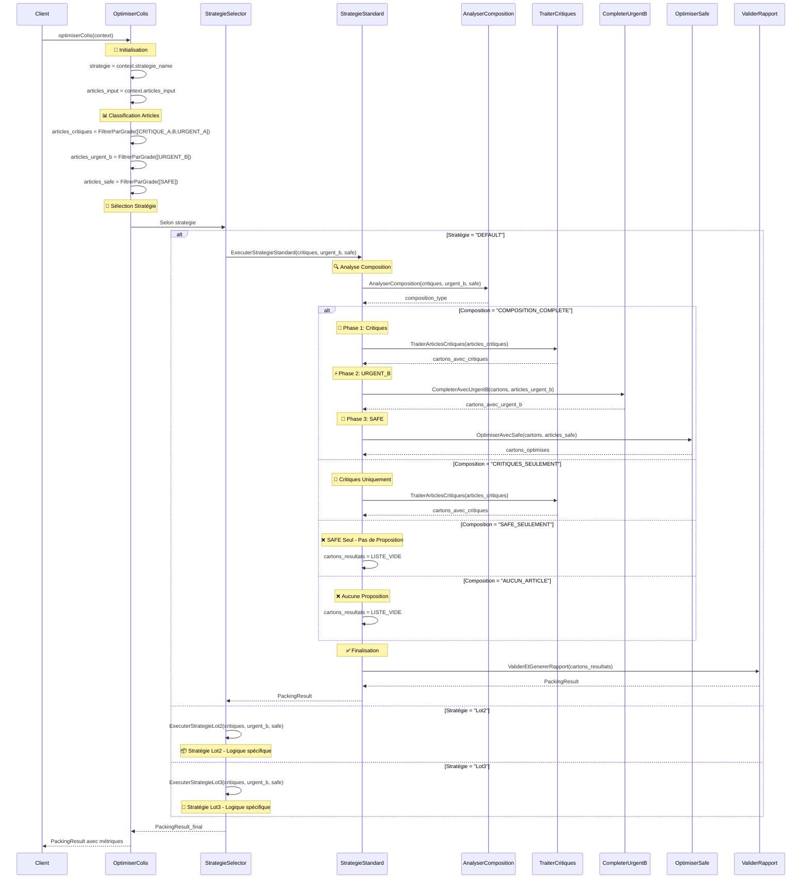
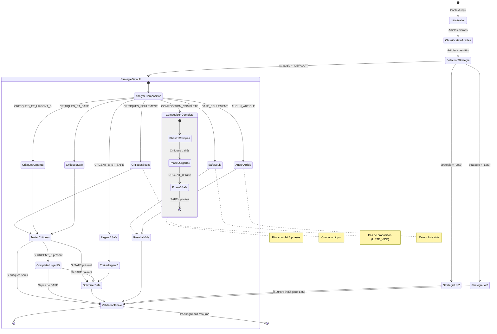
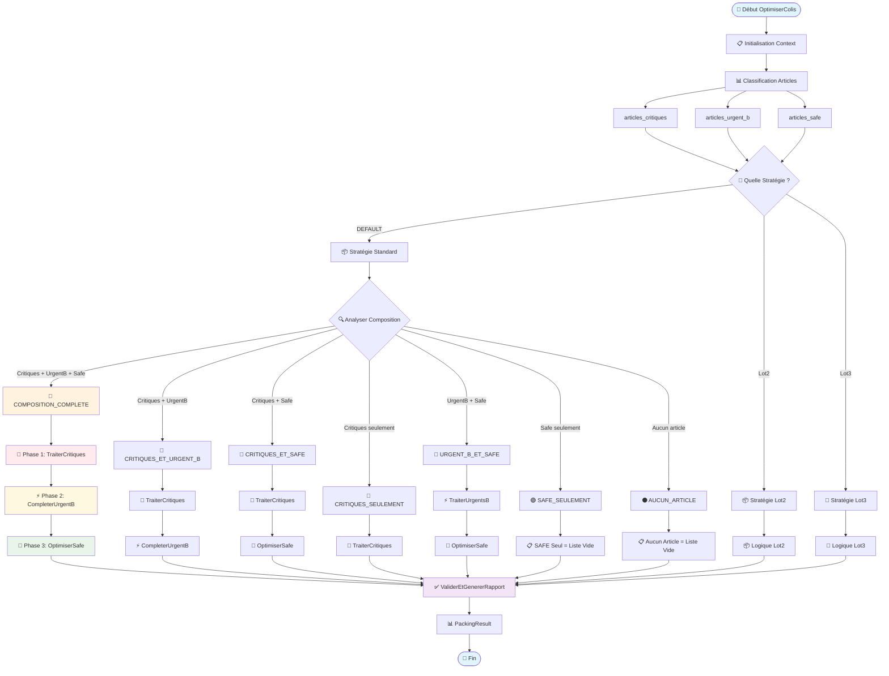
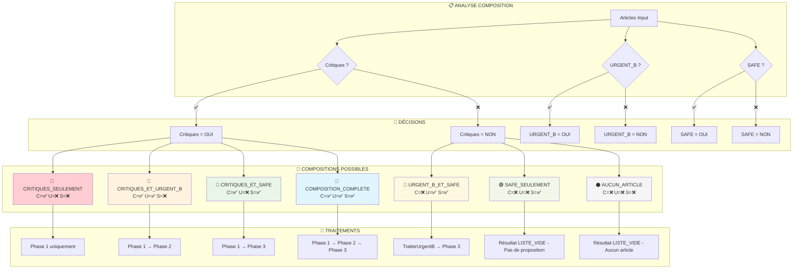
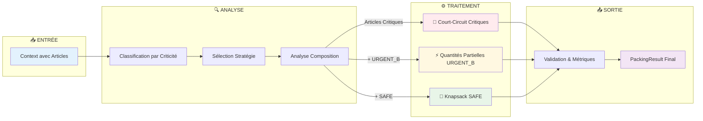

# Diagrammes Visuels - Algorithme OptimiserColis

## 🎯 1. Diagramme de Séquence Global



## 🔄 2. Diagramme d'État - Flux Décisionnel



## 🌊 3. Flowchart Détaillé - Logique Décisionnelle



## 📊 4. Diagramme de Composition - Matrice Visuelle



## 🎯 5. Diagramme de Flux Simplifié - Vue Métier



## 📋 Matrice des Changements Appliqués

| Modification | Ancien Comportement | Nouveau Comportement | Impact Diagrammes |
|--------------|-------------------|-------------------|------------------|
| **Stratégies** | PREMIUM, EXPRESS | **Lot2**, **Lot3** | Tous diagrammes mis à jour |
| **SAFE_SEULEMENT** | `OptimiserSafeUniquement()` | **`LISTE_VIDE()`** | Flowchart + État modifiés |
| **Nomenclature** | Stratégies génériques | **Stratégies par lots** | Séquence + État |

## 📊 Nouvelle Matrice Stratégique

| Stratégie | Usage | Articles Traités | Résultat SAFE Seul |
|-----------|-------|------------------|-------------------|
| **DEFAULT** | Stratégie standard Lot1 | Tous types avec logique complète | ❌ **LISTE_VIDE** |
| **Lot2** | Stratégie spécifique Lot2 | À définir selon besoins Lot2 | À définir |
| **Lot3** | Stratégie spécifique Lot3 | À définir selon besoins Lot3 | À définir |

## 🎯 Résumé des Diagrammes Mis à Jour

| Diagramme | Usage | Audience | Détail | Changements Appliqués |
|-----------|--------|----------|--------|---------------------|
| **Séquence Global** | Interactions temporelles complètes | Développeurs/Architectes | Très détaillé | ✅ Lot2/Lot3, SAFE_SEULEMENT=VIDE |
| **État Décisionnel** | Flux de décision et transitions | Analystes métier | Logique business | ✅ Nouvelles stratégies, SafeSeuls→ResultatVide |
| **Flowchart Détaillé** | Logique algorithmique complète | Développeurs | Implémentation | ✅ Branches Lot2/Lot3, EmptyResultSafe |
| **Matrice Composition** | 7 cas de composition possibles | Product Owner | Vue métier | ✅ Case6 modifié (LISTE_VIDE) |
| **Flux Simplifié** | Vue d'ensemble du processus | Management | Vue exécutive | ✅ Cohérent avec modifications |

## ⚠️ Points d'Attention Métier

- **SAFE_SEULEMENT** retourne maintenant **LISTE_VIDE** au lieu d'optimiser
- **Stratégies Lot2/Lot3** nécessiteront une implémentation spécifique
- **Logique Default** reste inchangée pour les autres cas de composition

Ces diagrammes mis à jour reflètent **fidèlement** l'algorithme modifié ! 🎯

---

## ✅ CRITÈRES D'ACCEPTATION - Algorithme OptimiserColis

### CA-001 : Sélection de Stratégie ✅
```gherkin
Given un context avec strategie_name = "DEFAULT"
When j'exécute OptimiserColis(context)
Then la stratégie ExecuterStrategieStandard est appelée
  And les articles sont classifiés par grade avant traitement
  And le résultat final est un PackingResult validé

Given un context avec strategie_name = "Lot2"
When j'exécute OptimiserColis(context)
Then la stratégie ExecuterStrategieLot2 est appelée
  And les mêmes articles classifiés sont passés en paramètre

Given un context avec strategie_name = "Lot3"
When j'exécute OptimiserColis(context)
Then la stratégie ExecuterStrategieLot3 est appelée
  And les mêmes articles classifiés sont passés en paramètre

Given un context avec strategie_name = "INEXISTANT"
When j'exécute OptimiserColis(context)
Then la stratégie par défaut ExecuterStrategieStandard est appelée
```

### CA-002 : Classification Initiale des Articles ✅
```gherkin
Given une liste d'articles mixtes [CRITIQUE_A, CRITIQUE_B, URGENT_A, URGENT_B, SAFE]
When j'exécute OptimiserColis(context)
Then articles_critiques contient [CRITIQUE_A, CRITIQUE_B, URGENT_A] uniquement
  And articles_urgent_b contient [URGENT_B] uniquement
  And articles_safe contient [SAFE] uniquement
  And la classification est effectuée une seule fois au début

Given une liste d'articles contenant uniquement des SAFE
When j'exécute OptimiserColis(context)
Then articles_critiques est vide
  And articles_urgent_b est vide
  And articles_safe contient tous les articles SAFE
```

### CA-003 : Stratégie DEFAULT - Cas COMPOSITION_COMPLETE ✅
```gherkin
Given des articles de tous types (CRITIQUE_A/B, URGENT_A, URGENT_B, SAFE)
  And strategie_name = "DEFAULT"
When j'exécute OptimiserColis(context)
Then AnalyserComposition retourne "COMPOSITION_COMPLETE"
  And Phase 1: TraiterArticlesCritiques est exécutée avec tous articles critiques
  And Phase 2: CompleterAvecUrgentB est exécutée avec cartons existants + URGENT_B
  And Phase 3: OptimiserAvecSafe est exécutée avec cartons existants + SAFE
  And ValiderEtGenererRapport est appelée pour finalisation
```

### CA-004 : Stratégie DEFAULT - Cas CRITIQUES_SEULEMENT ✅
```gherkin
Given une liste d'articles contenant uniquement CRITIQUE_A, CRITIQUE_B, URGENT_A
  And strategie_name = "DEFAULT"
When j'exécute OptimiserColis(context)
Then AnalyserComposition retourne "CRITIQUES_SEULEMENT"
  And TraiterArticlesCritiques est exécutée une seule fois
  And CompleterAvecUrgentB n'est pas exécutée
  And OptimiserAvecSafe n'est pas exécutée
  And tous les articles critiques sont traités à 100%
```

### CA-005 : Stratégie DEFAULT - Cas CRITIQUES_ET_URGENT_B ✅
```gherkin
Given des articles CRITIQUE_A/B + URGENT_A + URGENT_B (pas de SAFE)
  And strategie_name = "DEFAULT"
When j'exécute OptimiserColis(context)
Then AnalyserComposition retourne "CRITIQUES_ET_URGENT_B"
  And TraiterArticlesCritiques est exécutée en premier
  And CompleterAvecUrgentB est exécutée avec les cartons créés
  And OptimiserAvecSafe n'est pas exécutée
  And les quantités partielles URGENT_B sont gérées selon RG-005
```

### CA-006 : Stratégie DEFAULT - Cas CRITIQUES_ET_SAFE ✅
```gherkin
Given des articles CRITIQUE_A/B + URGENT_A + SAFE (pas d'URGENT_B)
  And strategie_name = "DEFAULT"
When j'exécute OptimiserColis(context)
Then AnalyserComposition retourne "CRITIQUES_ET_SAFE"
  And TraiterArticlesCritiques est exécutée en premier
  And CompleterAvecUrgentB n'est pas exécutée
  And OptimiserAvecSafe est exécutée avec les cartons créés
  And l'algorithme knapsack optimise les articles SAFE
```

### CA-007 : Stratégie DEFAULT - Cas URGENT_B_ET_SAFE ✅
```gherkin
Given des articles URGENT_B + SAFE (pas de critiques)
  And strategie_name = "DEFAULT"
When j'exécute OptimiserColis(context)
Then AnalyserComposition retourne "URGENT_B_ET_SAFE"
  And TraiterArticlesCritiques n'est pas exécutée
  And TraiterArticlesUrgentsB est exécutée pour créer cartons URGENT_B
  And OptimiserAvecSafe est exécutée pour optimiser l'espace restant
```

### CA-008 : Stratégie DEFAULT - Cas SAFE_SEULEMENT (Nouveau Comportement) 🚨
```gherkin
Given une liste d'articles contenant uniquement des SAFE
  And strategie_name = "DEFAULT"
When j'exécute OptimiserColis(context)
Then AnalyserComposition retourne "SAFE_SEULEMENT"
  And aucun traitement d'optimisation n'est effectué
  And cartons_resultats = LISTE_VIDE()
  And ValiderEtGenererRapport retourne un PackingResult avec liste vide
  And le rapport indique "Pas de proposition pour articles SAFE uniquement"
```

### CA-009 : Stratégie DEFAULT - Cas AUCUN_ARTICLE ✅
```gherkin
Given une liste d'articles vide ou context.articles_input = []
  And strategie_name = "DEFAULT"
When j'exécute OptimiserColis(context)
Then AnalyserComposition retourne "AUCUN_ARTICLE"
  And aucun traitement n'est effectué
  And cartons_resultats = LISTE_VIDE()
  And ValiderEtGenererRapport retourne un PackingResult avec liste vide
```

### CA-010 : Fonction AnalyserComposition - Logique de Décision ✅
```gherkin
Given articles_critiques.taille > 0, articles_urgent_b.taille > 0, articles_safe.taille > 0
When j'appelle AnalyserComposition(articles_critiques, articles_urgent_b, articles_safe)
Then le résultat est "COMPOSITION_COMPLETE"

Given articles_critiques.taille > 0, articles_urgent_b.taille > 0, articles_safe.taille = 0
When j'appelle AnalyserComposition(articles_critiques, articles_urgent_b, articles_safe)
Then le résultat est "CRITIQUES_ET_URGENT_B"

Given articles_critiques.taille > 0, articles_urgent_b.taille = 0, articles_safe.taille > 0
When j'appelle AnalyserComposition(articles_critiques, articles_urgent_b, articles_safe)
Then le résultat est "CRITIQUES_ET_SAFE"

Given articles_critiques.taille > 0, articles_urgent_b.taille = 0, articles_safe.taille = 0
When j'appelle AnalyserComposition(articles_critiques, articles_urgent_b, articles_safe)
Then le résultat est "CRITIQUES_SEULEMENT"

Given articles_critiques.taille = 0, articles_urgent_b.taille > 0, articles_safe.taille > 0
When j'appelle AnalyserComposition(articles_critiques, articles_urgent_b, articles_safe)
Then le résultat est "URGENT_B_ET_SAFE"

Given articles_critiques.taille = 0, articles_urgent_b.taille = 0, articles_safe.taille > 0
When j'appelle AnalyserComposition(articles_critiques, articles_urgent_b, articles_safe)
Then le résultat est "SAFE_SEULEMENT"

Given articles_critiques.taille = 0, articles_urgent_b.taille = 0, articles_safe.taille = 0
When j'appelle AnalyserComposition(articles_critiques, articles_urgent_b, articles_safe)
Then le résultat est "AUCUN_ARTICLE"
```

### CA-011 : Performance et Optimisation ⚡
```gherkin
Given une liste d'articles importante (1000+ articles)
  And strategie_name = "DEFAULT"
When j'exécute OptimiserColis(context)
Then la classification initiale est effectuée une seule fois
  And le temps total d'exécution < 10 secondes
  And FiltrerParGrade est appelé exactement 3 fois au total
  And AnalyserComposition est appelé une seule fois

Given des articles répartis sur les 7 cas de composition
When j'exécute OptimiserColis pour chaque cas
Then seuls les traitements nécessaires sont exécutés pour chaque cas
  And les phases inutiles sont évitées (court-circuit logique)
```

### CA-012 : Stratégies Lot2 et Lot3 (À implémenter) 📋
```gherkin
Given un context avec strategie_name = "Lot2"
  And une implémentation d'ExecuterStrategieLot2
When j'exécute OptimiserColis(context)
Then ExecuterStrategieLot2 est appelée avec les 3 types d'articles classifiés
  And la logique spécifique Lot2 est appliquée
  And le résultat final est un PackingResult validé

Given un context avec strategie_name = "Lot3"
  And une implémentation d'ExecuterStrategieLot3
When j'exécute OptimiserColis(context)
Then ExecuterStrategieLot3 est appelée avec les 3 types d'articles classifiés
  And la logique spécifique Lot3 est appliquée
  And le résultat final est un PackingResult validé
```

### CA-013 : Gestion d'Erreurs et Validation 🛡️
```gherkin
Given un context avec strategie_name = null
When j'exécute OptimiserColis(context)
Then la stratégie par défaut ExecuterStrategieStandard est utilisée
  And aucune exception n'est levée

Given un context avec articles_input = null
When j'exécute OptimiserColis(context)
Then une exception appropriée est levée
  And le message indique "Articles input ne peut pas être null"

Given des articles avec des données incohérentes (grade null, quantité < 0)
When j'exécute OptimiserColis(context)
Then les articles invalides sont filtrés lors de la classification
  And un warning est généré dans les logs
  And le traitement continue avec les articles valides uniquement
```

### CA-014 : Intégration avec Validation Finale ✅
```gherkin
Given n'importe quel cas de composition traité
When le traitement spécifique est terminé
Then ValiderEtGenererRapport est toujours appelée
  And le PackingResult contient les métriques appropriées
  And les quantités partielles sont reportées si applicable
  And le temps d'exécution est enregistré
  And la validation des contraintes est effectuée

Given un cas SAFE_SEULEMENT ou AUCUN_ARTICLE
When ValiderEtGenererRapport est appelée avec LISTE_VIDE
Then le PackingResult indique clairement l'absence de proposition
  And les métriques reflètent l'absence de traitement
  And aucune erreur de validation n'est générée
```

## 📊 Matrice de Couverture des Tests

| Cas de Composition | Critères Couverts | Tests Performance | Tests Erreur |
|-------------------|-------------------|------------------|-------------|
| **COMPOSITION_COMPLETE** | CA-003 | CA-011 | CA-013 |
| **CRITIQUES_SEULEMENT** | CA-004 | CA-011 | - |
| **CRITIQUES_ET_URGENT_B** | CA-005 | CA-011 | - |
| **CRITIQUES_ET_SAFE** | CA-006 | CA-011 | - |
| **URGENT_B_ET_SAFE** | CA-007 | CA-011 | - |
| **SAFE_SEULEMENT** | CA-008 🚨 | CA-011 | CA-014 |
| **AUCUN_ARTICLE** | CA-009 | - | CA-013, CA-014 |
| **Stratégies Lot2/Lot3** | CA-012 | À définir | CA-013 |

**Total : 14 critères d'acceptation** couvrant tous les aspects de l'algorithme modifié ! 🎯
