# Diagrammes Visuels - Algorithme OptimiserColis

## 🎯 1. Diagramme de Séquence Global

```mermaid
sequenceDiagram
    participant Client
    participant Orchestrateur as OptimiserColis
    participant Strategy as StrategieSelector
    participant Standard as StrategieStandard
    participant Analyseur as AnalyserComposition
    participant Phase1 as TraiterCritiques
    participant Phase2 as CompleterUrgentB
    participant Phase3 as OptimiserSafe
    participant Validateur as ValiderRapport

    Client->>Orchestrateur: optimiserColis(context)

    Note over Orchestrateur: 🚀 Initialisation
    Orchestrateur->>Orchestrateur: strategie = context.strategie_name
    Orchestrateur->>Orchestrateur: articles_input = context.articles_input

    Note over Orchestrateur: 📊 Classification Articles
    Orchestrateur->>Orchestrateur: articles_critiques = FiltrerParGrade([CRITIQUE_A,B,URGENT_A])
    Orchestrateur->>Orchestrateur: articles_urgent_b = FiltrerParGrade([URGENT_B])
    Orchestrateur->>Orchestrateur: articles_safe = FiltrerParGrade([SAFE])

    Note over Orchestrateur: 🎯 Sélection Stratégie
    Orchestrateur->>Strategy: Selon strategie

    alt Stratégie = "DEFAULT"
        Strategy->>Standard: ExecuterStrategieStandard(critiques, urgent_b, safe)

        Note over Standard: 🔍 Analyse Composition
        Standard->>Analyseur: AnalyserComposition(critiques, urgent_b, safe)
        Analyseur-->>Standard: composition_type

        alt Composition = "COMPOSITION_COMPLETE"
            Note over Standard: 🚨 Phase 1: Critiques
            Standard->>Phase1: TraiterArticlesCritiques(articles_critiques)
            Phase1-->>Standard: cartons_avec_critiques

            Note over Standard: ⚡ Phase 2: URGENT_B
            Standard->>Phase2: CompleterAvecUrgentB(cartons, articles_urgent_b)
            Phase2-->>Standard: cartons_avec_urgent_b

            Note over Standard: 🎯 Phase 3: SAFE
            Standard->>Phase3: OptimiserAvecSafe(cartons, articles_safe)
            Phase3-->>Standard: cartons_optimises

        else Composition = "CRITIQUES_SEULEMENT"
            Note over Standard: 🚨 Critiques Uniquement
            Standard->>Phase1: TraiterArticlesCritiques(articles_critiques)
            Phase1-->>Standard: cartons_avec_critiques

        else Composition = "SAFE_SEULEMENT"
            Note over Standard: 🎯 SAFE Uniquement
            Standard->>Phase3: OptimiserSafeUniquement(articles_safe)
            Phase3-->>Standard: cartons_optimises

        else Composition = "AUCUN_ARTICLE"
            Note over Standard: ❌ Aucune Proposition
            Standard->>Standard: cartons_resultats = VIDE
        end

        Note over Standard: ✅ Finalisation
        Standard->>Validateur: ValiderEtGenererRapport(cartons_resultats)
        Validateur-->>Standard: PackingResult
        Standard-->>Strategy: PackingResult

    else Stratégie = "PREMIUM"
        Strategy->>Strategy: ExecuterStrategiePremium(...)
        Note over Strategy: [Logique Premium]

    else Stratégie = "EXPRESS"
        Strategy->>Strategy: ExecuterStrategieExpress(...)
        Note over Strategy: [Logique Express]
    end

    Strategy-->>Orchestrateur: PackingResult_final
    Orchestrateur-->>Client: PackingResult avec métriques
```

## 🔄 2. Diagramme d'État - Flux Décisionnel

```mermaid
stateDiagram-v2
    [*] --> Initialisation : Context reçu

    Initialisation --> ClassificationArticles : Articles extraits
    ClassificationArticles --> SelectionStrategie : Articles classifiés

    SelectionStrategie --> StrategieDefault : strategie = "DEFAULT"
    SelectionStrategie --> StrategiePremium : strategie = "PREMIUM"
    SelectionStrategie --> StrategieExpress : strategie = "EXPRESS"

    state StrategieDefault {
        [*] --> AnalyseComposition

        AnalyseComposition --> CritiquesSeuls : CRITIQUES_SEULEMENT
        AnalyseComposition --> CritiquesUrgentB : CRITIQUES_ET_URGENT_B
        AnalyseComposition --> CritiquesSafe : CRITIQUES_ET_SAFE
        AnalyseComposition --> CompositionComplete : COMPOSITION_COMPLETE
        AnalyseComposition --> UrgentBSafe : URGENT_B_ET_SAFE
        AnalyseComposition --> SafeSeuls : SAFE_SEULEMENT
        AnalyseComposition --> AucunArticle : AUCUN_ARTICLE

        state CompositionComplete {
            [*] --> Phase1Critiques
            Phase1Critiques --> Phase2UrgentB : Critiques traités
            Phase2UrgentB --> Phase3Safe : URGENT_B traité
            Phase3Safe --> [*] : SAFE optimisé
        }

        CritiquesSeuls --> TraiterCritiques
        CritiquesUrgentB --> TraiterCritiques
        CritiquesSafe --> TraiterCritiques

        TraiterCritiques --> CompleterUrgentB : Si URGENT_B présent
        TraiterCritiques --> OptimiserSafe : Si SAFE présent
        TraiterCritiques --> ValidationFinale : Si critiques seuls

        CompleterUrgentB --> OptimiserSafe : Si SAFE présent
        CompleterUrgentB --> ValidationFinale : Si pas de SAFE

        UrgentBSafe --> TraiterUrgentB
        TraiterUrgentB --> OptimiserSafe

        SafeSeuls --> OptimiserSafeUnique

        AucunArticle --> ResultatVide

        OptimiserSafe --> ValidationFinale
        OptimiserSafeUnique --> ValidationFinale
        ResultatVide --> ValidationFinale
        ValidationFinale --> [*]
    }

    StrategiePremium --> ValidationFinale : [Logique Premium]
    StrategieExpress --> ValidationFinale : [Logique Express]

    ValidationFinale --> [*] : PackingResult retourné

    note right of CompositionComplete : Flux complet 3 phases
    note right of CritiquesSeuls : Court-circuit pur
    note right of SafeSeuls : Knapsack classique
    note right of AucunArticle : Retour liste vide
```

## 🌊 3. Flowchart Détaillé - Logique Décisionnelle

```mermaid
flowchart TD
    Start([🚀 Début OptimiserColis]) --> Init[📋 Initialisation Context]

    Init --> Extract[📊 Classification Articles]
    Extract --> Critiques[articles_critiques]
    Extract --> UrgentB[articles_urgent_b]
    Extract --> Safe[articles_safe]

    Critiques --> Strategy{🎯 Quelle Stratégie ?}
    UrgentB --> Strategy
    Safe --> Strategy

    Strategy -->|DEFAULT| DefaultStrat[📦 Stratégie Standard]
    Strategy -->|PREMIUM| PremiumStrat[💎 Stratégie Premium]
    Strategy -->|EXPRESS| ExpressStrat[⚡ Stratégie Express]

    DefaultStrat --> Analyze{🔍 Analyser Composition}

    Analyze -->|Critiques + UrgentB + Safe| Complete[🎯 COMPOSITION_COMPLETE]
    Analyze -->|Critiques + UrgentB| CritUrgent[🔶 CRITIQUES_ET_URGENT_B]
    Analyze -->|Critiques + Safe| CritSafe[🔷 CRITIQUES_ET_SAFE]
    Analyze -->|Critiques seulement| CritOnly[🔴 CRITIQUES_SEULEMENT]
    Analyze -->|UrgentB + Safe| UrgSafe[🔸 URGENT_B_ET_SAFE]
    Analyze -->|Safe seulement| SafeOnly[🟢 SAFE_SEULEMENT]
    Analyze -->|Aucun article| Empty[⚫ AUCUN_ARTICLE]

    Complete --> P1[🚨 Phase 1: TraiterCritiques]
    P1 --> P2[⚡ Phase 2: CompleterUrgentB]
    P2 --> P3[🎯 Phase 3: OptimiserSafe]
    P3 --> Validate

    CritUrgent --> P1b[🚨 TraiterCritiques]
    P1b --> P2b[⚡ CompleterUrgentB]
    P2b --> Validate

    CritSafe --> P1c[🚨 TraiterCritiques]
    P1c --> P3c[🎯 OptimiserSafe]
    P3c --> Validate

    CritOnly --> P1d[🚨 TraiterCritiques]
    P1d --> Validate

    UrgSafe --> TraitUrgent[⚡ TraiterUrgentsB]
    TraitUrgent --> P3d[🎯 OptimiserSafe]
    P3d --> Validate

    SafeOnly --> P3e[🎯 OptimiserSafeUnique]
    P3e --> Validate

    Empty --> EmptyResult[📋 Liste Vide]
    EmptyResult --> Validate

    PremiumStrat --> LogiquePremium[💎 Logique Premium]
    LogiquePremium --> Validate

    ExpressStrat --> LogiqueExpress[⚡ Logique Express]
    LogiqueExpress --> Validate

    Validate[✅ ValiderEtGenererRapport]
    Validate --> Result[📊 PackingResult]
    Result --> End([🎯 Fin])

    style Start fill:#e1f5fe
    style Complete fill:#fff3e0
    style P1 fill:#ffebee
    style P2 fill:#fff8e1
    style P3 fill:#e8f5e8
    style Validate fill:#f3e5f5
    style End fill:#e1f5fe
```

## 📊 4. Diagramme de Composition - Matrice Visuelle

```mermaid
graph TB
    subgraph " 📋 ANALYSE COMPOSITION "
        Input[Articles Input] --> C{Critiques ?}
        Input --> U{URGENT_B ?}
        Input --> S{SAFE ?}
    end

    subgraph " 🎯 DÉCISIONS "
        C -->|✅| CYes[Critiques = OUI]
        C -->|❌| CNo[Critiques = NON]
        U -->|✅| UYes[URGENT_B = OUI]
        U -->|❌| UNo[URGENT_B = NON]
        S -->|✅| SYes[SAFE = OUI]
        S -->|❌| SNo[SAFE = NON]
    end

    subgraph " 🎨 COMPOSITIONS POSSIBLES "
        CYes --> Case1[🔴 CRITIQUES_SEULEMENT<br/>C=✅ U=❌ S=❌]
        CYes --> Case2[🔶 CRITIQUES_ET_URGENT_B<br/>C=✅ U=✅ S=❌]
        CYes --> Case3[🔷 CRITIQUES_ET_SAFE<br/>C=✅ U=❌ S=✅]
        CYes --> Case4[🎯 COMPOSITION_COMPLETE<br/>C=✅ U=✅ S=✅]

        CNo --> Case5[🔸 URGENT_B_ET_SAFE<br/>C=❌ U=✅ S=✅]
        CNo --> Case6[🟢 SAFE_SEULEMENT<br/>C=❌ U=❌ S=✅]
        CNo --> Case7[⚫ AUCUN_ARTICLE<br/>C=❌ U=❌ S=❌]
    end

    subgraph " 🔄 TRAITEMENTS "
        Case1 --> Trait1[Phase 1 uniquement]
        Case2 --> Trait2[Phase 1 → Phase 2]
        Case3 --> Trait3[Phase 1 → Phase 3]
        Case4 --> Trait4[Phase 1 → Phase 2 → Phase 3]
        Case5 --> Trait5[TraiterUrgentB → Phase 3]
        Case6 --> Trait6[OptimiserSafe uniquement]
        Case7 --> Trait7[Résultat vide]
    end

    style Case1 fill:#ffcdd2
    style Case2 fill:#fff3e0
    style Case3 fill:#e8f5e8
    style Case4 fill:#e1f5fe
    style Case5 fill:#fff8e1
    style Case6 fill:#f1f8e9
    style Case7 fill:#f5f5f5
```

## 🎯 5. Diagramme de Flux Simplifié - Vue Métier

## 📋 Résumé des Diagrammes

| Diagramme | Usage | Audience | Détail |
|-----------|--------|----------|--------|
| **Séquence Global** | Interactions temporelles complètes | Développeurs/Architectes | Très détaillé |
| **État Décisionnel** | Flux de décision et transitions | Analystes métier | Logique business |
| **Flowchart Détaillé** | Logique algorithmique complète | Développeurs | Implémentation |
| **Matrice Composition** | 7 cas de composition possibles | Product Owner | Vue métier |
| **Flux Simplifié** | Vue d'ensemble du processus | Management | Vue exécutive |

Ces diagrammes offrent **5 perspectives différentes** du même algorithme, adaptées à chaque audience ! 🎯