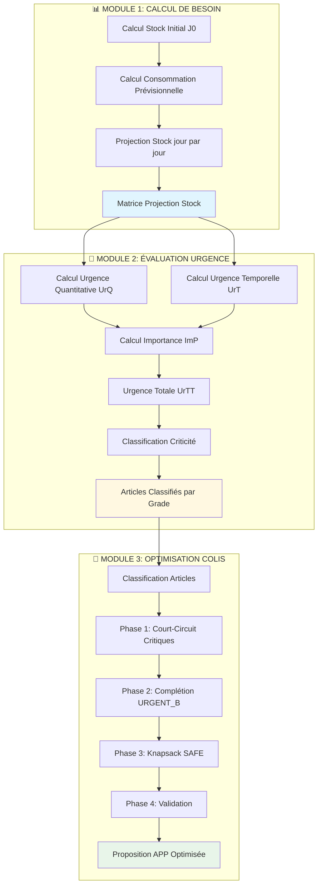
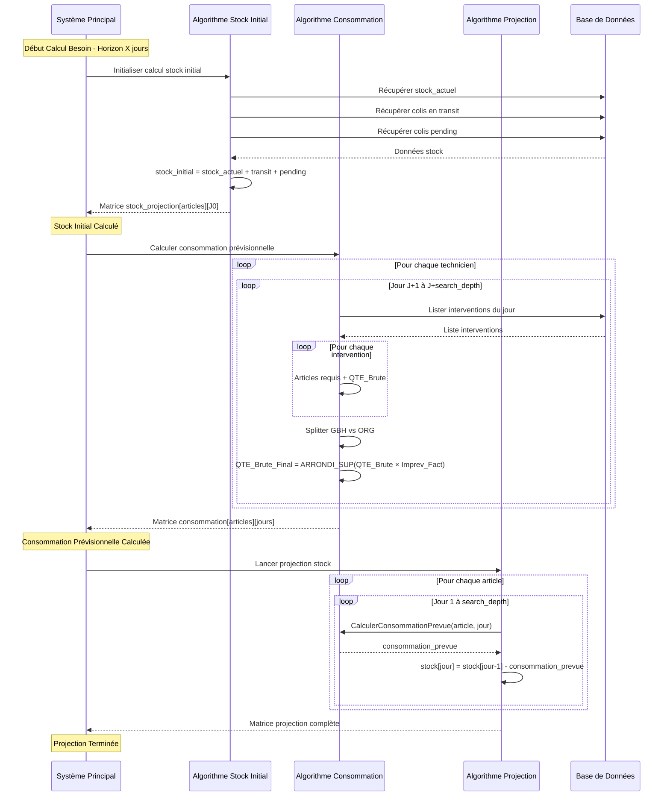
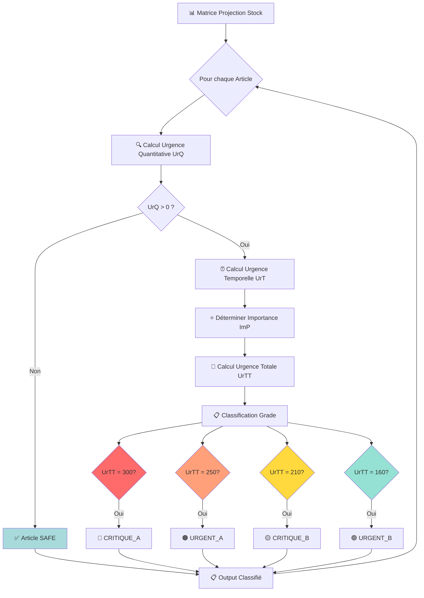
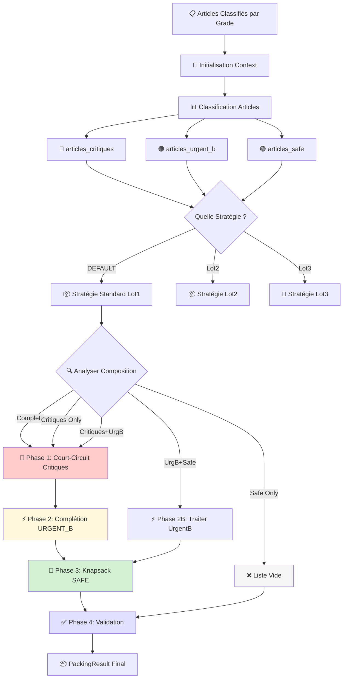
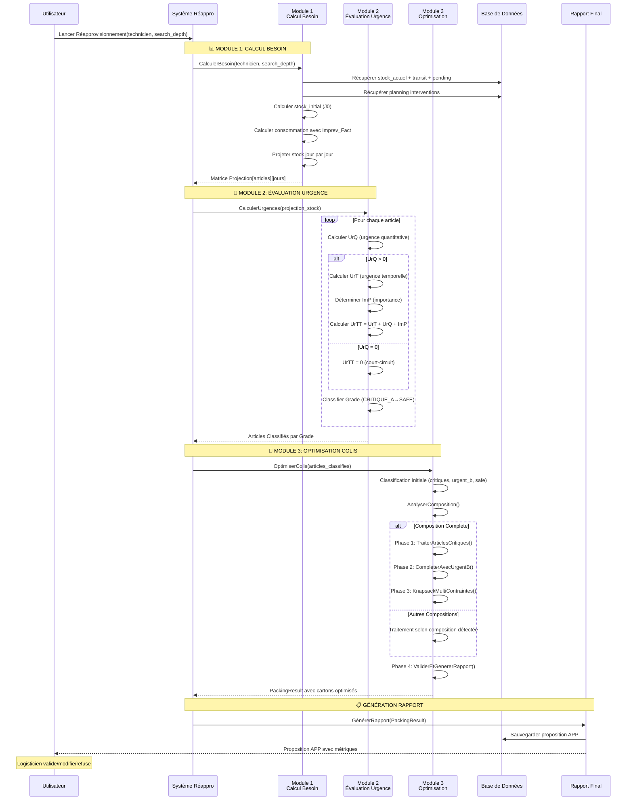
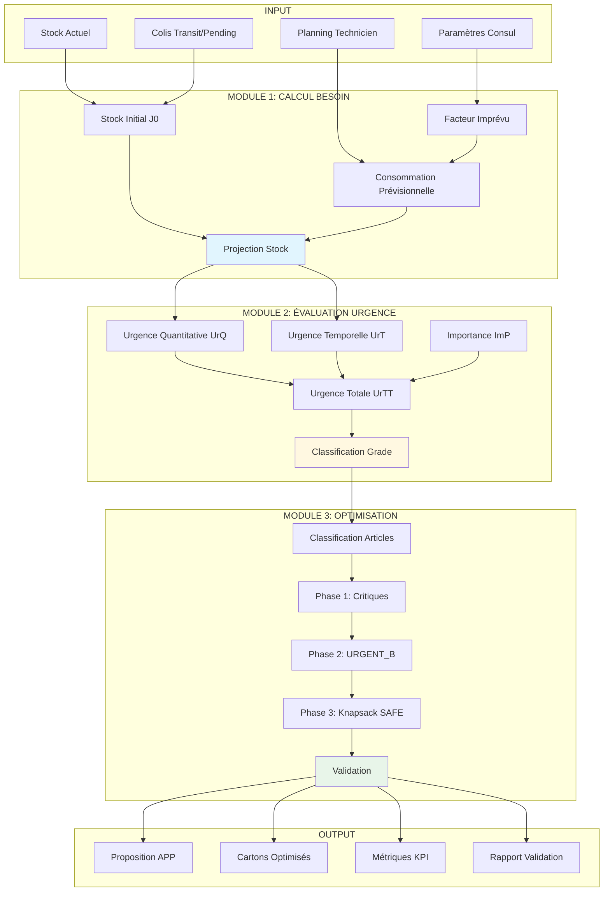

# 🚀 SYSTÈME DE RÉAPPROVISIONNEMENT AUTOMATIQUE - Documentation Consolidée

**Version :** 1.0
**Date :** 2025-09-30
**Tickets Jira :** TOP-6187, TOP-6188, TOP-6XXX

---

## 📋 Table des Matières

1. [Vue d'Ensemble du Système](#vue-densemble-du-système)
2. [Module 1 : Calcul de Besoin](#module-1--calcul-de-besoin)
3. [Module 2 : Évaluation d'Urgence](#module-2--évaluation-durgence)
4. [Module 3 : Core Moteur d'Optimisation](#module-3--core-moteur-doptimisation)
5. [Architecture Globale](#architecture-globale)
6. [Flux de Données Complet](#flux-de-données-complet)
7. [Règles de Gestion Transversales](#règles-de-gestion-transversales)
8. [Critères d'Acceptation Consolidés](#critères-dacceptation-consolidés)

---

## 🎯 1. Vue d'Ensemble du Système

### Objectif Global
Mettre en place un système de réapprovisionnement automatique des techniciens avec optimisation mathématique pour :
- ✅ **Garantir zéro rupture** pour les matériels critiques
- ✅ **Optimiser le nombre de colis** tout en respectant les priorités métier
- ✅ **Anticiper les besoins** sur un horizon temporel paramétrable
- ✅ **Prioriser automatiquement** selon plusieurs critères d'urgence

### Architecture 3 Modules



### Niveaux de Criticité

| Grade | Score UrTT | Description | Traitement |
|-------|-----------|-------------|------------|
| **CRITIQUE_A** | 300 | Scannable rupture imminente J0-J5 | Court-circuit Phase 1 |
| **CRITIQUE_B** | 210 | Déclarable/Consommable rupture J0-J5 | Court-circuit Phase 1 |
| **URGENT_A** | 250 | Scannable rupture modérée J6-J8 | Court-circuit Phase 1 |
| **URGENT_B** | 160 | Déclarable/Consommable rupture J6-J8 | Complétion Phase 2 |
| **SAFE** | 0 | Pas de criticité détectée | Knapsack Phase 3 |

---

## 📊 2. MODULE 1 : Calcul de Besoin

### 2.1 Contexte et Objectif

**En tant que** logisticien
**Je souhaite** mettre en place un module de calcul de besoin en matériel pour chaque technicien dans un horizon de X jours
**Afin de** pouvoir créer un APP en cohérence avec le besoin réel du technicien

### 2.2 Architecture du Module



### 2.3 Règles de Gestion

#### **RG01 - Calcul Stock Initial (J0)**

```pseudocode
FONCTION StockInitial(liste_articles_types, periode_jours)
DEBUT
    stock_projection = MATRICE[TAILLE(liste_articles_types), periode_jours + 1]

    POUR i DE 0 A TAILLE(liste_articles_types) FAIRE
        article_type = liste_articles_types[i]

        stock_initial = article_type.stock_actuel +
                       ObtenirQuantiteColisEnTransit(article_type) +
                       ObtenirQuantiteColisPending(article_type)

        stock_projection[i][0] = stock_initial
    FIN_POUR

    RETOURNER stock_projection
FIN
```

**Précisions :**
- ✅ Stock initial calculé pour chaque type d'article dans la BDD
- ❌ **Exclusions** : guides, stickers (signalétiques), piles (lot ultérieur)
- ✅ APP statut "En transit" → comptabilisées dans stock J0
- ✅ APP "Pending" (créées non expédiées) → comptabilisées dans stock J0

#### **RG02 - Calcul de Besoin avec Facteur d'Imprévu**

**Paramètres Configurables :**

| Paramètre | Description | Calcul | Exemple |
|-----------|-------------|--------|---------|
| `search_depth` | Horizon temporel d'analyse | Paramètre Consul | 15 jours |
| `Imprev_Fact` | Facteur d'imprévu/incertitude | `1 + (nbr_heures_libre / totale_heures_shift)` | 1.2 pour 24h libres/120h |

**Formule de Correction :**
```
QTE_BRUTE_FINALE = ARRONDI_SUP(QTE_BRUTE × Imprev_Fact)
```

**Exemple :**
- QTE_BRUTE = 12 unités
- Imprev_Fact = 1.6
- QTE_BRUTE_FINALE = ARRONDI_SUP(12 × 1.6) = ARRONDI_SUP(19.2) = **20 unités**

**Calcul du Facteur d'Imprévu (Lot 1) :**

```pseudocode
Imprev_Fact = 1 + (nbr_heures_libre / totale_heures_shift_dispo)

Exemple :
- Shift: 09h-19h → 10h/jour
- search_depth: 15 jours
- Jours ouvrables: 12 jours
- totale_heures_shift: 12 × 10 = 120h
- heures_libres_continues ≥ 1h: 24h détectées
- Imprev_Fact = 1 + (24/120) = 1.2

Si aucune heure libre continue ≥ 1h:
- Imprev_Fact = 1.0
```

**Output Structure :**
```
Besoin ORG:
  Article_Type1: QTE_Brute_Final_1
  Article_Type2: QTE_Brute_Final_2
  ...

Besoin GBH:
  Article_Type1: QTE_Brute_Final_1
  Article_Type2: QTE_Brute_Final_2
  ...
```

**Notes Importantes :**
- ✅ 1 Centrale = 1 Carte SIM (associés)
- ✅ 1 Cam EXT = 1 Panneau solaire (associés)
- ✅ Seuls les SS, SAV, EX sont analysés (pas les VE)

#### **RG03 - Projection Stock Jour par Jour**

```pseudocode
FONCTION ProjectionStockInitial(liste_articles_types, periode_jours)
DEBUT
    POUR i DE 0 A TAILLE(liste_articles_types) - 1 FAIRE
        article_type = liste_articles_types[i]

        POUR jour DE 1 A periode_jours FAIRE
            consommation_prevue = CalculerConsommationPrevue(article_type, jour)

            stock_projection[i][jour] = stock_projection[i][jour-1] - consommation_prevue
        FIN_POUR
    FIN_POUR

    RETOURNER stock_projection
FIN
```

**Exemple de Projection :**
```
Article avec stock_initial = 25 unités
Consommation_prevue: [3, 1, 4, 2, 0, 5, 1]

Résultat:
J0 = 25
J1 = 25 - 3 = 22
J2 = 22 - 1 = 21
J3 = 21 - 4 = 17
J4 = 17 - 2 = 15
J5 = 15 - 0 = 15
J6 = 15 - 5 = 10
J7 = 10 - 1 = 9
```

### 2.4 Critères d'Acceptation Module 1

```gherkin
# CA-M1-001: Paramètre search_depth
Given le Module de calcul de besoin configuré
  And le paramètre search_depth = 15 jours
When le calcul est lancé
Then le système analyse les plannings sur 15 jours
  And seuls les jours ouvrables sont pris en compte

# CA-M1-002: Facteur d'Imprévu
Given un technicien avec shift 09h-19h (10h/jour)
  And search_depth = 15 jours (12 jours ouvrables)
  And heures_shift_totales = 120h
  And heures_libres_continues ≥ 1h = 24h détectées
When Imprev_Fact est calculé
Then Imprev_Fact = 1 + (24/120) = 1.2

# CA-M1-003: Stock Initial avec Transit
Given un Article_Type avec stock_actuel = 10 unités
  And un colis en transit avec 5 unités
When l'initialisation du stock est effectuée
Then stock_initial = 15 unités
  And stock_projection[Article_Type][0] = 15

# CA-M1-004: Projection Stock
Given un Article_Type avec stock_initial = 25 unités
  And consommation_prevue = [3, 1, 4, 2, 0, 5, 1]
When la projection sur 7 jours est effectuée
Then stock_projection[1] = 22
  And stock_projection[2] = 21
  And stock_projection[7] = 9
```

---

## 🚨 3. MODULE 2 : Évaluation d'Urgence

### 3.1 Contexte et Objectif

**En tant que** DSI
**Je souhaite** évaluer le niveau d'urgence des besoins matériels identifiés
**Afin de** prioriser les réapprovisionnements selon plusieurs critères d'urgence et classifier automatiquement les matériels par niveau de criticité

### 3.2 Architecture du Module



### 3.3 Algorithme Principal

```pseudocode
FONCTION CalculerUrgencesMateriels(liste_materiels)
DEBUT
    resultats = LISTE_VIDE()

    POUR CHAQUE materiel DANS liste_materiels FAIRE
        // 1. Projection stock (issue Module 1)
        projections = ProjectionStock(materiel, search_depth)

        // 2. Urgence quantitative pour chaque jour
        urgences_quanti = TABLEAU taille search_depth
        POUR jour DE 1 A search_depth FAIRE
            SI projections[jour] <= materiel.stock_min ALORS
                urgences_quanti[jour] = 100
            SINON
                urgences_quanti[jour] = 0
            FIN_SI
        FIN_POUR

        // 3. Urgence temporelle
        premier_jour_critique = TrouverPremiereRupture(projections, materiel.stock_min)
        urgence_tempo = CalculerUrgenceTemporelle(premier_jour_critique)

        // 4. Importance
        importance = DeterminerImportance(materiel.type)

        // 5. Urgence totale avec court-circuit
        SI urgence_tempo = 0 OU TOUS(urgences_quanti) = 0 ALORS
            urgence_totale = 0
        SINON
            urgence_totale = urgence_tempo + MAX(urgences_quanti) + importance
        FIN_SI

        // 6. Stockage résultat
        resultat = CréerMaterielAvecUrgence(materiel, urgence_totale,
                                           urgences_quanti, urgence_tempo, importance)
        AJOUTER resultat A resultats
    FIN_POUR

    // 7. Tri par urgence décroissante
    TRIER resultats PAR urgence_totale DÉCROISSANT

    RETOURNER resultats
FIN
```

### 3.4 Règles de Gestion

#### **RG1 - Urgence Quantitative (UrQ)**

**Formule :**
```
Pour chaque jour j de 1 à search_depth:

urgence_quantitative[jour_j] = {
    100  si stock_projection[jour_j] ≤ stock_min
    0    sinon
}

UrQ = MAX(urgence_quantitative[jour_1...jour_search_depth])
```

**Exemple :**
```
Stock Initial J0: 25 DO
Stock minimum: 16 DO
Consommation: [3, 1, 4, 2, 0, 5, 10, 1, 1, 2]

Projection:
J0: 25 → J1: 22 → J2: 21 → J3: 18 → J4: 16 → J5: 16
→ J6: 11 → J7: 1 → J8: 0 → J9: -1 → J10: -3

Urgence quantitative résultante par jour:
[0, 0, 0, 100, 100, 100, 100, 100, 100, 100]

UrQ = MAX = 100
```

#### **RG2 - Urgence Temporelle (UrT)**

```pseudocode
FONCTION CalculerUrgenceTemporelle(stock_projection, stock_min, search_depth)
DEBUT
    // Trouver premier jour de rupture
    premier_jour_critique = -1

    POUR jour DE 1 A search_depth FAIRE
        SI stock_projection[jour] <= stock_min ALORS
            premier_jour_critique = jour
            SORTIR_BOUCLE
        FIN_SI
    FIN_POUR

    // Calculer urgence selon fenêtre temporelle
    SI premier_jour_critique = -1 ALORS
        RETOURNER 0  // Pas de rupture
    SINON_SI premier_jour_critique >= 1 ET premier_jour_critique <= 5 ALORS
        RETOURNER 100  // Rupture imminente J0-J5
    SINON_SI premier_jour_critique >= 6 ET premier_jour_critique <= 8 ALORS
        RETOURNER 50   // Rupture modérée J6-J8
    SINON
        RETOURNER 0    // Rupture lointaine J9-J10
    FIN_SI
FIN
```

**Table de Décision :**

| Premier Jour Critique | Fenêtre | UrT | Interprétation |
|----------------------|---------|-----|----------------|
| J1 - J5 | Imminent | **100** | Rupture critique imminente |
| J6 - J8 | Modéré | **50** | Rupture modérée proche |
| J9 - J10 | Lointain | **0** | Rupture lointaine acceptable |
| Pas de rupture | - | **0** | Stock suffisant |

**⚠️ Optimisation :** Le calcul de UrT ne se fait **que si UrQ = 100**

#### **RG3 - Importance du Matériel (ImP)**

**Règle Lot 1 :**

| Type Matériel | Importance (ImP) | Justification |
|--------------|------------------|---------------|
| **Scannables** | **100** | Utilisés quotidiennement SS/SAV/EX |
| **Déclarables/Consommables** | **10** | Moins critiques opérationnellement |

**Note :** Les piles ne sont pas gérées dans le lot 1.

**Lot 2 (Future):** Valorisation dynamique selon critères plus pertinents.

#### **RG4 - Urgence Totale (UrTT)**

**Formule avec Court-Circuit :**
```
UrTT(materiel) = {
    0                                      si UrT × UrQ = 0 (court-circuit)
    UrT + UrQ + ImP                        sinon
}

Avec:
• UrT ∈ {0, 50, 100}
• UrQ ∈ {0, 100}
• ImP ∈ {10, 100}

Donc: UrTT ∈ {0, 160, 210, 250, 300}
```

**Justification du Court-Circuit :**
1. **UrT = 0** (rupture > J8 ou pas de rupture) → Horizon temporel acceptable
2. **UrQ = 0** (stock suffisant tous les jours) → Pas de criticité quantitative

#### **RG5 - Classification Finale**

```pseudocode
FONCTION ClassifierArticle(UrTT)
DEBUT
    SELON UrTT FAIRE
        CAS 300:
            RETOURNER "CRITIQUE_GRADE_A"
        CAS 250:
            RETOURNER "URGENT_GRADE_A"
        CAS 210:
            RETOURNER "CRITIQUE_GRADE_B"
        CAS 160:
            RETOURNER "URGENT_GRADE_B"
        DÉFAUT:
            RETOURNER "SAFE"
    FIN_SELON
FIN
```

**Table de Classification Complète :**

| Grade | Score UrTT | UrT | UrQ | ImP | Interprétation Métier |
|-------|-----------|-----|-----|-----|----------------------|
| **CRITIQUE_A** | 300 | 100 | 100 | 100 | Scannable rupture imminente J0-J5 |
| **URGENT_A** | 250 | 50 | 100 | 100 | Scannable rupture modérée J6-J8 |
| **CRITIQUE_B** | 210 | 100 | 100 | 10 | Déclarable/Consommable rupture J0-J5 |
| **URGENT_B** | 160 | 50 | 100 | 10 | Déclarable/Consommable rupture J6-J8 |
| **SAFE** | 0 | - | - | - | Court-circuit activé (pas de criticité) |

### 3.5 Critères d'Acceptation Module 2

```gherkin
# CA-M2-001: Urgence Critique - CENTRALE SCANNABLE
Given un article CENTRALE SCANNABLE
  And stock_actuel = 4, stock_minimum = 3
  And consommation = 1 unité/jour
  And projection: J0:4 → J1:3 → J2:2 → ... → J10:-6
  And importance = 100
When le système calcule l'urgence
Then UrQ = 100 (stock < min dès J0)
  And UrT = 100 (première rupture J2, horizon J0-J5)
  And UrTT = 100 + 100 + 100 = 300
  And classification = CRITIQUE_GRADE_A

# CA-M2-002: Urgence Modérée - BADGES DÉCLARABLE
Given un article BADGES DÉCLARABLE
  And stock_actuel = 15, stock_minimum = 10
  And consommation = 1 unité/jour
  And projection: J0:15 → ... → J6:9 → J7:8 → ... → J10:5
  And importance = 10
When le système calcule l'urgence
Then UrQ = 100 (stock < min à partir J6)
  And UrT = 50 (première rupture J6, horizon J6-J8)
  And UrTT = 50 + 100 + 10 = 160
  And classification = URGENT_GRADE_B

# CA-M2-003: Aucune Urgence - Stock Suffisant
Given un article BADGES DÉCLARABLE
  And stock_actuel = 50, stock_minimum = 20
  And consommation = 2 unités/jour
  And projection: J0:50 → J1:48 → ... → J10:30
  And importance = 10
When le système calcule l'urgence
Then UrQ = 0 (stock toujours > minimum)
  And UrT = 0 (pas de rupture prévue)
  And UrTT = 0 (court-circuit appliqué)
  And classification = SAFE

# CA-M2-004: URGENT_GRADE_A - DO SCANNABLE
Given un article DO SCANNABLE
  And stock_actuel = 8, stock_minimum = 5
  And consommation = 1 unité/jour
  And projection: J0:8 → J1:7 → J2:6 → J3:5 → J4:4
  And importance = 100
When le système calcule l'urgence
Then UrQ = 100 (stock < min à partir J4)
  And UrT = 50 (rupture J4, horizon J6-J8)
  And UrTT = 50 + 100 + 100 = 250
  And classification = URGENT_GRADE_A
```

---

## 🎯 4. MODULE 3 : Core Moteur d'Optimisation

### 4.1 Contexte et Objectif

**En tant que** DSI
**Je souhaite** implémenter le cœur du moteur d'optimisation des propositions APP
**Afin de :**
- ✅ Implémenter la politique **"zéro rupture"**
- ✅ Garantir que les techniciens disposent toujours du stock nécessaire
- ✅ Réduire le nombre de colis tout en respectant les priorités métier

### 4.2 Architecture du Module



### 4.3 Modèles de Données

#### **OptimisationContext**

```java
CLASS OptimisationContext {
    List<Article> articles_input;           // Articles à traiter
    CartonConstraints contraintes_carton;   // Contraintes physiques (BDD)
    Map<ArticleType, Double> coefficients_occupation; // BDD
    int search_depth;                       // Paramètre Consul
    Strategy strategy;                      // DEFAULT, Lot2, Lot3
}

// Méthodes
getArticlesByGrade(grade) : List<Article>
getTotalArticleCount() : int
validateConfiguration() : boolean
```

#### **PackingResult**

```java
CLASS PackingResult {
    List<Carton> cartons_finaux;           // Cartons optimisés
    MetriquesOptimisation metriques;       // KPIs performance
    boolean validation_success;            // État validation
}

// Méthodes
getTauxSatisfactionGlobal() : double
getNombreCartonsTotal() : int
generateSummaryReport() : Report
```

#### **Article**

```java
CLASS Article {
    ArticleType type;                      // BDD
    String distributeur;                   // GBH ou ORG
    GradeCriticite grade;                  // CRITIQUE_A → SAFE
    int quantite;                          // Quantité à placer
    double coefficient_occupation;          // BDD ArticleType_Carton_parameters
    int[] stock_projections;               // Depuis Module 1
    int stock_minimum, stock_maximum;      // BDD
}

// Méthodes
getOccupationTotale() : double            // quantite × coefficient
isCritique() : boolean                    // grade in (A, B, URGENT_A)
isUrgentB() : boolean
isSafe() : boolean
calculateStockObjective() : int           // (min + max) / 2
```

#### **Carton**

```java
CLASS Carton {
    String id;
    double occupation_actuelle;            // 0.0 à 1.0
    List<Article> articles_contenus;
    double capacite_maximale = 1.0;        // Constante
    boolean est_finalise;
}

// Méthodes
getCapaciteRestante() : double            // 1.0 - occupation_actuelle
peutAccueillir(article) : boolean
ajouterArticle(article) : void
finaliser() : void
getTauxOccupation() : double              // Pour affichage
```

### 4.4 Algorithme d'Orchestration

```pseudocode
ALGORITHME OptimiserColis(context)
DEBUT
    // === INITIALISATION ===
    strategie ← context.strategie_name
    articles_input ← context.articles_input
    cartons_resultats ← LISTE_VIDE()

    // === CLASSIFICATION INITIALE ===
    articles_prioritaires ← FiltrerParGrade(articles_input, [CRITIQUE_A, CRITIQUE_B, URGENT_A])
    articles_urgent_b ← FiltrerParGrade(articles_input, [URGENT_B])
    articles_safe ← FiltrerParGrade(articles_input, [SAFE])

    // === SÉLECTION STRATÉGIE ===
    SELON strategie FAIRE
        CAS "DEFAULT":
            RETOURNER ExecuterStrategieStandard(articles_prioritaires, articles_urgent_b, articles_safe)
        CAS "Lot2":
            RETOURNER ExecuterStrategieLot2(...)
        CAS "Lot3":
            RETOURNER ExecuterStrategieLot3(...)
        PAR_DEFAUT:
            RETOURNER ExecuterStrategieStandard(...)
    FIN_SELON
FIN
```

#### **Stratégie Standard (Lot 1)**

```pseudocode
ALGORITHME ExecuterStrategieStandard(articles_prioritaires, articles_urgent_b, articles_safe)
DEBUT
    cartons_resultats ← LISTE_VIDE()

    composition ← AnalyserComposition(articles_prioritaires, articles_urgent_b, articles_safe)

    SELON composition FAIRE
        CAS "COMPOSITION_COMPLETE":
            // Phase 1: Articles prioritaires (CRITIQUE_A/B + URGENT_A)
            cartons_resultats ← TraiterArticlesPrioritaires(articles_prioritaires)
            // Phase 2
            cartons_resultats ← CompleterAvecUrgentB(cartons_resultats, articles_urgent_b)
            // Phase 3
            cartons_resultats ← OptimiserAvecSafe(cartons_resultats, articles_safe)

        CAS "PRIORITAIRES_SEULEMENT":
            cartons_resultats ← TraiterArticlesPrioritaires(articles_prioritaires)

        CAS "URGENT_B_SEULEMENT":
            cartons_resultats ← TraiterArticlesUrgentB(articles_urgent_b)

        CAS "PRIORITAIRES_ET_URGENT_B":
            cartons_resultats ← TraiterArticlesPrioritaires(articles_prioritaires)
            cartons_resultats ← CompleterAvecUrgentB(cartons_resultats, articles_urgent_b)

        CAS "PRIORITAIRES_ET_SAFE":
            cartons_resultats ← TraiterArticlesPrioritaires(articles_prioritaires)
            cartons_resultats ← OptimiserAvecSafe(cartons_resultats, articles_safe)

        CAS "URGENT_B_ET_SAFE":
            cartons_resultats ← TraiterArticlesUrgentB(articles_urgent_b)
            cartons_resultats ← OptimiserAvecSafe(cartons_resultats, articles_safe)

        CAS "SAFE_SEULEMENT":
            cartons_resultats ← LISTE_VIDE()  // Pas de proposition

        CAS "AUCUN_ARTICLE":
            cartons_resultats ← LISTE_VIDE()
    FIN_SELON

    RETOURNER ValiderEtGenererRapport(cartons_resultats)
FIN
```

#### **Analyse de Composition**

```pseudocode
ALGORITHME AnalyserComposition(articles_prioritaires, articles_urgent_b, articles_safe)
DEBUT
    a_prioritaires ← (articles_prioritaires.taille > 0)
    a_urgent_b ← (articles_urgent_b.taille > 0)
    a_safe ← (articles_safe.taille > 0)

    SI a_prioritaires ET a_urgent_b ET a_safe ALORS
        RETOURNER "COMPOSITION_COMPLETE"
    SINON_SI a_prioritaires ET a_urgent_b ALORS
        RETOURNER "PRIORITAIRES_ET_URGENT_B"
    SINON_SI a_prioritaires ET a_safe ALORS
        RETOURNER "PRIORITAIRES_ET_SAFE"
    SINON_SI a_prioritaires ALORS
        RETOURNER "PRIORITAIRES_SEULEMENT"
    SINON_SI a_urgent_b ET a_safe ALORS
        RETOURNER "URGENT_B_ET_SAFE"
    SINON_SI a_urgent_b ALORS
        RETOURNER "URGENT_B_SEULEMENT"
    SINON_SI a_safe ALORS
        RETOURNER "SAFE_SEULEMENT"
    SINON
        RETOURNER "AUCUN_ARTICLE"
    FIN_SI
FIN
```

### 4.5 Règles de Gestion

#### **RG01 - Coefficient d'Occupation**

**Définition :**
Le coefficient d'occupation désigne le **taux du volume du carton** occupé par un article.

**Formule :**
```
Coefficient_Occupation = 1 / Quantité_Max_Par_Carton
```

**Exemple :**
- Carton pouvant contenir max 10 centrales
- Coefficient = 1/10 = **0.1**

**Calcul Nombre de Cartons :**
```
Nombre_Cartons = ARRONDI_SUP(Σ(quantité_article × coefficient_type))
```

**Exemple Complet :**
```
Articles à mettre (Critiques + Urgent A):
- 5 Centrales (coeff 0.5)
- 2 DO (coeff 0.2)
- 6 DFO (coeff 0.25)

Occupation totale:
= 5×0.5 + 2×0.2 + 6×0.25
= 2.5 + 0.4 + 1.5
= 4.4

Nombre de cartons = ARRONDI_SUP(4.4) = 5 cartons
```

#### **RG02 - Hiérarchie de Criticité**

```
(CRITIQUE_A = CRITIQUE_B = URGENT_A) > URGENT_B > SAFE
```

**Traitement :**
- ✅ **Prioritaires (CRITIQUE_A/B + URGENT_A)** : Court-circuit obligatoire (100% dans APP)
- ⚠️ **URGENT_B** : Complétion si espace disponible
- 🎯 **SAFE** : Optimisation knapsack espace résiduel

**Note Lot 2 :** Possibilité de knapsack complet sans garantie 100% critiques (avec justifications).

#### **RG03 - Complétion URGENT_B**

**Principe :**
Après inclusion des critiques, compléter avec URGENT_B **SANS créer de nouveaux cartons**.

**Algorithme :**
```pseudocode
POUR chaque article_urgent_b FAIRE
    POUR chaque carton DANS cartons_existants FAIRE
        SI carton.peutAccueillir(article_urgent_b) ALORS
            quantite_possible = PLANCHER(carton.capacite_restante / article.coefficient)
            carton.ajouterArticle(article_urgent_b, MIN(quantite_possible, quantite_restante))
        FIN_SI
    FIN_POUR
FIN_POUR
```

#### **RG04 - Optimisation SAFE (Knapsack)**

**Objectif :**
Optimiser vers le stock cible `(stock_min + stock_max) / 2` dans l'espace restant **SANS créer de nouveaux cartons**.

**Algorithme :**
```pseudocode
ALGORITHME OptimiserArticlesSafe(articles_safe, cartons_existants)
DEBUT
    // Calculer quantités SAFE requises pour atteindre stock cible
    POUR CHAQUE article DANS articles_safe FAIRE
        stock_cible = (article.stock_min + article.stock_max) / 2
        stock_actuel_projete = article.stock_actuel + article.quantite_deja_placee

        SI stock_actuel_projete < stock_cible ALORS
            article.quantite_a_placer = stock_cible - stock_actuel_projete
        SINON
            article.quantite_a_placer = 0
            RETIRER article DE articles_safe
        FIN_SI
    FIN_POUR

    // Appliquer Knapsack Multi-Contraintes sur espace résiduel
    RETOURNER KnapsackMultiContraintes(articles_safe, cartons_existants)
FIN
```

#### **RG05 - Fonction de Valorisation Stock (pour Knapsack)**

**Objectif :**
Déterminer la valeur d'un article SAFE pour prioriser dans l'optimisation knapsack.

**Algorithme :**
```pseudocode
FONCTION CalculerValeurValorisationStock(article)
DEBUT
    stock_cible = (article.stock_min + article.stock_max) / 2
    stock_actuel = article.stock_actuel

    // Facteur 1: Écart au stock cible (normalisé)
    ecart_normalise = (stock_cible - stock_actuel) / stock_cible
    poids_ecart = 40.0

    // Facteur 2: Efficacité d'occupation (favorise petits articles)
    efficacite_occupation = 1.0 / article.coefficient_occupation
    poids_efficacite = 30.0

    // Facteur 3: Fréquence d'utilisation (si disponible en BDD)
    frequence_usage = ObtenirFrequenceUsage(article.type)  // 0.0 à 1.0
    poids_frequence = 30.0

    // Calcul valeur composite
    valeur = (ecart_normalise × poids_ecart) +
             (efficacite_occupation × poids_efficacite) +
             (frequence_usage × poids_frequence)

    RETOURNER valeur
FIN
```

**Justification des facteurs :**
- **Écart au stock cible** : Plus l'article est loin de son stock optimal, plus il est prioritaire
- **Efficacité d'occupation** : Favorise les petits articles pour maximiser la diversité
- **Fréquence d'utilisation** : Articles fréquemment utilisés sont prioritaires

#### **RG06 - Algorithme TraiterArticlesPrioritaires**

```pseudocode
ALGORITHME TraiterArticlesPrioritaires(articles_prioritaires)
DEBUT
    occupation_totale ← CalculerOccupationRequise(articles_prioritaires)
    nombre_cartons ← PLAFOND(occupation_totale)

    cartons ← CreerCartons(nombre_cartons)

    // Distribution homogène (round-robin possible)
    POUR chaque carton DANS cartons FAIRE
        TANT_QUE carton.occupation_actuelle < 1.0 FAIRE
            Ajouter un article prioritaire
        FIN_TANT_QUE
    FIN_POUR

    RETOURNER cartons
FIN
```

**Garantie :** `ARRONDI_SUP(occupation_totale)` assure mathématiquement 100% placement.

#### **RG07 - Algorithme Knapsack Multi-Contraintes**

```pseudocode
ALGORITHME KnapsackMultiContraintes(articles_safe, cartons_existants)
DEBUT
    POUR CHAQUE carton DANS cartons_existants FAIRE
        capacite_restante ← 1.0 - carton.occupation_actuelle
        capacite_discretisee ← ARRONDI(capacite_restante × 100)
        articles_candidats ← FiltrerParCapacite(articles_safe, capacite_restante)

        // Programmation Dynamique
        dp ← InitialiserTableDP(articles_candidats.size, capacite_discretisee)

        POUR i DE 1 À articles_candidats.size FAIRE
            POUR w DE 0 À capacite_discretisee FAIRE
                article ← articles_candidats[i-1]
                cout_occupation_discret ← ARRONDI(article.quantite × article.coefficient × 100)
                valeur_stock ← CalculerValeurValorisationStock(article)

                SI cout_occupation_discret <= w ALORS
                    dp[i][w] ← MAX(dp[i-1][w],
                                   dp[i-1][w-cout_occupation_discret] + valeur_stock)
                SINON
                    dp[i][w] ← dp[i-1][w]
                FIN_SI
            FIN_POUR
        FIN_POUR

        solution ← ReconstruireSolution(dp, articles_candidats, capacite_discretisee)
        AppliquerSolution(carton, solution)
    FIN_POUR

    RETOURNER cartons_existants
FIN
```

### 4.6 Critères d'Acceptation Module 3

```gherkin
# CA-M3-001: Court-Circuit Prioritaires
Given une liste d'articles CRITIQUE_A, CRITIQUE_B et URGENT_A
  And coefficients: TYPE_1=0.2, TYPE_2=0.25, TYPE_3=0.1
When j'exécute l'algorithme d'optimisation
Then tous les articles prioritaires sont placés à 100%
  And algorithme knapsack n'est PAS exécuté pour ces articles

# CA-M3-002: Calcul Occupation URGENT_A
Given 50 unités URGENT_A de TYPE_1 (coeff 0.2)
When j'exécute l'optimisation
Then occupation_requise = 50 × 0.2 = 10.0
  And nombre_cartons = PLAFOND(10.0) = 10 cartons
  And traitement utilise court-circuit

# CA-M3-003: Quantités Partielles URGENT_B
Given des articles URGENT_B à placer
  And tous les cartons ont occupation ≥ 95%
  And aucun carton avec capacité pour quantité totale
When j'exécute l'optimisation
Then quantité partielle possible est placée
  And aucun nouveau carton n'est créé
  And résultat indique quantités partielles acceptées

# CA-M3-004: Composition Complète
Given articles de tous types (CRITIQUE_A/B, URGENT_A, URGENT_B, SAFE)
When j'exécute l'optimisation
Then Phase 1: Articles PRIORITAIRES (CRITIQUE_A/B + URGENT_A) traités en court-circuit
  And Phase 2: URGENT_B complètent cartons existants
  And Phase 3: SAFE optimisés par knapsack sur espace restant
  And Phase 4: Validation et rapport généré
```

---

## 🏗️ 5. Architecture Globale

### 5.1 Diagramme de Flux Global



### 5.2 Flux de Données Intégré



---

## 📏 6. Règles de Gestion Transversales

### RT-01 : Séparation GBH vs ORG

**Principe :** À **toute étape** du système, distinction entre stock MPO et stock GBH.

**Application :**
- Module 1 : Calcul séparé GBH/ORG
- Module 2 : Urgences séparées par distributeur
- Module 3 : APP divisées en 2 (APP GBH + APP MPO)

### RT-02 : Exclusions Matériels

**Exclus du Lot 1 :**
- ❌ Guides (non gérés en stock)
- ❌ Stickers/Signalétiques (non gérés en stock)
- ❌ Piles (lot ultérieur)

### RT-03 : Associations Matériels

**Règles d'Association :**
- 1 Centrale = 1 Carte SIM (toujours associées)
- 1 Cam EXT = 1 Panneau solaire (toujours associés)

### RT-04 : Types d'Interventions Analysées

**Inclus :** SS, SAV, EX
**Exclus :** VE (pas de remplacement équipement)

### RT-05 : Jours Ouvrables

**Règle :** Seuls les jours ouvrables comptent dans `search_depth`.

**Exemple :**
- search_depth = 15 jours calendaires
- Jours ouvrables effectifs = 12 jours (hors week-ends)

### RT-06 : Paramètres Configurables (Consul)

| Paramètre | Description | Valeur Défaut | Module |
|-----------|-------------|---------------|--------|
| `search_depth` | Horizon temporel analyse (jours) | 15 | Module 1 |
| `Imprev_Fact` | Facteur d'imprévu | Calculé dynamiquement | Module 1 |
| `seuil_UrT_imminent` | J0-J5 → UrT=100 | [1,5] | Module 2 |
| `seuil_UrT_modere` | J6-J8 → UrT=50 | [6,8] | Module 2 |
| `importance_scannable` | Importance scannables | 100 | Module 2 |
| `importance_declarable` | Importance déclarables | 10 | Module 2 |

---

## ✅ 7. Critères d'Acceptation Consolidés

### Scénario E2E Complet

```gherkin
# CA-E2E-001: Flux Complet CRITIQUE_A
Given un technicien avec:
  - Shift 09h-19h (10h/jour)
  - search_depth = 15 jours (12 ouvrables)
  - Planning avec interventions SS/SAV
  - Stock articles variés

And un article CENTRALE SCANNABLE avec:
  - stock_actuel = 2 unités
  - stock_minimum = 5 unités
  - colis en transit = 1 unité
  - consommation prévue = 2 unités/jour

When le système exécute le processus complet

Then Module 1:
  - stock_initial = 2 + 1 = 3 unités
  - Imprev_Fact calculé selon heures libres
  - Projection: J0:3 → J1:1 → J2:-1 → J3:-3 → ...

And Module 2:
  - UrQ = 100 (stock < min dès J0)
  - UrT = 100 (rupture J2, fenêtre J0-J5)
  - ImP = 100 (scannable)
  - UrTT = 300
  - Grade = CRITIQUE_A

And Module 3:
  - Article classifié en articles_critiques
  - Traité en Phase 1 (court-circuit)
  - Placé à 100% dans APP
  - Aucun knapsack exécuté pour cet article

And Résultat:
  - Proposition APP créée
  - Article CENTRALE inclus intégralement
  - Cartons optimisés générés
  - Métriques calculées
```

```gherkin
# CA-E2E-002: Flux Complet COMPOSITION_COMPLETE
Given un technicien avec articles de tous grades:
  - 3 articles CRITIQUE_A (Centrales)
  - 2 articles URGENT_B (Badges)
  - 5 articles SAFE (Divers)

When le système exécute le processus complet

Then Phase 1:
  - 3 articles CRITIQUE_A traités en court-circuit
  - Cartons créés = PLAFOND(occupation_totale)
  - 100% articles critiques placés

And Phase 2:
  - 2 articles URGENT_B complètent cartons existants
  - Aucun nouveau carton créé
  - Quantités partielles acceptées si nécessaire

And Phase 3:
  - 5 articles SAFE optimisés par knapsack
  - Objectif (stock_min + stock_max) / 2
  - Utilisation espace résiduel uniquement

And Phase 4:
  - Validation contraintes réussie
  - Rapport généré avec métriques
  - PackingResult retourné
```

---

## 📚 8. Références et Liens

### Tickets Jira Associés

- **TOP-6187** : Module Calcul de Besoin
- **TOP-6188** : Module Évaluation Urgence
- **TOP-6219** : Reporting et Métriques
- **TOP-6180** : MDD Tables Paramétrables

### Documentation Technique

- [Diagrammes Complets Mermaid](https://github.com/Singularity-Institute/PTL-r-appro-/blob/main/Diagrammes-OptimiserColis-Visuels.md)
- Tables BDD : `Cartons`, `Citicity_levels`, `ArticleType_Carton_parameters`, `AutoAPP_Parameters`

### Glossaire

| Terme | Définition |
|-------|------------|
| **APP** | Application de Paiement (Colis technicien) |
| **GBH** | Distributeur GBH |
| **ORG** | Distributeur ORG |
| **UrQ** | Urgence Quantitative (0 ou 100) |
| **UrT** | Urgence Temporelle (0, 50 ou 100) |
| **ImP** | Importance Matériel (10 ou 100) |
| **UrTT** | Urgence Totale (0, 160, 210, 250 ou 300) |
| **search_depth** | Horizon temporel analyse (jours) |
| **Imprev_Fact** | Facteur d'imprévu planification |
| **Court-circuit** | Bypass knapsack pour critiques |
| **Knapsack** | Algorithme optimisation contrainte |

---

**Document consolidé créé le :** 2025-09-30
**Auteurs :** Équipe Logistique PTL
**Version :** 1.0 - Lot 1

---

**🎯 Ce document constitue la référence complète pour l'implémentation du système de réapprovisionnement automatique.**
