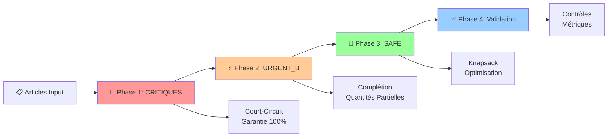
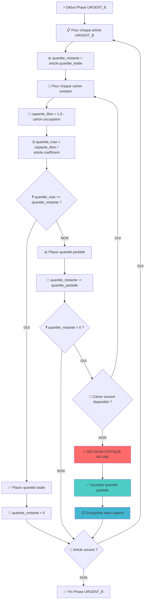

# TT-DEV-001 - Implémentation Algorithme Knapsack Adaptatif Modulaire

## 📋 1. CONTEXTE ET OBJECTIFS MÉTIER

### Epic : Optimisation Automatique des Colis
**Type :** Feature | **Priorité :** High | **Estimation :** 13 points

### Description Fonctionnelle
Implémenter un système d'optimisation de colis utilisant un algorithme de knapsack adaptatif et modulaire pour gérer différents niveaux de criticité des matériels avec des contraintes d'occupation par type d'article.

### Valeur Métier
- 🎯 **Garantir 100%** des matériels critiques dans les colis (zéro rupture)
- 📦 **Optimiser l'utilisation** de l'espace selon la criticité des articles
- ⚡ **Réduire le nombre** de colis tout en respectant les priorités métier
- 📈 **Améliorer la satisfaction** client par une livraison prioritaire intelligente

---

## 📊 2. DONNÉES MÉTIER ET CONFIGURATION

### Niveaux de Criticité (Par Ordre de Priorité Décroissante)
```
1. CRITIQUE_A    (Criticité Maximale)
2. CRITIQUE_B    (Criticité Élevée)
3. URGENT_A      (Urgent Important)
4. URGENT_B      (Urgent Standard)
5. SAFE          (Sécurisé - Optimisable)
```

### Coefficients d'Occupation par Type d'Article
```
TYPE_1 = 0.20  (20% de l'espace carton)
TYPE_2 = 0.25  (25% de l'espace carton)
TYPE_3 = 0.10  (10% de l'espace carton)
CAPACITE_CARTON = 1.0  (100% - Limite absolue)
```

### Formule de Base
```
occupation_article = quantité × coefficient_type
occupation_carton = Σ(occupation_article) ≤ 1.0
```

---

## 🎯 3. STRATÉGIE ALGORITHMIQUE GLOBALE

### Vue d'Ensemble - 4 Phases Séquentielles



### Logique de Décision par Phase

| Phase | Articles Traités | Algorithme | Objectif | Court-Circuit |
|-------|-----------------|------------|----------|---------------|
| **Phase 1** | CRITIQUE_A/B + URGENT_A | **Court-Circuit** | Garantie 100% | ✅ Oui |
| **Phase 2** | URGENT_B | **Complétion Intelligente** | Max satisfaction | ❌ Non |
| **Phase 3** | SAFE | **Knapsack Multi-Contraintes** | Valorisation stock | ❌ Non |
| **Phase 4** | Résultat Global | **Validation & Métriques** | Qualité finale | ❌ Non |

---

## 📝 4. RÈGLES DE GESTION PRÉCISES

### RG-001 : Classification et Priorités
**Règle :** `CRITIQUE_A > CRITIQUE_B > URGENT_A > URGENT_B > SAFE`
**Application :** Les articles critiques (A/B + URGENT_A) **court-circuitent** l'algorithme de knapsack

### RG-002 : Calcul d'Occupation des Cartons
**Formule :** `occupation_totale = Σ(quantité_article × coefficient_type)`
**Contrainte Absolue :** `occupation_totale ≤ 1.0`

### RG-003 : Stratégie Court-Circuit (Articles Critiques)
**Règle :** Utiliser `PLAFOND(occupation_requise)` cartons pour garantir 100% des critiques
**Justification :** Aucun compromis acceptable sur les articles critiques

### RG-004 : Algorithme Knapsack (Articles SAFE)
**Objectif :** Maximiser valorisation stock avec cible `(stock_min + stock_max) / 2`
**Contrainte :** Respecter les capacités restantes des cartons existants

### RG-005 : Gestion Quantités Partielles URGENT_B ⚠️
**Règle Critique :** Si aucun carton avec capacité disponible → accepter quantité partielle
**Action :** Passer à la finalisation **SANS** créer nouveau carton

### RG-006 : Discrétisation Knapsack
**Règle Technique :** Discrétiser capacités continues avec précision 0.01
**Implémentation :** `capacite_discretisee = ARRONDI(capacite_continue × 100)`

### RG-007 : Validation Contraintes Finales
**Contrôles :** Occupation ≤ 100%, articles critiques à 100%, cohérence données

---

## 🏗️ 5. ARCHITECTURE TECHNIQUE DÉTAILLÉE

### Services Core à Implémenter


### Modèles de Données Principaux

```java
// Contexte d'entrée
public class OptimisationContext {
    List<Article> articles_input;           // Articles à traiter
    CartonConstraints contraintes_carton;   // Contraintes physiques
    Map<ArticleType, Double> coefficients_occupation; // Règles métier
    int search_depth;                       // Horizon projections (SAFE)
}

// Résultat final
public class PackingResult {
    List<Carton> cartons_finaux;           // Cartons optimisés
    MetriquesOptimisation metriques;       // KPIs performance
    List<ArticlePartiel> quantites_partielles; // URGENT_B partiels
    boolean validation_success;            // État validation
    long temps_execution_ms;               // Performance
}

// Article à traiter
public class Article {
    String id;
    ArticleType type;                      // TYPE_1, TYPE_2, TYPE_3
    GradeCriticite grade;                  // CRITIQUE_A → SAFE
    int quantite;
    double coefficient_occupation;          // Selon type
    int[] stock_projections;               // Pour SAFE uniquement
    int stock_minimum, stock_maximum;      // Pour SAFE uniquement
}

// Carton résultat
public class Carton {
    String id;
    double occupation_actuelle;            // 0.0 à 1.0
    List<Article> articles_contenus;       // Articles placés
    double capacite_maximale = 1.0;        // Constante
    boolean est_finalise;                  // État
}
```

---

## 🔄 6. ALGORITHMES DÉTAILLÉS

### Algorithme Principal (Orchestrateur)

```java
ALGORITHME OptimiserColis(context)
DEBUT
    // === PHASE 1: TRAITEMENT CRITIQUES (Court-Circuit) ===
    articles_critiques ← FiltrerParGrade(context.articles, [CRITIQUE_A, CRITIQUE_B, URGENT_A])
    cartons_resultats ← TraiterArticlesCritiques(articles_critiques)

    // === PHASE 2: COMPLÉTION URGENT_B ===
    articles_urgent_b ← FiltrerParGrade(context.articles, [URGENT_B])
    SI articles_urgent_b NON VIDE ALORS
        cartons_resultats ← CompleterAvecUrgentB(cartons_resultats, articles_urgent_b)
    FIN_SI

    // === PHASE 3: OPTIMISATION SAFE (Knapsack) ===
    articles_safe ← FiltrerParGrade(context.articles, [SAFE])
    SI articles_safe NON VIDE ALORS
        cartons_resultats ← OptimiserAvecSafe(cartons_resultats, articles_safe)
    FIN_SI

    // === PHASE 4: VALIDATION ET MÉTRIQUES ===
    RETOURNER ValiderEtGenererRapport(cartons_resultats)
FIN
```

### Algorithme Court-Circuit (Phase 1)

```java
ALGORITHME TraiterArticlesCritiques(articles_critiques)
DEBUT
    occupation_totale ← CalculerOccupationRequise(articles_critiques)
    nombre_cartons ← PLAFOND(occupation_totale)  // Garantie mathématique

    cartons ← CreerCartons(nombre_cartons)
    distribution ← DistribuerArticlesParCartons(articles_critiques, nombre_cartons)

    POUR chaque carton DANS cartons FAIRE
        POUR chaque article DANS distribution[carton.index] FAIRE
            PlacerArticle(carton, article)  // Placement garanti
        FIN_POUR
    FIN_POUR

    RETOURNER cartons
FIN
```

### Algorithme Gestion Quantités Partielles (Phase 2)



### Algorithme Knapsack Multi-Contraintes (Phase 3)

```java
ALGORITHME KnapsackMultiContraintes(articles_safe, cartons_existants)
DEBUT
    POUR CHAQUE carton DANS cartons_existants FAIRE
        capacite_restante ← 1.0 - carton.occupation_actuelle
        capacite_discretisee ← ARRONDI(capacite_restante × 100)  // RG-006
        articles_candidats ← FiltrerParCapacite(articles_safe, capacite_restante)

        // === PROGRAMMATION DYNAMIQUE ===
        dp ← InitialiserTableDP(articles_candidats.size, capacite_discretisee)

        POUR i DE 1 À articles_candidats.size FAIRE
            POUR w DE 0 À capacite_discretisee FAIRE
                article ← articles_candidats[i-1]
                cout_occupation_discret ← ARRONDI(article.quantite × article.coefficient × 100)
                valeur_stock ← CalculerValeurValorisationStock(article)  // (min+max)/2 - stock_final

                SI cout_occupation_discret <= w ALORS
                    dp[i][w] ← MAX(dp[i-1][w], dp[i-1][w-cout_occupation_discret] + valeur_stock)
                SINON
                    dp[i][w] ← dp[i-1][w]
                FIN_SI
            FIN_POUR
        FIN_POUR

        solution ← ReconstruireSolution(dp, articles_candidats, capacite_discretisee)
        AppliquerSolution(carton, solution)
    FIN_POUR

    RETOURNER cartons_existants
FIN
```

---

## 📋 7. VARIABLES ET PARAMÈTRES DÉTAILLÉS

### Phase 1 : Variables Court-Circuit

| Variable | Type | Description | Valeurs | Rôle |
|----------|------|-------------|---------|------|
| `articles_critiques` | List\<Article\> | CRITIQUE_A/B + URGENT_A | 0-N articles | Entrée phase 1 |
| `occupation_totale` | double | Somme occupations critiques | 0.0-N.0 | Calcul besoins |
| `nombre_cartons` | int | PLAFOND(occupation_totale) | 1-N cartons | Cartons à créer |
| `distribution` | Map\<Integer,List\<Article\>\> | Répartition par carton | - | Stratégie placement |

### Phase 2 : Variables Quantités Partielles

| Variable | Type | Description | Valeurs | Rôle |
|----------|------|-------------|---------|------|
| `quantite_restante` | int | Quantité non encore placée | 0-N | Suivi progression |
| `capacite_libre` | double | Espace disponible carton | 0.0-1.0 | Contrainte placement |
| `quantite_max_possible` | int | Max plaçable dans carton | 0-N | Limite calculée |
| `quantite_partielle` | int | Quantité effectivement placée | 0-quantite_restante | Résultat partiel |

### Phase 3 : Variables Knapsack

| Variable | Type | Description | Valeurs | Rôle |
|----------|------|-------------|---------|------|
| `capacite_discretisee` | int | Capacité × 100 (précision 0.01) | 0-100 | Contrainte DP |
| `dp[i][w]` | double | Valeur optimale i articles, capacité w | 0.0-MAX | Mémorisation DP |
| `cout_occupation_discret` | int | (quantité × coeff) × 100 | 1-100 | Poids discret |
| `valeur_stock` | double | (min+max)/2 - stock_final | R | Utilité article |
| `solution_optimale` | List\<Article\> | Articles sélectionnés | 0-M articles | Résultat knapsack |

---

## ✅ 8. CRITÈRES D'ACCEPTATION FONCTIONNELS

### CA-001 : Court-Circuit Articles Critiques ✅
```gherkin
Given une liste d'articles contenant des matériels CRITIQUE_A et CRITIQUE_B
  And des coefficients d'occupation TYPE_1=0.2, TYPE_2=0.25, TYPE_3=0.1
When j'exécute l'algorithme d'optimisation des colis
Then tous les articles CRITIQUE_A et CRITIQUE_B sont placés à 100%
  And le nombre de cartons créés = PLAFOND(occupation_totale_critiques)
  And aucun algorithme de knapsack n'est exécuté pour ces articles
  And le temps d'exécution phase 1 < 100ms pour 1000 articles critiques
```

### CA-002 : Calcul Mathématique Exact URGENT_A ✅
```gherkin
Given une liste d'articles contenant 50 unités URGENT_A de TYPE_1 (coeff 0.2)
When j'exécute l'algorithme d'optimisation des colis
Then les 50 unités URGENT_A sont placées à 100%
  And occupation_requise = 50 × 0.2 = 10.0
  And nombre_cartons_créés = PLAFOND(10.0) = 10 cartons
  And le traitement utilise la stratégie court-circuit (pas knapsack)
```

### CA-003 : Optimisation SAFE avec Objectif (min+max)/2 ✅
```gherkin
Given des articles SAFE avec projections de stock
  And stock_min = 10, stock_max = 50 pour un article
  And des cartons avec espace restant disponible
When j'exécute l'algorithme d'optimisation des colis
Then l'objectif de stock calculé = (10 + 50) / 2 = 30
  And l'algorithme de knapsack maximise la valorisation vers cet objectif
  And les articles SAFE sont placés selon la solution optimale du knapsack
```

### CA-004 : Gestion Quantités Partielles URGENT_B (RG-005) 🚨
```gherkin
Given des articles URGENT_B à placer
  And tous les cartons existants ont une occupation ≥ 95%
  And aucun carton n'a la capacité pour la quantité totale URGENT_B
When j'exécute l'algorithme d'optimisation des colis
Then l'algorithme place la quantité partielle possible dans cartons existants
  And aucun nouveau carton n'est créé pour URGENT_B
  And le processus passe directement à la phase SAFE
  And le résultat indique les quantités partielles acceptées dans le rapport
```

### CA-005 : Séquençage 4 Phases Garanti ✅
```gherkin
Given une liste mixte d'articles de tous types de criticité
When j'exécute l'algorithme d'optimisation des colis
Then Phase 1: Articles CRITIQUE_A/B/URGENT_A traités en court-circuit
  And Phase 2: Articles URGENT_B complètent les cartons existants (quantités partielles si nécessaire)
  And Phase 3: Articles SAFE optimisés par knapsack sur espace restant uniquement
  And Phase 4: Validation globale et génération du rapport final avec métriques
```

### CA-006 : Performance et Limites Techniques ⚡
```gherkin
Given une liste d'articles avec quantités très importantes
  And coefficients d'occupation générant des besoins > 1000 cartons
When j'exécute l'algorithme d'optimisation des colis
Then l'algorithme gère les gros volumes sans dégradation de performance
  And le temps d'exécution reste < 10 secondes pour 10000 articles
  And la mémoire utilisée reste raisonnable (< 1GB)

Given un knapsack avec 1000 articles SAFE et capacité restante très fractionnée
When j'exécute l'optimisation knapsack avec discrétisation 0.01
Then le temps d'exécution reste < 5 secondes
  And la table DP n'excède pas 100MB de mémoire
  And la solution trouvée est à moins de 5% de l'optimal théorique
```

### CA-007 : Gestion d'Erreurs Robuste 🛡️
```gherkin
Given des données d'entrée invalides (coefficients négatifs, quantités nulles)
When j'exécute l'algorithme d'optimisation des colis
Then l'algorithme génère des erreurs de validation appropriées
  And aucun traitement n'est effectué sur des données corrompues
  And les messages d'erreur sont explicites et exploitables

Given une liste d'articles avec des coefficients d'occupation > 1.0
When j'exécute l'algorithme d'optimisation des colis
Then une exception "ArticleOccupationInvalidException" est levée
  And le message indique "Article {id} avec coefficient {coeff} > 1.0 impossible"

Given des articles SAFE sans projections de stock valides
When j'exécute l'algorithme d'optimisation des colis
Then les articles SAFE sont ignorés de l'optimisation knapsack
  And un warning est généré dans les logs
  And le rapport final indique les articles ignorés avec justification
```

---

## 🧪 9. STRATÉGIE DE TESTS DÉTAILLÉE

### Tests Unitaires par Service

#### ServiceCalculOccupation
```java
@Test testCalculOccupationSimple() {
    // 10 articles TYPE_1 (coeff 0.2) → occupation = 2.0
    assertEquals(2.0, service.calculerOccupationRequise(articles_TYPE_1_x10));
}

@Test testCalculNombreCartonsNecessaires() {
    // occupation 2.3 → PLAFOND(2.3) = 3 cartons
    assertEquals(3, service.calculerNombreCartonsNecessaires(2.3));
}

@Test testVerificationCapaciteCarton() {
    // carton 80% + article nécessitant 30% → false
    assertFalse(service.verifierCapaciteCarton(carton_80pourcent, article_30pourcent));
}
```

#### ServiceProjectionStock
```java
@Test testCalculObjectifStockOptimal() {
    // stock_min=10, stock_max=50 → objectif = (10+50)/2 = 30
    assertEquals(30, service.calculerObjectifStockOptimal(article_avec_projections));
}

@Test testEvaluationInteretValorisationStock() {
    // Plus l'écart objectif est grand, plus l'intérêt est élevé
    assertTrue(service.evaluerInteretValorisationStock(article_ecart_20) >
               service.evaluerInteretValorisationStock(article_ecart_5));
}
```

### Tests d'Intégration Algorithmiques

```java
@Test testCasUniqueementCritiques() {
    // Entrée: seulement articles CRITIQUE_A/B
    // Résultat attendu: court-circuit pur, pas de knapsack exécuté
    assertThat(result.algorithmes_executes).containsOnly("COURT_CIRCUIT");
}

@Test testCasMixteComplet() {
    // Entrée: articles de toutes criticités
    // Résultat: 4 phases exécutées dans l'ordre
    assertThat(result.phases_executees).containsExactly("CRITIQUES", "URGENT_B", "SAFE", "VALIDATION");
}

@Test testGestionQuantitesPartielles() {
    // Cartons saturés + articles URGENT_B
    // Résultat: quantités partielles acceptées, pas de nouveaux cartons
    assertEquals(0, result.nouveaux_cartons_urgent_b);
    assertTrue(result.quantites_partielles.size() > 0);
}
```

---

## 📊 10. MÉTRIQUES ET MONITORING

### KPI Performance Requis

| Métrique | Valeur Cible | Criticité | Mesure |
|----------|--------------|-----------|---------|
| **Temps Exécution Global** | < 5s pour 1000 articles | HIGH | Chronomètre algorithme complet |
| **Mémoire Peak** | < 512MB | MEDIUM | Monitoring heap JVM |
| **Taux Satisfaction Critiques** | 100% | CRITICAL | articles_places/articles_critiques |
| **Taux Occupation Moyen** | > 85% | HIGH | moyenne(carton.occupation) |
| **Efficacité Knapsack** | > 90% optimal | MEDIUM | solution_trouvée/solution_optimale |

### Tableau de Bord Opérationnel

```java
public class MetriquesOptimisation {
    // Performance
    long temps_execution_total_ms;
    long temps_phase_1_ms, temps_phase_2_ms, temps_phase_3_ms;
    long memoire_peak_bytes;

    // Satisfaction
    double taux_satisfaction_critiques;    // Doit être 100%
    double taux_satisfaction_urgent_b;     // Peut être < 100% (quantités partielles)
    double taux_satisfaction_safe;         // Variable selon optimisation

    // Efficacité
    int nombre_cartons_totaux;
    double taux_occupation_moyen;
    double efficacite_knapsack_pourcent;

    // Qualité
    List<ArticlePartiel> quantites_partielles; // Détail URGENT_B
    List<String> warnings;                      // Articles SAFE ignorés, etc.
    boolean validation_globale_success;
}
```

---

## 🚀 11. DÉFINITION OF DONE

### Checklist Technique ✅
- [ ] **Services** : Tous les services implémentés selon les interfaces définies
- [ ] **Algorithmes** : Court-circuit, quantités partielles, knapsack fonctionnels
- [ ] **Validation** : Tous les critères d'acceptation CA-001 à CA-007 validés
- [ ] **Tests** : Couverture > 90% avec tests unitaires et d'intégration
- [ ] **Performance** : Benchmarks respectés (< 5s, < 512MB)
- [ ] **Gestion Erreurs** : Exceptions appropriées et messages explicites

### Checklist Qualité ✅
- [ ] **Code Review** : Approuvé par tech lead + validation architecture
- [ ] **Documentation** : JavaDoc complète + README technique
- [ ] **Logging** : Niveaux appropriés (INFO, WARN, ERROR) avec contexte
- [ ] **Monitoring** : Métriques exposées pour supervision
- [ ] **Sécurité** : Validation inputs, pas de failles injection

### Checklist Déploiement ✅
- [ ] **Tests Environnement** : Validation en environnement de test
- [ ] **Configuration** : Paramètres externalisés (coefficients, timeouts)
- [ ] **Rollback** : Stratégie de retour arrière documentée
- [ ] **Formation** : Documentation utilisateur + formation équipes

---

## 📚 12. RESSOURCES ET RÉFÉRENCES

### Algorithmes et Concepts
- **Knapsack Problem** : Programmation dynamique multi-contraintes
- **Design Patterns** : Strategy (phases), Factory (cartons), Chain of Responsibility
- **Complexity** : Court-circuit O(n), Knapsack O(n×W×C) où W=capacité, C=cartons

### Documentation Technique
- **Architecture Détaillée** : `Conception-Knapsack-Adaptatif-Modulaire.md`
- **Spécifications Originales** : Ticket métier avec diagrammes fonctionnels
- **API Documentation** : Interfaces Java avec exemples d'usage

---

**Créé le :** $(date)
**Assigné à :** Équipe Backend
**Reviewer :** Tech Lead + Product Owner
**Sprint :** À définir selon roadmap produit

> ⚠️ **Point d'Attention Critique :** La RG-005 (quantités partielles URGENT_B) est un cas limite métier important qui impacte directement la satisfaction utilisateur. Une attention particulière doit être portée à sa validation.