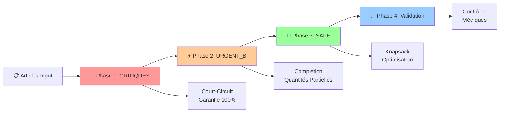
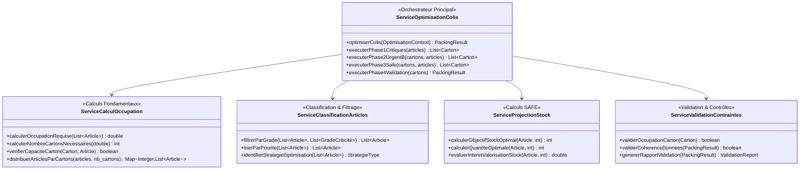
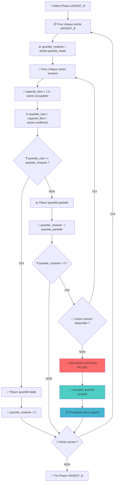

# TT-DEV-001 - Implémentation Algorithme Knapsack Adaptatif Modulaire

## 📋 1. CONTEXTE ET OBJECTIFS MÉTIER

### Epic : Optimisation Automatique des Colis
**Type :** Feature | **Priorité :** High | **Estimation :** 13 points

### Description Fonctionnelle
Implémenter un système d'optimisation de colis utilisant un algorithme de knapsack adaptatif et modulaire pour gérer différents niveaux de criticité des matériels avec des contraintes d'occupation par type d'article.

### Valeur Métier
- 🎯 **Garantir 100%** des matériels critiques dans les colis (zéro rupture)
- 📦 **Optimiser l'utilisation** de l'espace selon la criticité des articles
- ⚡ **Réduire le nombre** de colis tout en respectant les priorités métier
- 📈 **Améliorer la satisfaction** client par une livraison prioritaire intelligente

---

## 📊 2. DONNÉES MÉTIER ET CONFIGURATION

### Niveaux de Criticité (Par Ordre de Priorité Décroissante)
```
1. CRITIQUE_A    (Criticité Maximale)
2. CRITIQUE_B    (Criticité Élevée)
3. URGENT_A      (Urgent Important)
4. URGENT_B      (Urgent Standard)
5. SAFE          (Sécurisé - Optimisable)
```

### Coefficients d'Occupation par Type d'Article
```
TYPE_1 = 0.20  (20% de l'espace carton)
TYPE_2 = 0.25  (25% de l'espace carton)
TYPE_3 = 0.10  (10% de l'espace carton)
CAPACITE_CARTON = 1.0  (100% - Limite absolue)
```

### Formule de Base
```
occupation_article = quantité × coefficient_type
occupation_carton = Σ(occupation_article) ≤ 1.0
```

---

## 🎯 3. STRATÉGIE ALGORITHMIQUE GLOBALE

### Vue d'Ensemble - 4 Phases Séquentielles



### Logique de Décision par Phase

| Phase | Articles Traités | Algorithme | Objectif | Court-Circuit |
|-------|-----------------|------------|----------|---------------|
| **Phase 1** | CRITIQUE_A/B + URGENT_A | **Court-Circuit** | Garantie 100% | ✅ Oui |
| **Phase 2** | URGENT_B | **Complétion Intelligente** | Max satisfaction | ❌ Non |
| **Phase 3** | SAFE | **Knapsack Multi-Contraintes** | Valorisation stock | ❌ Non |
| **Phase 4** | Résultat Global | **Validation & Métriques** | Qualité finale | ❌ Non |

---

## 📝 4. RÈGLES DE GESTION PRÉCISES

### RG-001 : Classification et Priorités
**Règle :** `CRITIQUE_A > CRITIQUE_B > URGENT_A > URGENT_B > SAFE`
**Application :** Les articles critiques (A/B + URGENT_A) **court-circuitent** l'algorithme de knapsack

### RG-002 : Calcul d'Occupation des Cartons
**Formule :** `occupation_totale = Σ(quantité_article × coefficient_type)`
**Contrainte Absolue :** `occupation_totale ≤ 1.0`

### RG-003 : Stratégie Court-Circuit (Articles Critiques)
**Règle :** Utiliser `PLAFOND(occupation_requise)` cartons pour garantir 100% des critiques
**Justification :** Aucun compromis acceptable sur les articles critiques

### RG-004 : Algorithme Knapsack (Articles SAFE)
**Objectif :** Maximiser valorisation stock avec cible `(stock_min + stock_max) / 2`
**Contrainte :** Respecter les capacités restantes des cartons existants

### RG-005 : Gestion Quantités Partielles URGENT_B ⚠️
**Règle Critique :** Si aucun carton avec capacité disponible → accepter quantité partielle
**Action :** Passer à la finalisation **SANS** créer nouveau carton

### RG-006 : Discrétisation Knapsack
**Règle Technique :** Discrétiser capacités continues avec précision 0.01
**Implémentation :** `capacite_discretisee = ARRONDI(capacite_continue × 100)`

### RG-007 : Validation Contraintes Finales
**Contrôles :** Occupation ≤ 100%, articles critiques à 100%, cohérence données

---

## 🏗️ 5. ARCHITECTURE TECHNIQUE DÉTAILLÉE

### Services Core à Implémenter



### Modèles de Données Principaux

```java
// Contexte d'entrée
public class OptimisationContext {
    List<Article> articles_input;           // Articles à traiter
    CartonConstraints contraintes_carton;   // Contraintes physiques
    Map<ArticleType, Double> coefficients_occupation; // Règles métier
    int search_depth;                       // Horizon projections (SAFE)
}
```

**📋 Tableau d'Usage - OptimisationContext**

| Méthode/Attribut | Variables Utilisées | Description Usage | Validation Requise | Phase d'Utilisation |
|------------------|--------------------|--------------------|-------------------|-------------------|
| `articles_input` | `List<Article>` | Liste complète des articles à traiter dans le colis | Non null, size > 0, articles valides | Entrée - Classification |
| `contraintes_carton` | `CartonConstraints` | Contraintes physiques des cartons (capacité max = 1.0) | capacite_maximale > 0 | Toutes phases - Validation |
| `coefficients_occupation` | `Map<ArticleType,Double>` | Règles métier : TYPE_1=0.2, TYPE_2=0.25, TYPE_3=0.1 | Tous coeffs entre 0 et 1.0 | Phases 1,2,3 - Calculs |
| `search_depth` | `int` | Horizon temporel pour projections stock des articles SAFE | 1 ≤ depth ≤ 30 jours | Phase 3 uniquement |
| `getArticlesByGrade(grade)` | `grade: GradeCriticite` | Filtrage articles par niveau de criticité | Grade valide | Classification |
| `getTotalArticleCount()` | Aucune | Compte total des articles toutes criticités | - | Métriques |
| `validateConfiguration()` | Tous attributs | Validation cohérence configuration avant traitement | Règles RG-002, RG-006 | Initialisation |

```java

// Résultat final
public class PackingResult {
    List<Carton> cartons_finaux;           // Cartons optimisés
    MetriquesOptimisation metriques;       // KPIs performance
    List<ArticlePartiel> quantites_partielles; // URGENT_B partiels
    boolean validation_success;            // État validation
    long temps_execution_ms;               // Performance
}
```

**📋 Tableau d'Usage - PackingResult**

| Méthode/Attribut | Variables Utilisées | Description Usage | Validation Requise | Phase d'Utilisation |
|------------------|--------------------|--------------------|-------------------|-------------------|
| `cartons_finaux` | `List<Carton>` | Résultat final avec tous cartons optimisés remplis | size ≥ 1, occupation ≤ 1.0 | Sortie Phase 4 |
| `metriques` | `MetriquesOptimisation` | KPIs performance : temps, mémoire, taux satisfaction | Toutes métriques calculées | Phase 4 - Reporting |
| `quantites_partielles` | `List<ArticlePartiel>` | Détail articles URGENT_B non satisfaits totalement | Peut être vide si 100% satisfaction | Phase 2 → Phase 4 |
| `validation_success` | `boolean` | État validation globale : true si toutes validations OK | Obligatoirement calculé | Phase 4 |
| `temps_execution_ms` | `long` | Durée totale exécution algorithme complet | > 0, < timeout_max | Phase 4 - Métriques |
| `getTauxSatisfactionGlobal()` | `metriques.taux_satisfaction` | Pourcentage global articles placés toutes criticités | 0.0 ≤ taux ≤ 1.0 | Reporting |
| `getNombreCartonsTotal()` | `cartons_finaux.size()` | Nombre total cartons créés pour le colis | ≥ 1 | Métriques |
| `hasQuantitesPartielles()` | `quantites_partielles.isEmpty()` | Indicateur présence quantités URGENT_B partielles | - | Validation RG-005 |
| `generateSummaryReport()` | Tous attributs | Génération rapport résumé pour interface utilisateur | Données cohérentes | Interface |

```java

// Article à traiter
public class Article {
    String id;
    ArticleType type;                      // TYPE_1, TYPE_2, TYPE_3
    GradeCriticite grade;                  // CRITIQUE_A → SAFE
    int quantite;
    double coefficient_occupation;          // Selon type
    int[] stock_projections;               // Pour SAFE uniquement
    int stock_minimum, stock_maximum;      // Pour SAFE uniquement
}
```

**📋 Tableau d'Usage - Article**

| Méthode/Attribut | Variables Utilisées | Description Usage | Validation Requise | Phase d'Utilisation |
|------------------|--------------------|--------------------|-------------------|-------------------|
| `id` | `String` | Identifiant unique article pour traçabilité | Non null, unique | Toutes phases - Identification |
| `type` | `ArticleType` | Type physique : TYPE_1, TYPE_2, TYPE_3 | Valeur enum valide | Calcul coefficient occupation |
| `grade` | `GradeCriticite` | Niveau criticité : CRITIQUE_A/B, URGENT_A/B, SAFE | Valeur enum valide | Classification par phases |
| `quantite` | `int` | Quantité à placer dans le colis | > 0 | Calculs occupation et placement |
| `coefficient_occupation` | `double` | Espace occupé par unité selon type | 0 < coeff ≤ 1.0 | Calculs contraintes physiques |
| `stock_projections` | `int[]` | Projections stock par jour (SAFE uniquement) | Taille = search_depth, valeurs ≥ 0 | Phase 3 - Objectifs valorisation |
| `stock_minimum` | `int` | Stock minimum projeté sur horizon | ≥ 0, calculé depuis projections | Phase 3 - Borne inférieure |
| `stock_maximum` | `int` | Stock maximum projeté sur horizon | ≥ stock_minimum | Phase 3 - Borne supérieure |
| `getOccupationTotale()` | `quantite * coefficient_occupation` | Calcul espace total occupé par cet article | Résultat ≤ capacite_max_carton | Contraintes placement |
| `isCritique()` | `grade` | Test si article nécessite traitement court-circuit | - | Routage Phase 1 |
| `isUrgentB()` | `grade == URGENT_B` | Test si article pour complétion quantités partielles | - | Routage Phase 2 |
| `isSafe()` | `grade == SAFE` | Test si article pour optimisation knapsack | - | Routage Phase 3 |
| `calculateStockObjective()` | `stock_minimum, stock_maximum` | Calcul objectif = (min + max) / 2 | stock_projections valides | Phase 3 - Knapsack |
| `hasValidProjections()` | `stock_projections` | Validation projections pour articles SAFE | Array non null, taille correcte | Phase 3 - Prérequis |

```java

// Carton résultat
public class Carton {
    String id;
    double occupation_actuelle;            // 0.0 à 1.0
    List<Article> articles_contenus;       // Articles placés
    double capacite_maximale = 1.0;        // Constante
    boolean est_finalise;                  // État
}
```

**📋 Tableau d'Usage - Carton**

| Méthode/Attribut | Variables Utilisées | Description Usage | Validation Requise | Phase d'Utilisation |
|------------------|--------------------|--------------------|-------------------|-------------------|
| `id` | `String` | Identifiant unique carton pour traçabilité | Non null, unique | Toutes phases - Identification |
| `occupation_actuelle` | `double` | Pourcentage d'espace occupé actuellement | 0.0 ≤ valeur ≤ 1.0 | Contraintes placement |
| `articles_contenus` | `List<Article>` | Liste articles effectivement placés dans carton | Cohérent avec occupation_actuelle | État carton |
| `capacite_maximale` | `double` | Capacité maximale carton = 1.0 (100%) | Constante = 1.0 | Contrainte absolue |
| `est_finalise` | `boolean` | État : true si carton ne peut plus recevoir d'articles | - | Gestion état |
| `getCapaciteRestante()` | `capacite_maximale - occupation_actuelle` | Calcul espace libre disponible | Résultat ≥ 0 | Phases 2,3 - Placement |
| `peutAccueillir(article)` | `article.getOccupationTotale(), capacite_restante` | Test si article peut être placé sans débordement | - | Validation placement |
| `ajouterArticle(article)` | `article, occupation_actuelle, articles_contenus` | Placement effectif article avec mise à jour état | peutAccueillir() == true | Exécution placement |
| `calculerOccupationReelle()` | `articles_contenus` | Recalcul occupation depuis articles contenus | Cohérence avec occupation_actuelle | Validation |
| `getNombreArticles()` | `articles_contenus.size()` | Nombre total d'articles dans le carton | ≥ 0 | Métriques |
| `getTauxOccupation()` | `occupation_actuelle * 100` | Pourcentage occupation pour affichage | 0 ≤ résultat ≤ 100 | Interface utilisateur |
| `finaliser()` | `est_finalise = true` | Verrouillage carton contre modifications ultérieures | - | Phase 4 - Finalisation |


## 🔄 6. ALGORITHMES DÉTAILLÉS

### Algorithme Principal (Orchestrateur)

```java
ALGORITHME OptimiserColis(context)
DEBUT
    // === PHASE 1: TRAITEMENT CRITIQUES (Court-Circuit) ===
    articles_critiques ← FiltrerParGrade(context.articles, [CRITIQUE_A, CRITIQUE_B, URGENT_A])
    cartons_resultats ← TraiterArticlesCritiques(articles_critiques)

    // === PHASE 2: COMPLÉTION URGENT_B ===
    articles_urgent_b ← FiltrerParGrade(context.articles, [URGENT_B])
    SI articles_urgent_b NON VIDE ALORS
        cartons_resultats ← CompleterAvecUrgentB(cartons_resultats, articles_urgent_b)
    FIN_SI

    // === PHASE 3: OPTIMISATION SAFE (Knapsack) ===
    articles_safe ← FiltrerParGrade(context.articles, [SAFE])
    SI articles_safe NON VIDE ALORS
        cartons_resultats ← OptimiserAvecSafe(cartons_resultats, articles_safe)
    FIN_SI

    // === PHASE 4: VALIDATION ET MÉTRIQUES ===
    RETOURNER ValiderEtGenererRapport(cartons_resultats)
FIN
```

**📋 Tableau d'Usage - Algorithme OptimiserColis (Orchestrateur Principal)**

| Méthode/Étape | Variables Entrée | Variables Sortie | Variables Internes | Description Usage | Validation |
|---------------|------------------|------------------|-------------------|-------------------|------------|
| `FiltrerParGrade(articles, grades)` | `context.articles: List<Article>`, `grades: [CRITIQUE_A,B,URGENT_A]` | `articles_critiques: List<Article>` | Aucune | Extraction articles prioritaires pour traitement court-circuit | Articles triés par priorité |
| `TraiterArticlesCritiques(articles)` | `articles_critiques: List<Article>` | `cartons_resultats: List<Carton>` | `occupation_totale, nb_cartons` | Phase 1: Création cartons garantis avec PLAFOND(occupation) | 100% articles critiques placés |
| `FiltrerParGrade(articles, [URGENT_B])` | `context.articles: List<Article>` | `articles_urgent_b: List<Article>` | Aucune | Extraction articles pour complétion quantités partielles | Grade = URGENT_B uniquement |
| `CompleterAvecUrgentB(cartons, articles)` | `cartons_resultats, articles_urgent_b` | `cartons_resultats: List<Carton>` | `capacite_libre, quantite_partielle` | Phase 2: Remplissage cartons existants selon RG-005 | Gestion quantités partielles |
| `FiltrerParGrade(articles, [SAFE])` | `context.articles: List<Article>` | `articles_safe: List<Article>` | Aucune | Extraction articles pour optimisation valorisation stock | Projections stock valides |
| `OptimiserAvecSafe(cartons, articles)` | `cartons_resultats, articles_safe` | `cartons_resultats: List<Carton>` | `dp[][], solution_optimale` | Phase 3: Knapsack multi-contraintes avec objectif (min+max)/2 | Solution optimale respectant contraintes |
| `ValiderEtGenererRapport(cartons)` | `cartons_resultats: List<Carton>` | `PackingResult` | `metriques, warnings, validation` | Phase 4: Contrôles finaux et génération rapport complet | Toutes validations passées |
| **Variables Globales** | `context: OptimisationContext` | `PackingResult` | `articles_critiques, articles_urgent_b, articles_safe, cartons_resultats` | État partagé entre phases pour cohérence traitement | Cohérence données inter-phases |


### Algorithme Court-Circuit (Phase 1)

```
ALGORITHME TraiterArticlesCritiques(articles_critiques)
DEBUT
    occupation_totale ← CalculerOccupationRequise(articles_critiques)
    nombre_cartons ← PLAFOND(occupation_totale)  // Garantie mathématique

    cartons ← CreerCartons(nombre_cartons)
    distribution ← DistribuerArticlesParCartons(articles_critiques, nombre_cartons)

    POUR chaque carton DANS cartons FAIRE
        POUR chaque article DANS distribution[carton.index] FAIRE
            PlacerArticle(carton, article)  // Placement garanti
        FIN_POUR
    FIN_POUR

    RETOURNER cartons
FIN
```

**📋 Tableau d'Usage - Algorithme TraiterArticlesCritiques (Court-Circuit Phase 1)**

| Méthode/Étape | Variables Entrée | Variables Sortie | Variables Internes | Description Usage | Validation |
|---------------|------------------|------------------|-------------------|-------------------|------------|
| `CalculerOccupationRequise(articles)` | `articles_critiques: List<Article>` | `occupation_totale: double` | Aucune | Calcul Σ(quantité × coefficient) pour tous articles critiques | occupation_totale ≥ 0 |
| `PLAFOND(occupation_totale)` | `occupation_totale: double` | `nombre_cartons: int` | Aucune | Garantie mathématique : ceil() assure 100% placement | nombre_cartons ≥ 1 |
| `CreerCartons(nombre_cartons)` | `nombre_cartons: int` | `cartons: List<Carton>` | Aucune | Création physique cartons vides avec capacité max = 1.0 | Cartons initialisés correctement |
| `DistribuerArticlesParCartons(articles, nb)` | `articles_critiques, nombre_cartons` | `distribution: Map<Integer,List<Article>>` | Algorithme round-robin | Répartition équilibrée articles sur cartons créés | Distribution homogène |
| **Boucle POUR carton** | `cartons: List<Carton>` | `cartons: List<Carton>` | `carton: Carton` | Itération sur tous cartons pour placement | - |
| **Boucle POUR article** | `distribution[carton.index]` | - | `article: Article` | Itération sur articles assignés au carton courant | - |
| `PlacerArticle(carton, article)` | `carton: Carton, article: Article` | Mise à jour carton | `occupation_avant, occupation_apres` | Placement physique garanti (pas de vérification capacité) | Placement toujours possible |
| **Variables de Contrôle** | - | - | `occupation_totale, nombre_cartons, distribution` | Garantie mathématique du court-circuit | 100% articles critiques placés |


### Algorithme Gestion Quantités Partielles (Phase 2)



### Algorithme Knapsack Multi-Contraintes (Phase 3)

```
ALGORITHME KnapsackMultiContraintes(articles_safe, cartons_existants)
DEBUT
    POUR CHAQUE carton DANS cartons_existants FAIRE
        capacite_restante ← 1.0 - carton.occupation_actuelle
        capacite_discretisee ← ARRONDI(capacite_restante × 100)  // RG-006
        articles_candidats ← FiltrerParCapacite(articles_safe, capacite_restante)

        // === PROGRAMMATION DYNAMIQUE ===
        dp ← InitialiserTableDP(articles_candidats.size, capacite_discretisee)

        POUR i DE 1 À articles_candidats.size FAIRE
            POUR w DE 0 À capacite_discretisee FAIRE
                article ← articles_candidats[i-1]
                cout_occupation_discret ← ARRONDI(article.quantite × article.coefficient × 100)
                valeur_stock ← CalculerValeurValorisationStock(article)  // (min+max)/2 - stock_final

                SI cout_occupation_discret <= w ALORS
                    dp[i][w] ← MAX(dp[i-1][w], dp[i-1][w-cout_occupation_discret] + valeur_stock)
                SINON
                    dp[i][w] ← dp[i-1][w]
                FIN_SI
            FIN_POUR
        FIN_POUR

        solution ← ReconstruireSolution(dp, articles_candidats, capacite_discretisee)
        AppliquerSolution(carton, solution)
    FIN_POUR

    RETOURNER cartons_existants
FIN
```

**📋 Tableau d'Usage - Algorithme KnapsackMultiContraintes (Phase 3)**

| Méthode/Étape | Variables Entrée | Variables Sortie | Variables Internes | Description Usage | Validation |
|---------------|------------------|------------------|-------------------|-------------------|------------|
| **Boucle POUR carton** | `cartons_existants: List<Carton>` | `cartons_existants: List<Carton>` | `carton: Carton` | Traitement individuel chaque carton avec espace restant | carton.occupation_actuelle < 1.0 |
| `capacite_restante = 1.0 - occupation` | `carton.occupation_actuelle: double` | `capacite_restante: double` | Aucune | Calcul espace libre disponible pour articles SAFE | 0.0 ≤ capacite_restante ≤ 1.0 |
| `ARRONDI(capacite × 100)` | `capacite_restante: double` | `capacite_discretisee: int` | Aucune | Discrétisation selon RG-006 pour programmation dynamique | 0 ≤ capacite_discretisee ≤ 100 |
| `FiltrerParCapacite(articles, capacite)` | `articles_safe, capacite_restante` | `articles_candidats: List<Article>` | Aucune | Préfiltre articles pouvant physiquement entrer dans carton | Tous articles respectent contrainte |
| `InitialiserTableDP(n, W)` | `articles_candidats.size, capacite_discretisee` | `dp: double[][]` | Aucune | Création matrice DP[n+1][W+1] initialisée à 0.0 | Dimensions correctes |
| **Boucle POUR i (articles)** | `articles_candidats: List<Article>` | - | `i: int, article: Article` | Itération sur tous articles candidats pour DP | 1 ≤ i ≤ n |
| **Boucle POUR w (capacités)** | `capacite_discretisee: int` | - | `w: int` | Itération sur toutes capacités possibles pour DP | 0 ≤ w ≤ capacite_discretisee |
| `cout_occupation_discret` | `article.quantite, article.coefficient` | `cout_occupation_discret: int` | Aucune | Poids article discrétisé = quantité × coefficient × 100 | 1 ≤ cout ≤ capacite_discretisee |
| `CalculerValeurValorisationStock(article)` | `article: Article (SAFE)` | `valeur_stock: double` | `stock_min, stock_max, objectif` | Fonction utilité = (min+max)/2 - stock_final + bonus | valeur_stock ≥ 0 |
| **Test SI cout <= w** | `cout_occupation_discret, w` | - | Aucune | Condition inclusion article dans solution partielle | Respect contrainte capacité |
| `dp[i][w] = MAX(...)` | `dp[i-1][w], dp[i-1][w-cout] + valeur` | `dp[i][w]: double` | Valeurs précédentes DP | Équation récurrence programmation dynamique | dp[i][w] ≥ dp[i-1][w] |
| `ReconstruireSolution(dp, articles, W)` | `dp[][], articles_candidats, capacite_discretisee` | `solution: List<Article>` | Backtracking depuis dp[n][W] | Extraction articles optimaux de la table DP | Solution respecte contraintes |
| `AppliquerSolution(carton, solution)` | `carton, solution: List<Article>` | Carton mis à jour | Placement effectif articles | Application physique résultat knapsack sur carton | Nouvelle occupation ≤ 1.0 |
| **Variables Globales DP** | - | - | `dp[][], capacite_discretisee, articles_candidats` | État partagé algorithme knapsack | Cohérence table DP |


---

## 📋 7. VARIABLES ET PARAMÈTRES DÉTAILLÉS

### Phase 1 : Variables Court-Circuit

| Variable | Type | Description | Valeurs | Rôle |
|----------|------|-------------|---------|------|
| `articles_critiques` | List\<Article\> | CRITIQUE_A/B + URGENT_A | 0-N articles | Entrée phase 1 |
| `occupation_totale` | double | Somme occupations critiques | 0.0-N.0 | Calcul besoins |
| `nombre_cartons` | int | PLAFOND(occupation_totale) | 1-N cartons | Cartons à créer |
| `distribution` | Map\<Integer,List\<Article\>\> | Répartition par carton | - | Stratégie placement |

### Phase 2 : Variables Quantités Partielles

| Variable | Type | Description | Valeurs | Rôle |
|----------|------|-------------|---------|------|
| `quantite_restante` | int | Quantité non encore placée | 0-N | Suivi progression |
| `capacite_libre` | double | Espace disponible carton | 0.0-1.0 | Contrainte placement |
| `quantite_max_possible` | int | Max plaçable dans carton | 0-N | Limite calculée |
| `quantite_partielle` | int | Quantité effectivement placée | 0-quantite_restante | Résultat partiel |

### Phase 3 : Variables Knapsack

| Variable | Type | Description | Valeurs | Rôle |
|----------|------|-------------|---------|------|
| `capacite_discretisee` | int | Capacité × 100 (précision 0.01) | 0-100 | Contrainte DP |
| `dp[i][w]` | double | Valeur optimale i articles, capacité w | 0.0-MAX | Mémorisation DP |
| `cout_occupation_discret` | int | (quantité × coeff) × 100 | 1-100 | Poids discret |
| `valeur_stock` | double | (min+max)/2 - stock_final | R | Utilité article |
| `solution_optimale` | List\<Article\> | Articles sélectionnés | 0-M articles | Résultat knapsack |

---

## ✅ 8. CRITÈRES D'ACCEPTATION FONCTIONNELS

### CA-001 : Court-Circuit Articles Critiques ✅
```gherkin
Given une liste d'articles contenant des matériels CRITIQUE_A et CRITIQUE_B
  And des coefficients d'occupation TYPE_1=0.2, TYPE_2=0.25, TYPE_3=0.1
When j'exécute l'algorithme d'optimisation des colis
Then tous les articles CRITIQUE_A et CRITIQUE_B sont placés à 100%
  And le nombre de cartons créés = PLAFOND(occupation_totale_critiques)
  And aucun algorithme de knapsack n'est exécuté pour ces articles
  And le temps d'exécution phase 1 < 100ms pour 1000 articles critiques
```

### CA-002 : Calcul Mathématique Exact URGENT_A ✅
```gherkin
Given une liste d'articles contenant 50 unités URGENT_A de TYPE_1 (coeff 0.2)
When j'exécute l'algorithme d'optimisation des colis
Then les 50 unités URGENT_A sont placées à 100%
  And occupation_requise = 50 × 0.2 = 10.0
  And nombre_cartons_créés = PLAFOND(10.0) = 10 cartons
  And le traitement utilise la stratégie court-circuit (pas knapsack)
```

### CA-003 : Optimisation SAFE avec Objectif (min+max)/2 ✅
```gherkin
Given des articles SAFE avec projections de stock
  And stock_min = 10, stock_max = 50 pour un article
  And des cartons avec espace restant disponible
When j'exécute l'algorithme d'optimisation des colis
Then l'objectif de stock calculé = (10 + 50) / 2 = 30
  And l'algorithme de knapsack maximise la valorisation vers cet objectif
  And les articles SAFE sont placés selon la solution optimale du knapsack
```

### CA-004 : Gestion Quantités Partielles URGENT_B (RG-005) 🚨
```gherkin
Given des articles URGENT_B à placer
  And tous les cartons existants ont une occupation ≥ 95%
  And aucun carton n'a la capacité pour la quantité totale URGENT_B
When j'exécute l'algorithme d'optimisation des colis
Then l'algorithme place la quantité partielle possible dans cartons existants
  And aucun nouveau carton n'est créé pour URGENT_B
  And le processus passe directement à la phase SAFE
  And le résultat indique les quantités partielles acceptées dans le rapport
```

### CA-005 : Séquençage 4 Phases Garanti ✅
```gherkin
Given une liste mixte d'articles de tous types de criticité
When j'exécute l'algorithme d'optimisation des colis
Then Phase 1: Articles CRITIQUE_A/B/URGENT_A traités en court-circuit
  And Phase 2: Articles URGENT_B complètent les cartons existants (quantités partielles si nécessaire)
  And Phase 3: Articles SAFE optimisés par knapsack sur espace restant uniquement
  And Phase 4: Validation globale et génération du rapport final avec métriques
```

### CA-006 : Performance et Limites Techniques ⚡
```gherkin
Given une liste d'articles avec quantités très importantes
  And coefficients d'occupation générant des besoins > 1000 cartons
When j'exécute l'algorithme d'optimisation des colis
Then l'algorithme gère les gros volumes sans dégradation de performance
  And le temps d'exécution reste < 10 secondes pour 10000 articles
  And la mémoire utilisée reste raisonnable (< 1GB)

Given un knapsack avec 1000 articles SAFE et capacité restante très fractionnée
When j'exécute l'optimisation knapsack avec discrétisation 0.01
Then le temps d'exécution reste < 5 secondes
  And la table DP n'excède pas 100MB de mémoire
  And la solution trouvée est à moins de 5% de l'optimal théorique
```

### CA-007 : Gestion d'Erreurs Robuste 🛡️
```gherkin
Given des données d'entrée invalides (coefficients négatifs, quantités nulles)
When j'exécute l'algorithme d'optimisation des colis
Then l'algorithme génère des erreurs de validation appropriées
  And aucun traitement n'est effectué sur des données corrompues
  And les messages d'erreur sont explicites et exploitables

Given une liste d'articles avec des coefficients d'occupation > 1.0
When j'exécute l'algorithme d'optimisation des colis
Then une exception "ArticleOccupationInvalidException" est levée
  And le message indique "Article {id} avec coefficient {coeff} > 1.0 impossible"

Given des articles SAFE sans projections de stock valides
When j'exécute l'algorithme d'optimisation des colis
Then les articles SAFE sont ignorés de l'optimisation knapsack
  And un warning est généré dans les logs
  And le rapport final indique les articles ignorés avec justification
```

---

## 🧪 9. STRATÉGIE DE TESTS DÉTAILLÉE

### Tests Unitaires par Service

#### ServiceCalculOccupation
```java
@Test testCalculOccupationSimple() {
    // 10 articles TYPE_1 (coeff 0.2) → occupation = 2.0
    assertEquals(2.0, service.calculerOccupationRequise(articles_TYPE_1_x10));
}

@Test testCalculNombreCartonsNecessaires() {
    // occupation 2.3 → PLAFOND(2.3) = 3 cartons
    assertEquals(3, service.calculerNombreCartonsNecessaires(2.3));
}

@Test testVerificationCapaciteCarton() {
    // carton 80% + article nécessitant 30% → false
    assertFalse(service.verifierCapaciteCarton(carton_80pourcent, article_30pourcent));
}
```

#### ServiceProjectionStock
```java
@Test testCalculObjectifStockOptimal() {
    // stock_min=10, stock_max=50 → objectif = (10+50)/2 = 30
    assertEquals(30, service.calculerObjectifStockOptimal(article_avec_projections));
}

@Test testEvaluationInteretValorisationStock() {
    // Plus l'écart objectif est grand, plus l'intérêt est élevé
    assertTrue(service.evaluerInteretValorisationStock(article_ecart_20) >
               service.evaluerInteretValorisationStock(article_ecart_5));
}
```

### Tests d'Intégration Algorithmiques

```java
@Test testCasUniqueementCritiques() {
    // Entrée: seulement articles CRITIQUE_A/B
    // Résultat attendu: court-circuit pur, pas de knapsack exécuté
    assertThat(result.algorithmes_executes).containsOnly("COURT_CIRCUIT");
}

@Test testCasMixteComplet() {
    // Entrée: articles de toutes criticités
    // Résultat: 4 phases exécutées dans l'ordre
    assertThat(result.phases_executees).containsExactly("CRITIQUES", "URGENT_B", "SAFE", "VALIDATION");
}

@Test testGestionQuantitesPartielles() {
    // Cartons saturés + articles URGENT_B
    // Résultat: quantités partielles acceptées, pas de nouveaux cartons
    assertEquals(0, result.nouveaux_cartons_urgent_b);
    assertTrue(result.quantites_partielles.size() > 0);
}
```

---

## 📊 10. MÉTRIQUES ET MONITORING

### KPI Performance Requis

| Métrique | Valeur Cible | Criticité | Mesure |
|----------|--------------|-----------|---------|
| **Temps Exécution Global** | < 5s pour 1000 articles | HIGH | Chronomètre algorithme complet |
| **Mémoire Peak** | < 512MB | MEDIUM | Monitoring heap JVM |
| **Taux Satisfaction Critiques** | 100% | CRITICAL | articles_places/articles_critiques |
| **Taux Occupation Moyen** | > 85% | HIGH | moyenne(carton.occupation) |
| **Efficacité Knapsack** | > 90% optimal | MEDIUM | solution_trouvée/solution_optimale |

### Tableau de Bord Opérationnel

```java
public class MetriquesOptimisation {
    // Performance
    long temps_execution_total_ms;
    long temps_phase_1_ms, temps_phase_2_ms, temps_phase_3_ms;
    long memoire_peak_bytes;

    // Satisfaction
    double taux_satisfaction_critiques;    // Doit être 100%
    double taux_satisfaction_urgent_b;     // Peut être < 100% (quantités partielles)
    double taux_satisfaction_safe;         // Variable selon optimisation

    // Efficacité
    int nombre_cartons_totaux;
    double taux_occupation_moyen;
    double efficacite_knapsack_pourcent;

    // Qualité
    List<ArticlePartiel> quantites_partielles; // Détail URGENT_B
    List<String> warnings;                      // Articles SAFE ignorés, etc.
    boolean validation_globale_success;
}
```

---

## 🚀 11. DÉFINITION OF DONE

### Checklist Technique ✅
- [ ] **Services** : Tous les services implémentés selon les interfaces définies
- [ ] **Algorithmes** : Court-circuit, quantités partielles, knapsack fonctionnels
- [ ] **Validation** : Tous les critères d'acceptation CA-001 à CA-007 validés
- [ ] **Tests** : Couverture > 90% avec tests unitaires et d'intégration
- [ ] **Performance** : Benchmarks respectés (< 5s, < 512MB)
- [ ] **Gestion Erreurs** : Exceptions appropriées et messages explicites

### Checklist Qualité ✅
- [ ] **Code Review** : Approuvé par tech lead + validation architecture
- [ ] **Documentation** : JavaDoc complète + README technique
- [ ] **Logging** : Niveaux appropriés (INFO, WARN, ERROR) avec contexte
- [ ] **Monitoring** : Métriques exposées pour supervision
- [ ] **Sécurité** : Validation inputs, pas de failles injection

### Checklist Déploiement ✅
- [ ] **Tests Environnement** : Validation en environnement de test
- [ ] **Configuration** : Paramètres externalisés (coefficients, timeouts)
- [ ] **Rollback** : Stratégie de retour arrière documentée
- [ ] **Formation** : Documentation utilisateur + formation équipes

---

## 📚 12. RESSOURCES ET RÉFÉRENCES

### Algorithmes et Concepts
- **Knapsack Problem** : Programmation dynamique multi-contraintes
- **Design Patterns** : Strategy (phases), Factory (cartons), Chain of Responsibility
- **Complexity** : Court-circuit O(n), Knapsack O(n×W×C) où W=capacité, C=cartons

### Documentation Technique
- **Architecture Détaillée** : `Conception-Knapsack-Adaptatif-Modulaire.md`
- **Spécifications Originales** : Ticket métier avec diagrammes fonctionnels
- **API Documentation** : Interfaces Java avec exemples d'usage

---

## 📚 13. TABLEAUX DE RÉFÉRENCE DÉVELOPPEURS/ARCHITECTES

### 🔧 Référence Complète des Méthodes et APIs

| Service | Méthode | Entrées | Sortie | Fonctionnement | Utilisation | Complexité | Phase |
|---------|---------|---------|--------|----------------|-------------|------------|-------|
| **ServiceOptimisationColis** | `optimiserColis(context)` | OptimisationContext | PackingResult | Orchestrateur principal exécutant les 4 phases séquentiellement | Point d'entrée unique, gère le flux complet | O(n + m×C + k×W×C) | Toutes |
| **ServiceOptimisationColis** | `executerPhase1Critiques(articles)` | List\<Article\> critiques | List\<Carton\> | Court-circuit : PLAFOND(occupation) cartons garantis | Traitement articles CRITIQUE_A/B/URGENT_A avec 100% garantie | O(n) | Phase 1 |
| **ServiceOptimisationColis** | `executerPhase2UrgentB(cartons, articles)` | Cartons existants + Articles URGENT_B | List\<Carton\> | Complétion intelligente avec gestion quantités partielles selon RG-005 | Remplissage optimal cartons existants avec URGENT_B | O(m×C) | Phase 2 |
| **ServiceOptimisationColis** | `executerPhase3Safe(cartons, articles)` | Cartons + Articles SAFE | List\<Carton\> | Knapsack multi-contraintes avec objectif (min+max)/2 | Optimisation valorisation stock sur espace restant | O(k×W×C) | Phase 3 |
| **ServiceOptimisationColis** | `executerPhase4Validation(cartons)` | List\<Carton\> | PackingResult | Validation contraintes + génération métriques + rapport final | Contrôle qualité et consolidation résultats | O(C) | Phase 4 |
| **ServiceCalculOccupation** | `calculerOccupationRequise(articles)` | List\<Article\> | double | Σ(quantité × coefficient) pour tous les articles | Calcul besoins en espace total pour court-circuit | O(n) | Phase 1 |
| **ServiceCalculOccupation** | `calculerNombreCartonsNecessaires(occupation)` | double | int | PLAFOND(occupation_totale) avec garantie mathématique | Détermination nombre cartons exact pour critiques | O(1) | Phase 1 |
| **ServiceCalculOccupation** | `verifierCapaciteCarton(carton, article)` | Carton + Article | boolean | Teste si (occupation_actuelle + article.occupation) ≤ 1.0 | Validation placement avant ajout article | O(1) | Phases 2,3 |
| **ServiceCalculOccupation** | `distribuerArticlesParCartons(articles, nb)` | List\<Article\> + int | Map\<Integer,List\<Article\>\> | Répartition équilibrée articles sur N cartons par algorithme round-robin | Distribution optimale articles critiques sur cartons créés | O(n) | Phase 1 |
| **ServiceClassificationArticles** | `filtrerParGrade(articles, grades)` | List\<Article\> + List\<Grade\> | List\<Article\> | Filtrage articles correspondant aux grades spécifiés (critiques, urgent_b, safe) | Séparation articles par criticité pour chaque phase | O(n) | Toutes |
| **ServiceClassificationArticles** | `trierParPriorite(articles)` | List\<Article\> | List\<Article\> | Tri décroissant : CRITIQUE_A > CRITIQUE_B > URGENT_A > URGENT_B > SAFE | Garantie ordre de traitement selon règles métier | O(n log n) | Phases 1,2 |
| **ServiceClassificationArticles** | `identifierStrategieOptimisation(articles)` | List\<Article\> | StrategieType | Analyse composition pour choisir : COURT_CIRCUIT, KNAPSACK, HYBRIDE | Optimisation performance selon type d'entrée | O(n) | Stratégie |
| **ServiceProjectionStock** | `calculerObjectifStockOptimal(article, depth)` | Article + int | int | Calcul (stock_min + stock_max) / 2 sur horizon temporel | Définition cible optimisation pour articles SAFE | O(depth) | Phase 3 |
| **ServiceProjectionStock** | `calculerQuantiteOptimale(article, objectif)` | Article + int | int | objectif_stock - stock_final_projete avec contraintes positives | Détermination quantité recommandée pour knapsack | O(1) | Phase 3 |
| **ServiceProjectionStock** | `evaluerInteretValorisationStock(article, depth)` | Article + int | double | Score basé sur écart objectif et impact stock : plus écart grand = plus intérêt | Priorisation articles SAFE dans fonction objectif knapsack | O(depth) | Phase 3 |
| **ServiceValidationContraintes** | `validerOccupationCarton(carton)` | Carton | boolean | Vérification occupation_actuelle ≤ 1.0 + cohérence articles_contenus | Contrôle intégrité finale chaque carton | O(articles_carton) | Phase 4 |
| **ServiceValidationContraintes** | `validerCoherenceDonnees(result)` | PackingResult | boolean | Validation globale : articles_placés ≤ articles_input, sommes cohérentes | Contrôle intégrité algorithme complet | O(total_articles) | Phase 4 |
| **ServiceValidationContraintes** | `genererRapportValidation(result)` | PackingResult | ValidationReport | Génération métriques, warnings, et rapport détaillé avec KPI | Production rapport final pour monitoring/audit | O(cartons + articles) | Phase 4 |
| **AlgorithmeKnapsack** | `initialiserTableDP(n, W)` | int n articles + int W capacité | double\[\]\[\] | Création matrice DP[n+1][W+1] initialisée à 0.0 | Préparation structure mémorisation programmation dynamique | O(n×W) | Phase 3 |
| **AlgorithmeKnapsack** | `calculerValeurValorisationStock(article)` | Article SAFE | double | (stock_min + stock_max)/2 - stock_final avec bonus écart important | Fonction utilité pour maximisation knapsack | O(1) | Phase 3 |
| **AlgorithmeKnapsack** | `reconstruireSolution(dp, articles, W)` | DP table + articles + capacité | List\<Article\> | Backtracking depuis dp[n][W] pour retrouver articles optimaux sélectionnés | Extraction solution optimale de la table de programmation dynamique | O(n) | Phase 3 |
| **AlgorithmeKnapsack** | `appliquerSolution(carton, solution)` | Carton + List\<Article\> | void | Placement effectif articles sélectionnés dans carton avec mise à jour occupation | Application concrète résultat knapsack sur carton physique | O(solution.size) | Phase 3 |
| **GestionQuantitesPartielles** | `calculerCapaciteLibre(carton)` | Carton | double | 1.0 - carton.occupation_actuelle avec validation ≥ 0 | Évaluation espace disponible pour placement URGENT_B | O(1) | Phase 2 |
| **GestionQuantitesPartielles** | `calculerQuantiteMaxPossible(capacite, article)` | double + Article | int | capacite_libre / article.coefficient avec PLANCHER() | Limite quantité plaçable selon contraintes physiques | O(1) | Phase 2 |
| **GestionQuantitesPartielles** | `placerQuantitePartielle(carton, article, qte)` | Carton + Article + int | boolean | Placement qte ≤ quantite_totale avec mise à jour occupation et contenu | Exécution placement partiel selon RG-005 | O(1) | Phase 2 |
| **GestionQuantitesPartielles** | `enregistrerQuantitePartielle(article, qte_placee)` | Article + int | ArticlePartiel | Création enregistrement quantité non satisfaite pour rapport | Traçabilité décisions quantités partielles pour audit | O(1) | Phase 2 |
| **UtilitairesCommuns** | `discretiserCapacite(capacite_continue)` | double | int | ARRONDI(capacite × 100) selon RG-006 pour DP | Transformation continue → discret pour knapsack résolvable | O(1) | Phase 3 |
| **UtilitairesCommuns** | `validerCoefficientsOccupation(coefficients)` | Map\<Type,Double\> | boolean | Vérification tous coefficients > 0 et ≤ 1.0 | Validation configuration métier avant traitement | O(types) | Init |
| **UtilitairesCommuns** | `calculerTauxOccupationMoyen(cartons)` | List\<Carton\> | double | Moyenne pondérée occupations avec gestion cartons vides | Métrique efficacité utilisation espace pour KPI | O(cartons) | Phase 4 |
| **UtilitairesCommuns** | `genererMetriquesPerformance(debut, fin, memoire)` | long + long + long | MetriquesOptimisation | Calcul temps exécution, mémoire peak, ratios satisfaction | Production indicateurs performance pour monitoring | O(1) | Phase 4 |

### 📊 Référence Complète des Variables et Paramètres

| Variable | Type | Domaine/Valeurs | Description Fonctionnelle | Utilisation Algorithme | Calcul/Assignation | Contraintes | Impact Performance | Phase |
|----------|------|----------------|---------------------------|----------------------|------------------|-------------|-------------------|--------|
| **context.articles_input** | List\<Article\> | 1 à N articles | Liste complète articles à traiter dans le colis | Point d'entrée unique, classifiée par criticité en début | Fourni par couche métier/UI | N > 0, articles valides | O(n) parcours | Entrée |
| **context.contraintes_carton** | CartonConstraints | capacite_max = 1.0 | Contraintes physiques cartons standardisés | Validation placements, calculs occupation | Configuration système | capacite > 0 | Constant | Toutes |
| **context.coefficients_occupation** | Map\<Type,Double\> | TYPE_1=0.2, TYPE_2=0.25, TYPE_3=0.1 | Règles métier occupation par type article | Calculs occupation, contraintes knapsack | Configuration métier RG-002 | 0 < coeff ≤ 1.0 | O(1) lookup | Toutes |
| **context.search_depth** | int | 1-30 jours | Horizon temporel projections stock pour SAFE | Calcul objectifs valorisation stock | Paramètre métier configurable | > 0, ≤ horizon_max | O(depth) calculs | Phase 3 |
| **articles_critiques** | List\<Article\> | 0 à N articles | Articles CRITIQUE_A/B + URGENT_A pour court-circuit | Phase 1 : traitement prioritaire garanti 100% | Filtrage grades critiques | Triés par priorité | O(n) traitement | Phase 1 |
| **articles_urgent_b** | List\<Article\> | 0 à M articles | Articles URGENT_B pour complétion avec quantités partielles | Phase 2 : remplissage cartons existants | Filtrage grade URGENT_B | Quantités partielles acceptées | O(m×C) placement | Phase 2 |
| **articles_safe** | List\<Article\> | 0 à K articles | Articles SAFE pour optimisation knapsack valorisation | Phase 3 : optimisation espace restant | Filtrage grade SAFE | Projections stock valides | O(k×W×C) knapsack | Phase 3 |
| **occupation_totale** | double | 0.0 à N×max(coeff) | Somme totale occupation articles critiques | Calcul nombre cartons nécessaires phase 1 | Σ(quantité × coefficient) | ≥ 0 | O(n) calcul | Phase 1 |
| **nombre_cartons_requis** | int | 1 à N cartons | Cartons nécessaires = PLAFOND(occupation_totale) | Création exacte cartons pour garantie 100% critiques | PLAFOND(occupation_totale) | ≥ 1 | O(1) calcul | Phase 1 |
| **cartons_resultats** | List\<Carton\> | 1 à N cartons | Cartons créés et progressivement remplis | État intermédiaire entre phases, résultat final | Création phase 1, modification phases 2-3 | occupation ≤ 1.0 | O(C) gestion | Toutes |
| **quantite_restante** | int | 0 à quantite_totale | Quantité article URGENT_B non encore placée | Suivi progression placement quantités partielles | quantite_totale - Σ(quantites_placees) | ≥ 0 | O(1) mise à jour | Phase 2 |
| **capacite_libre** | double | 0.0 à 1.0 | Espace disponible dans carton = 1.0 - occupation | Contrainte placement article URGENT_B | 1.0 - carton.occupation_actuelle | ≥ 0 | O(1) calcul | Phase 2 |
| **quantite_max_possible** | int | 0 à quantite_restante | Maximum quantité plaçable selon capacité carton | Limite calcul quantités partielles | PLANCHER(capacite_libre / coefficient) | ≤ quantite_restante | O(1) calcul | Phase 2 |
| **quantite_partielle** | int | 0 à quantite_max_possible | Quantité effectivement placée (peut être < demandée) | Implémentation RG-005 acceptation partielle | MIN(quantite_restante, quantite_max_possible) | ≤ quantite_totale | O(1) placement | Phase 2 |
| **capacite_restante** | double | 0.0 à 1.0 | Espace disponible carton pour knapsack SAFE | Contrainte continue knapsack multi-contraintes | 1.0 - occupation_actuelle par carton | ≥ 0 | O(1) par carton | Phase 3 |
| **capacite_discretisee** | int | 0 à 100 | Capacité × 100 pour programmation dynamique | Transformation continue → discret selon RG-006 | ARRONDI(capacite_restante × 100) | 0 ≤ val ≤ 100 | O(1) conversion | Phase 3 |
| **articles_candidats** | List\<Article\> | 0 à K articles | Articles SAFE pouvant entrer dans carton courant | Filtrage préalable knapsack par contrainte capacité | Filtrage capacité > cout_occupation | Capacité respectée | O(k) filtrage | Phase 3 |
| **dp[i][w]** | double | 0.0 à valeur_max | Valeur optimale knapsack i articles, capacité w | Table mémorisation programmation dynamique | dp[i-1][w] ou dp[i-1][w-cout]+valeur | ≥ 0, croissante | O(n×W) espace | Phase 3 |
| **cout_occupation_discret** | int | 1 à 100 | Occupation article × 100 pour DP discrète | Poids article dans contrainte knapsack discrète | ARRONDI(quantité × coefficient × 100) | 1 ≤ val ≤ capacite_discretisee | O(1) calcul | Phase 3 |
| **valeur_stock** | double | R+ | Utilité valorisation stock pour fonction objectif | Maximisation knapsack : plus valeur haute = plus intérêt | (min+max)/2 - stock_final + bonus_ecart | > 0 si pertinent | O(1) calcul | Phase 3 |
| **solution_optimale** | List\<Article\> | 0 à M articles | Articles sélectionnés par knapsack pour carton | Résultat backtracking table DP | Reconstruction depuis dp[n][W] | Respecte contraintes | O(n) reconstruction | Phase 3 |
| **stock_projections** | int[] | Tableau[search_depth] | Projections stock par jour pour articles SAFE | Base calcul objectifs valorisation | Données métier/prévisions | Valeurs réalistes | O(depth) parcours | Phase 3 |
| **stock_minimum** | int | MIN(projections) | Stock minimum projeté sur horizon | Borne inférieure objectif valorisation | MIN(stock_projections[0..depth]) | ≥ 0 | O(depth) calcul | Phase 3 |
| **stock_maximum** | int | MAX(projections) | Stock maximum projeté sur horizon | Borne supérieure objectif valorisation | MAX(stock_projections[0..depth]) | ≥ stock_minimum | O(depth) calcul | Phase 3 |
| **objectif_stock** | int | (min+max)/2 | Cible optimisation stock selon RG-004 | Point équilibre valorisation stock | (stock_minimum + stock_maximum) / 2 | Entre min et max | O(1) calcul | Phase 3 |
| **stock_final** | int | projections[depth] | Stock projeté fin période | État futur si aucune action | stock_projections[search_depth] | Valeur réaliste | O(1) accès | Phase 3 |
| **quantite_optimale** | int | objectif - stock_final | Quantité recommandée pour atteindre objectif | Besoin calculé pour valorisation | objectif_stock - stock_final | ≥ 0 si déficit | O(1) calcul | Phase 3 |
| **ecart_objectif** | int | |objectif - stock_final| | Distance à l'objectif valorisation | Évaluation intérêt article pour priorisation | ABS(stock_final - objectif_stock) | ≥ 0 | O(1) calcul | Phase 3 |
| **interet_valorisation** | double | 0.0 à score_max | Score intérêt article pour knapsack | Fonction utilité complexe avec bonus écart | Fonction(ecart, tendance, criticite_metier) | ≥ 0, plus haut = plus intéressant | O(1) calcul | Phase 3 |
| **taux_satisfaction** | double | 0.0 à 1.0 | % articles placés par niveau criticité | Métrique qualité résultat | articles_places / articles_totaux par grade | 0 ≤ val ≤ 1.0 | O(1) ratio | Phase 4 |
| **taux_occupation_moyen** | double | 0.0 à 1.0 | Occupation moyenne cartons créés | Métrique efficacité utilisation espace | Σ(carton.occupation) / nombre_cartons | > 0, idéalement > 0.85 | O(C) moyenne | Phase 4 |
| **temps_execution_ms** | long | 0 à timeout_max | Durée exécution algorithme complet | Métrique performance temps réel | System.currentTimeMillis() fin - début | < seuils définis | Temps réel | Phase 4 |
| **memoire_peak_bytes** | long | 0 à heap_max | Pic utilisation mémoire pendant traitement | Métrique performance mémoire | Runtime.getRuntime().totalMemory() | < limites système | Temps réel | Phase 4 |
| **validation_success** | boolean | true/false | État validation globale algorithme | Indicateur qualité résultat final | ET logique toutes validations | true requis | O(1) | Phase 4 |
| **quantites_partielles** | List\<ArticlePartiel\> | 0 à N enregistrements | Détail quantités URGENT_B non satisfaites | Traçabilité décisions RG-005 | Enregistrement lors acceptation partielle | Informatif audit | O(partielles) | Phase 4 |
| **warnings** | List\<String\> | 0 à N messages | Alertes non bloquantes (SAFE ignorés, etc.) | Informations qualité pour monitoring | Ajout lors détection anomalies | Informatif debug | O(warnings) | Phase 4 |

---

**Créé le :** $(date)
**Assigné à :** Équipe Backend
**Reviewer :** Tech Lead + Product Owner
**Sprint :** À définir selon roadmap produit

> ⚠️ **Point d'Attention Critique :** La RG-005 (quantités partielles URGENT_B) est un cas limite métier important qui impacte directement la satisfaction utilisateur. Une attention particulière doit être portée à sa validation.

> 📚 **Ces tableaux de référence constituent la documentation technique définitive pour l'implémentation. Ils doivent être consultés systématiquement lors du développement et des code reviews.**
