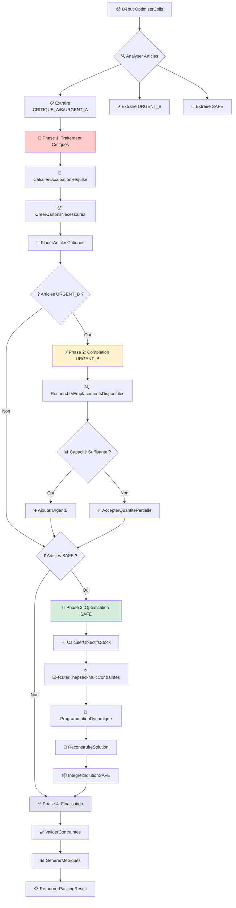
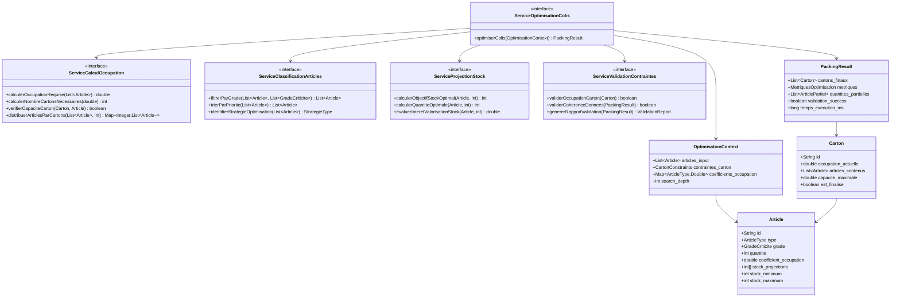
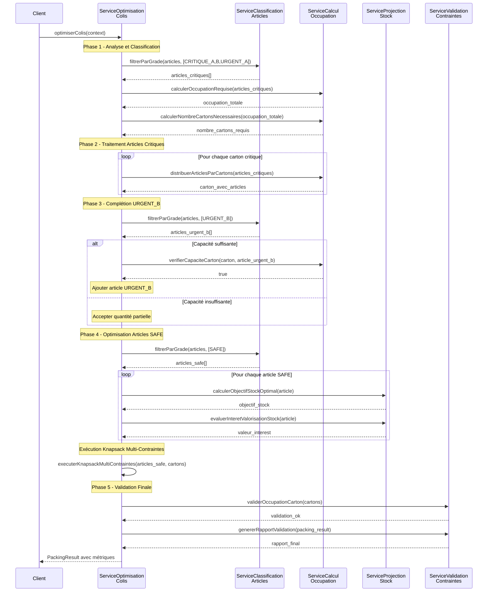

# TT-DEV-001 - Implémentation Algorithme Knapsack Adaptatif Modulaire

## 📋 Contexte et Objectif

**Epic :** Optimisation Automatique des Colis
**Type :** Feature
**Priorité :** High
**Estimation :** 13 points

### Description
Implémenter un système d'optimisation de colis utilisant un algorithme de knapsack adaptatif et modulaire pour gérer différents niveaux de criticité des matériels (CRITIQUE_A/B, URGENT_A, URGENT_B, SAFE) avec des contraintes d'occupation par type d'article.

### Valeur Métier
- Garantir 100% des matériels critiques dans les colis
- Optimiser l'utilisation de l'espace selon la criticité
- Réduire le nombre de colis tout en respectant les priorités
- Améliorer la satisfaction client par une livraison prioritaire

---

## 🏗️ Architecture Technique

### Services à Implémenter
1. **ServiceCalculOccupation** - Calcul des taux d'occupation
2. **ServiceClassificationArticles** - Classification par criticité
3. **ServiceProjectionStock** - Calcul objectifs stock (min+max)/2
4. **ServiceOptimisationColis** - Orchestrateur principal
5. **ServiceValidationContraintes** - Validation finale

### Coefficients d'Occupation par Type
```
TYPE_1 = 0.20 (20%)
TYPE_2 = 0.25 (25%)
TYPE_3 = 0.10 (10%)
CAPACITE_CARTON = 1.0 (100%)
```

---

## 📝 Règles de Gestion

### RG-001 : Classification des Articles par Criticité
**Priorité :** CRITIQUE_A > CRITIQUE_B > URGENT_A > URGENT_B > SAFE
**Application :** Les articles critiques court-circuitent l'algorithme de knapsack

### RG-002 : Calcul d'Occupation des Cartons
**Formule :** `occupation_totale = Σ(quantité_article × coefficient_type)`
**Contrainte :** `occupation_totale ≤ 1.0`

### RG-003 : Stratégie Court-Circuit pour Articles Critiques
**Règle :** Utiliser `PLAFOND(occupation_requise)` cartons pour garantir 100% des critiques
**Application :** Bypass du knapsack pour CRITIQUE_A, CRITIQUE_B, URGENT_A

### RG-004 : Algorithme Knapsack pour Articles SAFE
**Objectif :** Maximiser la valorisation stock avec cible `(stock_min + stock_max) / 2`
**Contrainte :** Respecter les capacités restantes des cartons

### RG-005 : Gestion des Quantités Partielles URGENT_B
**Règle :** Si aucun carton avec capacité disponible, accepter quantité partielle
**Action :** Passer à la finalisation sans créer nouveau carton

### RG-006 : Validation des Contraintes Finales
**Contrôles :** Occupation ≤ 100%, articles critiques à 100%, cohérence données

---

## ✅ Critères d'Acceptation

### CA-001 : Traitement Articles Critiques (Court-Circuit)
```gherkin
Given une liste d'articles contenant des matériels CRITIQUE_A et CRITIQUE_B
  And des coefficients d'occupation TYPE_1=0.2, TYPE_2=0.25, TYPE_3=0.1
When j'exécute l'algorithme d'optimisation des colis
Then tous les articles CRITIQUE_A et CRITIQUE_B sont placés à 100%
  And le nombre de cartons créés = PLAFOND(occupation_totale_critiques)
  And aucun algorithme de knapsack n'est exécuté pour ces articles
```

### CA-002 : Traitement Articles URGENT_A (Court-Circuit)
```gherkin
Given une liste d'articles contenant 50 unités URGENT_A de TYPE_1 (coeff 0.2)
When j'exécute l'algorithme d'optimisation des colis
Then les 50 unités URGENT_A sont placées à 100%
  And occupation_requise = 50 × 0.2 = 10.0
  And nombre_cartons_créés = PLAFOND(10.0) = 10 cartons
  And le traitement utilise la stratégie court-circuit
```

### CA-003 : Optimisation Articles SAFE avec Knapsack
```gherkin
Given des articles SAFE avec projections de stock
  And stock_min = 10, stock_max = 50 pour un article
  And des cartons avec espace restant disponible
When j'exécute l'algorithme d'optimisation des colis
Then l'objectif de stock calculé = (10 + 50) / 2 = 30
  And l'algorithme de knapsack maximise la valorisation vers cet objectif
  And les articles SAFE sont placés selon la solution optimale
```

### CA-004 : Gestion Quantités Partielles URGENT_B
```gherkin
Given des articles URGENT_B à placer
  And tous les cartons existants ont une occupation ≥ 95%
  And aucun carton n'a la capacité pour la quantité totale
When j'exécute l'algorithme d'optimisation des colis
Then l'algorithme place la quantité partielle possible
  And aucun nouveau carton n'est créé
  And le processus passe directement à la finalisation
  And le résultat indique les quantités partielles acceptées
```

### CA-005 : Validation Contraintes d'Occupation
```gherkin
Given un carton avec occupation calculée
When j'applique la validation des contraintes
Then l'occupation totale ≤ 1.0 (100%)
  And occupation_carton = Σ(quantité_article × coefficient_type)
  And les débordements génèrent une erreur de validation
```

### CA-006 : Séquençage Multi-Phases
```gherkin
Given une liste mixte d'articles de tous types de criticité
When j'exécute l'algorithme d'optimisation des colis
Then Phase 1: Articles CRITIQUE_A/B/URGENT_A traités en court-circuit
  And Phase 2: Articles URGENT_B complètent les cartons existants
  And Phase 3: Articles SAFE optimisés par knapsack sur espace restant
  And Phase 4: Validation et génération du rapport final
```

### CA-007 : Gestion des Cas Limites
```gherkin
Given une liste d'articles avec quantités très importantes
  And coefficients d'occupation générant des besoins > 1000 cartons
When j'exécute l'algorithme d'optimisation des colis
Then l'algorithme gère les gros volumes sans dégradation de performance
  And le temps d'exécution reste < 10 secondes pour 10000 articles
  And la mémoire utilisée reste raisonnable (< 1GB)
```

### CA-008 : Cas Articles Uniquement SAFE
```gherkin
Given une liste d'articles contenant uniquement des matériels SAFE
When j'exécute l'algorithme d'optimisation des colis
Then la stratégie knapsack classique est appliquée directement
  And l'objectif = maximiser la valorisation stock (min+max)/2
  And le nombre de cartons est optimisé selon la solution knapsack
```

### CA-009 : Métriques et Rapports
```gherkin
Given l'exécution complète de l'algorithme d'optimisation
When je consulte le rapport final
Then j'obtiens le nombre total de cartons créés
  And le taux d'occupation moyen des cartons
  And le pourcentage de satisfaction par type de criticité
  And les quantités partielles acceptées (si applicable)
  And le temps d'exécution total
```

### CA-010 : Gestion d'Erreurs et Validation
```gherkin
Given des données d'entrée invalides (coefficients négatifs, quantités nulles)
When j'exécute l'algorithme d'optimisation des colis
Then l'algorithme génère des erreurs de validation appropriées
  And aucun traitement n'est effectué sur des données corrompues
  And les messages d'erreur sont explicites et exploitables
```

---

## 🔧 Spécifications Techniques

### Interfaces Principales

#### ServiceOptimisationColis
```java
public interface ServiceOptimisationColis {
    PackingResult optimiserColis(OptimisationContext context);
}

public class OptimisationContext {
    List<Article> articles_input;
    CartonConstraints contraintes_carton;
    Map<ArticleType, Double> coefficients_occupation;
    int search_depth; // Pour projections stock
}

public class PackingResult {
    List<Carton> cartons_finaux;
    MetriquesOptimisation metriques;
    List<ArticlePartiel> quantites_partielles;
    boolean validation_success;
}
```

#### ServiceCalculOccupation
```java
public interface ServiceCalculOccupation {
    double calculerOccupationRequise(List<Article> articles);
    int calculerNombreCartonsNecessaires(double occupation_totale);
    boolean verifierCapaciteCarton(Carton carton, Article article);
}
```

### Algorithmes Clés

#### Algorithme Principal (Pseudocode)
```
ALGORITHME OptimiserColis(context)
DEBUT
    articles_critiques ← FiltrerParGrade(context.articles, [CRITIQUE_A, CRITIQUE_B, URGENT_A])
    articles_urgent_b ← FiltrerParGrade(context.articles, [URGENT_B])
    articles_safe ← FiltrerParGrade(context.articles, [SAFE])

    // Phase 1: Court-circuit pour critiques
    cartons_resultats ← TraiterArticlesCritiques(articles_critiques)

    // Phase 2: Complétion URGENT_B
    SI articles_urgent_b NON VIDE ALORS
        cartons_resultats ← CompleterAvecUrgentB(cartons_resultats, articles_urgent_b)
    FIN_SI

    // Phase 3: Optimisation SAFE par knapsack
    SI articles_safe NON VIDE ALORS
        cartons_resultats ← OptimiserAvecSafe(cartons_resultats, articles_safe)
    FIN_SI

    // Phase 4: Validation finale
    RETOURNER ValiderEtGenererRapport(cartons_resultats)
FIN
```

#### Algorithme Knapsack Multi-Contraintes (Pseudocode)
```
ALGORITHME KnapsackMultiContraintes(articles_safe, cartons_disponibles)
DEBUT
    POUR CHAQUE carton DANS cartons_disponibles FAIRE
        capacite_restante ← 1.0 - carton.occupation_actuelle
        articles_candidats ← FiltrerParCapacite(articles_safe, capacite_restante)

        // Table de programmation dynamique
        dp ← InitialiserTableDP(articles_candidats.size, capacite_restante)

        POUR i DE 1 A articles_candidats.size FAIRE
            POUR w DE 0 A capacite_restante FAIRE
                article ← articles_candidats[i-1]
                cout_occupation ← article.quantite × article.coefficient
                valeur_stock ← CalculerValeurValorisationStock(article)

                SI cout_occupation <= w ALORS
                    dp[i][w] ← MAX(dp[i-1][w], dp[i-1][w-cout_occupation] + valeur_stock)
                SINON
                    dp[i][w] ← dp[i-1][w]
                FIN_SI
            FIN_POUR
        FIN_POUR

        solution ← ReconstruireSolution(dp, articles_candidats)
        AppliquerSolution(carton, solution)
    FIN_POUR

    RETOURNER cartons_disponibles
FIN
```

---

## 📊 Diagrammes et Architecture Détaillée

### Flowchart Principal - Algorithme d'Optimisation des Colis



### Architecture des Services - Diagramme de Classes



### Algorithme Knapsack Multi-Contraintes - Flowchart Détaillé

```mermaid
flowchart TD
    A[🎯 Début KnapsackMultiContraintes] --> B[📋 articles_safe, cartons_disponibles]

    B --> C{🔄 Pour chaque carton}
    C --> D[📊 Calculer capacite_restante = 1.0 - occupation_actuelle]
    D --> E[🔍 Filtrer articles_candidats par capacite_restante]

    E --> F[📈 Initialiser TableDP[n][W]]
    F --> G{🔄 Pour i = 1 à n articles}

    G --> H{🔄 Pour w = 0 à capacite_restante}
    H --> I[📦 article = articles_candidats[i-1]]
    I --> J[⚖️ cout_occupation = quantite × coefficient]
    J --> K[💰 valeur_stock = CalculerValeurValorisationStock]

    K --> L{❓ cout_occupation ≤ w ?}
    L -->|Oui| M[📈 dp[i][w] = MAX(dp[i-1][w], dp[i-1][w-cout] + valeur)]
    L -->|Non| N[📋 dp[i][w] = dp[i-1][w]]

    M --> O{🔄 w suivant ?}
    N --> O
    O -->|Oui| H
    O -->|Non| P{🔄 i suivant ?}

    P -->|Oui| G
    P -->|Non| Q[🔄 ReconstruireSolution depuis dp[n][W]]

    Q --> R[📦 AppliquerSolution au carton]
    R --> S{🔄 Carton suivant ?}
    S -->|Oui| C
    S -->|Non| T[✅ Retourner cartons_optimises]

    style A fill:#d4edda
    style F fill:#fff2cc
    style Q fill:#ffeaa7
    style T fill:#74b9ff
```

### Diagramme de Séquence - Cas d'Usage Complet



### Algorithme Décision Quantités Partielles URGENT_B - Flowchart Spécialisé

```mermaid
flowchart TD
    A[⚡ Début CompletionUrgentB] --> B[📋 articles_urgent_b, cartons_existants]

    B --> C{🔄 Pour chaque article URGENT_B}
    C --> D[📊 quantite_restante = article.quantite_totale]

    D --> E{🔄 Pour chaque carton}
    E --> F[📐 capacite_libre = 1.0 - carton.occupation]
    F --> G[⚖️ quantite_max_possible = capacite_libre / article.coefficient]

    G --> H{❓ quantite_max_possible >= quantite_restante ?}
    H -->|Oui| I[✅ Placer quantité totale]
    H -->|Non| J[📊 quantite_partielle = quantite_max_possible]

    I --> K[📦 Mettre à jour carton]
    J --> L[📦 Mettre à jour carton avec partiel]

    K --> M[🔄 quantite_restante = 0]
    L --> N[🔄 quantite_restante -= quantite_partielle]

    M --> O{🔄 Article suivant ?}
    N --> P{❓ quantite_restante > 0 ?}

    P -->|Oui| Q{🔄 Carton suivant disponible ?}
    P -->|Non| O

    Q -->|Oui| E
    Q -->|Non| R{⚙️ Décision Stratégique}

    R -->|Créer Carton| S[📦 CreerNouveauCarton]
    R -->|Accepter Partiel| T[✅ AccepterQuantitePartielle]

    S --> U[🔄 Ajouter nouveau carton à la liste]
    U --> E

    T --> V[📋 Enregistrer quantite_partielle]
    V --> O

    O -->|Oui| C
    O -->|Non| W[✅ RetournerResultatUrgentB]

    style R fill:#ff9999
    style T fill:#99ccff
    style S fill:#ffcc99
    style W fill:#99ff99

    note right of R : Point critique de décision<br/>selon règles métier
    note right of T : RG-005 : Accepter partiel<br/>si plus de cartons disponibles
```

### Matrices de Décision - Stratégies par Cas d'Usage

#### Matrice 1 : Stratégie de Traitement selon Composition Articles

| Composition Articles | Stratégie Appliquée | Algorithmes Utilisés | Complexité | Performance Attendue |
|---------------------|-------------------|-------------------|-----------|-------------------|
| 100% CRITIQUES | Court-Circuit Pur | CalculOccupation + Placement Direct | O(n) | < 100ms |
| 100% SAFE | Knapsack Classique | Programmation Dynamique Complète | O(n×W×C) | < 2s |
| CRITIQUES + SAFE | Hybride Séquentiel | Court-Circuit → Knapsack Résiduel | O(n) + O(m×W×C) | < 3s |
| CRITIQUES + URGENT_B | Court-Circuit + Complétion | Court-Circuit → Gestion Partielles | O(n) + O(m×C) | < 500ms |
| Composition Mixte Complète | 4 Phases Complètes | Toutes Stratégies Combinées | O(n) + O(m×C) + O(k×W×C) | < 5s |

#### Matrice 2 : Décisions Quantités Partielles URGENT_B

| Situation | Cartons Disponibles | Capacité Restante | Décision Recommandée | Action Algorithme |
|----------|-------------------|------------------|-------------------|------------------|
| Quantité faible | Oui | Suffisante | Placement Total | AjouterUrgentB() |
| Quantité élevée | Oui | Insuffisante | Placement Partiel | AjouterQuantitePartielle() |
| Quantité élevée | Non | N/A | Créer Nouveau vs Accepter | RG-005 selon contexte |
| Reste < 10% | Indifférent | Indifférente | Accepter Partiel | Optimisation Performance |
| Reste > 50% | Oui | Suffisante | Créer Nouveau Carton | Maximiser Satisfaction |

## 📋 Explications Détaillées des Algorithmes

### Tableau 1 : Variables Algorithme Principal OptimiserColis

| Variable | Type | Description | Valeurs Possibles | Utilisation |
|----------|------|-------------|-------------------|-------------|
| `context` | OptimisationContext | Contexte d'entrée avec tous les paramètres | - | Paramètre principal d'entrée |
| `articles_input` | List\<Article\> | Liste complète des articles à traiter | 1 à N articles | Classification par criticité |
| `articles_critiques` | List\<Article\> | Articles CRITIQUE_A/B + URGENT_A | 0 à N articles | Traitement court-circuit Phase 1 |
| `articles_urgent_b` | List\<Article\> | Articles URGENT_B uniquement | 0 à N articles | Complétion cartons Phase 2 |
| `articles_safe` | List\<Article\> | Articles SAFE uniquement | 0 à N articles | Optimisation knapsack Phase 3 |
| `coefficients_occupation` | Map\<ArticleType,Double\> | Coefficients par type d'article | TYPE_1=0.2, TYPE_2=0.25, TYPE_3=0.1 | Calcul occupation cartons |
| `cartons_resultats` | List\<Carton\> | Cartons créés et remplis | 1 à N cartons | Résultat intermédiaire |
| `search_depth` | int | Profondeur recherche projections stock | 1-30 jours | Calcul objectifs SAFE |
| `packing_result` | PackingResult | Résultat final complet | - | Retour de l'algorithme |

### Tableau 2 : Variables Algorithme KnapsackMultiContraintes

| Variable | Type | Description | Valeurs Possibles | Utilisation |
|----------|------|-------------|-------------------|-------------|
| `articles_safe` | List\<Article\> | Articles SAFE à optimiser | 0 à N articles | Entrée principale |
| `cartons_disponibles` | List\<Carton\> | Cartons avec espace restant | 1 à N cartons | Conteneurs à optimiser |
| `capacite_restante` | double | Espace disponible dans carton | 0.0 à 1.0 | Contrainte knapsack |
| `articles_candidats` | List\<Article\> | Articles qui peuvent entrer dans carton | 0 à M articles | Filtrage par capacité |
| `dp` | double\[\]\[\] | Table programmation dynamique | dp\[n\]\[W\] | Mémorisation solutions |
| `i` | int | Index article courant | 1 à n | Boucle articles |
| `w` | int | Capacité courante considérée | 0 à W | Boucle capacités |
| `cout_occupation` | double | Occupation requise par article | quantité × coefficient | Contrainte espace |
| `valeur_stock` | double | Valeur valorisation stock | (min+max)/2 - stock_final | Fonction objectif |
| `solution_optimale` | List\<Article\> | Articles sélectionnés par knapsack | 0 à M articles | Résultat optimisation |

### Tableau 3 : Variables Calcul Occupation et Validation

| Variable | Type | Description | Valeurs Possibles | Utilisation |
|----------|------|-------------|-------------------|-------------|
| `occupation_totale` | double | Occupation totale calculée | 0.0 à N.0 | Évaluation besoins |
| `nombre_cartons_requis` | int | Cartons nécessaires | PLAFOND(occupation_totale) | Création cartons |
| `article.quantite` | int | Quantité d'un article | 1 à N | Calcul occupation |
| `article.coefficient` | double | Coefficient d'occupation par type | 0.1, 0.2, 0.25 | Règle métier |
| `carton.occupation_actuelle` | double | Occupation courante du carton | 0.0 à 1.0 | État du carton |
| `capacite_suffisante` | boolean | Carton peut-il accueillir l'article ? | true/false | Décision placement |
| `quantite_partielle` | int | Quantité acceptée partiellement | 0 à quantite_totale | Gestion URGENT_B |
| `taux_satisfaction` | double | % articles placés par criticité | 0.0 à 1.0 | Métrique qualité |
| `temps_execution` | long | Durée totale traitement | millisecondes | Métrique performance |
| `validation_success` | boolean | Toutes validations passées ? | true/false | État final |

### Tableau 4 : Variables Spécifiques Projection Stock (Articles SAFE)

| Variable | Type | Description | Valeurs Possibles | Utilisation |
|----------|------|-------------|-------------------|-------------|
| `stock_projections` | int\[\] | Projections stock par jour | tableau[search_depth] | Données temporelles |
| `stock_minimum` | int | Stock minimum projeté | MIN(projections) | Calcul objectif |
| `stock_maximum` | int | Stock maximum projeté | MAX(projections) | Calcul objectif |
| `objectif_stock` | int | Cible optimisation | (min + max) / 2 | Règle métier |
| `stock_final` | int | Stock projeté fin période | projections[search_depth] | État futur |
| `quantite_optimale` | int | Quantité recommandée | objectif - stock_final | Besoin calculé |
| `interet_valorisation` | double | Score intérêt article | fonction complexe | Priorisation knapsack |
| `ecart_objectif` | int | Distance à l'objectif | ABS(stock_final - objectif) | Évaluation pertinence |

---

## 🧪 Tests Unitaires Requis

### Tests ServiceCalculOccupation
- **testCalculOccupationSimple()** : 10 TYPE_1 → 2.0
- **testCalculOccupationMixte()** : 5 TYPE_1 + 2 TYPE_2 → 1.5
- **testNombreCartonsNecessaires()** : occupation 2.3 → 3 cartons
- **testVerificationCapacite()** : carton 80% + article 0.3 → false

### Tests ServiceClassificationArticles
- **testFiltrageCritiques()** : CRITIQUE_A/B + URGENT_A extraits
- **testFiltrageUrgentB()** : URGENT_B uniquement
- **testFiltrageSafe()** : SAFE uniquement
- **testTriParPriorite()** : ordre respecté

### Tests ServiceProjectionStock
- **testCalculObjectifStock()** : (min=10, max=50) → 30
- **testCalculQuantiteOptimale()** : objectif=30, stock_final=20 → 10
- **testEvaluationInteretValorisationStock()** : scoring cohérent

### Tests Algorithme Principal
- **testCasUniqueementCritiques()** : court-circuit only
- **testCasUniquementSafe()** : knapsack only
- **testCasMixteComplet()** : toutes les phases
- **testGestionQuantitesPartielles()** : URGENT_B partiels
- **testValidationContraintes()** : occupation ≤ 100%

---

## 📊 Métriques de Performance

### Indicateurs Clés
- **Temps d'exécution** : < 5 secondes pour 1000 articles
- **Utilisation mémoire** : < 512MB en pic
- **Taux d'occupation moyen** : > 85%
- **Satisfaction articles critiques** : 100%
- **Satisfaction articles SAFE** : > 70%

### Benchmarks
- **Volume Standard** : 100-500 articles → < 1 seconde
- **Gros Volume** : 1000-5000 articles → < 10 secondes
- **Volume Extrême** : 10000+ articles → < 30 secondes

---

## 🚀 Définition of Done

- [ ] Tous les services implémentés selon les interfaces
- [ ] Tous les critères d'acceptation validés par les tests
- [ ] Tests unitaires > 90% de couverture
- [ ] Tests d'intégration sur les cas métier complexes
- [ ] Performance validée sur les benchmarks définis
- [ ] Documentation technique complète
- [ ] Code review approuvé par le tech lead
- [ ] Déploiement en environnement de test validé

---

## 📚 Ressources et Références

- **Algorithme Knapsack** : Programmation dynamique multi-contraintes
- **Design Patterns** : Strategy, Factory, Chain of Responsibility
- **Documentation Architecture** : `/docs/architecture-knapsack-modulaire.md`
- **Spécifications Métier** : Conception-Knapsack-Adaptatif-Modulaire.md

---

**Créé le :** $(date)
**Assigné à :** Équipe Backend
**Reviewer :** Tech Lead + Product Owner
**Sprint :** À définir selon roadmap produit
