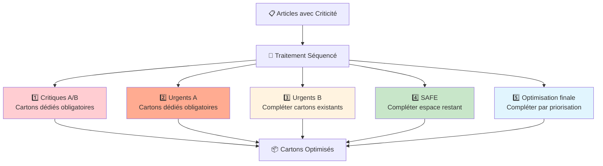
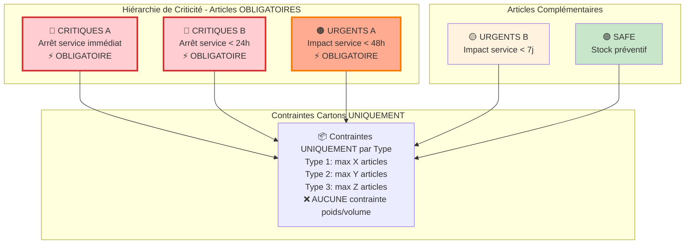
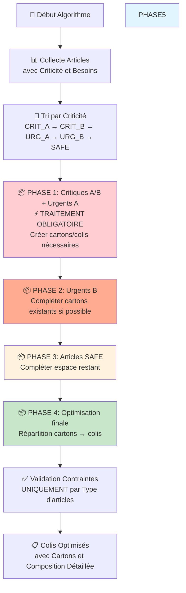
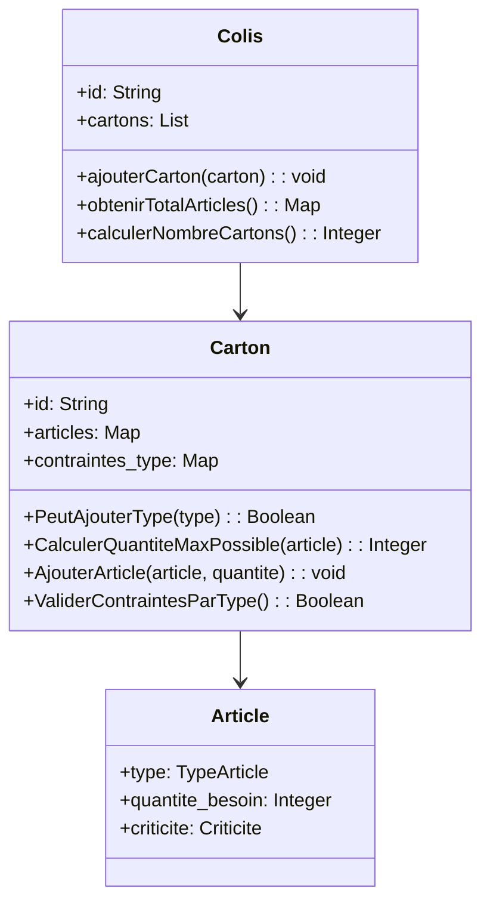
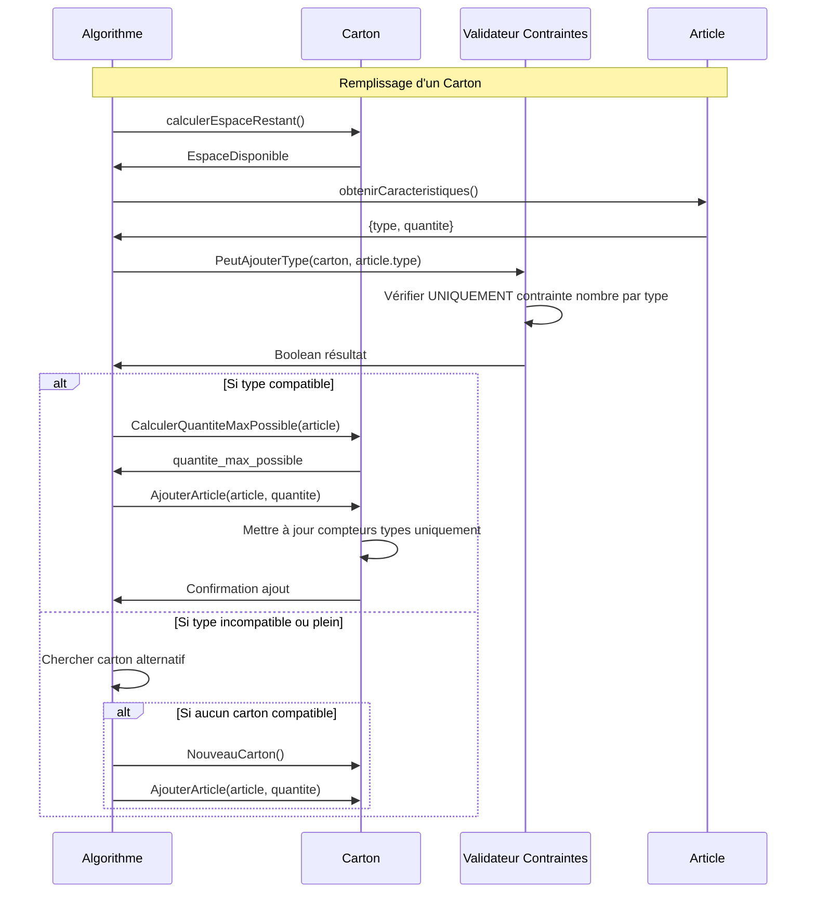
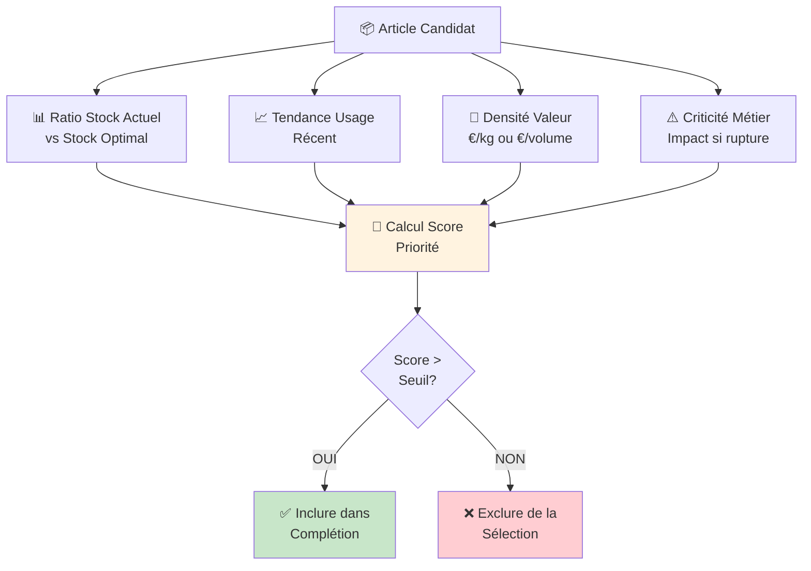
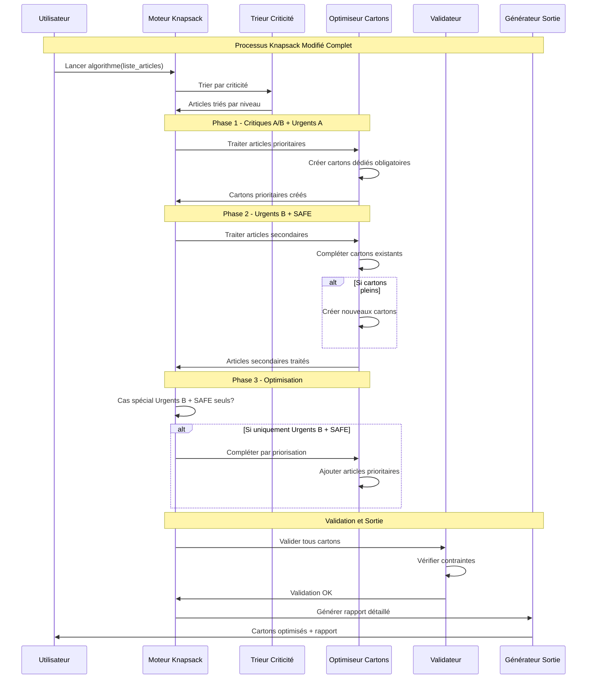
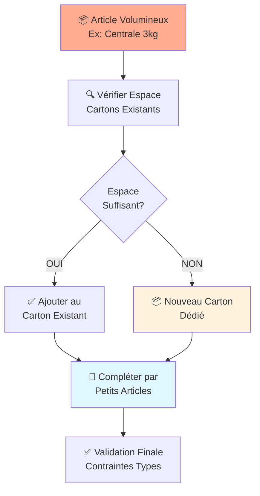
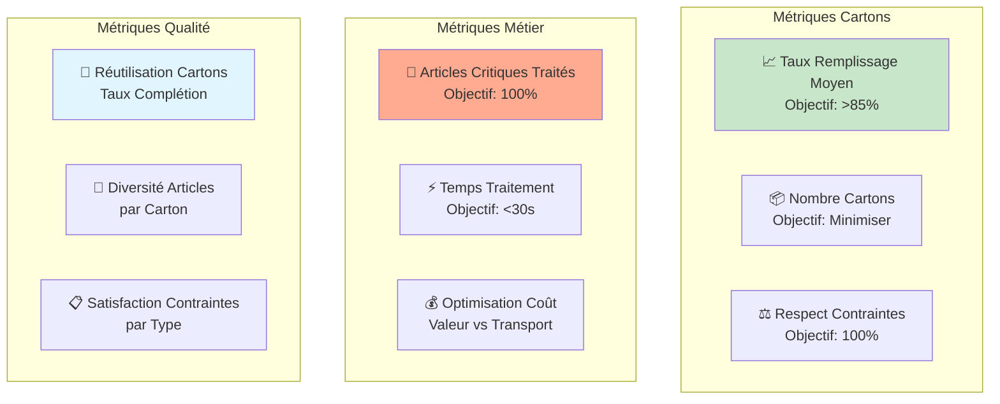

# Algorithme Knapsack Modifié pour Réapprovisionnement par Criticité
## Version Séquencée avec Priorités et Optimisation par Cartons

---

## 🎯 **Vue d'Ensemble de l'Approche**

Cette approche utilise un **algorithme Knapsack modifié** qui traite les matériels par ordre de criticité décroissante, avec une stratégie de remplissage optimisé des cartons selon des contraintes physiques spécifiques par type d'article.

### **Principe Directeur**


---

## 📊 **Classification des Articles et Contraintes Cartons**

### **Catégories de Criticité**


### **Contraintes Simplifiées par Type d'Article**
```json
{
  "contraintes_carton_uniquement": {
    "type_1": {"max_articles": "X"},
    "type_2": {"max_articles": "Y"},
    "type_3": {"max_articles": "Z"}
  },
  "contraintes_supprimees": {
    "poids_max_kg": "❌ SUPPRIMÉ - Pas de contrainte poids",
    "volume_max_litres": "❌ SUPPRIMÉ - Pas de contrainte volume",
    "poids_unitaire": "❌ SUPPRIMÉ - Non pertinent",
    "volume_unitaire": "❌ SUPPRIMÉ - Non pertinent"
  },
  "principe_colis": {
    "composition": "Un colis peut contenir UN OU PLUSIEURS cartons",
    "contrainte_unique": "Seules les contraintes par TYPE sont appliquées par carton",
    "flexibilite": "L'algorithme détermine la répartition optimale cartons/colis"
  }
}
```

---

## 🔄 **Algorithme Knapsack Séquencé Modifié**

### **Algorithme Principal**



### **Détail de l'Algorithme**

```
ALGORITHME KnapsackModifieParCriticite(liste_articles)
DÉBUT
    cartons ← []
    colis ← []
    articles_traités ← []

    // === PHASE 1: ARTICLES OBLIGATOIRES (CRIT_A + CRIT_B + URG_A) ===
    articles_obligatoires ← FiltrerParCriticite(liste_articles, ["CRIT_A", "CRIT_B", "URG_A"])

    POUR CHAQUE article DANS articles_obligatoires FAIRE
        quantite_restante ← article.quantite_besoin

        TANT QUE quantite_restante > 0 FAIRE
            carton ← NouveauCarton()
            quantite_ajoutee ← RemplirCartonParType(carton, article, quantite_restante)
            cartons.ajouter(carton)
            quantite_restante ← quantite_restante - quantite_ajoutee
        FIN TANT QUE

        articles_traités.ajouter(article)
    FIN POUR

    // === PHASE 2: URGENTS B - COMPLÉTER CARTONS EXISTANTS SI POSSIBLE ===
    POUR CHAQUE article DANS articles_urgents_b FAIRE
        quantite_restante ← article.quantite_besoin

        // Essayer de compléter cartons existants
        POUR CHAQUE carton DANS cartons FAIRE
            SI carton.PeutAjouterType(article.type) ALORS
                quantite_possible ← carton.CalculerQuantiteMaxPossible(article)
                SI quantite_possible > 0 ALORS
                    quantite_ajoutee ← MIN(quantite_restante, quantite_possible)
                    carton.AjouterArticle(article, quantite_ajoutee)
                    quantite_restante ← quantite_restante - quantite_ajoutee
                FIN SI
            FIN SI

            SI quantite_restante = 0 ALORS
                SORTIR
            FIN SI
        FIN POUR

        // Créer nouveaux cartons pour quantité restante
        TANT QUE quantite_restante > 0 FAIRE
            carton ← NouveauCarton()
            quantite_ajoutee ← RemplirCartonParType(carton, article, quantite_restante)
            cartons.ajouter(carton)
            quantite_restante ← quantite_restante - quantite_ajoutee
        FIN TANT QUE

        articles_traités.ajouter(article)
    FIN POUR

    // === PHASE 3: STRATÉGIE SPÉCIALE SI UNIQUEMENT URGENTS B ===
    SI SeulementUrgentsB(liste_articles) ALORS
        // Identifier articles à valoriser pour atteindre (min+max)/2
        articles_valorisation ← IdentifierArticlesValorisationJ10()

        SI articles_valorisation.non_vide ALORS
            // Trier par valeur décroissante
            TRIER articles_valorisation PAR valeur DESCENDANT

            POUR CHAQUE carton DANS cartons FAIRE
                POUR CHAQUE article DANS articles_valorisation FAIRE
                    SI carton.PeutAjouterType(article.type) ALORS
                        quantite_optimale ← CalculerQuantiteOptimaleJ10(article)
                        quantite_possible ← carton.CalculerQuantiteMaxPossible(article)
                        quantite_ajoutee ← MIN(quantite_optimale, quantite_possible)

                        SI quantite_ajoutee > 0 ALORS
                            carton.AjouterArticle(article, quantite_ajoutee)
                            article.quantite_valorisation ← article.quantite_valorisation - quantite_ajoutee
                        FIN SI
                    FIN SI
                FIN POUR
            FIN POUR
        FIN SI
    SINON
        // === PHASE 3 STANDARD: ARTICLES SAFE - REMPLISSAGE OPPORTUNISTE ===
        articles_safe ← FiltrerParCriticite(liste_articles, ["SAFE"])
        SOUSTRACTION(articles_safe, articles_traités)

        POUR CHAQUE carton DANS cartons FAIRE
            POUR CHAQUE article DANS articles_safe FAIRE
                SI carton.PeutAjouterType(article.type) ALORS
                    quantite_possible ← carton.CalculerQuantiteMaxPossible(article)
                    SI quantite_possible > 0 ALORS
                        carton.AjouterArticle(article, quantite_possible)
                    FIN SI
                FIN SI
            FIN POUR
        FIN POUR
    FIN SI

    // === PHASE 4: OPTIMISATION COLIS ===
    colis ← OptimiserRepartitionCartonsEnColis(cartons)

    // Validation finale contraintes par type uniquement
    POUR CHAQUE carton DANS cartons FAIRE
        ValiderContraintesParType(carton)
    FIN POUR

    RETOURNER colis
FIN
```

---

## 📦 **Gestion des Cartons et Contraintes**

### **Structure d'un Carton et Colis**



### **Algorithme de Remplissage Optimal**



---

## 🎯 **Système de Priorisation pour Complétion**

### **Calcul du Score de Priorité**



### **Formule de Priorisation**

```
Score_Priorité = α × Ratio_Stock + β × Tendance_Usage + γ × Densité_Valeur + δ × Criticité_Métier

Où:
- Ratio_Stock = (Stock_Min + Stock_Max)/2 - Stock_Actuel) / Stock_Max
- Tendance_Usage = Usage_Récent / Usage_Moyen_Historique  
- Densité_Valeur = Valeur_Unitaire / Quantité_Unitaire
- Criticité_Métier ∈ {0.2, 0.5, 0.8, 1.0} selon impact métier

Coefficients suggérés: α=0.4, β=0.3, γ=0.2, δ=0.1
```

---

## 🔄 **Diagramme de Séquence Complet**



---

## ⚖️ **Gestion des Cas Particuliers**

### **Cas 1: Articles Volumineux (Centrales, Caméras)**



### **Cas 2: Stratégie Spéciale Uniquement Urgents B + Valorisation**

```mermaid
flowchart TD
    ONLY_URG_B[🟡 Uniquement<br/>Urgents B] --> CREATE_BASE[📦 Créer Cartons<br/>Base Urgents B]

    CREATE_BASE --> CHECK_SPACE[📏 Vérifier Espace<br/>Disponible dans Cartons]

    CHECK_SPACE --> SPACE_OK{Espace<br/>Disponible?}

    SPACE_OK -->|OUI| FIND_VALORISATION[🔍 Identifier Articles<br/>Stock J+10 < (Min+Max)/2]
    SPACE_OK -->|NON| FINAL_URG_B[📦 Colis Urgents B<br/>Uniquement]

    FIND_VALORISATION --> HAS_CANDIDATES{Articles à<br/>Valoriser?}

    HAS_CANDIDATES -->|OUI| SORT_VALUE[📊 Trier par Valeur<br/>Décroissante]
    HAS_CANDIDATES -->|NON| FINAL_URG_B

    SORT_VALUE --> FILL_VALUE[💎 Remplir avec Articles<br/>Haute Valeur]

    FILL_VALUE --> TARGET_STOCK[🎯 Objectif: Stock → (Min+Max)/2<br/>SANS Nouveaux Cartons]

    TARGET_STOCK --> FINAL_MIXED[📦 Colis Optimisé<br/>Urgents B + Valorisation]

    style ONLY_URG_B fill:#fff3e0
    style FIND_VALORISATION fill:#e1f5fe
    style SORT_VALUE fill:#e8f5e8
    style TARGET_STOCK fill:#c8e6c9
    style FINAL_MIXED fill:#f3e5f5
```

---

## 📊 **Métriques et Optimisation**

### **Indicateurs de Performance**



### **Algorithme d'Évaluation de Performance**

```
FONCTION EvaluerPerformance(cartons_generes, articles_origine)
DÉBUT
    // Métriques de base
    nb_cartons ← cartons_generes.taille
    taux_remplissage_moyen ← CalculerTauxRemplissageMoyen(cartons_generes)
    
    // Respect des priorités
    articles_critiques_traités ← CompterArticlesCritiques(cartons_generes)
    pourcentage_critiques ← articles_critiques_traités / total_critiques × 100
    
    // Optimisation nombre d'articles
    articles_utilises ← SommeArticles(cartons_generes)
    articles_optimal_theorique ← ArticlesMinimalTheorique(articles_origine)
    efficacite_articles ← articles_optimal_theorique / articles_utilises × 100
    
    // Score global
    score_performance ← 
        pourcentage_critiques × 0.4 +
        taux_remplissage_moyen × 0.3 +
        efficacite_articles × 0.2 +
        (100 - nb_cartons_surplus) × 0.1
    
    RETOURNER {
        score: score_performance,
        nb_cartons: nb_cartons,
        taux_remplissage: taux_remplissage_moyen,
        critiques_ok: pourcentage_critiques,
        efficacite_articles: efficacite_articles
    }
FIN
```

---

## 🔧 **Configuration et Paramétrage**

### **Paramètres Configurables**

```json
{
  "knapsack_config": {
    "articles_obligatoires": {
      "critiques_A": "⚡ OBLIGATOIRE - Intégration totale garantie",
      "critiques_B": "⚡ OBLIGATOIRE - Intégration totale garantie",
      "urgents_A": "⚡ OBLIGATOIRE - Intégration totale garantie"
    },
    "contraintes_uniques": {
      "type_1": {"max_par_carton": "X"},
      "type_2": {"max_par_carton": "Y"},
      "type_3": {"max_par_carton": "Z"}
    },
    "contraintes_supprimees": {
      "poids": "❌ SUPPRIMÉ",
      "volume": "❌ SUPPRIMÉ"
    },
    "priorites_completion": {
      "coefficient_ratio_stock": 0.4,
      "coefficient_tendance_usage": 0.3,
      "coefficient_densite_valeur": 0.2,
      "coefficient_criticite": 0.1,
      "seuil_selection_prioritaire": 0.6
    },
    "objectifs_performance": {
      "taux_remplissage_min": 0.75,
      "taux_remplissage_cible": 0.85,
      "temps_calcul_max_secondes": 30
    }
  }
}
```

---

## 🚀 **Algorithmes Détaillés de Support**

### **Fonction: Remplir Carton Par Type**

```
FONCTION RemplirCartonParType(carton, article, quantite_demandee)
DÉBUT
    max_par_carton ← article.type.max_par_carton
    quantite_actuelle_dans_carton ← carton.articles[article.type]

    // Contrainte UNIQUEMENT par nombre d'articles par type
    quantite_possible ← max_par_carton - quantite_actuelle_dans_carton
    quantite_ajoutee ← MIN(quantite_demandee, quantite_possible)

    carton.AjouterArticle(article, quantite_ajoutee)

    RETOURNER quantite_ajoutee
FIN
```

### **Fonction: Optimiser Répartition Cartons en Colis**

```
FONCTION OptimiserRepartitionCartonsEnColis(cartons)
DÉBUT
    colis_liste ← []
    colis_actuel ← NouveauColis()

    // Stratégie simple : grouper les cartons logiquement
    POUR CHAQUE carton DANS cartons FAIRE
        colis_actuel.ajouterCarton(carton)

        // Possibilité d'optimisation: créer nouveau colis selon critères métier
        // (ex: seuil nombre cartons, logique géographique, urgence, etc.)
        SI CritereDivisionColis(colis_actuel) ALORS
            colis_liste.ajouter(colis_actuel)
            colis_actuel ← NouveauColis()
        FIN SI
    FIN POUR

    // Ajouter le dernier colis s'il contient des cartons
    SI colis_actuel.cartons.taille > 0 ALORS
        colis_liste.ajouter(colis_actuel)
    FIN SI

    RETOURNER colis_liste
FIN
```

### **Fonction: Identifier Articles Valorisation J+10**

```
FONCTION IdentifierArticlesValorisationJ10()
DÉBUT
    articles_valorisation ← []
    tous_articles ← GetTousArticlesStock()

    POUR CHAQUE article DANS tous_articles FAIRE
        stock_prevu_j10 ← article.stock_actuel - article.consommation_prevue_j10
        stock_min ← article.stock_minimum
        stock_max ← article.stock_maximum
        stock_optimal ← (stock_min + stock_max) / 2

        // Sélectionner articles avec stock J+10 < optimal
        SI stock_prevu_j10 < stock_optimal ALORS
            quantite_valorisation ← stock_optimal - stock_prevu_j10
            valeur_unitaire ← article.valeur_unitaire // € par pièce

            articles_valorisation.ajouter({
                article: article,
                quantite_valorisation: quantite_valorisation,
                valeur: valeur_unitaire,
                stock_j10: stock_prevu_j10,
                stock_optimal: stock_optimal
            })
        FIN SI
    FIN POUR

    // Retourner vide si tous les articles ont stock J+10 >= optimal
    SI articles_valorisation.vide ALORS
        RETOURNER []
    FIN SI

    RETOURNER articles_valorisation
FIN
```

### **Fonction: Calculer Quantité Optimale J+10**

```
FONCTION CalculerQuantiteOptimaleJ10(article)
DÉBUT
    stock_prevu_j10 ← article.stock_actuel - article.consommation_prevue_j10
    stock_optimal ← (article.stock_minimum + article.stock_maximum) / 2

    // Quantité nécessaire pour atteindre le stock optimal
    quantite_necessaire ← stock_optimal - stock_prevu_j10

    // S'assurer que la quantité est positive
    SI quantite_necessaire <= 0 ALORS
        RETOURNER 0
    FIN SI

    RETOURNER quantite_necessaire
FIN
```

### **Fonction: Vérifier Si Uniquement Urgents B**

```
FONCTION SeulementUrgentsB(liste_articles)
DÉBUT
    articles_non_safe ← []

    POUR CHAQUE article DANS liste_articles FAIRE
        SI article.criticite ≠ "SAFE" ALORS
            articles_non_safe.ajouter(article)
        FIN SI
    FIN POUR

    // Vérifier si tous les articles non-SAFE sont des Urgents B
    POUR CHAQUE article DANS articles_non_safe FAIRE
        SI article.criticite ≠ "URG_B" ALORS
            RETOURNER FAUX
        FIN SI
    FIN POUR

    // Il doit y avoir au moins un article Urgent B
    RETOURNER articles_non_safe.taille > 0
FIN
```

---

## 🎪 **Exemples d'Exécution**

### **Exemple 1: Articles Obligatoires + Complémentaires**

```
DONNÉES ENTRÉE:
- 5 Centrales CRITIQUES A (Type 1, max 10/carton) ⚡ OBLIGATOIRE
- 3 Caméras URGENTS A (Type 2, max 8/carton) ⚡ OBLIGATOIRE
- 20 Détecteurs URGENTS B (Type 3, max 50/carton)
- 100 Câbles SAFE (Type 3, max 50/carton)

EXÉCUTION:
Phase 1 (Obligatoire):
- Carton 1: 5 centrales + 3 caméras
Phase 2 (Urgents B):
- Carton 1: compléter avec 20 détecteurs
Phase 3 (SAFE):
- Carton 1: compléter avec 27 câbles (50-20-3=27 restants pour Type 3)
- Carton 2: 50 câbles
- Carton 3: 23 câbles restants

RÉSULTAT COLIS:
Colis 1: [Carton 1: 5 centrales + 3 caméras + 20 détecteurs + 27 câbles,
          Carton 2: 50 câbles,
          Carton 3: 23 câbles] ✅
```

### **Exemple 2: Stratégie Spéciale - Uniquement Urgents B + Valorisation**

```
DONNÉES ENTRÉE:
- 30 Claviers URGENTS B Type 2 (max 15/carton)

STOCKS ACTUELS (Prévision J+10):
- Détecteurs Type 3: Stock J+10 = 20, Optimal (min+max)/2 = 35, Valeur = 50€
- Câbles Type 3: Stock J+10 = 80, Optimal (min+max)/2 = 75, Valeur = 10€
- Centrales Type 1: Stock J+10 = 8, Optimal (min+max)/2 = 12, Valeur = 200€

EXÉCUTION:
Phase 2 (Urgents B):
- Carton 1: 15 claviers Type 2
- Carton 2: 15 claviers Type 2

Phase 3 (Valorisation - Uniquement Urgents B détectés):
Articles à valoriser par valeur décroissante:
1. Centrales: +4 unités (200€/u) → Carton 1: impossible (Type différent)
2. Détecteurs: +15 unités (50€/u) → Carton 1: +15 détecteurs ✅
3. Centrales: +4 unités → Carton 2: impossible (Type différent)

RÉSULTAT COLIS:
Colis 1: [Carton 1: 15 claviers + 15 détecteurs (max 50 Type 3),
          Carton 2: 15 claviers] ✅
VALORISATION: +750€ de stock optimisé dans cartons existants
```

### **Exemple 3: Cas Limite - Tous Stocks Optimaux**

```
DONNÉES ENTRÉE:
- 20 Claviers URGENTS B Type 2 (max 15/carton)

STOCKS ACTUELS (Prévision J+10):
- Tous les articles ont Stock J+10 ≥ (min+max)/2

EXÉCUTION:
Phase 2 (Urgents B):
- Carton 1: 15 claviers
- Carton 2: 5 claviers

Phase 3 (Valorisation):
- Aucun article à valoriser trouvé
- Cartons gardés tels quels

RÉSULTAT COLIS:
Colis 1: [Carton 1: 15 claviers, Carton 2: 5 claviers] ✅
STRATÉGIE: Colis Urgents B uniquement (optimisation impossible)
```

---

## 🔍 **Optimisations Avancées**

### **Optimisation Génétique pour Cas Complexes**

```
ALGORITHME OptimisationGenetique(articles, nb_generations = 100)
DÉBUT
    population ← GenererPopulationInitiale(articles, taille = 50)
    
    POUR generation ← 1 A nb_generations FAIRE
        // Évaluation fitness
        POUR CHAQUE individu DANS population FAIRE
            individu.fitness ← EvaluerSolution(individu)
        FIN POUR
        
        // Sélection des parents
        parents ← SelectionTournoi(population, taux = 0.7)
        
        // Croisement et mutation
        enfants ← []
        POUR i ← 1 A taille_population / 2 FAIRE
            parent1, parent2 ← ChoisirParents(parents)
            enfant1, enfant2 ← Croisement(parent1, parent2)
            Mutation(enfant1, taux = 0.1)
            Mutation(enfant2, taux = 0.1)
            enfants.ajouter(enfant1, enfant2)
        FIN POUR
        
        // Remplacement élitiste
        population ← RemplacementElitiste(population, enfants)
    FIN POUR
    
    RETOURNER MeilleurIndividu(population)
FIN
```

Cette approche **Knapsack modifiée** garantit le traitement prioritaire des articles critiques tout en optimisant l'utilisation de l'espace disponible et en permettant une complétion intelligente basée sur la priorité métier.
