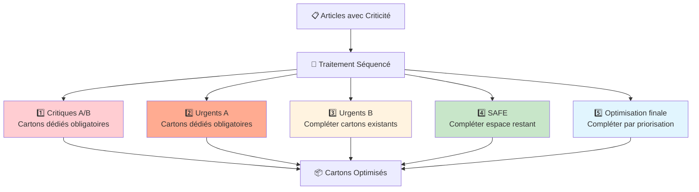
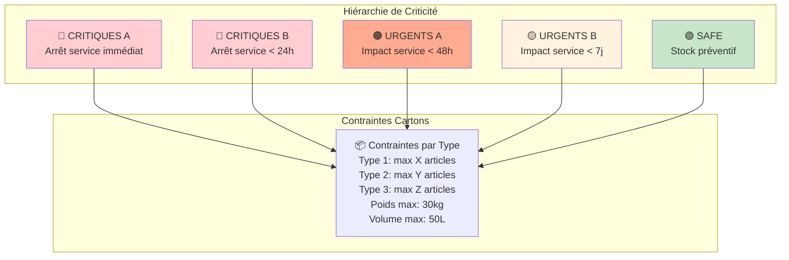
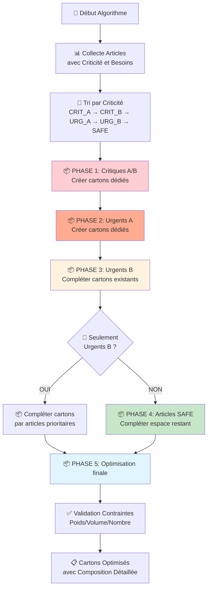
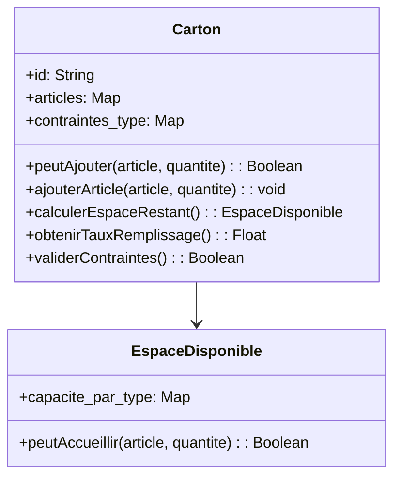
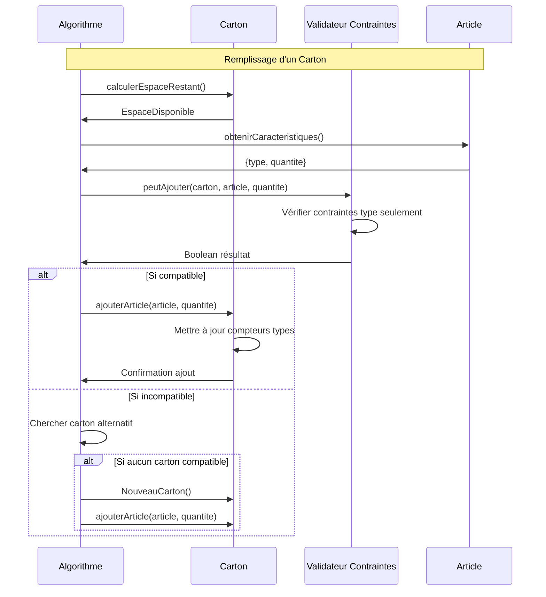
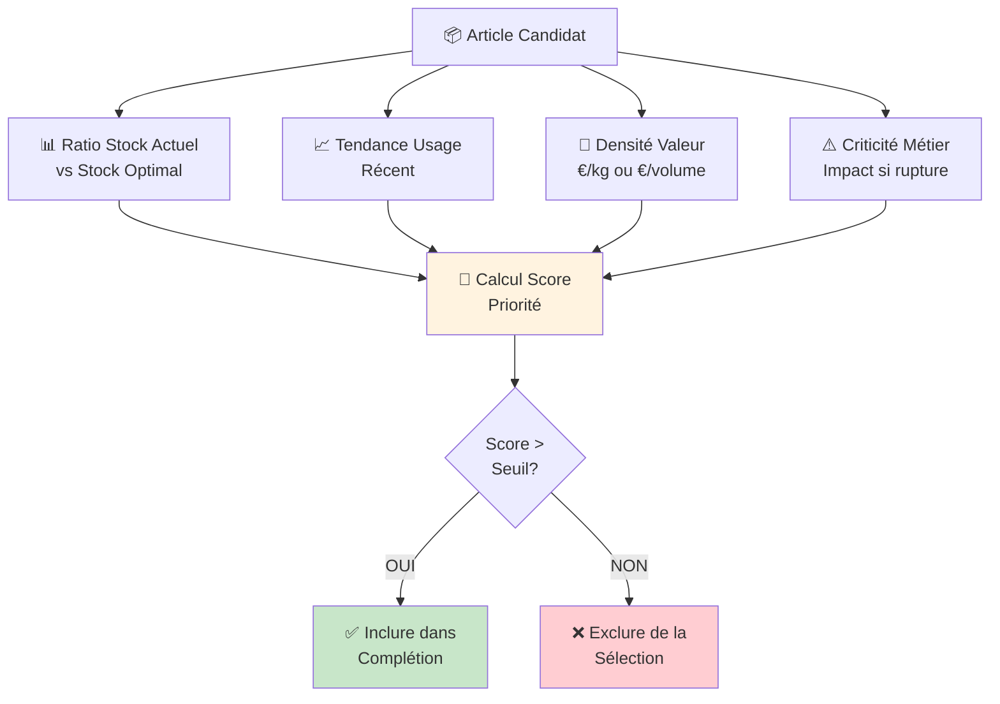
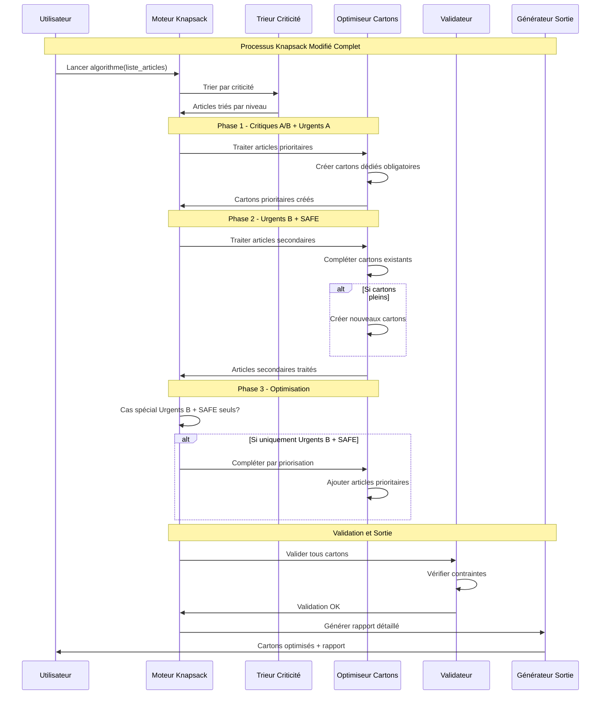
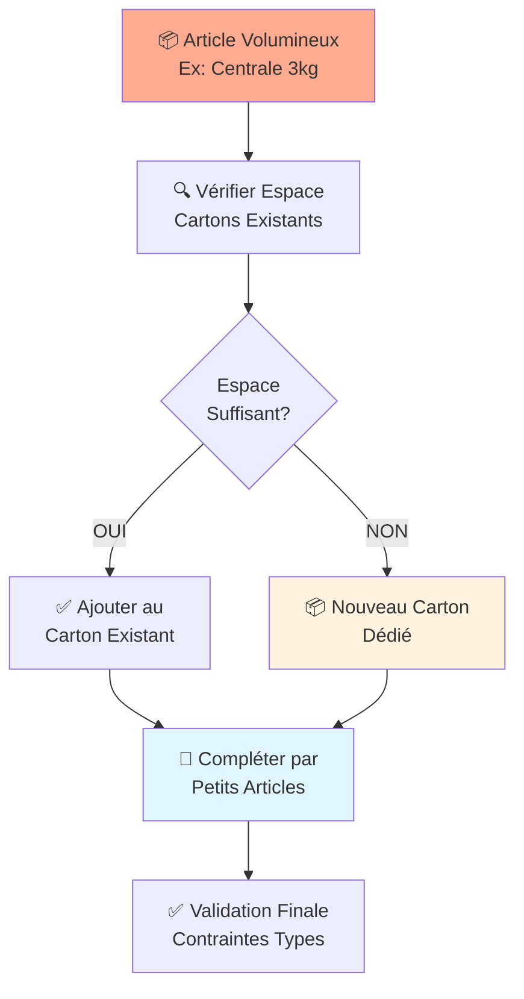
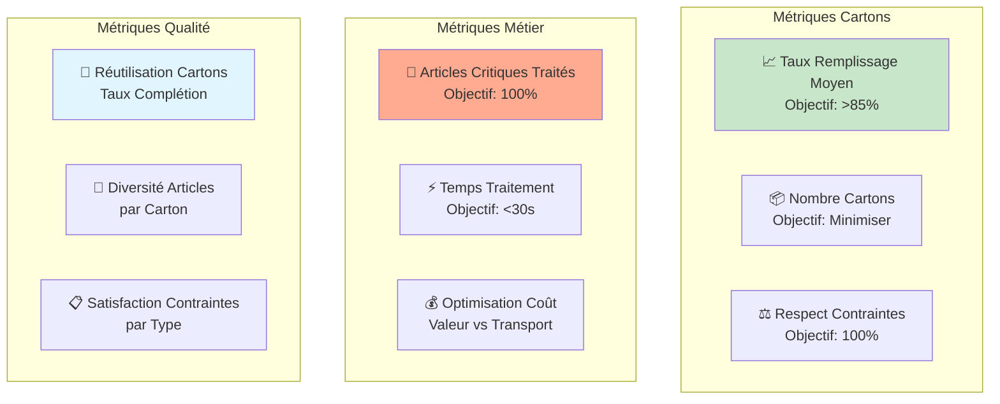

# Algorithme Knapsack Modifié pour Réapprovisionnement par Criticité
## Version Séquencée avec Priorités et Optimisation par Cartons

---

## 🎯 **Vue d'Ensemble de l'Approche**

Cette approche utilise un **algorithme Knapsack modifié** qui traite les matériels par ordre de criticité décroissante, avec une stratégie de remplissage optimisé des cartons selon des contraintes physiques spécifiques par type d'article.

### **Principe Directeur**


---

## 📊 **Classification des Articles et Contraintes Cartons**

### **Catégories de Criticité**


### **Contraintes Physiques par Type d'Article**
```json
{
  "contraintes_carton": {
    "type_1_centrales": {"max_articles": 10, "poids_unitaire": 2.5, "volume_unitaire": 0.5},
    "type_2_claviers": {"max_articles": 15, "poids_unitaire": 0.8, "volume_unitaire": 0.3},
    "type_3_detecteurs": {"max_articles": 50, "poids_unitaire": 0.2, "volume_unitaire": 0.1},
    "type_4_cameras": {"max_articles": 8, "poids_unitaire": 3.0, "volume_unitaire": 0.8},
    "type_5_cables": {"max_articles": 100, "poids_unitaire": 0.1, "volume_unitaire": 0.05}
  },
  "limites_globales": {
    "poids_max_kg": 30.0,
    "volume_max_litres": 50.0
  }
}
```

---

## 🔄 **Algorithme Knapsack Séquencé Modifié**

### **Algorithme Principal**



### **Détail de l'Algorithme**

```
ALGORITHME KnapsackModifieParCriticite(liste_articles)
DÉBUT
    cartons ← []
    articles_traités ← []
    
    // === PHASE 1: CRITIQUES A/B - TRAITEMENT OBLIGATOIRE ===
    articles_critiques ← FiltrerParCriticite(liste_articles, ["CRIT_A", "CRIT_B"])
    
    POUR CHAQUE article DANS articles_critiques FAIRE
        cartons_necessaires ← CalculerCartonsNecessaires(article)
        POUR i ← 1 A cartons_necessaires FAIRE
            carton ← NouveauCarton()
            RemplirCartonMaximal(carton, article)
            cartons.ajouter(carton)
        FIN POUR
        articles_traités.ajouter(article)
    FIN POUR
    
    // === PHASE 2: URGENTS A - TRAITEMENT OBLIGATOIRE ===
    articles_urgents_a ← FiltrerParCriticite(liste_articles, ["URG_A"])
    SOUSTRACTION(articles_urgents_a, articles_traités)
    
    POUR CHAQUE article DANS articles_urgents_a FAIRE
        cartons_necessaires ← CalculerCartonsNecessaires(article)
        POUR i ← 1 A cartons_necessaires FAIRE
            carton ← NouveauCarton()
            RemplirCartonMaximal(carton, article)
            cartons.ajouter(carton)
        FIN POUR
        articles_traités.ajouter(article)
    FIN POUR
    
    // === PHASE 3: URGENTS B - COMPLÉTER CARTONS EXISTANTS ===
    articles_urgents_b ← FiltrerParCriticite(liste_articles, ["URG_B"])
    SOUSTRACTION(articles_urgents_b, articles_traités)
    
    SI articles_urgents_b.non_vide ALORS
        // Essayer de compléter les cartons existants
        POUR CHAQUE article DANS articles_urgents_b FAIRE
            carton_compatible ← TrouverCartonCompatible(cartons, article)
            SI carton_compatible ≠ null ALORS
                AjouterAuCarton(carton_compatible, article)
                articles_traités.ajouter(article)
            FIN SI
        FIN POUR
        
        // Créer nouveaux cartons pour articles restants si nécessaire
        articles_urgents_b_restants ← SOUSTRACTION(articles_urgents_b, articles_traités)
        SI articles_urgents_b_restants.non_vide ALORS
            POUR CHAQUE article DANS articles_urgents_b_restants FAIRE
                carton ← TrouverOuCreerCarton(cartons, article)
                AjouterAuCarton(carton, article)
                articles_traités.ajouter(article)
            FIN POUR
        FIN SI
    FIN SI
    
    // === PHASE 4: ARTICLES SAFE - REMPLISSAGE OPPORTUNISTE ===
    articles_safe ← FiltrerParCriticite(liste_articles, ["SAFE"])
    SOUSTRACTION(articles_safe, articles_traités)
    
    POUR CHAQUE carton DANS cartons FAIRE
        TANT QUE carton.a_espace_disponible FAIRE
            article_optimal ← ChoisirMeilleurArticle(articles_safe, carton)
            SI article_optimal ≠ null ALORS
                AjouterAuCarton(carton, article_optimal)
                articles_safe.retirer(article_optimal)
            SINON
                SORTIR // Plus d'articles compatibles
            FIN SI
        FIN TANT QUE
    FIN POUR
    
    // === PHASE 5: OPTIMISATION FINALE ===
    // Cas spécial: Si seuls des Urgents B, compléter par articles prioritaires
    SI SeulementUrgentsB(liste_articles) ALORS
        articles_complementaires ← IdentifierArticlesComplementaires()
        POUR CHAQUE carton DANS cartons FAIRE
            CompleterParPriorisation(carton, articles_complementaires)
        FIN POUR
    FIN SI
    
    // Validation finale
    POUR CHAQUE carton DANS cartons FAIRE
        ValiderContraintes(carton)
    FIN POUR
    
    RETOURNER cartons
FIN
```

---

## 📦 **Gestion des Cartons et Contraintes**

### **Structure d'un Carton**



### **Algorithme de Remplissage Optimal**



---

## 🎯 **Système de Priorisation pour Complétion**

### **Calcul du Score de Priorité**



### **Formule de Priorisation**

```
Score_Priorité = α × Ratio_Stock + β × Tendance_Usage + γ × Densité_Valeur + δ × Criticité_Métier

Où:
- Ratio_Stock = (Stock_Min + Stock_Max)/2 - Stock_Actuel) / Stock_Max
- Tendance_Usage = Usage_Récent / Usage_Moyen_Historique  
- Densité_Valeur = Valeur_Unitaire / Quantité_Unitaire
- Criticité_Métier ∈ {0.2, 0.5, 0.8, 1.0} selon impact métier

Coefficients suggérés: α=0.4, β=0.3, γ=0.2, δ=0.1
```

---

## 🔄 **Diagramme de Séquence Complet**



---

## ⚖️ **Gestion des Cas Particuliers**

### **Cas 1: Articles Volumineux (Centrales, Caméras)**



### **Cas 2: Uniquement Articles Urgents B**

```mermaid
flowchart TD
    ONLY_URG_B[🟡 Uniquement<br/>Urgents B] --> CREATE_BASE[📦 Créer Cartons<br/>Base Urgents B]
    
    CREATE_BASE --> REMAINING_SPACE[📏 Calculer Espace<br/>Restant]
    
    REMAINING_SPACE --> FIND_CANDIDATES[🔍 Identifier Candidats<br/>Stock < (Min+Max)/2]
    
    FIND_CANDIDATES --> PRIORITIZE[📊 Calculer Scores<br/>Priorisation]
    
    PRIORITIZE --> SELECT_BEST[🏆 Sélectionner<br/>Meilleurs Candidats]
    
    SELECT_BEST --> FILL_OPTIMAL[📦 Remplir jusqu'à<br/>Capacité Optimale]
    
    FILL_OPTIMAL --> TARGET_STOCK[🎯 Ajuster Stocks vers<br/>(Min+Max)/2]
    
    style ONLY_URG_B fill:#fff3e0
    style PRIORITIZE fill:#e1f5fe
    style TARGET_STOCK fill:#c8e6c9
```

---

## 📊 **Métriques et Optimisation**

### **Indicateurs de Performance**



### **Algorithme d'Évaluation de Performance**

```
FONCTION EvaluerPerformance(cartons_generes, articles_origine)
DÉBUT
    // Métriques de base
    nb_cartons ← cartons_generes.taille
    taux_remplissage_moyen ← CalculerTauxRemplissageMoyen(cartons_generes)
    
    // Respect des priorités
    articles_critiques_traités ← CompterArticlesCritiques(cartons_generes)
    pourcentage_critiques ← articles_critiques_traités / total_critiques × 100
    
    // Optimisation nombre d'articles
    articles_utilises ← SommeArticles(cartons_generes)
    articles_optimal_theorique ← ArticlesMinimalTheorique(articles_origine)
    efficacite_articles ← articles_optimal_theorique / articles_utilises × 100
    
    // Score global
    score_performance ← 
        pourcentage_critiques × 0.4 +
        taux_remplissage_moyen × 0.3 +
        efficacite_articles × 0.2 +
        (100 - nb_cartons_surplus) × 0.1
    
    RETOURNER {
        score: score_performance,
        nb_cartons: nb_cartons,
        taux_remplissage: taux_remplissage_moyen,
        critiques_ok: pourcentage_critiques,
        efficacite_articles: efficacite_articles
    }
FIN
```

---

## 🔧 **Configuration et Paramétrage**

### **Paramètres Configurables**

```json
{
  "knapsack_config": {
    "contraintes_globales": {
      "pas_limite_poids_volume": true
    },
    "contraintes_par_type": {
      "centrales": {"max_par_carton": 10},
      "claviers": {"max_par_carton": 15},
      "detecteurs": {"max_par_carton": 50},
      "cameras": {"max_par_carton": 8},
      "cables": {"max_par_carton": 100}
    },
    "priorites_completion": {
      "coefficient_ratio_stock": 0.4,
      "coefficient_tendance_usage": 0.3,
      "coefficient_densite_valeur": 0.2,
      "coefficient_criticite": 0.1,
      "seuil_selection_prioritaire": 0.6
    },
    "objectifs_performance": {
      "taux_remplissage_min": 0.75,
      "taux_remplissage_cible": 0.85,
      "temps_calcul_max_secondes": 30
    }
  }
}
```

---

## 🚀 **Algorithmes Détaillés de Support**

### **Fonction: Calculer Cartons Nécessaires**

```
FONCTION CalculerCartonsNecessaires(article)
DÉBUT
    quantite_totale ← article.quantite_besoin
    max_par_carton ← article.type.max_par_carton
    
    // Contrainte par nombre d'articles seulement
    cartons_necessaires ← PLAFOND(quantite_totale / max_par_carton)
    
    RETOURNER cartons_necessaires
FIN
```

### **Fonction: Trouver Carton Compatible**

```
FONCTION TrouverCartonCompatible(cartons_existants, article)
DÉBUT
    meilleur_carton ← null
    meilleur_score_remplissage ← 0
    
    POUR CHAQUE carton DANS cartons_existants FAIRE
        SI carton.peutAjouter(article) ALORS
            score_remplissage ← carton.calculerTauxRemplissageApresAjout(article)
            
            // Privilégier les cartons avec meilleur taux de remplissage
            SI score_remplissage > meilleur_score_remplissage ALORS
                meilleur_carton ← carton
                meilleur_score_remplissage ← score_remplissage
            FIN SI
        FIN SI
    FIN POUR
    
    RETOURNER meilleur_carton
FIN
```

### **Fonction: Identifier Articles Complémentaires**

```
FONCTION IdentifierArticlesComplementaires()
DÉBUT
    articles_candidats ← []
    tous_articles ← GetTousArticlesStock()
    
    POUR CHAQUE article DANS tous_articles FAIRE
        stock_actuel ← article.stock_actuel
        stock_min ← article.stock_minimum  
        stock_max ← article.stock_maximum
        stock_optimal ← (stock_min + stock_max) / 2
        
        // Sélectionner articles en-dessous du stock optimal
        SI stock_actuel < stock_optimal ALORS
            quantite_complementaire ← stock_optimal - stock_actuel
            score_priorite ← CalculerScorePriorite(article)
            
            articles_candidats.ajouter({
                article: article,
                quantite: quantite_complementaire,
                score: score_priorite
            })
        FIN SI
    FIN POUR
    
    // Trier par score décroissant
    TRIER articles_candidats PAR score DESCENDANT
    
    RETOURNER articles_candidats
FIN
```

### **Fonction: Compléter Par Priorisation**

```
FONCTION CompleterParPriorisation(carton, articles_complementaires)
DÉBUT
    POUR CHAQUE article_candidat DANS articles_complementaires FAIRE
        quantite_max_possible ← carton.calculerQuantiteMaxPossible(article_candidat.article)
        
        SI quantite_max_possible > 0 ALORS
            quantite_a_ajouter ← MIN(article_candidat.quantite, quantite_max_possible)
            
            SI carton.peutAjouter(article_candidat.article, quantite_a_ajouter) ALORS
                carton.ajouterArticle(article_candidat.article, quantite_a_ajouter)
                
                // Mettre à jour la quantité restante
                article_candidat.quantite ← article_candidat.quantite - quantite_a_ajouter
                
                // Arrêter si carton plein
                SI carton.estPlein() ALORS
                    SORTIR
                FIN SI
            FIN SI
        FIN SI
    FIN POUR
FIN
```

---

## 🎪 **Exemples d'Exécution**

### **Exemple 1: Articles Mixtes**

```
DONNÉES ENTRÉE:
- 5 Centrales CRITIQUES A
- 20 Détecteurs URGENTS B 
- 3 Caméras SAFE

EXÉCUTION:
Phase 1: Centrales → 1 carton dédié (5 centrales max 10/carton)
Phase 2: Détecteurs → Compléter carton centrales (20 détecteurs max 50/carton)
Phase 2: Caméras → Compléter si possible (3 caméras max 8/carton)

RÉSULTAT:
Carton 1: 5 centrales + 20 détecteurs + 3 caméras ✅
```

### **Exemple 2: Uniquement Urgents B**

```
DONNÉES ENTRÉE:
- 30 Claviers URGENTS B

EXÉCUTION:
Phase 2: Créer cartons urgents B → 2 cartons (15 claviers/carton max)
Phase 3: Compléter par articles prioritaires

Articles complémentaires identifiés:
- Câbles RJ45: stock=10, optimal=25 → +15 câbles
- Détecteurs: stock=30, optimal=45 → +15 détecteurs

RÉSULTAT:
Carton 1: 15 claviers + 50 câbles + 15 détecteurs ✅
Carton 2: 15 claviers + compléments ✅
```

---

## 🔍 **Optimisations Avancées**

### **Optimisation Génétique pour Cas Complexes**

```
ALGORITHME OptimisationGenetique(articles, nb_generations = 100)
DÉBUT
    population ← GenererPopulationInitiale(articles, taille = 50)
    
    POUR generation ← 1 A nb_generations FAIRE
        // Évaluation fitness
        POUR CHAQUE individu DANS population FAIRE
            individu.fitness ← EvaluerSolution(individu)
        FIN POUR
        
        // Sélection des parents
        parents ← SelectionTournoi(population, taux = 0.7)
        
        // Croisement et mutation
        enfants ← []
        POUR i ← 1 A taille_population / 2 FAIRE
            parent1, parent2 ← ChoisirParents(parents)
            enfant1, enfant2 ← Croisement(parent1, parent2)
            Mutation(enfant1, taux = 0.1)
            Mutation(enfant2, taux = 0.1)
            enfants.ajouter(enfant1, enfant2)
        FIN POUR
        
        // Remplacement élitiste
        population ← RemplacementElitiste(population, enfants)
    FIN POUR
    
    RETOURNER MeilleurIndividu(population)
FIN
```

Cette approche **Knapsack modifiée** garantit le traitement prioritaire des articles critiques tout en optimisant l'utilisation de l'espace disponible et en permettant une complétion intelligente basée sur la priorité métier.
