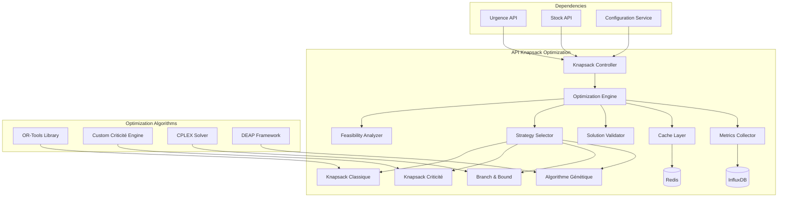

# API Knapsack Optimization - Documentation

## Vue d'ensemble

L'API Knapsack Optimization implémente des algorithmes d'optimisation avec contraintes de criticité pour la sélection optimale de matériels selon leurs priorités opérationnelles.

**Base URL**: `https://api.knapsack-optimization.com/v1`

**Authentication**: Bearer Token

---

## Architecture de l'API Knapsack



---

## 1. API Analyse de Faisabilité

### Endpoint: Analyse de Faisabilité Multi-Scénarios

```http
POST /knapsack/feasibility/analyze
Content-Type: application/json
Authorization: Bearer {token}
```

#### Request Body

```json
{
  "materiels_classifies": [
    {
      "article_id": "ART-001",
      "grade": "CRITIQUE_A",
      "valeur": 100,
      "poids": 8,
      "importance": 50,
      "urgence_max": 300
    }
  ],
  "contraintes": {
    "capacite_totale": 120,
    "capacite_par_type": {
      "FIBRE": 50,
      "CUIVRE": 40,
      "ACCESSOIRE": 30
    },
    "contraintes_metier": {
      "max_articles_par_fournisseur": 20,
      "diversification_obligatoire": true
    }
  },
  "scenarios": {
    "generate_scenarios": true,
    "scenario_types": ["MINIMAL", "STANDARD", "COMPLET", "OPTIMAL"]
  }
}
```

#### Response 200 OK

```json
{
  "status": "success",
  "execution_time_ms": 350,
  "data": {
    "feasibility_id": "feas_20240115_001",
    "analysis_date": "2024-01-15T10:00:00Z",
    "materiels_analysis": {
      "total_materiels": 150,
      "obligatoires": {
        "CRITIQUE_A": 23,
        "CRITIQUE_B": 34,
        "URGENT_A": 45,
        "total": 102
      },
      "optionnels": {
        "URGENT_B": 28,
        "SAFE": 20,
        "total": 48
      }
    },
    "scenarios_feasibility": {
      "MINIMAL": {
        "materiels": ["CRITIQUE_A"],
        "count": 23,
        "poids_total": 184,
        "valeur_totale": 125000.50,
        "faisable": false,
        "deficit_capacite": 64,
        "taux_faisabilite": 0.65
      },
      "STANDARD": {
        "materiels": ["CRITIQUE_A", "CRITIQUE_B"],
        "count": 57,
        "poids_total": 456,
        "valeur_totale": 287500.75,
        "faisable": false,
        "deficit_capacite": 336,
        "taux_faisabilite": 0.26
      },
      "OPTIMAL_FEASIBLE": {
        "materiels_includes": ["CRITIQUE_A", "Partial CRITIQUE_B"],
        "count": 35,
        "poids_total": 118,
        "valeur_totale": 198750.25,
        "faisable": true,
        "marge_capacite": 2,
        "efficacite": 0.94
      }
    },
    "recommendations": {
      "scenario_recommande": "OPTIMAL_FEASIBLE",
      "strategie_resolution": "AJUSTEMENT_AUTOMATIQUE",
      "algorithme_suggere": "KNAPSACK_CRITICITE_HYBRIDE"
    }
  }
}
```

### Endpoint: Analyse de Contraintes Croisées

```http
POST /knapsack/feasibility/constraints-analysis
Content-Type: application/json
Authorization: Bearer {token}
```

#### Request Body

```json
{
  "materiels": [/* materiels data */],
  "contraintes_complexes": {
    "dependencies": [
      {
        "article_principal": "ART-001",
        "articles_requis": ["ART-002", "ART-003"],
        "type": "MANDATORY"
      }
    ],
    "exclusions": [
      {
        "article_a": "ART-045",
        "article_b": "ART-046",
        "raison": "INCOMPATIBLE_TECHNOLOGY"
      }
    ],
    "groupes_contraintes": [
      {
        "groupe_id": "FIBRE_BUNDLE",
        "articles": ["ART-100", "ART-101", "ART-102"],
        "contrainte": "MIN_2_MAX_4"
      }
    ]
  }
}
```

#### Response 200 OK

```json
{
  "status": "success",
  "data": {
    "constraints_analysis_id": "const_20240115_001",
    "contraintes_validees": {
      "dependencies_count": 15,
      "exclusions_count": 8,
      "groupes_count": 5
    },
    "conflicts_detected": [
      {
        "type": "DEPENDENCY_CONFLICT",
        "description": "ART-001 (CRITIQUE_A) requis mais ART-002 (dépendance) non faisable",
        "impact": "HIGH",
        "resolution_options": [
          "Forcer inclusion ART-002",
          "Exclure ART-001",
          "Trouver alternative ART-002"
        ]
      }
    ],
    "complexity_score": 7.5,
    "resolution_strategy": "CONSTRAINT_SATISFACTION_PROBLEM"
  }
}
```

---

## 2. API Résolution Knapsack avec Criticité

### Endpoint: Optimisation Principale

```http
POST /knapsack/optimize
Content-Type: application/json
Authorization: Bearer {token}
```

#### Request Body

```json
{
  "materiels_classifies": [
    {
      "article_id": "ART-001",
      "grade": "CRITIQUE_A",
      "valeur": 100,
      "poids": 8,
      "importance": 50,
      "urgence_max": 300,
      "metadata": {
        "fournisseur": "SUPPLIER-001",
        "delai_livraison": 5,
        "stock_actuel": 15
      }
    }
  ],
  "contraintes": {
    "capacite": 120,
    "contraintes_types": {
      "FIBRE": 50,
      "CUIVRE": 40
    }
  },
  "algorithme_config": {
    "strategie": "AUTO",
    "timeout_ms": 30000,
    "precision_requise": 0.95,
    "priorite_criticite": true
  },
  "options_avancees": {
    "ajustement_automatique": true,
    "validation_double": true,
    "generation_alternatives": true,
    "cache_solutions": true
  }
}
```

#### Response 200 OK

```json
{
  "status": "success",
  "execution_time_ms": 2840,
  "data": {
    "optimization_id": "opt_20240115_001",
    "solution_principale": {
      "materiels_selectionnes": [
        {
          "article_id": "ART-001",
          "grade": "CRITIQUE_A",
          "valeur": 100,
          "poids": 8,
          "raison_inclusion": "OBLIGATOIRE_CRITIQUE",
          "rang_priorite": 1
        },
        {
          "article_id": "ART-045",
          "grade": "URGENT_B",
          "valeur": 85,
          "poids": 6,
          "raison_inclusion": "OPTIMISATION_KNAPSACK",
          "rang_priorite": 15
        }
      ],
      "materiels_exclus": [
        {
          "article_id": "ART-089",
          "grade": "URGENT_A",
          "raison_exclusion": "CAPACITE_INSUFFISANTE",
          "impact_exclusion": "MEDIUM"
        }
      ]
    },
    "metriques_solution": {
      "nombre_materiels": 45,
      "poids_total": 118,
      "valeur_totale": 287500.75,
      "capacite_utilisee": 0.98,
      "taux_materiels_critiques": 1.0,
      "taux_materiels_urgents_a": 0.87,
      "efficacite_globale": 0.94
    },
    "algorithme_utilise": {
      "nom": "KNAPSACK_CRITICITE_HYBRIDE",
      "phases_executees": [
        "SEPARATION_CRITICITE",
        "VERIFICATION_FAISABILITE",
        "AJUSTEMENT_AUTOMATIQUE",
        "OPTIMISATION_OPTIONNELS"
      ],
      "performance": {
        "iterations": 1247,
        "convergence_time_ms": 2840,
        "memory_peak_mb": 45.2
      }
    },
    "alternatives_generees": [
      {
        "alternative_id": "alt_001",
        "description": "Maximisation valeur avec 95% critiques",
        "valeur_totale": 295000.00,
        "taux_critiques": 0.95,
        "trade_off": "Sacrifice 2 URGENT_A pour optimiser valeur"
      }
    ]
  }
}
```

### Endpoint: Résolution avec Ajustement Automatique

```http
POST /knapsack/optimize/auto-adjust
Content-Type: application/json
Authorization: Bearer {token}
```

#### Request Body

```json
{
  "materiels_classifies": [/* materiels data */],
  "contraintes": {/* contraintes */},
  "ajustement_config": {
    "strategie_exclusion": "PRIORITY_BASED",
    "ordre_suppression": ["URGENT_A", "CRITIQUE_B", "CRITIQUE_A"],
    "preservation_minimale": {
      "CRITIQUE_A": 0.9,
      "CRITIQUE_B": 0.7
    },
    "iteration_max": 100
  }
}
```

#### Response 200 OK

```json
{
  "status": "success",
  "execution_time_ms": 1950,
  "data": {
    "ajustement_id": "adjust_20240115_001",
    "iterations_executees": 7,
    "ajustements_realises": [
      {
        "iteration": 1,
        "action": "SUPPRESSION",
        "article_supprime": "ART-125",
        "grade": "URGENT_A",
        "raison": "Poids élevé, faible valeur relative",
        "gain_capacite": 12
      },
      {
        "iteration": 4,
        "action": "SUPPRESSION",
        "article_supprime": "ART-067",
        "grade": "CRITIQUE_B",
        "raison": "Optimisation finale",
        "gain_capacite": 5
      }
    ],
    "solution_finale": {
      "faisabilite_atteinte": true,
      "materiels_preserves": {
        "CRITIQUE_A": {"count": 23, "taux_preservation": 1.0},
        "CRITIQUE_B": {"count": 25, "taux_preservation": 0.74},
        "URGENT_A": {"count": 38, "taux_preservation": 0.84}
      },
      "impact_ajustements": {
        "valeur_perdue": 45000.50,
        "pourcentage_impact": 0.13,
        "criticite_preservee": 0.91
      }
    }
  }
}
```

---

## 3. API Algorithmes Spécialisés

### Endpoint: Branch & Bound (Solution Exacte)

```http
POST /knapsack/algorithms/branch-bound
Content-Type: application/json
Authorization: Bearer {token}
```

#### Request Body

```json
{
  "materiels": [/* materiels data */],
  "contraintes": {/* contraintes */},
  "bb_config": {
    "strategie_branching": "BEST_FIRST",
    "bound_type": "LINEAR_RELAXATION",
    "pruning_agressif": true,
    "timeout_ms": 60000,
    "gap_tolerance": 0.01
  }
}
```

#### Response 200 OK

```json
{
  "status": "success",
  "execution_time_ms": 15420,
  "data": {
    "bb_solution_id": "bb_20240115_001",
    "solution_exacte": true,
    "valeur_optimale": 287500.75,
    "gap_final": 0.0,
    "statistiques_bb": {
      "noeuds_explores": 15847,
      "noeuds_elagués": 12456,
      "profondeur_max": 45,
      "bound_iterations": 2547
    },
    "solution_detaillee": {
      "materiels_selectionnes": [/* solution complète */],
      "preuve_optimalite": true,
      "alternatives_optimales": 0
    }
  }
}
```

### Endpoint: Algorithme Génétique (Optimisation Multi-Objectifs)

```http
POST /knapsack/algorithms/genetic
Content-Type: application/json
Authorization: Bearer {token}
```

#### Request Body

```json
{
  "materiels": [/* materiels data */],
  "contraintes": {/* contraintes */},
  "objectifs": [
    {
      "nom": "MAXIMISER_VALEUR",
      "poids": 0.4
    },
    {
      "nom": "MAXIMISER_CRITICITE",
      "poids": 0.6
    }
  ],
  "genetic_config": {
    "population_size": 200,
    "generations": 1000,
    "mutation_rate": 0.1,
    "crossover_rate": 0.8,
    "selection_strategy": "TOURNAMENT"
  }
}
```

#### Response 200 OK

```json
{
  "status": "success",
  "execution_time_ms": 45000,
  "data": {
    "genetic_solution_id": "gen_20240115_001",
    "solutions_pareto": [
      {
        "solution_id": "pareto_001",
        "valeur": 285000.00,
        "score_criticite": 0.98,
        "fitness": 0.94,
        "materiels_count": 47
      },
      {
        "solution_id": "pareto_002", 
        "valeur": 290000.00,
        "score_criticite": 0.92,
        "fitness": 0.93,
        "materiels_count": 43
      }
    ],
    "evolution_stats": {
      "generation_convergence": 847,
      "best_fitness_evolution": [0.45, 0.67, 0.89, 0.94],
      "diversite_finale": 0.23
    },
    "solution_recommandee": "pareto_001"
  }
}
```

---

## 4. API Validation et Vérification

### Endpoint: Validation Solution Complète

```http
POST /knapsack/validation/comprehensive
Content-Type: application/json
Authorization: Bearer {token}
```

#### Request Body

```json
{
  "solution_id": "opt_20240115_001",
  "validation_config": {
    "verify_constraints": true,
    "verify_criticality_respect": true,
    "verify_optimality": true,
    "generate_improvement_suggestions": true
  }
}
```

#### Response 200 OK

```json
{
  "status": "success",
  "execution_time_ms": 450,
  "data": {
    "validation_id": "valid_20240115_001",
    "validation_result": "PASSED_WITH_WARNINGS",
    "checks_performed": [
      {
        "check_name": "constraint_satisfaction",
        "status": "PASSED",
        "details": {
          "capacite_respectee": true,
          "contraintes_types_respectees": true,
          "dependencies_satisfaites": true
        }
      },
      {
        "check_name": "criticality_preservation",
        "status": "PASSED",
        "details": {
          "critique_a_inclusion": 1.0,
          "critique_b_inclusion": 0.74,
          "urgent_a_inclusion": 0.84
        }
      },
      {
        "check_name": "optimality_verification",
        "status": "WARNING",
        "details": {
          "gap_estimated": 0.03,
          "possible_improvements": [
            {
              "description": "Remplacer ART-156 par ART-189 (+2% valeur)",
              "impact": "FAIBLE"
            }
          ]
        }
      }
    ],
    "quality_metrics": {
      "solution_score": 0.94,
      "robustesse": 0.87,
      "adaptabilite": 0.92
    },
    "improvement_suggestions": [
      {
        "type": "SUBSTITUTION",
        "description": "3 améliorations mineures possibles",
        "gain_potentiel": 0.02
      }
    ]
  }
}
```

### Endpoint: Test de Sensibilité

```http
POST /knapsack/validation/sensitivity-analysis
Content-Type: application/json
Authorization: Bearer {token}
```

#### Request Body

```json
{
  "solution_id": "opt_20240115_001",
  "sensitivity_config": {
    "vary_capacity": {"min": 0.8, "max": 1.2, "steps": 10},
    "vary_values": {"perturbation": 0.1},
    "vary_weights": {"perturbation": 0.1}
  }
}
```

#### Response 200 OK

```json
{
  "status": "success",
  "data": {
    "sensitivity_id": "sens_20240115_001",
    "capacity_sensitivity": {
      "stable_range": {"min": 0.95, "max": 1.05},
      "critical_threshold": 0.92,
      "breakdown_point": 0.85
    },
    "value_sensitivity": {
      "solution_stability": 0.89,
      "articles_critiques_changes": 2,
      "robustness_score": 0.91
    },
    "recommendations": {
      "solution_robuste": true,
      "precautions": ["Surveiller capacité si < 110"],
      "alternatives_backup": ["alt_001", "alt_003"]
    }
  }
}
```

---

## 5. API Comparaisons et Benchmarking

### Endpoint: Comparaison Algorithmes

```http
POST /knapsack/benchmark/algorithms-comparison
Content-Type: application/json
Authorization: Bearer {token}
```

#### Request Body

```json
{
  "materiels": [/* materiels data */],
  "contraintes": {/* contraintes */},
  "algorithmes_a_comparer": [
    "KNAPSACK_CLASSIQUE",
    "KNAPSACK_CRITICITE",
    "BRANCH_BOUND",
    "GENETIC_ALGORITHM"
  ],
  "benchmark_config": {
    "iterations": 10,
    "timeout_per_algorithm": 30000,
    "measure_quality": true,
    "measure_performance": true
  }
}
```

#### Response 200 OK

```json
{
  "status": "success",
  "execution_time_ms": 125000,
  "data": {
    "benchmark_id": "bench_20240115_001",
    "results_comparison": {
      "KNAPSACK_CLASSIQUE": {
        "valeur_moyenne": 295000.00,
        "temps_moyen_ms": 450,
        "taux_critiques_preserves": 0.45,
        "stabilite": 0.98,
        "rank_valeur": 1,
        "rank_criticite": 4
      },
      "KNAPSACK_CRITICITE": {
        "valeur_moyenne": 287500.00,
        "temps_moyen_ms": 2840,
        "taux_critiques_preserves": 1.0,
        "stabilite": 0.95,
        "rank_valeur": 3,
        "rank_criticite": 1
      },
      "BRANCH_BOUND": {
        "valeur_moyenne": 295000.00,
        "temps_moyen_ms": 15420,
        "taux_critiques_preserves": 0.67,
        "stabilite": 1.0,
        "rank_valeur": 1,
        "rank_criticite": 3
      },
      "GENETIC_ALGORITHM": {
        "valeur_moyenne": 289750.00,
        "temps_moyen_ms": 45000,
        "taux_critiques_preserves": 0.92,
        "stabilite": 0.87,
        "rank_valeur": 2,
        "rank_criticite": 2
      }
    },
    "recommendation": {
      "contexte_production": "KNAPSACK_CRITICITE",
      "contexte_recherche": "BRANCH_BOUND",
      "contexte_temps_reel": "KNAPSACK_CLASSIQUE",
      "contexte_multi_objectifs": "GENETIC_ALGORITHM"
    }
  }
}
```

### Endpoint: Analyse ROI Solutions

```http
POST /knapsack/analysis/roi-analysis
Content-Type: application/json
Authorization: Bearer {token}
```

#### Request Body

```json
{
  "solutions": [
    {"solution_id": "opt_20240115_001"},
    {"solution_id": "opt_20240115_002"}
  ],
  "roi_config": {
    "horizon_analyse_days": 365,
    "cout_rupture_par_jour": 5000,
    "cout_stockage_par_unite": 2.5,
    "taux_actualisation": 0.05
  }
}
```

#### Response 200 OK

```json
{
  "status": "success",
  "data": {
    "roi_analysis_id": "roi_20240115_001",
    "solutions_analysis": {
      "opt_20240115_001": {
        "investissement_initial": 287500.75,
        "cout_stockage_annuel": 15000.00,
        "economies_rupture_prevues": 450000.00,
        "roi_1_an": 1.56,
        "payback_period_days": 234,
        "npv": 145000.00
      }
    },
    "comparaison": {
      "meilleure_solution": "opt_20240115_001",
      "avantage_roi": 0.23,
      "analyse_risque": "FAIBLE"
    }
  }
}
```

---

## 6. API Configuration et Paramétrage

### Endpoint: Configuration Algorithmes

```http
POST /knapsack/config/algorithms
Content-Type: application/json
Authorization: Bearer {token}
```

#### Request Body

```json
{
  "config_name": "PRODUCTION_STANDARD",
  "algorithme_configs": {
    "KNAPSACK_CRITICITE": {
      "ajustement_automatique": true,
      "preservation_minimale": {
        "CRITIQUE_A": 1.0,
        "CRITIQUE_B": 0.8,
        "URGENT_A": 0.7
      },
      "timeout_ms": 30000
    },
    "BRANCH_BOUND": {
      "gap_tolerance": 0.01,
      "timeout_ms": 60000,
      "pruning_strategy": "AGGRESSIVE"
    }
  },
  "selection_rules": {
    "capacity_threshold_bb": 0.3,
    "complexity_threshold_genetic": 1000
  }
}
```

#### Response 200 OK

```json
{
  "status": "success",
  "data": {
    "config_id": "config_20240115_001",
    "config_name": "PRODUCTION_STANDARD",
    "validation_result": "PASSED",
    "active": true,
    "estimated_performance": {
      "avg_execution_time_ms": 3500,
      "success_rate": 0.98,
      "quality_score": 0.94
    }
  }
}
```

---

## 7. Webhooks et Intégrations

### Configuration Webhooks Optimisation

```http
POST /knapsack/webhooks/configure
Content-Type: application/json
Authorization: Bearer {token}
```

#### Request Body

```json
{
  "webhook_url": "https://your-system.com/knapsack-webhook",
  "events": [
    "OPTIMIZATION_COMPLETED",
    "INFEASIBLE_SOLUTION",
    "ALGORITHM_TIMEOUT",
    "QUALITY_DEGRADATION"
  ],
  "filters": {
    "min_execution_time_ms": 5000,
    "include_alternatives": true
  }
}
```

### Format Notification Optimisation

```json
{
  "event_type": "OPTIMIZATION_COMPLETED",
  "timestamp": "2024-01-15T10:30:00Z",
  "data": {
    "optimization_id": "opt_20240115_001",
    "algorithm_used": "KNAPSACK_CRITICITE_HYBRIDE",
    "execution_time_ms": 2840,
    "solution_quality": {
      "valeur_totale": 287500.75,
      "taux_critiques": 1.0,
      "efficacite": 0.94
    },
    "materiels_critiques_exclus": 0,
    "alternatives_generated": 3
  }
}
```

---

## 8. Exemples d'Intégration Complète

### Python - Workflow Optimisation Complète

```python
import asyncio
from knapsack_api_client import KnapsackAPIClient

client = KnapsackAPIClient(
    base_url="https://api.knapsack-optimization.com/v1",
    token="your-bearer-token"
)

async def optimize_with_criticality(materiels_classifies, contraintes):
    try:
        # 1. Analyse de faisabilité
        feasibility = await client.knapsack.analyze_feasibility(
            materiels_classifies=materiels_classifies,
            contraintes=contraintes,
            scenarios={"generate_scenarios": True}
        )
        
        # 2. Sélection stratégie basée sur faisabilité
        if feasibility["data"]["scenarios_feasibility"]["STANDARD"]["faisable"]:
            strategy = "KNAPSACK_CRITICITE"
        else:
            strategy = "AUTO_ADJUST"
            
        # 3. Optimisation principale
        optimization = await client.knapsack.optimize(
            materiels_classifies=materiels_classifies,
            contraintes=contraintes,
            algorithme_config={
                "strategie": strategy,
                "priorite_criticite": True
            }
        )
        
        # 4. Validation solution
        validation = await client.knapsack.validate_comprehensive(
            solution_id=optimization["data"]["optimization_id"]
        )
        
        # 5. Génération alternatives si nécessaire
        if validation["data"]["validation_result"] != "PASSED":
            alternatives = await client.knapsack.generate_alternatives(
                base_solution_id=optimization["data"]["optimization_id"],
                improvement_focus="QUALITY"
            )
            
        return optimization["data"]
        
    except Exception as e:
        logger.error(f"Erreur optimisation knapsack: {e}")
        raise
```

### JavaScript - Intégration Temps Réel

```javascript
const KnapsackAPI = require('@company/knapsack-api-client');

class KnapsackOrchestrator {
    constructor() {
        this.client = new KnapsackAPI({
            baseURL: 'https://api.knapsack-optimization.com/v1',
            token: process.env.KNAPSACK_API_TOKEN
        });
    }

    async optimizeWithConstraints(materiels, contraintes, options = {}) {
        const startTime = Date.now();
        
        try {
            // Configuration adaptative selon taille problème
            const complexity = this.assessComplexity(materiels, contraintes);
            const algorithmConfig = this.selectAlgorithmConfig(complexity, options);
            
            // Optimisation avec monitoring
            const optimization = await this.client.knapsack.optimize({
                materiels_classifies: materiels,
                contraintes: contraintes,
                algorithme_config: algorithmConfig,
                options_avancees: {
                    ajustement_automatique: true,
                    validation_double: true,
                    cache_solutions: true
                }
            });
            
            // Validation et métriques
            const executionTime = Date.now() - startTime;
            await this.logPerformanceMetrics(optimization, executionTime);
            
            return optimization.data;
            
        } catch (error) {
            console.error('Erreur optimisation:', error);
            throw error;
        }
    }
    
    selectAlgorithmConfig(complexity, options) {
        if (complexity.score < 100) return { strategie: "KNAPSACK_CLASSIQUE" };
        if (complexity.constraints > 10) return { strategie: "GENETIC_ALGORITHM" };
        if (options.exact_solution) return { strategie: "BRANCH_BOUND" };
        return { strategie: "KNAPSACK_CRITICITE_HYBRIDE" };
    }
}
```

---

Cette API Knapsack fournit une solution complète d'optimisation avec contraintes de criticité, algorithmes multiples et validation avancée pour des solutions robustes et optimales.