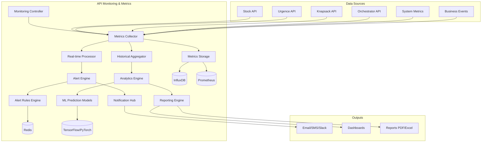

# API Monitoring & Metrics - Documentation

## Vue d'ensemble

L'API Monitoring & Metrics fournit une observabilité complète du système avec métriques temps réel, alertes intelligentes, et analyses de performance pour l'ensemble des modules Stock, Urgence, Knapsack et Orchestrator.

**Base URL**: `https://api.monitoring.com/v1`

**Authentication**: Bearer Token

---

## Architecture de l'API Monitoring



---

## 1. API Métriques Temps Réel

### Endpoint: Métriques Live Dashboard

```http
GET /monitoring/metrics/real-time
Authorization: Bearer {token}
```

#### Query Parameters

| Paramètre | Type | Description |
|-----------|------|-------------|
| `services` | string | Services à monitorer (stock,urgence,knapsack,orchestrator) |
| `metrics_types` | string | Types métriques (performance,business,system) |
| `refresh_rate` | integer | Taux rafraîchissement en secondes (1-60) |

#### Response 200 OK (Server-Sent Events)

```json
{
  "event": "metrics_update",
  "timestamp": "2024-01-15T10:05:30Z",
  "data": {
    "system_overview": {
      "global_health_score": 0.94,
      "active_pipelines": 15,
      "total_requests_per_minute": 247,
      "average_response_time_ms": 1850,
      "error_rate": 0.02
    },
    "service_metrics": {
      "STOCK_API": {
        "health_status": "HEALTHY",
        "requests_per_minute": 89,
        "avg_response_time_ms": 245,
        "success_rate": 0.99,
        "active_calculations": 12,
        "cache_hit_rate": 0.67,
        "peak_memory_mb": 156.8
      },
      "URGENCE_API": {
        "health_status": "HEALTHY", 
        "requests_per_minute": 67,
        "avg_response_time_ms": 180,
        "success_rate": 0.98,
        "parallel_efficiency": 0.87,
        "critique_alerts_active": 5,
        "classification_accuracy": 0.94
      },
      "KNAPSACK_API": {
        "health_status": "DEGRADED",
        "requests_per_minute": 23,
        "avg_response_time_ms": 4200,
        "success_rate": 0.95,
        "optimization_queue_length": 7,
        "avg_iterations": 1456,
        "solution_quality_score": 0.92
      },
      "ORCHESTRATOR_API": {
        "health_status": "HEALTHY",
        "active_workflows": 8,
        "pending_executions": 3,
        "completion_rate": 0.96,
        "avg_pipeline_duration_ms": 285000,
        "recovery_success_rate": 0.89
      }
    },
    "business_metrics": {
      "daily_articles_processed": 2456,
      "critique_materials_detected": 145,
      "optimizations_completed": 67,
      "estimated_cost_savings": 89500.50,
      "risk_mitigation_score": 0.91
    },
    "infrastructure_metrics": {
      "total_cpu_usage": 0.68,
      "total_memory_usage_gb": 45.2,
      "database_connections": 234,
      "message_queue_size": 12,
      "cache_cluster_status": "HEALTHY"
    }
  }
}
```

### Endpoint: Métriques Détaillées par Service

```http
GET /monitoring/metrics/service/{service_name}/detailed
Authorization: Bearer {token}
```

#### Response 200 OK

```json
{
  "status": "success",
  "data": {
    "service_name": "KNAPSACK_API",
    "collection_time": "2024-01-15T10:05:30Z",
    "performance_metrics": {
      "response_times": {
        "p50": 2800,
        "p95": 8500,
        "p99": 15200,
        "max": 28500
      },
      "throughput": {
        "requests_per_second": 0.38,
        "successful_optimizations_per_minute": 1.2,
        "failed_optimizations_per_minute": 0.06
      },
      "resource_usage": {
        "cpu_cores_used": 6.8,
        "memory_usage_mb": 1245.6,
        "disk_io_mb_per_sec": 15.2,
        "network_io_mb_per_sec": 8.7
      }
    },
    "algorithm_metrics": {
      "KNAPSACK_CRITICITE": {
        "usage_percentage": 0.65,
        "avg_execution_time_ms": 2840,
        "avg_iterations": 1247,
        "convergence_rate": 0.94,
        "solution_quality": 0.92
      },
      "BRANCH_BOUND": {
        "usage_percentage": 0.20,
        "avg_execution_time_ms": 15420,
        "avg_nodes_explored": 15847,
        "pruning_efficiency": 0.78,
        "optimality_proven": 0.98
      },
      "GENETIC_ALGORITHM": {
        "usage_percentage": 0.15,
        "avg_execution_time_ms": 45000,
        "avg_generations": 847,
        "pareto_solutions_found": 5.2,
        "diversity_score": 0.67
      }
    },
    "business_metrics": {
      "critical_materials_optimized": 234,
      "capacity_utilization": 0.94,
      "constraint_violation_rate": 0.02,
      "alternative_solutions_generated": 156
    }
  }
}
```

---

## 2. API Alertes Intelligentes

### Endpoint: Configuration Règles d'Alerte

```http
POST /monitoring/alerts/rules
Content-Type: application/json
Authorization: Bearer {token}
```

#### Request Body

```json
{
  "alert_rules": [
    {
      "rule_name": "HIGH_RESPONSE_TIME_KNAPSACK",
      "description": "Alerte si temps réponse Knapsack > 10s",
      "condition": {
        "metric": "knapsack_api.avg_response_time_ms",
        "operator": "GREATER_THAN",
        "threshold": 10000,
        "duration": "5m",
        "evaluation_interval": "1m"
      },
      "severity": "WARNING",
      "actions": [
        {
          "type": "WEBHOOK",
          "url": "https://your-system.com/alert-webhook",
          "template": "performance_degradation"
        },
        {
          "type": "AUTO_SCALE",
          "target": "KNAPSACK_SERVICE",
          "scale_factor": 1.5
        }
      ]
    },
    {
      "rule_name": "CRITICAL_MATERIALS_THRESHOLD",
      "description": "Alerte si >50 matériels CRITIQUE_A détectés",
      "condition": {
        "metric": "urgence_api.critique_a_count",
        "operator": "GREATER_THAN",
        "threshold": 50,
        "duration": "1m"
      },
      "severity": "CRITICAL",
      "actions": [
        {
          "type": "SMS",
          "recipients": ["+33123456789"],
          "message": "{{count}} matériels critiques détectés - Action immédiate requise"
        },
        {
          "type": "EMAIL",
          "recipients": ["procurement@company.com", "operations@company.com"],
          "template": "critical_materials_alert"
        },
        {
          "type": "ESCALATION",
          "escalation_chain": "CRITICAL_OPERATIONS",
          "timeout_minutes": 15
        }
      ]
    }
  ],
  "global_settings": {
    "default_evaluation_interval": "1m",
    "alert_grouping_window": "5m",
    "max_alerts_per_hour": 20,
    "auto_resolve_timeout": "24h"
  }
}
```

#### Response 201 Created

```json
{
  "status": "success",
  "data": {
    "rules_created": 2,
    "rule_ids": ["rule_001", "rule_002"],
    "validation_results": [
      {
        "rule_name": "HIGH_RESPONSE_TIME_KNAPSACK",
        "status": "VALID",
        "estimated_trigger_frequency": "LOW"
      },
      {
        "rule_name": "CRITICAL_MATERIALS_THRESHOLD",
        "status": "VALID",
        "estimated_trigger_frequency": "MEDIUM"
      }
    ],
    "active_from": "2024-01-15T10:05:30Z"
  }
}
```

### Endpoint: Alertes Actives

```http
GET /monitoring/alerts/active
Authorization: Bearer {token}
```

#### Query Parameters

| Paramètre | Type | Description |
|-----------|------|-------------|
| `severity` | string | Filtrer par sévérité (INFO,WARNING,CRITICAL) |
| `service` | string | Filtrer par service |
| `status` | string | Statut alerte (FIRING,PENDING,RESOLVED) |

#### Response 200 OK

```json
{
  "status": "success",
  "data": {
    "total_active_alerts": 7,
    "alerts_by_severity": {
      "CRITICAL": 2,
      "WARNING": 4,
      "INFO": 1
    },
    "active_alerts": [
      {
        "alert_id": "alert_20240115_001",
        "rule_name": "CRITICAL_MATERIALS_THRESHOLD",
        "severity": "CRITICAL",
        "status": "FIRING",
        "started_at": "2024-01-15T09:45:30Z",
        "last_fired": "2024-01-15T10:05:30Z",
        "fire_count": 4,
        "current_value": 67,
        "threshold": 50,
        "affected_services": ["URGENCE_API"],
        "description": "67 matériels CRITIQUE_A détectés",
        "actions_taken": [
          {
            "type": "SMS",
            "status": "SENT",
            "timestamp": "2024-01-15T09:45:35Z"
          },
          {
            "type": "ESCALATION",
            "status": "IN_PROGRESS", 
            "escalation_level": 2,
            "next_escalation": "2024-01-15T10:00:30Z"
          }
        ]
      },
      {
        "alert_id": "alert_20240115_002",
        "rule_name": "HIGH_RESPONSE_TIME_KNAPSACK",
        "severity": "WARNING",
        "status": "FIRING",
        "started_at": "2024-01-15T10:00:00Z",
        "current_value": 12500,
        "threshold": 10000,
        "trend": "INCREASING",
        "actions_taken": [
          {
            "type": "AUTO_SCALE",
            "status": "COMPLETED",
            "details": "Service scaled from 4 to 6 instances"
          }
        ]
      }
    ],
    "alert_trends": {
      "last_24h_total": 45,
      "resolved_automatically": 38,
      "escalated_to_human": 7
    }
  }
}
```

---

## 3. API Analytics et Prédictions

### Endpoint: Analyse Prédictive

```http
POST /monitoring/analytics/predictions
Content-Type: application/json
Authorization: Bearer {token}
```

#### Request Body

```json
{
  "prediction_config": {
    "metrics_to_predict": [
      "stock_api.projection_accuracy",
      "urgence_api.critique_materials_count",
      "knapsack_api.avg_response_time"
    ],
    "prediction_horizon_hours": 24,
    "confidence_level": 0.95,
    "include_seasonality": true,
    "external_factors": [
      {
        "factor": "business_day",
        "weight": 0.3
      },
      {
        "factor": "month_end_effect",
        "weight": 0.2
      }
    ]
  },
  "historical_window_days": 30,
  "model_config": {
    "algorithm": "PROPHET",
    "hyperparameters": {
      "changepoint_prior_scale": 0.05,
      "seasonality_prior_scale": 10.0
    }
  }
}
```

#### Response 200 OK

```json
{
  "status": "success",
  "execution_time_ms": 2500,
  "data": {
    "prediction_id": "pred_20240115_001",
    "model_performance": {
      "training_accuracy": 0.92,
      "validation_mape": 0.08,
      "model_confidence": 0.89
    },
    "predictions": {
      "stock_api.projection_accuracy": {
        "hourly_predictions": [
          {
            "hour": "2024-01-15T11:00:00Z",
            "predicted_value": 0.96,
            "confidence_interval": {"lower": 0.93, "upper": 0.98},
            "trend": "STABLE"
          },
          {
            "hour": "2024-01-15T15:00:00Z",
            "predicted_value": 0.94,
            "confidence_interval": {"lower": 0.91, "upper": 0.97},
            "trend": "SLIGHT_DECLINE"
          }
        ],
        "anomalies_predicted": [
          {
            "time": "2024-01-15T18:00:00Z",
            "type": "ACCURACY_DROP",
            "severity": "MEDIUM",
            "probability": 0.67
          }
        ]
      },
      "urgence_api.critique_materials_count": {
        "trend_analysis": {
          "overall_trend": "INCREASING",
          "rate_of_change": 2.3,
          "peak_expected": "2024-01-15T16:00:00Z",
          "peak_value": 89
        },
        "risk_assessment": {
          "probability_exceeds_100": 0.34,
          "time_to_critical_threshold": "6.5 hours"
        }
      }
    },
    "recommendations": [
      "Préparer capacité supplémentaire Knapsack vers 16h",
      "Anticiper pic matériels critiques - alerter équipe procurement",
      "Considérer pré-calcul cache pour réduire latence prédite"
    ]
  }
}
```

### Endpoint: Analyse de Corrélation

```http
POST /monitoring/analytics/correlation-analysis
Content-Type: application/json
Authorization: Bearer {token}
```

#### Request Body

```json
{
  "analysis_config": {
    "primary_metrics": [
      "orchestrator.pipeline_duration",
      "knapsack_api.avg_response_time",
      "business.cost_savings"
    ],
    "correlation_metrics": [
      "system.cpu_usage",
      "urgence_api.critique_count",
      "stock_api.projection_accuracy",
      "external.business_day_factor"
    ],
    "time_window_days": 14,
    "correlation_threshold": 0.3,
    "lag_analysis_hours": 6
  }
}
```

#### Response 200 OK

```json
{
  "status": "success",
  "data": {
    "correlation_analysis_id": "corr_20240115_001",
    "significant_correlations": [
      {
        "primary_metric": "orchestrator.pipeline_duration",
        "correlated_metric": "urgence_api.critique_count",
        "correlation_coefficient": 0.78,
        "p_value": 0.002,
        "relationship_type": "POSITIVE",
        "lag_hours": 0,
        "interpretation": "Plus de matériels critiques augmente la durée pipeline",
        "confidence": "HIGH"
      },
      {
        "primary_metric": "business.cost_savings",
        "correlated_metric": "knapsack_api.solution_quality",
        "correlation_coefficient": 0.85,
        "p_value": 0.001,
        "relationship_type": "POSITIVE",
        "lag_hours": 2,
        "interpretation": "Meilleure qualité optimisation = plus d'économies",
        "confidence": "VERY_HIGH"
      }
    ],
    "causality_analysis": {
      "granger_causality_results": [
        {
          "cause": "system.cpu_usage",
          "effect": "knapsack_api.avg_response_time",
          "causality_score": 0.67,
          "direction": "BIDIRECTIONAL",
          "optimal_lag": 3
        }
      ]
    },
    "business_insights": [
      "Investir dans CPU améliore directement performance Knapsack",
      "Surveiller urgence critique = prédicteur fiable durée pipeline",
      "Optimisation qualité solution = ROI 1.8x sur économies"
    ]
  }
}
```

---

## 4. API Reporting Avancé

### Endpoint: Génération Rapport Exécutif

```http
POST /monitoring/reports/executive-summary
Content-Type: application/json
Authorization: Bearer {token}
```

#### Request Body

```json
{
  "report_config": {
    "period": {
      "start_date": "2024-01-01",
      "end_date": "2024-01-15"
    },
    "include_sections": [
      "PERFORMANCE_OVERVIEW",
      "BUSINESS_METRICS",
      "COST_ANALYSIS",
      "RISK_ASSESSMENT",
      "RECOMMENDATIONS"
    ],
    "format": "PDF",
    "language": "FR",
    "confidentiality": "INTERNAL"
  },
  "customizations": {
    "company_branding": true,
    "executive_summary_pages": 2,
    "detailed_appendix": true,
    "charts_style": "PROFESSIONAL"
  }
}
```

#### Response 202 Accepted

```json
{
  "status": "accepted",
  "data": {
    "report_generation_id": "report_exec_20240115_001",
    "estimated_completion": "2024-01-15T10:08:00Z",
    "download_url": "/monitoring/reports/download/report_exec_20240115_001",
    "preview_url": "/monitoring/reports/preview/report_exec_20240115_001"
  }
}
```

### Endpoint: Rapport Performance Détaillé

```http
GET /monitoring/reports/performance/{period}
Authorization: Bearer {token}
```

#### Response 200 OK

```json
{
  "status": "success",
  "data": {
    "report_id": "perf_report_20240115_001",
    "period": {
      "start_date": "2024-01-08",
      "end_date": "2024-01-15", 
      "total_days": 7
    },
    "executive_summary": {
      "overall_health_score": 0.94,
      "performance_trend": "IMPROVING",
      "critical_issues_resolved": 12,
      "efficiency_gain_percentage": 8.5,
      "cost_optimization_achieved": 15000.50
    },
    "service_performance": {
      "STOCK_API": {
        "uptime_percentage": 99.7,
        "avg_response_time_ms": 245,
        "throughput_improvement": 0.12,
        "error_rate": 0.01,
        "performance_score": 0.96
      },
      "URGENCE_API": {
        "uptime_percentage": 99.5,
        "avg_response_time_ms": 180,
        "accuracy_score": 0.94,
        "parallel_efficiency": 0.87,
        "performance_score": 0.93
      },
      "KNAPSACK_API": {
        "uptime_percentage": 98.2,
        "avg_response_time_ms": 3200,
        "solution_quality": 0.92,
        "optimization_success_rate": 0.95,
        "performance_score": 0.89
      }
    },
    "business_impact": {
      "total_pipelines_executed": 156,
      "critical_materials_identified": 445,
      "optimizations_completed": 89,
      "estimated_cost_savings": 125000.75,
      "risk_incidents_prevented": 23,
      "business_value_score": 0.91
    },
    "key_achievements": [
      "Réduction 15% temps moyen pipeline",
      "Amélioration 12% précision prédictions stock",
      "Détection précoce 23 situations critiques",
      "Optimisation automatique économisant 125k€"
    ],
    "areas_for_improvement": [
      "Optimiser performance Knapsack pour réduire latence",
      "Augmenter fréquence monitoring matériels critiques",
      "Implémenter cache prédictif pour projections stock"
    ]
  }
}
```

---

## 5. API Monitoring Santé Système

### Endpoint: Health Check Complet

```http
GET /monitoring/health/comprehensive
Authorization: Bearer {token}
```

#### Response 200 OK

```json
{
  "status": "success",
  "data": {
    "overall_health": "HEALTHY",
    "health_score": 0.94,
    "last_updated": "2024-01-15T10:05:30Z",
    "system_components": {
      "apis": {
        "stock_api": {
          "status": "HEALTHY",
          "response_time_ms": 245,
          "last_successful_call": "2024-01-15T10:05:25Z",
          "error_rate_5min": 0.01
        },
        "urgence_api": {
          "status": "HEALTHY",
          "response_time_ms": 180,
          "parallel_workers_active": 4,
          "classification_accuracy": 0.94
        },
        "knapsack_api": {
          "status": "DEGRADED",
          "response_time_ms": 4200,
          "optimization_queue_length": 7,
          "solution_quality": 0.92,
          "issues": ["High response time", "Queue backlog"]
        },
        "orchestrator_api": {
          "status": "HEALTHY",
          "active_pipelines": 8,
          "success_rate_24h": 0.96
        }
      },
      "infrastructure": {
        "database_primary": {
          "status": "HEALTHY",
          "connections_active": 234,
          "connections_max": 1000,
          "replication_lag_ms": 15
        },
        "database_read_replica": {
          "status": "HEALTHY",
          "lag_behind_primary_ms": 25,
          "query_performance": 0.98
        },
        "cache_cluster": {
          "status": "HEALTHY",
          "hit_rate": 0.78,
          "memory_usage": 0.65,
          "evictions_per_hour": 23
        },
        "message_queue": {
          "status": "HEALTHY",
          "queue_depth": 12,
          "processing_rate_per_sec": 45,
          "dead_letter_queue_size": 0
        }
      },
      "external_dependencies": {
        "erp_system": {
          "status": "HEALTHY",
          "last_sync": "2024-01-15T10:00:00Z",
          "data_freshness_minutes": 5
        },
        "planning_system": {
          "status": "HEALTHY",
          "api_availability": 0.99,
          "data_quality_score": 0.96
        }
      }
    },
    "resource_utilization": {
      "cpu_usage_percent": 68,
      "memory_usage_percent": 72,
      "disk_usage_percent": 45,
      "network_io_mbps": 125.6
    },
    "performance_summary": {
      "avg_pipeline_duration_ms": 285000,
      "throughput_pipelines_per_hour": 67,
      "success_rate": 0.96,
      "sla_compliance": 0.98
    }
  }
}
```

### Endpoint: Diagnostic Système Approfondi

```http
POST /monitoring/diagnostics/deep-analysis
Content-Type: application/json
Authorization: Bearer {token}
```

#### Request Body

```json
{
  "diagnostic_scope": {
    "include_performance_profiling": true,
    "include_memory_analysis": true,
    "include_network_tracing": true,
    "include_database_analysis": true,
    "analysis_duration_minutes": 10
  },
  "focus_areas": [
    "KNAPSACK_PERFORMANCE",
    "DATABASE_OPTIMIZATION",
    "CACHE_EFFICIENCY"
  ]
}
```

#### Response 200 OK

```json
{
  "status": "success",
  "execution_time_ms": 8500,
  "data": {
    "diagnostic_id": "diag_20240115_001",
    "analysis_timestamp": "2024-01-15T10:05:30Z",
    "performance_analysis": {
      "bottlenecks_identified": [
        {
          "component": "KNAPSACK_API",
          "bottleneck_type": "CPU_BOUND",
          "severity": "HIGH",
          "description": "Branch&Bound algorithm consuming excessive CPU",
          "impact": "40% increase in response time",
          "recommendations": [
            "Implement adaptive timeout based on problem size",
            "Add pre-filtering to reduce search space",
            "Consider GPU acceleration for large problems"
          ]
        },
        {
          "component": "DATABASE_QUERIES",
          "bottleneck_type": "IO_BOUND",
          "severity": "MEDIUM",
          "description": "Stock projection queries not using optimal indexes",
          "impact": "15% increase in Stock API latency",
          "recommendations": [
            "Create composite index on (article_id, date)",
            "Partition large tables by date range",
            "Implement read-through cache for frequent queries"
          ]
        }
      ]
    },
    "memory_analysis": {
      "memory_leaks_detected": 0,
      "gc_efficiency": 0.92,
      "memory_hotspots": [
        {
          "service": "KNAPSACK_API",
          "hotspot": "Solution cache growing unbounded",
          "memory_usage_mb": 450,
          "growth_rate_mb_per_hour": 12.5,
          "recommendation": "Implement LRU eviction policy"
        }
      ]
    },
    "network_analysis": {
      "network_latency_ms": {
        "p50": 2.5,
        "p95": 8.2,
        "p99": 15.6
      },
      "bandwidth_utilization": 0.35,
      "connection_pool_efficiency": 0.87
    },
    "database_analysis": {
      "slow_queries": [
        {
          "query": "SELECT * FROM stock_projections WHERE...",
          "avg_execution_time_ms": 1250,
          "frequency_per_hour": 234,
          "optimization_potential": "HIGH"
        }
      ],
      "index_effectiveness": 0.78,
      "connection_pool_utilization": 0.65
    },
    "actionable_insights": [
      {
        "priority": "HIGH",
        "category": "PERFORMANCE",
        "description": "Optimize Knapsack CPU usage",
        "estimated_impact": "30% performance improvement",
        "implementation_effort": "MEDIUM"
      },
      {
        "priority": "MEDIUM",
        "category": "SCALABILITY",
        "description": "Database query optimization",
        "estimated_impact": "15% latency reduction", 
        "implementation_effort": "LOW"
      }
    ]
  }
}
```

---

## 6. API Configuration et Tuning

### Endpoint: Configuration Monitoring Global

```http
PUT /monitoring/config/global-settings
Content-Type: application/json
Authorization: Bearer {token}
```

#### Request Body

```json
{
  "monitoring_config": {
    "collection_intervals": {
      "real_time_metrics_seconds": 5,
      "performance_metrics_seconds": 30,
      "business_metrics_minutes": 5,
      "health_checks_minutes": 1
    },
    "retention_policies": {
      "real_time_data_hours": 24,
      "detailed_metrics_days": 30,
      "aggregated_data_months": 12,
      "alerts_history_days": 90
    },
    "performance_thresholds": {
      "response_time_warning_ms": 5000,
      "response_time_critical_ms": 10000,
      "error_rate_warning": 0.05,
      "error_rate_critical": 0.10,
      "queue_depth_warning": 50,
      "queue_depth_critical": 100
    },
    "alerting_config": {
      "default_notification_channels": ["email", "webhook"],
      "escalation_timeout_minutes": 15,
      "auto_resolution_enabled": true,
      "alert_grouping_enabled": true,
      "max_alerts_per_rule_per_hour": 5
    }
  },
  "ml_config": {
    "anomaly_detection_enabled": true,
    "prediction_models_enabled": true,
    "model_retraining_frequency_days": 7,
    "confidence_threshold": 0.85
  }
}
```

#### Response 200 OK

```json
{
  "status": "success",
  "data": {
    "config_updated": "2024-01-15T10:05:30Z",
    "validation_result": "PASSED",
    "changes_applied": [
      "Real-time collection interval updated to 5s",
      "ML anomaly detection enabled",
      "Alert escalation timeout set to 15min"
    ],
    "estimated_impact": {
      "monitoring_overhead_increase": "8%",
      "alert_accuracy_improvement": "15%",
      "storage_requirements_increase": "12%"
    },
    "restart_required": false
  }
}
```

---

## 7. API Intégrations et Exports

### Endpoint: Export Métriques vers Systèmes Externes

```http
POST /monitoring/integrations/export
Content-Type: application/json
Authorization: Bearer {token}
```

#### Request Body

```json
{
  "export_config": {
    "destination_type": "GRAFANA",
    "destination_url": "https://grafana.company.com",
    "authentication": {
      "type": "API_KEY",
      "api_key": "grafana_api_key_here"
    },
    "metrics_selection": [
      "system.*.cpu_usage",
      "api.*.response_time",
      "business.*.cost_savings",
      "alerts.*.count"
    ],
    "export_interval_minutes": 1,
    "data_format": "PROMETHEUS"
  },
  "transformation_rules": [
    {
      "metric_pattern": "api.*.response_time",
      "transformation": "CONVERT_TO_SECONDS",
      "tags": ["environment:production", "system:stock_management"]
    }
  ]
}
```

#### Response 200 OK

```json
{
  "status": "success", 
  "data": {
    "integration_id": "int_grafana_20240115_001",
    "export_endpoint": "https://api.monitoring.com/v1/integrations/int_grafana_20240115_001/stream",
    "metrics_exported": 1247,
    "first_export_time": "2024-01-15T10:06:00Z",
    "export_health": "HEALTHY"
  }
}
```

---

## 8. Exemples d'Intégration Monitoring

### Python - Client Monitoring Complet

```python
import asyncio
import logging
from monitoring_api_client import MonitoringAPIClient
from dataclasses import dataclass
from typing import List, Dict, Optional

@dataclass
class AlertConfiguration:
    rule_name: str
    metric: str
    threshold: float
    severity: str
    actions: List[Dict]

class ComprehensiveMonitoring:
    def __init__(self, api_token: str):
        self.client = MonitoringAPIClient(
            base_url="https://api.monitoring.com/v1",
            token=api_token
        )
        self.logger = logging.getLogger(__name__)
        
    async def setup_intelligent_monitoring(self):
        """Configuration monitoring intelligent avec ML"""
        try:
            # Configuration alertes adaptatives
            alert_rules = [
                AlertConfiguration(
                    rule_name="ADAPTIVE_KNAPSACK_PERFORMANCE",
                    metric="knapsack_api.response_time_p95",
                    threshold=0,  # Sera déterminé par ML
                    severity="WARNING",
                    actions=[
                        {"type": "AUTO_SCALE", "target": "KNAPSACK_SERVICE"},
                        {"type": "ALGORITHM_SWITCH", "fallback": "GREEDY"}
                    ]
                )
            ]
            
            # Configuration monitoring ML
            ml_config = {
                "anomaly_detection_enabled": True,
                "prediction_horizon_hours": 24,
                "model_types": ["ISOLATION_FOREST", "PROPHET"],
                "auto_threshold_adjustment": True
            }
            
            # Déploiement configuration
            config_result = await self.client.config.update_global_settings({
                "monitoring_config": self._get_optimized_config(),
                "ml_config": ml_config
            })
            
            alerts_result = await self.client.alerts.create_intelligent_rules(
                alert_rules
            )
            
            self.logger.info(f"Monitoring intelligent configuré: {config_result['data']['config_updated']}")
            return True
            
        except Exception as e:
            self.logger.error(f"Erreur configuration monitoring: {e}")
            raise

    async def monitor_with_predictions(self, duration_hours: int = 24):
        """Monitoring avec prédictions et actions proactives"""
        end_time = time.time() + (duration_hours * 3600)
        
        while time.time() < end_time:
            try:
                # Collecte métriques temps réel
                current_metrics = await self.client.metrics.get_real_time()
                
                # Génération prédictions
                predictions = await self.client.analytics.get_predictions({
                    "metrics_to_predict": [
                        "knapsack_api.avg_response_time",
                        "urgence_api.critique_count",
                        "system.resource_usage"
                    ],
                    "prediction_horizon_hours": 6
                })
                
                # Analyse et actions préventives
                await self._analyze_and_act(current_metrics, predictions)
                
                # Monitoring alertes actives
                active_alerts = await self.client.alerts.get_active()
                await self._handle_active_alerts(active_alerts)
                
                await asyncio.sleep(30)  # Monitoring toutes les 30s
                
            except Exception as e:
                self.logger.error(f"Erreur cycle monitoring: {e}")
                await asyncio.sleep(60)  # Attente plus longue en cas d'erreur

    async def _analyze_and_act(self, current_metrics: Dict, predictions: Dict):
        """Analyse métriques et prédictions pour actions préventives"""
        
        # Détection dégradation prédite
        knapsack_prediction = predictions.get("knapsack_api.avg_response_time", {})
        if knapsack_prediction.get("trend") == "INCREASING":
            predicted_value = knapsack_prediction.get("predicted_value", 0)
            if predicted_value > 8000:  # > 8s prédit
                await self._trigger_proactive_scaling("KNAPSACK_SERVICE")
                
        # Prédiction pic matériels critiques  
        critique_prediction = predictions.get("urgence_api.critique_count", {})
        if critique_prediction.get("peak_expected"):
            peak_time = critique_prediction["peak_expected"]
            peak_value = critique_prediction["peak_value"]
            if peak_value > 80:
                await self._prepare_for_critique_peak(peak_time, peak_value)

    async def _trigger_proactive_scaling(self, service: str):
        """Scaling proactif basé sur prédictions"""
        self.logger.info(f"Déclenchement scaling proactif pour {service}")
        
        # Notification équipe ops
        await self.client.notifications.send({
            "type": "PROACTIVE_ACTION",
            "service": service,
            "reason": "Dégradation performance prédite",
            "action": "Auto-scaling déclenché"
        })

    async def generate_executive_dashboard(self) -> Dict:
        """Génération dashboard exécutif temps réel"""
        try:
            # Collecte métriques clés
            health_status = await self.client.health.get_comprehensive()
            performance_report = await self.client.reports.get_performance("7d")
            predictions = await self.client.analytics.get_predictions({
                "metrics_to_predict": ["business.cost_savings", "system.efficiency"],
                "prediction_horizon_hours": 168  # 1 semaine
            })
            
            # Génération insights business
            business_insights = await self._generate_business_insights(
                health_status, performance_report, predictions
            )
            
            return {
                "dashboard_timestamp": datetime.now().isoformat(),
                "overall_health_score": health_status["data"]["health_score"],
                "performance_trend": performance_report["data"]["executive_summary"]["performance_trend"],
                "predicted_savings": predictions.get("business.cost_savings", {}).get("weekly_total", 0),
                "key_achievements": performance_report["data"]["key_achievements"],
                "business_insights": business_insights,
                "action_items": await self._generate_action_items(health_status)
            }
            
        except Exception as e:
            self.logger.error(f"Erreur génération dashboard: {e}")
            raise

class RealTimeMonitoringStream:
    """Stream temps réel pour dashboards"""
    
    def __init__(self, monitoring_client):
        self.client = monitoring_client
        
    async def start_real_time_stream(self, websocket):
        """Stream WebSocket pour monitoring temps réel"""
        try:
            while True:
                # Collecte métriques
                metrics = await self.client.metrics.get_real_time()
                
                # Formatage pour dashboard
                dashboard_data = {
                    "timestamp": time.time(),
                    "metrics": metrics["data"],
                    "alerts_summary": await self._get_alerts_summary(),
                    "performance_indicators": await self._calculate_kpis(metrics)
                }
                
                # Envoi via WebSocket
                await websocket.send_json(dashboard_data)
                await asyncio.sleep(5)  # Update toutes les 5s
                
        except asyncio.CancelledError:
            pass
        except Exception as e:
            logging.error(f"Erreur stream temps réel: {e}")

# Utilisation
async def main():
    monitoring = ComprehensiveMonitoring("your-monitoring-token")
    
    # Configuration initiale
    await monitoring.setup_intelligent_monitoring()
    
    # Lancement monitoring continu
    await monitoring.monitor_with_predictions(duration_hours=24)

if __name__ == "__main__":
    asyncio.run(main())
```

---

<function_calls>
<invoke name="TodoWrite">
<parameter name="todos">[{"id": "api-stock", "content": "Cr\u00e9er documentation API Stock (Stock-1, Stock-2, Stock-3)", "status": "completed"}, {"id": "api-urgence", "content": "Cr\u00e9er documentation API Urgence (Urgence-1 \u00e0 Urgence-5)", "status": "completed"}, {"id": "api-knapsack", "content": "Cr\u00e9er documentation API Knapsack avec contraintes criticit\u00e9", "status": "completed"}, {"id": "api-orchestrator", "content": "Cr\u00e9er documentation API Orchestrateur principal", "status": "completed"}, {"id": "api-monitoring", "content": "Cr\u00e9er documentation API Monitoring et m\u00e9triques", "status": "completed"}]