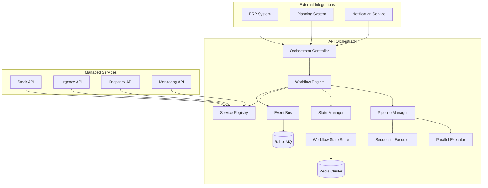

# API Orchestrator - Documentation

## Vue d'ensemble

L'API Orchestrator coordonne l'exécution séquentielle et parallèle des modules Stock, Urgence et Knapsack. Elle gère les workflows, la communication inter-services et la gestion d'état globale du système.

**Base URL**: `https://api.orchestrator.com/v1`

**Authentication**: Bearer Token

---

## Architecture de l'API Orchestrator



---

## 1. API Workflow Principal

### Endpoint: Pipeline Complet Stock-Urgence-Knapsack

```http
POST /orchestrator/pipeline/full-execution
Content-Type: application/json
Authorization: Bearer {token}
```

#### Request Body

```json
{
  "pipeline_name": "STOCK_URGENCE_KNAPSACK_COMPLET",
  "input_data": {
    "articles": [
      {
        "article_id": "ART-001",
        "stock_min": 10,
        "importance": "CRITIQUE"
      }
    ],
    "technicians": [
      {
        "technician_id": "TECH-001",
        "efficiency_factor": 1.2
      }
    ],
    "contraintes_knapsack": {
      "capacite": 120,
      "contraintes_types": {
        "FIBRE": 50,
        "CUIVRE": 40
      }
    }
  },
  "execution_options": {
    "parallel_urgence": true,
    "cache_intermediate": true,
    "generate_alternatives": true,
    "timeout_total_ms": 300000,
    "retry_on_failure": true,
    "quality_validation": true
  },
  "notification_config": {
    "webhook_url": "https://your-system.com/pipeline-webhook",
    "notify_on_completion": true,
    "notify_on_critical_alerts": true
  }
}
```

#### Response 202 Accepted (Async Processing)

```json
{
  "status": "accepted",
  "data": {
    "pipeline_id": "pipe_20240115_001",
    "execution_id": "exec_20240115_001",
    "estimated_completion_time": "2024-01-15T10:05:30Z",
    "status_url": "/orchestrator/pipeline/pipe_20240115_001/status",
    "webhook_configured": true,
    "phases_planned": [
      "STOCK_MODULE",
      "URGENCE_MODULE", 
      "KNAPSACK_MODULE",
      "VALIDATION_FINALE"
    ]
  }
}
```

### Endpoint: Statut Pipeline

```http
GET /orchestrator/pipeline/{pipeline_id}/status
Authorization: Bearer {token}
```

#### Response 200 OK

```json
{
  "status": "success",
  "data": {
    "pipeline_id": "pipe_20240115_001",
    "execution_id": "exec_20240115_001",
    "current_status": "IN_PROGRESS",
    "progress_percentage": 75,
    "start_time": "2024-01-15T10:00:00Z",
    "estimated_completion": "2024-01-15T10:05:30Z",
    "phases_status": {
      "STOCK_MODULE": {
        "status": "COMPLETED",
        "start_time": "2024-01-15T10:00:00Z",
        "completion_time": "2024-01-15T10:02:15Z",
        "execution_time_ms": 135000,
        "results": {
          "stock_initial_id": "calc_20240115_001",
          "consumption_forecast_id": "forecast_20240115_001",
          "projection_id": "proj_20240115_001"
        },
        "metrics": {
          "articles_processed": 150,
          "cache_hit_rate": 0.34,
          "performance_score": 0.92
        }
      },
      "URGENCE_MODULE": {
        "status": "COMPLETED",
        "start_time": "2024-01-15T10:02:15Z",
        "completion_time": "2024-01-15T10:03:45Z",
        "execution_time_ms": 90000,
        "results": {
          "temporelle_id": "temp_20240115_001",
          "quantitative_id": "quant_20240115_001",
          "totale_id": "total_20240115_001",
          "classification_id": "classif_20240115_001"
        },
        "metrics": {
          "parallel_efficiency": 0.87,
          "critique_a_detected": 23,
          "urgent_a_detected": 45
        }
      },
      "KNAPSACK_MODULE": {
        "status": "IN_PROGRESS",
        "start_time": "2024-01-15T10:03:45Z",
        "progress_details": {
          "current_step": "OPTIMIZATION_EXECUTION",
          "sub_progress": 85,
          "algorithm_used": "KNAPSACK_CRITICITE_HYBRIDE",
          "iterations_completed": 1247
        }
      },
      "VALIDATION_FINALE": {
        "status": "PENDING",
        "dependencies": ["KNAPSACK_MODULE"]
      }
    },
    "alerts": [
      {
        "level": "WARNING",
        "phase": "STOCK_MODULE",
        "message": "3 articles avec projection stock négatif détectés",
        "timestamp": "2024-01-15T10:02:10Z"
      }
    ],
    "resource_usage": {
      "cpu_usage": 0.68,
      "memory_usage_mb": 245,
      "active_workers": 6
    }
  }
}
```

---

## 2. API Gestion de Workflows

### Endpoint: Définition de Workflow Personnalisé

```http
POST /orchestrator/workflows/define
Content-Type: application/json
Authorization: Bearer {token}
```

#### Request Body

```json
{
  "workflow_name": "URGENCE_RAPIDE",
  "description": "Pipeline accéléré pour situations d'urgence",
  "workflow_definition": {
    "phases": [
      {
        "phase_id": "STOCK_INITIAL_ONLY",
        "service": "STOCK_API",
        "endpoint": "/stock/initial/calculate",
        "timeout_ms": 10000,
        "retry_count": 2,
        "parallel": false
      },
      {
        "phase_id": "URGENCE_PARALLELE",
        "sub_phases": [
          {
            "phase_id": "URGENCE_TEMPORELLE",
            "service": "URGENCE_API",
            "endpoint": "/urgence/temporelle/calculate",
            "parallel": true
          },
          {
            "phase_id": "URGENCE_QUANTITATIVE",
            "service": "URGENCE_API", 
            "endpoint": "/urgence/quantitative/calculate",
            "parallel": true
          }
        ]
      },
      {
        "phase_id": "KNAPSACK_RAPIDE",
        "service": "KNAPSACK_API",
        "endpoint": "/knapsack/optimize",
        "config_override": {
          "algorithme_config": {
            "strategie": "KNAPSACK_GLOUTON",
            "timeout_ms": 5000
          }
        }
      }
    ],
    "error_handling": {
      "strategy": "CONTINUE_ON_NON_CRITICAL",
      "critical_phases": ["URGENCE_PARALLELE"]
    },
    "success_criteria": {
      "min_phases_completed": 2,
      "required_phases": ["STOCK_INITIAL_ONLY", "URGENCE_PARALLELE"]
    }
  }
}
```

#### Response 201 Created

```json
{
  "status": "success",
  "data": {
    "workflow_id": "wf_urgence_rapide_001",
    "workflow_name": "URGENCE_RAPIDE",
    "validation_result": "PASSED",
    "estimated_execution_time_ms": 25000,
    "created_at": "2024-01-15T10:00:00Z",
    "active": true
  }
}
```

### Endpoint: Exécution Workflow Personnalisé

```http
POST /orchestrator/workflows/{workflow_id}/execute
Content-Type: application/json
Authorization: Bearer {token}
```

#### Request Body

```json
{
  "input_data": {/* données spécifiques au workflow */},
  "execution_options": {
    "priority": "HIGH",
    "resource_allocation": {
      "max_cpu_cores": 8,
      "max_memory_mb": 1024
    },
    "monitoring": {
      "detailed_logging": true,
      "performance_profiling": true
    }
  }
}
```

#### Response 202 Accepted

```json
{
  "status": "accepted",
  "data": {
    "execution_id": "exec_wf_20240115_001",
    "workflow_id": "wf_urgence_rapide_001",
    "priority": "HIGH",
    "estimated_completion": "2024-01-15T10:00:25Z"
  }
}
```

---

## 3. API Gestion d'État et Recovery

### Endpoint: Checkpoint et Sauvegarde d'État

```http
POST /orchestrator/state/checkpoint
Content-Type: application/json
Authorization: Bearer {token}
```

#### Request Body

```json
{
  "pipeline_id": "pipe_20240115_001",
  "checkpoint_options": {
    "include_intermediate_results": true,
    "compress_data": true,
    "retention_hours": 24
  }
}
```

#### Response 200 OK

```json
{
  "status": "success",
  "data": {
    "checkpoint_id": "ckpt_20240115_001",
    "pipeline_id": "pipe_20240115_001",
    "checkpoint_time": "2024-01-15T10:03:45Z",
    "state_snapshot": {
      "completed_phases": ["STOCK_MODULE", "URGENCE_MODULE"],
      "current_phase": "KNAPSACK_MODULE",
      "intermediate_results": {
        "stock_results_size_mb": 15.2,
        "urgence_results_size_mb": 8.7
      }
    },
    "recovery_url": "/orchestrator/state/recover/ckpt_20240115_001"
  }
}
```

### Endpoint: Recovery depuis Checkpoint

```http
POST /orchestrator/state/recover/{checkpoint_id}
Content-Type: application/json
Authorization: Bearer {token}
```

#### Request Body

```json
{
  "recovery_options": {
    "resume_from_checkpoint": true,
    "validate_state_integrity": true,
    "reset_failed_phases": true
  }
}
```

#### Response 200 OK

```json
{
  "status": "success",
  "data": {
    "recovery_id": "recovery_20240115_001",
    "original_pipeline_id": "pipe_20240115_001",
    "new_execution_id": "exec_recovery_20240115_001",
    "recovery_point": {
      "phase": "KNAPSACK_MODULE",
      "progress": 0.45,
      "time_saved_ms": 225000
    },
    "state_validation": {
      "integrity_check": "PASSED",
      "data_consistency": "PASSED",
      "dependencies_verified": "PASSED"
    }
  }
}
```

---

## 4. API Coordination Inter-Services

### Endpoint: Health Check Global

```http
GET /orchestrator/health/comprehensive
Authorization: Bearer {token}
```

#### Response 200 OK

```json
{
  "status": "success",
  "data": {
    "orchestrator_health": {
      "status": "HEALTHY",
      "uptime_hours": 72,
      "active_pipelines": 15,
      "pending_executions": 3
    },
    "services_health": {
      "STOCK_API": {
        "status": "HEALTHY",
        "response_time_ms": 245,
        "success_rate": 0.99,
        "last_check": "2024-01-15T10:04:30Z"
      },
      "URGENCE_API": {
        "status": "HEALTHY",
        "response_time_ms": 180,
        "success_rate": 0.98,
        "last_check": "2024-01-15T10:04:30Z"
      },
      "KNAPSACK_API": {
        "status": "DEGRADED",
        "response_time_ms": 4500,
        "success_rate": 0.95,
        "last_check": "2024-01-15T10:04:30Z",
        "issues": ["High response time detected"]
      }
    },
    "infrastructure_health": {
      "database": "HEALTHY",
      "message_queue": "HEALTHY",
      "cache_cluster": "HEALTHY",
      "load_balancer": "HEALTHY"
    },
    "overall_status": "DEGRADED",
    "critical_issues": 0,
    "warnings": 1
  }
}
```

### Endpoint: Configuration Circuit Breakers

```http
POST /orchestrator/resilience/circuit-breakers
Content-Type: application/json
Authorization: Bearer {token}
```

#### Request Body

```json
{
  "circuit_breaker_configs": {
    "STOCK_API": {
      "failure_threshold": 5,
      "success_threshold": 3,
      "timeout_ms": 30000,
      "fallback_strategy": "USE_CACHE"
    },
    "URGENCE_API": {
      "failure_threshold": 3,
      "success_threshold": 2,
      "timeout_ms": 60000,
      "fallback_strategy": "SIMPLIFIED_CALCULATION"
    },
    "KNAPSACK_API": {
      "failure_threshold": 2,
      "success_threshold": 3,
      "timeout_ms": 120000,
      "fallback_strategy": "GREEDY_ALGORITHM"
    }
  }
}
```

#### Response 200 OK

```json
{
  "status": "success",
  "data": {
    "config_id": "cb_config_20240115_001",
    "circuit_breakers_updated": 3,
    "active_from": "2024-01-15T10:05:00Z",
    "test_results": {
      "STOCK_API": "CONFIGURED",
      "URGENCE_API": "CONFIGURED", 
      "KNAPSACK_API": "CONFIGURED"
    }
  }
}
```

---

## 5. API Optimisation et Performance

### Endpoint: Optimisation Dynamique des Ressources

```http
POST /orchestrator/performance/dynamic-optimization
Content-Type: application/json
Authorization: Bearer {token}
```

#### Request Body

```json
{
  "optimization_targets": {
    "minimize_execution_time": 0.6,
    "maximize_throughput": 0.3,
    "optimize_resource_usage": 0.1
  },
  "constraints": {
    "max_parallel_pipelines": 20,
    "max_total_cpu_cores": 32,
    "max_total_memory_gb": 64
  },
  "adaptation_config": {
    "auto_scale_workers": true,
    "dynamic_timeout_adjustment": true,
    "intelligent_caching": true
  }
}
```

#### Response 200 OK

```json
{
  "status": "success",
  "data": {
    "optimization_id": "opt_perf_20240115_001",
    "optimizations_applied": [
      {
        "type": "WORKER_SCALING",
        "action": "Increased parallel workers from 6 to 10",
        "expected_improvement": "25% faster execution"
      },
      {
        "type": "CACHE_OPTIMIZATION",
        "action": "Enhanced cache hit rate for stock calculations",
        "expected_improvement": "15% resource reduction"
      },
      {
        "type": "TIMEOUT_ADJUSTMENT",
        "action": "Dynamic timeout based on historical performance",
        "expected_improvement": "Reduced false timeouts by 40%"
      }
    ],
    "performance_predictions": {
      "avg_pipeline_time_reduction_pct": 22,
      "throughput_increase_pct": 18,
      "resource_efficiency_gain_pct": 12
    }
  }
}
```

### Endpoint: Métriques Performance Temps Réel

```http
GET /orchestrator/performance/real-time-metrics
Authorization: Bearer {token}
```

#### Query Parameters

| Paramètre | Type | Description |
|-----------|------|-------------|
| `window` | string | Fenêtre temporelle (1m, 5m, 1h, 24h) |
| `metrics` | string | Types métriques (latency,throughput,errors) |

#### Response 200 OK

```json
{
  "status": "success",
  "data": {
    "metrics_window": "5m",
    "timestamp": "2024-01-15T10:05:00Z",
    "pipeline_metrics": {
      "active_executions": 12,
      "completed_last_5min": 8,
      "failed_last_5min": 1,
      "avg_execution_time_ms": 185000,
      "throughput_per_minute": 1.6
    },
    "service_metrics": {
      "STOCK_API": {
        "avg_response_time_ms": 245,
        "requests_per_minute": 45,
        "error_rate": 0.02
      },
      "URGENCE_API": {
        "avg_response_time_ms": 180,
        "requests_per_minute": 32,
        "error_rate": 0.01
      },
      "KNAPSACK_API": {
        "avg_response_time_ms": 3200,
        "requests_per_minute": 12,
        "error_rate": 0.05
      }
    },
    "resource_metrics": {
      "total_cpu_usage": 0.68,
      "total_memory_usage_gb": 24.5,
      "active_workers": 10,
      "queue_length": 3
    }
  }
}
```

---

## 6. API Scheduling et Batch Processing

### Endpoint: Planification de Pipelines

```http
POST /orchestrator/scheduler/create-schedule
Content-Type: application/json
Authorization: Bearer {token}
```

#### Request Body

```json
{
  "schedule_name": "DAILY_STOCK_ANALYSIS",
  "pipeline_config": {
    "workflow_id": "wf_stock_urgence_complet",
    "input_data_source": "DATABASE_QUERY",
    "query_config": {
      "data_source": "ERP_SYSTEM",
      "query": "SELECT * FROM articles WHERE active = true"
    }
  },
  "schedule_definition": {
    "type": "CRON",
    "expression": "0 6 * * *",
    "timezone": "Europe/Paris",
    "enabled": true
  },
  "execution_options": {
    "max_concurrent_executions": 1,
    "retry_on_failure": true,
    "retry_count": 3,
    "retry_delay_minutes": 30
  },
  "notification_config": {
    "notify_on_success": false,
    "notify_on_failure": true,
    "notification_channels": ["email", "webhook"]
  }
}
```

#### Response 201 Created

```json
{
  "status": "success",
  "data": {
    "schedule_id": "sched_20240115_001",
    "schedule_name": "DAILY_STOCK_ANALYSIS",
    "next_execution": "2024-01-16T06:00:00Z",
    "status": "ACTIVE",
    "validation_result": "PASSED"
  }
}
```

### Endpoint: Batch Processing

```http
POST /orchestrator/batch/execute
Content-Type: application/json
Authorization: Bearer {token}
```

#### Request Body

```json
{
  "batch_name": "MONTHLY_COMPLETE_ANALYSIS",
  "batch_items": [
    {
      "item_id": "batch_item_001",
      "workflow_id": "wf_stock_urgence_complet",
      "input_data": {
        "articles_filter": {"category": "FIBRE"},
        "period": "2024-01"
      }
    },
    {
      "item_id": "batch_item_002", 
      "workflow_id": "wf_stock_urgence_complet",
      "input_data": {
        "articles_filter": {"category": "CUIVRE"},
        "period": "2024-01"
      }
    }
  ],
  "batch_options": {
    "parallel_execution": true,
    "max_parallel_items": 5,
    "continue_on_item_failure": true,
    "aggregate_results": true
  }
}
```

#### Response 202 Accepted

```json
{
  "status": "accepted",
  "data": {
    "batch_id": "batch_20240115_001",
    "total_items": 2,
    "estimated_completion": "2024-01-15T10:25:00Z",
    "status_url": "/orchestrator/batch/batch_20240115_001/status"
  }
}
```

---

## 7. API Events et Notifications

### Endpoint: Configuration Event Bus

```http
POST /orchestrator/events/configure
Content-Type: application/json
Authorization: Bearer {token}
```

#### Request Body

```json
{
  "event_subscriptions": [
    {
      "event_type": "PIPELINE_STARTED",
      "handlers": [
        {
          "type": "WEBHOOK",
          "url": "https://your-system.com/pipeline-started",
          "authentication": {"type": "bearer", "token": "webhook-token"}
        },
        {
          "type": "EMAIL",
          "recipients": ["admin@company.com"],
          "template": "pipeline_notification"
        }
      ]
    },
    {
      "event_type": "CRITICAL_ALERT_DETECTED",
      "handlers": [
        {
          "type": "SMS",
          "recipients": ["+33123456789"],
          "priority": "HIGH"
        },
        {
          "type": "SLACK",
          "channel": "#alerts-critiques",
          "webhook_url": "https://hooks.slack.com/..."
        }
      ]
    }
  ],
  "event_filters": {
    "min_severity": "WARNING",
    "categories": ["STOCK", "URGENCE", "OPTIMIZATION"]
  }
}
```

#### Response 200 OK

```json
{
  "status": "success",
  "data": {
    "configuration_id": "event_config_20240115_001",
    "subscriptions_created": 2,
    "handlers_configured": 4,
    "active_from": "2024-01-15T10:05:00Z"
  }
}
```

### Format Event Notifications

#### Pipeline Started Event
```json
{
  "event_type": "PIPELINE_STARTED",
  "timestamp": "2024-01-15T10:00:00Z",
  "data": {
    "pipeline_id": "pipe_20240115_001",
    "workflow_name": "STOCK_URGENCE_KNAPSACK_COMPLET",
    "estimated_duration_ms": 300000,
    "priority": "NORMAL"
  }
}
```

#### Critical Alert Detected Event
```json
{
  "event_type": "CRITICAL_ALERT_DETECTED",
  "timestamp": "2024-01-15T10:03:45Z",
  "data": {
    "pipeline_id": "pipe_20240115_001",
    "phase": "URGENCE_MODULE",
    "alert_details": {
      "type": "CRITIQUE_A_DETECTED",
      "count": 23,
      "articles": ["ART-001", "ART-023", "ART-089"],
      "estimated_impact": "Service interruption risk within 48h"
    },
    "actions_required": "IMMEDIATE_PROCUREMENT"
  }
}
```

---

## 8. API Reporting et Analytics

### Endpoint: Rapport Exécution Pipeline

```http
GET /orchestrator/reports/pipeline-execution/{pipeline_id}
Authorization: Bearer {token}
```

#### Query Parameters

| Paramètre | Type | Description |
|-----------|------|-------------|
| `format` | string | Format rapport (json, pdf, excel) |
| `include_details` | boolean | Inclure détails techniques |
| `include_recommendations` | boolean | Inclure recommandations |

#### Response 200 OK

```json
{
  "status": "success",
  "data": {
    "report_id": "report_20240115_001",
    "pipeline_id": "pipe_20240115_001",
    "execution_summary": {
      "status": "COMPLETED_SUCCESS",
      "total_execution_time_ms": 285000,
      "phases_completed": 4,
      "phases_failed": 0,
      "overall_efficiency": 0.94
    },
    "phase_details": [
      {
        "phase": "STOCK_MODULE",
        "execution_time_ms": 135000,
        "performance_score": 0.92,
        "key_outputs": {
          "articles_processed": 150,
          "stock_alerts": 12,
          "projection_accuracy": 0.98
        }
      }
    ],
    "business_outcomes": {
      "critique_materials_identified": 23,
      "urgent_actions_required": 45,
      "estimated_cost_savings": 125000.50,
      "risk_mitigation_score": 0.89
    },
    "recommendations": [
      "Augmenter fréquence calculs pour articles CRITIQUE_A",
      "Optimiser cache pour réduire temps Stock-1 de 15%",
      "Considérer algorithme Branch&Bound pour optimisations critiques"
    ]
  }
}
```

### Endpoint: Analytics Historiques

```http
GET /orchestrator/analytics/historical
Authorization: Bearer {token}
```

#### Query Parameters

| Paramètre | Type | Description |
|-----------|------|-------------|
| `period` | string | Période analyse (7d, 30d, 90d, 1y) |
| `granularity` | string | Granularité (hour, day, week, month) |
| `metrics` | string | Métriques (performance, quality, costs) |

#### Response 200 OK

```json
{
  "status": "success",
  "data": {
    "analytics_period": "30d",
    "total_pipelines_executed": 458,
    "success_rate": 0.96,
    "performance_trends": {
      "avg_execution_time_trend": {
        "week_1": 298000,
        "week_2": 285000,
        "week_3": 276000,
        "week_4": 271000,
        "improvement_pct": 9.1
      },
      "throughput_trend": {
        "pipelines_per_day": [15.2, 16.8, 18.1, 19.3],
        "growth_rate": 0.27
      }
    },
    "quality_metrics": {
      "accuracy_scores": {
        "stock_projections": 0.97,
        "urgence_classification": 0.94,
        "optimization_quality": 0.92
      },
      "false_alert_rate": 0.03
    },
    "cost_analysis": {
      "total_processing_cost": 15000.00,
      "cost_per_pipeline": 32.75,
      "roi_estimated": 2.4
    }
  }
}
```

---

## 9. Exemples d'Intégration Orchestrator

### Python - Client Orchestrator Complet

```python
import asyncio
import logging
from orchestrator_api_client import OrchestratorAPIClient
from datetime import datetime, timedelta

class PipelineOrchestrator:
    def __init__(self, api_token):
        self.client = OrchestratorAPIClient(
            base_url="https://api.orchestrator.com/v1",
            token=api_token
        )
        self.logger = logging.getLogger(__name__)

    async def execute_full_pipeline(self, input_data, options=None):
        """Exécute un pipeline complet avec monitoring et recovery"""
        try:
            # 1. Lancement pipeline
            pipeline_response = await self.client.pipeline.full_execution(
                pipeline_name="STOCK_URGENCE_KNAPSACK_COMPLET",
                input_data=input_data,
                execution_options=options or {
                    "parallel_urgence": True,
                    "cache_intermediate": True,
                    "timeout_total_ms": 300000
                }
            )
            
            pipeline_id = pipeline_response["data"]["pipeline_id"]
            self.logger.info(f"Pipeline lancé: {pipeline_id}")
            
            # 2. Monitoring avec polling intelligent
            result = await self.monitor_pipeline_with_recovery(pipeline_id)
            
            # 3. Génération rapport final
            if result["status"] == "COMPLETED_SUCCESS":
                report = await self.client.reports.pipeline_execution(
                    pipeline_id, 
                    include_recommendations=True
                )
                return {
                    "pipeline_result": result,
                    "business_report": report["data"]
                }
            else:
                raise Exception(f"Pipeline failed: {result['error']}")
                
        except Exception as e:
            self.logger.error(f"Erreur orchestration: {e}")
            raise

    async def monitor_pipeline_with_recovery(self, pipeline_id):
        """Monitoring avec recovery automatique"""
        max_wait_time = timedelta(minutes=10)
        start_time = datetime.now()
        
        while datetime.now() - start_time < max_wait_time:
            try:
                status = await self.client.pipeline.get_status(pipeline_id)
                current_status = status["data"]["current_status"]
                
                if current_status == "COMPLETED_SUCCESS":
                    return status["data"]
                elif current_status == "FAILED":
                    # Tentative de recovery
                    await self.attempt_pipeline_recovery(pipeline_id)
                    
                # Monitoring des alertes critiques
                await self.handle_pipeline_alerts(status["data"].get("alerts", []))
                
                await asyncio.sleep(5)  # Poll toutes les 5 secondes
                
            except Exception as e:
                self.logger.error(f"Erreur monitoring: {e}")
                await asyncio.sleep(10)
        
        raise TimeoutError("Pipeline timeout atteint")

    async def attempt_pipeline_recovery(self, pipeline_id):
        """Tentative de recovery automatique"""
        try:
            # Création checkpoint
            checkpoint = await self.client.state.checkpoint(pipeline_id)
            
            # Recovery depuis checkpoint
            recovery = await self.client.state.recover(
                checkpoint["data"]["checkpoint_id"]
            )
            
            self.logger.info(f"Recovery tenté: {recovery['data']['recovery_id']}")
            return recovery
            
        except Exception as e:
            self.logger.error(f"Erreur recovery: {e}")
            raise

    async def handle_pipeline_alerts(self, alerts):
        """Gestion des alertes en cours de pipeline"""
        for alert in alerts:
            if alert["level"] == "CRITICAL":
                # Notification immédiate pour alertes critiques
                await self.send_immediate_notification(alert)
            elif alert["level"] == "WARNING":
                # Log pour warnings
                self.logger.warning(f"Alert: {alert['message']}")

class ScheduledPipelineManager:
    """Gestionnaire de pipelines planifiés"""
    
    def __init__(self, orchestrator_client):
        self.client = orchestrator_client
        
    async def setup_daily_analysis(self):
        """Configuration analyse quotidienne"""
        schedule_config = {
            "schedule_name": "DAILY_STOCK_ANALYSIS",
            "pipeline_config": {
                "workflow_id": "wf_stock_urgence_complet",
                "input_data_source": "DATABASE_QUERY"
            },
            "schedule_definition": {
                "type": "CRON",
                "expression": "0 6 * * *",  # Tous les jours à 6h
                "timezone": "Europe/Paris"
            },
            "notification_config": {
                "notify_on_failure": True,
                "notification_channels": ["email", "webhook"]
            }
        }
        
        result = await self.client.scheduler.create_schedule(schedule_config)
        return result

# Utilisation
async def main():
    orchestrator = PipelineOrchestrator("your-api-token")
    
    input_data = {
        "articles": [/* vos données articles */],
        "technicians": [/* vos données techniciens */],
        "contraintes_knapsack": {
            "capacite": 120,
            "contraintes_types": {"FIBRE": 50, "CUIVRE": 40}
        }
    }
    
    result = await orchestrator.execute_full_pipeline(input_data)
    print(f"Pipeline terminé avec succès: {result['business_report']['report_id']}")

if __name__ == "__main__":
    asyncio.run(main())
```

---

Cette API Orchestrator fournit une coordination complète des workflows avec resilience, monitoring temps réel, et recovery automatique pour garantir l'exécution fiable des pipelines complexes.