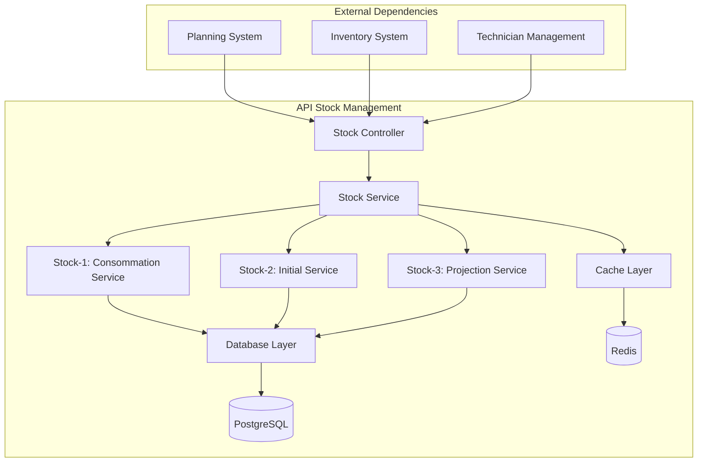

# API Stock Management - Documentation

## Vue d'ensemble

L'API Stock Management gère les calculs de stock initial, la consommation prévisionnelle et les projections. Elle constitue le socle de données pour les modules d'urgence et d'optimisation.

**Base URL**: `https://api.stock-management.com/v1`

**Authentication**: Bearer Token

---

## Architecture de l'API Stock



---

## 1. Stock-2 API: Stock Initial

### Endpoint: Calcul du Stock Initial

```http
POST /stock/initial/calculate
Content-Type: application/json
Authorization: Bearer {token}
```

#### Request Body

```json
{
  "articles": [
    {
      "article_id": "ART-001",
      "article_type": "CABLE_FIBRE",
      "stock_min": 10
    }
  ],
  "include_transit": true,
  "include_pending": true,
  "calculation_date": "2024-01-15T10:00:00Z"
}
```

#### Response 200 OK

```json
{
  "status": "success",
  "execution_time_ms": 245,
  "data": {
    "calculation_id": "calc_20240115_001",
    "calculation_date": "2024-01-15T10:00:00Z",
    "total_articles": 150,
    "stock_matrix": {
      "ART-001": {
        "stock_actuel": 25,
        "stock_transit": 15,
        "stock_pending": 5,
        "stock_initial": 45,
        "stock_min": 10
      }
    },
    "summary": {
      "total_value": 125000.50,
      "articles_below_min": 12,
      "articles_critical": 3
    }
  },
  "cache_info": {
    "cached": false,
    "cache_ttl": 3600
  }
}
```

#### Codes d'erreur

| Code | Description | Solution |
|------|-------------|----------|
| 400 | Paramètres invalides | Vérifier le format des données |
| 404 | Article non trouvé | Vérifier les IDs d'articles |
| 500 | Erreur de calcul | Réessayer ou contacter le support |

### Endpoint: Récupération Stock Initial

```http
GET /stock/initial/{calculation_id}
Authorization: Bearer {token}
```

#### Response 200 OK

```json
{
  "status": "success",
  "data": {
    "calculation_id": "calc_20240115_001",
    "stock_matrix": { /* ... */ },
    "created_at": "2024-01-15T10:00:00Z"
  }
}
```

---

## 2. Stock-1 API: Consommation Prévisionnelle

### Endpoint: Calcul Consommation

```http
POST /stock/consumption/forecast
Content-Type: application/json
Authorization: Bearer {token}
```

#### Request Body

```json
{
  "search_depth_days": 10,
  "technicians": [
    {
      "technician_id": "TECH-001",
      "efficiency_factor": 1.2
    }
  ],
  "imprevue_factor": 1.3,
  "calculation_options": {
    "parallel_processing": true,
    "cache_interventions": true,
    "include_weekend": false
  }
}
```

#### Response 200 OK

```json
{
  "status": "success",
  "execution_time_ms": 1850,
  "data": {
    "forecast_id": "forecast_20240115_001",
    "period": {
      "start_date": "2024-01-15",
      "end_date": "2024-01-25",
      "total_days": 10
    },
    "consumption_matrix": {
      "ART-001": {
        "day_1": 5,
        "day_2": 3,
        "day_3": 8,
        "total_period": 45
      }
    },
    "technician_summary": {
      "TECH-001": {
        "interventions_planned": 15,
        "total_consumption": 120,
        "average_daily": 12
      }
    },
    "processing_stats": {
      "technicians_processed": 25,
      "interventions_analyzed": 387,
      "articles_calculated": 150,
      "parallel_workers_used": 8
    }
  }
}
```

### Endpoint: Consommation par Technicien

```http
GET /stock/consumption/technician/{technician_id}
Authorization: Bearer {token}
```

#### Query Parameters

| Paramètre | Type | Requis | Description |
|-----------|------|--------|-------------|
| `start_date` | string | Oui | Date début (YYYY-MM-DD) |
| `end_date` | string | Oui | Date fin (YYYY-MM-DD) |
| `include_forecast` | boolean | Non | Inclure prévisions (default: true) |

#### Response 200 OK

```json
{
  "status": "success",
  "data": {
    "technician_id": "TECH-001",
    "period": {
      "start_date": "2024-01-15",
      "end_date": "2024-01-25"
    },
    "daily_consumption": [
      {
        "date": "2024-01-15",
        "interventions": 3,
        "articles_consumed": {
          "ART-001": 5,
          "ART-002": 2
        }
      }
    ],
    "totals": {
      "total_interventions": 28,
      "total_articles_consumed": 156,
      "efficiency_score": 0.95
    }
  }
}
```

---

## 3. Stock-3 API: Projection Stock

### Endpoint: Calcul Projection

```http
POST /stock/projection/calculate
Content-Type: application/json
Authorization: Bearer {token}
```

#### Request Body

```json
{
  "stock_initial_id": "calc_20240115_001",
  "consumption_forecast_id": "forecast_20240115_001",
  "projection_days": 10,
  "options": {
    "include_alerts": true,
    "alert_threshold_days": 3,
    "vectorized_calculation": true
  }
}
```

#### Response 200 OK

```json
{
  "status": "success",
  "execution_time_ms": 120,
  "data": {
    "projection_id": "proj_20240115_001",
    "period": {
      "start_date": "2024-01-15",
      "projection_days": 10
    },
    "stock_projection_matrix": {
      "ART-001": {
        "day_0": 45,
        "day_1": 40,
        "day_2": 37,
        "day_3": 29,
        "day_4": 25,
        "day_5": 18,
        "day_6": 12,
        "day_7": 8,
        "day_8": 3,
        "day_9": -2,
        "day_10": -8,
        "stock_min": 10,
        "critical_day": 9
      }
    },
    "alerts": [
      {
        "article_id": "ART-001",
        "alert_type": "STOCK_NEGATIVE",
        "critical_day": 9,
        "projected_stock": -2,
        "shortage_quantity": 12,
        "severity": "HIGH"
      }
    ],
    "summary": {
      "total_articles": 150,
      "articles_with_shortage": 23,
      "earliest_critical_day": 3,
      "total_shortage_value": 45000.00
    }
  }
}
```

### Endpoint: Projection Détaillée par Article

```http
GET /stock/projection/{projection_id}/article/{article_id}
Authorization: Bearer {token}
```

#### Response 200 OK

```json
{
  "status": "success",
  "data": {
    "article_id": "ART-001",
    "article_details": {
      "name": "Câble fibre optique 50m",
      "category": "FIBRE",
      "unit_price": 45.50
    },
    "stock_evolution": [
      {
        "day": 0,
        "date": "2024-01-15",
        "stock_level": 45,
        "consumption": 0,
        "status": "SAFE"
      },
      {
        "day": 9,
        "date": "2024-01-24",
        "stock_level": -2,
        "consumption": 5,
        "status": "CRITICAL"
      }
    ],
    "analysis": {
      "stock_min": 10,
      "days_until_shortage": 9,
      "max_shortage": -8,
      "recommended_order_quantity": 50,
      "recommended_order_date": "2024-01-18"
    }
  }
}
```

---

## 4. API Utilitaires Stock

### Endpoint: Validation Données

```http
POST /stock/validate
Content-Type: application/json
Authorization: Bearer {token}
```

#### Request Body

```json
{
  "validation_type": "FULL",
  "data": {
    "stock_initial_id": "calc_20240115_001",
    "consumption_forecast_id": "forecast_20240115_001"
  }
}
```

#### Response 200 OK

```json
{
  "status": "success",
  "data": {
    "validation_result": "PASSED",
    "checks_performed": [
      {
        "check_name": "stock_coherence",
        "status": "PASSED",
        "message": "Tous les stocks initiaux sont cohérents"
      },
      {
        "check_name": "consumption_bounds",
        "status": "WARNING",
        "message": "3 articles avec consommation anormalement élevée",
        "details": ["ART-045", "ART-123", "ART-089"]
      }
    ],
    "warnings": 1,
    "errors": 0
  }
}
```

### Endpoint: Statistiques Performance

```http
GET /stock/performance/stats
Authorization: Bearer {token}
```

#### Query Parameters

| Paramètre | Type | Description |
|-----------|------|-------------|
| `period` | string | Période (1h, 24h, 7d, 30d) |
| `metric_type` | string | Type métrique (latency, throughput, errors) |

#### Response 200 OK

```json
{
  "status": "success",
  "data": {
    "period": "24h",
    "metrics": {
      "stock_initial": {
        "avg_execution_time_ms": 245,
        "max_execution_time_ms": 580,
        "total_requests": 156,
        "success_rate": 0.99
      },
      "consumption_forecast": {
        "avg_execution_time_ms": 1850,
        "max_execution_time_ms": 4200,
        "total_requests": 89,
        "parallel_efficiency": 0.85
      },
      "stock_projection": {
        "avg_execution_time_ms": 120,
        "max_execution_time_ms": 290,
        "total_requests": 234,
        "cache_hit_rate": 0.67
      }
    },
    "system_health": {
      "status": "HEALTHY",
      "cpu_usage": 0.45,
      "memory_usage": 0.38,
      "active_connections": 23
    }
  }
}
```

---

## 5. Webhooks et Notifications

### Configuration Webhooks

```http
POST /stock/webhooks/configure
Content-Type: application/json
Authorization: Bearer {token}
```

#### Request Body

```json
{
  "webhook_url": "https://your-system.com/stock-webhook",
  "events": [
    "STOCK_CALCULATED",
    "PROJECTION_COMPLETED",
    "CRITICAL_SHORTAGE_DETECTED"
  ],
  "authentication": {
    "type": "bearer",
    "token": "your-webhook-token"
  }
}
```

### Format Notification Webhook

```json
{
  "event_type": "CRITICAL_SHORTAGE_DETECTED",
  "timestamp": "2024-01-15T10:30:00Z",
  "data": {
    "projection_id": "proj_20240115_001",
    "critical_articles": [
      {
        "article_id": "ART-001",
        "days_until_shortage": 3,
        "shortage_quantity": 15
      }
    ]
  }
}
```

---

## 6. Codes d'Erreur et Gestion

| Code HTTP | Code Erreur | Description | Action Recommandée |
|-----------|-------------|-------------|-------------------|
| 400 | `INVALID_PARAMETERS` | Paramètres de requête invalides | Vérifier la documentation |
| 401 | `UNAUTHORIZED` | Token d'authentification invalide | Renouveler le token |
| 403 | `INSUFFICIENT_PERMISSIONS` | Permissions insuffisantes | Contacter l'administrateur |
| 404 | `RESOURCE_NOT_FOUND` | Ressource non trouvée | Vérifier les IDs |
| 429 | `RATE_LIMIT_EXCEEDED` | Limite de taux dépassée | Attendre et réessayer |
| 500 | `CALCULATION_ERROR` | Erreur de calcul interne | Réessayer ou signaler |
| 503 | `SERVICE_UNAVAILABLE` | Service temporairement indisponible | Réessayer plus tard |

---

## 7. Limites et Quotas

| Ressource | Limite par minute | Limite par jour |
|-----------|-------------------|-----------------|
| **Calculs stock initial** | 10 | 100 |
| **Prévisions consommation** | 5 | 50 |
| **Projections stock** | 20 | 200 |
| **Requêtes lecture** | 100 | 5000 |

## 8. Exemples d'Intégration

### JavaScript/Node.js

```javascript
const StockAPI = require('@company/stock-api-client');

const client = new StockAPI({
  baseURL: 'https://api.stock-management.com/v1',
  token: 'your-bearer-token'
});

// Calcul séquence complète
async function calculateStockSequence() {
  try {
    // 1. Stock initial
    const stockInitial = await client.stock.calculateInitial({
      articles: articles,
      include_transit: true
    });
    
    // 2. Consommation prévisionnelle
    const consumption = await client.stock.forecastConsumption({
      search_depth_days: 10,
      technicians: technicians
    });
    
    // 3. Projection
    const projection = await client.stock.calculateProjection({
      stock_initial_id: stockInitial.data.calculation_id,
      consumption_forecast_id: consumption.data.forecast_id
    });
    
    console.log(`Projection terminée: ${projection.data.projection_id}`);
    
  } catch (error) {
    console.error('Erreur calcul stock:', error);
  }
}
```

### Python

```python
import asyncio
from stock_api_client import StockAPIClient

client = StockAPIClient(
    base_url="https://api.stock-management.com/v1",
    token="your-bearer-token"
)

async def calculate_stock_sequence():
    try:
        # Séquence complète avec gestion d'erreurs
        stock_initial = await client.stock.calculate_initial(
            articles=articles,
            include_transit=True
        )
        
        consumption = await client.stock.forecast_consumption(
            search_depth_days=10,
            technicians=technicians,
            parallel_processing=True
        )
        
        projection = await client.stock.calculate_projection(
            stock_initial_id=stock_initial["data"]["calculation_id"],
            consumption_forecast_id=consumption["data"]["forecast_id"]
        )
        
        # Gestion des alertes critiques
        if projection["data"]["alerts"]:
            await handle_critical_alerts(projection["data"]["alerts"])
            
    except Exception as e:
        logger.error(f"Erreur calcul stock: {e}")
```

---

Cette API Stock constitue la fondation du système, optimisée pour la performance avec parallélisation, cache intelligent et monitoring temps réel.