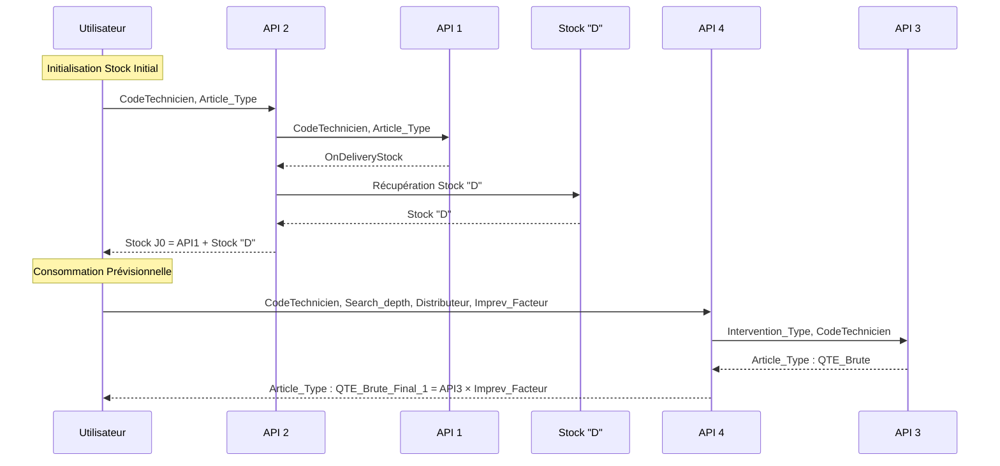
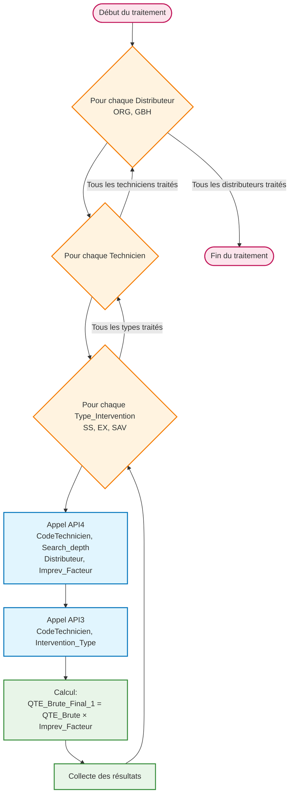

# Synthèse des APIs - Diagramme

## Vue d'ensemble des APIs

```mermaid
graph TD
    %% API 1
    A1[API 1: Récupération Stock en Transit]
    A1_IN[Input:<br/>• CodeTechnicien<br/>• Article_Type]
    A1_OUT[Output:<br/>OnDeliveryStock]

    %% API 2
    A2[API 2: Initialisation Stock Initial]
    A2_IN[Input:<br/>• CodeTechnicien<br/>• Article_Type]
    A2_OUT[Output:<br/>Stock J0]
    STOCK_D[Stock "D"]

    %% API 3
    A3[API 3: Liste Articles par Intervention]
    A3_IN[Input:<br/>• Intervention_Type<br/>• CodeTechnicien]
    A3_OUT[Output:<br/>Article_Type : QTE_Brute]

    %% API 4
    A4[API 4: Consommation Prévisionnelle]
    A4_IN[Input:<br/>• CodeTechnicien<br/>• Search_depth<br/>• Distributeur<br/>• Imprev_Facteur]
    A4_OUT[Output:<br/>Article_Type : QTE_Brute_Final_1]

    %% Relations
    A1_IN --> A1
    A1 --> A1_OUT

    A2_IN --> A2
    A2 --> A2_OUT
    A1_OUT --> A2
    STOCK_D --> A2

    A3_IN --> A3
    A3 --> A3_OUT

    A4_IN --> A4
    A4 --> A4_OUT
    A3_OUT --> A4

    %% Styling
    classDef apiBox fill:#e1f5fe,stroke:#0277bd,stroke-width:2px
    classDef inputBox fill:#f3e5f5,stroke:#7b1fa2,stroke-width:1px
    classDef outputBox fill:#e8f5e8,stroke:#388e3c,stroke-width:1px
    classDef dataBox fill:#fff3e0,stroke:#f57c00,stroke-width:1px

    class A1,A2,A3,A4 apiBox
    class A1_IN,A2_IN,A3_IN,A4_IN inputBox
    class A1_OUT,A2_OUT,A3_OUT,A4_OUT outputBox
    class STOCK_D dataBox
```

## Flux d'appels entre APIs



## Architecture de traitement par Distributeur



## Détail des APIs

| API | Fonction | Dépendances | Formule |
|-----|----------|-------------|---------|
| **API 1** | Récupération stock en transit et pending | - | `OnDeliveryStock = Stock_APP_Pending + Stock_Transit` |
| **API 2** | Stock initial technicien | API 1 + Stock "D" | `Stock_J0 = API1_Result + Stock_D` |
| **API 3** | Articles demandés par intervention | - | `Liste: Article_Type : QTE_Brute` |
| **API 4** | Consommation prévisionnelle | API 3 | `QTE_Brute_Final_1 = API3_Result × Imprev_Facteur` |