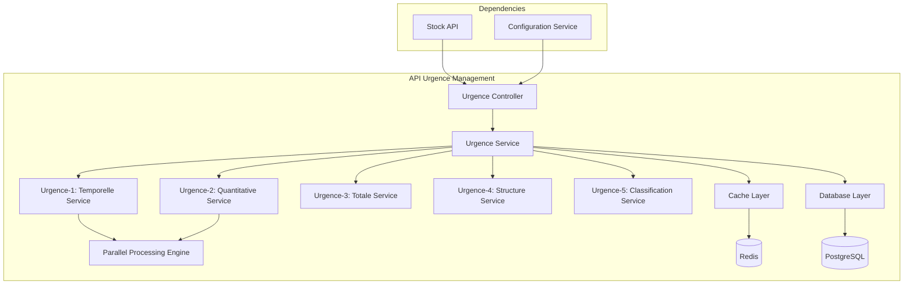

# API Urgence Management - Documentation

## Vue d'ensemble

L'API Urgence Management calcule les différents types d'urgence (temporelle, quantitative, totale) et effectue la classification finale des matériels selon leur niveau de criticité.

**Base URL**: `https://api.urgence-management.com/v1`

**Authentication**: Bearer Token

---

## Architecture de l'API Urgence



---

## 1. Urgence-1 API: Urgence Temporelle

### Endpoint: Calcul Urgence Temporelle

```http
POST /urgence/temporelle/calculate
Content-Type: application/json
Authorization: Bearer {token}
```

#### Request Body

```json
{
  "projection_stock_id": "proj_20240115_001",
  "search_depth_days": 10,
  "temporal_thresholds": {
    "critical_days": 2,
    "urgent_days": 5,
    "warning_days": 7
  },
  "options": {
    "early_termination": true,
    "parallel_processing": true,
    "cache_results": true
  }
}
```

#### Response 200 OK

```json
{
  "status": "success",
  "execution_time_ms": 280,
  "data": {
    "temporelle_id": "temp_20240115_001",
    "calculation_date": "2024-01-15T10:00:00Z",
    "period": {
      "start_date": "2024-01-15",
      "search_depth_days": 10
    },
    "urgence_temporelle_scores": {
      "ART-001": {
        "premier_jour_critique": 3,
        "stock_min": 10,
        "urgence_score": 100,
        "urgence_level": "CRITICAL",
        "detail_analysis": {
          "day_3": {
            "projected_stock": 8,
            "stock_min": 10,
            "deficit": 2,
            "first_critical": true
          }
        }
      },
      "ART-002": {
        "premier_jour_critique": 7,
        "stock_min": 15,
        "urgence_score": 50,
        "urgence_level": "URGENT",
        "detail_analysis": {
          "day_7": {
            "projected_stock": 12,
            "stock_min": 15,
            "deficit": 3,
            "first_critical": true
          }
        }
      }
    },
    "summary": {
      "total_articles_analyzed": 150,
      "critical_articles": 23,
      "urgent_articles": 45,
      "safe_articles": 82,
      "earliest_critical_day": 2,
      "processing_stats": {
        "parallel_workers_used": 4,
        "early_terminations": 82,
        "cache_hits": 45
      }
    }
  }
}
```

### Endpoint: Détail Urgence Temporelle par Article

```http
GET /urgence/temporelle/{temporelle_id}/article/{article_id}
Authorization: Bearer {token}
```

#### Response 200 OK

```json
{
  "status": "success",
  "data": {
    "article_id": "ART-001",
    "temporelle_analysis": {
      "premier_jour_critique": 3,
      "urgence_score": 100,
      "urgence_level": "CRITICAL",
      "timeline": [
        {
          "day": 1,
          "date": "2024-01-16",
          "projected_stock": 15,
          "stock_min": 10,
          "status": "SAFE",
          "margin": 5
        },
        {
          "day": 3,
          "date": "2024-01-18",
          "projected_stock": 8,
          "stock_min": 10,
          "status": "CRITICAL",
          "deficit": 2
        }
      ]
    },
    "recommendations": {
      "action_required": "IMMEDIATE",
      "recommended_order_date": "2024-01-16",
      "recommended_quantity": 50,
      "priority_level": "HIGH"
    }
  }
}
```

---

## 2. Urgence-2 API: Urgence Quantitative

### Endpoint: Calcul Urgence Quantitative

```http
POST /urgence/quantitative/calculate
Content-Type: application/json
Authorization: Bearer {token}
```

#### Request Body

```json
{
  "projection_stock_id": "proj_20240115_001",
  "analysis_period_days": 10,
  "quantitative_rules": {
    "stock_min_threshold": "STRICT",
    "zero_stock_penalty": 150,
    "below_min_score": 100
  },
  "options": {
    "daily_analysis": true,
    "vectorized_calculation": true
  }
}
```

#### Response 200 OK

```json
{
  "status": "success",
  "execution_time_ms": 180,
  "data": {
    "quantitative_id": "quant_20240115_001",
    "calculation_date": "2024-01-15T10:00:00Z",
    "urgence_quantitative_matrix": {
      "ART-001": {
        "daily_scores": {
          "day_1": 0,
          "day_2": 0,
          "day_3": 100,
          "day_4": 100,
          "day_5": 100,
          "day_6": 100,
          "day_7": 100,
          "day_8": 100,
          "day_9": 150,
          "day_10": 150
        },
        "max_score": 150,
        "critical_days_count": 8,
        "zero_stock_days": 2,
        "analysis": {
          "first_critical_day": 3,
          "consecutive_critical_days": 8,
          "severity": "HIGH"
        }
      }
    },
    "summary": {
      "total_articles": 150,
      "articles_with_shortages": 45,
      "articles_zero_stock": 12,
      "max_urgence_score": 150,
      "total_critical_days": 234
    }
  }
}
```

### Endpoint: Matrice Quantitative Complète

```http
GET /urgence/quantitative/{quantitative_id}/matrix
Authorization: Bearer {token}
```

#### Query Parameters

| Paramètre | Type | Description |
|-----------|------|-------------|
| `format` | string | Format de sortie (json, csv, excel) |
| `include_zero_scores` | boolean | Inclure les scores à 0 |

#### Response 200 OK

```json
{
  "status": "success",
  "data": {
    "matrix_format": "json",
    "period": {
      "start_date": "2024-01-15",
      "days": 10
    },
    "quantitative_matrix": {
      "headers": ["article_id", "day_1", "day_2", "day_3", "day_4", "day_5", "day_6", "day_7", "day_8", "day_9", "day_10"],
      "data": [
        ["ART-001", 0, 0, 100, 100, 100, 100, 100, 100, 150, 150],
        ["ART-002", 0, 0, 0, 0, 100, 100, 100, 100, 100, 100]
      ]
    },
    "statistics": {
      "total_scores_calculated": 1500,
      "non_zero_scores": 567,
      "average_score": 34.5
    }
  }
}
```

---

## 3. Urgence-3 API: Urgence Totale

### Endpoint: Calcul Urgence Totale

```http
POST /urgence/totale/calculate
Content-Type: application/json
Authorization: Bearer {token}
```

#### Request Body

```json
{
  "temporelle_id": "temp_20240115_001",
  "quantitative_id": "quant_20240115_001",
  "importance_weights": {
    "CRITIQUE": 50,
    "IMPORTANT": 30,
    "STANDARD": 10,
    "FAIBLE": 0
  },
  "calculation_rules": {
    "zero_multiplication_rule": true,
    "bonus_critical_combination": 10
  }
}
```

#### Response 200 OK

```json
{
  "status": "success",
  "execution_time_ms": 150,
  "data": {
    "totale_id": "total_20240115_001",
    "calculation_date": "2024-01-15T10:00:00Z",
    "urgence_totale_matrix": {
      "ART-001": {
        "daily_scores": {
          "day_1": 0,
          "day_2": 0,
          "day_3": 260,
          "day_4": 260,
          "day_5": 260,
          "day_6": 260,
          "day_7": 260,
          "day_8": 260,
          "day_9": 300,
          "day_10": 300
        },
        "max_urgence_totale": 300,
        "components": {
          "urgence_temporelle": 100,
          "urgence_quantitative_max": 150,
          "importance": 50,
          "bonus_combination": 10
        },
        "calculation_detail": {
          "formula": "temporelle + quantitative + importance + bonus",
          "zero_rule_applied": false
        }
      }
    },
    "classification_preview": {
      "CRITIQUE_A": 23,
      "URGENT_A": 45,
      "CRITIQUE_B": 34,
      "URGENT_B": 28,
      "SAFE": 20
    }
  }
}
```

### Endpoint: Analyse Comparative Urgences

```http
GET /urgence/totale/{totale_id}/comparative-analysis
Authorization: Bearer {token}
```

#### Response 200 OK

```json
{
  "status": "success",
  "data": {
    "comparative_analysis": {
      "top_critical_articles": [
        {
          "article_id": "ART-001",
          "max_urgence_score": 300,
          "critical_day": 3,
          "impact_analysis": {
            "temporelle_contribution": 33.3,
            "quantitative_contribution": 50.0,
            "importance_contribution": 16.7
          }
        }
      ],
      "urgence_distribution": {
        "0": 20,
        "160": 28,
        "210": 34,
        "250": 45,
        "300": 23
      },
      "temporal_evolution": {
        "day_1": {"avg_urgence": 15.2, "critical_count": 0},
        "day_3": {"avg_urgence": 89.5, "critical_count": 23},
        "day_10": {"avg_urgence": 145.8, "critical_count": 68}
      }
    }
  }
}
```

---

## 4. Urgence-4 API: Structure des Données

### Endpoint: Structuration MaterielAvecUrgence

```http
POST /urgence/structure/create
Content-Type: application/json
Authorization: Bearer {token}
```

#### Request Body

```json
{
  "totale_id": "total_20240115_001",
  "include_metadata": true,
  "structure_options": {
    "include_temporal_details": true,
    "include_recommendations": true,
    "optimize_for_classification": true
  }
}
```

#### Response 200 OK

```json
{
  "status": "success",
  "execution_time_ms": 95,
  "data": {
    "structure_id": "struct_20240115_001",
    "total_materiels": 150,
    "materiels_avec_urgence": [
      {
        "article_id": "ART-001",
        "article_metadata": {
          "name": "Câble fibre optique 50m",
          "category": "FIBRE",
          "unit_price": 45.50,
          "stock_min": 10,
          "importance": "CRITIQUE"
        },
        "urgence_data": {
          "urgence_temporelle": 100,
          "urgence_quantitative_matrix": {
            "day_1": 0,
            "day_2": 0,
            "day_3": 100,
            "day_9": 150,
            "day_10": 150
          },
          "urgence_totale_matrix": {
            "day_1": 0,
            "day_2": 0,
            "day_3": 260,
            "day_9": 300,
            "day_10": 300
          },
          "max_urgence_totale": 300,
          "jour_max_urgence": 9
        },
        "analysis_metadata": {
          "premier_jour_critique": 3,
          "jours_consecutifs_critiques": 8,
          "deficit_max": 8,
          "valeur_deficit": 364.00
        },
        "recommendations": {
          "action_immediate": true,
          "date_commande_recommandee": "2024-01-16",
          "quantite_recommandee": 50,
          "priorite_traitement": "MAXIMUM"
        }
      }
    ],
    "processing_summary": {
      "structures_created": 150,
      "with_recommendations": 123,
      "with_critical_urgence": 68,
      "memory_usage_mb": 15.2
    }
  }
}
```

### Endpoint: Export Structures

```http
GET /urgence/structure/{structure_id}/export
Authorization: Bearer {token}
```

#### Query Parameters

| Paramètre | Type | Description |
|-----------|------|-------------|
| `format` | string | Format (json, xml, csv, excel) |
| `filter_level` | string | Filtrer par niveau (CRITIQUE_A, URGENT_A, etc.) |
| `include_recommendations` | boolean | Inclure recommandations |

#### Response 200 OK (Format CSV)

```csv
article_id,name,max_urgence,classification,premier_jour_critique,action_requise
ART-001,Câble fibre optique 50m,300,CRITIQUE_A,3,IMMEDIATE
ART-002,Connecteur LC/PC,250,URGENT_A,7,RAPIDE
```

---

## 5. Urgence-5 API: Classification Finale

### Endpoint: Classification par Niveaux d'Urgence

```http
POST /urgence/classification/execute
Content-Type: application/json
Authorization: Bearer {token}
```

#### Request Body

```json
{
  "structure_id": "struct_20240115_001",
  "classification_rules": {
    "CRITIQUE_A": {"score": 300, "color": "#FF0000"},
    "URGENT_A": {"score": 250, "color": "#FF8000"},
    "CRITIQUE_B": {"score": 210, "color": "#FFFF00"},
    "URGENT_B": {"score": 160, "color": "#00FF00"},
    "SAFE": {"score": 0, "color": "#00FF00"}
  },
  "options": {
    "generate_alerts": true,
    "create_action_plan": true,
    "sort_by_priority": true
  }
}
```

#### Response 200 OK

```json
{
  "status": "success",
  "execution_time_ms": 45,
  "data": {
    "classification_id": "classif_20240115_001",
    "classification_date": "2024-01-15T10:00:00Z",
    "materiels_classifies": {
      "CRITIQUE_A": [
        {
          "article_id": "ART-001",
          "max_urgence_score": 300,
          "jour_max_urgence": 9,
          "action_requise": "IMMEDIATE",
          "deadline": "2024-01-16T12:00:00Z"
        }
      ],
      "URGENT_A": [
        {
          "article_id": "ART-045",
          "max_urgence_score": 250,
          "jour_max_urgence": 5,
          "action_requise": "RAPIDE",
          "deadline": "2024-01-18T18:00:00Z"
        }
      ]
    },
    "classification_summary": {
      "CRITIQUE_A": {"count": 23, "percentage": 15.3, "total_value": 125000.50},
      "URGENT_A": {"count": 45, "percentage": 30.0, "total_value": 89500.25},
      "CRITIQUE_B": {"count": 34, "percentage": 22.7, "total_value": 45200.75},
      "URGENT_B": {"count": 28, "percentage": 18.7, "total_value": 23100.00},
      "SAFE": {"count": 20, "percentage": 13.3, "total_value": 8900.00}
    },
    "alerts_generated": [
      {
        "level": "CRITICAL",
        "message": "23 matériels en situation CRITIQUE_A nécessitent une action immédiate",
        "articles_concerned": ["ART-001", "ART-023", "ART-089"],
        "estimated_impact": "Risque de rupture de service dans 48h"
      }
    ],
    "action_plan": {
      "immediate_actions": {
        "count": 23,
        "estimated_cost": 125000.50,
        "deadline": "2024-01-16T12:00:00Z"
      },
      "rapid_actions": {
        "count": 45,
        "estimated_cost": 89500.25,
        "deadline": "2024-01-18T18:00:00Z"
      }
    }
  }
}
```

### Endpoint: Détails Classification par Niveau

```http
GET /urgence/classification/{classification_id}/level/{level}
Authorization: Bearer {token}
```

#### Response 200 OK

```json
{
  "status": "success",
  "data": {
    "classification_level": "CRITIQUE_A",
    "level_details": {
      "score_range": "300",
      "color_code": "#FF0000",
      "action_type": "IMMEDIATE",
      "max_response_time": "24h"
    },
    "materiels": [
      {
        "article_id": "ART-001",
        "article_name": "Câble fibre optique 50m",
        "max_urgence_score": 300,
        "jour_critique": 3,
        "stock_actuel": 45,
        "deficit_prevu": 8,
        "cout_rupture_estime": 5000.00,
        "derniere_commande": "2024-01-01",
        "fournisseur_principal": "SUPPLIER-001"
      }
    ],
    "level_analytics": {
      "total_materiels": 23,
      "valeur_totale": 125000.50,
      "impact_operationnel": "CRITIQUE",
      "delai_moyen_approvisionnement": "5 jours",
      "risque_rupture_service": "ELEVÉ"
    }
  }
}
```

---

## 6. API Utilitaires Urgence

### Endpoint: Calcul Parallèle Complet

```http
POST /urgence/pipeline/execute
Content-Type: application/json
Authorization: Bearer {token}
```

#### Request Body

```json
{
  "projection_stock_id": "proj_20240115_001",
  "pipeline_options": {
    "parallel_temporelle_quantitative": true,
    "cache_intermediate_results": true,
    "generate_full_reports": true,
    "max_parallel_workers": 4
  },
  "urgence_config": {
    "temporal_thresholds": {"critical_days": 2, "urgent_days": 5},
    "importance_weights": {"CRITIQUE": 50, "IMPORTANT": 30},
    "classification_rules": "STANDARD"
  }
}
```

#### Response 200 OK

```json
{
  "status": "success",
  "execution_time_ms": 680,
  "data": {
    "pipeline_id": "pipeline_20240115_001",
    "results": {
      "temporelle_id": "temp_20240115_001",
      "quantitative_id": "quant_20240115_001",
      "totale_id": "total_20240115_001",
      "structure_id": "struct_20240115_001",
      "classification_id": "classif_20240115_001"
    },
    "final_classification": {
      "CRITIQUE_A": 23,
      "URGENT_A": 45,
      "CRITIQUE_B": 34,
      "URGENT_B": 28,
      "SAFE": 20
    },
    "performance_metrics": {
      "parallel_efficiency": 0.87,
      "cache_hit_rate": 0.34,
      "memory_peak_mb": 45.2,
      "cpu_utilization": 0.78
    }
  }
}
```

### Endpoint: Validation Cohérence Urgences

```http
POST /urgence/validation/coherence
Content-Type: application/json
Authorization: Bearer {token}
```

#### Request Body

```json
{
  "pipeline_id": "pipeline_20240115_001",
  "validation_rules": {
    "check_score_bounds": true,
    "verify_classification_logic": true,
    "validate_temporal_coherence": true
  }
}
```

#### Response 200 OK

```json
{
  "status": "success",
  "data": {
    "validation_result": "PASSED",
    "checks_performed": [
      {
        "check_name": "score_bounds_validation",
        "status": "PASSED",
        "message": "Tous les scores dans les bornes attendues"
      },
      {
        "check_name": "classification_coherence",
        "status": "WARNING",
        "message": "2 articles avec classification incohérente",
        "details": {
          "ART-156": "Score 210 mais classé URGENT_A au lieu de CRITIQUE_B",
          "ART-203": "Score 0 mais urgence temporelle détectée"
        }
      }
    ],
    "warnings": 1,
    "errors": 0,
    "recommendations": [
      "Revoir la logique de classification pour les articles ART-156 et ART-203"
    ]
  }
}
```

---

## 7. Webhooks et Notifications

### Configuration Webhooks Urgence

```http
POST /urgence/webhooks/configure
Content-Type: application/json
Authorization: Bearer {token}
```

#### Request Body

```json
{
  "webhook_url": "https://your-system.com/urgence-webhook",
  "events": [
    "CRITIQUE_A_DETECTED",
    "URGENT_A_DETECTED",
    "PIPELINE_COMPLETED",
    "CLASSIFICATION_CHANGED"
  ],
  "filters": {
    "min_urgence_level": "URGENT_A",
    "article_categories": ["FIBRE", "CUIVRE"]
  }
}
```

### Format Notification Critique

```json
{
  "event_type": "CRITIQUE_A_DETECTED",
  "timestamp": "2024-01-15T10:30:00Z",
  "data": {
    "classification_id": "classif_20240115_001",
    "critique_articles": [
      {
        "article_id": "ART-001",
        "urgence_score": 300,
        "days_until_shortage": 3,
        "estimated_impact": "Service interruption risk"
      }
    ],
    "immediate_actions_required": 23,
    "total_estimated_cost": 125000.50
  }
}
```

---

## 8. Codes d'Erreur Spécialisés

| Code HTTP | Code Erreur | Description | Action |
|-----------|-------------|-------------|--------|
| 400 | `INVALID_PROJECTION_ID` | ID projection stock invalide | Vérifier l'ID |
| 400 | `MISSING_URGENCE_DATA` | Données d'urgence manquantes | Fournir tous les IDs requis |
| 422 | `CALCULATION_INCONSISTENCY` | Incohérence dans les calculs | Revoir les paramètres |
| 500 | `PARALLEL_PROCESSING_ERROR` | Erreur traitement parallèle | Réduire le nombre de workers |

## 9. Exemple d'Intégration Pipeline Complet

### Python - Pipeline Urgence Complet

```python
import asyncio
from urgence_api_client import UrgenceAPIClient

client = UrgenceAPIClient(
    base_url="https://api.urgence-management.com/v1",
    token="your-bearer-token"
)

async def execute_urgence_pipeline(projection_stock_id):
    try:
        # Pipeline complet avec parallélisation
        pipeline_result = await client.urgence.execute_pipeline(
            projection_stock_id=projection_stock_id,
            pipeline_options={
                "parallel_temporelle_quantitative": True,
                "cache_intermediate_results": True,
                "max_parallel_workers": 4
            }
        )
        
        # Récupération de la classification finale
        classification_id = pipeline_result["data"]["results"]["classification_id"]
        
        # Traitement des alertes critiques
        critique_a = await client.urgence.get_classification_level(
            classification_id, "CRITIQUE_A"
        )
        
        if critique_a["data"]["materiels"]:
            await handle_critical_urgence(critique_a["data"]["materiels"])
            
        return pipeline_result
        
    except Exception as e:
        logger.error(f"Erreur pipeline urgence: {e}")
```

---

Cette API Urgence fournit un système complet de calcul et classification d'urgence avec parallélisation optimisée et notifications temps réel.