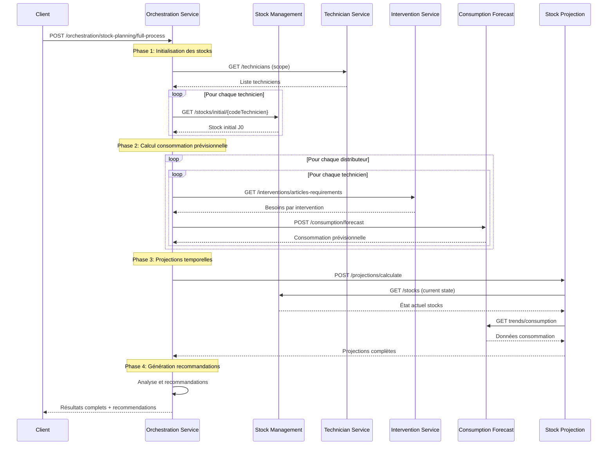
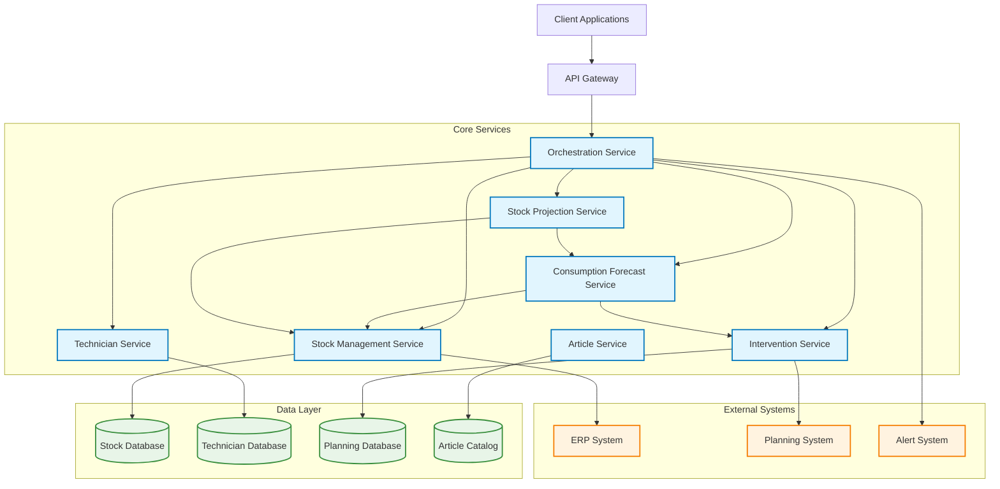

# Architecture APIs Génériques - Système de Gestion de Stock Techniciens

## Analyse du Diagramme de Séquence Existant

D'après le diagramme, le système actuel comprend :
- **Système Principal** : Orchestrateur central
- **Algorithme 2 (Stock Initial)** : Calcul du stock initial
- **Algorithme 1 (Consommation)** : Calcul de consommation prévisionnelle
- **Algorithme 3 (Projection)** : Projection de stock dans le temps
- **Base de Données** : Stockage des données

## Découpage en APIs Génériques Orientées Objet

### 1. API Stock Management Service
**Responsabilité** : Gestion centralisée des stocks (actuel, transit, pending)

### 2. API Technician Service
**Responsabilité** : Gestion des techniciens et leurs attributs

### 3. API Intervention Service
**Responsabilité** : Gestion des interventions et planification

### 4. API Article Service
**Responsabilité** : Catalogue et gestion des articles

### 5. API Consumption Forecast Service
**Responsabilité** : Calculs de consommation prévisionnelle

### 6. API Stock Projection Service
**Responsabilité** : Projections temporelles des stocks

### 7. API Orchestration Service
**Responsabilité** : Coordination des processus métier complexes

---

## Diagramme de Classes - Modèle de Domaine

```mermaid
classDiagram
    class Technician {
        +codeTechnicien: String
        +nom: String
        +zone: String
        +distributeurs: List
        +competences: Map
    }

    class Article {
        +articleType: String
        +designation: String
        +categorie: String
        +prixUnitaire: Double
        +seuilCritique: Integer
    }

    class Stock {
        +codeTechnicien: String
        +articleType: String
        +quantiteActuelle: Integer
        +quantiteTransit: Integer
        +quantitePending: Integer
        +lastUpdate: Date
        +status: String
    }

    class Intervention {
        +interventionId: String
        +codeTechnicien: String
        +typeIntervention: String
        +datePlanifiee: Date
        +distributeur: String
        +status: String
    }

    class ArticleRequirement {
        +articleType: String
        +quantiteRequise: Integer
        +quantiteConsommee: Integer
        +priority: String
    }

    class ConsumptionForecast {
        +codeTechnicien: String
        +articleType: String
        +distributeur: String
        +quantitePrevisionnelle: Integer
        +periodeDebut: Date
        +periodeFin: Date
        +facteurImprevus: Double
    }

    class StockProjection {
        +codeTechnicien: String
        +articleType: String
        +dateProjection: Date
        +stockProjetee: Integer
    }

    class ConsumptionEvent {
        +date: Date
        +quantite: Integer
        +type: String
        +source: String
    }

    Technician ||--o{ Stock
    Technician ||--o{ Intervention
    Article ||--o{ Stock
    Article ||--o{ ArticleRequirement
    Intervention ||--o{ ArticleRequirement
    Stock ||--o{ ConsumptionForecast
    Stock ||--o{ StockProjection
    ConsumptionForecast ||--o{ StockProjection
    StockProjection ||--o{ ConsumptionEvent
```

---

## API 1 - Stock Management Service

### Description
Service centralisé pour la gestion des stocks techniciens avec toutes les opérations CRUD et calculs dérivés.

### Endpoints

#### GET /api/v1/stocks
Récupère les stocks avec filtres

**Paramètres**
```json
{
  "codeTechnicien": "string (optional)",
  "articleType": "string (optional)",
  "includeTransit": "boolean (default: true)",
  "includePending": "boolean (default: true)",
  "status": "string (optional: ACTIVE|INACTIVE|ALL)"
}
```

**Réponse**
```json
{
  "stocks": [
    {
      "codeTechnicien": "TECH001",
      "articleType": "CABLE_HDMI",
      "quantiteActuelle": 10,
      "quantiteTransit": 5,
      "quantitePending": 3,
      "totalDisponible": 18,
      "lastUpdate": "2025-09-22T10:00:00Z",
      "status": "ACTIVE"
    }
  ],
  "pagination": {
    "page": 1,
    "size": 20,
    "total": 150
  }
}
```

#### GET /api/v1/stocks/initial/{codeTechnicien}
Calcule le stock initial J0 pour un technicien

**Réponse**
```json
{
  "codeTechnicien": "TECH001",
  "dateCalcul": "2025-09-22T10:00:00Z",
  "articlesStock": [
    {
      "articleType": "CABLE_HDMI",
      "stockActuel": 10,
      "stockTransit": 5,
      "stockPending": 3,
      "stockJ0": 18
    }
  ]
}
```

#### POST /api/v1/stocks/movements
Enregistre un mouvement de stock

**Payload**
```json
{
  "codeTechnicien": "TECH001",
  "articleType": "CABLE_HDMI",
  "type": "CONSUMPTION|REPLENISHMENT|TRANSFER",
  "quantite": 5,
  "source": "INTERVENTION_INT001",
  "commentaire": "Consommation intervention client"
}
```

---

## API 2 - Technician Service

### Description
Gestion des techniciens et de leurs profils.

### Endpoints

#### GET /api/v1/technicians
Liste tous les techniciens avec filtres

#### GET /api/v1/technicians/{codeTechnicien}
Détail d'un technicien

**Réponse**
```json
{
  "codeTechnicien": "TECH001",
  "nom": "Dupont Jean",
  "zone": "PARIS_NORD",
  "distributeurs": ["ORG", "GBH"],
  "competences": {
    "FIBRE": 5,
    "ADSL": 4,
    "TV": 3
  },
  "status": "ACTIVE",
  "dateCreation": "2025-01-01T00:00:00Z"
}
```

#### PUT /api/v1/technicians/{codeTechnicien}/competences
Met à jour les compétences d'un technicien

---

## API 3 - Intervention Service

### Description
Gestion du planning et des interventions.

### Endpoints

#### GET /api/v1/interventions/planning
Récupère le planning d'interventions

**Paramètres**
```json
{
  "codeTechnicien": "string (optional)",
  "dateDebut": "date",
  "dateFin": "date",
  "typeIntervention": "string (optional: EX|SAV|SS)",
  "distributeur": "string (optional)"
}
```

**Réponse**
```json
{
  "interventions": [
    {
      "interventionId": "INT001",
      "codeTechnicien": "TECH001",
      "typeIntervention": "SAV",
      "dateplanifiee": "2025-09-23T09:00:00Z",
      "distributeur": "ORG",
      "articlesRequis": [
        {
          "articleType": "CABLE_HDMI",
          "quantiteRequise": 2,
          "priority": "HIGH"
        }
      ],
      "status": "PLANNED"
    }
  ]
}
```

#### GET /api/v1/interventions/articles-requirements
Agrège les besoins en articles par technicien

**Paramètres**
```json
{
  "codeTechnicien": "TECH001",
  "typeIntervention": "SAV",
  "dateDebut": "2025-09-22",
  "dateFin": "2025-09-30"
}
```

**Réponse**
```json
{
  "codeTechnicien": "TECH001",
  "typeIntervention": "SAV",
  "periode": {
    "debut": "2025-09-22",
    "fin": "2025-09-30"
  },
  "articlesRequis": [
    {
      "articleType": "CABLE_HDMI",
      "quantiteTotale": 15,
      "nombreInterventions": 8,
      "moyenne": 1.875
    }
  ]
}
```

---

## API 4 - Article Service

### Description
Catalogue et gestion des articles.

### Endpoints

#### GET /api/v1/articles
Liste des articles avec métadonnées

**Réponse**
```json
{
  "articles": [
    {
      "articleType": "CABLE_HDMI",
      "designation": "Câble HDMI 2.0 - 1.5m",
      "categorie": "CONNECTIQUE",
      "prixUnitaire": 12.50,
      "seuilCritique": 5,
      "specifications": {
        "longueur": "1.5m",
        "version": "2.0"
      }
    }
  ]
}
```

#### GET /api/v1/articles/{articleType}/usage-stats
Statistiques d'usage d'un article

---

## API 5 - Consumption Forecast Service

### Description
Service de calcul des consommations prévisionnelles avec facteurs d'imprévus.

### Endpoints

#### POST /api/v1/consumption/forecast
Calcule la consommation prévisionnelle

**Payload**
```json
{
  "codeTechnicien": "TECH001",
  "distributeur": "ORG",
  "periodeAnalyse": {
    "debut": "2025-09-22",
    "fin": "2025-10-22"
  },
  "facteurs": {
    "imprevus": 1.2,
    "saisonnalite": 1.1,
    "tendance": 1.05
  },
  "includeHistorique": true
}
```

**Réponse**
```json
{
  "codeTechnicien": "TECH001",
  "distributeur": "ORG",
  "periode": {
    "debut": "2025-09-22",
    "fin": "2025-10-22"
  },
  "previsions": [
    {
      "articleType": "CABLE_HDMI",
      "consommationBase": 10,
      "facteurApplique": 1.32,
      "consommationPrevue": 13.2,
      "confiance": 0.85,
      "sources": [
        {
          "typeIntervention": "SAV",
          "contribution": 8
        }
      ]
    }
  ],
  "metadonnees": {
    "algorithme": "ML_FORECAST_V2",
    "dateCalcul": "2025-09-22T10:30:00Z"
  }
}
```

#### GET /api/v1/consumption/trends
Analyse des tendances de consommation

---

## API 6 - Stock Projection Service

### Description
Service de projection temporelle des stocks avec simulation de scénarios.

### Endpoints

#### POST /api/v1/projections/calculate
Lance une projection de stock

**Payload**
```json
{
  "codeTechnicien": "TECH001",
  "articlesScope": ["CABLE_HDMI", "BOITIER_CPL"],
  "periodeProjection": {
    "debut": "2025-09-22",
    "fin": "2025-12-22"
  },
  "scenarios": [
    {
      "nom": "BASE",
      "facteurConsommation": 1.0
    },
    {
      "nom": "PEAK_SEASON",
      "facteurConsommation": 1.3
    }
  ]
}
```

**Réponse**
```json
{
  "projectionId": "PROJ_20250922_001",
  "codeTechnicien": "TECH001",
  "dateCalcul": "2025-09-22T10:30:00Z",
  "scenarios": [
    {
      "nom": "BASE",
      "projections": [
        {
          "articleType": "CABLE_HDMI",
          "timeline": [
            {
              "date": "2025-09-22",
              "stockDebut": 18,
              "consommationPrevue": 2,
              "approvisionnements": 0,
              "stockFin": 16,
              "alertes": []
            }
          ],
          "alertes": [
            {
              "date": "2025-10-15",
              "type": "STOCK_CRITIQUE",
              "message": "Stock inférieur au seuil (5)"
            }
          ]
        }
      ]
    }
  ]
}
```

#### GET /api/v1/projections/{projectionId}
Récupère une projection calculée

---

## API 7 - Orchestration Service

### Description
Service d'orchestration des processus métier complexes.

### Endpoints

#### POST /api/v1/orchestration/stock-planning/full-process
Lance le processus complet de planification stock

**Payload**
```json
{
  "scope": {
    "distributeurs": ["ORG", "GBH"],
    "techniciens": ["TECH001", "TECH002"],
    "periode": {
      "debut": "2025-09-22",
      "fin": "2025-12-22"
    }
  },
  "options": {
    "includeProjections": true,
    "generateAlerts": true,
    "calculateRecommandations": true
  }
}
```

**Réponse**
```json
{
  "processId": "PROCESS_20250922_001",
  "status": "IN_PROGRESS",
  "etapes": [
    {
      "nom": "CALCUL_STOCKS_INITIAUX",
      "status": "COMPLETED",
      "duree": "00:00:45"
    },
    {
      "nom": "CALCUL_CONSOMMATION_PREVISIONNELLE",
      "status": "IN_PROGRESS",
      "progression": 60
    }
  ]
}
```

#### GET /api/v1/orchestration/processes/{processId}
Suit l'avancement d'un processus

#### GET /api/v1/orchestration/recommendations/{processId}
Récupère les recommandations générées

---

## Diagramme de Séquence - Orchestration Globale



---

## Diagramme d'Architecture - Vue d'ensemble



---

## Avantages de cette Architecture

### 1. **Généricité et Réutilisabilité**
- APIs indépendantes et réutilisables
- Séparation claire des responsabilités
- Contrats d'interface standardisés

### 2. **Évolutivité**
- Chaque service peut évoluer indépendamment
- Possibilité d'ajouter de nouveaux services
- Architecture modulaire

### 3. **Maintenabilité**
- Code organisé par domaine métier
- Tests unitaires par service
- Déploiement indépendant possible

### 4. **Performance**
- Appels parallèles possibles
- Cache au niveau service
- Optimisations ciblées par service

### 5. **Fiabilité**
- Isolation des pannes
- Retry et circuit breaker par service
- Monitoring granulaire

---

## Implémentation Recommandée

### Technologies Suggérées
- **Backend** : Spring Boot (Java) ou FastAPI (Python)
- **Base de données** : PostgreSQL pour les données transactionnelles
- **Cache** : Redis pour les performances
- **API Gateway** : Kong ou AWS API Gateway
- **Monitoring** : Prometheus + Grafana
- **Documentation** : OpenAPI/Swagger

### Pattern d'Architecture
- **Microservices** avec communication REST
- **Event-driven** pour les notifications
- **CQRS** pour les projections complexes
- **Repository Pattern** pour l'accès aux données
