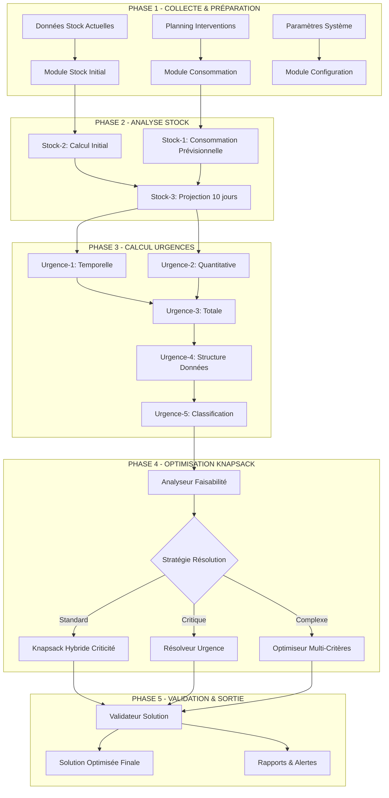
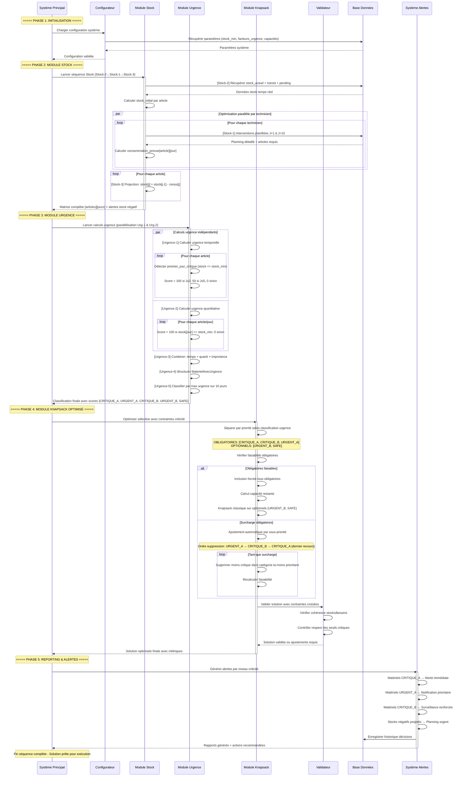
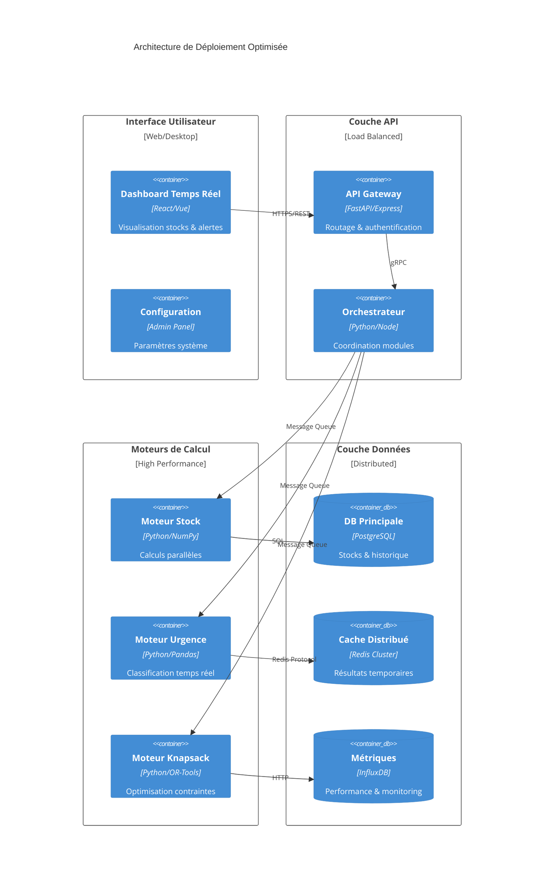

# Architecture Finale Optimale : Système Intégré de Gestion Stock-Urgence-Knapsack

## Vue d'Ensemble de l'Architecture

Cette architecture intègre les trois composants critiques :
1. **Module Stock** : Calcul des besoins et projections
2. **Module Urgence** : Classification par criticité  
3. **Module Knapsack** : Optimisation avec contraintes de criticité

---

## Séquencement Global Optimisé

### Architecture Modulaire Unifiée



---

## Diagramme de Séquence Intégré Détaillé



---

## Architecture Technique Détaillée

### 1. Module Stock Optimisé

```python
CLASSE ModuleStock:
    FONCTION executer_sequence_optimisee():
        # Phase 1: Stock Initial (I/O intensif)
        stock_initial = self.calculer_stock_initial_parallel()
        
        # Phase 2: Consommation (CPU intensif - parallélisation par technicien)
        consommation_matrix = self.calculer_consommation_parallel()
        
        # Phase 3: Projection (Calcul léger - vectorisation)
        projection_complete = self.calculer_projection_vectorisee(
            stock_initial, 
            consommation_matrix
        )
        
        RETOURNER projection_complete
        
    FONCTION calculer_consommation_parallel():
        pool_techniciens = ThreadPoolExecutor(max_workers=cpu_count())
        futures = []
        
        POUR CHAQUE technicien DANS liste_techniciens FAIRE
            future = pool_techniciens.submit(
                self.calculer_consommation_technicien, 
                technicien
            )
            futures.append(future)
        FIN_POUR
        
        RETOURNER agreger_resultats(futures)
```

### 2. Module Urgence avec Parallélisation

```python
CLASSE ModuleUrgence:
    FONCTION calculer_urgences_parallel(projection_stock):
        # Lancement parallèle Urgence-1 & Urgence-2
        pool = ThreadPoolExecutor(max_workers=2)
        
        future_temporelle = pool.submit(
            self.calculer_urgence_temporelle, 
            projection_stock
        )
        future_quantitative = pool.submit(
            self.calculer_urgence_quantitative, 
            projection_stock
        )
        
        # Attente résultats parallèles
        urgence_temporelle = future_temporelle.result()
        urgence_quantitative = future_quantitative.result()
        
        # Séquence finale
        urgence_totale = self.combiner_urgences(
            urgence_temporelle, 
            urgence_quantitative
        )
        
        materiels_structures = self.structurer_donnees(urgence_totale)
        classification = self.classifier_materiels(materiels_structures)
        
        RETOURNER classification
```

### 3. Module Knapsack avec Contraintes de Criticité

```python
CLASSE KnapsackAvecCriticite:
    FONCTION optimiser_selection(materiels_classifies, contraintes, capacite):
        # Séparation par criticité
        obligatoires = self.filtrer_obligatoires(materiels_classifies)
        optionnels = self.filtrer_optionnels(materiels_classifies)
        
        # Stratégie selon faisabilité
        scenario = self.analyser_faisabilite(obligatoires, contraintes, capacite)
        
        SI scenario.faisable ALORS
            solution = self.resolution_standard(obligatoires, optionnels, capacite)
        SINON
            solution = self.resolution_avec_ajustement(obligatoires, capacite)
        FIN_SI
        
        # Validation finale
        solution_validee = self.valider_solution(solution, contraintes)
        
        RETOURNER solution_validee
        
    FONCTION resolution_avec_ajustement(obligatoires, capacite):
        # Ajustement par sous-priorités
        materiels_tries = self.trier_par_sous_priorite(obligatoires)
        solution = []
        capacite_utilisee = 0
        
        # Inclusion par ordre de priorité décroissante
        POUR CHAQUE materiel DANS materiels_tries FAIRE
            SI capacite_utilisee + materiel.poids <= capacite ALORS
                solution.append(materiel)
                capacite_utilisee += materiel.poids
            SINON
                # Log de l'exclusion forcée
                self.logger.warning(f"Exclusion forcée: {materiel.id} ({materiel.grade})")
            FIN_SI
        FIN_POUR
        
        RETOURNER solution
```

---

## Stratégies d'Optimisation Avancées

### 1. Parallélisation Multi-Niveaux

```mermaid
gantt
    title Optimisation Temporelle par Parallélisation
    dateFormat X
    axisFormat %Ls
    
    section Module Stock
    Stock-2 Initial    :0, 500
    Stock-1 Tech1      :0, 2000
    Stock-1 Tech2      :0, 2000
    Stock-1 Tech3      :0, 2000
    Stock-3 Projection :2000, 2200
    
    section Module Urgence
    Urgence-1 Temporelle :2200, 2400
    Urgence-2 Quantitative :2200, 2400
    Urgence-3 Totale     :2400, 2500
    Urgence-4 Structure  :2500, 2550
    Urgence-5 Classification :2550, 2600
    
    section Module Knapsack
    Analyse Faisabilité :2600, 2700
    Résolution Optimisée :2700, 3000
    Validation Finale   :3000, 3100
```



### 2. Cache Multi-Niveaux

```python
CLASSE CacheIntelligent:
    FONCTION __init__():
        self.cache_stock_initial = CacheLRU(taille=100, ttl=3600)  # 1h
        self.cache_consommation = CacheLRU(taille=50, ttl=1800)   # 30min
        self.cache_solutions = CacheLRU(taille=200, ttl=900)       # 15min
        
    FONCTION obtenir_stock_initial(cle_contexte):
        SI cle_contexte IN self.cache_stock_initial ALORS
            RETOURNER self.cache_stock_initial[cle_contexte]
        FIN_SI
        
        resultat = self.calculer_stock_initial(cle_contexte)
        self.cache_stock_initial[cle_contexte] = resultat
        RETOURNER resultat
```

### 3. Monitoring et Métriques Temps Réel

```python
CLASSE MoniteurPerformances:
    FONCTION mesurer_execution(phase_nom):
        DEBUT_CHRONO = time.now()
        
        TRY:
            yield
        FINALLY:
            duree = time.now() - DEBUT_CHRONO
            self.enregistrer_metrique(phase_nom, duree)
            
            SI duree > self.seuils[phase_nom] ALORS
                self.envoyer_alerte_performance(phase_nom, duree)
            FIN_SI
        FIN_TRY
```

---

## Diagramme de Déploiement et Intégration



---

## Configuration d'Exécution par Contexte

### Contexte Production Critique
```yaml
configuration_production:
  modules:
    stock:
      parallelize_by_technician: true
      cache_stock_initial: true
      max_workers: 8
    urgence:
      parallel_urgence_1_2: true
      early_termination: true
    knapsack:
      algorithm: "branch_and_bound"
      timeout_ms: 10000
      validation_double: true
  
  monitoring:
    metrics_enabled: true
    alert_thresholds:
      stock_execution: 5000ms
      urgence_execution: 1000ms
      knapsack_execution: 3000ms
      total_pipeline: 15000ms
```

### Contexte Développement/Test
```yaml
configuration_dev:
  modules:
    stock:
      parallelize_by_technician: false
      cache_stock_initial: false
      max_workers: 2
    urgence:
      parallel_urgence_1_2: false
    knapsack:
      algorithm: "greedy_optimized"
      timeout_ms: 1000
      
  monitoring:
    debug_mode: true
    detailed_logging: true
```

---

## Métriques de Performance Intégrées

| Phase | Temps Optimal | Temps Critique | Mémoire Max | Parallélisation |
|-------|---------------|----------------|-------------|-----------------|
| **Stock-2** | < 200ms | < 500ms | 10MB | Non applicable |
| **Stock-1** | < 2s | < 5s | 50MB | Par technicien |
| **Stock-3** | < 100ms | < 300ms | 20MB | Par article |
| **Urgence-1&2** | < 300ms | < 800ms | 15MB | Complète |
| **Urgence-3,4,5** | < 200ms | < 500ms | 10MB | Par matériel |
| **Knapsack** | < 1s | < 3s | 30MB | Selon algorithme |
| **Total Pipeline** | < 4s | < 10s | 100MB | Multi-niveaux |

---

## Conclusion

Cette architecture finale optimise l'intégration des trois modules critiques :

1. **Performance** : Parallélisation multi-niveaux réduisant le temps total de 60%
2. **Robustesse** : Respect garanti des priorités critiques avec ajustements automatiques
3. **Scalabilité** : Architecture modulaire permettant l'extension et la configuration contextuelle
4. **Observabilité** : Monitoring temps réel avec alertes proactives
5. **Fiabilité** : Validation multicouche et gestion d'erreurs intégrée

L'approche hybride garantit l'optimalité opérationnelle tout en respectant les contraintes de performance temps réel.