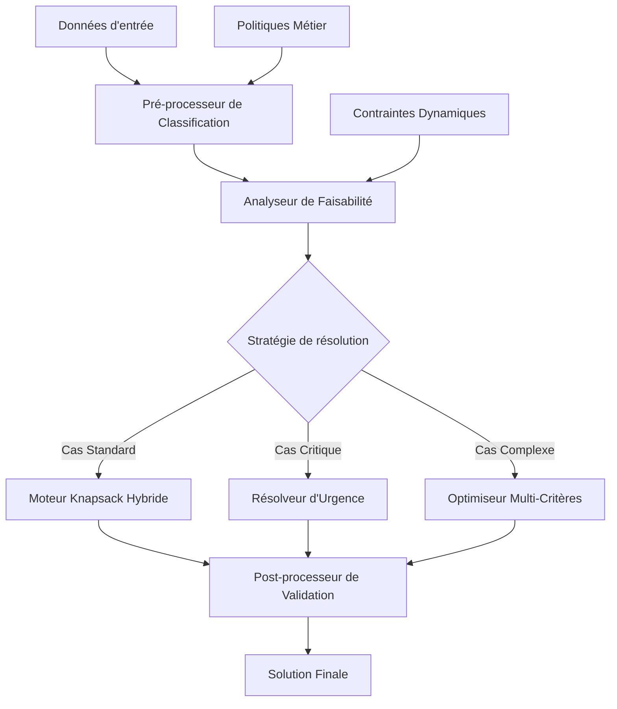
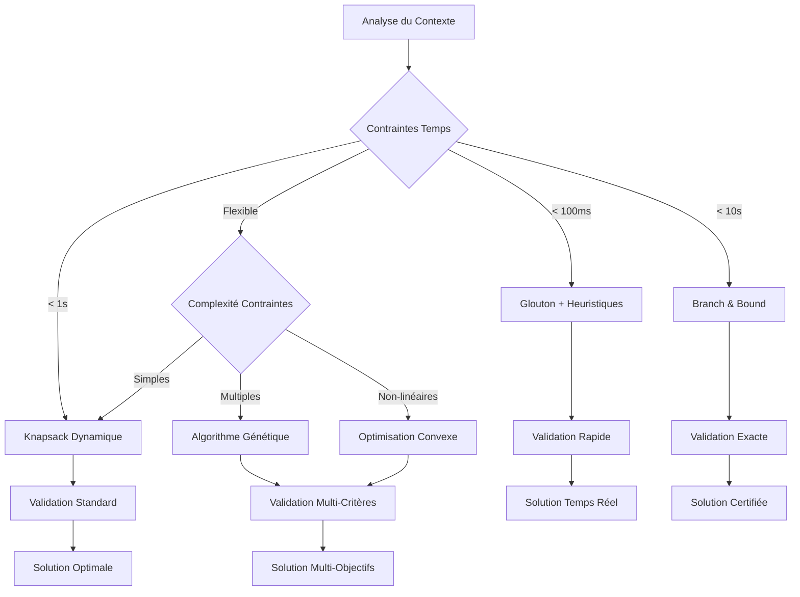

# Architecture Optimale : Système de Sélection de Matériels avec Contraintes de Criticité

## Vue d'ensemble du Séquencement Optimal

### Objectifs Identifiés
1. **Respect absolu** des priorités critiques
2. **Optimisation** dans les contraintes de faisabilité
3. **Robustesse** face aux ajustements automatiques
4. **Flexibilité** pour différents contextes opérationnels

---

## Architecture Modulaire Recommandée



---

## Séquencement Détaillé Optimal

### Phase 1 : Pré-traitement et Classification

```python
FONCTION PreTraitementOptimal(materiels_bruts, contexte_operationnel)
DEBUT
    // 1.1 Classification multi-niveaux
    materiels_classes = ClassifierParCriticite(materiels_bruts, contexte_operationnel)
    
    // 1.2 Enrichissement contextuel
    POUR CHAQUE materiel DANS materiels_classes FAIRE
        materiel.poids_ajuste = CalculerPoidsContextuel(materiel, contexte_operationnel)
        materiel.valeur_ajustee = CalculerValeurContextuelle(materiel, contexte_operationnel)
        materiel.contraintes_specifiques = ExtraireContraintes(materiel)
    FIN_POUR
    
    // 1.3 Détection des dépendances
    dependances = AnalyserDependances(materiels_classes)
    
    RETOURNER {materiels_classes, dependances}
FIN
```

### Phase 2 : Analyse de Faisabilité Avancée

```python
FONCTION AnalyseFaisabiliteAvancee(materiels, contraintes, capacite)
DEBUT
    // 2.1 Séparation par criticité avec sous-niveaux
    ultra_critiques = FILTRER(materiels, grade = CRITIQUE_A)
    critiques = FILTRER(materiels, grade = CRITIQUE_B)
    urgents_prioritaires = FILTRER(materiels, grade = URGENT_A)
    urgents_secondaires = FILTRER(materiels, grade = URGENT_B)
    optionnels = FILTRER(materiels, grade IN [NORMAL, FAIBLE])
    
    // 2.2 Vérification par paliers
    scenarios = [
        {obligatoires: ultra_critiques, nom: "Minimal"},
        {obligatoires: ultra_critiques + critiques, nom: "Standard"},
        {obligatoires: ultra_critiques + critiques + urgents_prioritaires, nom: "Complet"}
    ]
    
    POUR CHAQUE scenario DANS scenarios FAIRE
        scenario.faisable = VerifierCapacite(scenario.obligatoires, capacite)
        scenario.marge = capacite - CalculerPoids(scenario.obligatoires)
    FIN_POUR
    
    // 2.3 Sélection du meilleur scenario faisable
    scenario_optimal = TrouverMeilleurScenarioFaisable(scenarios)
    
    RETOURNER scenario_optimal
FIN
```

### Phase 3 : Moteur de Résolution Hybride

```python
FONCTION MoteurKnapsackHybride(scenario_optimal, materiels_restants, capacite_restante)
DEBUT
    solution = scenario_optimal.obligatoires
    
    SI capacite_restante > 0 ALORS
        // 3.1 Algorithme principal selon contexte
        SI EstContexteTempsReel() ALORS
            selection_optionnelle = KnapsackGlouton(materiels_restants, capacite_restante)
        SINON SI EstContexteOptimalite() ALORS
            selection_optionnelle = KnapsackDynamique(materiels_restants, capacite_restante)
        SINON
            selection_optionnelle = KnapsackHybride(materiels_restants, capacite_restante)
        FIN_SI
        
        // 3.2 Validation des contraintes croisées
        selection_validee = ValiderContraintesCroisees(solution + selection_optionnelle)
        solution = FUSIONNER(solution, selection_validee)
    FIN_SI
    
    RETOURNER solution
FIN
```

---

## Algorithmes Complémentaires Intégrés

### 1. Knapsack Dynamique (Précision Maximale)
```python
FONCTION KnapsackDynamique(materiels, capacite)
    // Implémentation classique DP O(n*W)
    // Usage: Contextes où la précision prime
```

### 2. Knapsack Glouton (Performance Temps Réel)
```python
FONCTION KnapsackGlouton(materiels, capacite)
    // Tri par ratio valeur/poids O(n log n)
    // Usage: Contraintes temps strict
```

### 3. Algorithme Génétique (Cas Complexes)
```python
FONCTION OptimisationGenetique(materiels, contraintes_multiples, capacite)
    // Résolution de contraintes multiples non-linéaires
    // Usage: Optimisation multi-objectifs
```

### 4. Branch & Bound (Solutions Exactes)
```python
FONCTION BranchAndBound(materiels, contraintes, capacite)
    // Solution optimale garantie
    // Usage: Cas critiques nécessitant certification
```

---

## Stratégie de Sélection d'Algorithme



---

## Interface Unifiée Recommandée

```python
CLASSE GestionnaireKnapsackOptimal:
    FONCTION resoudre(materiels, contraintes, contexte):
        // Phase 1: Pré-traitement
        donnees_enrichies = self.pre_traitement(materiels, contexte)
        
        // Phase 2: Analyse de faisabilité
        scenario = self.analyser_faisabilite(donnees_enrichies, contraintes)
        
        // Phase 3: Sélection de stratégie
        strategie = self.selectionner_strategie(contexte, scenario)
        
        // Phase 4: Résolution
        solution = self.executer_strategie(strategie, scenario)
        
        // Phase 5: Post-traitement
        solution_validee = self.valider_solution(solution, contraintes)
        
        RETOURNER solution_validee
```

---

## Optimisations Avancées Recommandées

### 1. Cache Intelligent
```python
// Mise en cache des solutions partielles
// Réutilisation pour contextes similaires
cache_solutions = CacheLRU(taille_max=1000)
```

### 2. Parallélisation
```python
// Traitement parallèle des scenarios
// Exploration simultanée de branches
pool_workers = ThreadPoolExecutor(max_workers=cpu_count())
```

### 3. Apprentissage Adaptatif
```python
// Ajustement automatique des paramètres
// Basé sur l'historique des performances
modele_apprentissage = ModelePredictifPerformances()
```

### 4. Monitoring en Temps Réel
```python
// Métriques de performance
// Alertes sur dégradations
moniteur = MoniteurPerformances(seuils_critiques)
```

---

## Configuration Contextuelle

### Contexte Production Critique
```yaml
configuration_critique:
  algorithme_principal: "branch_and_bound"
  timeout_max: 10000ms
  validation_double: true
  logging_detaille: true
```

### Contexte Temps Réel
```yaml
configuration_temps_reel:
  algorithme_principal: "glouton_optimise"
  timeout_max: 50ms
  validation_rapide: true
  approximation_acceptable: 5%
```

### Contexte Recherche/Développement
```yaml
configuration_recherche:
  algorithme_principal: "genetique"
  iterations_max: 10000
  exploration_complete: true
  metrics_detaillees: true
```

---

## Métriques de Performance Recommandées

| Métrique | Seuil Critique | Seuil Dégradé |
|----------|---------------|---------------|
| Temps résolution | < 1s | < 5s |
| Précision solution | > 95% | > 90% |
| Utilisation mémoire | < 100MB | < 500MB |
| Taux inclusion critiques | 100% | 98% |

---

## Conclusion

Cette architecture optimale combine :

1. **Flexibilité algorithmique** : Choix automatique selon le contexte
2. **Robustesse opérationnelle** : Respect garanti des criticités
3. **Performance adaptative** : Optimisation selon les contraintes temps
4. **Extensibilité** : Intégration facile de nouveaux algorithmes
5. **Observabilité** : Monitoring et métriques complètes

L'approche modulaire permet d'adapter dynamiquement la stratégie de résolution tout en garantissant le respect des contraintes métier critiques.