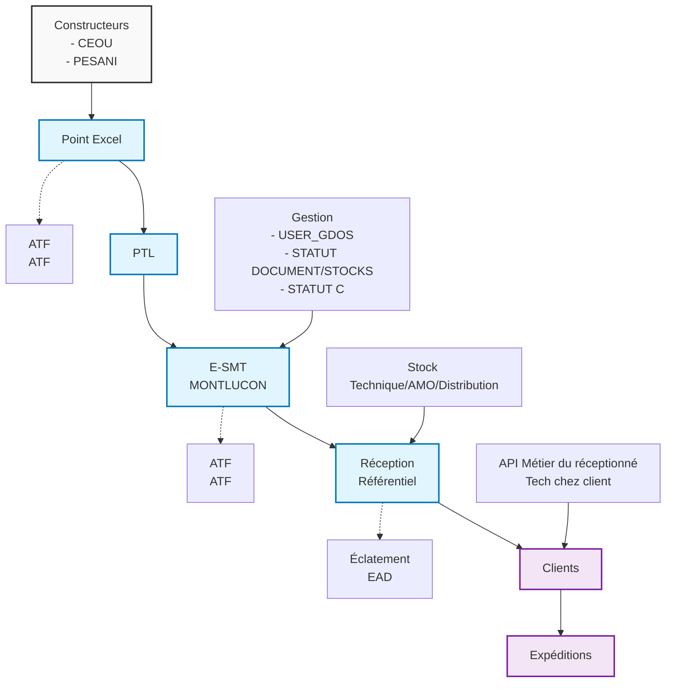
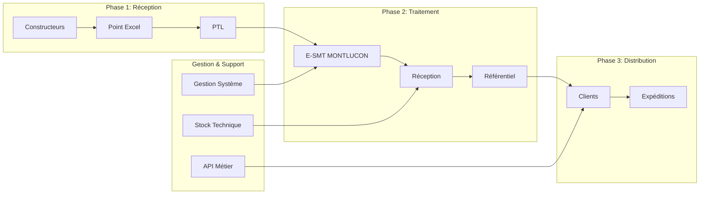
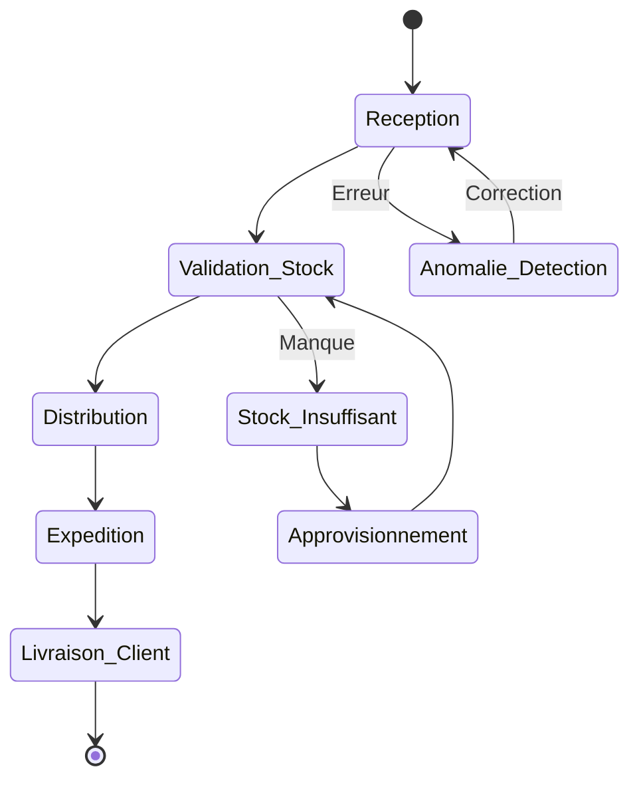
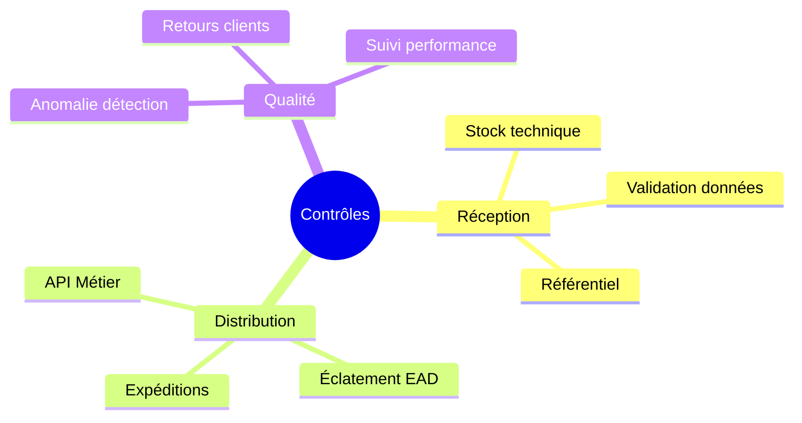

# Cartographie de la Chaîne Logistique

## Vue d'ensemble du processus logistique

## Flux détaillé des données

## Processus de gestion par statut

## Types de flux identifiés

| Type | Description | Responsable |
|------|-------------|------------|
| 🔴 **Flux Excel** | Données constructeurs | CEOU, PESANI |
| ⚠️ **Flux Technique** | Traitement E-SMT | MONTLUCON |
| 🔵 **Flux Réception** | Gestion stocks/référentiel | Système interne |
| ⭕ **Flux Client** | Distribution finale | Clients |
| 🟡 **Flux Retour** | Retours clients | Service client |

## Points de contrôle critiques

## Annotations techniques

- **ATF (ATF)** : Points de validation automatique
- **EAD** : Éclatement automatique des données
- **API Métier** : Interface technique client
- **USER_GDOS** : Gestion documentaire et stocks
- **STATUT C** : Contrôle statut commandes

## Actions recommandées

1. **Amélioration** : Automatisation du flux Excel → PTL
2. **Monitoring** : Mise en place d'alertes sur les points critiques
3. **Optimisation** : Réduction des étapes manuelles
4. **Traçabilité** : Renforcement du suivi bout en bout

---
*Cartographie générée à partir de l'analyse des processus logistiques - Version 1.0*