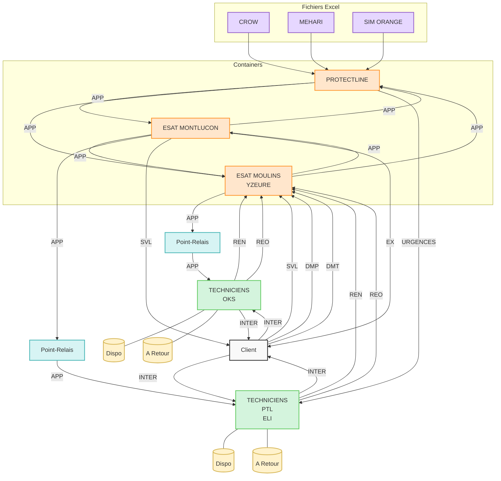

# Diagramme Mermaid - Système de gestion

```mermaid
graph TD
    %% Fichiers Excel
    subgraph "Fichiers Excel"
        CROW[CROW]
        MEHARI[MEHARI]
        SIM["SIM ORANGE"]
    end

    %% Conteneurs
    subgraph "Containers"
        PTL[PROTECTLINE]
        ESAT_M[ESAT MOULINS<br/>YZEURE]
        ESAT_MONT[ESAT MONTLUCON]
    end

    %% Points-Relais et Techniciens
    PR1[Point-Relais]
    PR2[Point-Relais]
    TECH_OKS[TECHNICIENS<br/>OKS]
    TECH_PTL[TECHNICIENS<br/>PTL<br/>ELI]

    %% Client et états
    CLIENT[Client]
    DISPO1[(Dispo)]
    DISPO2[(Dispo)]
    RETOUR1[(A Retour)]
    RETOUR2[(A Retour)]

    %% Connexions depuis fichiers Excel vers PROTECTLINE
    CROW --> PTL
    MEHARI --> PTL
    SIM --> PTL

    %% Connexions APP entre conteneurs
    PTL -->|APP| ESAT_MONT
    ESAT_MONT -->|APP| PTL
    PTL -->|APP| ESAT_M
    ESAT_M -->|APP| PTL
    ESAT_M -->|APP| ESAT_MONT
    ESAT_MONT -->|APP| ESAT_M

    %% Connexions vers Points-Relais
    ESAT_M -->|APP| PR1
    ESAT_MONT -->|APP| PR2

    %% Connexions vers Techniciens
    PR1 -->|APP| TECH_OKS
    PR2 -->|APP| TECH_PTL

    %% États des techniciens
    TECH_OKS --- DISPO1
    TECH_OKS --- RETOUR1
    TECH_PTL --- DISPO2
    TECH_PTL --- RETOUR2

    %% Connexions Client
    ESAT_MONT -->|SVL| CLIENT
    ESAT_MONT -->|EX| CLIENT
    CLIENT -->|SVL| ESAT_M
    CLIENT -->|DMP| ESAT_M
    CLIENT -->|DMT| ESAT_M

    %% Retours techniciens vers conteneurs
    TECH_OKS -->|REN| ESAT_M
    TECH_OKS -->|REO| ESAT_M
    TECH_PTL -->|REN| ESAT_M
    TECH_PTL -->|REO| ESAT_M

    %% Urgences
    PTL -->|URGENCES| TECH_PTL

    %% Interventions
    TECH_OKS -->|INTER| CLIENT
    CLIENT -->|INTER| TECH_OKS
    CLIENT -->|INTER| TECH_PTL
    TECH_PTL -->|INTER| CLIENT

    %% Styles
    classDef excelFiles fill:#e6d7ff,stroke:#9966cc,stroke-width:2px
    classDef containers fill:#ffe6cc,stroke:#ff9933,stroke-width:2px
    classDef relais fill:#d7f4f4,stroke:#4db8b8,stroke-width:2px
    classDef techniciens fill:#d4f4dd,stroke:#66cc66,stroke-width:2px
    classDef client fill:#f9f9f9,stroke:#333,stroke-width:2px
    classDef storage fill:#fff2cc,stroke:#d6b656,stroke-width:2px

    class CROW,MEHARI,SIM excelFiles
    class PTL,ESAT_M,ESAT_MONT containers
    class PR1,PR2 relais
    class TECH_OKS,TECH_PTL techniciens
    class CLIENT client
    class DISPO1,DISPO2,RETOUR1,RETOUR2 storage
```