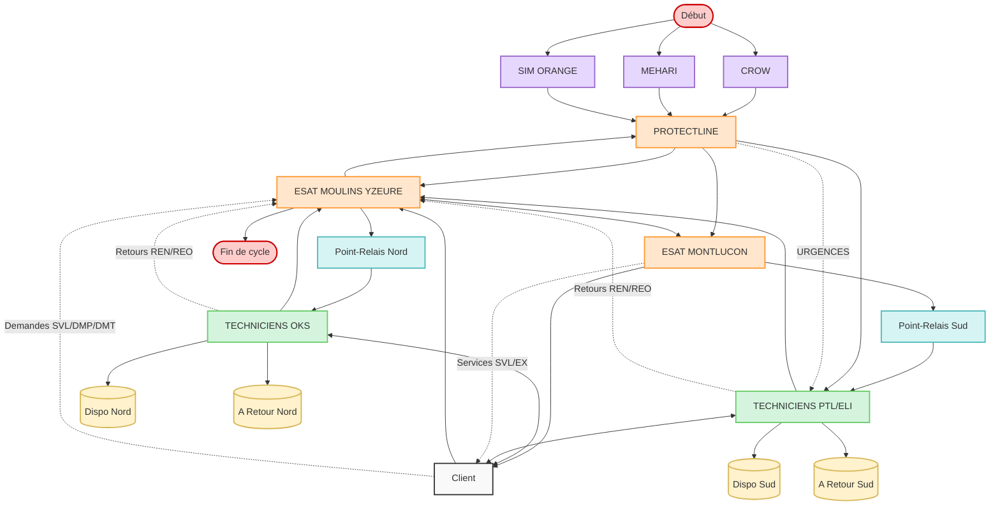

# Diagramme Mermaid - Cycle de vie du système de gestion

```mermaid
flowchart TD
    %% Phase d'initialisation
    START([Début]) --> CROW[CROW]
    START --> MEHARI[MEHARI]
    START --> SIM[SIM ORANGE]

    CROW --> PTL[PROTECTLINE]
    MEHARI --> PTL
    SIM --> PTL

    %% Phase de distribution
    PTL --> ESAT_M[ESAT MOULINS YZEURE]
    PTL --> ESAT_MONT[ESAT MONTLUCON]
    ESAT_M <--> ESAT_MONT

    %% Phase de préparation
    ESAT_M --> PR1[Point-Relais Nord]
    ESAT_MONT --> PR2[Point-Relais Sud]

    PR1 --> TECH_OKS[TECHNICIENS OKS]
    PR2 --> TECH_PTL[TECHNICIENS PTL/ELI]

    TECH_OKS --> DISPO1[(Dispo Nord)]
    TECH_OKS --> RETOUR1[(A Retour Nord)]
    TECH_PTL --> DISPO2[(Dispo Sud)]
    TECH_PTL --> RETOUR2[(A Retour Sud)]

    %% Phase de service client
    ESAT_MONT --> CLIENT[Client]
    CLIENT --> ESAT_M

    %% Interventions bidirectionnelles
    TECH_OKS <--> CLIENT
    TECH_PTL <--> CLIENT

    %% Phase de retour
    TECH_OKS --> ESAT_M
    TECH_PTL --> ESAT_M

    %% Gestion des urgences
    PTL --> TECH_PTL

    %% Retour au cycle
    ESAT_M --> PTL

    %% Fin
    ESAT_M --> END([Fin de cycle])

    %% Labels sur les flèches
    ESAT_MONT -.->|Services SVL/EX| CLIENT
    CLIENT -.->|Demandes SVL/DMP/DMT| ESAT_M
    TECH_OKS -.->|Retours REN/REO| ESAT_M
    TECH_PTL -.->|Retours REN/REO| ESAT_M
    PTL -.->|URGENCES| TECH_PTL

    %% Styles
    classDef excelFiles fill:#e6d7ff,stroke:#9966cc,stroke-width:2px
    classDef containers fill:#ffe6cc,stroke:#ff9933,stroke-width:2px
    classDef relais fill:#d7f4f4,stroke:#4db8b8,stroke-width:2px
    classDef techniciens fill:#d4f4dd,stroke:#66cc66,stroke-width:2px
    classDef client fill:#f9f9f9,stroke:#333,stroke-width:2px
    classDef storage fill:#fff2cc,stroke:#d6b656,stroke-width:2px
    classDef startend fill:#ffcccc,stroke:#cc0000,stroke-width:2px

    class CROW,MEHARI,SIM excelFiles
    class PTL,ESAT_M,ESAT_MONT containers
    class PR1,PR2 relais
    class TECH_OKS,TECH_PTL techniciens
    class CLIENT client
    class DISPO1,DISPO2,RETOUR1,RETOUR2 storage
    class START,END startend
```
