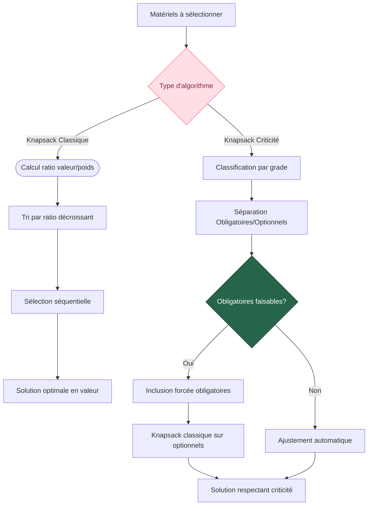
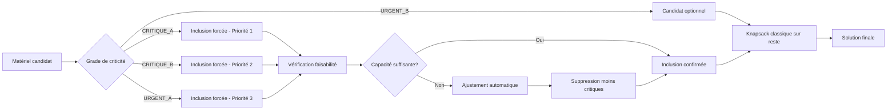

# Comparaison : Knapsack Classique vs Knapsack avec Contraintes de Criticité

## Vue d'ensemble

### Knapsack Classique
Optimise uniquement le **ratio valeur/poids** sans considération de priorité.

### Knapsack avec Contraintes de Criticité
Optimise en respectant une **hiérarchie stricte de criticité** avant la valeur.

---

## Diagramme de Flux Comparatif



---

## Exemple Concret

### Données d'entrée

| Matériel | Valeur | Poids | Grade | Ratio V/P |
|----------|--------|--------|--------|-----------|
| A        | 10     | 8      | CRITIQUE_A | 1.25 |
| B        | 15     | 5      | URGENT_B   | 3.00 |
| C        | 8      | 3      | CRITIQUE_B | 2.67 |
| D        | 12     | 6      | URGENT_A   | 2.00 |
| E        | 6      | 2      | URGENT_B   | 3.00 |

**Capacité disponible : 12**

---

## Résultats Comparés

### Knapsack Classique

```
Tri par ratio V/P décroissant:
1. B (ratio: 3.00, poids: 5) ✓
2. E (ratio: 3.00, poids: 2) ✓ 
3. C (ratio: 2.67, poids: 3) ✓
4. D (ratio: 2.00, poids: 6) ✗ (dépassement)
5. A (ratio: 1.25, poids: 8) ✗ (dépassement)

Sélection: [B, E, C]
Poids total: 10/12
Valeur totale: 29
```

### Knapsack avec Contraintes de Criticité

```
Classification:
- Obligatoires: [A, C, D] (CRITIQUE_A, CRITIQUE_B, URGENT_A)
- Optionnels: [B, E] (URGENT_B)

Étape 1 - Inclusion obligatoires:
Poids obligatoires: 8 + 3 + 6 = 17 > 12 ⚠️

Ajustement automatique (suppression moins critique):
- Garder A (CRITIQUE_A): poids 8
- Garder C (CRITIQUE_B): poids 3
- Supprimer D (URGENT_A): moins critique
Poids: 11/12

Étape 2 - Optionnels sur capacité restante (1):
Aucun optionnel ne rentre

Sélection: [A, C]
Poids total: 11/12
Valeur totale: 18
```

---

## Diagramme de Décision



---

## Analyse Comparative

| Critère | Knapsack Classique | Knapsack Criticité |
|---------|-------------------|-------------------|
| **Objectif** | Maximiser valeur totale | Respecter hiérarchie critique |
| **Flexibilité** | Totale sur sélection | Contrainte par priorités |
| **Valeur optimale** | Garantie mathématique | Peut être sous-optimale |
| **Robustesse** | Sensible aux outliers | Stable par construction |
| **Cas d'usage** | Optimisation pure | Systèmes critiques/urgents |

---

## Divergences Clés

### 1. **Ordre de traitement**
- **Classique** : Tri par efficacité (ratio V/P)
- **Criticité** : Tri par importance opérationnelle

### 2. **Contraintes**
- **Classique** : Seulement la capacité
- **Criticité** : Capacité + hiérarchie obligatoire

### 3. **Optimisation**
- **Classique** : Globale sur tous les éléments
- **Criticité** : Locale sur éléments optionnels uniquement

### 4. **Garanties**
- **Classique** : Valeur maximale possible
- **Criticité** : Inclusion assurée des éléments critiques

---

## Conclusion

Le **knapsack avec contraintes de criticité** sacrifie l'optimalité mathématique au profit de la **robustesse opérationnelle**, garantissant que les éléments les plus importants sont toujours inclus, même au détriment de la valeur totale.

Cette approche est particulièrement adaptée aux contextes où certains éléments sont **indispensables** (systèmes de sécurité, équipements critiques, etc.) et où l'omission d'un élément critique aurait des conséquences plus graves qu'une perte d'efficacité globale.


flowchart TD
    A["Matériels à sélectionner"] --> B@{ label: "Type d'algorithme" }
    B -- Knapsack Classique --> C(["Calcul ratio valeur/poids"])
    C --> D["Tri par ratio décroissant"]
    D --> E["Sélection séquentielle"]
    E --> F["Solution optimale en valeur"]
    B -- Knapsack Criticité --> G["Classification par grade"]
    G --> H["Séparation Obligatoires/Optionnels"]
    H --> I{"Obligatoires faisables?"}
    I -- Non --> J["Ajustement automatique"]
    I -- Oui --> K["Inclusion forcée obligatoires"]
    K --> L["Knapsack classique sur optionnels"]
    L --> M["Solution respectant criticité"]
    J --> M

    B@{ shape: diamond}
     B:::Rose
     I:::Pine
    classDef Pine stroke-width:1px, stroke-dasharray:none, stroke:#254336, fill:#27654A, color:#FFFFFF
    classDef Rose stroke-width:1px, stroke-dasharray:none, stroke:#FF5978, fill:#FFDFE5, color:#8E2236


