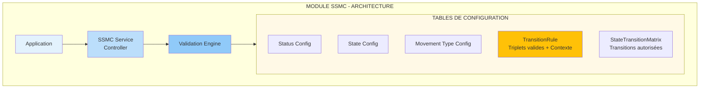
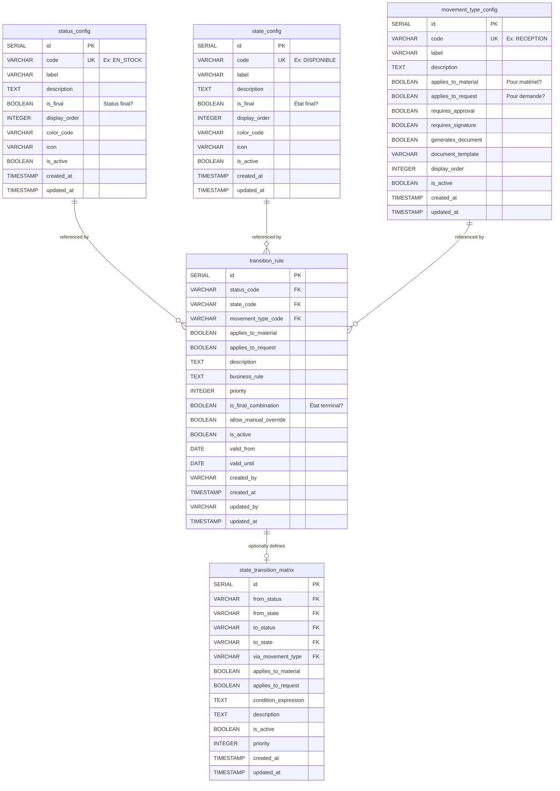
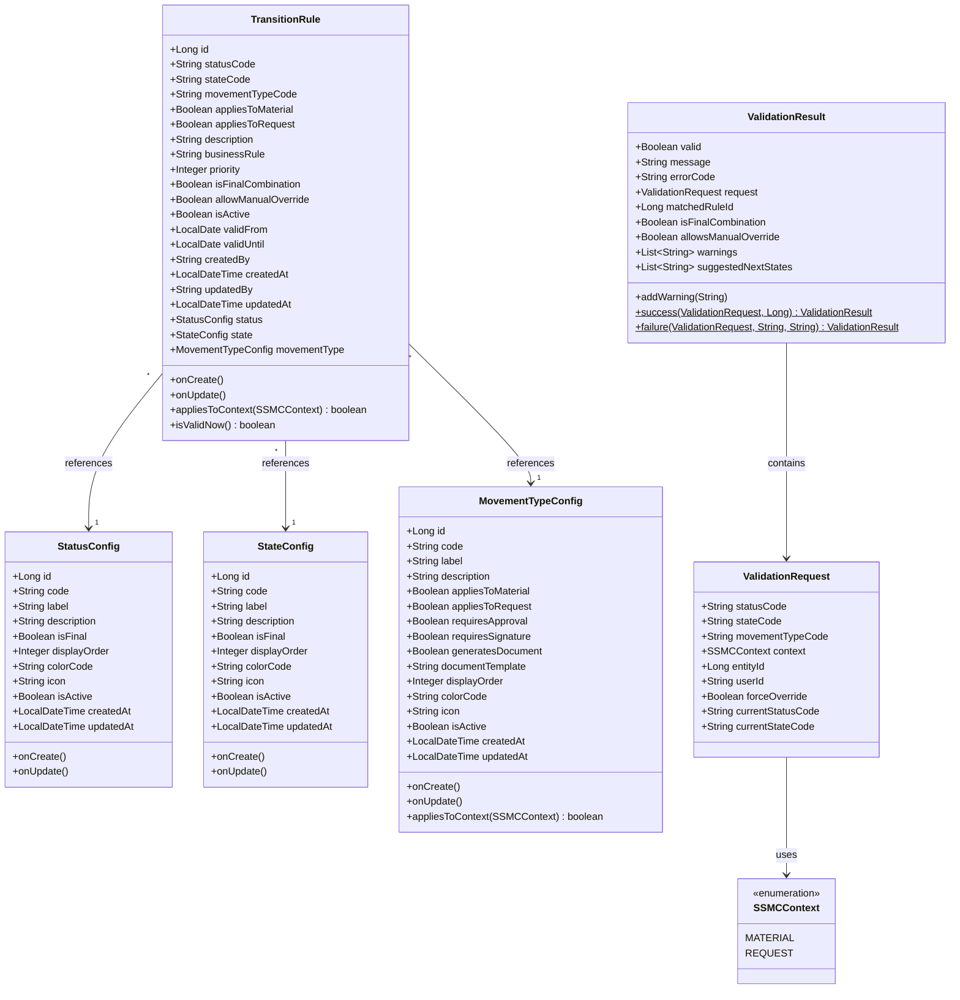
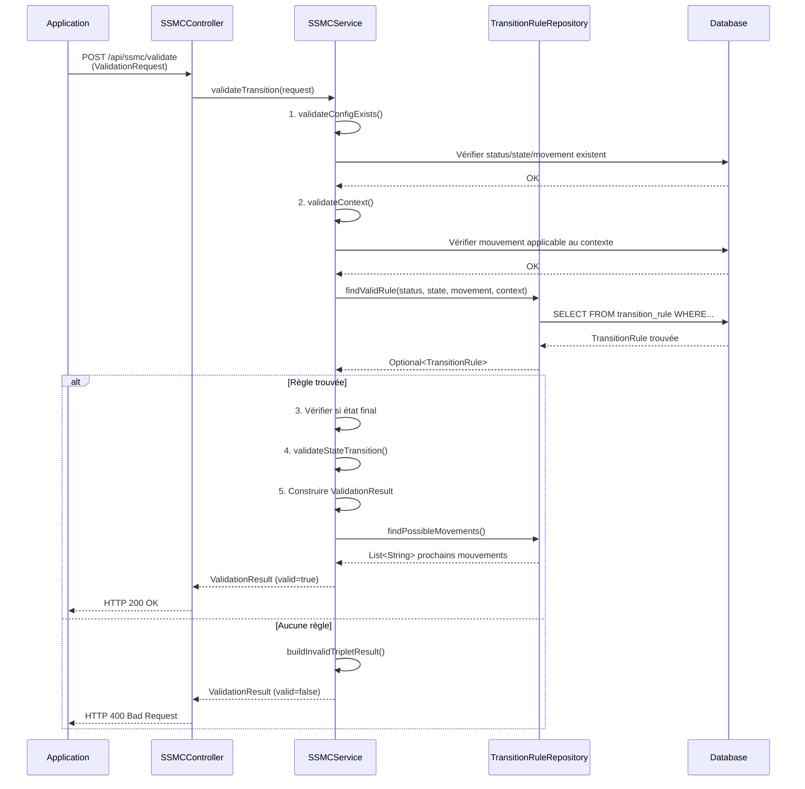

# Module SSMC

**Status State Movement_type Controller**

*Modélisation et Architecture Générique*

---

## Table des Matières

- [1. Objectifs et Vision du Module SSMC](#1-objectifs-et-vision-du-module-ssmc)
- [2. Modèle de Données](#2-modèle-de-données)
- [3. Modèle Objet (Java / Spring Boot)](#3-modèle-objet-java--spring-boot)

---

## 1. Objectifs et Vision du Module SSMC

### Objectif du Module

Le module **SSMC (Status State Movement_type Controller)** est un contrôleur intelligent qui :

- **Vérifie l'éligibilité** de toute modification sur les champs (status, state, movement_type)
- **Valide les transitions** selon des règles paramétrables stockées en base de données
- **Gère le contexte** : différencie les mouvements de matériels vs demandes
- **Supporte les états finaux** : détecte quand un objet atteint un état terminal
- **Est 100% paramétrable** : aucune règle hard-codée dans le code
- **Extensible** : facile d'ajouter de nouveaux status, states, movement types

### ⚠️ Principe Fondamental

Le module SSMC ne contient **AUCUNE logique métier hard-codée**. Toutes les règles sont définies dans des **tables de configuration en base de données**. Cela permet de :

- Modifier les règles sans redéploiement du code
- Ajouter de nouveaux triplets valides facilement
- Maintenir le système via une interface d'administration
- Versionner les règles métier
- Tester différentes configurations

### Concepts Clés à Modéliser

#### Dimensions de Variation

| Dimension | Variations | Impact |
|-----------|------------|--------|
| **Movement Type** | • Propre à un Matériel<br>• Propre à une Demande | Détermine le contexte de validation<br>(ex: RECEPTION = matériel, RESERVATION = demande) |
| **State** | • État intermédiaire<br>• État final | État final = aucune transition sortante possible<br>(ex: DETRUIT, ARCHIVE, CLOTURE) |
| **Status** | • Status intermédiaire<br>• Status final | Status final = phase terminale du cycle de vie<br>(ex: REBUT, TERMINE) |
| **Combinaison (Status, State)** | • Combinaison transitoire<br>• Combinaison finale | Combinaison finale = état terminal absolu<br>(ex: REBUT + DETRUIT = vraiment terminé) |
| **Niveau d'Application** | • Matériel<br>• Demande<br>• Les deux | Certaines règles s'appliquent aux deux contextes<br>(ex: ANNULATION possible pour matériel ET demande) |

---

## 2. Modèle de Données

### Architecture Générale



### Entités de Configuration

#### 1. Table : status_config

Définit tous les **status** possibles avec leurs propriétés.

```sql
CREATE TABLE status_config (
    id                  SERIAL PRIMARY KEY,
    code                VARCHAR(50) UNIQUE NOT NULL,     -- Ex: EN_STOCK, EN_TRANSIT, LIVRE
    label               VARCHAR(100) NOT NULL,           -- Libellé affiché
    description         TEXT,
    is_final            BOOLEAN DEFAULT false,           -- Status final ? (REBUT, TERMINE)
    display_order       INTEGER DEFAULT 0,               -- Ordre d'affichage
    color_code          VARCHAR(7),                      -- Code couleur pour UI (#FF5733)
    icon                VARCHAR(50),                     -- Icône associée
    is_active           BOOLEAN DEFAULT true,            -- Actif/Inactif
    created_at          TIMESTAMP DEFAULT CURRENT_TIMESTAMP,
    updated_at          TIMESTAMP DEFAULT CURRENT_TIMESTAMP
);

-- Index pour performances
CREATE INDEX idx_status_code ON status_config(code);
CREATE INDEX idx_status_active ON status_config(is_active);

-- Exemples de données
INSERT INTO status_config (code, label, is_final, display_order) VALUES
('EN_STOCK', 'En Stock', false, 1),
('EN_TRANSIT', 'En Transit', false, 2),
('LIVRE', 'Livré', false, 3),
('RETOUR', 'Retour', false, 4),
('MAINTENANCE', 'Maintenance', false, 5),
('REBUT', 'Rebut', true, 6),         -- STATUS FINAL
('ARCHIVE', 'Archivé', true, 7);     -- STATUS FINAL
```

#### 2. Table : state_config

Définit tous les **états** possibles avec leurs propriétés.

```sql
CREATE TABLE state_config (
    id                  SERIAL PRIMARY KEY,
    code                VARCHAR(50) UNIQUE NOT NULL,     -- Ex: DISPONIBLE, RESERVE, EN_COURS
    label               VARCHAR(100) NOT NULL,
    description         TEXT,
    is_final            BOOLEAN DEFAULT false,           -- État final ?
    display_order       INTEGER DEFAULT 0,
    color_code          VARCHAR(7),
    icon                VARCHAR(50),
    is_active           BOOLEAN DEFAULT true,
    created_at          TIMESTAMP DEFAULT CURRENT_TIMESTAMP,
    updated_at          TIMESTAMP DEFAULT CURRENT_TIMESTAMP
);

CREATE INDEX idx_state_code ON state_config(code);
CREATE INDEX idx_state_active ON state_config(is_active);

-- Exemples de données
INSERT INTO state_config (code, label, is_final, display_order) VALUES
('DISPONIBLE', 'Disponible', false, 1),
('RESERVE', 'Réservé', false, 2),
('EN_COURS', 'En Cours', false, 3),
('EN_ATTENTE', 'En Attente', false, 4),
('TERMINE', 'Terminé', false, 5),      -- Peut être final selon le context
('DETRUIT', 'Détruit', true, 6),       -- ÉTAT FINAL
('CLOTURE', 'Clôturé', true, 7);       -- ÉTAT FINAL
```

#### 3. Table : movement_type_config

Définit tous les **types de mouvement** avec leur contexte d'application.

```sql
CREATE TABLE movement_type_config (
    id                  SERIAL PRIMARY KEY,
    code                VARCHAR(50) UNIQUE NOT NULL,     -- Ex: RECEPTION, EXPEDITION
    label               VARCHAR(100) NOT NULL,
    description         TEXT,

    -- CONTEXTE D'APPLICATION (dimension clé)
    applies_to_material BOOLEAN DEFAULT false,           -- S'applique aux matériels ?
    applies_to_request  BOOLEAN DEFAULT false,           -- S'applique aux demandes ?

    -- Propriétés
    requires_approval   BOOLEAN DEFAULT false,           -- Nécessite approbation ?
    requires_signature  BOOLEAN DEFAULT false,           -- Nécessite signature ?
    generates_document  BOOLEAN DEFAULT false,           -- Génère un document (bon, facture) ?
    document_template   VARCHAR(100),                    -- Template du document

    display_order       INTEGER DEFAULT 0,
    color_code          VARCHAR(7),
    icon                VARCHAR(50),
    is_active           BOOLEAN DEFAULT true,
    created_at          TIMESTAMP DEFAULT CURRENT_TIMESTAMP,
    updated_at          TIMESTAMP DEFAULT CURRENT_TIMESTAMP
);

CREATE INDEX idx_movement_code ON movement_type_config(code);
CREATE INDEX idx_movement_material ON movement_type_config(applies_to_material);
CREATE INDEX idx_movement_request ON movement_type_config(applies_to_request);

-- Exemples de données
INSERT INTO movement_type_config
    (code, label, applies_to_material, applies_to_request, generates_document)
VALUES
-- Mouvements MATÉRIEL
('RECEPTION', 'Réception', true, false, true),
('AJUSTEMENT', 'Ajustement Stock', true, false, false),
('INVENTAIRE', 'Inventaire', true, false, true),
('MAINTENANCE', 'Envoi Maintenance', true, false, true),
('DESTRUCTION', 'Destruction', true, false, true),

-- Mouvements DEMANDE
('RESERVATION', 'Réservation', false, true, true),
('VALIDATION', 'Validation Demande', false, true, false),
('ANNULATION', 'Annulation', false, true, true),
('CLOTURE', 'Clôture', false, true, false),

-- Mouvements MIXTES (matériel ET demande)
('EXPEDITION', 'Expédition', true, true, true),
('LIVRAISON', 'Livraison', true, true, true),
('RETOUR', 'Retour', true, true, true);
```

#### 4. Table : transition_rule

**Cœur du système** : Définit tous les triplets (status, state, movement_type) valides avec leur contexte d'application.

```sql
CREATE TABLE transition_rule (
    id                  SERIAL PRIMARY KEY,

    -- TRIPLET
    status_code         VARCHAR(50) NOT NULL,
    state_code          VARCHAR(50) NOT NULL,
    movement_type_code  VARCHAR(50) NOT NULL,

    -- CONTEXTE D'APPLICATION
    applies_to_material BOOLEAN DEFAULT true,
    applies_to_request  BOOLEAN DEFAULT true,

    -- MÉTADONNÉES
    description         TEXT,
    business_rule       TEXT,                            -- Règle métier associée
    priority            INTEGER DEFAULT 0,               -- Priorité (si plusieurs règles matchent)

    -- ÉTAT DE LA COMBINAISON
    is_final_combination BOOLEAN DEFAULT false,          -- Combinaison finale ?
    allow_manual_override BOOLEAN DEFAULT false,         -- Autorise forçage manuel ?

    -- VALIDITÉ
    is_active           BOOLEAN DEFAULT true,
    valid_from          DATE,
    valid_until         DATE,

    -- AUDIT
    created_by          VARCHAR(100),
    created_at          TIMESTAMP DEFAULT CURRENT_TIMESTAMP,
    updated_by          VARCHAR(100),
    updated_at          TIMESTAMP DEFAULT CURRENT_TIMESTAMP,

    -- CONTRAINTES
    CONSTRAINT fk_status FOREIGN KEY (status_code)
        REFERENCES status_config(code) ON UPDATE CASCADE,
    CONSTRAINT fk_state FOREIGN KEY (state_code)
        REFERENCES state_config(code) ON UPDATE CASCADE,
    CONSTRAINT fk_movement FOREIGN KEY (movement_type_code)
        REFERENCES movement_type_config(code) ON UPDATE CASCADE,

    -- Unicité par contexte
    CONSTRAINT uk_transition UNIQUE (status_code, state_code, movement_type_code,
                                     applies_to_material, applies_to_request)
);

-- Index pour performances
CREATE INDEX idx_transition_lookup ON transition_rule(status_code, state_code, movement_type_code);
CREATE INDEX idx_transition_material ON transition_rule(applies_to_material);
CREATE INDEX idx_transition_request ON transition_rule(applies_to_request);
CREATE INDEX idx_transition_active ON transition_rule(is_active);

-- Exemples de données
INSERT INTO transition_rule
    (status_code, state_code, movement_type_code, applies_to_material, applies_to_request,
     is_final_combination, description)
VALUES
-- Triplets MATÉRIEL
('EN_STOCK', 'DISPONIBLE', 'RECEPTION', true, false, false,
 'Réception matériel en stock disponible'),
('EN_STOCK', 'DISPONIBLE', 'AJUSTEMENT', true, false, false,
 'Ajustement stock disponible'),
('EN_STOCK', 'RESERVE', 'RESERVATION', true, true, false,
 'Réservation matériel (contexte mixte)'),
('EN_TRANSIT', 'EN_COURS', 'EXPEDITION', true, true, false,
 'Expédition en transit (contexte mixte)'),
('LIVRE', 'TERMINE', 'LIVRAISON', true, true, false,
 'Livraison terminée'),
('REBUT', 'DETRUIT', 'DESTRUCTION', true, false, true,
 'Destruction matériel - ÉTAT FINAL'),

-- Triplets DEMANDE
('EN_COURS', 'EN_ATTENTE', 'VALIDATION', false, true, false,
 'Validation demande en attente'),
('EN_COURS', 'CLOTURE', 'CLOTURE', false, true, true,
 'Clôture demande - ÉTAT FINAL'),

-- Triplets MIXTES
('RETOUR', 'EN_COURS', 'RETOUR', true, true, false,
 'Retour en cours (matériel et demande)');
```

> **Note importante :** La combinaison des champs `applies_to_material` et `applies_to_request` permet de définir si une règle s'applique :
> - **Uniquement aux matériels** : (true, false)
> - **Uniquement aux demandes** : (false, true)
> - **Aux deux contextes** : (true, true)

#### 5. Table : state_transition_matrix (Optionnelle)

Définit les **transitions d'état autorisées** (comme une State Machine). Complète les règles de triplets.

```sql
CREATE TABLE state_transition_matrix (
    id                  SERIAL PRIMARY KEY,

    -- TRANSITION
    from_status         VARCHAR(50) NOT NULL,
    from_state          VARCHAR(50) NOT NULL,
    to_status           VARCHAR(50) NOT NULL,
    to_state            VARCHAR(50) NOT NULL,
    via_movement_type   VARCHAR(50) NOT NULL,           -- Mouvement qui déclenche

    -- CONTEXTE
    applies_to_material BOOLEAN DEFAULT true,
    applies_to_request  BOOLEAN DEFAULT true,

    -- CONDITIONS (optionnel, pour règles avancées)
    condition_expression TEXT,                          -- Ex: "stock > 0 AND order_exists"

    -- MÉTADONNÉES
    description         TEXT,
    is_active           BOOLEAN DEFAULT true,
    priority            INTEGER DEFAULT 0,

    created_at          TIMESTAMP DEFAULT CURRENT_TIMESTAMP,
    updated_at          TIMESTAMP DEFAULT CURRENT_TIMESTAMP,

    -- CONTRAINTES
    CONSTRAINT fk_from_status FOREIGN KEY (from_status)
        REFERENCES status_config(code),
    CONSTRAINT fk_from_state FOREIGN KEY (from_state)
        REFERENCES state_config(code),
    CONSTRAINT fk_to_status FOREIGN KEY (to_status)
        REFERENCES status_config(code),
    CONSTRAINT fk_to_state FOREIGN KEY (to_state)
        REFERENCES state_config(code),
    CONSTRAINT fk_via_movement FOREIGN KEY (via_movement_type)
        REFERENCES movement_type_config(code)
);

CREATE INDEX idx_transition_from ON state_transition_matrix(from_status, from_state);
CREATE INDEX idx_transition_to ON state_transition_matrix(to_status, to_state);

-- Exemples de données
INSERT INTO state_transition_matrix
    (from_status, from_state, to_status, to_state, via_movement_type,
     applies_to_material, applies_to_request, description)
VALUES
('EN_STOCK', 'DISPONIBLE', 'EN_STOCK', 'RESERVE', 'RESERVATION',
 true, true, 'Réservation : disponible → réservé'),
('EN_STOCK', 'RESERVE', 'EN_TRANSIT', 'EN_COURS', 'EXPEDITION',
 true, true, 'Expédition : réservé → en transit'),
('EN_TRANSIT', 'EN_COURS', 'LIVRE', 'TERMINE', 'LIVRAISON',
 true, true, 'Livraison : en transit → livré'),
('LIVRE', 'TERMINE', 'RETOUR', 'EN_COURS', 'RETOUR',
 true, true, 'Retour : livré → retour en cours'),
('RETOUR', 'EN_COURS', 'EN_STOCK', 'DISPONIBLE', 'RECEPTION',
 true, false, 'Remise en stock après retour');
```

### Diagramme ERD du Modèle



---

## 3. Modèle Objet (Java / Spring Boot)

### Diagramme de Classes UML



### Entités JPA

#### StatusConfig.java

```java
package com.logistics.ssmc.model;

import jakarta.persistence.*;
import lombok.*;
import java.time.LocalDateTime;

@Entity
@Table(name = "status_config")
@Data
@NoArgsConstructor
@AllArgsConstructor
@Builder
public class StatusConfig {

    @Id
    @GeneratedValue(strategy = GenerationType.IDENTITY)
    private Long id;

    @Column(unique = true, nullable = false, length = 50)
    private String code;

    @Column(nullable = false, length = 100)
    private String label;

    @Column(columnDefinition = "TEXT")
    private String description;

    // Propriété clé : est-ce un status final ?
    @Column(name = "is_final")
    private Boolean isFinal = false;

    @Column(name = "display_order")
    private Integer displayOrder = 0;

    @Column(name = "color_code", length = 7)
    private String colorCode;

    @Column(length = 50)
    private String icon;

    @Column(name = "is_active")
    private Boolean isActive = true;

    @Column(name = "created_at")
    private LocalDateTime createdAt;

    @Column(name = "updated_at")
    private LocalDateTime updatedAt;

    @PrePersist
    protected void onCreate() {
        createdAt = LocalDateTime.now();
        updatedAt = LocalDateTime.now();
    }

    @PreUpdate
    protected void onUpdate() {
        updatedAt = LocalDateTime.now();
    }
}
```

#### StateConfig.java

```java
package com.logistics.ssmc.model;

import jakarta.persistence.*;
import lombok.*;
import java.time.LocalDateTime;

@Entity
@Table(name = "state_config")
@Data
@NoArgsConstructor
@AllArgsConstructor
@Builder
public class StateConfig {

    @Id
    @GeneratedValue(strategy = GenerationType.IDENTITY)
    private Long id;

    @Column(unique = true, nullable = false, length = 50)
    private String code;

    @Column(nullable = false, length = 100)
    private String label;

    @Column(columnDefinition = "TEXT")
    private String description;

    // Propriété clé : est-ce un état final ?
    @Column(name = "is_final")
    private Boolean isFinal = false;

    @Column(name = "display_order")
    private Integer displayOrder = 0;

    @Column(name = "color_code", length = 7)
    private String colorCode;

    @Column(length = 50)
    private String icon;

    @Column(name = "is_active")
    private Boolean isActive = true;

    @Column(name = "created_at")
    private LocalDateTime createdAt;

    @Column(name = "updated_at")
    private LocalDateTime updatedAt;

    @PrePersist
    protected void onCreate() {
        createdAt = LocalDateTime.now();
        updatedAt = LocalDateTime.now();
    }

    @PreUpdate
    protected void onUpdate() {
        updatedAt = LocalDateTime.now();
    }
}
```

#### MovementTypeConfig.java

```java
package com.logistics.ssmc.model;

import jakarta.persistence.*;
import lombok.*;
import java.time.LocalDateTime;

@Entity
@Table(name = "movement_type_config")
@Data
@NoArgsConstructor
@AllArgsConstructor
@Builder
public class MovementTypeConfig {

    @Id
    @GeneratedValue(strategy = GenerationType.IDENTITY)
    private Long id;

    @Column(unique = true, nullable = false, length = 50)
    private String code;

    @Column(nullable = false, length = 100)
    private String label;

    @Column(columnDefinition = "TEXT")
    private String description;

    // Propriétés clés : contexte d'application
    @Column(name = "applies_to_material")
    private Boolean appliesToMaterial = false;

    @Column(name = "applies_to_request")
    private Boolean appliesToRequest = false;

    // Propriétés métier
    @Column(name = "requires_approval")
    private Boolean requiresApproval = false;

    @Column(name = "requires_signature")
    private Boolean requiresSignature = false;

    @Column(name = "generates_document")
    private Boolean generatesDocument = false;

    @Column(name = "document_template", length = 100)
    private String documentTemplate;

    @Column(name = "display_order")
    private Integer displayOrder = 0;

    @Column(name = "color_code", length = 7)
    private String colorCode;

    @Column(length = 50)
    private String icon;

    @Column(name = "is_active")
    private Boolean isActive = true;

    @Column(name = "created_at")
    private LocalDateTime createdAt;

    @Column(name = "updated_at")
    private LocalDateTime updatedAt;

    @PrePersist
    protected void onCreate() {
        createdAt = LocalDateTime.now();
        updatedAt = LocalDateTime.now();
    }

    @PreUpdate
    protected void onUpdate() {
        updatedAt = LocalDateTime.now();
    }

    // Méthodes utilitaires
    public boolean appliesToContext(SSMCContext context) {
        return (context == SSMCContext.MATERIAL && appliesToMaterial)
            || (context == SSMCContext.REQUEST && appliesToRequest);
    }
}
```

#### TransitionRule.java

```java
package com.logistics.ssmc.model;

import jakarta.persistence.*;
import lombok.*;
import java.time.LocalDate;
import java.time.LocalDateTime;

@Entity
@Table(name = "transition_rule")
@Data
@NoArgsConstructor
@AllArgsConstructor
@Builder
public class TransitionRule {

    @Id
    @GeneratedValue(strategy = GenerationType.IDENTITY)
    private Long id;

    // TRIPLET
    @Column(name = "status_code", nullable = false, length = 50)
    private String statusCode;

    @Column(name = "state_code", nullable = false, length = 50)
    private String stateCode;

    @Column(name = "movement_type_code", nullable = false, length = 50)
    private String movementTypeCode;

    // CONTEXTE D'APPLICATION
    @Column(name = "applies_to_material")
    private Boolean appliesToMaterial = true;

    @Column(name = "applies_to_request")
    private Boolean appliesToRequest = true;

    // MÉTADONNÉES
    @Column(columnDefinition = "TEXT")
    private String description;

    @Column(name = "business_rule", columnDefinition = "TEXT")
    private String businessRule;

    @Column
    private Integer priority = 0;

    // ÉTAT DE LA COMBINAISON
    @Column(name = "is_final_combination")
    private Boolean isFinalCombination = false;

    @Column(name = "allow_manual_override")
    private Boolean allowManualOverride = false;

    // VALIDITÉ
    @Column(name = "is_active")
    private Boolean isActive = true;

    @Column(name = "valid_from")
    private LocalDate validFrom;

    @Column(name = "valid_until")
    private LocalDate validUntil;

    // AUDIT
    @Column(name = "created_by", length = 100)
    private String createdBy;

    @Column(name = "created_at")
    private LocalDateTime createdAt;

    @Column(name = "updated_by", length = 100)
    private String updatedBy;

    @Column(name = "updated_at")
    private LocalDateTime updatedAt;

    // Relations (ManyToOne lazy)
    @ManyToOne(fetch = FetchType.LAZY)
    @JoinColumn(name = "status_code", referencedColumnName = "code",
                insertable = false, updatable = false)
    private StatusConfig status;

    @ManyToOne(fetch = FetchType.LAZY)
    @JoinColumn(name = "state_code", referencedColumnName = "code",
                insertable = false, updatable = false)
    private StateConfig state;

    @ManyToOne(fetch = FetchType.LAZY)
    @JoinColumn(name = "movement_type_code", referencedColumnName = "code",
                insertable = false, updatable = false)
    private MovementTypeConfig movementType;

    @PrePersist
    protected void onCreate() {
        createdAt = LocalDateTime.now();
        updatedAt = LocalDateTime.now();
    }

    @PreUpdate
    protected void onUpdate() {
        updatedAt = LocalDateTime.now();
    }

    // Méthodes utilitaires
    public boolean appliesToContext(SSMCContext context) {
        return (context == SSMCContext.MATERIAL && appliesToMaterial)
            || (context == SSMCContext.REQUEST && appliesToRequest);
    }

    public boolean isValidNow() {
        LocalDate now = LocalDate.now();
        return isActive
            && (validFrom == null || !now.isBefore(validFrom))
            && (validUntil == null || !now.isAfter(validUntil));
    }
}
```

#### Enum SSMCContext.java

```java
package com.logistics.ssmc.model;

public enum SSMCContext {
    /**
     * Contexte Matériel : les modifications concernent un matériel physique
     */
    MATERIAL,

    /**
     * Contexte Demande : les modifications concernent une demande/commande
     */
    REQUEST
}
```

### DTOs et Résultats de Validation

#### ValidationRequest.java

```java
package com.logistics.ssmc.dto;

import com.logistics.ssmc.model.SSMCContext;
import lombok.*;

@Data
@Builder
@NoArgsConstructor
@AllArgsConstructor
public class ValidationRequest {

    // TRIPLET À VALIDER
    private String statusCode;
    private String stateCode;
    private String movementTypeCode;

    // CONTEXTE
    private SSMCContext context;              // MATERIAL ou REQUEST

    // CONTEXTE ADDITIONNEL (optionnel)
    private Long entityId;                     // ID du matériel ou de la demande
    private String userId;                     // Utilisateur qui fait la modification
    private Boolean forceOverride = false;   // Forcer la validation ?

    // ÉTAT ACTUEL (pour validation de transition)
    private String currentStatusCode;
    private String currentStateCode;
}
```

#### ValidationResult.java

```java
package com.logistics.ssmc.dto;

import lombok.*;
import java.util.ArrayList;
import java.util.List;

@Data
@Builder
@NoArgsConstructor
@AllArgsConstructor
public class ValidationResult {

    // RÉSULTAT
    private Boolean valid;
    private String message;
    private String errorCode;

    // DÉTAILS
    private ValidationRequest request;
    private Long matchedRuleId;                // ID de la règle matchée
    private Boolean isFinalCombination;       // Est-ce un état final ?
    private Boolean allowsManualOverride;     // Peut-on forcer ?

    // WARNINGS (liste des avertissements)
    @Builder.Default
    private List<String> warnings = new ArrayList<>();

    // SUGGESTIONS (prochains états possibles)
    @Builder.Default
    private List<String> suggestedNextStates = new ArrayList<>();

    // Méthodes utilitaires
    public void addWarning(String warning) {
        if (warnings == null) {
            warnings = new ArrayList<>();
        }
        warnings.add(warning);
    }

    public static ValidationResult success(ValidationRequest request, Long ruleId) {
        return ValidationResult.builder()
            .valid(true)
            .message("Validation réussie")
            .request(request)
            .matchedRuleId(ruleId)
            .build();
    }

    public static ValidationResult failure(ValidationRequest request, String message, String errorCode) {
        return ValidationResult.builder()
            .valid(false)
            .message(message)
            .errorCode(errorCode)
            .request(request)
            .build();
    }
}
```

---

## Diagramme de Flux de Validation



---

## Points Clés de la Modélisation

### ✅ 100% Paramétrable
- Aucune règle hard-codée dans le code
- Toutes les règles dans `transition_rule` en base de données
- Modification sans redéploiement

### ✅ Gestion des Contextes
```sql
-- Mouvement UNIQUEMENT pour matériel
applies_to_material = true, applies_to_request = false

-- Mouvement UNIQUEMENT pour demande
applies_to_material = false, applies_to_request = true

-- Mouvement pour LES DEUX
applies_to_material = true, applies_to_request = true
```

### ✅ États Finaux
```sql
-- État final au niveau status
status_config.is_final = true  -- Ex: REBUT

-- État final au niveau state
state_config.is_final = true   -- Ex: DETRUIT

-- Combinaison finale (ne peut plus changer)
transition_rule.is_final_combination = true  -- Ex: (REBUT, DETRUIT)
```

### ✅ Extensibilité
Pour ajouter un nouveau triplet valide :
```sql
INSERT INTO transition_rule (
    status_code, state_code, movement_type_code,
    applies_to_material, applies_to_request,
    is_final_combination, description
) VALUES (
    'NOUVEAU_STATUS', 'NOUVEAU_STATE', 'NOUVEAU_MOVEMENT',
    true, false, false,
    'Description de la règle'
);
```

---

## Suite

Pour voir l'implémentation complète des Services, Repositories et Controllers, consultez le fichier `modelisation_ssmc_module_suite.html`.
