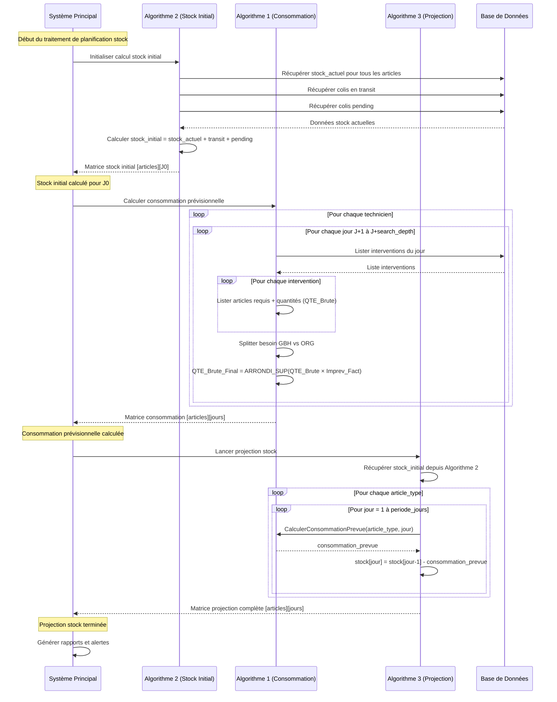

# Séquencement Optimal des Algorithmes de Gestion de Stock

## Vue d'ensemble

Ce document présente le séquencement optimal pour l'exécution de trois algorithmes interdépendants :

1. **Algorithme 1** : Calcul des besoins en consommation par technicien/jour
2. **Algorithme 2** : Calcul du stock initial 
3. **Algorithme 3** : Projection du stock jour par jour

## Séquencement Optimal

### Ordre d'exécution recommandé :

```
ALGORITHME 2 (Stock Initial) → ALGORITHME 1 (Consommation) → ALGORITHME 3 (Projection)
```

### Justification du séquencement :

1. **Algorithme 2 en premier** : Établit la baseline du stock disponible (stock actuel + transit + pending)
2. **Algorithme 1 en second** : Calcule les besoins de consommation prévisionnels 
3. **Algorithme 3 en dernier** : Utilise les résultats des deux premiers pour faire la projection

## Diagramme de Séquence Globale



## Détails Techniques du Séquencement

### Phase 1 : Algorithme 2 - Stock Initial
- **Entrées** : Liste des articles, données stock actuelles
- **Sorties** : Matrice `stock_projection[articles][0]` initialisée
- **Durée** : Synchrone, rapide (lecture BDD)

### Phase 2 : Algorithme 1 - Consommation
- **Entrées** : Planning interventions, données techniciens
- **Sorties** : Matrice consommation prévisionnelle par jour
- **Durée** : Plus longue (boucles imbriquées sur techniciens/jours/interventions)

### Phase 3 : Algorithme 3 - Projection
- **Entrées** : Stock initial (Phase 1) + Consommation prévisionnelle (Phase 2)  
- **Sorties** : Projection stock complète sur la période
- **Durée** : Rapide (calculs arithmétiques simples)

## Optimisations Possibles

### Parallélisation partielle :
- Les calculs de l'Algorithme 1 peuvent être parallélisés par technicien
- L'Algorithme 3 peut être parallélisé par type d'article

### Cache et optimisations :
- Mettre en cache les résultats de l'Algorithme 2 si les données stock n'évoluent pas
- Optimiser les requêtes BDD de l'Algorithme 1 avec des index appropriés

## Points de Contrôle

1. **Après Algorithme 2** : Vérifier que tous les articles ont un stock initial ≥ 0
2. **Après Algorithme 1** : Valider les totaux de consommation par rapport aux moyennes historiques  
3. **Après Algorithme 3** : Identifier les articles avec stock projeté négatif pour alertes
