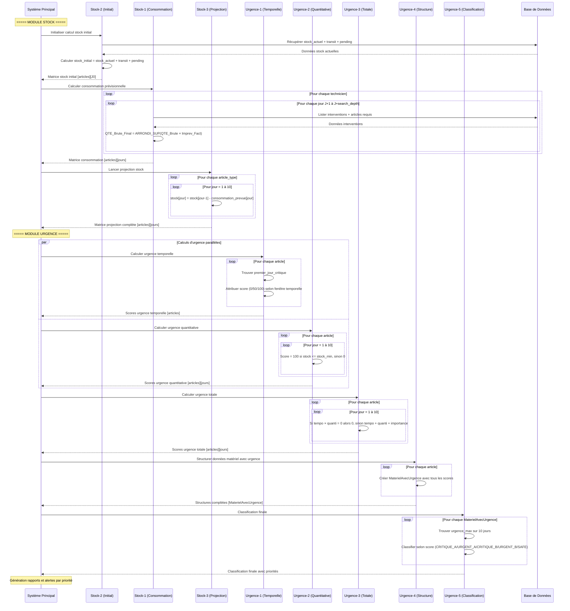

# Séquencement Optimal des Algorithmes de Gestion de Stock et d'Urgence

## Vue d'ensemble

Ce document présente le séquencement optimal pour l'exécution de 8 algorithmes interdépendants organisés en deux modules :

### Module Stock (Algorithmes de Base)
1. **Algorithme Stock-1** : Calcul des besoins en consommation par technicien/jour
2. **Algorithme Stock-2** : Calcul du stock initial 
3. **Algorithme Stock-3** : Projection du stock jour par jour

### Module Urgence (Algorithmes d'Analyse)
4. **Algorithme Urgence-1** : Calcul de l'urgence temporelle
5. **Algorithme Urgence-2** : Calcul de l'urgence quantitative
6. **Algorithme Urgence-3** : Calcul de l'urgence totale
7. **Algorithme Urgence-4** : Structuration des données matériel avec urgence
8. **Algorithme Urgence-5** : Classification des matériels par niveau d'urgence

## Séquencement Optimal

### Ordre d'exécution recommandé :

```
MODULE STOCK:
Stock-2 (Stock Initial) → Stock-1 (Consommation) → Stock-3 (Projection)

MODULE URGENCE:
Urgence-1 (Temporelle) ┐
                       ├→ Urgence-3 (Totale) → Urgence-4 (Structure) → Urgence-5 (Classification)
Urgence-2 (Quantitative) ┘
```

### Justification du séquencement :

**Module Stock** (séquentiel obligatoire) :
1. **Stock-2** : Établit la baseline du stock disponible (stock actuel + transit + pending)
2. **Stock-1** : Calcule les besoins de consommation prévisionnels 
3. **Stock-3** : Utilise les résultats des deux premiers pour faire la projection

**Module Urgence** (parallélisation possible) :
4. **Urgence-1 & Urgence-2** : Peuvent s'exécuter en parallèle (urgence temporelle et quantitative indépendantes)
5. **Urgence-3** : Combine les résultats d'Urgence-1 et Urgence-2
6. **Urgence-4** : Structure les données avec tous les indicateurs d'urgence
7. **Urgence-5** : Classification finale basée sur les scores calculés

## Diagramme de Séquence Globale



## Détails Techniques du Séquencement

### Module Stock (Phases 1-3 - Séquentielles)

**Phase 1 : Stock-2 - Stock Initial**
- **Entrées** : Liste des articles, données stock actuelles
- **Sorties** : Matrice `stock_projection[articles][0]` initialisée
- **Durée** : Synchrone, rapide (lecture BDD)

**Phase 2 : Stock-1 - Consommation**
- **Entrées** : Planning interventions, données techniciens
- **Sorties** : Matrice consommation prévisionnelle par jour
- **Durée** : Plus longue (boucles imbriquées sur techniciens/jours/interventions)

**Phase 3 : Stock-3 - Projection**
- **Entrées** : Stock initial (Phase 1) + Consommation prévisionnelle (Phase 2)  
- **Sorties** : Projection stock complète sur la période J0 à J+10
- **Durée** : Rapide (calculs arithmétiques simples)

### Module Urgence (Phases 4-8 - Parallélisation possible)

**Phase 4a : Urgence-1 - Urgence Temporelle** (Parallélisable avec Phase 4b)
- **Entrées** : Matrice projection stock, stock_min par article
- **Sorties** : Scores urgence temporelle {0, 50, 100} par article
- **Durée** : Rapide (analyse séquentielle sur 10 jours)

**Phase 4b : Urgence-2 - Urgence Quantitative** (Parallélisable avec Phase 4a)
- **Entrées** : Matrice projection stock, stock_min par article
- **Sorties** : Scores urgence quantitative {0, 100} par article/jour
- **Durée** : Rapide (comparaisons simples)

**Phase 5 : Urgence-3 - Urgence Totale**
- **Entrées** : Scores temporels + quantitatifs + importance matériels
- **Sorties** : Scores urgence totale {0, 160, 210, 250, 300} par article/jour
- **Durée** : Rapide (calculs arithmétiques)

**Phase 6 : Urgence-4 - Structure Données**
- **Entrées** : Tous les scores d'urgence calculés
- **Sorties** : Structures `MaterielAvecUrgence` complètes
- **Durée** : Très rapide (structuration mémoire)

**Phase 7 : Urgence-5 - Classification**
- **Entrées** : Structures `MaterielAvecUrgence`
- **Sorties** : Classification finale {CRITIQUE_A, URGENT_A, CRITIQUE_B, URGENT_B, SAFE}
- **Durée** : Très rapide (recherche maximum + classification)

## Optimisations Possibles

### Parallélisation par module :

**Module Stock :**
- **Stock-1** : Parallélisation par technicien (chaque technicien traité indépendamment)
- **Stock-3** : Parallélisation par type d'article (projections indépendantes)

**Module Urgence :**
- **Urgence-1 & Urgence-2** : Parallélisation complète (calculs indépendants)
- **Urgence-3, 4, 5** : Parallélisation par matériel (traitement indépendant par article)

### Cache et optimisations de performance :
- **Cache Stock-2** : Mise en cache si les données stock n'évoluent pas entre exécutions
- **Index BDD** : Optimiser les requêtes de Stock-1 avec index sur (technicien, date, article)
- **Pré-calcul** : Stocker les valeurs d'importance par matériel pour éviter les lookups
- **Mémoire partagée** : Partager la matrice projection entre les algorithmes d'urgence

### Optimisations algorithmiques :
- **Early termination** : Arrêter Urgence-1 dès détection du premier jour critique
- **Filtrage précoce** : Exclure les matériels SAFE des phases Urgence-4 et Urgence-5
- **Batch processing** : Traiter les matériels par lots pour optimiser l'usage mémoire

## Points de Contrôle et Validation

### Module Stock
1. **Après Stock-2** : Vérifier que tous les articles ont un stock initial ≥ 0
2. **Après Stock-1** : Valider les totaux de consommation par rapport aux moyennes historiques  
3. **Après Stock-3** : Identifier les articles avec stock projeté négatif pour alertes précoces

### Module Urgence
4. **Après Urgence-1** : Contrôler la cohérence des fenêtres temporelles (scores 0/50/100 uniquement)
5. **Après Urgence-2** : Vérifier que les scores quantitatifs sont binaires (0 ou 100)
6. **Après Urgence-3** : Valider les scores totaux dans la plage attendue {0, 160, 210, 250, 300}
7. **Après Urgence-4** : Contrôler l'intégrité des structures MaterielAvecUrgence
8. **Après Urgence-5** : Valider la répartition des classifications et identifier les matériels critiques

### Alertes et Reporting
- **Matériels CRITIQUE_A (300)** : Alerte immédiate, action urgente requise
- **Matériels URGENT_A (250)** : Notification prioritaire, planification rapide
- **Matériels CRITIQUE_B (210)** : Surveillance renforcée
- **Matériels URGENT_B (160)** : Suivi standard
- **Matériels SAFE (0)** : Aucune action requise

## Métriques de Performance

### Temps d'exécution estimé (pour 1000 matériels) :
- **Module Stock** : 2-5 secondes (dominé par Stock-1)
- **Module Urgence** : 0.5-1 seconde (calculs légers)
- **Total avec parallélisation** : 3-6 secondes
- **Total sans parallélisation** : 5-10 secondes

### Consommation mémoire :
- **Matrices principales** : ~10MB pour 1000 matériels sur 10 jours
- **Structures urgence** : ~5MB pour métadonnées complètes
- **Pic mémoire** : ~20MB pendant les phases de parallélisation
