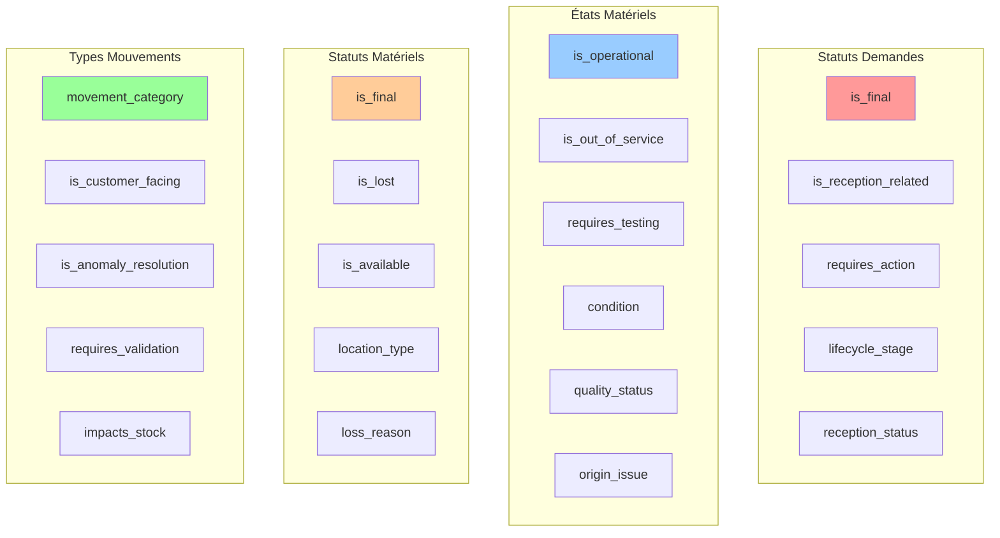
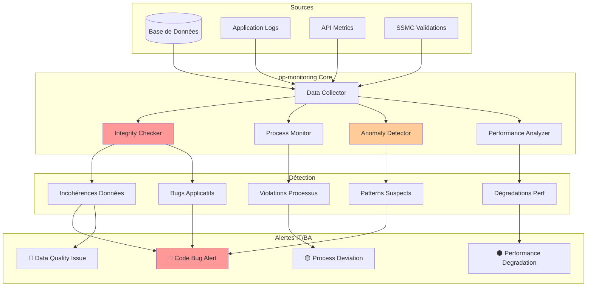
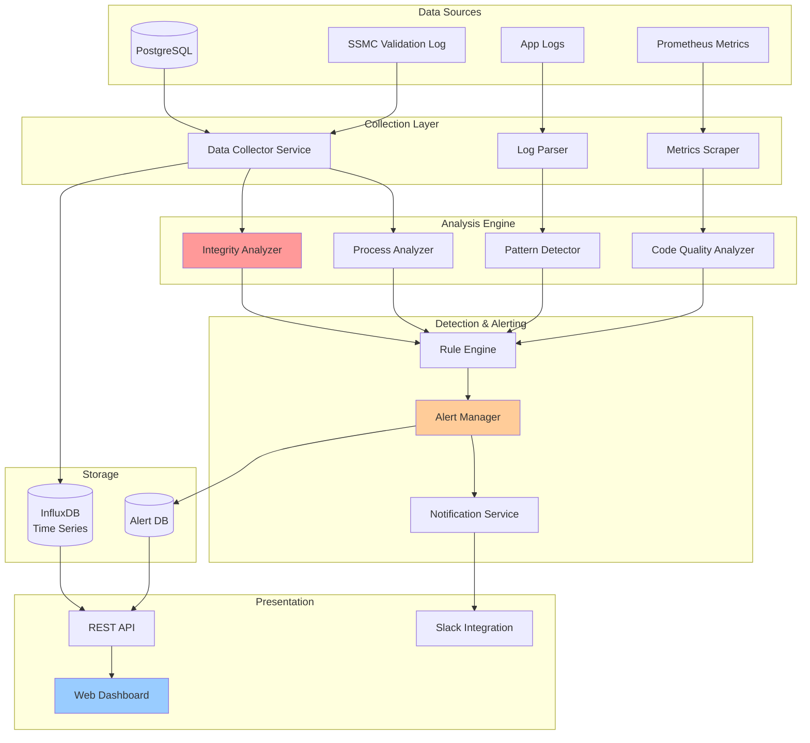

# Analyse SSMC avec Données Réelles & Monitoring Interne
## Classifications Avancées et Surveillance de l'Intégrité Système

---

## Table des matières

1. [Analyse des Données Réelles](#1-analyse-des-données-réelles)
2. [Classifications et Abstractions Avancées](#2-classifications-et-abstractions-avancées)
3. [Modélisation des Tables avec Classifications](#3-modélisation-des-tables-avec-classifications)
4. [Exemples de Règles SSMC avec Données Réelles](#4-exemples-de-règles-ssmc-avec-données-réelles)
5. [op-monitoring : Surveillance de l'Intégrité Système](#5-op-monitoring--surveillance-de-lintégrité-système)

---

## 1. Analyse des Données Réelles

### 1.1 Statuts de Demandes (Request Status)

| Code | Libellé | Analyse |
|------|---------|---------|
| **A** | Annulée | ⚫ État final - Demande abandonnée |
| **C** | en Cours | 🔵 État actif - Traitement en cours |
| **F** | à Faire | 🟡 État initial - Nécessite action |
| **NR** | Non reçue | 🟡 Réception - Attente de réception |
| **R** | Réceptionné | 🟢 Réception - Reçu complet |
| **RI** | Réception Incomplète | 🔴 Réception - Problème partiel |
| **RP** | Reçue Partiellement | 🟡 Réception - Réception partielle |
| **RT** | Réceptionné par Technicien | 🟢 Réception - Validé technicien |
| **T** | Traitée | ⚫ État final - Traitement terminé |
| **TP** | Traitée partiellement | ⚫ État final partiel - Clôture partielle |
| **V** | a Valider | 🟡 État validation - Nécessite approbation |

**Observations** :
- 3 statuts finaux : A, T, TP
- 5 statuts liés à la réception : NR, R, RI, RP, RT
- 2 statuts nécessitent action immédiate : F, V
- 1 statut de traitement actif : C

### 1.2 États de Matériels (Material State)

| Code | Libellé | Analyse |
|------|---------|---------|
| **AC** | A reconditionner | 🔧 Nécessite réparation/reconditionnement |
| **AR** | A rebuter | ⚫ À détruire - État final proche |
| **AT** | A tester | 🔬 Nécessite test/validation |
| **C** | A contrôler | 🔬 Nécessite contrôle qualité |
| **D** | Détérioré | 🔴 État dégradé - Problème |
| **DF** | Etat par defaut | 🟢 État par défaut système |
| **H** | Hors service Occasion | ⚫ Non opérationnel - Occasion |
| **HC** | Hors service cause client | ⚫ Non opérationnel - Cause externe |
| **HN** | Hors service Neuf | ⚫ Non opérationnel - Neuf défectueux |
| **NI** | Non identifiable | 🔴 Problème majeur - Non identifié |
| **ON** | Opérationnel neuf | 🟢 Fonctionnel - Neuf |
| **OO** | Opérationnel occasion | 🟢 Fonctionnel - Occasion |

**Observations** :
- 2 états opérationnels : ON, OO
- 4 états hors service : H, HC, HN, AR
- 3 états nécessitant action : AC, AT, C
- 2 états problématiques : D, NI
- États liés à l'âge/origine : ON vs OO, HN vs H

### 1.3 Statuts de Matériels (Material Status)

| Code | Libellé | Analyse |
|------|---------|---------|
| **A** | Attente retour client | 🟡 En attente - Chez client |
| **C** | Commandé | 🟡 Approvisionnement - En commande |
| **D** | Disponible technicien | 🟢 Disponible - Pour technicien |
| **DF** | Statut par defaut | 🟢 Statut par défaut système |
| **I** | Installé | 🔵 Opérationnel - Chez client |
| **IP** | Installé Produit | 🔵 Opérationnel - Installation produit |
| **N** | Perdu cause externe | ⚫ Perdu - Cause externe |
| **NR** | Non retour client définitif | ⚫ Perdu - Client ne retourne pas |
| **P** | Perdu cause tech | ⚫ Perdu - Cause technicien |
| **PC** | Perdu cause client | ⚫ Perdu - Cause client |
| **PD** | Perdu définitif | ⚫ Perdu - Définitif |
| **R** | A retourner tech | 🟡 En transit - Retour prévu |
| **RB** | Rebut | ⚫ Détruit - État final |
| **RE** | Reçu logistique | 🟢 En stock - Réception logistique |
| **S** | En stock | 🟢 En stock - Disponible |
| **T** | En Transit | 🟡 En mouvement - Transit |
| **V** | Vendu | ⚫ État final - Vendu |

**Observations** :
- 6 statuts finaux : V, RB, PD, NR, N, P, PC
- 5 statuts "perdu" avec nuances : N, NR, P, PC, PD
- 3 statuts stock/disponible : S, D, RE
- 2 statuts installés : I, IP
- 3 statuts en mouvement : T, R, A
- 1 statut commande : C

### 1.4 Types de Mouvements (Movement Types)

| Code | Libellé | Catégorie Identifiée |
|------|---------|---------------------|
| **SS** | Souscription-Installation | 📦 INSTALLATION/CLIENT |
| **SAV** | Service après-vente | 🔧 SAV |
| **EX (Install)** | Ajout d'option | 📦 INSTALLATION/OPTION |
| **EX (Logistique)** | Ajout d'option Logistique | 📦 LOGISTIQUE/OPTION |
| **VE** | Visite d'Entretien | 🔧 SAV/MAINTENANCE |
| **DMTP** | Démonte Payante | ⚫ RÉSILIATION |
| **DMT** | Résiliation | ⚫ RÉSILIATION |
| **REH** | Retour HS | ⬅️ RETOUR/HS |
| **REF** | Retour Fonctionnel / Surstock | ⬅️ RETOUR/OK |
| **SVL** | SAV Logistique | 🔧 SAV |
| **APP** | Approvisionnement | 📥 LOGISTIQUE/APPRO |
| **INV** | Inventaire | 📊 LOGISTIQUE/CONTROLE |
| **DMP** | Résiliation d'option | ⚫ RÉSILIATION |
| **DRA** | Demande RET Annulée | ❌ ANOMALIE/ANNULATION |
| **EMM** | Ecart Matériel Manquant en APP | ⚠️ ANOMALIE/ÉCART |
| **REB** | Mise au rebut | 🗑️ QUALITÉ/DESTRUCTION |
| **REC** | Reconditionnement | 🔧 QUALITÉ/RÉPARATION |
| **DES** | Déstockage Tech | 📤 LOGISTIQUE/SORTIE |
| **REG** | Régularisation | ⚠️ ANOMALIE/CORRECTION |
| **NRP** | Non Reçu Prévu | ⚠️ ANOMALIE/RÉCEPTION |
| **REI** | Réintégration | 📥 LOGISTIQUE/RETOUR |
| **MEP** | Matériel En Plus sur APP | ⚠️ ANOMALIE/ÉCART |
| **MRN** | Matériel Reçu Non prévu | ⚠️ ANOMALIE/RÉCEPTION |
| **TST** | Résultat Banc de Test | 🔬 QUALITÉ/TEST |
| **CTR** | Contrôle de surface | 🔬 QUALITÉ/CONTROLE |
| **ENR** | Enregistrement de matériel sur Installation | 📝 INSTALLATION/ENREG |
| **CRE** | Enregistrement de matériel sur Logistique | 📝 LOGISTIQUE/ENREG |
| **RFU** | ReFUs de la demande de retour tech | ❌ VALIDATION/REFUS |
| **VDR** | Validation de la Demande de Retour tech | ✅ VALIDATION/ACCEPTATION |
| **RLM** | Réception Logistique du Matériel | 📥 LOGISTIQUE/RÉCEPTION |
| **RAT** | Réception App par le Technicien | 📥 INSTALLATION/RÉCEPTION |

**Observations - Catégories identifiées** :
- **INSTALLATION/CLIENT** (5) : SS, EX (Install), ENR, RAT
- **SAV** (3) : SAV, SVL, VE
- **LOGISTIQUE** (8) : APP, INV, DES, REI, RLM, CRE, EX (Logistique)
- **RÉSILIATION** (3) : DMT, DMP, DMTP
- **RETOUR** (4) : REH, REF, RFU, VDR
- **QUALITÉ** (4) : REB, REC, TST, CTR
- **ANOMALIE/RÉGULARISATION** (6) : EMM, MEP, MRN, NRP, REG, DRA

---

## 2. Classifications et Abstractions Avancées

### 2.1 Classifications pour Statuts de Demandes

Au-delà de `is_final`, voici les classifications proposées :

| Classification | Valeurs | Codes Concernés |
|----------------|---------|-----------------|
| **is_final** | boolean | A, T, TP |
| **is_reception_related** | boolean | NR, R, RI, RP, RT |
| **requires_action** | boolean | F, V, RI |
| **is_in_progress** | boolean | C |
| **is_complete** | boolean | R, RT, T |
| **is_partial** | boolean | RI, RP, TP |
| **requires_validation** | boolean | V, RT |
| **has_issue** | boolean | RI, RP |
| **reception_status** | enum | NONE, PENDING, COMPLETE, PARTIAL, INCOMPLETE |
| **lifecycle_stage** | enum | INITIAL, RECEPTION, PROCESSING, VALIDATION, COMPLETED, CANCELLED |

**Exemple de mapping** :

```
Code: F (à Faire)
- is_final: false
- is_reception_related: false
- requires_action: true
- is_in_progress: false
- lifecycle_stage: INITIAL

Code: RI (Réception Incomplète)
- is_final: false
- is_reception_related: true
- requires_action: true
- has_issue: true
- is_partial: true
- reception_status: INCOMPLETE
- lifecycle_stage: RECEPTION

Code: T (Traitée)
- is_final: true
- is_complete: true
- lifecycle_stage: COMPLETED
```

### 2.2 Classifications pour États de Matériels

| Classification | Valeurs | Codes Concernés |
|----------------|---------|-----------------|
| **is_operational** | boolean | ON, OO |
| **is_out_of_service** | boolean | H, HC, HN, AR |
| **requires_testing** | boolean | AT, C |
| **requires_repair** | boolean | AC, D |
| **is_problematic** | boolean | D, NI, HC |
| **is_default** | boolean | DF |
| **is_repairable** | boolean | AC, D |
| **is_beyond_repair** | boolean | AR, H, HN |
| **condition** | enum | NEW, USED, REFURBISHED, DETERIORATED, UNUSABLE |
| **quality_status** | enum | OK, TO_TEST, TO_CONTROL, TO_REPAIR, REJECTED, UNKNOWN |
| **origin_issue** | enum | NONE, CLIENT_FAULT, INTERNAL_FAULT, UNKNOWN |

**Exemple de mapping** :

```
Code: ON (Opérationnel neuf)
- is_operational: true
- is_out_of_service: false
- condition: NEW
- quality_status: OK

Code: HC (Hors service cause client)
- is_operational: false
- is_out_of_service: true
- is_problematic: true
- is_beyond_repair: true
- condition: UNUSABLE
- quality_status: REJECTED
- origin_issue: CLIENT_FAULT

Code: AC (A reconditionner)
- is_operational: false
- requires_repair: true
- is_repairable: true
- condition: REFURBISHED
- quality_status: TO_REPAIR
```

### 2.3 Classifications pour Statuts de Matériels

| Classification | Valeurs | Codes Concernés |
|----------------|---------|-----------------|
| **is_final** | boolean | V, RB, PD, NR, N, P, PC |
| **is_lost** | boolean | N, NR, P, PC, PD |
| **is_available** | boolean | S, D, RE |
| **is_installed** | boolean | I, IP |
| **is_in_transit** | boolean | T, R, A |
| **is_in_stock** | boolean | S, RE |
| **is_ordered** | boolean | C |
| **requires_return** | boolean | R, A |
| **is_at_client** | boolean | I, IP, A |
| **is_at_technician** | boolean | D, R |
| **loss_reason** | enum | NONE, EXTERNAL, TECHNICIAN, CLIENT, DEFINITIVE, NO_RETURN |
| **location_type** | enum | STOCK, CLIENT, TECHNICIAN, TRANSIT, UNKNOWN, DESTROYED |
| **availability_status** | enum | AVAILABLE, INSTALLED, IN_TRANSIT, ORDERED, LOST, DESTROYED, WAITING |

**Exemple de mapping** :

```
Code: S (En stock)
- is_final: false
- is_available: true
- is_in_stock: true
- location_type: STOCK
- availability_status: AVAILABLE

Code: PC (Perdu cause client)
- is_final: true
- is_lost: true
- loss_reason: CLIENT
- location_type: UNKNOWN
- availability_status: LOST

Code: I (Installé)
- is_final: false
- is_installed: true
- is_at_client: true
- location_type: CLIENT
- availability_status: INSTALLED
```

### 2.4 Classifications pour Types de Mouvements

| Classification | Valeurs | Codes Concernés |
|----------------|---------|-----------------|
| **applies_to_material** | boolean | Tous |
| **applies_to_request** | boolean | Certains |
| **movement_category** | enum | INSTALLATION, SAV, LOGISTICS, TERMINATION, RETURN, QUALITY, ANOMALY, VALIDATION |
| **is_customer_facing** | boolean | SS, SAV, VE, DMT, DMTP, EX (Install) |
| **is_internal_logistics** | boolean | APP, INV, DES, REI, RLM, RAT, CRE |
| **is_quality_control** | boolean | REB, REC, TST, CTR |
| **is_anomaly_resolution** | boolean | EMM, MEP, MRN, NRP, REG, DRA |
| **is_termination** | boolean | DMT, DMP, DMTP, REB |
| **requires_validation** | boolean | VDR, RFU |
| **is_return_related** | boolean | REH, REF, RFU, VDR |
| **is_installation_related** | boolean | SS, EX (Install), ENR, RAT |
| **triggers_workflow** | boolean | VDR, RFU, DMT, SS |
| **is_corrective** | boolean | EMM, MEP, MRN, NRP, REG, DRA |
| **requires_technician** | boolean | SAV, VE, DES, RAT, TST, CTR |
| **impacts_stock** | boolean | APP, INV, DES, REI, RLM, REB |

**Exemple de mapping** :

```
Code: SS (Souscription-Installation)
- applies_to_material: true
- applies_to_request: true
- movement_category: INSTALLATION
- is_customer_facing: true
- is_installation_related: true
- triggers_workflow: true

Code: EMM (Ecart Matériel Manquant en APP)
- applies_to_material: true
- applies_to_request: false
- movement_category: ANOMALY
- is_anomaly_resolution: true
- is_corrective: true
- impacts_stock: true

Code: VDR (Validation de la Demande de Retour tech)
- applies_to_material: true
- applies_to_request: true
- movement_category: VALIDATION
- requires_validation: true
- is_return_related: true
- triggers_workflow: true
```

### 2.5 Résumé des Classifications Proposées



---

## 3. Modélisation des Tables avec Classifications

### 3.1 Table ref_request_status (Statuts Demandes)

```sql
CREATE TABLE ref_request_status (
    code                    VARCHAR(10) PRIMARY KEY,
    label                   VARCHAR(100) NOT NULL,
    description             TEXT,

    -- Classifications booléennes
    is_final                BOOLEAN DEFAULT false,
    is_reception_related    BOOLEAN DEFAULT false,
    requires_action         BOOLEAN DEFAULT false,
    is_in_progress          BOOLEAN DEFAULT false,
    is_complete             BOOLEAN DEFAULT false,
    is_partial              BOOLEAN DEFAULT false,
    requires_validation     BOOLEAN DEFAULT false,
    has_issue               BOOLEAN DEFAULT false,

    -- Classifications enum
    reception_status        VARCHAR(20) CHECK (reception_status IN
                            ('NONE', 'PENDING', 'COMPLETE', 'PARTIAL', 'INCOMPLETE')),
    lifecycle_stage         VARCHAR(20) CHECK (lifecycle_stage IN
                            ('INITIAL', 'RECEPTION', 'PROCESSING', 'VALIDATION', 'COMPLETED', 'CANCELLED')),

    -- Ordre de séquence (pour workflow)
    sequence_order          INTEGER,

    -- Gestion
    is_active               BOOLEAN DEFAULT true,
    created_at              TIMESTAMP DEFAULT CURRENT_TIMESTAMP,
    updated_at              TIMESTAMP
);

-- Index pour les requêtes fréquentes
CREATE INDEX idx_request_status_final ON ref_request_status(is_final) WHERE is_final = true;
CREATE INDEX idx_request_status_action ON ref_request_status(requires_action) WHERE requires_action = true;
CREATE INDEX idx_request_status_stage ON ref_request_status(lifecycle_stage);
```

**Exemples de données** :

```sql
INSERT INTO ref_request_status VALUES
('A', 'Annulée', 'Demande annulée', true, false, false, false, false, false, false, false, 'NONE', 'CANCELLED', 99, true),
('F', 'à Faire', 'Demande à traiter', false, false, true, false, false, false, false, false, 'NONE', 'INITIAL', 1, true),
('V', 'a Valider', 'En attente de validation', false, false, true, false, false, false, true, false, 'NONE', 'VALIDATION', 8, true),
('C', 'en Cours', 'Traitement en cours', false, false, false, true, false, false, false, false, 'NONE', 'PROCESSING', 5, true),
('NR', 'Non reçue', 'En attente de réception', false, true, true, false, false, false, false, false, 'PENDING', 'RECEPTION', 2, true),
('R', 'Réceptionné', 'Réception complète', false, true, false, false, true, false, false, false, 'COMPLETE', 'RECEPTION', 3, true),
('RI', 'Réception Incomplète', 'Réception incomplète', false, true, true, false, false, true, false, true, 'INCOMPLETE', 'RECEPTION', 4, true),
('RP', 'Reçue Partiellement', 'Réception partielle', false, true, false, false, false, true, false, true, 'PARTIAL', 'RECEPTION', 4, true),
('RT', 'Réceptionné par Technicien', 'Validé par technicien', false, true, false, false, true, false, true, false, 'COMPLETE', 'RECEPTION', 6, true),
('T', 'Traitée', 'Traitement terminé', true, false, false, false, true, false, false, false, 'NONE', 'COMPLETED', 10, true),
('TP', 'Traitée partiellement', 'Traitement partiel terminé', true, false, false, false, false, true, false, false, 'NONE', 'COMPLETED', 10, true);
```

### 3.2 Table ref_material_state (États Matériels)

```sql
CREATE TABLE ref_material_state (
    code                    VARCHAR(10) PRIMARY KEY,
    label                   VARCHAR(100) NOT NULL,
    description             TEXT,

    -- Classifications booléennes
    is_operational          BOOLEAN DEFAULT false,
    is_out_of_service       BOOLEAN DEFAULT false,
    requires_testing        BOOLEAN DEFAULT false,
    requires_repair         BOOLEAN DEFAULT false,
    is_problematic          BOOLEAN DEFAULT false,
    is_default              BOOLEAN DEFAULT false,
    is_repairable           BOOLEAN DEFAULT false,
    is_beyond_repair        BOOLEAN DEFAULT false,

    -- Classifications enum
    condition               VARCHAR(20) CHECK (condition IN
                            ('NEW', 'USED', 'REFURBISHED', 'DETERIORATED', 'UNUSABLE', 'UNKNOWN')),
    quality_status          VARCHAR(20) CHECK (quality_status IN
                            ('OK', 'TO_TEST', 'TO_CONTROL', 'TO_REPAIR', 'REJECTED', 'UNKNOWN')),
    origin_issue            VARCHAR(20) CHECK (origin_issue IN
                            ('NONE', 'CLIENT_FAULT', 'INTERNAL_FAULT', 'UNKNOWN')),

    -- Gestion
    is_active               BOOLEAN DEFAULT true,
    created_at              TIMESTAMP DEFAULT CURRENT_TIMESTAMP,
    updated_at              TIMESTAMP
);

CREATE INDEX idx_material_state_operational ON ref_material_state(is_operational);
CREATE INDEX idx_material_state_oos ON ref_material_state(is_out_of_service);
CREATE INDEX idx_material_state_quality ON ref_material_state(quality_status);
```

**Exemples de données** :

```sql
INSERT INTO ref_material_state VALUES
('DF', 'Etat par defaut', 'État par défaut', false, false, false, false, false, true, false, false, 'UNKNOWN', 'UNKNOWN', 'NONE', true),
('ON', 'Opérationnel neuf', 'Matériel neuf opérationnel', true, false, false, false, false, false, false, false, 'NEW', 'OK', 'NONE', true),
('OO', 'Opérationnel occasion', 'Matériel occasion opérationnel', true, false, false, false, false, false, false, false, 'USED', 'OK', 'NONE', true),
('AT', 'A tester', 'Nécessite test', false, false, true, false, false, false, false, false, 'UNKNOWN', 'TO_TEST', 'NONE', true),
('C', 'A contrôler', 'Nécessite contrôle qualité', false, false, true, false, false, false, false, false, 'UNKNOWN', 'TO_CONTROL', 'NONE', true),
('AC', 'A reconditionner', 'Nécessite reconditionnement', false, false, false, true, false, false, true, false, 'REFURBISHED', 'TO_REPAIR', 'NONE', true),
('D', 'Détérioré', 'Matériel détérioré', false, false, false, true, true, false, true, false, 'DETERIORATED', 'TO_REPAIR', 'UNKNOWN', true),
('NI', 'Non identifiable', 'Impossible à identifier', false, false, false, false, true, false, false, false, 'UNKNOWN', 'UNKNOWN', 'UNKNOWN', true),
('H', 'Hors service Occasion', 'HS occasion', false, true, false, false, false, false, false, true, 'UNUSABLE', 'REJECTED', 'NONE', true),
('HC', 'Hors service cause client', 'HS par faute client', false, true, false, false, true, false, false, true, 'UNUSABLE', 'REJECTED', 'CLIENT_FAULT', true),
('HN', 'Hors service Neuf', 'Neuf défectueux', false, true, false, false, false, false, false, true, 'UNUSABLE', 'REJECTED', 'INTERNAL_FAULT', true),
('AR', 'A rebuter', 'À détruire', false, true, false, false, false, false, false, true, 'UNUSABLE', 'REJECTED', 'NONE', true);
```

### 3.3 Table ref_material_status (Statuts Matériels)

```sql
CREATE TABLE ref_material_status (
    code                    VARCHAR(10) PRIMARY KEY,
    label                   VARCHAR(100) NOT NULL,
    description             TEXT,

    -- Classifications booléennes
    is_final                BOOLEAN DEFAULT false,
    is_lost                 BOOLEAN DEFAULT false,
    is_available            BOOLEAN DEFAULT false,
    is_installed            BOOLEAN DEFAULT false,
    is_in_transit           BOOLEAN DEFAULT false,
    is_in_stock             BOOLEAN DEFAULT false,
    is_ordered              BOOLEAN DEFAULT false,
    requires_return         BOOLEAN DEFAULT false,
    is_at_client            BOOLEAN DEFAULT false,
    is_at_technician        BOOLEAN DEFAULT false,

    -- Classifications enum
    loss_reason             VARCHAR(30) CHECK (loss_reason IN
                            ('NONE', 'EXTERNAL', 'TECHNICIAN', 'CLIENT', 'DEFINITIVE', 'NO_RETURN')),
    location_type           VARCHAR(20) CHECK (location_type IN
                            ('STOCK', 'CLIENT', 'TECHNICIAN', 'TRANSIT', 'UNKNOWN', 'DESTROYED', 'ORDERED')),
    availability_status     VARCHAR(20) CHECK (availability_status IN
                            ('AVAILABLE', 'INSTALLED', 'IN_TRANSIT', 'ORDERED', 'LOST', 'DESTROYED', 'WAITING')),

    -- Ordre de priorité pour disponibilité
    availability_priority   INTEGER,

    -- Gestion
    is_active               BOOLEAN DEFAULT true,
    created_at              TIMESTAMP DEFAULT CURRENT_TIMESTAMP,
    updated_at              TIMESTAMP
);

CREATE INDEX idx_material_status_final ON ref_material_status(is_final);
CREATE INDEX idx_material_status_available ON ref_material_status(is_available);
CREATE INDEX idx_material_status_lost ON ref_material_status(is_lost);
CREATE INDEX idx_material_status_location ON ref_material_status(location_type);
```

**Exemples de données** :

```sql
INSERT INTO ref_material_status VALUES
('DF', 'Statut par defaut', 'Statut par défaut', false, false, false, false, false, false, false, false, false, false, 'NONE', 'UNKNOWN', 'AVAILABLE', 50, true),
('S', 'En stock', 'Matériel en stock', false, false, true, false, false, true, false, false, false, false, 'NONE', 'STOCK', 'AVAILABLE', 10, true),
('RE', 'Reçu logistique', 'Réception logistique', false, false, true, false, false, true, false, false, false, false, 'NONE', 'STOCK', 'AVAILABLE', 15, true),
('D', 'Disponible technicien', 'Disponible pour technicien', false, false, true, false, false, false, false, false, false, true, 'NONE', 'TECHNICIAN', 'AVAILABLE', 20, true),
('C', 'Commandé', 'En commande', false, false, false, false, false, false, true, false, false, false, 'NONE', 'ORDERED', 'ORDERED', 100, true),
('T', 'En Transit', 'En cours de transit', false, false, false, false, true, false, false, false, false, false, 'NONE', 'TRANSIT', 'IN_TRANSIT', 70, true),
('R', 'A retourner tech', 'Retour technicien prévu', false, false, false, false, true, false, false, true, false, true, 'NONE', 'TECHNICIAN', 'IN_TRANSIT', 75, true),
('A', 'Attente retour client', 'Chez client, retour attendu', false, false, false, false, false, false, false, true, true, false, 'NONE', 'CLIENT', 'WAITING', 80, true),
('I', 'Installé', 'Installé chez client', false, false, false, true, false, false, false, false, true, false, 'NONE', 'CLIENT', 'INSTALLED', 60, true),
('IP', 'Installé Produit', 'Installation produit client', false, false, false, true, false, false, false, false, true, false, 'NONE', 'CLIENT', 'INSTALLED', 60, true),
('V', 'Vendu', 'Matériel vendu', true, false, false, false, false, false, false, false, false, false, 'NONE', 'CLIENT', 'DESTROYED', 999, true),
('RB', 'Rebut', 'Mis au rebut', true, false, false, false, false, false, false, false, false, false, 'NONE', 'DESTROYED', 'DESTROYED', 999, true),
('N', 'Perdu cause externe', 'Perdu - cause externe', true, true, false, false, false, false, false, false, false, false, 'EXTERNAL', 'UNKNOWN', 'LOST', 999, true),
('P', 'Perdu cause tech', 'Perdu - faute technicien', true, true, false, false, false, false, false, false, false, false, 'TECHNICIAN', 'UNKNOWN', 'LOST', 999, true),
('PC', 'Perdu cause client', 'Perdu - faute client', true, true, false, false, false, false, false, false, false, false, 'CLIENT', 'UNKNOWN', 'LOST', 999, true),
('PD', 'Perdu définitif', 'Perdu définitif', true, true, false, false, false, false, false, false, false, false, 'DEFINITIVE', 'UNKNOWN', 'LOST', 999, true),
('NR', 'Non retour client définitif', 'Client ne retourne pas', true, true, false, false, false, false, false, false, false, false, 'NO_RETURN', 'UNKNOWN', 'LOST', 999, true);
```

### 3.4 Table ref_movement_type (Types de Mouvements)

```sql
CREATE TABLE ref_movement_type (
    code                        VARCHAR(30) PRIMARY KEY,
    label                       VARCHAR(100) NOT NULL,
    description                 TEXT,

    -- Classifications de base
    applies_to_material         BOOLEAN DEFAULT true,
    applies_to_request          BOOLEAN DEFAULT true,

    -- Classifications booléennes
    is_customer_facing          BOOLEAN DEFAULT false,
    is_internal_logistics       BOOLEAN DEFAULT false,
    is_quality_control          BOOLEAN DEFAULT false,
    is_anomaly_resolution       BOOLEAN DEFAULT false,
    is_termination              BOOLEAN DEFAULT false,
    requires_validation         BOOLEAN DEFAULT false,
    is_return_related           BOOLEAN DEFAULT false,
    is_installation_related     BOOLEAN DEFAULT false,
    triggers_workflow           BOOLEAN DEFAULT false,
    is_corrective               BOOLEAN DEFAULT false,
    requires_technician         BOOLEAN DEFAULT false,
    impacts_stock               BOOLEAN DEFAULT false,

    -- Classifications enum
    movement_category           VARCHAR(30) CHECK (movement_category IN
                                ('INSTALLATION', 'SAV', 'LOGISTICS', 'TERMINATION',
                                 'RETURN', 'QUALITY', 'ANOMALY', 'VALIDATION')),

    -- Priorité et workflow
    priority_level              INTEGER DEFAULT 50,

    -- Gestion
    is_active                   BOOLEAN DEFAULT true,
    created_at                  TIMESTAMP DEFAULT CURRENT_TIMESTAMP,
    updated_at                  TIMESTAMP
);

CREATE INDEX idx_movement_category ON ref_movement_type(movement_category);
CREATE INDEX idx_movement_customer ON ref_movement_type(is_customer_facing);
CREATE INDEX idx_movement_anomaly ON ref_movement_type(is_anomaly_resolution);
CREATE INDEX idx_movement_validation ON ref_movement_type(requires_validation);
```

**Exemples de données (20 premiers)** :

```sql
INSERT INTO ref_movement_type VALUES
('SS', 'Souscription-Installation', 'Installation initiale client', true, true, true, false, false, false, false, false, false, true, true, false, false, false, 'INSTALLATION', 90, true),
('SAV', 'Service après-vente', 'Intervention SAV', true, true, true, false, false, false, false, false, false, false, false, false, true, false, 'SAV', 80, true),
('EX_INSTALL', 'Ajout d''option (Install)', 'Ajout option installation', true, false, true, false, false, false, false, false, false, true, false, false, false, false, 'INSTALLATION', 70, true),
('EX_LOGISTIQUE', 'Ajout d''option Logistique', 'Ajout option logistique', true, false, false, true, false, false, false, false, false, false, false, false, false, true, 'LOGISTICS', 60, true),
('VE', 'Visite d''Entretien', 'Maintenance préventive', true, false, true, false, false, false, false, false, false, false, false, false, true, false, 'SAV', 75, true),
('DMTP', 'Démonte Payante', 'Démontage payant', true, false, true, false, false, false, true, false, false, false, false, false, true, false, 'TERMINATION', 85, true),
('DMT', 'Résiliation', 'Résiliation contrat', true, true, true, false, false, false, true, false, false, false, true, false, false, false, 'TERMINATION', 90, true),
('REH', 'Retour HS', 'Retour matériel HS', true, false, false, false, false, false, false, false, true, false, false, false, false, false, 'RETURN', 70, true),
('REF', 'Retour Fonctionnel / Surstock', 'Retour OK', true, false, false, false, false, false, false, false, true, false, false, false, false, true, 'RETURN', 65, true),
('SVL', 'SAV Logistique', 'SAV côté logistique', true, false, false, true, false, false, false, false, false, false, false, false, false, true, 'SAV', 70, true),
('APP', 'Approvisionnement', 'Approvisionnement stock', true, false, false, true, false, false, false, false, false, false, false, false, false, true, 'LOGISTICS', 80, true),
('INV', 'Inventaire', 'Inventaire physique', true, false, false, true, false, false, false, false, false, false, false, false, false, true, 'LOGISTICS', 60, true),
('DMP', 'Résiliation d''option', 'Résiliation option', true, false, true, false, false, false, true, false, false, false, false, false, false, false, 'TERMINATION', 75, true),
('DRA', 'Demande RET Annulée', 'Annulation demande', false, true, false, false, false, true, false, false, false, false, false, true, false, false, 'ANOMALY', 50, true),
('EMM', 'Ecart Matériel Manquant en APP', 'Écart manquant', true, false, false, true, false, true, false, false, false, false, false, true, false, true, 'ANOMALY', 90, true),
('REB', 'Mise au rebut', 'Destruction matériel', true, false, false, false, true, false, true, false, false, false, false, false, false, true, 'QUALITY', 95, true),
('REC', 'Reconditionnement', 'Reconditionnement', true, false, false, false, true, false, false, false, false, false, false, false, false, true, 'QUALITY', 70, true),
('DES', 'Déstockage Tech', 'Sortie stock technicien', true, false, false, true, false, false, false, false, false, false, false, false, true, true, 'LOGISTICS', 65, true),
('REG', 'Régularisation', 'Régularisation anomalie', true, false, false, true, false, true, false, false, false, false, false, true, false, true, 'ANOMALY', 80, true),
('NRP', 'Non Reçu Prévu', 'Réception prévue non reçue', true, false, false, true, false, true, false, false, false, false, false, true, false, true, 'ANOMALY', 85, true);
```

### 3.5 Table transition_rule (Règles SSMC)

```sql
CREATE TABLE transition_rule (
    id                          SERIAL PRIMARY KEY,

    -- Triplet
    request_status_code         VARCHAR(10) REFERENCES ref_request_status(code),
    material_status_code        VARCHAR(10) REFERENCES ref_material_status(code),
    material_state_code         VARCHAR(10) REFERENCES ref_material_state(code),
    movement_type_code          VARCHAR(30) REFERENCES ref_movement_type(code) NOT NULL,

    -- Contexte d'application
    applies_to_material         BOOLEAN DEFAULT true,
    applies_to_request          BOOLEAN DEFAULT true,

    -- Indicateurs
    is_final_combination        BOOLEAN DEFAULT false,
    is_recommended              BOOLEAN DEFAULT true,
    allow_manual_override       BOOLEAN DEFAULT false,

    -- Validations supplémentaires
    requires_manager_approval   BOOLEAN DEFAULT false,
    requires_justification      BOOLEAN DEFAULT false,
    max_duration_days           INTEGER,  -- Durée max autorisée pour cette combinaison

    -- Métadonnées
    business_rule_description   TEXT,
    warning_message             TEXT,
    error_message               TEXT,

    -- Gestion temporelle
    is_active                   BOOLEAN DEFAULT true,
    valid_from                  DATE,
    valid_until                 DATE,

    -- Audit
    created_at                  TIMESTAMP DEFAULT CURRENT_TIMESTAMP,
    created_by                  VARCHAR(100),
    updated_at                  TIMESTAMP,
    updated_by                  VARCHAR(100),

    -- Contraintes
    CONSTRAINT check_context CHECK (applies_to_material = true OR applies_to_request = true),
    CONSTRAINT check_status_xor CHECK (
        (request_status_code IS NOT NULL AND material_status_code IS NULL) OR
        (request_status_code IS NULL AND material_status_code IS NOT NULL)
    ),
    CONSTRAINT unique_transition_material UNIQUE NULLS NOT DISTINCT
        (material_status_code, material_state_code, movement_type_code, applies_to_material, applies_to_request),
    CONSTRAINT unique_transition_request UNIQUE NULLS NOT DISTINCT
        (request_status_code, material_state_code, movement_type_code, applies_to_material, applies_to_request)
);

CREATE INDEX idx_transition_material_lookup ON transition_rule(material_status_code, material_state_code, movement_type_code);
CREATE INDEX idx_transition_request_lookup ON transition_rule(request_status_code, material_state_code, movement_type_code);
CREATE INDEX idx_transition_active ON transition_rule(is_active) WHERE is_active = true;
CREATE INDEX idx_transition_final ON transition_rule(is_final_combination) WHERE is_final_combination = true;
```

**Note importante** : La table `transition_rule` a été adaptée pour supporter :
- Soit `request_status_code` (pour les demandes)
- Soit `material_status_code` (pour les matériels)
- Mais jamais les deux en même temps (contrainte `check_status_xor`)

---

## 4. Exemples de Règles SSMC avec Données Réelles

### 4.1 Règles pour DEMANDES

```sql
-- Règle 1 : Nouvelle demande à faire
INSERT INTO transition_rule VALUES
(DEFAULT, 'F', NULL, 'DF', 'CRE', false, true, false, true, false, false, false, NULL,
'Création d''une nouvelle demande en logistique',
NULL, NULL, true, CURRENT_DATE, NULL, CURRENT_TIMESTAMP, 'SYSTEM', NULL, NULL);

-- Règle 2 : Demande en cours d'approvisionnement
INSERT INTO transition_rule VALUES
(DEFAULT, 'C', NULL, 'DF', 'APP', false, true, false, true, false, false, false, NULL,
'Demande en cours - Approvisionnement lancé',
NULL, NULL, true, CURRENT_DATE, NULL, CURRENT_TIMESTAMP, 'SYSTEM', NULL, NULL);

-- Règle 3 : Validation d'une demande de retour tech
INSERT INTO transition_rule VALUES
(DEFAULT, 'V', NULL, 'DF', 'VDR', false, true, false, true, false, true, false, NULL,
'Demande en attente de validation pour retour technicien',
'Cette demande nécessite une approbation manager', NULL, true, CURRENT_DATE, NULL, CURRENT_TIMESTAMP, 'SYSTEM', NULL, NULL);

-- Règle 4 : Refus de demande de retour
INSERT INTO transition_rule VALUES
(DEFAULT, 'A', NULL, 'DF', 'RFU', false, true, true, true, false, false, true, NULL,
'Demande annulée suite au refus de retour',
'ATTENTION : Cette demande est annulée de manière DÉFINITIVE', NULL, true, CURRENT_DATE, NULL, CURRENT_TIMESTAMP, 'SYSTEM', NULL, NULL);

-- Règle 5 : Demande traitée après réception complète
INSERT INTO transition_rule VALUES
(DEFAULT, 'T', NULL, 'DF', 'RLM', false, true, true, true, false, false, false, NULL,
'Demande traitée - Matériel reçu en logistique',
NULL, NULL, true, CURRENT_DATE, NULL, CURRENT_TIMESTAMP, 'SYSTEM', NULL, NULL);

-- Règle 6 : Demande avec réception incomplète nécessitant régularisation
INSERT INTO transition_rule VALUES
(DEFAULT, 'RI', NULL, 'DF', 'REG', false, true, false, true, false, false, true, NULL,
'Réception incomplète - Régularisation nécessaire',
'Attention : Écart détecté, justification requise', NULL, true, CURRENT_DATE, NULL, CURRENT_TIMESTAMP, 'SYSTEM', NULL, NULL);

-- Règle 7 : Demande annulée (cas d'annulation)
INSERT INTO transition_rule VALUES
(DEFAULT, 'A', NULL, 'DF', 'DRA', false, true, true, true, false, false, false, NULL,
'Demande de retour annulée',
NULL, NULL, true, CURRENT_DATE, NULL, CURRENT_TIMESTAMP, 'SYSTEM', NULL, NULL);
```

### 4.2 Règles pour MATÉRIELS - Cycle Normal

```sql
-- Règle 10 : Matériel en stock, opérationnel neuf
INSERT INTO transition_rule VALUES
(DEFAULT, NULL, 'S', 'ON', 'APP', true, false, false, true, false, false, false, NULL,
'Matériel neuf reçu en stock suite à approvisionnement',
NULL, NULL, true, CURRENT_DATE, NULL, CURRENT_TIMESTAMP, 'SYSTEM', NULL, NULL);

-- Règle 11 : Matériel disponible pour technicien, opérationnel
INSERT INTO transition_rule VALUES
(DEFAULT, NULL, 'D', 'ON', 'DES', true, false, false, true, false, false, false, NULL,
'Matériel opérationnel déstocké pour technicien',
NULL, NULL, true, CURRENT_DATE, NULL, CURRENT_TIMESTAMP, 'SYSTEM', NULL, NULL);

-- Règle 12 : Installation chez client
INSERT INTO transition_rule VALUES
(DEFAULT, NULL, 'I', 'ON', 'SS', true, false, false, true, false, false, false, NULL,
'Matériel installé chez client (souscription)',
NULL, NULL, true, CURRENT_DATE, NULL, CURRENT_TIMESTAMP, 'SYSTEM', NULL, NULL);

-- Règle 13 : Matériel installé avec ajout d'option
INSERT INTO transition_rule VALUES
(DEFAULT, NULL, 'IP', 'ON', 'EX_INSTALL', true, false, false, true, false, false, false, NULL,
'Ajout d''option sur installation existante',
NULL, NULL, true, CURRENT_DATE, NULL, CURRENT_TIMESTAMP, 'SYSTEM', NULL, NULL);

-- Règle 14 : Visite d'entretien sur matériel installé
INSERT INTO transition_rule VALUES
(DEFAULT, NULL, 'I', 'ON', 'VE', true, false, false, true, false, false, false, NULL,
'Visite d''entretien préventive',
NULL, NULL, true, CURRENT_DATE, NULL, CURRENT_TIMESTAMP, 'SYSTEM', NULL, NULL);
```

### 4.3 Règles pour MATÉRIELS - Retours et SAV

```sql
-- Règle 20 : Retour technicien prévu pour matériel installé
INSERT INTO transition_rule VALUES
(DEFAULT, NULL, 'R', 'ON', 'VDR', true, false, false, true, false, true, false, NULL,
'Demande de retour validée - Matériel à retourner',
NULL, NULL, true, CURRENT_DATE, NULL, CURRENT_TIMESTAMP, 'SYSTEM', NULL, NULL);

-- Règle 21 : Retour fonctionnel reçu en logistique
INSERT INTO transition_rule VALUES
(DEFAULT, NULL, 'RE', 'OO', 'REF', true, false, false, true, false, false, false, NULL,
'Matériel fonctionnel retourné - Réception logistique',
NULL, NULL, true, CURRENT_DATE, NULL, CURRENT_TIMESTAMP, 'SYSTEM', NULL, NULL);

-- Règle 22 : Retour HS reçu en logistique
INSERT INTO transition_rule VALUES
(DEFAULT, NULL, 'RE', 'D', 'REH', true, false, false, true, false, false, false, NULL,
'Matériel HS retourné - Nécessite diagnostic',
NULL, NULL, true, CURRENT_DATE, NULL, CURRENT_TIMESTAMP, 'SYSTEM', NULL, NULL);

-- Règle 23 : Matériel détérioré envoyé en SAV
INSERT INTO transition_rule VALUES
(DEFAULT, NULL, 'R', 'D', 'SAV', true, false, false, true, false, false, false, NULL,
'Matériel détérioré envoyé en SAV',
NULL, NULL, true, CURRENT_DATE, NULL, CURRENT_TIMESTAMP, 'SYSTEM', NULL, NULL);

-- Règle 24 : Matériel à reconditionner en SAV logistique
INSERT INTO transition_rule VALUES
(DEFAULT, NULL, 'S', 'AC', 'SVL', true, false, false, true, false, false, false, NULL,
'Matériel en stock envoyé en reconditionnement',
NULL, NULL, true, CURRENT_DATE, NULL, CURRENT_TIMESTAMP, 'SYSTEM', NULL, NULL);
```

### 4.4 Règles pour MATÉRIELS - Qualité et Tests

```sql
-- Règle 30 : Matériel à tester suite à réception
INSERT INTO transition_rule VALUES
(DEFAULT, NULL, 'RE', 'AT', 'RLM', true, false, false, true, false, false, false, NULL,
'Matériel reçu nécessitant test',
NULL, NULL, true, CURRENT_DATE, NULL, CURRENT_TIMESTAMP, 'SYSTEM', NULL, NULL);

-- Règle 31 : Résultat de test sur matériel
INSERT INTO transition_rule VALUES
(DEFAULT, NULL, 'S', 'ON', 'TST', true, false, false, true, false, false, false, NULL,
'Test réussi - Matériel opérationnel validé en stock',
NULL, NULL, true, CURRENT_DATE, NULL, CURRENT_TIMESTAMP, 'SYSTEM', NULL, NULL);

-- Règle 32 : Test échoué - Matériel HS
INSERT INTO transition_rule VALUES
(DEFAULT, NULL, 'S', 'HN', 'TST', true, false, false, true, false, false, false, NULL,
'Test échoué - Matériel neuf HS',
'Attention : Matériel neuf défectueux', NULL, true, CURRENT_DATE, NULL, CURRENT_TIMESTAMP, 'SYSTEM', NULL, NULL);

-- Règle 33 : Contrôle de surface OK
INSERT INTO transition_rule VALUES
(DEFAULT, NULL, 'S', 'ON', 'CTR', true, false, false, true, false, false, false, NULL,
'Contrôle de surface réussi',
NULL, NULL, true, CURRENT_DATE, NULL, CURRENT_TIMESTAMP, 'SYSTEM', NULL, NULL);

-- Règle 34 : Reconditionnement terminé
INSERT INTO transition_rule VALUES
(DEFAULT, NULL, 'S', 'OO', 'REC', true, false, false, true, false, false, false, NULL,
'Reconditionnement terminé - Matériel occasion opérationnel',
NULL, NULL, true, CURRENT_DATE, NULL, CURRENT_TIMESTAMP, 'SYSTEM', NULL, NULL);
```

### 4.5 Règles pour MATÉRIELS - États Finaux

```sql
-- Règle 40 : Mise au rebut d'un matériel HS
INSERT INTO transition_rule VALUES
(DEFAULT, NULL, 'RB', 'AR', 'REB', true, false, true, true, false, true, true, NULL,
'Matériel mis au rebut de manière DÉFINITIVE',
'ATTENTION : Opération FINALE et IRRÉVERSIBLE - Destruction du matériel',
'Impossible de rebuter un matériel dans cet état', true, CURRENT_DATE, NULL, CURRENT_TIMESTAMP, 'SYSTEM', NULL, NULL);

-- Règle 41 : Matériel vendu
INSERT INTO transition_rule VALUES
(DEFAULT, NULL, 'V', 'OO', 'DMT', true, false, true, true, false, true, true, NULL,
'Matériel vendu suite à résiliation',
'ATTENTION : Opération FINALE - Matériel vendu définitivement',
NULL, true, CURRENT_DATE, NULL, CURRENT_TIMESTAMP, 'SYSTEM', NULL, NULL);

-- Règle 42 : Matériel perdu cause technicien
INSERT INTO transition_rule VALUES
(DEFAULT, NULL, 'P', 'NI', 'REG', true, false, true, false, false, true, true, NULL,
'Matériel perdu par technicien - Régularisation',
'ATTENTION : Perte définitive - Procédure disciplinaire requise',
NULL, true, CURRENT_DATE, NULL, CURRENT_TIMESTAMP, 'SYSTEM', NULL, NULL);

-- Règle 43 : Matériel perdu cause client
INSERT INTO transition_rule VALUES
(DEFAULT, NULL, 'PC', 'NI', 'DMT', true, false, true, false, false, true, true, NULL,
'Matériel perdu par client lors de résiliation',
'ATTENTION : Perte définitive - Facturation client requise',
NULL, true, CURRENT_DATE, NULL, CURRENT_TIMESTAMP, 'SYSTEM', NULL, NULL);

-- Règle 44 : Non retour client définitif
INSERT INTO transition_rule VALUES
(DEFAULT, NULL, 'NR', 'NI', 'DMT', true, false, true, false, false, true, true, NULL,
'Client ne retourne pas le matériel après résiliation',
'ATTENTION : État FINAL - Procédure de recouvrement nécessaire',
NULL, true, CURRENT_DATE, NULL, CURRENT_TIMESTAMP, 'SYSTEM', NULL, NULL);
```

### 4.6 Règles pour Anomalies et Régularisations

```sql
-- Règle 50 : Écart matériel manquant sur approvisionnement
INSERT INTO transition_rule VALUES
(DEFAULT, NULL, 'S', 'DF', 'EMM', true, false, false, false, false, false, true, NULL,
'Écart détecté - Matériel manquant sur appro',
'ANOMALIE : Matériel prévu non reçu - Justification obligatoire',
NULL, true, CURRENT_DATE, NULL, CURRENT_TIMESTAMP, 'SYSTEM', NULL, NULL);

-- Règle 51 : Matériel en plus sur approvisionnement
INSERT INTO transition_rule VALUES
(DEFAULT, NULL, 'S', 'DF', 'MEP', true, false, false, false, false, false, true, NULL,
'Écart détecté - Matériel supplémentaire reçu',
'ANOMALIE : Matériel non prévu - Vérification fournisseur requise',
NULL, true, CURRENT_DATE, NULL, CURRENT_TIMESTAMP, 'SYSTEM', NULL, NULL);

-- Règle 52 : Matériel reçu non prévu
INSERT INTO transition_rule VALUES
(DEFAULT, NULL, 'RE', 'DF', 'MRN', true, false, false, false, false, false, true, NULL,
'Réception non prévue - Matériel inattendu',
'ANOMALIE : Réception non planifiée - Investigation nécessaire',
NULL, true, CURRENT_DATE, NULL, CURRENT_TIMESTAMP, 'SYSTEM', NULL, NULL);

-- Règle 53 : Non reçu prévu
INSERT INTO transition_rule VALUES
(DEFAULT, NULL, 'C', 'DF', 'NRP', true, false, false, false, false, false, true, NULL,
'Matériel commandé non reçu à la date prévue',
'ALERTE : Retard de livraison - Relance fournisseur',
NULL, true, CURRENT_DATE, NULL, CURRENT_TIMESTAMP, 'SYSTEM', NULL, NULL);

-- Règle 54 : Régularisation d'anomalie en stock
INSERT INTO transition_rule VALUES
(DEFAULT, NULL, 'S', 'DF', 'REG', true, false, false, false, false, false, true, NULL,
'Régularisation d''anomalie détectée',
'Correction d''écart inventaire - Justification requise',
NULL, true, CURRENT_DATE, NULL, CURRENT_TIMESTAMP, 'SYSTEM', NULL, NULL);
```

### 4.7 Exemples de Règles INVALIDES (à ne PAS créer)

Ces combinaisons doivent être REJETÉES par le SSMC :

| Material Status | Material State | Movement Type | Raison du rejet |
|----------------|----------------|---------------|-----------------|
| RB (Rebut) | ON (Opérationnel neuf) | SS (Installation) | ❌ Impossible d'installer un matériel au rebut |
| V (Vendu) | * | APP (Approvisionnement) | ❌ Impossible d'approvisionner un matériel vendu |
| PD (Perdu définitif) | * | DES (Déstockage) | ❌ Impossible de déstocker un matériel perdu |
| I (Installé) | AR (A rebuter) | * | ❌ Incohérence : Installé mais à rebuter |
| S (En stock) | HC (HS cause client) | SS (Installation) | ❌ Impossible d'installer un matériel HS |
| C (Commandé) | ON (Opérationnel) | * | ❌ Incohérence : Commandé ne peut pas être déjà opérationnel |
| N (Perdu externe) | * | REC (Reconditionnement) | ❌ Impossible de reconditionner un matériel perdu |

---

## 5. op-monitoring : Surveillance de l'Intégrité Système

### 5.1 Nouvelle Vision - Monitoring Interne pour IT & BA

**Objectif redéfini** : op-monitoring devient un outil de **surveillance de l'intégrité technique et fonctionnelle** du système, destiné aux :
- **IT Engineers** : Détecter bugs, anomalies code, problèmes techniques
- **Business Analysts** : Surveiller intégrité des processus, déviations métier

**Philosophie** : Si le SSMC rejette une combinaison, c'est normal. Mais si une combinaison invalide existe MALGRÉ le SSMC, c'est un **BUG** qu'il faut détecter et corriger.



### 5.2 Module 1 - Data Integrity Monitor (Surveillance Cohérence Données)

**Objectif** : Détecter les incohérences dans les données qui n'auraient JAMAIS dû exister.

#### 5.2.1 Contrôles d'Intégrité

**Contrôle 1 : Triplets Invalides Malgré SSMC** ⚠️ **PRIORITÉ CRITIQUE**

```sql
-- Détection : Combinaisons (Status, State, Movement_type) qui existent mais ne sont PAS dans transition_rule
SELECT
    mh.id,
    mh.material_id,
    mh.material_status_code,
    mh.material_state_code,
    mh.movement_type_code,
    mh.created_at,
    mh.created_by,
    'INVALID_TRIPLET_DESPITE_SSMC' AS anomaly_type,
    'Code bug: Cette combinaison a contourné SSMC' AS severity
FROM material_history mh
LEFT JOIN transition_rule tr ON
    tr.material_status_code = mh.material_status_code
    AND tr.material_state_code = mh.material_state_code
    AND tr.movement_type_code = mh.movement_type_code
    AND tr.is_active = true
WHERE tr.id IS NULL  -- Aucune règle ne valide cette combinaison
    AND mh.created_at > CURRENT_DATE - INTERVAL '30 days'
ORDER BY mh.created_at DESC;
```

**Alerte générée** :
```json
{
  "severity": "CRITICAL",
  "type": "CODE_BUG",
  "title": "Triplet invalide contourne SSMC",
  "description": "Une combinaison (Status=S, State=HC, Movement=SS) existe dans l'historique alors qu'aucune règle SSMC ne l'autorise",
  "impact": "Bug applicatif - Le module SSMC a été contourné",
  "action_required": "Vérifier le code d'insertion dans material_history - Le SSMC n'a pas été appelé ou a été contourné",
  "affected_records": 12,
  "first_occurrence": "2025-12-19 10:23:15",
  "last_occurrence": "2025-12-19 14:30:42"
}
```

**Contrôle 2 : Statuts et États Incohérents**

```sql
-- Détection : Matériel "opérationnel" mais avec statut "perdu"
SELECT
    m.id,
    m.serial_number,
    m.current_status,
    m.current_state,
    rs.label AS status_label,
    rst.label AS state_label,
    'OPERATIONAL_BUT_LOST' AS anomaly_type
FROM materials m
JOIN ref_material_status rs ON rs.code = m.current_status
JOIN ref_material_state rst ON rst.code = m.current_state
WHERE rs.is_lost = true
    AND rst.is_operational = true;

-- Détection : Matériel "en stock" mais avec état "hors service"
SELECT
    m.id,
    m.serial_number,
    m.current_status,
    m.current_state,
    'IN_STOCK_BUT_OUT_OF_SERVICE' AS anomaly_type
FROM materials m
JOIN ref_material_status rs ON rs.code = m.current_status
JOIN ref_material_state rst ON rst.code = m.current_state
WHERE rs.is_in_stock = true
    AND rst.is_out_of_service = true;

-- Détection : Matériel "installé" mais avec statut "rebut"
SELECT
    m.id,
    m.serial_number,
    m.current_status,
    m.current_state,
    'INSTALLED_BUT_DESTROYED' AS anomaly_type
FROM materials m
JOIN ref_material_status rs ON rs.code = m.current_status
WHERE rs.code IN ('RB', 'V', 'PD')  -- Statuts finaux destruction
    AND m.current_status IN ('I', 'IP');  -- Mais installé !?
```

**Contrôle 3 : Violations de Finalité**

```sql
-- Détection : Modifications après un état final
SELECT
    mh1.material_id,
    mh1.id AS final_history_id,
    mh1.material_status_code AS final_status,
    mh1.created_at AS final_date,
    mh2.id AS subsequent_history_id,
    mh2.material_status_code AS subsequent_status,
    mh2.created_at AS subsequent_date,
    'MODIFICATION_AFTER_FINAL_STATE' AS anomaly_type
FROM material_history mh1
JOIN ref_material_status rs ON rs.code = mh1.material_status_code
JOIN material_history mh2 ON mh2.material_id = mh1.material_id
    AND mh2.created_at > mh1.created_at
WHERE rs.is_final = true
ORDER BY mh1.created_at DESC;
```

**Alerte générée** :
```json
{
  "severity": "HIGH",
  "type": "PROCESS_VIOLATION",
  "title": "Modification après état final",
  "description": "Le matériel #12345 a été modifié (Status=S) alors qu'il était en état final (Status=RB) depuis le 2025-11-15",
  "impact": "Violation de la règle de finalité - Les états finaux ne doivent pas permettre de modifications ultérieures",
  "action_required": "Vérifier pourquoi le statut RB n'a pas bloqué cette modification - Bug dans la validation ou override non justifié ?",
  "affected_material_id": 12345
}
```

**Contrôle 4 : Doublons et Conflits**

```sql
-- Détection : Matériel installé à deux endroits simultanément
SELECT
    m.id,
    m.serial_number,
    COUNT(DISTINCT i.client_id) AS distinct_clients,
    STRING_AGG(DISTINCT i.installation_address, ' | ') AS addresses
FROM materials m
JOIN installations i ON i.material_id = m.id AND i.is_active = true
WHERE m.current_status IN ('I', 'IP')
GROUP BY m.id, m.serial_number
HAVING COUNT(DISTINCT i.client_id) > 1;

-- Détection : Matériel en stock à deux endroits simultanément
SELECT
    m.id,
    m.serial_number,
    COUNT(DISTINCT s.warehouse_id) AS distinct_warehouses,
    STRING_AGG(DISTINCT w.name, ' | ') AS warehouses
FROM materials m
JOIN stock_locations s ON s.material_id = m.id AND s.is_current = true
JOIN warehouses w ON w.id = s.warehouse_id
WHERE m.current_status = 'S'
GROUP BY m.id, m.serial_number
HAVING COUNT(DISTINCT s.warehouse_id) > 1;
```

#### 5.2.2 Dashboard d'Intégrité des Données

```
┌────────────────────────────────────────────────────────────────┐
│  DATA INTEGRITY MONITOR - Surveillance Cohérence              │
├────────────────────────────────────────────────────────────────┤
│  Dernière analyse : 2025-12-19 15:00:00                       │
│                                                                │
│  🔴 ANOMALIES CRITIQUES (Bugs Code)         : 3               │
│  🟡 INCOHÉRENCES DONNÉES                     : 12              │
│  🔵 VIOLATIONS PROCESSUS                     : 5               │
│  🟢 INTÉGRITÉ OK                            : 98.7%           │
│                                                                │
├────────────────────────────────────────────────────────────────┤
│  ANOMALIES DÉTECTÉES                                          │
├────────────────────────────────────────────────────────────────┤
│  🔴 TRIPLETS INVALIDES MALGRÉ SSMC (3)                        │
│  ├─ [14:30] Mat #45678 : (S, HC, SS) - Règle inexistante    │
│  ├─ [13:15] Mat #23456 : (I, AR, VE) - Règle inexistante    │
│  └─ [10:45] Mat #78901 : (RB, ON, APP) - Règle inexistante  │
│                                                                │
│  🟡 ÉTATS INCOHÉRENTS (12)                                    │
│  ├─ [15:00] 4 matériels : En stock mais Hors service         │
│  ├─ [14:45] 3 matériels : Opérationnel mais Perdu            │
│  ├─ [14:20] 3 matériels : Installé chez client mais Rebut    │
│  └─ [13:50] 2 matériels : Présents dans 2 entrepôts          │
│                                                                │
│  🔵 MODIFICATIONS APRÈS FINAL (5)                             │
│  ├─ [14:55] Mat #12345 : Modifié après statut RB             │
│  ├─ [14:10] Mat #67890 : Modifié après statut PD             │
│  └─ [12:30] Mat #11111 : Modifié après statut V              │
│                                                                │
├────────────────────────────────────────────────────────────────┤
│  TENDANCES (7 derniers jours)                                 │
├────────────────────────────────────────────────────────────────┤
│  Anomalies critiques :  ▂▁▃▅▇██▅  (↗️ +120%)                 │
│  Incohérences données : ▃▃▃▄▄▄▄  (→ stable)                  │
│  Violations processus : ▂▂▁▁▂▃▄  (↗️ +50%)                   │
│                                                                │
└────────────────────────────────────────────────────────────────┘
```

### 5.3 Module 2 - Process Integrity Monitor (Surveillance Intégrité Processus)

**Objectif** : Surveiller que les processus métier se déroulent correctement.

#### 5.3.1 Contrôles de Workflow

**Contrôle 1 : Transitions Illogiques dans le Temps**

```sql
-- Détection : Matériel "reçu" après avoir été "installé"
SELECT
    mh1.material_id,
    mh1.material_status_code AS earlier_status,
    mh1.created_at AS earlier_date,
    mh2.material_status_code AS later_status,
    mh2.created_at AS later_date,
    'ILLOGICAL_TIME_SEQUENCE' AS anomaly_type
FROM material_history mh1
JOIN material_history mh2 ON mh2.material_id = mh1.material_id
WHERE mh1.material_status_code = 'I'  -- Installé
    AND mh2.material_status_code = 'RE'  -- Puis reçu !?
    AND mh2.created_at > mh1.created_at
    AND mh2.created_at > CURRENT_DATE - INTERVAL '90 days';

-- Détection : Matériel "commandé" après avoir été "en stock"
SELECT
    mh1.material_id,
    mh1.material_status_code AS earlier_status,
    mh1.created_at AS earlier_date,
    mh2.material_status_code AS later_status,
    mh2.created_at AS later_date,
    'BACKWARD_WORKFLOW' AS anomaly_type
FROM material_history mh1
JOIN material_history mh2 ON mh2.material_id = mh1.material_id
WHERE mh1.material_status_code = 'S'  -- En stock
    AND mh2.material_status_code = 'C'  -- Puis commandé !?
    AND mh2.created_at > mh1.created_at;
```

**Contrôle 2 : Sauts d'Étapes dans le Workflow**

```sql
-- Détection : Matériel installé sans avoir été en stock
SELECT
    m.id,
    m.serial_number,
    m.current_status,
    'SKIPPED_STOCK_STAGE' AS anomaly_type
FROM materials m
WHERE m.current_status = 'I'  -- Installé
    AND NOT EXISTS (
        SELECT 1 FROM material_history mh
        WHERE mh.material_id = m.id
            AND mh.material_status_code IN ('S', 'RE', 'D')  -- Jamais été en stock
    );

-- Détection : Matériel vendu sans avoir été installé
SELECT
    m.id,
    m.serial_number,
    m.current_status,
    'SOLD_WITHOUT_INSTALLATION' AS anomaly_type
FROM materials m
WHERE m.current_status = 'V'  -- Vendu
    AND NOT EXISTS (
        SELECT 1 FROM material_history mh
        WHERE mh.material_id = m.id
            AND mh.material_status_code IN ('I', 'IP')  -- Jamais été installé
    );
```

**Contrôle 3 : Durées Anormales**

```sql
-- Détection : Matériels en transit depuis trop longtemps
SELECT
    m.id,
    m.serial_number,
    mh.created_at AS transit_start,
    CURRENT_DATE - mh.created_at::date AS days_in_transit,
    'EXCESSIVE_TRANSIT_DURATION' AS anomaly_type
FROM materials m
JOIN material_history mh ON mh.material_id = m.id
JOIN ref_material_status rs ON rs.code = m.current_status
WHERE rs.is_in_transit = true
    AND mh.id = (SELECT MAX(id) FROM material_history WHERE material_id = m.id)
    AND CURRENT_DATE - mh.created_at::date > 30;  -- Plus de 30 jours en transit

-- Détection : Demandes bloquées en attente validation trop longtemps
SELECT
    r.id,
    r.request_number,
    rh.created_at AS validation_waiting_start,
    CURRENT_DATE - rh.created_at::date AS days_waiting,
    'EXCESSIVE_VALIDATION_WAIT' AS anomaly_type
FROM requests r
JOIN request_history rh ON rh.request_id = r.id
WHERE r.current_status = 'V'  -- À valider
    AND rh.id = (SELECT MAX(id) FROM request_history WHERE request_id = r.id)
    AND CURRENT_DATE - rh.created_at::date > 7;  -- Plus de 7 jours sans validation
```

**Contrôle 4 : Blocages et Deadlocks Métier**

```sql
-- Détection : Matériel bloqué dans un état nécessitant action depuis longtemps
SELECT
    m.id,
    m.serial_number,
    m.current_status,
    m.current_state,
    mh.created_at AS stuck_since,
    CURRENT_DATE - mh.created_at::date AS days_stuck,
    'STUCK_IN_ACTION_REQUIRED_STATE' AS anomaly_type
FROM materials m
JOIN material_history mh ON mh.material_id = m.id
JOIN ref_material_state rst ON rst.code = m.current_state
WHERE rst.requires_testing = true  -- Nécessite action (test, réparation, etc.)
    AND mh.id = (SELECT MAX(id) FROM material_history WHERE material_id = m.id)
    AND CURRENT_DATE - mh.created_at::date > 60;  -- Bloqué depuis plus de 60 jours

-- Détection : Demandes en réception incomplète non régularisées
SELECT
    r.id,
    r.request_number,
    rh.created_at AS incomplete_since,
    CURRENT_DATE - rh.created_at::date AS days_incomplete,
    'UNRESOLVED_INCOMPLETE_RECEPTION' AS anomaly_type
FROM requests r
JOIN request_history rh ON rh.request_id = r.id
WHERE r.current_status = 'RI'  -- Réception incomplète
    AND rh.id = (SELECT MAX(id) FROM request_history WHERE request_id = r.id)
    AND CURRENT_DATE - rh.created_at::date > 14  -- Plus de 14 jours
    AND NOT EXISTS (
        SELECT 1 FROM request_history rh2
        WHERE rh2.request_id = r.id
            AND rh2.movement_type_code = 'REG'  -- Aucune régularisation
            AND rh2.created_at > rh.created_at
    );
```

#### 5.3.2 Dashboard d'Intégrité des Processus

```
┌────────────────────────────────────────────────────────────────┐
│  PROCESS INTEGRITY MONITOR - Surveillance Workflows          │
├────────────────────────────────────────────────────────────────┤
│  Dernière analyse : 2025-12-19 15:00:00                       │
│                                                                │
│  🔴 VIOLATIONS WORKFLOW CRITIQUES           : 2               │
│  🟡 DÉVIATIONS PROCESSUS                    : 8               │
│  🔵 DURÉES EXCESSIVES                       : 15              │
│  🟢 PROCESSUS CONFORMES                     : 96.2%           │
│                                                                │
├────────────────────────────────────────────────────────────────┤
│  ANOMALIES DE WORKFLOW DÉTECTÉES                              │
├────────────────────────────────────────────────────────────────┤
│  🔴 TRANSITIONS ILLOGIQUES (2)                                │
│  ├─ [14:20] Mat #34567 : Installé → Reçu (retour dans temps)│
│  └─ [11:30] Mat #78901 : En stock → Commandé (ordre inversé) │
│                                                                │
│  🟡 SAUTS D'ÉTAPES (8)                                        │
│  ├─ [15:00] 3 matériels : Installés sans passage en stock    │
│  ├─ [14:15] 2 matériels : Vendus sans installation préalable │
│  └─ [12:45] 3 demandes : Traitées sans réception validée     │
│                                                                │
│  🔵 DURÉES EXCESSIVES (15)                                    │
│  ├─ [15:00] 5 matériels : En transit depuis >30 jours        │
│  ├─ [14:50] 7 demandes : En attente validation >7 jours      │
│  └─ [14:30] 3 matériels : Bloqués "à tester" >60 jours       │
│                                                                │
├────────────────────────────────────────────────────────────────┤
│  PROCESSUS BLOQUÉS                                            │
├────────────────────────────────────────────────────────────────┤
│  ├─ 12 matériels bloqués dans états "nécessitant action"     │
│  ├─ 8 demandes bloquées en "réception incomplète"            │
│  └─ 5 demandes bloquées en "attente validation"              │
│                                                                │
│  Temps moyen de blocage : 23 jours                           │
│  Tendance : ↗️ +15% vs mois dernier                          │
│                                                                │
└────────────────────────────────────────────────────────────────┘
```

### 5.4 Module 3 - Anomaly Pattern Detector (Détection de Patterns Suspects)

**Objectif** : Détecter des patterns qui indiquent un problème systémique ou un bug.

#### 5.4.1 Détections de Patterns

**Pattern 1 : Taux de Rejet SSMC Anormal**

```sql
-- Détection : Règles SSMC avec taux de rejet élevé
SELECT
    attempted_status,
    attempted_state,
    attempted_movement,
    COUNT(*) AS rejection_count,
    COUNT(*) * 100.0 / SUM(COUNT(*)) OVER () AS rejection_percentage
FROM ssmc_validation_log
WHERE validation_result = 'REJECTED'
    AND created_at > CURRENT_DATE - INTERVAL '30 days'
GROUP BY attempted_status, attempted_state, attempted_movement
HAVING COUNT(*) > 50  -- Plus de 50 rejets
ORDER BY rejection_count DESC
LIMIT 10;
```

**Alerte générée** :
```json
{
  "severity": "MEDIUM",
  "type": "HIGH_REJECTION_RATE",
  "title": "Taux de rejet SSMC élevé pour certaines combinaisons",
  "description": "La combinaison (S, ON, DMT) a été rejetée 127 fois ce mois (12% des rejets totaux)",
  "impact": "Possible problème UX ou règle trop restrictive - Les utilisateurs tentent cette transition fréquemment",
  "action_required": "Analyser si cette règle doit être assouplie ou si formation utilisateurs est nécessaire",
  "rejection_count": 127,
  "top_users_affected": ["user123", "user456", "user789"]
}
```

**Pattern 2 : Utilisateurs avec Anomalies Récurrentes**

```sql
-- Détection : Utilisateurs générant beaucoup d'anomalies
SELECT
    created_by AS user_id,
    COUNT(*) AS anomaly_count,
    STRING_AGG(DISTINCT anomaly_type, ', ') AS anomaly_types
FROM (
    SELECT created_by, 'INVALID_TRIPLET' AS anomaly_type
    FROM material_history mh
    LEFT JOIN transition_rule tr ON tr.material_status_code = mh.material_status_code
    WHERE tr.id IS NULL AND mh.created_at > CURRENT_DATE - INTERVAL '30 days'

    UNION ALL

    SELECT created_by, 'FINAL_STATE_MODIFICATION' AS anomaly_type
    FROM material_history mh
    JOIN ref_material_status rs ON rs.code = mh.material_status_code
    WHERE rs.is_final = true AND mh.created_at > CURRENT_DATE - INTERVAL '30 days'
) anomalies
GROUP BY created_by
HAVING COUNT(*) > 10
ORDER BY anomaly_count DESC;
```

**Pattern 3 : Pics d'Anomalies Temporels**

```sql
-- Détection : Heures/jours avec pics d'anomalies
SELECT
    DATE_TRUNC('hour', created_at) AS anomaly_hour,
    COUNT(*) AS anomaly_count
FROM (
    -- Toutes les anomalies détectées
    SELECT created_at FROM material_history mh
    LEFT JOIN transition_rule tr ON tr.material_status_code = mh.material_status_code
    WHERE tr.id IS NULL
) anomalies
WHERE created_at > CURRENT_DATE - INTERVAL '7 days'
GROUP BY DATE_TRUNC('hour', created_at)
HAVING COUNT(*) > 5
ORDER BY anomaly_count DESC;
```

**Pattern 4 : Matériels "Problématiques" Récurrents**

```sql
-- Détection : Matériels avec historique d'anomalies multiples
SELECT
    m.id,
    m.serial_number,
    m.model,
    COUNT(DISTINCT mh.id) AS anomaly_count,
    STRING_AGG(DISTINCT mh.material_status_code || '-' || mh.material_state_code, ', ') AS problematic_states
FROM materials m
JOIN material_history mh ON mh.material_id = m.id
LEFT JOIN transition_rule tr ON
    tr.material_status_code = mh.material_status_code
    AND tr.material_state_code = mh.material_state_code
    AND tr.movement_type_code = mh.movement_type_code
WHERE tr.id IS NULL  -- Combinaisons invalides
    AND mh.created_at > CURRENT_DATE - INTERVAL '90 days'
GROUP BY m.id, m.serial_number, m.model
HAVING COUNT(DISTINCT mh.id) > 3  -- 3+ anomalies
ORDER BY anomaly_count DESC;
```

#### 5.4.2 Dashboard de Détection de Patterns

```
┌────────────────────────────────────────────────────────────────┐
│  ANOMALY PATTERN DETECTOR - Détection Patterns Suspects      │
├────────────────────────────────────────────────────────────────┤
│                                                                │
│  PATTERNS DÉTECTÉS (30 derniers jours)                        │
│                                                                │
│  🔴 RÈGLE SSMC TRÈS REJETÉE                                   │
│  ├─ Combinaison (S, ON, DMT) : 127 rejets                    │
│  ├─ Combinaison (I, D, SAV) : 89 rejets                      │
│  └─ Action : Revoir règles ou formation utilisateurs          │
│                                                                │
│  🟡 UTILISATEURS À RISQUE                                     │
│  ├─ user_tech_123 : 23 anomalies générées                    │
│  ├─ user_log_456 : 18 anomalies générées                     │
│  └─ Action : Formation ou revue des droits                    │
│                                                                │
│  🔵 PICS D'ANOMALIES TEMPORELS                                │
│  ├─ 2025-12-18 14:00-15:00 : 45 anomalies (pic)             │
│  ├─ 2025-12-17 09:00-10:00 : 38 anomalies                   │
│  └─ Corrélation possible avec déploiement ou incident         │
│                                                                │
│  ⚠️  MATÉRIELS PROBLÉMATIQUES                                 │
│  ├─ Mat #12345 (Router XYZ) : 7 anomalies                    │
│  ├─ Mat #67890 (Modem ABC) : 5 anomalies                     │
│  └─ Action : Investigation approfondie requise                │
│                                                                │
├────────────────────────────────────────────────────────────────┤
│  CORRÉLATIONS DÉTECTÉES                                       │
├────────────────────────────────────────────────────────────────┤
│  ├─ 80% des anomalies générées par 3 utilisateurs            │
│  ├─ 65% des anomalies entre 9h-11h (heures de pointe)        │
│  └─ 45% des anomalies sur modèle "Router XYZ"                │
│                                                                │
└────────────────────────────────────────────────────────────────┘
```

### 5.5 Module 4 - Code Quality Monitor (Surveillance Qualité Code)

**Objectif** : Détecter les problèmes au niveau applicatif.

#### 5.5.1 Métriques de Qualité

**Métrique 1 : Taux de Contournement SSMC**

```sql
-- Calcul du taux de contournement du SSMC
WITH total_changes AS (
    SELECT COUNT(*) AS total FROM material_history
    WHERE created_at > CURRENT_DATE - INTERVAL '30 days'
),
invalid_changes AS (
    SELECT COUNT(*) AS invalid FROM material_history mh
    LEFT JOIN transition_rule tr ON
        tr.material_status_code = mh.material_status_code
        AND tr.material_state_code = mh.material_state_code
        AND tr.movement_type_code = mh.movement_type_code
    WHERE tr.id IS NULL
        AND mh.created_at > CURRENT_DATE - INTERVAL '30 days'
)
SELECT
    total,
    invalid,
    (invalid * 100.0 / total) AS bypass_rate_percent
FROM total_changes, invalid_changes;
```

**Seuil d'alerte** :
- 🟢 <0.1% : Normal
- 🟡 0.1%-1% : Attention
- 🔴 >1% : Critique - Bug majeur dans le code

**Métrique 2 : Temps de Réponse API SSMC**

```sql
-- Analyse des performances du module SSMC
SELECT
    DATE_TRUNC('hour', created_at) AS hour,
    AVG(validation_duration_ms) AS avg_duration_ms,
    MAX(validation_duration_ms) AS max_duration_ms,
    PERCENTILE_CONT(0.95) WITHIN GROUP (ORDER BY validation_duration_ms) AS p95_duration_ms
FROM ssmc_validation_log
WHERE created_at > CURRENT_DATE - INTERVAL '24 hours'
GROUP BY DATE_TRUNC('hour', created_at)
ORDER BY hour DESC;
```

**Métrique 3 : Taux d'Erreurs Applicatives**

```sql
-- Erreurs applicatives lors des opérations
SELECT
    error_type,
    COUNT(*) AS error_count,
    STRING_AGG(DISTINCT error_message, ' | ') AS sample_messages
FROM application_error_log
WHERE created_at > CURRENT_DATE - INTERVAL '24 hours'
    AND module = 'SSMC' OR module = 'MATERIAL_MANAGEMENT'
GROUP BY error_type
ORDER BY error_count DESC;
```

#### 5.5.2 Dashboard de Qualité Code

```
┌────────────────────────────────────────────────────────────────┐
│  CODE QUALITY MONITOR - Surveillance Applicative             │
├────────────────────────────────────────────────────────────────┤
│                                                                │
│  MÉTRIQUES SSMC (24h)                                         │
│  ├─ Taux de contournement : 0.8% 🟡                          │
│  ├─ Temps réponse moyen : 45ms 🟢                            │
│  ├─ Temps réponse P95 : 120ms 🟢                             │
│  └─ Taux d'erreur : 0.02% 🟢                                 │
│                                                                │
│  🔴 ALERTES QUALITÉ                                           │
│  ├─ Taux de contournement en hausse (+300% vs hier)          │
│  ├─ Pic d'erreurs "NullPointerException" à 14:30 (12 erreurs)│
│  └─ Dégradation temps réponse entre 10h-11h (avg 250ms)      │
│                                                                │
│  TOP ERREURS (24h)                                            │
│  ├─ NullPointerException : 23 occurrences                    │
│  ├─ ConcurrentModificationException : 8 occurrences          │
│  └─ DataIntegrityViolationException : 5 occurrences          │
│                                                                │
│  CODE HOTSPOTS (zones à problèmes)                            │
│  ├─ MaterialHistoryService.save() : 15 erreurs               │
│  ├─ SSMCValidationService.validate() : 8 erreurs             │
│  └─ TransitionRuleRepository.findRule() : 5 erreurs           │
│                                                                │
└────────────────────────────────────────────────────────────────┘
```

### 5.6 Architecture Technique op-monitoring



### 5.7 Alertes pour IT Engineers & Business Analysts

**Type d'Alertes par Audience** :

| Alerte | Destinataires | Canal | Criticité |
|--------|---------------|-------|-----------|
| Triplet invalide malgré SSMC | IT Engineers | Slack + Email | 🔴 CRITICAL |
| Taux de contournement SSMC élevé | IT Engineers, Tech Lead | Email | 🔴 CRITICAL |
| Modification après état final | IT Engineers, Business Analyst | Slack | 🟡 HIGH |
| Workflow illogique | Business Analyst, Process Owner | Email | 🟡 HIGH |
| Durée excessive en transit | Business Analyst, Operations | Email | 🔵 MEDIUM |
| Pattern d'anomalies utilisateur | Business Analyst, Manager | Email | 🔵 MEDIUM |
| Dégradation performance SSMC | IT Engineers | Slack | 🟡 HIGH |
| Pic d'erreurs applicatives | IT Engineers, DevOps | Slack + PagerDuty | 🔴 CRITICAL |

### 5.8 Rapports pour IT & BA

**Rapport Hebdomadaire IT Engineers** :
```
┌─────────────────────────────────────────────────────────────────┐
│  op-monitoring - Rapport Hebdomadaire IT (Semaine 51)         │
├─────────────────────────────────────────────────────────────────┤
│                                                                 │
│  📊 RÉSUMÉ QUALITÉ CODE                                        │
│  ├─ Anomalies critiques détectées : 15 (↗️ +50% vs S50)       │
│  ├─ Taux contournement SSMC moyen : 0.6% (↗️ +0.2pp)          │
│  ├─ Erreurs applicatives : 127 (↘️ -10%)                      │
│  └─ Performance SSMC moyenne : 48ms (→ stable)                 │
│                                                                 │
│  🔴 TOP 3 PROBLÈMES À CORRIGER                                 │
│  1. 45 triplets invalides contournent SSMC                     │
│     → Cause: Insertions directes sans validation               │
│     → Action: Ajouter contrainte BD + Audit code               │
│                                                                 │
│  2. NullPointerException dans MaterialHistoryService           │
│     → 23 occurrences cette semaine                             │
│     → Action: Ajouter null-checks                              │
│                                                                 │
│  3. Temps réponse SSMC >200ms en heures de pointe              │
│     → Dégradation performance sur recherche règles             │
│     → Action: Optimiser index transition_rule                  │
│                                                                 │
│  📈 MÉTRIQUES DÉTAILLÉES                                       │
│  (Voir graphiques en pièce jointe)                             │
│                                                                 │
└─────────────────────────────────────────────────────────────────┘
```

**Rapport Mensuel Business Analysts** :
```
┌─────────────────────────────────────────────────────────────────┐
│  op-monitoring - Rapport Mensuel BA (Décembre 2025)           │
├─────────────────────────────────────────────────────────────────┤
│                                                                 │
│  📊 RÉSUMÉ INTÉGRITÉ PROCESSUS                                 │
│  ├─ Taux de conformité processus : 96.2% (↗️ +1.5pp)          │
│  ├─ Violations workflow : 45 (↘️ -12%)                        │
│  ├─ Processus bloqués : 32 (→ stable)                         │
│  └─ Durée moyenne blocage : 23j (↗️ +3j)                      │
│                                                                 │
│  🟡 TOP 3 DÉVIATIONS PROCESSUS                                 │
│  1. 18 matériels installés sans passage en stock               │
│     → Processus : Approvisionnement → Installation             │
│     → Impact : Traçabilité perdue                              │
│     → Recommandation : Formation équipes installation          │
│                                                                 │
│  2. 12 demandes bloquées en "réception incomplète" >14j        │
│     → Processus : Réception                                    │
│     → Impact : Délais allongés                                 │
│     → Recommandation : Workflow régularisation automatique     │
│                                                                 │
│  3. 8 matériels en transit >30 jours                           │
│     → Processus : Transferts inter-sites                       │
│     → Impact : Disponibilité réduite                           │
│     → Recommandation : SLA transporteurs à revoir              │
│                                                                 │
│  📈 TENDANCES MÉTIER                                           │
│  ├─ Taux de rejets SSMC en hausse (+15%)                      │
│  │   → Besoin de clarification des règles avec utilisateurs   │
│  ├─ Anomalies concentrées sur 3 utilisateurs (80%)            │
│  │   → Formation ciblée recommandée                            │
│  └─ Workflows bloqués principalement en phase "validation"     │
│      → Revoir processus d'approbation                          │
│                                                                 │
└─────────────────────────────────────────────────────────────────┘
```

---

## 6. Résumé et Recommandations Finales

### 6.1 Classifications Proposées - Récapitulatif

**Pour Statuts Demandes** : 9 classifications booléennes + 2 enum
**Pour États Matériels** : 8 classifications booléennes + 3 enum
**Pour Statuts Matériels** : 10 classifications booléennes + 3 enum
**Pour Types Mouvements** : 14 classifications booléennes + 1 enum

### 6.2 op-monitoring Redéfini

✅ **Orienté IT & BA** pour surveillance interne
✅ **Détection de bugs** via incohérences malgré SSMC
✅ **Monitoring intégrité** des données et processus
✅ **Alertes ciblées** par rôle et criticité
✅ **Rapports actionables** avec recommandations

### 6.3 Prochaines Étapes Recommandées

1. **Valider les classifications** proposées avec les équipes métier
2. **Implémenter les tables enrichies** avec les nouvelles colonnes
3. **Créer les règles SSMC** basées sur les exemples fournis
4. **Déployer op-monitoring** en mode lecture seule d'abord
5. **Itérer sur les seuils d'alerte** basé sur les retours IT/BA

---

**Fin du document** 🎯
