# Guide Fonctionnel et Architecture SSMC
## Status State Movement_type Controller

---

## Table des matières

1. [Explication Fonctionnelle du SSMC](#1-explication-fonctionnelle-du-ssmc)
2. [Architecture des Tables de Données](#2-architecture-des-tables-de-données)
3. [Exemples de Remplissage des Tables](#3-exemples-de-remplissage-des-tables)
4. [Microservice op-protections](#4-microservice-op-protections)
5. [Microservice op-monitoring](#5-microservice-op-monitoring)

---

## 1. Explication Fonctionnelle du SSMC

### 1.1 Qu'est-ce que le SSMC ?

Le **SSMC (Status State Movement_type Controller)** est un **gardien intelligent** qui contrôle et valide chaque modification apportée à un matériel ou une demande dans votre système logistique.

**Analogie métier** : Imaginez le SSMC comme un **agent de contrôle qualité** dans une chaîne de production :
- Il connaît toutes les étapes valides du processus
- Il vérifie que chaque transition est autorisée
- Il empêche les erreurs avant qu'elles ne contaminent vos données
- Il garantit la cohérence de l'historique

### 1.2 Problème Résolu

**Situation avant SSMC** :
```
Problème constaté : Des triplets (Status, State, Movement_type) incohérents
apparaissent dans l'historique des matériels.

Exemples d'incohérences :
- Un matériel "DISPONIBLE" avec l'état "EN_PANNE"
- Une action "LIVRAISON" sur un matériel "EN_MAINTENANCE"
- Un statut "ARCHIVÉ" suivi d'un mouvement "SORTIE_STOCK"
```

**Situation après SSMC** :
```
✅ Chaque modification est validée AVANT d'être enregistrée
✅ Seules les combinaisons autorisées sont acceptées
✅ Les erreurs sont détectées et bloquées immédiatement
✅ L'historique reste cohérent et fiable
```

### 1.3 Fonctionnement Business

Le SSMC fonctionne en 5 étapes métier :

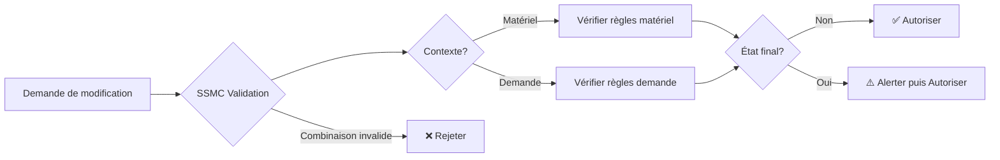

**Étape 1 - Réception de la demande** :
- Un utilisateur ou un système veut modifier le Status, State ou Movement_type
- La demande contient : nouveau status, nouvel état, type de mouvement, contexte (matériel ou demande)

**Étape 2 - Vérification de l'existence** :
- Le SSMC vérifie que les codes utilisés existent dans les référentiels

**Étape 3 - Vérification du contexte** :
- Certains types de mouvements s'appliquent uniquement aux matériels
- D'autres s'appliquent uniquement aux demandes
- Certains s'appliquent aux deux

**Étape 4 - Recherche de la règle** :
- Le SSMC cherche si la combinaison (Status + State + Movement_type) est autorisée
- Il vérifie que la règle s'applique au contexte demandé

**Étape 5 - Détection des états finaux** :
- Si la combinaison est marquée comme "finale", le SSMC alerte l'utilisateur
- Un état final signifie qu'aucune autre modification ne devrait suivre

### 1.4 Bénéfices Métier

| Bénéfice | Description | Impact |
|----------|-------------|--------|
| **Qualité des données** | Élimine les incohérences dans l'historique | Données fiables pour les décisions |
| **Traçabilité** | Historique cohérent et auditable | Conformité réglementaire |
| **Prévention d'erreurs** | Blocage proactif des opérations invalides | Réduction des incidents |
| **Paramétrable** | Pas de code à modifier pour changer les règles | Agilité opérationnelle |
| **Contextuel** | Règles différentes pour matériels et demandes | Flexibilité métier |

### 1.5 Cas d'Usage Typiques

**Cas 1 - Validation d'une sortie de stock** :
```
Demande : Faire sortir un matériel du stock
- Status actuel : DISPONIBLE
- State proposé : SORTI
- Movement_type : SORTIE_STOCK
- Contexte : MATÉRIEL

SSMC vérifie :
✅ Les codes existent
✅ SORTIE_STOCK s'applique aux matériels
✅ La combinaison (DISPONIBLE, SORTI, SORTIE_STOCK) est autorisée
✅ Ce n'est pas un état final

Résultat : ✅ AUTORISÉ
```

**Cas 2 - Tentative d'archivage prématuré** :
```
Demande : Archiver un matériel en maintenance
- Status actuel : EN_MAINTENANCE
- State proposé : ARCHIVÉ
- Movement_type : ARCHIVAGE
- Contexte : MATÉRIEL

SSMC vérifie :
✅ Les codes existent
✅ ARCHIVAGE s'applique aux matériels
❌ La combinaison (EN_MAINTENANCE, ARCHIVÉ, ARCHIVAGE) N'EST PAS autorisée

Résultat : ❌ REJETÉ
Message : "Un matériel en maintenance ne peut pas être archivé"
```

**Cas 3 - Détection d'état final** :
```
Demande : Détruire un matériel obsolète
- Status actuel : OBSOLÈTE
- State proposé : DÉTRUIT
- Movement_type : DESTRUCTION
- Contexte : MATÉRIEL

SSMC vérifie :
✅ Les codes existent
✅ DESTRUCTION s'applique aux matériels
✅ La combinaison (OBSOLÈTE, DÉTRUIT, DESTRUCTION) est autorisée
⚠️ Cette combinaison est marquée comme FINALE

Résultat : ✅ AUTORISÉ avec alerte
Message : "Attention : Ceci est une opération finale et irréversible"
```

---

## 2. Architecture des Tables de Données

### 2.1 Tables Existantes vs Nouvelles Tables

Vous avez mentionné avoir **déjà des tables de référence** pour les statuts, états et types de mouvement. Voici les deux options d'architecture :

#### Option A - Enrichir les Tables Existantes (Recommandé ✅)

**Concept** : Ajouter de nouvelles colonnes à vos tables de référence existantes.

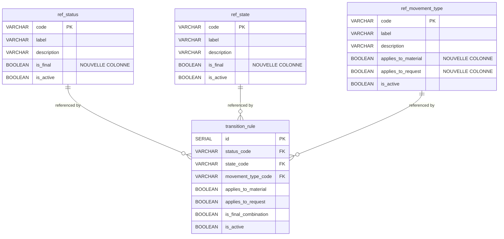

**Colonnes à ajouter** :

Sur `ref_status` :
```sql
ALTER TABLE ref_status
ADD COLUMN is_final BOOLEAN DEFAULT false;
```

Sur `ref_state` :
```sql
ALTER TABLE ref_state
ADD COLUMN is_final BOOLEAN DEFAULT false;
```

Sur `ref_movement_type` :
```sql
ALTER TABLE ref_movement_type
ADD COLUMN applies_to_material BOOLEAN DEFAULT true,
ADD COLUMN applies_to_request BOOLEAN DEFAULT true;
```

**Nouvelle table à créer** : `transition_rule`

```sql
CREATE TABLE transition_rule (
    id                      SERIAL PRIMARY KEY,
    status_code             VARCHAR(50) NOT NULL REFERENCES ref_status(code),
    state_code              VARCHAR(50) NOT NULL REFERENCES ref_state(code),
    movement_type_code      VARCHAR(50) NOT NULL REFERENCES ref_movement_type(code),

    -- Contexte d'application
    applies_to_material     BOOLEAN DEFAULT true,
    applies_to_request      BOOLEAN DEFAULT true,

    -- Indicateur de finalité
    is_final_combination    BOOLEAN DEFAULT false,

    -- Gestion et traçabilité
    allow_manual_override   BOOLEAN DEFAULT false,
    is_active               BOOLEAN DEFAULT true,
    valid_from              DATE,
    valid_until             DATE,

    -- Audit
    created_at              TIMESTAMP DEFAULT CURRENT_TIMESTAMP,
    created_by              VARCHAR(100),
    updated_at              TIMESTAMP,
    updated_by              VARCHAR(100),

    -- Contraintes
    CONSTRAINT unique_transition UNIQUE (status_code, state_code, movement_type_code),
    CONSTRAINT check_context CHECK (applies_to_material = true OR applies_to_request = true)
);

CREATE INDEX idx_transition_lookup ON transition_rule(status_code, state_code, movement_type_code);
CREATE INDEX idx_transition_active ON transition_rule(is_active) WHERE is_active = true;
```

**Avantages Option A** :
- ✅ Pas de duplication de données
- ✅ Utilise vos tables existantes
- ✅ Simple à maintenir
- ✅ Migration facile

#### Option B - Créer des Tables de Configuration Séparées (Alternative)

Si vous ne voulez pas modifier vos tables de référence existantes, créez des tables de configuration distinctes :

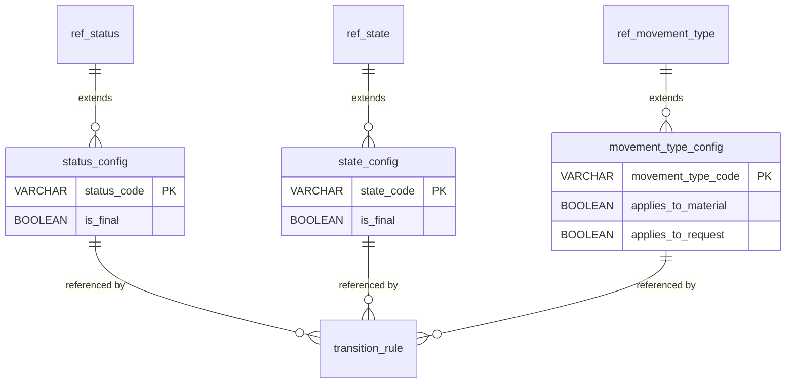

**Avantage Option B** :
- ✅ Séparation des préoccupations
- ✅ Tables de référence intactes

**Inconvénient Option B** :
- ❌ Nécessite des jointures supplémentaires
- ❌ Plus complexe à maintenir

### 2.2 Vue d'Ensemble de l'Architecture

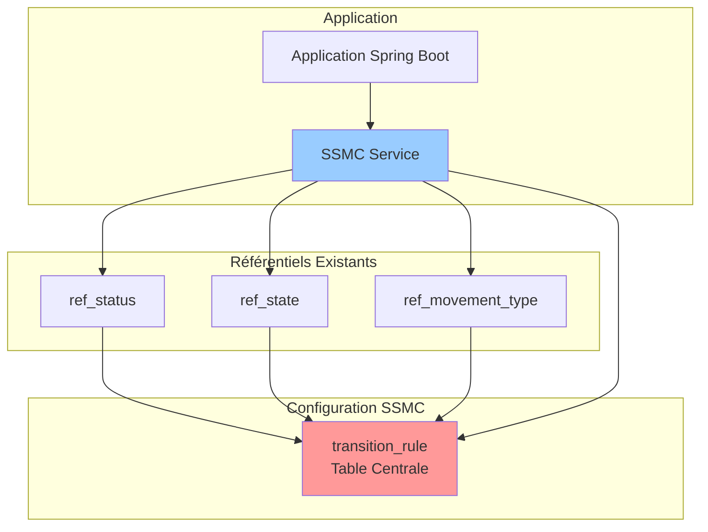

---

## 3. Exemples de Remplissage des Tables

### 3.1 Table ref_status (enrichie)

| code | label | description | is_final | is_active |
|------|-------|-------------|----------|-----------|
| DISPONIBLE | Disponible | Matériel disponible pour utilisation | false | true |
| EN_MAINTENANCE | En Maintenance | Matériel en cours de maintenance | false | true |
| EN_PANNE | En Panne | Matériel défectueux | false | true |
| EN_TRANSIT | En Transit | Matériel en cours de transport | false | true |
| UTILISE | Utilisé | Matériel en cours d'utilisation | false | true |
| RESERVE | Réservé | Matériel réservé pour une demande | false | true |
| OBSOLETE | Obsolète | Matériel obsolète, à remplacer | false | true |
| DETRUIT | Détruit | Matériel détruit définitivement | true ⚠️ | true |
| ARCHIVE | Archivé | Matériel archivé, hors service | true ⚠️ | true |
| PERDU | Perdu | Matériel perdu ou volé | true ⚠️ | true |

### 3.2 Table ref_state (enrichie)

| code | label | description | is_final | is_active |
|------|-------|-------------|----------|-----------|
| NOUVEAU | Nouveau | Nouvel article en stock | false | true |
| EN_STOCK | En Stock | Article stocké dans un entrepôt | false | true |
| SORTI | Sorti | Article sorti du stock | false | true |
| RETOUR_PREVU | Retour Prévu | Article sorti avec retour planifié | false | true |
| RETOURNE | Retourné | Article retourné au stock | false | true |
| EN_REPARATION | En Réparation | Article en cours de réparation | false | true |
| EN_CONTROLE | En Contrôle | Article en cours de contrôle qualité | false | true |
| VALIDE | Validé | Article validé après contrôle | false | true |
| REJETE | Rejeté | Article rejeté suite à contrôle | false | true |
| ATTENTE_DECISION | Attente Décision | En attente de décision sur le devenir | false | true |
| TRANSFERE | Transféré | Article transféré vers autre site | false | true |
| ARCHIVE | Archivé | État final archivé | true ⚠️ | true |
| DETRUIT | Détruit | État final détruit | true ⚠️ | true |

### 3.3 Table ref_movement_type (enrichie)

| code | label | description | applies_to_material | applies_to_request | is_active |
|------|-------|-------------|---------------------|-------------------|-----------|
| ENTREE_STOCK | Entrée Stock | Entrée d'un matériel en stock | true | false | true |
| SORTIE_STOCK | Sortie Stock | Sortie d'un matériel du stock | true | false | true |
| TRANSFERT | Transfert | Transfert entre sites/entrepôts | true | false | true |
| AFFECTATION | Affectation | Affectation à un utilisateur/projet | true | true | true |
| RETOUR | Retour | Retour d'un matériel au stock | true | false | true |
| MAINTENANCE | Maintenance | Envoi en maintenance | true | false | true |
| REPARATION | Réparation | Envoi en réparation | true | false | true |
| CONTROLE_QUALITE | Contrôle Qualité | Envoi en contrôle qualité | true | false | true |
| RESERVATION | Réservation | Réservation d'un matériel | true | true | true |
| LIBERATION | Libération | Libération d'une réservation | true | true | true |
| ARCHIVAGE | Archivage | Archivage définitif | true | false | true |
| DESTRUCTION | Destruction | Destruction du matériel | true | false | true |
| CREATION_DEMANDE | Création Demande | Création d'une nouvelle demande | false | true | true |
| VALIDATION_DEMANDE | Validation Demande | Validation d'une demande | false | true | true |
| REJET_DEMANDE | Rejet Demande | Rejet d'une demande | false | true | true |
| CLOTURE_DEMANDE | Clôture Demande | Clôture d'une demande | false | true | true |

### 3.4 Table transition_rule - Exemples de Règles Valides

#### 3.4.1 Règles pour Matériels

| id | status_code | state_code | movement_type_code | applies_to_material | applies_to_request | is_final_combination | Description |
|----|-------------|------------|-------------------|---------------------|-------------------|---------------------|-------------|
| 1 | DISPONIBLE | EN_STOCK | ENTREE_STOCK | true | false | false | Matériel disponible entre en stock |
| 2 | DISPONIBLE | SORTI | SORTIE_STOCK | true | false | false | Matériel disponible sort du stock |
| 3 | DISPONIBLE | EN_STOCK | RESERVATION | true | false | false | Matériel disponible réservé |
| 4 | RESERVE | EN_STOCK | SORTIE_STOCK | true | false | false | Matériel réservé peut sortir |
| 5 | UTILISE | SORTI | AFFECTATION | true | false | false | Matériel utilisé et affecté |
| 6 | EN_PANNE | EN_REPARATION | REPARATION | true | false | false | Matériel en panne envoyé en réparation |
| 7 | EN_MAINTENANCE | EN_REPARATION | MAINTENANCE | true | false | false | Matériel en maintenance |
| 8 | DISPONIBLE | VALIDE | CONTROLE_QUALITE | true | false | false | Matériel disponible après contrôle OK |
| 9 | UTILISE | RETOURNE | RETOUR | true | false | false | Matériel utilisé retourné |
| 10 | DISPONIBLE | EN_STOCK | RETOUR | true | false | false | Matériel retourné disponible en stock |

#### 3.4.2 Règles pour États Finaux (Matériels)

| id | status_code | state_code | movement_type_code | applies_to_material | applies_to_request | is_final_combination | Description |
|----|-------------|------------|-------------------|---------------------|-------------------|---------------------|-------------|
| 50 | OBSOLETE | ARCHIVE | ARCHIVAGE | true | false | true ⚠️ | Matériel obsolète archivé - FINAL |
| 51 | DETRUIT | DETRUIT | DESTRUCTION | true | false | true ⚠️ | Matériel détruit - FINAL |
| 52 | PERDU | ARCHIVE | ARCHIVAGE | true | false | true ⚠️ | Matériel perdu archivé - FINAL |

#### 3.4.3 Règles pour Demandes

| id | status_code | state_code | movement_type_code | applies_to_material | applies_to_request | is_final_combination | Description |
|----|-------------|------------|-------------------|---------------------|-------------------|---------------------|-------------|
| 100 | DISPONIBLE | NOUVEAU | CREATION_DEMANDE | false | true | false | Nouvelle demande créée |
| 101 | RESERVE | EN_STOCK | RESERVATION | false | true | false | Demande avec réservation |
| 102 | UTILISE | VALIDE | VALIDATION_DEMANDE | false | true | false | Demande validée et en cours |
| 103 | DISPONIBLE | REJETE | REJET_DEMANDE | false | true | false | Demande rejetée |
| 104 | ARCHIVE | ARCHIVE | CLOTURE_DEMANDE | false | true | true ⚠️ | Demande clôturée - FINAL |

#### 3.4.4 Règles Mixtes (Matériels ET Demandes)

| id | status_code | state_code | movement_type_code | applies_to_material | applies_to_request | is_final_combination | Description |
|----|-------------|------------|-------------------|---------------------|-------------------|---------------------|-------------|
| 200 | RESERVE | EN_STOCK | AFFECTATION | true | true | false | Affectation valide pour les deux |
| 201 | UTILISE | SORTI | AFFECTATION | true | true | false | Matériel/demande affecté et sorti |
| 202 | DISPONIBLE | EN_STOCK | LIBERATION | true | true | false | Libération d'une réservation |

### 3.5 Exemples de Règles INVALIDES (Non présentes dans transition_rule)

Ces combinaisons ne doivent PAS exister dans la table et seront rejetées par le SSMC :

| status_code | state_code | movement_type_code | Raison du rejet |
|-------------|------------|-------------------|-----------------|
| DETRUIT | EN_STOCK | ENTREE_STOCK | ❌ Un matériel détruit ne peut pas entrer en stock |
| DISPONIBLE | DETRUIT | SORTIE_STOCK | ❌ Incohérence : disponible mais détruit |
| EN_PANNE | ARCHIVE | SORTIE_STOCK | ❌ Un matériel en panne ne peut pas être archivé directement |
| ARCHIVE | SORTI | SORTIE_STOCK | ❌ Un matériel archivé ne peut plus sortir |
| PERDU | EN_STOCK | RESERVATION | ❌ Un matériel perdu ne peut pas être réservé |
| EN_MAINTENANCE | NOUVEAU | ENTREE_STOCK | ❌ Incohérence : en maintenance mais nouveau |

### 3.6 Scénarios de Validation Complets

#### Scénario 1 : Sortie de Stock Normale ✅

**Requête** :
```json
{
  "statusCode": "DISPONIBLE",
  "stateCode": "SORTI",
  "movementTypeCode": "SORTIE_STOCK",
  "context": "MATERIAL"
}
```

**Validation SSMC** :
1. ✅ Vérifier existence : DISPONIBLE existe, SORTI existe, SORTIE_STOCK existe
2. ✅ Vérifier contexte : SORTIE_STOCK s'applique aux matériels (applies_to_material = true)
3. ✅ Chercher règle : Règle ID=2 trouvée
4. ✅ Vérifier finalité : is_final_combination = false

**Résultat** :
```json
{
  "valid": true,
  "message": "Transition autorisée",
  "isFinalCombination": false,
  "ruleId": 2
}
```

#### Scénario 2 : Tentative d'Archivage Invalide ❌

**Requête** :
```json
{
  "statusCode": "EN_PANNE",
  "stateCode": "ARCHIVE",
  "movementTypeCode": "ARCHIVAGE",
  "context": "MATERIAL"
}
```

**Validation SSMC** :
1. ✅ Vérifier existence : Tous existent
2. ✅ Vérifier contexte : ARCHIVAGE s'applique aux matériels
3. ❌ Chercher règle : Aucune règle trouvée pour (EN_PANNE, ARCHIVE, ARCHIVAGE)

**Résultat** :
```json
{
  "valid": false,
  "message": "Combinaison non autorisée : Un matériel en panne doit être réparé avant archivage",
  "isFinalCombination": false,
  "ruleId": null
}
```

#### Scénario 3 : Destruction Finale ⚠️

**Requête** :
```json
{
  "statusCode": "OBSOLETE",
  "stateCode": "DETRUIT",
  "movementTypeCode": "DESTRUCTION",
  "context": "MATERIAL"
}
```

**Validation SSMC** :
1. ✅ Vérifier existence : Tous existent
2. ✅ Vérifier contexte : DESTRUCTION s'applique aux matériels
3. ✅ Chercher règle : Règle ID=51 trouvée
4. ⚠️ Vérifier finalité : is_final_combination = true

**Résultat** :
```json
{
  "valid": true,
  "message": "Transition autorisée - ATTENTION : Ceci est une opération FINALE et IRRÉVERSIBLE",
  "isFinalCombination": true,
  "ruleId": 51,
  "warnings": [
    "Cette opération ne peut pas être annulée",
    "Aucune modification ultérieure ne sera possible"
  ]
}
```

#### Scénario 4 : Mauvais Contexte ❌

**Requête** :
```json
{
  "statusCode": "DISPONIBLE",
  "stateCode": "EN_STOCK",
  "movementTypeCode": "CREATION_DEMANDE",
  "context": "MATERIAL"
}
```

**Validation SSMC** :
1. ✅ Vérifier existence : Tous existent
2. ❌ Vérifier contexte : CREATION_DEMANDE ne s'applique PAS aux matériels (applies_to_material = false)

**Résultat** :
```json
{
  "valid": false,
  "message": "Type de mouvement CREATION_DEMANDE ne s'applique pas au contexte MATERIAL",
  "isFinalCombination": false,
  "ruleId": null
}
```

---

## 4. Microservice op-protections

### 4.1 Vue d'Ensemble

Le microservice **op-protections** est le **gardien de la cohérence et de l'intégrité** de votre système logistique. Son rôle est d'empêcher les opérations invalides, incohérentes ou non autorisées.

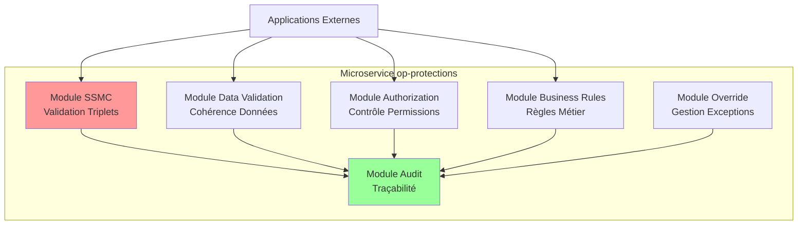

### 4.2 Module SSMC - Validation des Triplets

**Responsabilité** : Valider les combinaisons (Status, State, Movement_type)

**Fonctionnalités** :
- ✅ Validation des transitions matériels
- ✅ Validation des transitions demandes
- ✅ Détection des états finaux
- ✅ Gestion du contexte (matériel vs demande)

**Endpoints** :
- `POST /api/protections/ssmc/validate` - Valider une transition
- `GET /api/protections/ssmc/allowed-transitions` - Obtenir les transitions possibles
- `GET /api/protections/ssmc/rules` - Consulter les règles configurées

### 4.3 Module Data Validation - Cohérence des Données

**Responsabilité** : Valider la cohérence globale des données au-delà des triplets

**Fonctionnalités** :
- ✅ Validation des relations entre entités
- ✅ Vérification des contraintes métier complexes
- ✅ Détection des doublons
- ✅ Validation de l'intégrité référentielle

**Cas d'usage** :
```
Exemple 1 : Validation de Stock
- Vérifier qu'un matériel "SORTI" n'est pas compté dans le stock disponible
- Vérifier qu'un matériel ne peut pas être dans deux emplacements simultanément

Exemple 2 : Validation de Demande
- Vérifier qu'une demande ne peut pas être validée sans matériel affecté
- Vérifier qu'un matériel ne peut pas être affecté à deux demandes actives

Exemple 3 : Validation Temporelle
- Vérifier qu'une date de retour prévue est postérieure à la date de sortie
- Vérifier qu'un matériel en maintenance ne peut pas avoir de sortie planifiée
```

**Endpoints** :
- `POST /api/protections/data/validate-stock` - Valider cohérence stock
- `POST /api/protections/data/validate-request` - Valider cohérence demande
- `POST /api/protections/data/validate-allocation` - Valider affectation
- `POST /api/protections/data/check-duplicates` - Détecter doublons

### 4.4 Module Authorization - Contrôle des Permissions

**Responsabilité** : Vérifier les autorisations avant d'effectuer des opérations sensibles

**Fonctionnalités** :
- ✅ Contrôle des permissions par rôle
- ✅ Validation des droits sur les opérations critiques
- ✅ Gestion des approbations hiérarchiques
- ✅ Traçabilité des accès

**Cas d'usage** :
```
Exemple 1 : Destruction de Matériel
- Seuls les managers peuvent autoriser une destruction
- Nécessite une double validation pour les matériels à haute valeur

Exemple 2 : Modification d'Historique
- Seuls les administrateurs peuvent corriger l'historique
- Nécessite une justification obligatoire

Exemple 3 : Override de Règle SSMC
- Nécessite un rôle spécial "Superviseur"
- Nécessite une justification et une approbation
```

**Endpoints** :
- `POST /api/protections/auth/check-permission` - Vérifier permission
- `POST /api/protections/auth/request-approval` - Demander approbation
- `GET /api/protections/auth/pending-approvals` - Lister approbations en attente

### 4.5 Module Business Rules - Règles Métier

**Responsabilité** : Appliquer les règles métier spécifiques à votre organisation

**Fonctionnalités** :
- ✅ Validation des seuils et limites
- ✅ Application des politiques métier
- ✅ Calculs et contrôles automatiques
- ✅ Règles temporelles

**Cas d'usage** :
```
Exemple 1 : Durée Maximale de Sortie
- Un matériel ne peut pas rester sorti plus de 6 mois
- Alerte automatique à 5 mois
- Blocage à 6 mois

Exemple 2 : Fréquence de Maintenance
- Un matériel doit passer en maintenance tous les 12 mois
- Alerte si maintenance non effectuée depuis 11 mois

Exemple 3 : Valeur Maximale
- Les sorties de matériels >10000€ nécessitent validation manager
- Les destructions de matériels >50000€ nécessitent validation directeur

Exemple 4 : Quota par Utilisateur
- Un utilisateur ne peut pas avoir plus de 5 matériels en parallèle
- Un projet ne peut pas réserver plus de 10 matériels simultanément
```

**Endpoints** :
- `POST /api/protections/rules/validate-duration` - Valider durée
- `POST /api/protections/rules/check-maintenance` - Vérifier maintenance
- `POST /api/protections/rules/validate-value-threshold` - Valider seuil valeur
- `POST /api/protections/rules/check-quota` - Vérifier quotas

### 4.6 Module Override - Gestion des Exceptions

**Responsabilité** : Gérer les cas exceptionnels nécessitant un contournement des règles

**Fonctionnalités** :
- ✅ Demande d'exception avec justification
- ✅ Workflow d'approbation
- ✅ Override temporaire ou permanent
- ✅ Traçabilité complète des exceptions

**Cas d'usage** :
```
Exemple 1 : Urgence Opérationnelle
- Sortie d'un matériel en maintenance pour urgence critique
- Nécessite justification + approbation manager
- Durée limitée (24h)

Exemple 2 : Correction d'Erreur
- Modification d'un historique erroné
- Nécessite justification détaillée + preuve
- Approbation administrateur

Exemple 3 : Exception Métier
- Autoriser une transition normalement interdite
- Justification métier obligatoire
- Approbation selon niveau de risque
```

**Endpoints** :
- `POST /api/protections/override/request` - Demander exception
- `POST /api/protections/override/approve` - Approuver exception
- `POST /api/protections/override/reject` - Rejeter exception
- `GET /api/protections/override/history` - Historique des exceptions

### 4.7 Module Audit - Traçabilité

**Responsabilité** : Enregistrer toutes les validations, rejets et exceptions

**Fonctionnalités** :
- ✅ Logs structurés de toutes les validations
- ✅ Traçabilité des rejets avec raisons
- ✅ Historique des exceptions autorisées
- ✅ Métriques et rapports

**Informations enregistrées** :
```
Pour chaque validation :
- Timestamp
- Utilisateur demandeur
- Type de validation (SSMC, Data, Auth, Rules)
- Données validées
- Résultat (accepté/rejeté)
- Raison si rejeté
- Règle appliquée si accepté
- Contexte complet

Pour chaque exception :
- Timestamp
- Utilisateur demandeur
- Validateur/Approbateur
- Type d'exception
- Justification
- Durée de validité
- Résultat final
```

**Endpoints** :
- `GET /api/protections/audit/validations` - Consulter historique validations
- `GET /api/protections/audit/rejections` - Consulter rejets
- `GET /api/protections/audit/overrides` - Consulter exceptions
- `GET /api/protections/audit/metrics` - Obtenir métriques

### 4.8 Architecture Technique du Microservice

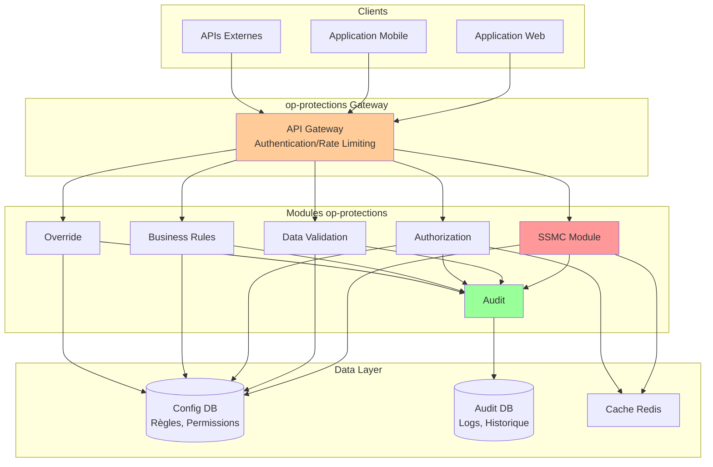

### 4.9 Stack Technique Recommandée

| Composant | Technologie | Justification |
|-----------|-------------|---------------|
| **Framework** | Spring Boot 3.x | Standard Java enterprise, mature |
| **API** | REST avec Spring MVC | Simple, bien documenté |
| **Base de données** | PostgreSQL | Relationnel, ACID, performant |
| **Cache** | Redis | Haute performance pour règles fréquentes |
| **Sécurité** | Spring Security + JWT | Standard industrie |
| **Logs/Audit** | ELK Stack (Elasticsearch, Logstash, Kibana) | Recherche et visualisation puissantes |
| **Monitoring** | Prometheus + Grafana | Métriques temps réel |
| **Documentation API** | Swagger/OpenAPI 3.0 | Auto-généré, interactif |

---

## 5. Microservice op-monitoring

### 5.1 Concept - L'ECAM de la Logistique

**Inspiration** : L'**ECAM (Electronic Centralized Aircraft Monitoring)** est le système d'Airbus qui :
- Surveille en temps réel l'état de tous les systèmes de l'avion
- Affiche des alertes par code couleur
- Propose des actions correctives
- Priorise les problèmes par criticité
- Facilite la prise de décision des pilotes

**Adaptation pour la Logistique** : Le microservice **op-monitoring** (ou **LogiWatch** suggéré) transpose ce concept au domaine logistique.

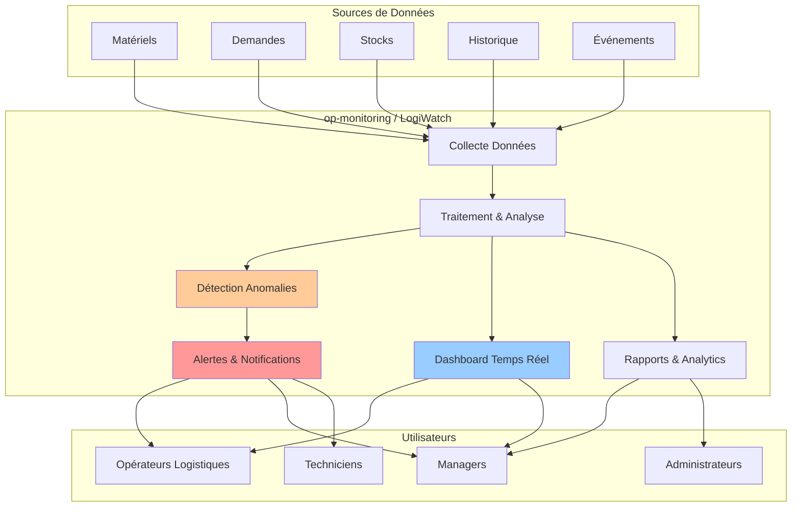

### 5.2 Nom du Microservice Suggéré

**Proposition** : `op-monitoring` ou `logiwatch`

Alternatives :
- `ops-central-monitoring` (OCM)
- `logistic-oversight-system` (LOS)
- `supply-insight-platform` (SIP)
- `logiview`
- `materielwatch`

**Choix recommandé** : `logiwatch`
- Court, mémorable
- Évoque la surveillance
- Cohérent avec la métaphore ECAM

### 5.3 Objectifs du Microservice

| Objectif | Description | Bénéfice |
|----------|-------------|----------|
| **Surveillance Temps Réel** | Vue consolidée de l'état du système logistique | Visibilité instantanée |
| **Détection Proactive** | Identifier les problèmes avant qu'ils deviennent critiques | Prévention |
| **Alertes Intelligentes** | Notifications contextuelles et priorisées | Réaction rapide |
| **Aide à la Décision** | Recommandations basées sur les données | Efficacité opérationnelle |
| **Traçabilité** | Historique complet des événements | Audit et analyse |

### 5.4 Modules du Microservice logiwatch

#### Module 1 - Real-Time Dashboard (Tableau de Bord Temps Réel)

**Inspiration ECAM** : L'écran principal de l'ECAM affiche l'état de tous les systèmes

**Équivalent Logistique** :
```
┌─────────────────────────────────────────────────────────────┐
│  LOGIWATCH - CENTRAL MONITORING                             │
├─────────────────────────────────────────────────────────────┤
│  ÉTAT GLOBAL : ✅ OPÉRATIONNEL                              │
│  Dernière MAJ : 2025-12-19 14:32:15                         │
├─────────────────────────────────────────────────────────────┤
│                                                              │
│  📦 MATÉRIELS                                                │
│  ├─ Disponibles : 1,234  🟢                                 │
│  ├─ En utilisation : 567  🟢                                │
│  ├─ En maintenance : 45  🟡                                 │
│  ├─ En panne : 12  🔴                                       │
│  └─ Hors service : 3  ⚫                                     │
│                                                              │
│  📋 DEMANDES                                                 │
│  ├─ En attente : 23  🟡                                     │
│  ├─ En cours : 89  🟢                                       │
│  ├─ En retard : 5  🔴                                       │
│  └─ Clôturées aujourd'hui : 45                              │
│                                                              │
│  🏭 STOCKS                                                   │
│  ├─ Taux remplissage : 78% 🟢                               │
│  ├─ Alertes stock bas : 8  🟡                               │
│  ├─ Ruptures : 2  🔴                                        │
│  └─ Transferts en cours : 12                                │
│                                                              │
│  ⚠️  ALERTES ACTIVES (15)                                   │
│  ├─ 🔴 CRITIQUE : 2                                         │
│  ├─ 🟡 ATTENTION : 8                                        │
│  └─ 🔵 INFO : 5                                             │
│                                                              │
└─────────────────────────────────────────────────────────────┘
```

**Fonctionnalités** :
- Vue synthétique de tous les indicateurs clés
- Rafraîchissement automatique (websocket)
- Code couleur par criticité
- Drill-down vers les détails
- Filtres par site/entrepôt/catégorie

**Widgets du Dashboard** :
1. État global du système
2. Répartition des matériels par statut
3. Taux de disponibilité
4. Demandes en cours et en retard
5. Alertes actives
6. Graphiques d'évolution temporelle
7. Top 10 des matériels les plus utilisés
8. Prévisions de rupture de stock

#### Module 2 - Alert & Notification System (Système d'Alertes)

**Inspiration ECAM** : Alertes par code couleur avec priorisation

**Types d'Alertes** :

| Criticité | Couleur | Exemples | Action |
|-----------|---------|----------|--------|
| 🔴 **CRITIQUE** | Rouge | Rupture de stock, Matériel perdu, Incident sécurité | Notification immédiate + SMS |
| 🟡 **ATTENTION** | Jaune | Stock bas, Maintenance échue, Demande en retard | Notification + email |
| 🔵 **INFO** | Bleu | Retour planifié, Nouvelle demande, Transfert terminé | Notification dans app |
| 🟢 **OK** | Vert | Validation réussie, Stock reconstitué, Maintenance OK | Log uniquement |

**Règles d'Alerte Configurables** :

```
Alerte : STOCK_BAS
Condition : quantité < seuil_min
Criticité : ATTENTION (🟡)
Destinataires : Gestionnaire de stock, Manager
Actions : Email + Notification app
Fréquence : Tous les jours jusqu'à résolution

Alerte : MATERIEL_PERDU
Condition : status = PERDU
Criticité : CRITIQUE (🔴)
Destinataires : Manager, Sécurité, Administrateur
Actions : SMS + Email + Notification app + Ticket auto-créé
Escalade : Si non traité en 2h, notifier directeur

Alerte : MAINTENANCE_ECHUE
Condition : dernière_maintenance > 12 mois
Criticité : ATTENTION (🟡)
Destinataires : Responsable maintenance, Techniciens
Actions : Email + Notification app
Fréquence : Rappel tous les 3 jours

Alerte : DEMANDE_RETARD
Condition : date_livraison_prevue < aujourd'hui AND status != CLOTURE
Criticité : ATTENTION (🟡)
Destinataires : Demandeur, Gestionnaire demande
Actions : Email + Notification app
Escalade : Si retard > 7 jours, notifier manager

Alerte : UTILISATION_PROLONGEE
Condition : durée_sortie > 180 jours
Criticité : INFO (🔵)
Destinataires : Utilisateur, Manager
Actions : Notification app
Fréquence : Rappel tous les 30 jours
```

**Canaux de Notification** :
- 📱 Notifications push (application mobile)
- 📧 Email
- 📞 SMS (pour alertes critiques)
- 💬 Slack/Teams integration
- 🔔 Notifications in-app (web)

#### Module 3 - Anomaly Detection (Détection d'Anomalies)

**Objectif** : Identifier automatiquement les comportements anormaux

**Anomalies Détectées** :

1. **Anomalies de Données** :
   - Matériel avec statut incohérent (malgré SSMC ✅)
   - Doublons d'affectation
   - Localisation impossible
   - Valeur aberrante

2. **Anomalies Temporelles** :
   - Durée de sortie inhabituelle
   - Fréquence d'utilisation anormale
   - Pics de demandes inexpliqués
   - Délais de traitement excessifs

3. **Anomalies Comportementales** :
   - Utilisateur avec trop de matériels
   - Taux de panne anormal sur un type de matériel
   - Stock qui diminue trop rapidement
   - Multiplication de rejets de demandes

4. **Anomalies Prédictives** :
   - Risque de rupture de stock
   - Matériel à risque de panne (basé sur historique)
   - Dépassement prévisible de délai

**Algorithmes** :
- Règles métier configurables
- Détection de seuils
- Analyse de tendances
- Machine Learning (optionnel pour prédiction)

#### Module 4 - Metrics & KPI (Métriques et Indicateurs)

**KPI Suivis** :

**Matériels** :
- Taux de disponibilité (% matériels disponibles / total)
- Taux d'utilisation (% matériels en utilisation / total)
- Taux de panne (% matériels en panne)
- Durée moyenne d'utilisation
- Durée moyenne de maintenance
- Coût moyen de maintenance par matériel
- MTBF (Mean Time Between Failures)
- MTTR (Mean Time To Repair)

**Demandes** :
- Nombre de demandes par statut
- Taux de satisfaction des demandes
- Délai moyen de traitement
- Taux de demandes en retard
- Taux de rejet de demandes

**Stocks** :
- Taux de rotation des stocks
- Valeur du stock immobilisé
- Nombre de ruptures de stock
- Taux de service (% demandes satisfaites à temps)

**Opérations** :
- Nombre de mouvements par jour
- Nombre d'entrées/sorties
- Nombre de transferts
- Nombre de retours

**Visualisations** :
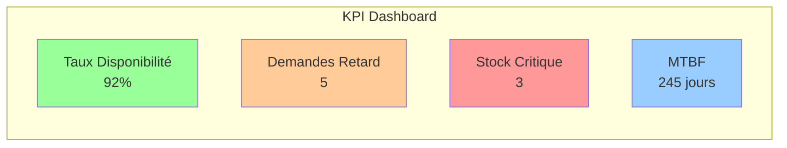

#### Module 5 - Reporting & Analytics (Rapports et Analyses)

**Types de Rapports** :

1. **Rapports Opérationnels** (quotidiens/hebdomadaires) :
   - État du stock
   - Demandes en cours
   - Alertes actives
   - Mouvements de la journée

2. **Rapports de Performance** (mensuels) :
   - Évolution des KPI
   - Taux de disponibilité
   - Délais de traitement
   - Coûts de maintenance

3. **Rapports d'Audit** :
   - Historique des modifications
   - Exceptions autorisées
   - Validations rejetées
   - Traçabilité complète

4. **Rapports Prédictifs** :
   - Prévisions de besoins
   - Risques identifiés
   - Recommandations

**Formats** :
- PDF pour distribution
- Excel pour analyse
- Dashboards interactifs (Power BI, Tableau)
- APIs pour intégration

#### Module 6 - Health Check (Vérification de Santé)

**Objectif** : Vérifier que le système logistique est dans un état cohérent

**Contrôles Effectués** :
- Cohérence des données (via op-protections)
- Intégrité référentielle
- Performance des APIs
- Disponibilité des services
- Charge système

**Health Check Automatique** :
```
✅ Base de données : OK (temps réponse 45ms)
✅ Service SSMC : OK
✅ Service Stock : OK
⚠️ Service Notifications : DEGRADED (latence élevée)
✅ Cache Redis : OK
✅ Files de messages : OK
```

### 5.5 Architecture Technique de logiwatch

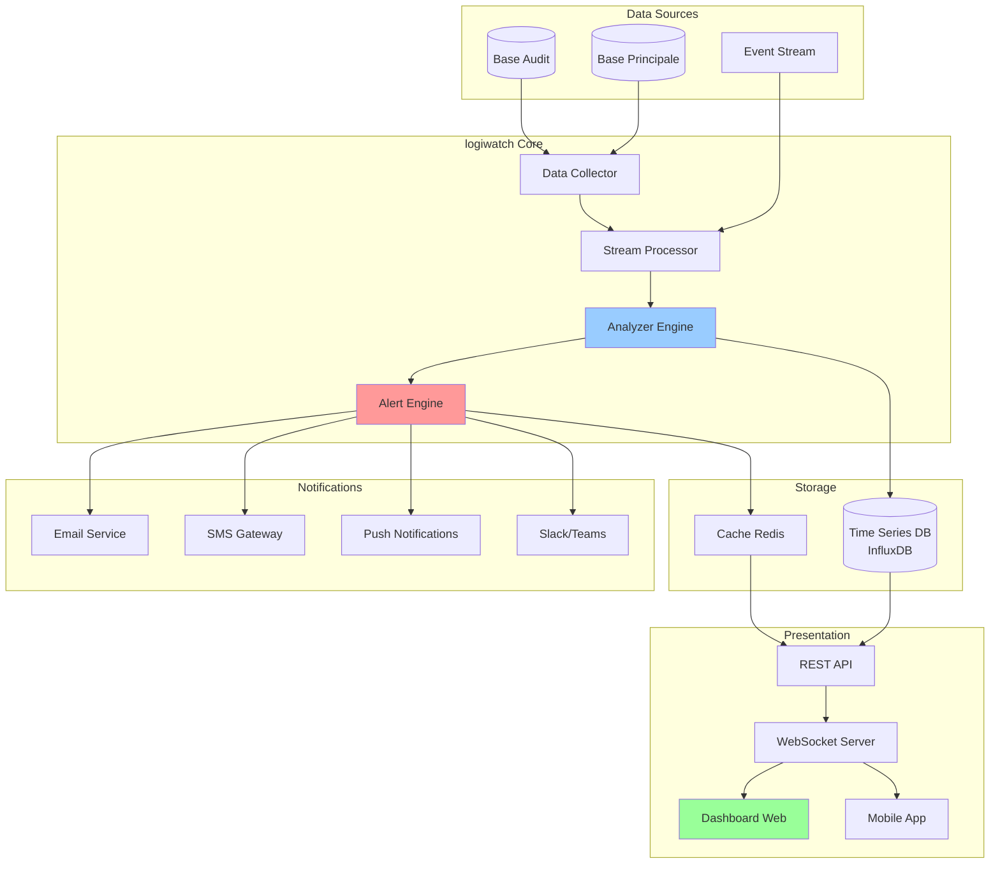

### 5.6 Stack Technique Recommandée pour logiwatch

| Composant | Technologie | Justification |
|-----------|-------------|---------------|
| **Backend** | Spring Boot | Cohérence avec op-protections |
| **Stream Processing** | Apache Kafka + Kafka Streams | Traitement temps réel d'événements |
| **Time Series DB** | InfluxDB ou TimescaleDB | Optimisé pour métriques temporelles |
| **Cache** | Redis | Performance pour dashboard temps réel |
| **WebSocket** | Spring WebSocket | Push temps réel vers clients |
| **Dashboard** | React + Recharts ou Vue.js | Interface réactive et moderne |
| **Alerting** | Spring + Twilio (SMS) + SendGrid (Email) | Notifications multi-canal |
| **Analytics** | Elasticsearch + Kibana | Recherche et visualisation avancées |
| **Monitoring** | Prometheus + Grafana | Métriques infrastructure |

### 5.7 Flux de Données dans logiwatch

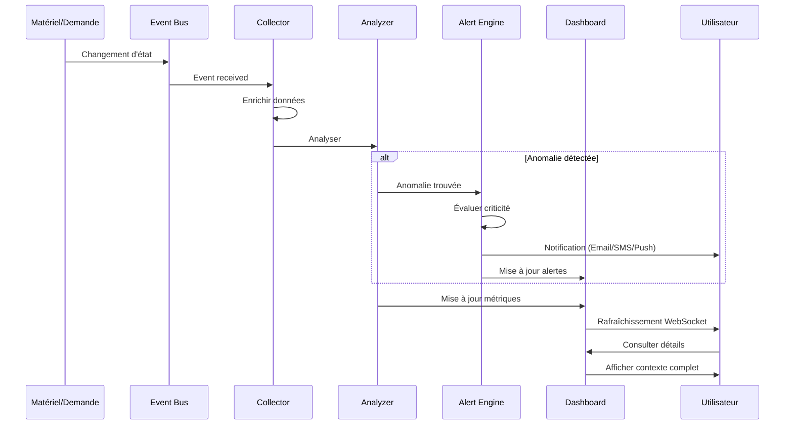

### 5.8 Exemples d'Écrans logiwatch

#### Écran 1 - Vue d'Ensemble (Style ECAM)

```
┌──────────────────────────────────────────────────────────────────────┐
│  🔍 LOGIWATCH - SURVEILLANCE CENTRALISÉE LOGISTIQUE                  │
├──────────────────────────────────────────────────────────────────────┤
│  Site : TOUS    Période : TEMPS RÉEL    MAJ : il y a 3 sec         │
├──────────────────────────────────────────────────────────────────────┤
│                                                                       │
│  ┌─────────────────┐  ┌─────────────────┐  ┌─────────────────┐    │
│  │  DISPONIBILITÉ  │  │  UTILISATION    │  │    ALERTES      │    │
│  │                 │  │                 │  │                 │    │
│  │      92%        │  │      567/1234   │  │   🔴  2         │    │
│  │      🟢         │  │      46%        │  │   🟡  8         │    │
│  │                 │  │      🟢         │  │   🔵  5         │    │
│  └─────────────────┘  └─────────────────┘  └─────────────────┘    │
│                                                                       │
│  ALERTES CRITIQUES 🔴                                                │
│  ├─ [14:25] Rupture stock : Câble HDMI (SITE_A)                    │
│  └─ [13:10] Matériel perdu : Ordinateur portable #LP-1234          │
│                                                                       │
│  ALERTES ATTENTION 🟡                                                │
│  ├─ [14:30] Stock bas : Souris sans fil (8 unités restantes)       │
│  ├─ [14:15] Maintenance échue : Projecteur #PROJ-456 (15 mois)     │
│  ├─ [13:45] Demande en retard : DEM-2024-789 (retard : 3 jours)    │
│  └─ [12:30] Utilisation prolongée : Tablette #TAB-333 (210 jours)  │
│                                                                       │
│  ┌───────────────────────────────────────────────────────────────┐  │
│  │  ÉVOLUTION 7 DERNIERS JOURS                                   │  │
│  │                                                               │  │
│  │  100% ┤                                   ╭─────────          │  │
│  │   90% ┤                     ╭─────────────╯                  │  │
│  │   80% ┤         ╭───────────╯                                │  │
│  │   70% ┤─────────╯                                            │  │
│  │       └─────────────────────────────────────────────────────  │  │
│  │        Lun  Mar  Mer  Jeu  Ven  Sam  Dim                     │  │
│  │                                                               │  │
│  │        Ligne bleue : Taux disponibilité                      │  │
│  └───────────────────────────────────────────────────────────────┘  │
│                                                                       │
│  [ Voir Détails ] [ Rapports ] [ Configuration Alertes ]            │
│                                                                       │
└──────────────────────────────────────────────────────────────────────┘
```

#### Écran 2 - Détail d'une Alerte

```
┌──────────────────────────────────────────────────────────────────┐
│  🔴 ALERTE CRITIQUE - Matériel Perdu                             │
├──────────────────────────────────────────────────────────────────┤
│                                                                   │
│  ID Alerte : ALT-2024-001234                                     │
│  Criticité : CRITIQUE 🔴                                          │
│  Statut : ACTIVE                                                 │
│  Créée le : 2025-12-19 13:10:45                                  │
│  Dernière MAJ : 2025-12-19 14:32:10                              │
│                                                                   │
│  ┌────────────────────────────────────────────────────────────┐  │
│  │  DÉTAILS MATÉRIEL                                          │  │
│  ├────────────────────────────────────────────────────────────┤  │
│  │  Référence : LP-1234                                       │  │
│  │  Type : Ordinateur Portable                                │  │
│  │  Marque : Dell XPS 15                                      │  │
│  │  Valeur : 1,800 €                                          │  │
│  │  Statut : PERDU                                            │  │
│  │  État : SORTI                                              │  │
│  │  Localisation dernière connue : Bureau 3.14, SITE_B       │  │
│  └────────────────────────────────────────────────────────────┘  │
│                                                                   │
│  ┌────────────────────────────────────────────────────────────┐  │
│  │  CONTEXTE                                                  │  │
│  ├────────────────────────────────────────────────────────────┤  │
│  │  Utilisateur : Jean DUPONT (jean.dupont@company.com)      │  │
│  │  Date sortie : 2024-10-15                                  │  │
│  │  Demande : DEM-2024-456                                    │  │
│  │  Projet : Migration Cloud                                  │  │
│  │  Date signalement perte : 2025-12-19 13:05                │  │
│  └────────────────────────────────────────────────────────────┘  │
│                                                                   │
│  ┌────────────────────────────────────────────────────────────┐  │
│  │  ACTIONS RECOMMANDÉES                                      │  │
│  ├────────────────────────────────────────────────────────────┤  │
│  │  1. Contacter l'utilisateur pour vérification            │  │
│  │  2. Vérifier les caméras de sécurité du site             │  │
│  │  3. Créer une déclaration de perte                       │  │
│  │  4. Notifier le service sécurité                         │  │
│  │  5. Désactiver les accès réseau du matériel              │  │
│  │  6. Lancer procédure assurance                           │  │
│  └────────────────────────────────────────────────────────────┘  │
│                                                                   │
│  NOTIFICATIONS ENVOYÉES :                                         │
│  ✅ Email à Jean DUPONT (13:10)                                  │
│  ✅ Email au manager (13:10)                                     │
│  ✅ SMS au responsable sécurité (13:11)                          │
│  ✅ Ticket créé : TICKET-2024-789 (13:12)                        │
│  ⏳ Escalade prévue dans : 1h 48min (si non traité)              │
│                                                                   │
│  [ Acquitter ] [ Assigner ] [ Clôturer ] [ Voir Historique ]    │
│                                                                   │
└──────────────────────────────────────────────────────────────────┘
```

### 5.9 Intégration op-protections ↔ logiwatch

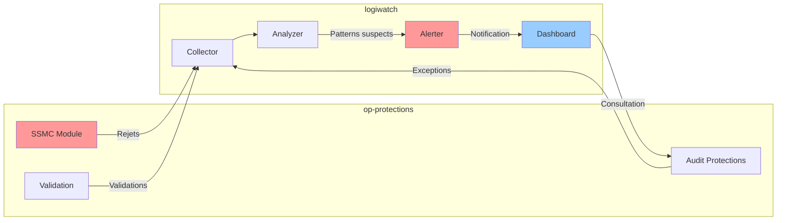

**Cas d'Usage d'Intégration** :

1. **Détection de tentatives répétées invalides** :
   - op-protections rejette 5 transitions invalides du même utilisateur
   - logiwatch détecte le pattern
   - Alerte créée : "Utilisateur nécessite formation SSMC"

2. **Monitoring des exceptions** :
   - op-protections autorise un override
   - logiwatch enregistre et affiche dans dashboard
   - Métriques : nombre d'overrides par jour/utilisateur

3. **Analyse des rejets** :
   - logiwatch agrège les rejets de op-protections
   - Identifie les règles les plus souvent rejetées
   - Recommandation : "Revoir la règle SSMC #45, rejetée 120 fois ce mois"

---

## 6. Résumé et Recommandations

### 6.1 Architecture Globale

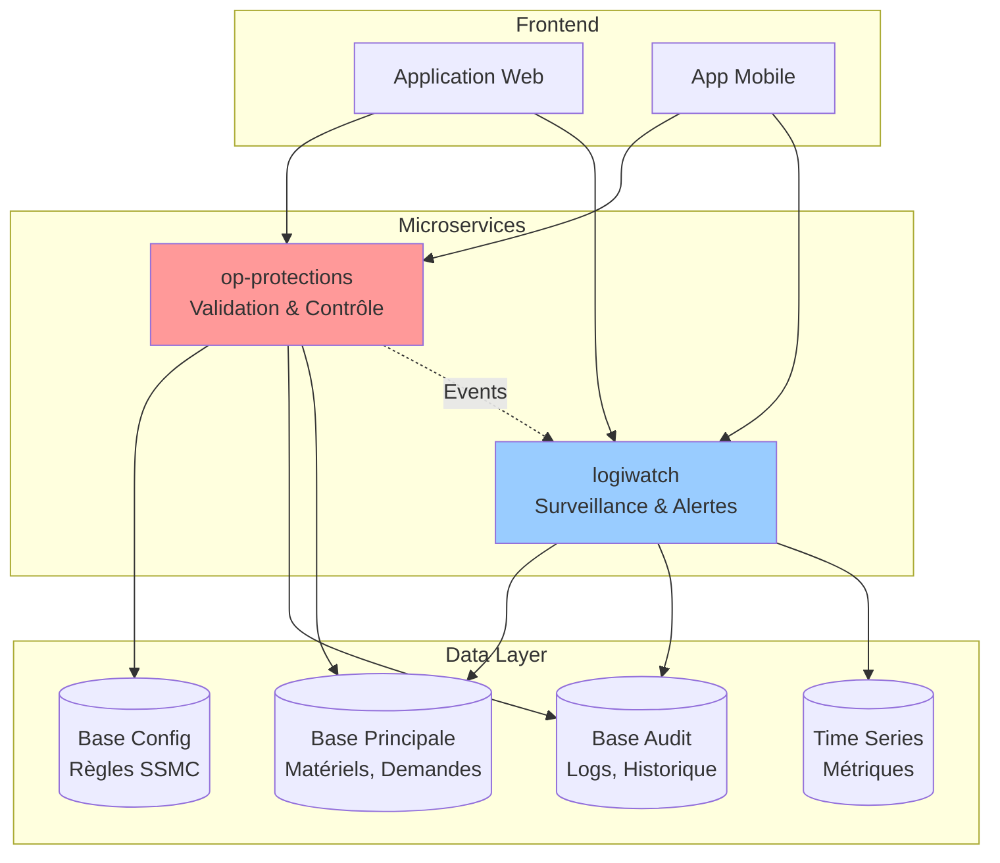

### 6.2 Roadmap de Mise en Œuvre

**Phase 1 - Fondations (2-3 mois)** :
1. Enrichir les tables de référence existantes
2. Créer la table `transition_rule`
3. Implémenter le module SSMC core
4. Tests et validation

**Phase 2 - Protection Étendue (2 mois)** :
1. Module Data Validation
2. Module Authorization
3. Module Business Rules
4. Intégration complète op-protections

**Phase 3 - Surveillance (2-3 mois)** :
1. Dashboard temps réel logiwatch
2. Système d'alertes
3. Détection d'anomalies basique
4. Intégration avec op-protections

**Phase 4 - Analytics Avancés (2 mois)** :
1. Rapports et KPI
2. Détection d'anomalies avancée
3. Prédictions (ML optionnel)
4. Optimisations performance

**Phase 5 - Excellence Opérationnelle (continu)** :
1. Amélioration continue des règles
2. Ajout de nouveaux KPI
3. Formation utilisateurs
4. Monitoring et optimisation

### 6.3 Bénéfices Attendus

| Bénéfice | Court Terme (3-6 mois) | Moyen Terme (6-12 mois) | Long Terme (1-2 ans) |
|----------|------------------------|-------------------------|----------------------|
| **Qualité Données** | -50% d'incohérences | -90% d'incohérences | Zéro incohérence |
| **Visibilité** | Dashboard temps réel | Alertes proactives | Prédiction problèmes |
| **Efficacité** | Gain 10% productivité | Gain 25% productivité | Gain 40% productivité |
| **Coûts** | ROI neutre (investissement) | ROI positif (+20%) | ROI élevé (+100%) |

### 6.4 Points Clés à Retenir

✅ **SSMC** : Gardien de la cohérence des triplets (Status, State, Movement_type)

✅ **op-protections** : Microservice de validation et contrôle avec 6 modules

✅ **logiwatch** : ECAM de la logistique pour surveillance temps réel et alertes

✅ **Architecture** : Réutilisation des tables existantes + ajout colonnes + nouvelle table règles

✅ **Paramétrable** : Tout configurable en base de données, zéro hard-coding

✅ **Intégration** : Les deux microservices communiquent pour détection et réaction

---

**Fin du document** 🎯
