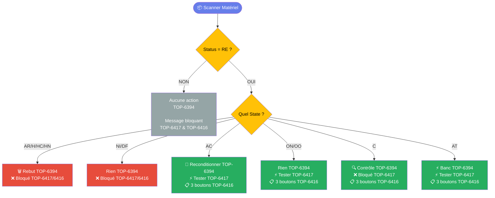
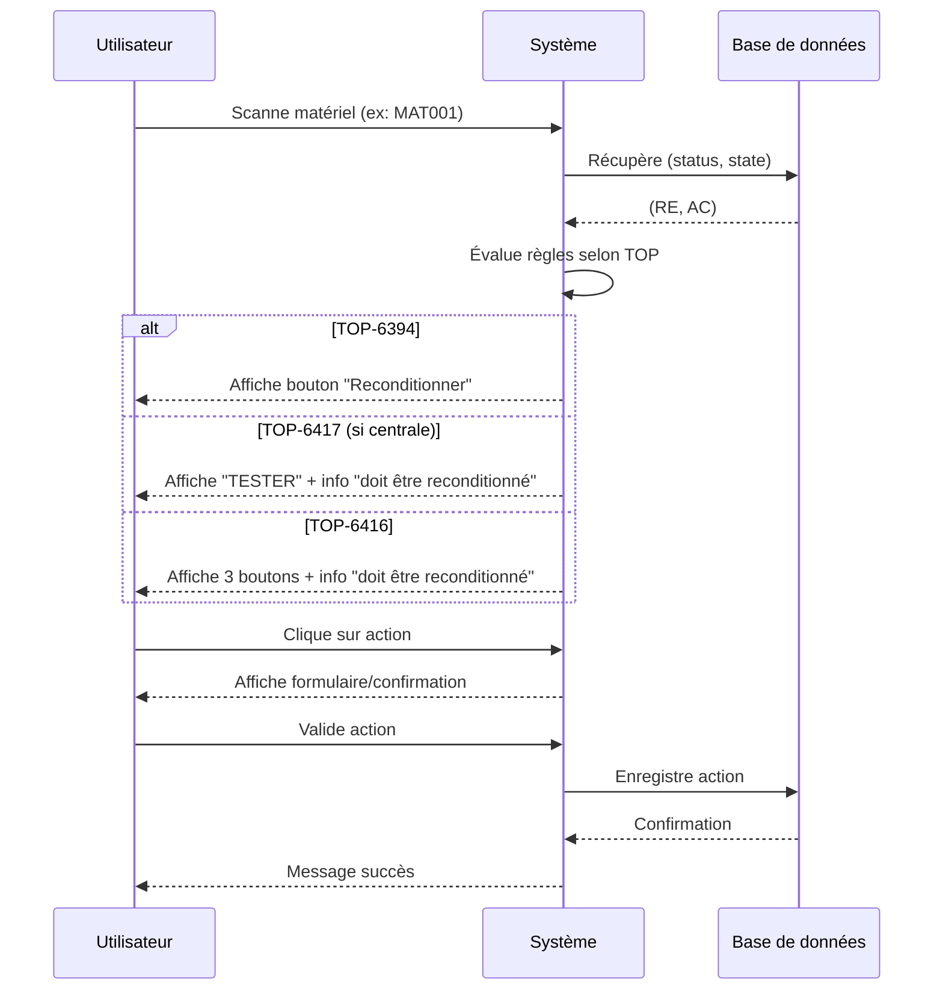

# 📊 Diagramme des Workflows Logistique

## Vue d'ensemble générale

```mermaid
flowchart TD
    Start([Scanner Matériel]) --> CheckStatus{Status ?}

    CheckStatus -->|NR, PD, RB, I, A, C, D, N, P, PC, R, S, T| StatusNotRE[❌ Status ≠ RE]
    CheckStatus -->|RE| StatusRE[✓ Status = RE]

    StatusNotRE --> T6394_NoAction[TOP-6394: Pas de bouton]
    StatusNotRE --> T6417_Block[TOP-6417: Message bloquant]
    StatusNotRE --> T6416_Block[TOP-6416: Message bloquant]

    StatusRE --> CheckState{State ?}

    CheckState -->|AR, H, HC, HN| StateRebut[State: Inopérant]
    CheckState -->|NI, DF| StateNonConforme[State: Non conforme]
    CheckState -->|AC| StateAC[State: AC]
    CheckState -->|ON, OO| StateRecond[State: Reconditionné]
    CheckState -->|C| StateC[State: C]
    CheckState -->|AT| StateAT[State: AT]

    StateRebut --> A6394_1[🗑️ Mettre au rebut]
    StateRebut --> A6417_1[❌ BLOQUÉ: Doit être rebuté]
    StateRebut --> A6416_1[❌ BLOQUÉ: Doit être rebuté]

    StateNonConforme --> A6394_2[Pas de bouton]
    StateNonConforme --> A6417_2[❌ BLOQUÉ: Régulariser]
    StateNonConforme --> A6416_2[❌ BLOQUÉ: Régulariser]

    StateAC --> A6394_3[🔧 Reconditionner]
    StateAC --> A6417_3[⚡ TESTER + info]
    StateAC --> A6416_3[3 boutons + info]

    StateRecond --> A6394_4[Pas de bouton]
    StateRecond --> A6417_4[⚡ TESTER + info]
    StateRecond --> A6416_4[3 boutons + info]

    StateC --> A6394_5[🔍 Contrôle surface]
    StateC --> A6417_5[❌ BLOQUÉ: Doit être contrôlé]
    StateC --> A6416_5[3 boutons]

    StateAT --> A6394_6[⚡ Banc de test]
    StateAT --> A6417_6[⚡ TESTER]
    StateAT --> A6416_6[3 boutons + info]

    style Start fill:#667eea,color:#fff
    style StatusRE fill:#4caf50,color:#fff
    style StatusNotRE fill:#f44336,color:#fff
    style A6394_1 fill:#f44336,color:#fff
    style A6394_3 fill:#2196f3,color:#fff
    style A6394_5 fill:#9c27b0,color:#fff
    style A6394_6 fill:#ff9800,color:#fff
```



---

## Diagramme de décision simplifié



---

## 📋 Tableau récapitulatif

| Status | State | TOP-6394<br/>Identification | TOP-6417<br/>Banc Test (centrale) | TOP-6416<br/>Contrôle Surface |
|--------|-------|----------------------------|-----------------------------------|------------------------------|
| **≠ RE** | * | ⚫ Rien | 🔴 Bloqué | 🔴 Bloqué |
| **RE** | AR/H/HC/HN | 🗑️ Rebut | 🔴 Bloqué: "rebuté" | 🔴 Bloqué: "rebuté" |
| **RE** | NI/DF | ⚫ Rien | 🔴 Bloqué: "régulariser" | 🔴 Bloqué: "régulariser" |
| **RE** | AC | 🔧 Reconditionner | 🟢 TESTER<br/>💬 "doit être reconditionné" | 🟢 3 boutons<br/>💬 "doit être reconditionné" |
| **RE** | ON/OO | ⚫ Rien | 🟢 TESTER<br/>💬 "déjà reconditionné" | 🟢 3 boutons<br/>💬 "déjà reconditionné" |
| **RE** | C | 🔍 Contrôle | 🔴 Bloqué: "doit être contrôlé" | 🟢 3 boutons |
| **RE** | AT | ⚡ Banc | 🟢 TESTER | 🟢 3 boutons<br/>💬 "doit être testé" |

**Légende:**
- 🟢 Action disponible
- 🔴 Bloqué avec message
- ⚫ Aucune action
- 💬 Message informatif
- **3 boutons** = Annuler / Non utilisable / Réutilisable

---

## 🔑 Règles clés

### TOP-6394 : Identification (simple)
```
SI status ≠ RE → Rien
SI status = RE:
    ├─ AR/H/HC/HN → 🗑️ Rebut
    ├─ NI/DF → Rien
    ├─ AC → 🔧 Reconditionner
    ├─ ON/OO → Rien
    ├─ C → 🔍 Contrôle surface
    └─ AT → ⚡ Banc test
```

### TOP-6417 : Banc de Test (avec condition centrale)
```
CONDITION: Matériel = centrale

SI status ≠ RE → BLOQUÉ (message selon status)
SI status = RE:
    ├─ AR/H/HC/HN → BLOQUÉ: "déclaré inopérant, doit être rebuté"
    ├─ NI/DF → BLOQUÉ: "état ne permet pas contrôle, régulariser"
    ├─ C → BLOQUÉ: "doit d'abord être contrôlé"
    ├─ AC → TESTER (+ popup) + info "doit être reconditionné"
    ├─ ON/OO → TESTER (+ popup) + info "déjà reconditionné"
    └─ AT → TESTER (+ popup)
```

### TOP-6416 : Contrôle de Surface
```
SI status ≠ RE → BLOQUÉ (message selon status)
SI status = RE:
    ├─ AR/H/HC/HN → BLOQUÉ: "déclaré inopérant, doit être rebuté"
    ├─ NI/DF → BLOQUÉ: "état ne permet pas contrôle, régulariser"
    ├─ AC → 3 BOUTONS + info "doit être reconditionné"
    ├─ ON/OO → 3 BOUTONS + info "déjà reconditionné"
    ├─ C → 3 BOUTONS
    └─ AT → 3 BOUTONS + info "doit être testé"

Les 3 boutons:
    1. Annuler
    2. Le matériel n'est plus utilisable
    3. Le matériel est réutilisable
```

---

## 🎯 Arbre de décision condensé

```
                           📦 SCAN MATÉRIEL
                                  |
                         ┌────────┴────────┐
                         |                 |
                    Status = RE ?      Status ≠ RE
                         |                 |
                         YES               NO
                         |                 |
                    ┌────┴────┐           └──► 6394: Rien
                    |         |                 6417: Bloqué
              State = ?   [Centrale?]           6416: Bloqué
                    |         |
        ┌───────────┼─────────┼─────────┬──────────┐
        |           |         |         |          |
    AR/H/HC/HN    NI/DF      AC      ON/OO     C    AT
        |           |         |         |       |     |
        |           |         |         |       |     |
    6394: 🗑️      6394: ⚫   6394: 🔧   6394: ⚫  6394: 🔍  6394: ⚡
    6417: 🔴      6417: 🔴   6417: 🟢   6417: 🟢  6417: 🔴  6417: 🟢
    6416: 🔴      6416: 🔴   6416: 🟢   6416: 🟢  6416: 🟢  6416: 🟢
```

---

## 💡 Synthèse ultra-simplifiée

### Pour TOP-6394 (Identification)
- Seuls les **RE** ont des actions
- 4 actions possibles selon state: Rebut / Reconditionner / Contrôle / Banc

### Pour TOP-6417 (Banc de Test)
- Nécessite **matériel = centrale**
- Beaucoup de cas bloqués (sécurité)
- Bouton TESTER uniquement pour states "sains": AC, ON, OO, AT

### Pour TOP-6416 (Contrôle Surface)
- Moins restrictif que TOP-6417
- 3 boutons pour presque tous les states RE (sauf inopérants et non-conformes)
- Permet de déclarer utilisable ou non

---

## 🔄 Flux utilisateur typique



---

## 📊 Matrice de compatibilité des actions

| State | Rebut | Reconditionner | Contrôle Surface | Banc Test (6394) | Banc Test (6417) |
|-------|-------|----------------|------------------|------------------|------------------|
| AR/H/HC/HN | ✅ 6394 | ❌ | ❌ | ❌ | ❌ |
| NI/DF | ❌ | ❌ | ❌ | ❌ | ❌ |
| AC | ❌ | ✅ 6394 | ✅ 6416 | ❌ | ✅ 6417 |
| ON/OO | ❌ | ❌ | ✅ 6416 | ❌ | ✅ 6417 |
| C | ❌ | ❌ | ✅ 6394 + 6416 | ❌ | ❌ |
| AT | ❌ | ❌ | ✅ 6416 | ✅ 6394 | ✅ 6417 |

---

## 🎓 Mémo rapide

**Question 1:** Mon matériel a status = "PD", que se passe-t-il ?
- **TOP-6394:** Rien
- **TOP-6417:** Bloqué
- **TOP-6416:** Bloqué

**Question 2:** Mon matériel est RE + AC, que puis-je faire ?
- **TOP-6394:** Le reconditionner
- **TOP-6417:** Le tester (si centrale)
- **TOP-6416:** Choisir parmi 3 options

**Question 3:** Mon matériel est RE + AR (inopérant), que faire ?
- **TOP-6394:** Le mettre au rebut
- **TOP-6417:** Bloqué - doit être rebuté dans Team Tool
- **TOP-6416:** Bloqué - doit être rebuté dans Team Tool

**Question 4:** Quelle est la différence principale entre les TOPs ?
- **TOP-6394:** Interface simple, 4 actions directes
- **TOP-6417:** Sécurisé, condition "centrale", focus sur les tests
- **TOP-6416:** Sécurisé, 3 choix pour déclarer l'état du matériel
